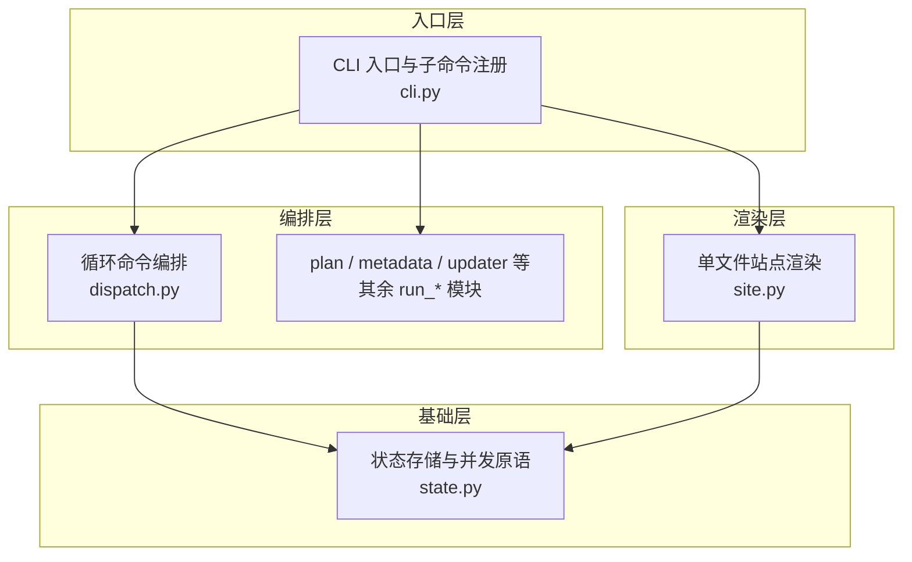
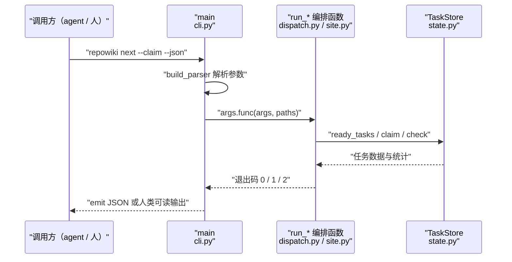
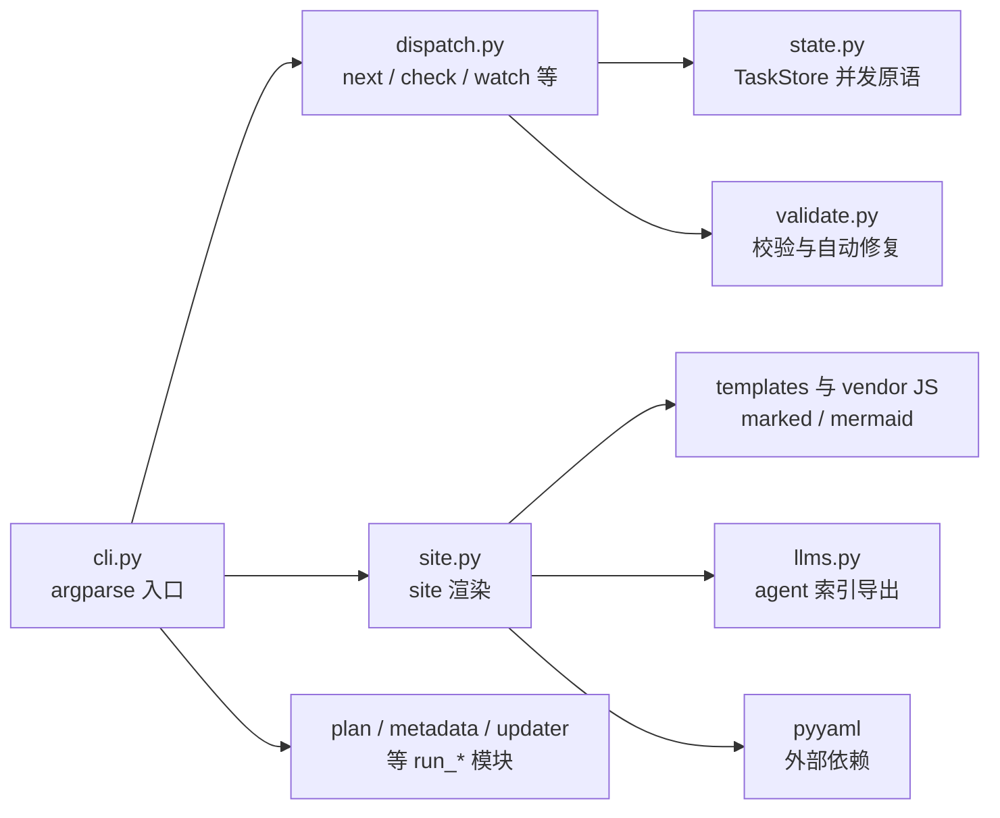

# CLI 命令与实现

## 目录
1. [简介](#简介)
2. [项目结构](#项目结构)
3. [核心组件](#核心组件)
4. [架构总览](#架构总览)
5. [详细组件分析](#详细组件分析)
6. [依赖关系分析](#依赖关系分析)
7. [性能与一致性考量](#性能与一致性考量)
8. [故障排查指南](#故障排查指南)
9. [结论](#结论)

## 简介

本页梳理 repowiki 命令行界面的全部子命令及其实现归属。CLI 是这个确定性构建系统的唯一入口：argparse 注册了 15 个顶层子命令（plan / next / check / touch / watch / release / finalize / site / update / stale / knowledge / status / coverage / clean / skill，其中 skill 另含 install 与 status 两个子命令），注册处只做参数绑定，真正的逻辑在各功能模块的 run_* 函数中。入口与注册位于 src/repowiki/cli.py，循环类命令的编排在 src/repowiki/dispatch.py，站点渲染在 src/repowiki/site.py；统一的退出码契约（0 成功、1 校验失败或用法错误、2 状态冲突）由 main 函数落地。

## 项目结构

CLI 相关实现集中在 src/repowiki/ 包内，按「入口层 → 编排层 → 渲染层」组织：

- src/repowiki/cli.py：argparse 入口，build_parser 注册全部子命令并以 set_defaults(func=...) 把每个命令绑定到对应 run_* 函数；main 负责构造 WikiPaths 与异常到退出码的映射；
- src/repowiki/dispatch.py：worker 循环命令的编排——next / check / release / status / touch / watch；
- src/repowiki/site.py：site 命令的实现——读取全部页面、内嵌源码片段与渲染库，产出单文件离线 HTML 与 llms 索引；
- 同层的 plan.py、metadata.py、updater.py、coverage.py、knowledge.py、skill_install.py、state.py 分别承载规划、finalize、增量更新、覆盖率、知识卡片、skill 安装与 clean 的 run_* 实现，由 cli.py 统一导入。

图表来源
- [src/repowiki/cli.py:13-24](file://src/repowiki/cli.py#L13-L24)

章节来源
- [src/repowiki/cli.py:1-33](file://src/repowiki/cli.py#L1-L33)
- [src/repowiki/site.py:1-11](file://src/repowiki/site.py#L1-L11)

## 核心组件

- build_parser（src/repowiki/cli.py）：子命令注册总览——每个子命令声明自己的参数并在 set_defaults 中绑定处理函数，skill 是唯一带二级子命令的顶层命令。
- main（src/repowiki/cli.py）：入口函数——解析参数、仅在命令需要仓库路径时构造 WikiPaths、调用绑定的处理函数，并把 ConflictError / StateError / UsageError 分别映射为退出码 2 / 1 / 1。
- run_next 与 run_check（src/repowiki/dispatch.py）：worker 循环的领取端与校验端——前者原子发放任务并附带 instructions 与 busy 信号，后者校验产出、自动修复、翻转状态并展开后续任务。
- run_touch / run_release / run_status / run_watch（src/repowiki/dispatch.py）：心跳续期、认领释放、进度观测与阻塞监控的命令入口。
- run_site（src/repowiki/site.py）：站点导出——聚合页面与知识页、抽取 file:// 引用对应的源码片段、渲染自包含 HTML 并导出 llms.txt / llms-full.txt。

章节来源
- [src/repowiki/cli.py:27-33](file://src/repowiki/cli.py#L27-L33)
- [src/repowiki/cli.py:170-183](file://src/repowiki/cli.py#L170-L183)
- [src/repowiki/dispatch.py:50-76](file://src/repowiki/dispatch.py#L50-L76)
- [src/repowiki/dispatch.py:205-262](file://src/repowiki/dispatch.py#L205-L262)
- [src/repowiki/site.py:36-88](file://src/repowiki/site.py#L36-L88)

## 架构总览

所有命令共享同一条调用路径：调用方（人或 agent CLI）执行 `repowiki <命令>`，main 用 build_parser 生成的解析器处理参数，再通过 args.func 调用对应的 run_* 编排函数；编排函数操作 TaskStore 与仓库文件后，以退出码表达结果（0 成功、1 失败、2 冲突），输出经 emit 按 --json 或人类可读双路返回。这一结构使 agent 可以程序化消费全部命令，也使主会话能凭退出码驱动 worker 循环。

图表来源
- [src/repowiki/cli.py:170-183](file://src/repowiki/cli.py#L170-L183)

章节来源
- [src/repowiki/cli.py:170-183](file://src/repowiki/cli.py#L170-L183)
- [src/repowiki/dispatch.py:50-76](file://src/repowiki/dispatch.py#L50-L76)

## 详细组件分析

### 规划组：plan 与 knowledge

- 职责：扫描仓库并生成任务清单，必要时追加知识卡片任务集。
- 关键行为：plan 接受 --replan（丢弃已有目录重来）、--force（有任务执行中时强行重规划）、--max-pages（限制页面任务数供低成本试跑）、--knowledge（同时追加知识任务）、--locale auto|zh|en（产出语言自动检测或显式指定），绑定 run_plan（src/repowiki/cli.py:35-46）。
- 关键行为：knowledge 以 --categories 指定自定义机制卡片类别文件（整表替换内置六类并持久化），绑定 run_knowledge（src/repowiki/cli.py:122-128）。
- 实现要点：注册处仅用 argparse choices 限定 locale 取值，auto 的 README 权重检测逻辑在 run_plan 内部完成。

章节来源
- [src/repowiki/cli.py:35-46](file://src/repowiki/cli.py#L35-L46)
- [src/repowiki/cli.py:122-128](file://src/repowiki/cli.py#L122-L128)

### Worker 循环组：next / touch / check / release / status / watch

- 职责：支撑多 worker 并发协作的领取、心跳、校验、释放与监控。
- 关键行为：next --claim 原子领取且一次只发放一个任务，返回体携带完整 instructions 与 busy 字段（src/repowiki/cli.py:48-53；src/repowiki/dispatch.py:50-76）；check 以 --task 或 --all 选择目标，--worker 做认领归属校验、--force 允许代查（src/repowiki/cli.py:55-65；src/repowiki/dispatch.py:205-262）。
- 关键行为：touch 以 --task 刷新认领（心跳）；release --force 是 exhausted 毒任务的唯一重置通道（src/repowiki/cli.py:67-88；src/repowiki/dispatch.py:91-124）；watch 以 --interval（默认 10 秒）与 --timeout（默认 3600 秒）阻塞监控，退出码 0 表示全部完成、1 表示停滞或超时（src/repowiki/cli.py:74-80；src/repowiki/dispatch.py:127-200）。
- 实现要点：循环组全部命令支持 --json，这是无人值守 worker 脚本用 jq 解析任务规格的前提；status 汇总 failed / exhausted / stale 认领供人工干预（src/repowiki/cli.py:130-133；src/repowiki/dispatch.py:99-116）。

章节来源
- [src/repowiki/cli.py:48-88](file://src/repowiki/cli.py#L48-L88)
- [src/repowiki/cli.py:130-133](file://src/repowiki/cli.py#L130-L133)
- [src/repowiki/dispatch.py:50-124](file://src/repowiki/dispatch.py#L50-L124)
- [src/repowiki/dispatch.py:127-200](file://src/repowiki/dispatch.py#L127-L200)

### 增量更新组：update / stale / coverage

- 职责：把 git 变更映射为增量重写任务、提供只读过期门禁与覆盖率报告。
- 关键行为：update --since <sha> 从指定提交做 diff（默认取 metadata 中的 last_commit_id），--dirty 额外纳入未提交与未跟踪变更，产出 page_update 任务集（src/repowiki/cli.py:103-109）。
- 关键行为：stale 是 update 的只读版本，报告哪些页面/卡片/模块会过期而不写任何状态；--fail-if-stale 在命中时以退出码 1 结束，供 PR 门禁使用（src/repowiki/cli.py:111-120）。
- 关键行为：coverage 只读统计 wiki 从未引用的仓库文件与逐页引用密度（src/repowiki/cli.py:135-138）。

章节来源
- [src/repowiki/cli.py:103-120](file://src/repowiki/cli.py#L103-L120)
- [src/repowiki/cli.py:135-138](file://src/repowiki/cli.py#L135-L138)

### 站点导出组：finalize 与 site

- 职责：把完成的 wiki 组装为元数据并渲染成可分发的单文件离线站点。
- 关键行为：finalize 要求全部任务 done 后聚合 repowiki-metadata.json（src/repowiki/cli.py:90-93）；site 强依赖该元数据——文件缺失或损坏时抛 UsageError 提示先 finalize（src/repowiki/site.py:36-44）。
- 关键行为：run_site 依次收集总览与章节页（_collect_pages）、按 state/catalog.json 的规划顺序取节点（clean 之后退化为按磁盘目录构建节点，站点仍可重建）、构建侧边导航（_build_nav）、把 knowledge/<locale>/ 下的模块文档与卡片并入「知识库」导航章（_collect_knowledge）、抽取每个 file:// 引用对应的源码行（_collect_snippets），最后渲染 HTML 并以临时文件加 os.replace 原子写出 wiki.html，再导出 llms 索引，--open 生成后调用系统浏览器（src/repowiki/site.py:36-88）。
- 实现要点：marked 与 mermaid 渲染库从包内 vendor 目录内嵌进 HTML，实现零网络离线渲染；内联脚本里的 `</script` 会被转义为 `<\/script` 防止提前闭合标签（src/repowiki/site.py:363-384）；源码片段超过 MAX_SNIPPET_LINES（20000 行）则跳过，二进制文件（前 8KB 含空字节）不抽取（src/repowiki/site.py:33、326-358）。

章节来源
- [src/repowiki/cli.py:90-101](file://src/repowiki/cli.py#L90-L101)
- [src/repowiki/site.py:36-88](file://src/repowiki/site.py#L36-L88)
- [src/repowiki/site.py:134-173](file://src/repowiki/site.py#L134-L173)
- [src/repowiki/site.py:326-358](file://src/repowiki/site.py#L326-L358)
- [src/repowiki/site.py:363-384](file://src/repowiki/site.py#L363-L384)

### skill 安装组：skill install 与 skill status

- 职责：管理随 CLI 一起分发的 agent skill——拷入各客户端的全局 skills 目录并核对已装版本。
- 关键行为：skill 是唯一需要二级子命令的顶层命令（install / status 均为 required）；install 的 --agent 可重复出现且取值限定在 AGENTS 常量内（claude / codex / zcode / cursor / opencode 等），--target 可多次指定任意自定义 skills 目录；status 用同一套目标参数检查已装版本与本包版本的差异（src/repowiki/cli.py:145-165）。
- 实现要点：该组命令不需要仓库上下文——main 仅在 args.repo 存在时构造 WikiPaths，否则传 None，因此 skill 命令可在任意目录执行（src/repowiki/cli.py:172）。

章节来源
- [src/repowiki/cli.py:145-165](file://src/repowiki/cli.py#L145-L165)
- [src/repowiki/cli.py:170-172](file://src/repowiki/cli.py#L170-L172)

### 错误处理与退出码映射

- 职责：把模块层抛出的领域异常统一转换为进程退出码与结构化错误输出。
- 关键行为：ConflictError 映射为 2（状态冲突，典型场景是任务已被其他 worker 认领）；StateError 映射为 1（持久化状态损坏，数据保护性中止）；UsageError 映射为 1（用法或输入错误）；三者均经 emit_error 按 --json 输出带 kind 的错误体（src/repowiki/cli.py:170-183）。
- 实现要点：退出码契约同时写在 cli.py 模块 docstring 与 errors.py 中，是 worker 循环与 CI 门禁判断进展的稳定接口（src/repowiki/cli.py:1-5）。

章节来源
- [src/repowiki/cli.py:1-5](file://src/repowiki/cli.py#L1-L5)
- [src/repowiki/cli.py:170-183](file://src/repowiki/cli.py#L170-L183)

## 依赖关系分析

- 上游（cli.py 依赖的模块）：入口层一次导入 dispatch、coverage、knowledge、metadata、plan、site、skill_install、state（run_clean）、updater（run_stale / run_update）与 output（emit_error），形成「薄入口、厚模块」的结构（src/repowiki/cli.py:13-24）。
- 中游（dispatch.py 依赖的模块）：依赖 state.TaskStore 做全部并发状态操作，依赖 validate 的各 check_* 函数做产出校验，依赖 catalog / tasks / scanner 做 catalog 通过后的任务展开（src/repowiki/dispatch.py:14-28）。
- 中游（site.py 依赖的模块）：依赖 templates 提供站点壳与占位符渲染、llms 导出 llms.txt / llms-full.txt、validate.extract_refs 抽取 file:// 引用、i18n.strings 提供界面文案（src/repowiki/site.py:23-31）。
- 外部依赖：pyyaml 用于解析知识模块的 _module.yaml 与卡片 YAML front matter；其余均为标准库（argparse / json / os / re / webbrowser）。
- 下游（命令产物被谁消费）：worker 循环消费 next 的 instructions 与退出码；CI 消费 stale 的 --fail-if-stale 退出码；人与 agent 分别消费 wiki.html 与 llms 索引。

图表来源
- [src/repowiki/cli.py:13-24](file://src/repowiki/cli.py#L13-L24)
- [src/repowiki/site.py:23-31](file://src/repowiki/site.py#L23-L31)

章节来源
- [src/repowiki/cli.py:13-24](file://src/repowiki/cli.py#L13-L24)
- [src/repowiki/dispatch.py:14-28](file://src/repowiki/dispatch.py#L14-L28)
- [src/repowiki/site.py:23-31](file://src/repowiki/site.py#L23-L31)

## 性能与一致性考量

- 单文件站点的体积控制：全部页面、知识页与源码片段一次性内嵌进一个 HTML（约 4-5 MB 量级）；单个引用区间超过 20000 行即跳过而非撑爆文件，二进制文件直接排除（src/repowiki/site.py:33、326-358）。
- 原子写出：wiki.html 先写 `.tmp` 临时文件再 os.replace 替换，读方永远看不到半成品（src/repowiki/site.py:68-72）。
- 幂等与降级：site 可在 finalize、update 或手动改页后随时重跑；执行过 clean 后 _ordered_nodes 退化为磁盘目录序，站点仍可构建，只损失规划顺序（src/repowiki/site.py:134-144）。
- watch 的轮询模型：固定间隔轮询 stats 而非长驻事件循环，与 repowiki「短命 CLI 进程」的定位一致；停滞判定会先取一次新鲜统计，避免快照过期造成假停滞（src/repowiki/dispatch.py:145-200）。
- 并发一致性：check 的认领归属守卫与 done 终态只读路径，保证多 worker 同时 check 时状态不被误翻、终态不被重写（src/repowiki/dispatch.py:229-262）。

章节来源
- [src/repowiki/site.py:33-88](file://src/repowiki/site.py#L33-L88)
- [src/repowiki/site.py:134-144](file://src/repowiki/site.py#L134-L144)
- [src/repowiki/dispatch.py:145-200](file://src/repowiki/dispatch.py#L145-L200)
- [src/repowiki/dispatch.py:229-262](file://src/repowiki/dispatch.py#L229-L262)

## 故障排查指南

- `repowiki site` 报「未找到 repowiki-metadata.json」：尚未 finalize 或 finalize 未成功完成；先让全部任务 done 再执行 finalize（src/repowiki/site.py:37-40）。
- `repowiki site` 报「repowiki-metadata.json 损坏」：重新运行 finalize 覆盖生成即可（src/repowiki/site.py:43-44）。
- `repowiki site` 报「未找到任何已生成的 wiki 页面」：content 目录为空，检查产出语言目录（zh/en）与页面任务是否真正完成（src/repowiki/site.py:48-49）。
- 命令退出码为 2：状态冲突——任务被他人认领或已 done；worker 应回到 next 领取新任务而非重试同一任务（src/repowiki/cli.py:175-177）。
- 命令退出码为 1：校验失败、用法错误或状态损坏三种可能，看 emit_error 输出的 kind（usage / state_corrupt）区分处理（src/repowiki/cli.py:178-183）。
- 在无仓库目录下执行 plan 等命令失败：除 skill 组外的命令都需要 repo 参数，main 只在 args.repo 存在时构造 WikiPaths（src/repowiki/cli.py:172）。
- 生成的站点里某个源码引用点开无内容：该引用区间超过 20000 行被跳过、或目标文件是二进制被排除，属设计内行为（src/repowiki/site.py:326-358）。

章节来源
- [src/repowiki/cli.py:170-183](file://src/repowiki/cli.py#L170-L183)
- [src/repowiki/site.py:36-49](file://src/repowiki/site.py#L36-L49)
- [src/repowiki/site.py:326-358](file://src/repowiki/site.py#L326-L358)

## 结论

CLI 层是 repowiki「确定性构建系统」的可见表面：15 个顶层子命令按规划（plan / knowledge）、worker 循环（next / touch / check / release / status / watch）、增量更新（update / stale / coverage）、站点导出（finalize / site / clean）与 skill 安装五组划分，argparse 注册只做参数到 run_* 函数的绑定，业务逻辑全部下沉到功能模块；退出码 0 / 1 / 2 与 --json 输出构成 agent 与 CI 消费的稳定契约。使用建议：驱动 agent 全程带 --json 走循环组命令，人用 site --open 直接查看成果，CI 用 stale --fail-if-stale 做 wiki 过期门禁。

章节来源
- [src/repowiki/cli.py:27-33](file://src/repowiki/cli.py#L27-L33)
- [src/repowiki/cli.py:170-183](file://src/repowiki/cli.py#L170-L183)
- [src/repowiki/site.py:36-88](file://src/repowiki/site.py#L36-L88)

<cite>
**本文引用的文件**
- [cli.py](file://src/repowiki/cli.py)
- [dispatch.py](file://src/repowiki/dispatch.py)
- [site.py](file://src/repowiki/site.py)
</cite>
