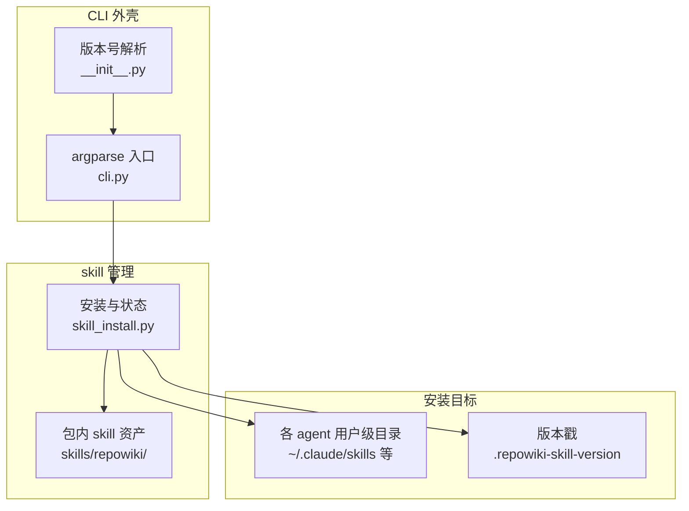
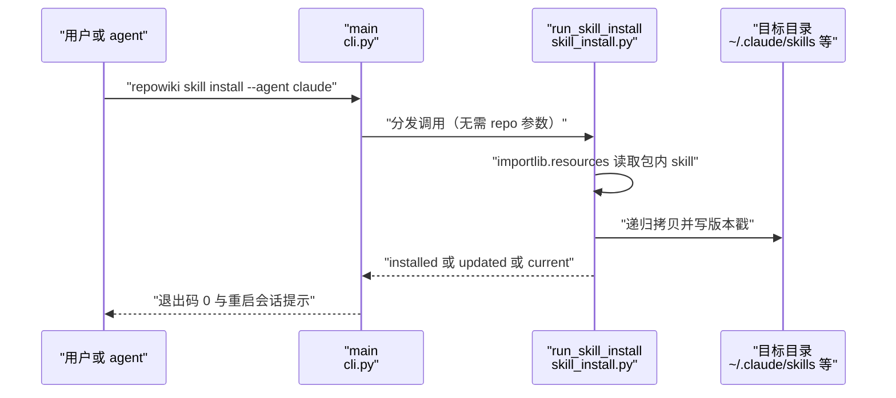
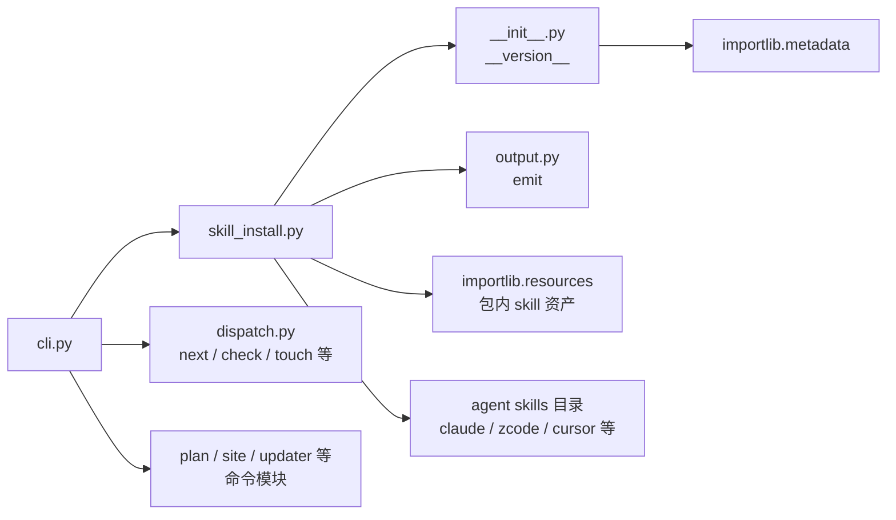

# skill 安装与 CLI 骨架

## 目录
1. [简介](#简介)
2. [项目结构](#项目结构)
3. [核心组件](#核心组件)
4. [架构总览](#架构总览)
5. [详细组件分析](#详细组件分析)
6. [依赖关系分析](#依赖关系分析)
7. [性能与一致性考量](#性能与一致性考量)
8. [故障排查指南](#故障排查指南)
9. [结论](#结论)

## 简介

本页覆盖 repowiki 命令行体系的两个「外壳」主题：其一是 agent skill 的安装与体检——skill 文件随 wheel 一起分发（`repowiki/skills/repowiki/`），`skill install` 把包内副本拷贝进各 agent 的用户级 skills 目录并盖上版本戳，`skill status` 据此报告安装状态 [skill_install.py:1-7](file://src/repowiki/skill_install.py#L1-L7)；其二是 CLI 骨架——cli.py 用 argparse 注册全部 14 个子命令，按需构建 WikiPaths（skill 组无 repo 参数），并把三类异常映射为 0 / 1 / 2 退出码 [cli.py:1-4](file://src/repowiki/cli.py#L1-L4)；`__init__.py` 则提供包版本号的解析回退链，供版本戳比对与 `--version` 输出使用 [__init__.py:13-21](file://src/repowiki/__init__.py#L13-L21)。

## 项目结构

- `src/repowiki/skill_install.py`：skill 安装器（153 行）。定义 SKILL_NAME（repowiki）与版本戳文件名 `.repowiki-skill-version`，以及 agents / claude / codex / zcode / cursor / opencode 六个 `--agent` 取值 [skill_install.py:17-20](file://src/repowiki/skill_install.py#L17-L20)。
- `src/repowiki/cli.py`：命令行入口（187 行）。build_parser 注册 plan / next / check / touch / watch / release / finalize / site / update / stale / knowledge / status / coverage / clean 与 skill 组；main 负责分发与退出码映射 [cli.py:27-33](file://src/repowiki/cli.py#L27-L33) [cli.py:170-183](file://src/repowiki/cli.py#L170-L183)。
- `src/repowiki/__init__.py`：包元数据（21 行）。模块文档用 8 行伪码概括了 worker 循环契约，随后是版本号三级回退链 [__init__.py:1-11](file://src/repowiki/__init__.py#L1-L11)。
- `src/repowiki/skills/repowiki/`：随包分发的 skill 资产目录，install 的拷贝源；拷贝时版本戳文件本身被跳过、以当前版本重写 [skill_install.py:36-37](file://src/repowiki/skill_install.py#L36-L37) [skill_install.py:53-61](file://src/repowiki/skill_install.py#L53-L61)。

**图表来源**
- [cli.py:145-165](file://src/repowiki/cli.py#L145-L165)
- [skill_install.py:17-37](file://src/repowiki/skill_install.py#L17-L37)
- [skill_install.py:53-61](file://src/repowiki/skill_install.py#L53-L61)

**章节来源**
- [skill_install.py:1-20](file://src/repowiki/skill_install.py#L1-L20)
- [cli.py:1-4](file://src/repowiki/cli.py#L1-L4)
- [__init__.py:1-21](file://src/repowiki/__init__.py#L1-L21)

## 核心组件

- build_parser（cli.py）：构建全部子命令的 argparse 解析器，`--version` 直接打印包版本 [cli.py:27-33](file://src/repowiki/cli.py#L27-L33)。
- main（cli.py）：入口函数——按需构建 WikiPaths、分发 args.func、把 ConflictError / StateError / UsageError 映射为 2 / 1 / 1 退出码 [cli.py:170-183](file://src/repowiki/cli.py#L170-L183)。
- run_skill_install（skill_install.py）：逐目标幂等安装——版本戳一致且 SKILL.md 存在则跳过（current），否则拷贝并写戳（installed / updated）[skill_install.py:79-98](file://src/repowiki/skill_install.py#L79-L98)。
- run_skill_status（skill_install.py）：逐目标报告五态中的四态——missing / unstamped / outdated / newer / current [skill_install.py:101-122](file://src/repowiki/skill_install.py#L101-L122)。
- agent_skills_dirs（skill_install.py）：六个 agent 值到用户级 skills 目录的映射，每次调用重建以便测试替换 Path.home [skill_install.py:23-33](file://src/repowiki/skill_install.py#L23-L33)。
- _resolve_targets（skill_install.py）：合并 `--agent` 与 `--target` 指定的目标并去重；两者都缺省时回落到跨工具共享目录 `~/.agents/skills` [skill_install.py:40-50](file://src/repowiki/skill_install.py#L40-L50)。
- _copy_tree（skill_install.py）：递归拷贝包内 skill 资产，跳过旧版本戳文件 [skill_install.py:53-61](file://src/repowiki/skill_install.py#L53-L61)。
- _version_tuple（skill_install.py）：把版本字符串按点分段抽取数字成元组，供 stale / current 判定比较 [skill_install.py:71-76](file://src/repowiki/skill_install.py#L71-L76)。
- bundled_skill（skill_install.py）：以 importlib.resources 取得包内 `skills/repowiki` 的 Traversable，兼容 wheel 与源码树两种安装形态 [skill_install.py:36-37](file://src/repowiki/skill_install.py#L36-L37)。
- `__version__`（__init__.py）：版本号回退链 repowiki-cli → repowiki → 0.0.0 [__init__.py:13-21](file://src/repowiki/__init__.py#L13-L21)。

**章节来源**
- [skill_install.py:17-122](file://src/repowiki/skill_install.py#L17-L122)
- [cli.py:27-33](file://src/repowiki/cli.py#L27-L33)
- [cli.py:170-183](file://src/repowiki/cli.py#L170-L183)
- [__init__.py:13-21](file://src/repowiki/__init__.py#L13-L21)

## 架构总览

skill 命令是 CLI 中唯一不需要仓库上下文的子命令组：main 仅在参数含 repo 时构建 WikiPaths，skill 组的 func 直接接收 paths=None [cli.py:170-172](file://src/repowiki/cli.py#L170-L172)。install 的数据流是「包内资产 → 目标目录」，status 的数据流是「目标目录 → 与包版本比对」；install 结束时会提示重启 agent 客户端会话以加载新 skill，并建议升级 repowiki 后重跑安装 [skill_install.py:94-98](file://src/repowiki/skill_install.py#L94-L98)。

**图表来源**
- [cli.py:170-183](file://src/repowiki/cli.py#L170-L183)
- [skill_install.py:79-98](file://src/repowiki/skill_install.py#L79-L98)

**章节来源**
- [cli.py:170-183](file://src/repowiki/cli.py#L170-L183)
- [skill_install.py:79-122](file://src/repowiki/skill_install.py#L79-L122)

## 详细组件分析

### skill install：目录映射与幂等安装

- 职责：把 wheel 内置的 skill 副本安装进指定 agent 的用户级 skills 目录，并写版本戳供后续比对 [skill_install.py:1-7](file://src/repowiki/skill_install.py#L1-L7)。
- 关键行为：`--agent` 支持 agents / claude / codex / zcode / cursor / opencode 六个值，分别映射到 `~/.agents/skills`、`~/.claude/skills`、`~/.codex/skills`、`~/.zcode/skills`、`~/.cursor/skills` 与 `~/.config/opencode/skills`；`--target` 可追加任意自定义目录（expanduser 展开波浪线）；两者皆缺省时安装到共享目录 `~/.agents/skills`；目标按出现顺序去重 [skill_install.py:20](file://src/repowiki/skill_install.py#L20) [skill_install.py:23-50](file://src/repowiki/skill_install.py#L23-L50)。
- 实现要点：幂等判定在 run_skill_install 内——读旧戳，若旧戳等于当前包版本且 SKILL.md 存在则记 action 为 current 并跳过拷贝；否则递归拷贝（_copy_tree 跳过旧戳文件）、重写版本戳，按「此前无戳」记 installed、「有旧戳」记 updated [skill_install.py:79-93](file://src/repowiki/skill_install.py#L79-L93)。版本比较用 _version_tuple 逐段取数字，容忍非数字后缀 [skill_install.py:71-76](file://src/repowiki/skill_install.py#L71-L76)。

**章节来源**
- [skill_install.py:17-98](file://src/repowiki/skill_install.py#L17-L98)

### skill status：版本体检报告

- 职责：对照当前包版本，报告各目标目录中 skill 的安装健康度。
- 关键行为：目标解析与 install 相同；逐目录判定——SKILL.md 不存在为 missing；戳文件缺失或不可读为 unstamped（提示可能是手工拷贝，建议重跑 skill install 纳管）；戳版本小于包版本为 outdated；大于包版本为 newer（目标反而比包新）；相等为 current [skill_install.py:101-122](file://src/repowiki/skill_install.py#L101-L122) [skill_install.py:138-142](file://src/repowiki/skill_install.py#L138-L142)。
- 实现要点：JSON 输出附带 package_version 便于脚本比对；人类可读输出对 outdated / newer 打印「戳版本 vs 包版本」对照 [skill_install.py:120-121](file://src/repowiki/skill_install.py#L120-L121) [skill_install.py:145-153](file://src/repowiki/skill_install.py#L145-L153)。

**章节来源**
- [skill_install.py:101-153](file://src/repowiki/skill_install.py#L101-L153)

### CLI 骨架：argparse 注册与退出码分发

- 职责：把 14 个子命令的参数面统一定义，并把执行结果与异常翻译成稳定的进程退出码。
- 关键行为：每个子命令用 set_defaults(func=lambda a, paths: ...) 绑定处理函数，func 统一接收 (args, paths)；除 skill 组外每个子命令都有位置参数 repo 与 `--json` 开关；check 支持 `--task` / `--all` / `--worker` / `--force`，watch 默认 10 秒轮询、3600 秒超时，update 与 stale 共享 `--since` / `--dirty`，stale 另有供 CI 门禁的 `--fail-if-stale` [cli.py:35-143](file://src/repowiki/cli.py#L35-L143)。
- 实现要点：skill 是唯一带二级子解析器的命令组（install / status 均 required），且不声明 repo 参数；main 里 paths 仅在 args 有 repo 属性时构建为 WikiPaths，否则为 None [cli.py:145-165](file://src/repowiki/cli.py#L145-L165) [cli.py:170-172](file://src/repowiki/cli.py#L170-L172)。异常映射遵循模块文档约定：ConflictError（如任务被他人认领）返回 2，StateError（状态损坏）与 UsageError（用法错误）返回 1，正常完成返回处理函数给出的 0 [cli.py:1-4](file://src/repowiki/cli.py#L1-L4) [cli.py:173-183](file://src/repowiki/cli.py#L173-L183)。

**章节来源**
- [cli.py:1-4](file://src/repowiki/cli.py#L1-L4)
- [cli.py:27-187](file://src/repowiki/cli.py#L27-L187)

### 版本号解析回退链（__init__.py）

- 职责：在任何安装形态下都给出可用的包版本号。
- 关键行为：先向 importlib.metadata 查询新分发名 repowiki-cli；查不到（PackageNotFoundError）再试历史分发名 repowiki——注释说明历史安装可能仍登记为旧名；仍查不到（未安装的源码树直接运行）回退为字面量 0.0.0 [__init__.py:13-21](file://src/repowiki/__init__.py#L13-L21)。
- 实现要点：该值是 skill 版本戳比对与 `--version` 输出的基准；回退到 0.0.0 时，status 会把已装副本报为 newer（0.0.0 小于任何正式版本戳），install 则总是执行更新——行为安全偏向「宁可重装」[skill_install.py:111-119](file://src/repowiki/skill_install.py#L111-L119)。
- 附带内容：模块文档以 8 行伪码内嵌了 worker 循环契约（next 领取、busy 判断、执行规格、check 收尾），是整个包设计意图的最短陈述 [__init__.py:1-11](file://src/repowiki/__init__.py#L1-L11)。

**章节来源**
- [__init__.py:1-21](file://src/repowiki/__init__.py#L1-L21)
- [skill_install.py:101-122](file://src/repowiki/skill_install.py#L101-L122)

## 依赖关系分析

- cli.py 是全命令的汇聚点：从 dispatch.py 引入 next / check / touch / watch / release / status 六个运行时命令，从各自模块引入 plan、coverage、knowledge、finalize（metadata）、site、stale / update（updater）、clean（state）与 skill 组（skill_install），并 re-export 三个异常类型 [cli.py:13-24](file://src/repowiki/cli.py#L13-L24)。
- skill_install.py 依赖 `__init__.py` 的 `__version__` 做戳比对、output.py 的 emit 做双形态输出，以及标准库 importlib.resources 读取包内资产 [skill_install.py:11-15](file://src/repowiki/skill_install.py#L11-L15)。
- `__init__.py` 依赖标准库 importlib.metadata，无任何包内依赖，是依赖图的根 [__init__.py:12-13](file://src/repowiki/__init__.py#L12-L13)。
- 上游消费方：skill 文件的最终消费者是各 agent CLI（claude / codex / zcode / cursor / opencode 及通用 agents 目录），repowiki 只负责把文件放到它们的 skills 目录 [skill_install.py:23-33](file://src/repowiki/skill_install.py#L23-L33)。

**图表来源**
- [cli.py:13-24](file://src/repowiki/cli.py#L13-L24)
- [skill_install.py:11-15](file://src/repowiki/skill_install.py#L11-L15)
- [__init__.py:12-13](file://src/repowiki/__init__.py#L12-L13)
- [skill_install.py:23-33](file://src/repowiki/skill_install.py#L23-L33)

**章节来源**
- [cli.py:13-24](file://src/repowiki/cli.py#L13-L24)
- [skill_install.py:11-15](file://src/repowiki/skill_install.py#L11-L15)
- [__init__.py:12-21](file://src/repowiki/__init__.py#L12-L21)

## 性能与一致性考量

- 安装是纯本地字节拷贝：_copy_tree 逐文件 read_bytes / write_bytes，无网络、无解压依赖，wheel 与源码树经 importlib.resources 统一访问 [skill_install.py:11](file://src/repowiki/skill_install.py#L11) [skill_install.py:53-61](file://src/repowiki/skill_install.py#L53-L61)。
- 幂等性：版本戳一致即跳过拷贝，重复执行 install 无副作用；这使「升级后重跑 skill install」成为被官方提示的标准升级路径 [skill_install.py:85-88](file://src/repowiki/skill_install.py#L85-L88) [skill_install.py:94-97](file://src/repowiki/skill_install.py#L94-L97)。
- 一致性基准单一：installed / updated / outdated / current 全部以 `__version__` 为唯一基准，而 `__version__` 有确定的三级回退链，避免多源版本号打架 [skill_install.py:85](file://src/repowiki/skill_install.py#L85) [__init__.py:15-21](file://src/repowiki/__init__.py#L15-L21)。
- 版本比较的容错：_version_tuple 逐段只取数字，`0.6.0rc1` 之类后缀不会崩溃；目录映射每次调用重建而非模块级缓存，保证测试可替换 Path.home、运行期家目录变更也能生效 [skill_install.py:71-76](file://src/repowiki/skill_install.py#L71-L76) [skill_install.py:23-24](file://src/repowiki/skill_install.py#L23-L24)。
- 退出码契约稳定：0 / 1 / 2 三类语义在模块文档中显式声明并被 main 统一映射，脚本与 CI 可依赖该契约 [cli.py:1-4](file://src/repowiki/cli.py#L1-L4)。

**章节来源**
- [skill_install.py:23-98](file://src/repowiki/skill_install.py#L23-L98)
- [__init__.py:13-21](file://src/repowiki/__init__.py#L13-L21)
- [cli.py:1-4](file://src/repowiki/cli.py#L1-L4)

## 故障排查指南

- `skill status` 报 unstamped（unknown version）：目标目录里是手工拷贝的 skill、没有版本戳；重跑 `repowiki skill install` 即可纳管并补写戳文件 [skill_install.py:108-110](file://src/repowiki/skill_install.py#L108-L110) [skill_install.py:138-142](file://src/repowiki/skill_install.py#L138-L142)。
- `skill status` 报 outdated：目标里的版本戳低于当前包版本，通常是 `pip install --upgrade` 后未重装 skill；重跑 `skill install` 即更新为 updated [skill_install.py:111-113](file://src/repowiki/skill_install.py#L111-L113) [skill_install.py:130-133](file://src/repowiki/skill_install.py#L130-L133)。
- `skill status` 报 newer than package：目标目录的版本戳比当前包还新，常见于从源码树（未安装、版本回退为 0.0.0）运行 status；用已安装的 repowiki 再查即可 [skill_install.py:114-116](file://src/repowiki/skill_install.py#L114-L116) [__init__.py:20-21](file://src/repowiki/__init__.py#L20-L21)。
- 装了 skill 但 agent 没生效：install 的提示明确要求重启 agent 客户端会话以加载新 skill [skill_install.py:94-97](file://src/repowiki/skill_install.py#L94-L97)。
- 命令报 conflict 且退出码 2：属于 ConflictError（如 check 一个被其他 worker 持有的任务），main 统一映射；确认要越权操作才使用相应 `--force` [cli.py:175-177](file://src/repowiki/cli.py#L175-L177)。
- 命令报 usage 或 state_corrupt 且退出码 1：分别是参数用法错误与状态文件损坏，按错误信息修复调用方式或状态文件 [cli.py:178-183](file://src/repowiki/cli.py#L178-L183)。
- `--agent` 传了不认识的值：argparse 的 choices 限定为六个合法值，传错会在解析阶段直接报错并列出可选项 [cli.py:151-152](file://src/repowiki/cli.py#L151-L152)。

**章节来源**
- [skill_install.py:94-153](file://src/repowiki/skill_install.py#L94-L153)
- [__init__.py:20-21](file://src/repowiki/__init__.py#L20-L21)
- [cli.py:145-183](file://src/repowiki/cli.py#L145-L183)

## 结论

skill 安装与 CLI 骨架是 repowiki「工具不感知、分发自包含」定位的直接体现：skill 文件随 wheel 分发、一条 `skill install` 即可落到六个 agent 的通用目录并以版本戳维持幂等，`skill status` 用四态体检把「手工拷贝、版本落后」等漂移显式化；cli.py 则以统一的 argparse 注册、按需的 WikiPaths 构建与 0 / 1 / 2 退出码契约为全部命令提供一致外壳。使用建议：安装或升级 repowiki 后重跑 `skill install` 并重启 agent 会话；脚本化调用依赖 `--json` 与退出码而非解析人类可读输出；`__version__` 在未安装源码树下会退化为 0.0.0，此时 skill 相关命令的比较结果会失真，应以正常安装的 CLI 为准 [skill_install.py:1-7](file://src/repowiki/skill_install.py#L1-L7) [cli.py:1-4](file://src/repowiki/cli.py#L1-L4) [__init__.py:13-21](file://src/repowiki/__init__.py#L13-L21)。

**章节来源**
- [skill_install.py:1-7](file://src/repowiki/skill_install.py#L1-L7)
- [cli.py:1-4](file://src/repowiki/cli.py#L1-L4)
- [cli.py:145-165](file://src/repowiki/cli.py#L145-L165)
- [__init__.py:13-21](file://src/repowiki/__init__.py#L13-L21)

<cite>
**本文引用的文件**
- [skill_install.py](file://src/repowiki/skill_install.py)
- [cli.py](file://src/repowiki/cli.py)
- [__init__.py](file://src/repowiki/__init__.py)
</cite>
