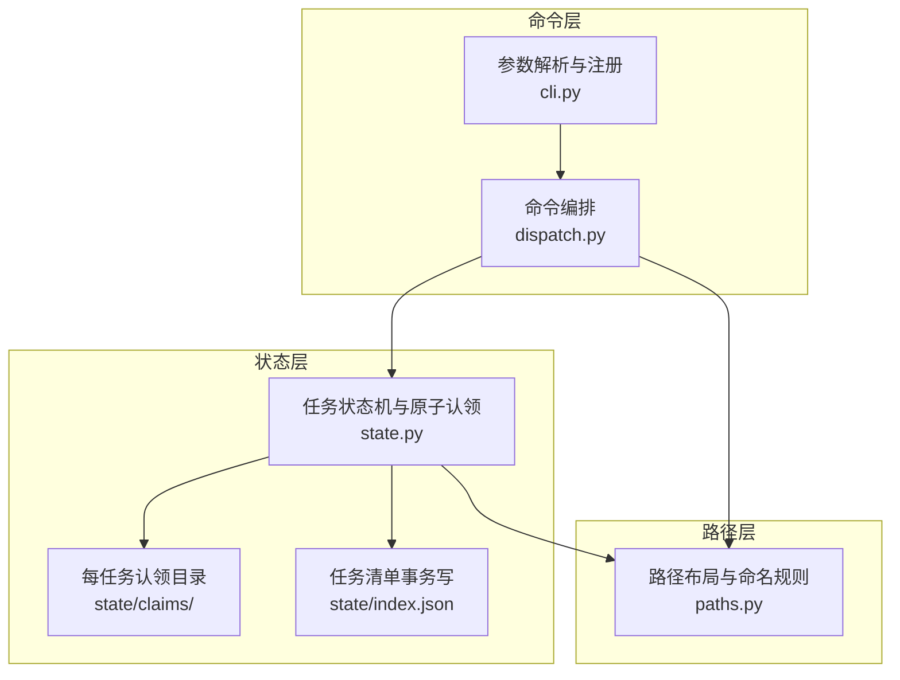
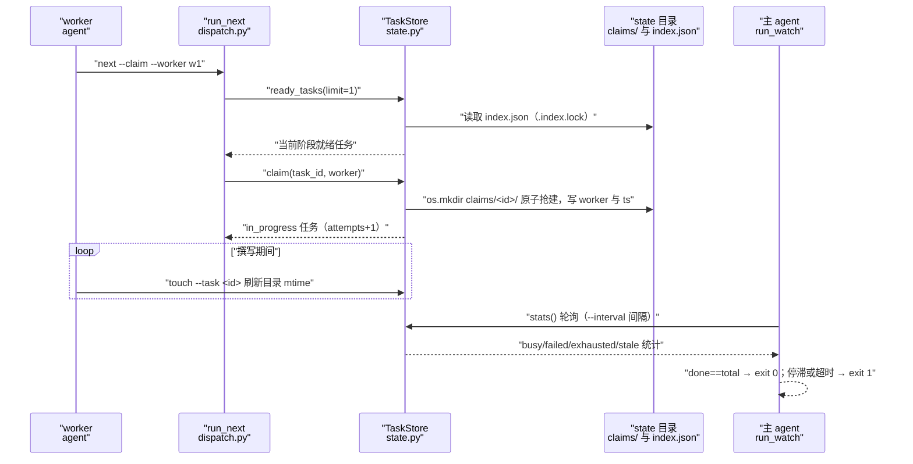
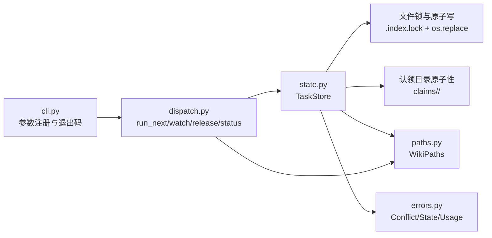

# worker 循环命令

## 目录
1. [简介](#简介)
2. [项目结构](#项目结构)
3. [核心组件](#核心组件)
4. [架构总览](#架构总览)
5. [详细组件分析](#详细组件分析)
6. [依赖关系分析](#依赖关系分析)
7. [性能与一致性考量](#性能与一致性考量)
8. [故障排查指南](#故障排查指南)
9. [结论](#结论)

## 简介

worker 循环命令是 repowiki 并发编排的命令侧实现：`next` 负责就绪任务判定与原子认领，`touch` 提供心跳续期，`watch` 为驱动会话提供阻塞式监控（退出码 0/1 指示完成或停滞/超时），`release` 把任务退回 pending 并以 `--force` 抢占重置，`status` 汇报任务统计、失败与 stale 认领。这些命令共用 state.py 的 TaskStore——以每任务 claim 目录的 `os.mkdir` 原语实现跨进程原子认领，以 index.json 事务写实现状态机——并以 paths.py 的 WikiPaths 约定 `.repowiki/` 之下的全部路径布局。多个等价 worker 正是靠这一组命令完成无协调者的队列分工。

章节来源
- [src/repowiki/dispatch.py:1-6](file://src/repowiki/dispatch.py#L1-L6)
- [src/repowiki/state.py:1-5](file://src/repowiki/state.py#L1-L5)
- [src/repowiki/paths.py:77-82](file://src/repowiki/paths.py#L77-L82)

## 项目结构

worker 循环的实现分布在三个协作模块中：

- `src/repowiki/dispatch.py`：命令编排层。`run_next`（FIFO 单任务发放与认领）、`run_touch`（心跳）、`run_watch`（轮询监控）、`run_release`/`run_status`（释放与报告）、`run_check`（校验并翻转状态，含认领归属守卫）。
- `src/repowiki/state.py`：任务状态存储。TaskStore 提供 load/update 事务、`ready_tasks` 就绪判定、`claim`/`release`/`touch`/`heartbeat` 原语、`_claim_stale` 过期判定与 `stats` 报告；模块级常量 `DEFAULT_STALE_SECONDS` 为 15 分钟，`max_attempts` 读取环境变量 `REPOWIKI_MAX_ATTEMPTS`（默认 3）。
- `src/repowiki/paths.py`：路径推导。WikiPaths 把 `.repowiki/state`（index.json、catalog.json、tasks/、claims/）、`<locale>/content`、`<locale>/meta` 等全部位置集中为属性；`sanitize_component`/`unique_name` 管理标题到目录文件名的映射，`github_anchor` 生成中文锚点。
- `src/repowiki/cli.py`：上述命令的参数解析与注册（`--worker`、`--claim`、`--interval`、`--timeout`、`--force` 等旗标在此定义）。

图表来源
- [src/repowiki/cli.py:48-88](file://src/repowiki/cli.py#L48-L88)
- [src/repowiki/state.py:93-97](file://src/repowiki/state.py#L93-L97)
- [src/repowiki/paths.py:107-137](file://src/repowiki/paths.py#L107-L137)

章节来源
- [src/repowiki/dispatch.py:50-124](file://src/repowiki/dispatch.py#L50-L124)
- [src/repowiki/state.py:93-97](file://src/repowiki/state.py#L93-L97)
- [src/repowiki/paths.py:77-176](file://src/repowiki/paths.py#L77-L176)

## 核心组件

- `run_next`（dispatch.py）：就绪任务的 FIFO 发放口；`--claim` 时对 `ready_tasks(limit=1)` 逐个尝试认领，竞速失败静默跳过留给下次领取；未 `--claim` 时仅列出。
- `TaskStore.claim`（state.py）：原子认领——`_try_mkdir_claim` 用 `os.mkdir` 抢建 claims/<id>/（存在即检查是否 stale，stale 则改名夺走后重试），成功后任务置 in_progress、记录 worker 与心跳、attempts 加一。
- `TaskStore.ready_tasks`（state.py）：就绪判定——当前开放阶段（`current_phase`，未完成任务的最低 phase）内 pending/failed 且未耗尽重试额度的任务，加上认领已过期的 in_progress 任务；按 (attempts, phase, 插入顺序) 排序。
- `TaskStore.touch`/`heartbeat`（state.py）：worker 侧心跳；heartbeat 同时刷新 claims/<id>/ts 文件与目录 mtime（stale 信号以目录 mtime 为准）。
- `run_watch`（dispatch.py）：按 `--interval` 轮询 stats，全部 done 输出 completed 并返回 0；无执行中且无可领取时用新鲜 stats 复核后判停滞返回 1；超过 `--timeout` 返回 1。
- `TaskStore.release`（state.py）：in_progress 任务退回 pending（他人认领需 `--force`）；exhausted 毒任务必须显式 `--force` 才重置 attempts。
- `TaskStore.stats`（state.py）：任务统计单一来源——by_status、current_phase、busy（剔除 stale 的 in_progress 数）、failed、exhausted、stale_claims。
- `WikiPaths`（paths.py）：全部产出入径；`ensure` 创建 state/tasks/claims/content/meta 五个目录，`task_spec` 映射任务规格文件。

章节来源
- [src/repowiki/dispatch.py:50-76](file://src/repowiki/dispatch.py#L50-L76)
- [src/repowiki/dispatch.py:127-200](file://src/repowiki/dispatch.py#L127-L200)
- [src/repowiki/state.py:213-243](file://src/repowiki/state.py#L213-L243)
- [src/repowiki/state.py:269-308](file://src/repowiki/state.py#L269-L308)
- [src/repowiki/state.py:310-367](file://src/repowiki/state.py#L310-L367)
- [src/repowiki/state.py:385-418](file://src/repowiki/state.py#L385-L418)

## 架构总览

worker 循环的命令侧交互围绕两个存储展开：跨进程互斥靠 claims/ 目录（mkdir 原子性），任务状态靠 index.json（`_transaction` 内 `.index.lock` 文件锁 + 临时文件 `os.replace` 原子换入）。worker 调 `next --claim` 时，TaskStore 先算出当前开放阶段的就绪任务，再以 mkdir 抢认领；执行期间 `touch` 周期性刷新认领目录 mtime；`check` 通过后状态翻转为 done 并可清理认领；主 agent 的 `watch` 独立轮询 stats，不参与互斥，只读观测直至全部完成或判定停滞/超时。stale 认领不计入 busy，也不算「执行中」——队列会把它们当作可领取任务重新发放。

图表来源
- [src/repowiki/dispatch.py:50-76](file://src/repowiki/dispatch.py#L50-L76)
- [src/repowiki/dispatch.py:127-200](file://src/repowiki/dispatch.py#L127-L200)
- [src/repowiki/state.py:144-163](file://src/repowiki/state.py#L144-L163)
- [src/repowiki/state.py:269-308](file://src/repowiki/state.py#L269-L308)

章节来源
- [src/repowiki/dispatch.py:50-200](file://src/repowiki/dispatch.py#L50-L200)
- [src/repowiki/state.py:137-163](file://src/repowiki/state.py#L137-L163)

## 详细组件分析

### run_next：就绪判定与单任务原子发放

- 职责：把队首就绪任务交给 worker，是全局 FIFO 分工的唯一入口。
- 关键行为：index.json 不存在时报「尚未规划任务」；未传 `--worker` 时以 `主机名:pid` 兜底标识；`--claim` 模式下只取 `ready_tasks(limit=1)` 一个任务（worker 契约：一次只持有一个认领），认领竞速失败（ConflictError）静默跳过，留待下次 next 重挑；返回载荷含任务规格全文（从 state/tasks/<id>.md 读取）与 busy/progress 统计。
- 实现要点：就绪判定集中在 TaskStore.ready_tasks——只发当前开放阶段（phase 单调推进，前一阶段全部 done 才开放下一阶段）；failed 任务 attempts 达到上限即 exhausted 被排除；认领已 stale 的 in_progress 任务视同就绪（死 worker 自愈回队列）。

章节来源
- [src/repowiki/dispatch.py:31-47](file://src/repowiki/dispatch.py#L31-L47)
- [src/repowiki/dispatch.py:50-88](file://src/repowiki/dispatch.py#L50-L88)
- [src/repowiki/state.py:213-243](file://src/repowiki/state.py#L213-L243)

### run_watch：轮询间隔、停滞与超时判定

- 职责：为主 agent 提供免轮询的阻塞监控，用退出码传达「下一步做什么」。
- 关键行为：每 `--interval`（默认 10 秒）刷新一次 stats 并在状态行变化时打印进度（done/total、阶段、进行中 worker、failed/exhausted/stale 计数）；stale 认领从 in_flight 中剔除（其 worker 已死，任务即将回队列，计入会掩盖真实停滞）；全部任务 done 返回 0；「有剩余但无执行中且无可领取」判停滞——宣布前用新鲜 stats 复核一次，防止快照与判定之间恰好有任务完成造成误报——返回 1；超过 `--timeout`（默认 3600 秒）返回 1。
- 实现要点：停滞消息直接给出处置建议（`repowiki status` 查详情、`release --force` 重置毒任务）；整个循环只读，不持有任何认领。

章节来源
- [src/repowiki/dispatch.py:127-200](file://src/repowiki/dispatch.py#L127-L200)

### run_release 与 run_touch：抢占释放与心跳续期

- 职责：release 把任务显式退回队列，touch 让长任务保住认领。
- 关键行为：release 仅作用于 in_progress 任务（其余状态报 ConflictError）；认领属于其他 worker 时需 `--force`；exhausted（failed 且 attempts 达上限）任务不加 `--force` 直接拒绝，加 `--force` 则清零 attempts 重置为 pending——这是毒任务的唯一人工重置口。touch 校验任务确在 in_progress 且（传了 `--worker` 时）认领者匹配，随后 heartbeat 同时更新 claims/<id>/ts、目录 mtime 与 index 中的 heartbeat_at。
- 实现要点：stale 判定以认领目录自身 mtime 为单一事实源（而非目录内 ts 文件——ts 在 mkdir 之后才写，新建认领会被误判为无限旧而被抢）；stale 窗口可用 `REPOWIKI_STALE_SECONDS` 调整，默认 15 分钟；repowiki 是短命 CLI 进程，记录的 pid 对存活判定无意义，mtime 窗口是唯一存活信号。

章节来源
- [src/repowiki/dispatch.py:91-124](file://src/repowiki/dispatch.py#L91-L124)
- [src/repowiki/state.py:250-267](file://src/repowiki/state.py#L250-L267)
- [src/repowiki/state.py:310-367](file://src/repowiki/state.py#L310-L367)
- [src/repowiki/state.py:21-28](file://src/repowiki/state.py#L21-L28)

### run_status 与 WikiPaths：报告口径与路径布局

- 职责：status 是人工干预的观察窗；WikiPaths 是全部磁盘位置的单一事实源。
- 关键行为：status 直接透传 stats——by_status 分布、当前阶段、failed 清单、exhausted（附重置命令提示）、stale 认领（附 worker 与心跳时间）；busy 口径为「剔除 stale 后的 in_progress 数」，next/watch/status 三处共用同一 stats，繁忙口径单源。WikiPaths 以属性惰性解析：`root` 固定 `.repowiki`，state 之下区分 tasks/（任务规格）与 claims/（运行时认领），产物按 `<locale>/content`、`<locale>/meta`、`knowledge/<locale>` 分层；locale 优先读显式参数、再读持久化的 state/locale、缺省 zh。
- 实现要点：标题转路径由 `sanitize_component` 完成（NFC 归一、非法字符替换为全角、去首尾点空格），冲突名以 `__2` 后缀去重；`github_anchor` 小写化、删标点（含中文标点）、空格转连字符，是目录锚点自动修复的依据。

章节来源
- [src/repowiki/dispatch.py:99-116](file://src/repowiki/dispatch.py#L99-L116)
- [src/repowiki/state.py:385-418](file://src/repowiki/state.py#L385-L418)
- [src/repowiki/paths.py:42-74](file://src/repowiki/paths.py#L42-L74)
- [src/repowiki/paths.py:84-105](file://src/repowiki/paths.py#L84-L105)
- [src/repowiki/paths.py:107-176](file://src/repowiki/paths.py#L107-L176)

## 依赖关系分析

- dispatch 是命令编排中枢：next/touch/release/status/watch 全部薄封装 TaskStore 原语，check 组合 validate 与 store。
- state 是并发核心：唯一依赖 paths（定位 index/claims）与 errors（ConflictError/UsageError/StateError）；跨进程互斥靠 `.index.lock` 文件锁（POSIX fcntl / Windows msvcrt 双后端）加 claims 目录 mkdir 原子性。
- paths 是叶子模块：只依赖 i18n 的 locale 常量，被所有命令模块引用。
- cli 在其上注册参数并统一异常到退出码：ConflictError 到 2、StateError/UsageError 到 1。

图表来源
- [src/repowiki/state.py:35-73](file://src/repowiki/state.py#L35-L73)
- [src/repowiki/state.py:144-163](file://src/repowiki/state.py#L144-L163)
- [src/repowiki/state.py:247-292](file://src/repowiki/state.py#L247-L292)
- [src/repowiki/cli.py:170-183](file://src/repowiki/cli.py#L170-L183)

章节来源
- [src/repowiki/dispatch.py:8-29](file://src/repowiki/dispatch.py#L8-L29)
- [src/repowiki/state.py:8-19](file://src/repowiki/state.py#L8-L19)
- [src/repowiki/paths.py:11-17](file://src/repowiki/paths.py#L11-L17)

## 性能与一致性考量

- 一致性优先于吞吐：index.json 的读与写共用同一把锁（Windows 上 Cython 打开文件不带 FILE_SHARE_DELETE，无锁读会撞坏并发写），锁持有时间为亚毫秒级，热路径是轮询而非紧转。
- 写入窗口最小化：状态更新走 `_merge_task` 只合并被触碰的任务条目，而不是整表重写外加上锁时间换窗口；临时文件加 `os.replace` 保证读方永远看到完整 JSON。
- Windows 竞态兜底：`os.replace` 换入瞬间其他进程打开同一路径可能 PermissionError，读写两侧统一做短暂重试（20 次、50 毫秒间隔）。
- 队列公平性：ready_tasks 按 (attempts, phase, 插入顺序) 排序，重试任务自然靠后、先进先出；单任务发放把竞态窗口压缩到单个 mkdir。
- 存活判定的取舍：不依赖 pid（CLI 短命进程，pid 无意义），只用认领目录 mtime 的 stale 窗口——worker 遵守 touch 纪律时不会被误抢，worker 死亡后任务最多冻结一个窗口（默认 15 分钟）即自愈回队列。

章节来源
- [src/repowiki/state.py:35-49](file://src/repowiki/state.py#L35-L49)
- [src/repowiki/state.py:100-116](file://src/repowiki/state.py#L100-L116)
- [src/repowiki/state.py:137-171](file://src/repowiki/state.py#L137-L171)
- [src/repowiki/state.py:241-243](file://src/repowiki/state.py#L241-L243)
- [src/repowiki/state.py:259-267](file://src/repowiki/state.py#L259-L267)

## 故障排查指南

- `next` 报「尚未规划任务」：index.json 不存在，先运行 `repowiki plan <repo>`。
- `next --claim` 拿不到任务但队列未清空：当前阶段的任务可能全部 exhausted 或被他人持有；`repowiki status` 查看 by_status、exhausted 与 stale_claims。
- `touch` 报 ConflictError「由 <worker> 认领，不是 <worker>」：认领已被他人抢走或 worker 名不匹配；放弃该任务回领取循环，不要加 `--force` 争抢。
- `release` 拒绝：非 in_progress 状态无需释放，或任务属于其他 worker（需 `--force`）；exhausted 任务必须显式 `release --task <id> --force` 重置。
- `watch` 以 exit 1 退出且 reason 为 stalled：队列里有 exhausted 毒任务或规格缺失的孤儿任务；按 status 输出逐个 `release --force` 或 `plan --replan`。若 watch 是被前台超时杀掉的，退出码不可信，用 status 核实。
- `watch` 长时间不动但任务在跑：确认 worker 是否遵守 touch 心跳；认领超过 stale 窗口（默认 15 分钟）未续期会被自动回收转给其他 worker，原 worker 后续 check 会收到 ConflictError。
- index.json 损坏报 StateError：文件被原样保留，不会伪装成空清单；可手工修复该文件，或确认放弃后 `plan --replan --force` 重来。
- 找不到某任务的规格文件：finalize 成功后 cleanup_runtime 会删除 state/tasks 与 state/claims（index/catalog 保留）；这是正常瘦身，done 任务此后只读。

章节来源
- [src/repowiki/dispatch.py:50-53](file://src/repowiki/dispatch.py#L50-L53)
- [src/repowiki/dispatch.py:179-198](file://src/repowiki/dispatch.py#L179-L198)
- [src/repowiki/state.py:130-133](file://src/repowiki/state.py#L130-L133)
- [src/repowiki/state.py:310-341](file://src/repowiki/state.py#L310-L341)
- [src/repowiki/state.py:353-367](file://src/repowiki/state.py#L353-L367)
- [src/repowiki/state.py:369-380](file://src/repowiki/state.py#L369-L380)

## 结论

worker 循环命令把「多 agent 安全分工」压缩为一组薄命令：next 以单任务 FIFO 加 mkdir 原子认领消除竞争，touch 以目录 mtime 心跳维持存活信号，watch 以 0/1 退出码向驱动会话传达终局，release 以 `--force` 作为毒任务的人工重置口，status 以单一 stats 口径支撑全部观测。正确用法是让 worker 严格遵守「一次一个认领、按期心跳、冲突即退」的契约，把干预手段留给 status 观察加 release 重置；注意 stale 窗口与最大尝试次数这两个环境变量（`REPOWIKI_STALE_SECONDS`、`REPOWIKI_MAX_ATTEMPTS`）是调节并发行为的唯一旋钮。

章节来源
- [src/repowiki/dispatch.py:50-88](file://src/repowiki/dispatch.py#L50-L88)
- [src/repowiki/dispatch.py:127-200](file://src/repowiki/dispatch.py#L127-L200)
- [src/repowiki/state.py:21-28](file://src/repowiki/state.py#L21-L28)
- [src/repowiki/state.py:385-418](file://src/repowiki/state.py#L385-L418)

<cite>
**本文引用的文件**
- [src/repowiki/dispatch.py](file://src/repowiki/dispatch.py)
- [src/repowiki/state.py](file://src/repowiki/state.py)
- [src/repowiki/paths.py](file://src/repowiki/paths.py)
- [src/repowiki/cli.py](file://src/repowiki/cli.py)
</cite>
