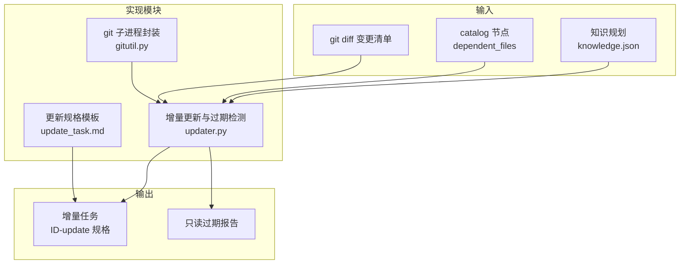
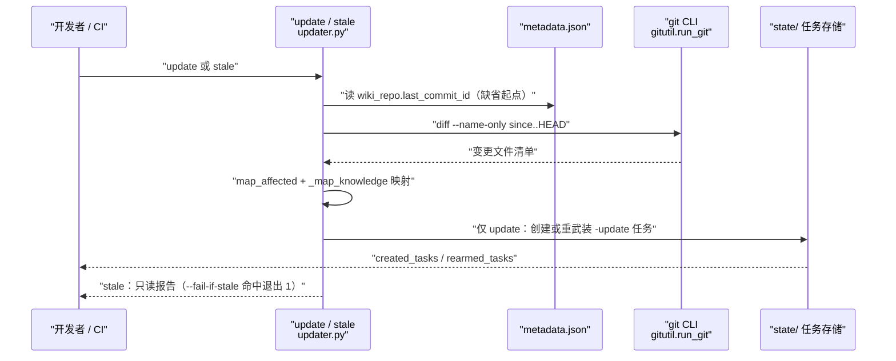
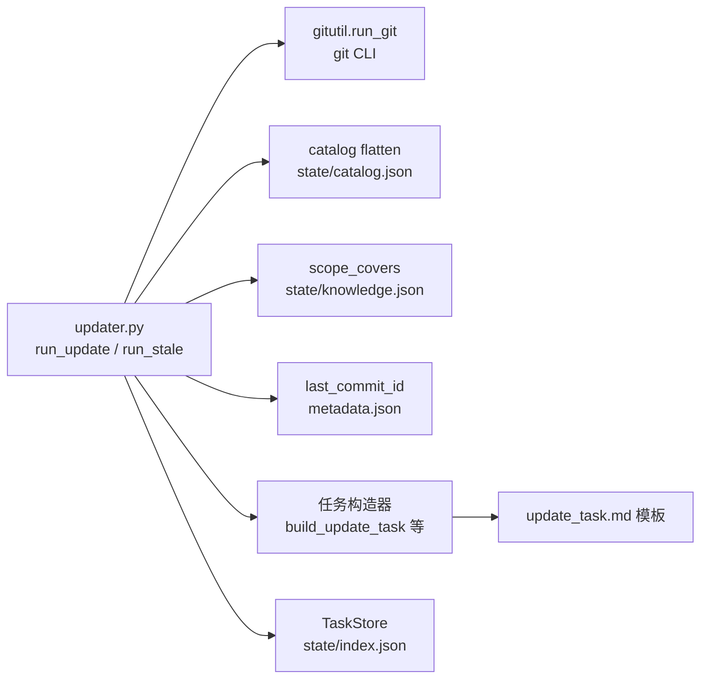

# 增量更新与过期检测

## 目录
1. [简介](#简介)
2. [项目结构](#项目结构)
3. [核心组件](#核心组件)
4. [架构总览](#架构总览)
5. [详细组件分析](#详细组件分析)
6. [依赖关系分析](#依赖关系分析)
7. [性能与一致性考量](#性能与一致性考量)
8. [故障排查指南](#故障排查指南)
9. [结论](#结论)

## 简介

增量更新与过期检测是 repowiki 在首次生成之后的维护通道：`update` 命令把目标仓库的 git 变更映射为一组 `page_update` 任务（含总览页与知识卡片、模块的联动刷新），只重写受影响的页面而非全量重做；`stale` 命令复用同一套「diff → 受影响对象」映射，但只读不写，配合 `--fail-if-stale` 可作为 CI 的「wiki 过期」合并门禁。两者都构建在对 git CLI 的薄封装之上，完全确定性、不需要任何 agent 参与。

## 项目结构

与增量更新相关的仓库组织如下：

- `src/repowiki/updater.py`：`run_update` 与 `run_stale` 的实现，以及 diff 获取、受影响映射、任务排队等核心函数。
- `src/repowiki/gitutil.py`：git 子进程封装 `run_git`，统一处理失败与超时。
- `src/repowiki/templates/zh/update_task.md`（与 en 镜像）：增量更新任务的规格模板，定义「更新摘要」小节的插入与重写规则。
- `.github/workflows/wiki.yml`：官方 CI 工作流，`stale-check` job 实现只读过期门禁。
- 运行时状态输入：`state/catalog.json`（页面与 dependent_files 映射）、`state/knowledge.json`（知识规划）、`zh/meta/repowiki-metadata.json`（last_commit_id 缺省起点）。

图表来源
- [src/repowiki/updater.py:1-16](file://src/repowiki/updater.py#L1-L16)
- [src/repowiki/gitutil.py:1-5](file://src/repowiki/gitutil.py#L1-L5)
- [src/repowiki/templates/zh/update_task.md:1-9](file://src/repowiki/templates/zh/update_task.md#L1-L9)

章节来源
- [src/repowiki/updater.py:1-16](file://src/repowiki/updater.py#L1-L16)
- [README.md:44-45](file://README.md#L44-L45)

## 核心组件

- run_update：`update` 命令入口，完成前置校验、diff 获取、受影响映射与增量任务创建。
- run_stale：`stale` 命令入口，同样的映射但零写入；`--fail-if-stale` 命中时退出码 1，供 CI 门禁。
- _git_diff：按 `since..HEAD` 取已提交变更；`--dirty` 时改为对起点直接 diff 并追加未跟踪文件。
- map_affected：dependent_files 与变更集求交集，并沿 parent_id 收集全部祖先节点。
- _map_knowledge：卡片按 source_files 交集、模块按 scope 覆盖判定命中，返回命中的卡片、模块与被跳过的规划项。
- queue_or_rearm：新任务创建、已完成任务重武装、在途任务保持不动的统一排队策略。
- run_git：git CLI 的子进程封装，成功返回原始 stdout、任何失败返回 None。

章节来源
- [src/repowiki/updater.py:19-31](file://src/repowiki/updater.py#L19-L31)
- [src/repowiki/updater.py:43-53](file://src/repowiki/updater.py#L43-L53)
- [src/repowiki/updater.py:65-96](file://src/repowiki/updater.py#L65-L96)
- [src/repowiki/updater.py:134-147](file://src/repowiki/updater.py#L134-L147)
- [src/repowiki/gitutil.py:13-19](file://src/repowiki/gitutil.py#L13-L19)

## 架构总览

`update` 与 `stale` 共享同一条「起点解析 → git diff → 受影响映射」的确定性管线：默认起点取 metadata 里的 last_commit_id，diff 得到变更文件集合后，分别在 catalog 节点与知识规划上做交集与覆盖判定；区别只在末端——update 把命中对象落成任务，stale 只输出报告。

图表来源
- [src/repowiki/updater.py:99-125](file://src/repowiki/updater.py#L99-L125)
- [src/repowiki/updater.py:251-305](file://src/repowiki/updater.py#L251-L305)

章节来源
- [src/repowiki/updater.py:99-225](file://src/repowiki/updater.py#L99-L225)
- [src/repowiki/updater.py:251-305](file://src/repowiki/updater.py#L251-L305)

## 详细组件分析

### 变更集合的获取与起点解析

- 职责：把「自上次生成以来的代码变化」变成一个确定的文件路径集合。
- 关键行为：默认执行 `git diff --name-only {since}..HEAD`，只统计已提交变更；`--dirty` 时改为 `git diff --name-only {since}`（工作区对起点，含 staged 与 unstaged），再用 `git ls-files --others --exclude-standard` 追加未跟踪文件；起点缺省读 metadata 的 `wiki_repo.last_commit_id`，两者皆无则报错要求 `--since <commit>`。
- 实现要点：前置校验包括目标目录存在 `.git`、`state/catalog.json` 已生成；git 命令失败（如起点 commit 不存在）时 `_git_diff` 返回 None 并转为明确的 UsageError，绝不把失败当成「无变更」。

章节来源
- [src/repowiki/updater.py:19-31](file://src/repowiki/updater.py#L19-L31)
- [src/repowiki/updater.py:34-40](file://src/repowiki/updater.py#L34-L40)
- [src/repowiki/updater.py:99-115](file://src/repowiki/updater.py#L99-L115)

### 受影响页面的判定与祖先链

- 职责：从变更文件集合反推出需要重写的 wiki 页面。
- 关键行为：`map_affected` 把每个 catalog 节点的 `dependent_files` 与变更集求交集，命中节点的所有输出都会过期；同时沿 `parent_id` 向上遍历，把祖先章节节点一并纳入——父级索引页对子页内容的概括同样失效。
- 实现要点：用「值为 None 的 dict」充当有序集合，命中列表保持 catalog 顺序且自动去重；只要命中了任何页面，就会附加一个 `overview-update` 任务，因为总览页描述仓库整体。

章节来源
- [src/repowiki/updater.py:43-53](file://src/repowiki/updater.py#L43-L53)
- [src/repowiki/updater.py:158-165](file://src/repowiki/updater.py#L158-L165)

### 知识卡片与模块的联动刷新

- 职责：让知识库与页面同步更新，不留陈旧卡片。
- 关键行为：`_map_knowledge` 对规划中的每张卡片取 `source_files` 与变更集的交集，非空即命中；对每个模块检查变更路径是否被其某个 `scope` 覆盖（借助 `scope_covers`），命中则进入刷新队列。
- 实现要点：规划项若没有对应的原任务记录（knowledge-plan 已写入但从未展开），计入 skipped 并以告警形式提示跳过联动，不会中断整轮 update；`state/knowledge.json` 解析失败时同样降级为告警跳过。

章节来源
- [src/repowiki/updater.py:65-96](file://src/repowiki/updater.py#L65-L96)
- [src/repowiki/updater.py:167-195](file://src/repowiki/updater.py#L167-L195)

### 任务生成与重武装策略

- 职责：把命中对象安全地落成可执行任务，支持多轮连续 update。
- 关键行为：`queue_or_rearm` 对每个目标 id 分三种情况——不存在则构造新任务；上一轮已完成（done）则重新生成规格并把状态重置为 pending、清零 attempts 与认领字段（否则第二轮 update 会静默无效）；仍在途（pending / failed / in_progress）则保持不动，避免踩踏他人的工作。
- 实现要点：更新任务的规格以任务 id 后缀 `-update` 与首次生成任务区分；若存在未完成的旧增量任务会发告警（其规格基于旧变更快照可能过期）；变更集中出现超过 2 个 catalog 未覆盖的新顶级目录时，提示 `plan --replan` 全量重规划。

章节来源
- [src/repowiki/updater.py:127-156](file://src/repowiki/updater.py#L127-L156)
- [src/repowiki/updater.py:196-209](file://src/repowiki/updater.py#L196-L209)

### 「更新摘要」小节与页面重写规则

- 职责：约束 agent 如何在旧页基础上做增量重写，让读者一眼看到本次改了什么。
- 关键行为：`update_task.md` 要求把更新后的页面整体重写到原路径，并在 `<cite>` 块之后、「目录」之前插入 `## 更新摘要` 小节（以 bullet 说明哪部分内容因哪个文件变更而更新）；「目录」加入「更新摘要」条目；对照变更文件修正过时的描述、行号区间与图表，未受影响的小节尽量保持原样；结论小节可在相关条目后追加「已更新」标记。
- 实现要点：旧页全文通过 `OLD_PAGE` 占位符内嵌进规格，变更文件清单作为更新依据一并提供；硬性检查项要求「更新摘要」必须存在、引用行号不越界、至少 2 个 mermaid 图、页间零链接；目标旧页不存在时降级为全新的 page 规格，新页面不携带更新摘要。

章节来源
- [src/repowiki/updater.py:165-204](file://src/repowiki/updater.py#L165-L204)
- [src/repowiki/templates/zh/update_task.md:11-25](file://src/repowiki/templates/zh/update_task.md#L11-L25)
- [src/repowiki/templates/zh/update_task.md:27-45](file://src/repowiki/templates/zh/update_task.md#L27-L45)

### stale 只读报告与 CI 门禁

- 职责：在不写任何状态的前提下回答「wiki 现在过期了吗」，并可在 CI 中拦截过期合并。
- 关键行为：`run_stale` 复用与 update 完全相同的 diff → map_affected → _map_knowledge 映射，输出受影响页面、卡片、模块清单与 `stale` 布尔值；`--fail-if-stale` 在命中时返回退出码 1。
- 实现要点：官方 `wiki.yml` 的 stale-check job 在 pull_request 时执行 `repowiki stale . --since origin/<base> --fail-if-stale --json`；步骤失败即视为过期，用 `gh pr comment` 把受影响对象列表贴到 PR，再显式 `exit 1` 拦截合并——CI 内不跑任何 agent，检查完全确定性；推荐的刷新路径是合并后在 main 执行 `repowiki update .`、让 agent 完成增量任务后再 `finalize` + `site`。

章节来源
- [src/repowiki/updater.py:251-305](file://src/repowiki/updater.py#L251-L305)
- [.github/workflows/wiki.yml:26-47](file://.github/workflows/wiki.yml#L26-L47)
- [.github/workflows/wiki.yml:48-68](file://.github/workflows/wiki.yml#L48-L68)
- [README.md:246-258](file://README.md#L246-L258)

### gitutil 对 git CLI 的封装

- 职责：为 update / stale 提供唯一的 git 调用通道，也是 repowiki 对外部工具的唯一运行时依赖点。
- 关键行为：`run_git(repo, *args, timeout=30)` 以子进程在仓库目录执行 git 命令，成功返回解码后的原始 stdout，任何 SubprocessError 或 OSError 都返回 None。
- 实现要点：刻意返回原始输出而不做切分，因为部分调用方（如 `diff --name-only`）必须区分「空输出」与「命令失败」；update 中的 diff 与 ls-files 调用显式给 60 秒超时，防止大仓库上的长时间挂起。git 预装的机器无需额外配置。

章节来源
- [src/repowiki/gitutil.py:1-5](file://src/repowiki/gitutil.py#L1-L5)
- [src/repowiki/gitutil.py:13-19](file://src/repowiki/gitutil.py#L13-L19)
- [src/repowiki/updater.py:19-31](file://src/repowiki/updater.py#L19-L31)
- [README.md:121-122](file://README.md#L121-L122)

## 依赖关系分析

- 对 git CLI 的依赖：update 与 stale 都要求目标目录是 git 仓库；这是 repowiki 唯一可选的外部命令行依赖（site / check 等不需要）。
- 对状态文件的依赖：catalog（页面映射与 dependent_files）、knowledge.json（卡片与模块规划）、metadata 的 last_commit_id（缺省起点）、TaskStore（任务记录的读写与重武装）。
- 对任务体系的依赖：增量任务复用 `tasks.py` 的构造器与 `update_task.md` 模板，产物进入与首次生成相同的任务队列，由同一个 worker 循环消费。

图表来源
- [src/repowiki/updater.py:8-16](file://src/repowiki/updater.py#L8-L16)
- [src/repowiki/updater.py:117-128](file://src/repowiki/updater.py#L117-L128)

章节来源
- [src/repowiki/updater.py:8-16](file://src/repowiki/updater.py#L8-L16)
- [src/repowiki/updater.py:34-40](file://src/repowiki/updater.py#L34-L40)
- [src/repowiki/updater.py:127-132](file://src/repowiki/updater.py#L127-L132)

## 性能与一致性考量

- 确定性映射：同一份 diff 加同一份 catalog 必然得到同一命中集合，`stale` 与 `update` 因此天然一致，CI 门禁的判断与后续任务生成不会脱节。
- 稳定输出：受影响列表用有序集合保持 catalog 顺序，JSON 与人类可读输出均可复现。
- 失败显式化：git 调用失败返回 None 并转为 UsageError，与「空变更集」严格区分，避免静默漏更新。
- 多轮幂等：重武装机制让连续多轮 update 都能基于最新变更推进，而在途任务不受新一轮影响，兼顾推进性与并发安全。
- 盲区告警：新顶级目录超过 2 个即提示全量 replan，防止 catalog 覆盖不到的新结构长期游离于 wiki 之外。

章节来源
- [src/repowiki/updater.py:43-53](file://src/repowiki/updater.py#L43-L53)
- [src/repowiki/updater.py:134-156](file://src/repowiki/updater.py#L134-L156)
- [src/repowiki/updater.py:199-209](file://src/repowiki/updater.py#L199-L209)
- [src/repowiki/gitutil.py:13-19](file://src/repowiki/gitutil.py#L13-L19)

## 故障排查指南

- 现象：报「无法确定增量起点：metadata 中无 last_commit_id」。原因：尚未完成过首次 finalize，metadata 里没有记录生成时的 commit。定位：显式传 `--since <commit>`，或先完成一次完整的 finalize 流程。
- 现象：报「增量更新需要 git 仓库（未发现 .git）」。原因：目标目录不是 git 仓库。定位：update 与 stale 仅支持 git 仓库，非 git 目录只能全量 `plan --replan`。
- 现象：报「git diff since..HEAD 失败」。原因：起点 commit 或 ref 不存在。定位：用 `git rev-parse` 核对 `--since` 的取值。
- 现象：第二轮 update 没有生成新任务。原因：同 id 的增量任务仍在 pending / in_progress，`queue_or_rearm` 刻意不动在途任务。定位：先完成或 `release` 旧任务再重跑 update。
- 现象：CI 的 stale 门禁失败。原因：PR 改动了 wiki 覆盖的源码。定位：按 PR 评论列出的受影响对象，合并后在 main 执行 `repowiki update .` 并完成增量任务、再 `finalize` + `site`；确需跳过时显式禁用该 workflow。
- 现象：告警「知识规划项尚无对应任务记录」。原因：knowledge-plan 已写入但从未展开。定位：执行 `repowiki knowledge` 展开卡片与模块任务后再跑 update。
- 现象：stale 结果与预期不符。原因：映射完全由 catalog 的 dependent_files 与知识规划驱动，catalog 本身过期会导致漏判。定位：`plan --replan` 刷新 catalog 后再检查。

章节来源
- [src/repowiki/updater.py:99-115](file://src/repowiki/updater.py#L99-L115)
- [src/repowiki/updater.py:134-147](file://src/repowiki/updater.py#L134-L147)
- [src/repowiki/updater.py:192-195](file://src/repowiki/updater.py#L192-L195)
- [.github/workflows/wiki.yml:53-68](file://.github/workflows/wiki.yml#L53-L68)

## 结论

增量更新与过期检测让 repowiki 的产出可以随仓库持续演进：`update` 用确定性的「git diff → dependent_files 交集 → 祖先链 + 知识联动」映射把维护成本压缩到受影响页面，并借「更新摘要」小节让每次刷新可追溯；`stale` 以同一映射提供零写入的过期报告，配合 `--fail-if-stale` 即插即用为 CI 合并门禁。使用时注意保持 catalog 与 metadata 的有效性（起点缺失用 `--since` 显式指定），多轮更新依赖任务重武装机制，不要手工删除 `state/` 下的任务记录。

章节来源
- [src/repowiki/updater.py:99-125](file://src/repowiki/updater.py#L99-L125)
- [src/repowiki/updater.py:251-260](file://src/repowiki/updater.py#L251-L260)
- [README.md:44-45](file://README.md#L44-L45)

<cite>
**本文引用的文件**
- [updater.py](file://src/repowiki/updater.py)
- [gitutil.py](file://src/repowiki/gitutil.py)
- [update_task.md](file://src/repowiki/templates/zh/update_task.md)
- [wiki.yml](file://.github/workflows/wiki.yml)
- [README.md](file://README.md)
</cite>
