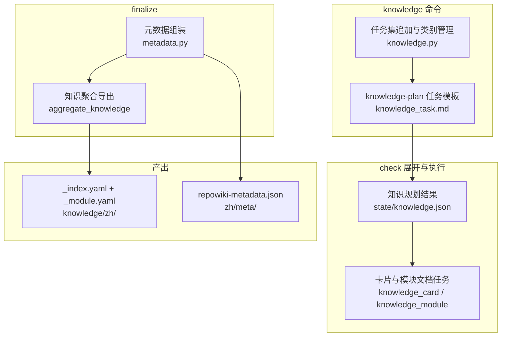
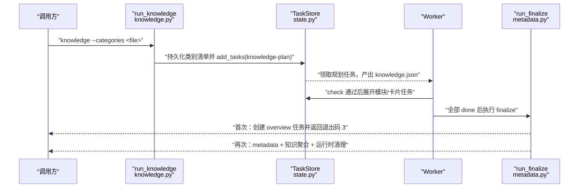
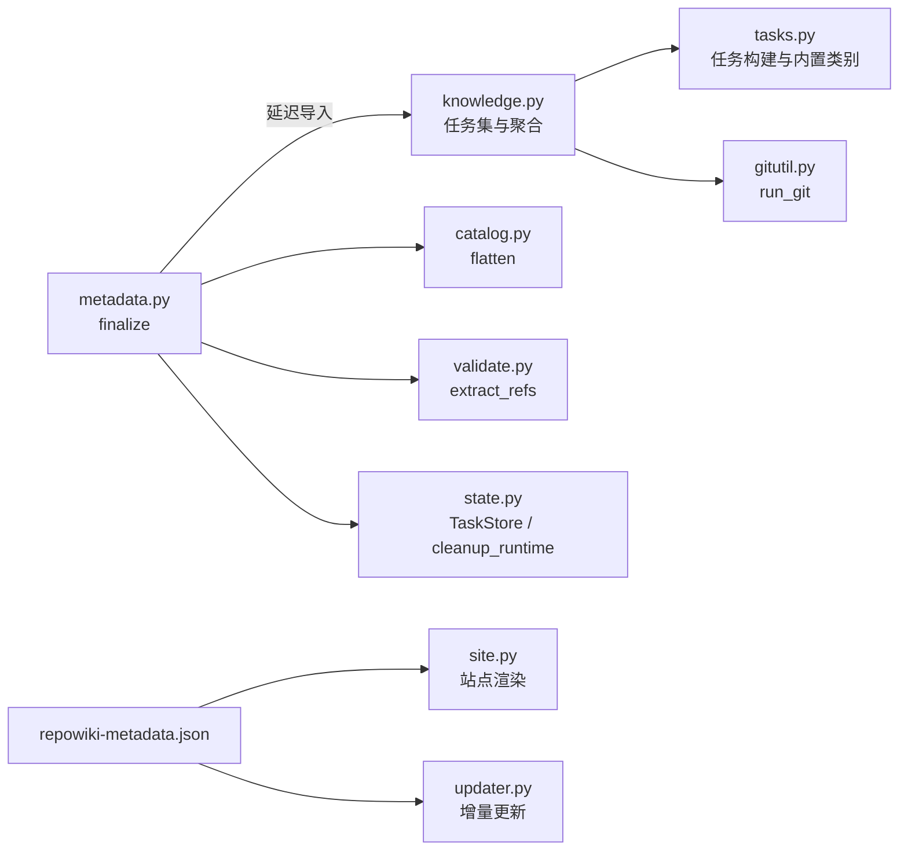

# 知识卡片与 finalize

## 目录
1. [简介](#简介)
2. [项目结构](#项目结构)
3. [核心组件](#核心组件)
4. [架构总览](#架构总览)
5. [详细组件分析](#详细组件分析)
6. [依赖关系分析](#依赖关系分析)
7. [性能与一致性考量](#性能与一致性考量)
8. [故障排查指南](#故障排查指南)
9. [结论](#结论)

## 简介

本页覆盖 repowiki 的两组收尾能力：`knowledge` 命令追加的知识卡片任务集（机制卡规划加卡片与模块文档撰写），以及 `finalize` 命令的元数据组装。前者把横切机制（配置、日志、错误处理等）以独立于页面体系的知识卡片形式沉淀到 knowledge/<locale>/，类别清单可用 --categories 整表自定义；后者两步走——首次运行创建 overview 任务并以退出码 3 表达进展，第二次运行解析全部页面的 file:// 引用、组装 zh/meta/repowiki-metadata.json、聚合知识索引并清理运行时状态。实现分别位于 src/repowiki/knowledge.py 与 src/repowiki/metadata.py，knowledge-plan 任务的规格模板在 src/repowiki/templates/zh/knowledge_task.md。

## 项目结构

与本主题相关的实现与产出布局如下：

- src/repowiki/knowledge.py：knowledge 命令入口（run_knowledge）、用户类别文件的解析校验（_load_category_file）、生效类别清单（effective_categories）与 finalize 时的知识聚合导出（aggregate_knowledge）；
- src/repowiki/metadata.py：finalize 命令实现（run_finalize）——overview 两步门控、页面缺失与未完成任务校验、file:// 引用解析、metadata 组装与运行时清理；
- src/repowiki/templates/zh/knowledge_task.md：knowledge-plan 任务的规格模板，内嵌 JSON Schema、规划规则与质量自检清单；
- 产出布局：state/knowledge.json（规划结果）、knowledge/<locale>/（模块文档目录含 _module.yaml，根下 _index.yaml）、zh/meta/repowiki-metadata.json（finalize 产物）。

图表来源
- [src/repowiki/knowledge.py:29-51](file://src/repowiki/knowledge.py#L29-L51)
- [src/repowiki/metadata.py:116-121](file://src/repowiki/metadata.py#L116-L121)

章节来源
- [src/repowiki/knowledge.py:1-8](file://src/repowiki/knowledge.py#L1-L8)
- [src/repowiki/metadata.py:1-6](file://src/repowiki/metadata.py#L1-L6)

## 核心组件

- run_knowledge（src/repowiki/knowledge.py）：knowledge 命令入口——先持久化自定义类别清单（若有），再向任务清单追加 knowledge-plan 任务。
- _load_category_file（src/repowiki/knowledge.py）：解析并校验用户提供的 YAML/JSON 类别文件——id 格式、去重与数量上限。
- effective_categories（src/repowiki/knowledge.py）：生效类别清单的唯一出口——优先读 state/knowledge_categories.json 持久化值，否则回落内置六类；check 与 update 校验时同样调用它。
- aggregate_knowledge（src/repowiki/knowledge.py）：finalize 阶段把规划与任务记录聚合为 _index.yaml 与逐模块 _module.yaml。
- run_finalize（src/repowiki/metadata.py）：finalize 两步走的编排者——创建 overview 任务、校验完整性、解析引用、组装 metadata、清理运行时状态。
- knowledge_task.md 模板（src/repowiki/templates/zh/knowledge_task.md）：约束规划 agent 只产出一个 JSON 文件的规格，含 schema、规则与自检清单。

章节来源
- [src/repowiki/knowledge.py:29-51](file://src/repowiki/knowledge.py#L29-L51)
- [src/repowiki/knowledge.py:60-115](file://src/repowiki/knowledge.py#L60-L115)
- [src/repowiki/knowledge.py:147-152](file://src/repowiki/knowledge.py#L147-L152)
- [src/repowiki/metadata.py:28-40](file://src/repowiki/metadata.py#L28-L40)

## 架构总览

整体数据流为：调用方执行 `repowiki knowledge`（可带 --categories），run_knowledge 把类别清单持久化并追加 knowledge-plan 任务；worker 领取该任务后按模板把规划结果写入 state/knowledge.json，check 通过时自动展开模块文档与卡片任务；待全部任务 done，调用方执行 finalize——首次运行发现没有 overview 任务则创建之并返回退出码 3，overview 完成后再次运行才真正组装 repowiki-metadata.json，同时聚合知识索引并清除 state/claims 与 state/tasks。

图表来源
- [src/repowiki/metadata.py:28-40](file://src/repowiki/metadata.py#L28-L40)
- [src/repowiki/knowledge.py:40-51](file://src/repowiki/knowledge.py#L40-L51)

章节来源
- [src/repowiki/metadata.py:28-58](file://src/repowiki/metadata.py#L28-L58)
- [src/repowiki/knowledge.py:29-51](file://src/repowiki/knowledge.py#L29-L51)

## 详细组件分析

### 知识卡片任务集（knowledge 命令）

- 职责：在页面任务之外追加「机制卡片 + 模块文档」任务集，类别可整表自定义。
- 关键行为：--categories 给出类别文件时，先解析校验并把结果持久化到 state/knowledge_categories.json（使后续 check / update 轮次校验同一清单），再追加 knowledge-plan 任务；没有任务清单时提示先 plan（src/repowiki/knowledge.py:29-51）。
- 实现要点：类别文件须为非空数组，条目为字符串 id 或含 id / name / guidance 的对象；id 必须匹配小写字母开头的正则（保证安全进入 YAML front matter）、不得重复、总数不超过 12——「机制卡片贵精不贵多」（src/repowiki/knowledge.py:25-26、60-99）。
- 实现要点：未提供自定义清单时回落内置六类 DEFAULT_KNOWLEDGE_CATEGORIES，旧仓库零迁移（src/repowiki/knowledge.py:102-115）。

章节来源
- [src/repowiki/knowledge.py:1-8](file://src/repowiki/knowledge.py#L1-L8)
- [src/repowiki/knowledge.py:29-99](file://src/repowiki/knowledge.py#L29-L99)
- [src/repowiki/knowledge.py:102-115](file://src/repowiki/knowledge.py#L102-L115)

### knowledge-plan 任务模板

- 职责：约束规划 agent 的唯一产出为 state/knowledge.json 一个 JSON 文件，不写卡片或模块文档本体。
- 关键行为：模板给出 modules（id / title / scope / children / depends_on / related_to）与 cards（id / title / category / scope / source_files）的 JSON Schema（src/repowiki/templates/zh/knowledge_task.md:23-46）。
- 关键行为：规划规则要求模块 2~8 个（可 1~2 层，根模块覆盖仓库整体）、机制卡片每类 0~2 张宁缺毋滥、卡片标题自包含且全局唯一、source_files 为 2~8 个真实存在的核心文件；卡片描述「机制」、模块描述「结构」，两者相互独立（src/repowiki/templates/zh/knowledge_task.md:48-54）。
- 实现要点：模板以 `{{REPO_NAME}}` / `{{KEY_FILES}}` / `{{TREE_SUMMARY}}` / `{{CATEGORY_COUNT}}` / `{{CATEGORY_BLOCK}}` 占位符注入仓库上下文与生效类别清单（src/repowiki/templates/zh/knowledge_task.md:14-21、50-52）。
- 失败路径：质量自检清单约束 JSON 可解析、id 与标题唯一、引用 id 存在、路径真实、category 只用清单枚举值，完成后以 check 收口（src/repowiki/templates/zh/knowledge_task.md:56-62）。

章节来源
- [src/repowiki/templates/zh/knowledge_task.md:1-13](file://src/repowiki/templates/zh/knowledge_task.md#L1-L13)
- [src/repowiki/templates/zh/knowledge_task.md:23-62](file://src/repowiki/templates/zh/knowledge_task.md#L23-L62)

### finalize 两步走与 overview 任务

- 职责：保证总览页存在之后再组装元数据，避免产出缺导读的 metadata。
- 关键行为：首次运行 finalize 时，若任务清单中尚无 overview 任务，则从 catalog 展开节点、创建阶段 3 的 overview 任务，随后以退出码 3 结束——这是进展性等待而非错误（src/repowiki/metadata.py:34-40）。
- 关键行为：第二次运行时先校验 catalog 存在，再检查 catalog 中每个页面的产出文件是否已生成（缺失则 UsageError 列出前 8 个并提示补齐或重规划），最后确认所有任务均为 done（src/repowiki/metadata.py:42-58）。
- 实现要点：_require_catalog 对「文件不存在」与「JSON 损坏」分别给出可恢复的操作提示（手工修复或 plan --replan）（src/repowiki/metadata.py:156-164）。

章节来源
- [src/repowiki/metadata.py:28-58](file://src/repowiki/metadata.py#L28-L58)
- [src/repowiki/metadata.py:156-164](file://src/repowiki/metadata.py#L156-L164)

### metadata 关键字段与引用关系

- 职责：产出机器可读索引，向下支撑 site 站点渲染与 update 增量更新。
- 关键行为：遍历每个页面解析 file:// 引用——文件级引用记入 source_files（id 为路径的 md5）并建立 CONTAINS 关系；带行区间的引用再记入 code_snippets（id 为路径加行区间的 md5）并建立 REFERENCED_BY 关系（src/repowiki/metadata.py:60-78）。
- 关键行为：wiki_repo 段记录仓库名、locale、generated_at 与 last_commit_id（取自 git rev-parse HEAD，是 update --since 的默认基点）；wiki_catalogs 携带每页的 prompt（即 page_brief）与 dependent_files；总览全文内嵌于 wiki_overview 字段（src/repowiki/metadata.py:80-114）。
- 实现要点：metadata 先写 .metadata.tmp 再 os.replace 原子替换，并发读者不会看到半成品（src/repowiki/metadata.py:118-121）。

章节来源
- [src/repowiki/metadata.py:1-6](file://src/repowiki/metadata.py#L1-L6)
- [src/repowiki/metadata.py:60-121](file://src/repowiki/metadata.py#L60-L121)

### 知识聚合导出与运行时清理

- 职责：finalize 收尾时导出机器可读知识索引，并清除不再需要的运行时产物。
- 关键行为：存在 state/knowledge.json 时调用 aggregate_knowledge——模块到目录的映射完全来自 knowledge_module 任务记录的 output 字段；为每个模块写 _module.yaml（schema_version / module_path / title / scope / source_files / depends_on / related_to，其中 source_files 取落在该模块 scope 下的卡片声明文件），并生成以 module_path 为键、含 locale / branch / exported_at 的 _index.yaml（src/repowiki/knowledge.py:147-226；src/repowiki/metadata.py:167-176）。
- 关键行为：metadata 写出成功后调用 store.cleanup_runtime()，删除 state/claims 与 state/tasks 两个运行时目录（认领与任务规格），保留 index.json / catalog.json / knowledge.json 供增量更新与幂等重跑，并在摘要中报告清理结果（src/repowiki/metadata.py:123-134；src/repowiki/state.py:369-380）。
- 实现要点：scope 匹配支持 `src/core/`、`src/core/**` 与 `**` 三种前缀形态，卡片文件归属模块即基于该判定（src/repowiki/knowledge.py:118-144）。

章节来源
- [src/repowiki/knowledge.py:118-144](file://src/repowiki/knowledge.py#L118-L144)
- [src/repowiki/knowledge.py:147-226](file://src/repowiki/knowledge.py#L147-L226)
- [src/repowiki/metadata.py:116-134](file://src/repowiki/metadata.py#L116-L134)
- [src/repowiki/metadata.py:167-176](file://src/repowiki/metadata.py#L167-L176)
- [src/repowiki/state.py:369-380](file://src/repowiki/state.py#L369-L380)

## 依赖关系分析

- knowledge.py 的上游：依赖 tasks 构建器（内置类别 DEFAULT_KNOWLEDGE_CATEGORIES 与 knowledge-plan 任务构造）、state.TaskStore（任务追加）、gitutil.run_git（_index.yaml 的 branch 字段）与 scanner（规划任务所需的仓库扫描）（src/repowiki/knowledge.py:10-23）。
- metadata.py 的上游：依赖 catalog.flatten（节点展开）、tasks.build_overview_task、validate.extract_refs（file:// 引用解析）、gitutil.run_git（last_commit_id）与 state（TaskStore、now_iso、cleanup_runtime）；对 knowledge.aggregate_knowledge 采用函数内延迟导入，避免模块级循环依赖（src/repowiki/metadata.py:8-21、167-176）。
- 模板依赖：knowledge_task.md 是 knowledge-plan 任务规格的正文来源，占位符由 tasks 构建器在生成规格时渲染（src/repowiki/templates/zh/knowledge_task.md:1-7）。
- 下游消费：site.py 读取 metadata 与 knowledge/<locale>/ 渲染单文件站点；updater.py 读取 last_commit_id 与 catalog 的 dependent_files 做增量映射。

图表来源
- [src/repowiki/knowledge.py:10-23](file://src/repowiki/knowledge.py#L10-L23)
- [src/repowiki/metadata.py:8-21](file://src/repowiki/metadata.py#L8-L21)

章节来源
- [src/repowiki/knowledge.py:10-23](file://src/repowiki/knowledge.py#L10-L23)
- [src/repowiki/metadata.py:8-21](file://src/repowiki/metadata.py#L8-L21)
- [src/repowiki/metadata.py:167-176](file://src/repowiki/metadata.py#L167-L176)

## 性能与一致性考量

- 类别清单一次持久化、处处生效：--categories 的结果写入 state/knowledge_categories.json，规划、check、update 都经 effective_categories 读取同一份，避免「规划用一套类别、校验用另一套」的漂移（src/repowiki/knowledge.py:1-8、102-115）。
- 确定性 id：source_files 与 code_snippets 的 id 均由内容（路径、路径加行区间）的 md5 哈希生成，天然去重且跨次运行稳定（src/repowiki/metadata.py:24-25、69-78）。
- 原子写出：repowiki-metadata.json 以临时文件加 os.replace 落盘，finalize 可安全重跑（src/repowiki/metadata.py:118-121）。
- 聚合的单向数据流：模块到目录的映射只读任务记录的 output，不重新扫描磁盘，保证导出与任务展开时的布局一致（src/repowiki/knowledge.py:153-159）。
- 两步 finalize 用退出码 3 表达「进展性等待」，驱动方无需轮询即可知道下一步动作（src/repowiki/metadata.py:34-40、150-153）。

章节来源
- [src/repowiki/knowledge.py:1-8](file://src/repowiki/knowledge.py#L1-L8)
- [src/repowiki/knowledge.py:102-115](file://src/repowiki/knowledge.py#L102-L115)
- [src/repowiki/knowledge.py:153-159](file://src/repowiki/knowledge.py#L153-L159)
- [src/repowiki/metadata.py:24-40](file://src/repowiki/metadata.py#L24-L40)
- [src/repowiki/metadata.py:118-121](file://src/repowiki/metadata.py#L118-L121)

## 故障排查指南

- `knowledge` 报「请先运行 plan」：任务清单为空，先执行 plan 生成任务再追加知识任务集（src/repowiki/knowledge.py:36-39）。
- `knowledge` 报类别文件相关错误（不存在 / 解析失败 / 非空数组 / id 非法 / id 重复 / 类别过多）：按提示修正 YAML/JSON 文件；id 需小写字母开头、仅小写字母数字下划线、至多 40 字符，类别总数不超过 12（src/repowiki/knowledge.py:60-99）。
- `finalize` 退出码 3：属正常进展——已创建 overview 任务，按提示领取执行并 check 通过后再次运行 finalize（src/repowiki/metadata.py:34-40、150-153）。
- `finalize` 报「catalog 中有 N 个页面尚未生成」：--max-pages 试跑后未补齐页面；补齐缺失页面或 plan --replan 重来（src/repowiki/metadata.py:44-51）。
- `finalize` 报「仍有 N 个任务未完成」：存在非 done 状态任务；用 status 查看清单并处理后再试（src/repowiki/metadata.py:53-58）。
- `finalize` 报「state/catalog.json 不存在或损坏」：完成 catalog 任务，或手工修复该 JSON 后继续；损坏时也可 plan --replan 重新规划（src/repowiki/metadata.py:156-164）。
- 摘要出现「knowledge.json 解析失败，已跳过聚合」：知识规划文件损坏，修复后重新 finalize 即可补出 _index.yaml / _module.yaml（src/repowiki/metadata.py:167-176）。

章节来源
- [src/repowiki/knowledge.py:36-39](file://src/repowiki/knowledge.py#L36-L39)
- [src/repowiki/knowledge.py:60-99](file://src/repowiki/knowledge.py#L60-L99)
- [src/repowiki/metadata.py:34-58](file://src/repowiki/metadata.py#L34-L58)
- [src/repowiki/metadata.py:150-164](file://src/repowiki/metadata.py#L150-L164)
- [src/repowiki/metadata.py:167-176](file://src/repowiki/metadata.py#L167-L176)

## 结论

knowledge 命令与 finalize 共同构成 repowiki 的「增料与收尾」环节：前者以经过格式与数量校验的类别清单（自定义或内置六类）追加知识卡片任务集，最终沉淀为 knowledge/<locale>/ 下的模块文档与卡片；后者两步走——先补 overview 任务（退出码 3 是进展信号），再解析全部页面的 file:// 引用组装 repowiki-metadata.json（含供 update 增量使用的 last_commit_id），顺手聚合 _index.yaml 与 _module.yaml 并清理 state/claims 与 state/tasks。使用建议：需要知识卡片时在 plan 之后尽早执行 knowledge（有特殊类别需求则带 --categories）；finalize 返回 3 不要当作失败，按提示完成 overview 后重跑即可。

章节来源
- [src/repowiki/knowledge.py:29-51](file://src/repowiki/knowledge.py#L29-L51)
- [src/repowiki/knowledge.py:147-226](file://src/repowiki/knowledge.py#L147-L226)
- [src/repowiki/metadata.py:28-58](file://src/repowiki/metadata.py#L28-L58)
- [src/repowiki/metadata.py:123-134](file://src/repowiki/metadata.py#L123-L134)

<cite>
**本文引用的文件**
- [knowledge.py](file://src/repowiki/knowledge.py)
- [metadata.py](file://src/repowiki/metadata.py)
- [knowledge_task.md](file://src/repowiki/templates/zh/knowledge_task.md)
- [state.py](file://src/repowiki/state.py)
</cite>
