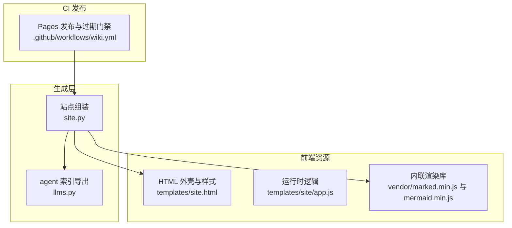
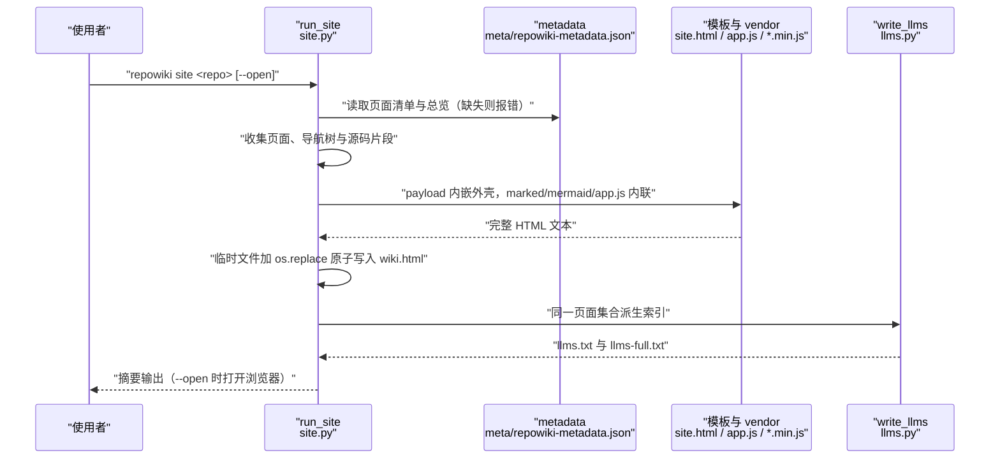
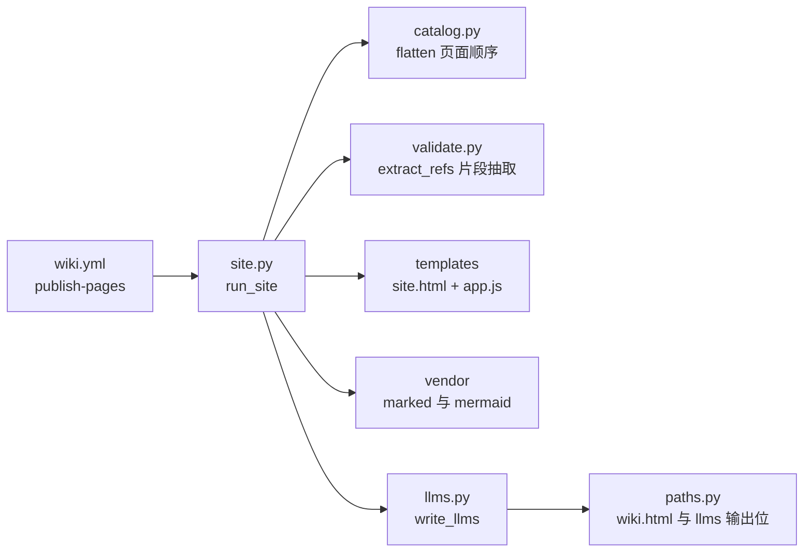

# 离线站点与 llms.txt 导出

## 目录
1. [简介](#简介)
2. [项目结构](#项目结构)
3. [核心组件](#核心组件)
4. [架构总览](#架构总览)
5. [详细组件分析](#详细组件分析)
6. [依赖关系分析](#依赖关系分析)
7. [性能与一致性考量](#性能与一致性考量)
8. [故障排查指南](#故障排查指南)
9. [结论](#结论)

## 简介

离线站点与 llms.txt 导出是 repowiki 产出的最后一公里：`repowiki site` 把 finalize 后的全部页面（含总览与知识页）组装为单个自包含 HTML 文件 `.repowiki/<locale>/wiki.html`，内嵌 marked 与 mermaid 渲染库、侧栏导航、客户端搜索以及每个 file:// 引用背后的源码片段，浏览器双击即可离线查看；同一批页面同时按 llmstxt.org 约定导出 `llms.txt`（链接索引）与 `llms-full.txt`（全文合并版），供 agent 与 IDE 直接消费而无需任何网络或 MCP 服务。该机制位于仓库的 site.py 与 llms.py，前端骨架与运行时逻辑分别在 templates/site.html 与 templates/site/app.js。

章节来源
- [src/repowiki/site.py:1-11](file://src/repowiki/site.py#L1-L11)
- [src/repowiki/llms.py:1-8](file://src/repowiki/llms.py#L1-L8)

## 项目结构

站点生成链路由两个 Python 模块与三个前端资源文件组成：

- `src/repowiki/site.py`：`run_site` 主流程——前置校验 metadata、按目录序收集页面、构建导航树、抽取源码片段、渲染 HTML、原子落盘并调用 llms 导出。
- `src/repowiki/llms.py`：`write_llms` 从同一份页面集合派生 `llms.txt` 与 `llms-full.txt`，链接为相对路径，写入同样走临时文件加 `os.replace`。
- `src/repowiki/templates/site.html`：站点外壳。设计令牌（亮/暗主题）、顶栏、侧栏（章节导航与本页目录）、内容区、源码弹层、翻页与打印样式；尾部恰好 4 个内联 script 占位：SITE_DATA、MARKED_JS、MERMAID_JS、APP_JS。
- `src/repowiki/templates/site/app.js`：运行时逻辑。全部数据来自 `window.SITE_DATA`，零网络——markdown 交给 vendored marked，图表交给 vendored mermaid，源码片段在生成期预抽取。
- `src/repowiki/vendor/`：marked.min.js（15.0.12）与 mermaid.min.js（11.17.2）的 MIT 原样内联副本，生成期与查看期均不发起任何请求。
- `.github/workflows/wiki.yml`：官方 CI——push main 时执行 `repowiki site` 并把 wiki.html 与 llms 索引发布到 GitHub Pages。

图表来源
- [src/repowiki/site.py:363-378](file://src/repowiki/site.py#L363-L378)
- [src/repowiki/llms.py:19-46](file://src/repowiki/llms.py#L19-L46)
- [src/repowiki/templates/site.html:368-371](file://src/repowiki/templates/site.html#L368-L371)
- [.github/workflows/wiki.yml:70-106](file://.github/workflows/wiki.yml#L70-L106)

章节来源
- [src/repowiki/site.py:13-33](file://src/repowiki/site.py#L13-L33)
- [src/repowiki/llms.py:10-17](file://src/repowiki/llms.py#L10-L17)
- [src/repowiki/vendor/README.md:1-14](file://src/repowiki/vendor/README.md#L1-L14)

## 核心组件

- `run_site`（site.py）：站点生成主入口；要求 metadata 已由 finalize 产出，页面为空时报错；输出摘要含页数、片段数与体积。
- `_collect_pages` / `_ordered_nodes`（site.py）：总览页取自 metadata 的 wiki_overview（回退 overview 文件），正文页按 state/catalog.json 的规划顺序收集；catalog 缺失（`repowiki clean` 之后）降级为磁盘目录序，站点仍可构建。
- `_collect_knowledge`（site.py）：把 `knowledge/<locale>/` 的模块文档与卡片作为普通页面纳入，卡片 front matter 渲染前剥离，标题取 front matter 的 name 或首个 H1。
- `_collect_snippets`（site.py）：遍历每页 file:// 引用，预读源码行区间（无行号引用读全文），超 20000 行的区间跳过并标记 missing，二进制文件标记 missing。
- `_render_html` / `_script_safe`（site.py）：payload 以 JSON 内嵌（`<` 转义为 `\u003c` 防止提前闭合标签），vendor 与 app.js 内联前把 `</script` 替换为 `<\/script`。
- `write_llms`（llms.py）：llms.txt 为按章节分组的页面链接索引，llms-full.txt 为全部页面 markdown 以分隔线串联的全文版；两者均为页面集合的确定性派生。
- `SITE_DATA` payload（site.html 与 app.js 的契约）：repo、locale、generatedAt、ui 文案、nav 导航树、pages（title/path/md）、snippets（源码片段字典）。

章节来源
- [src/repowiki/site.py:36-88](file://src/repowiki/site.py#L36-L88)
- [src/repowiki/site.py:106-131](file://src/repowiki/site.py#L106-L131)
- [src/repowiki/site.py:216-267](file://src/repowiki/site.py#L216-L267)
- [src/repowiki/site.py:326-358](file://src/repowiki/site.py#L326-L358)
- [src/repowiki/site.py:363-384](file://src/repowiki/site.py#L363-L384)
- [src/repowiki/llms.py:19-46](file://src/repowiki/llms.py#L19-L46)
- [src/repowiki/templates/site/app.js:1-7](file://src/repowiki/templates/site/app.js#L1-L7)

## 架构总览

生成期是一条单向管线：`site` 读取 finalize 产物 metadata 作为页面清单的事实源，收集总览、正文页与知识页并构建导航树；随后对全部页面跑一遍 file:// 引用抽取，把每个引用对应的源码行区间预读进 snippets 字典；最终把完整 payload 内嵌进 site.html 外壳，连同 vendor 两个渲染库与 app.js 一起合成单个 HTML，经临时文件原子换入 wiki.html，再由 write_llms 派生两个索引文件。查看期完全在浏览器本地完成：app.js 从 SITE_DATA 渲染 markdown 与 mermaid、接管 file:// 链接点击弹出源码片段，全程不访问网络。

图表来源
- [src/repowiki/site.py:36-88](file://src/repowiki/site.py#L36-L88)
- [src/repowiki/site.py:363-384](file://src/repowiki/site.py#L363-L384)
- [src/repowiki/llms.py:19-46](file://src/repowiki/llms.py#L19-L46)

章节来源
- [src/repowiki/site.py:36-101](file://src/repowiki/site.py#L36-L101)
- [src/repowiki/llms.py:19-52](file://src/repowiki/llms.py#L19-L52)

## 详细组件分析

### 单文件站点的组装与安全内联

- 职责：把多文件 wiki 压缩成一个可任意分发的 HTML 文件，同时保证内联脚本不会破坏 HTML 解析。
- 关键行为：payload JSON 序列化时把 `<` 转义为 `\u003c`，防止内容中的 `</script>` 提前闭合内联 script；marked.min.js、mermaid.min.js 与 app.js 内联前经 `_script_safe` 把字面 `</script` 替换为等价转义 `<\/script`；写入采用临时文件加 `os.replace`，重建幂等且不会留下半写状态。
- 实现要点：外壳 site.html 尾部恰好 4 个内联 script（SITE_DATA、MARKED_JS、MERMAID_JS、APP_JS），无任何外部资源引用；noscript 兜底提示内容已全部内嵌、仅需启用 JavaScript。

章节来源
- [src/repowiki/site.py:363-384](file://src/repowiki/site.py#L363-L384)
- [src/repowiki/site.py:68-72](file://src/repowiki/site.py#L68-L72)
- [src/repowiki/templates/site.html:367-371](file://src/repowiki/templates/site.html#L367-L371)
- [src/repowiki/vendor/README.md:1-14](file://src/repowiki/vendor/README.md#L1-L14)

### 查看器运行时（app.js）：渲染、导航与源码弹层

- 职责：在纯本地环境把 SITE_DATA 渲染为可交互站点。
- 关键行为：markdown 经 marked 解析后依次执行增强——cite 块重解析（CommonMark 不解析原生 HTML 内部的 markdown）、标题分配 slug id（与后端 github_anchor 规则镜像：小写、去标点、空格转连字符）、代码块加语言标签与复制按钮、mermaid 块按当前主题渲染（securityLevel strict，暗色用 dark 主题）；hash 路由 `#/p/N` 切页，页内目录锚点只滚动不切页；file:// 链接点击弹出源码片段弹层（带行号表格，missing 时显示缺失标记）；搜索为大小写不敏感的子串匹配，命中上下文高亮并列出前 20 条；主题、导航折叠与目录折叠状态存 localStorage（file:// 下失败静默忽略）。
- 实现要点：源码片段在生成期预抽取进 payload，运行时零请求；mermaid 渲染失败时降级为原文展示而非空白。

章节来源
- [src/repowiki/templates/site/app.js:1-7](file://src/repowiki/templates/site/app.js#L1-L7)
- [src/repowiki/templates/site/app.js:37-46](file://src/repowiki/templates/site/app.js#L37-L46)
- [src/repowiki/templates/site/app.js:96-131](file://src/repowiki/templates/site/app.js#L96-L131)
- [src/repowiki/templates/site/app.js:256-305](file://src/repowiki/templates/site/app.js#L256-L305)
- [src/repowiki/templates/site/app.js:307-352](file://src/repowiki/templates/site/app.js#L307-L352)

### llms.txt 与 llms-full.txt：两种 agent 索引的内容与差异

- 职责：把页面集合以 llmstxt.org 约定暴露给 agent 与 IDE，作为 HTML 站点之外的直接消费接口。
- 关键行为：llms.txt 是链接索引——标题加简介行之后按导航树分章，每个叶子页面一条链接，目标为相对 llms.txt 所在目录的 posix 路径；llms-full.txt 是全文合并版——同一标题与简介之后，把全部页面 markdown 以分隔线串联，适合一次性灌入上下文。
- 实现要点：两个文件是 HTML 站点同一页面集合（pages/nav）的确定性副产品，不引入第二种清单；写入与 wiki.html 同样走临时文件原子替换；链接指向 `.repowiki/` 内的 markdown 原文，无 agent、网络或 MCP 服务参与。

章节来源
- [src/repowiki/llms.py:1-8](file://src/repowiki/llms.py#L1-L8)
- [src/repowiki/llms.py:19-46](file://src/repowiki/llms.py#L19-L46)
- [src/repowiki/llms.py:49-52](file://src/repowiki/llms.py#L49-L52)

### GitHub Pages 发布与 CI 门禁（wiki.yml）

- 职责：把站点生成接入 CI，形成 wiki-as-code 的发布闭环。
- 关键行为：push main 或手动触发时，publish-pages job 安装本包后执行 `repowiki site .`，从 `.repowiki/` 收集 wiki.html 与 llms 索引组装 Pages artifact，生成一个跳转到首个可用 locale 的 index.html 后部署到 GitHub Pages；pull_request 上独立的 stale-check job 只读检测 wiki 是否过期，过期则评论受影响页面并拦截合并（CI 内不跑任何 agent，完全确定性）。
- 实现要点：仓库需跟踪 `.repowiki/` 的内容与元数据（state/claims、state/tasks 与可重建的 wiki.html 可忽略）；两个 job 相互独立，可按需禁用其一。

章节来源
- [.github/workflows/wiki.yml:1-12](file://.github/workflows/wiki.yml#L1-L12)
- [.github/workflows/wiki.yml:70-106](file://.github/workflows/wiki.yml#L70-L106)
- [.github/workflows/wiki.yml:25-68](file://.github/workflows/wiki.yml#L25-L68)

## 依赖关系分析

- site.py 上游依赖 catalog 的 flatten（页面顺序）、validate 的 extract_refs（片段抽取复用校验器的引用解析）、templates 渲染与 paths 的输出位置；输出位置由 paths 约定为 `<locale>/wiki.html` 与 `<locale>/llms*.txt`。
- llms.py 依赖 i18n 的站点文案与 paths 的路径推导，被 site.py 在 HTML 落盘后调用。
- 前端依赖全部内联：site.html 引用 SITE_DATA、MARKED_JS、MERMAID_JS、APP_JS 四个内联 script，vendor 目录的 marked 与 mermaid 为唯一第三方运行时。
- CI 侧 wiki.yml 依赖 site 命令（publish-pages）与 stale 命令（stale-check），二者只消费 `.repowiki/` 产物。

图表来源
- [src/repowiki/site.py:22-31](file://src/repowiki/site.py#L22-L31)
- [src/repowiki/site.py:363-378](file://src/repowiki/site.py#L363-L378)
- [src/repowiki/llms.py:15-16](file://src/repowiki/llms.py#L15-L16)
- [.github/workflows/wiki.yml:87-87](file://.github/workflows/wiki.yml#L87-L87)

章节来源
- [src/repowiki/site.py:22-31](file://src/repowiki/site.py#L22-L31)
- [src/repowiki/llms.py:10-17](file://src/repowiki/llms.py#L10-L17)
- [src/repowiki/vendor/README.md:6-9](file://src/repowiki/vendor/README.md#L6-L9)

## 性能与一致性考量

- 体积与片段上限：单文件约数 MB（摘要输出实际体积），源码片段超过 20000 行的区间直接跳过并标记 missing，防止个别超长引用撑爆文件。
- 幂等重建：site 可反复重跑，输出经临时文件原子替换，产物内容只由页面集合决定；`repowiki clean` 删除 catalog 后站点仍可从磁盘页面降级重建（章节顺序退化为目录序）。
- 单一页面集合两种消费面：HTML 站点与 llms 索引共享同一 pages/nav 集合，页面顺序、标题在两个出口天然一致。
- 零网络契约：生成期不取任何远程资源，查看期不发起任何请求（渲染库内联、片段预抽取），离线机器与受限网络环境均可完整使用。
- 前后端锚点一致性：app.js 的 slug 函数镜像后端 github_anchor 规则，保证「目录」锚点在站点内可正确跳转。

章节来源
- [src/repowiki/site.py:33-33](file://src/repowiki/site.py#L33-L33)
- [src/repowiki/site.py:134-173](file://src/repowiki/site.py#L134-L173)
- [src/repowiki/site.py:68-75](file://src/repowiki/site.py#L68-L75)
- [src/repowiki/templates/site/app.js:37-42](file://src/repowiki/templates/site/app.js#L37-L42)
- [src/repowiki/vendor/README.md:11-14](file://src/repowiki/vendor/README.md#L11-L14)

## 故障排查指南

- site 报「未找到 repowiki-metadata.json」：finalize 未完成或产出被删；先让全部任务 done 并运行 `repowiki finalize`，再重跑 site。
- site 报「未找到任何已生成的 wiki 页面」：content 目录为空，检查 locale 是否与页面实际语言一致（路径形如 zh/content）。
- 站点中点击 file:// 引用提示缺失：目标文件在生成后被移动或删除，或引用超出 20000 行被跳过；重新 site 即可按当前仓库状态重建片段。
- mermaid 图不渲染或样式异常：确认打开的是完整 wiki.html 而非被裁剪的副本；图语法错误时查看器会降级显示原文，可据此定位语法问题。
- Pages 发布失败（publish-pages）：多为仓库未跟踪 metadata 或 site 失败；本地先跑通 `repowiki site .` 再排查 CI。stale-check 失败则说明缺 catalog（先提交 wiki）或 wiki 确已过期（合并后在 main 执行 update 刷新）。
- llms.txt 链接 404：索引内链接相对 `<locale>/` 目录，移动文件时需保持 `.repowiki/<locale>/` 与内容目录的相对结构。
- 重建后页面顺序变化：catalog.json 缺失导致降级为磁盘目录序；恢复规划清单（state/catalog.json）后重跑 site 即回到规划顺序。

章节来源
- [src/repowiki/site.py:36-49](file://src/repowiki/site.py#L36-L49)
- [src/repowiki/site.py:134-144](file://src/repowiki/site.py#L134-L144)
- [src/repowiki/site.py:326-346](file://src/repowiki/site.py#L326-L346)
- [src/repowiki/llms.py:49-52](file://src/repowiki/llms.py#L49-L52)
- [.github/workflows/wiki.yml:11-12](file://.github/workflows/wiki.yml#L11-L12)
- [.github/workflows/wiki.yml:64-68](file://.github/workflows/wiki.yml#L64-L68)

## 结论

离线站点与 llms.txt 导出把「markdown 页面集合」一次性变成两类消费面：面向人的单文件 wiki.html（内联渲染库与源码片段、零网络、可任意分发、可由 CI 自动发布到 GitHub Pages）与面向 agent 的 llms.txt/llms-full.txt 索引（llmstxt.org 约定、纯 markdown 相对链接）。正确用法是在 finalize 完成后运行 `repowiki site`，把 wiki.html 分发或提交、把 llms 索引交给 agent/IDE；站点完全可重建，`clean` 后也能降级重建，但目录顺序以保留 catalog.json 为准，且升级 repowiki 后应重跑 site 以同步查看器能力。

章节来源
- [src/repowiki/site.py:1-11](file://src/repowiki/site.py#L1-L11)
- [src/repowiki/llms.py:1-8](file://src/repowiki/llms.py#L1-L8)
- [.github/workflows/wiki.yml:1-12](file://.github/workflows/wiki.yml#L1-L12)

<cite>
**本文引用的文件**
- [src/repowiki/site.py](file://src/repowiki/site.py)
- [src/repowiki/llms.py](file://src/repowiki/llms.py)
- [src/repowiki/templates/site.html](file://src/repowiki/templates/site.html)
- [src/repowiki/templates/site/app.js](file://src/repowiki/templates/site/app.js)
- [src/repowiki/vendor/README.md](file://src/repowiki/vendor/README.md)
- [.github/workflows/wiki.yml](file://.github/workflows/wiki.yml)
</cite>
