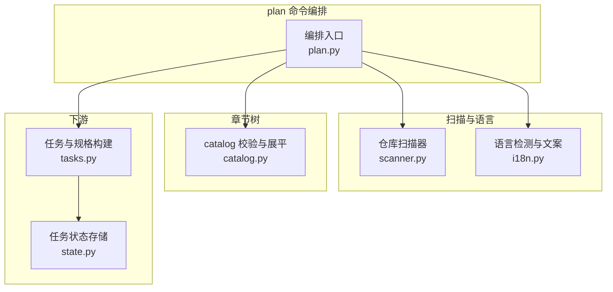
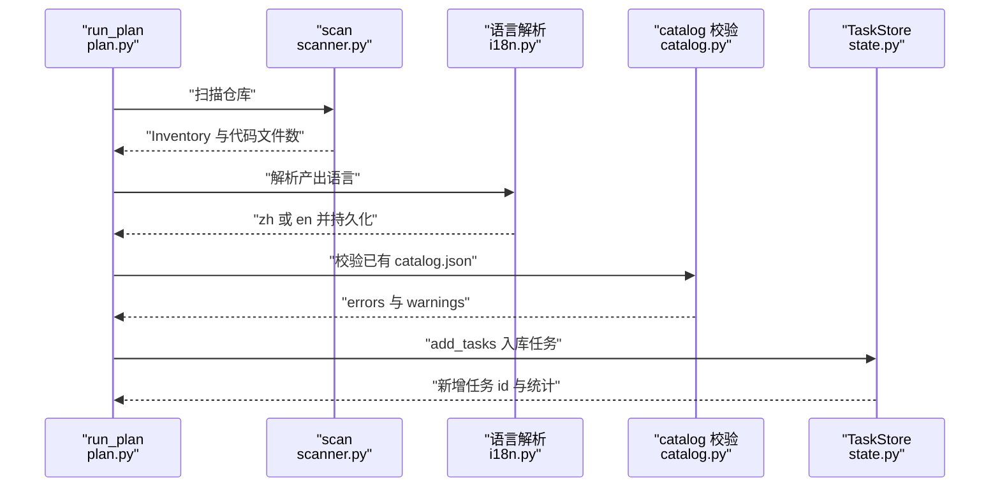
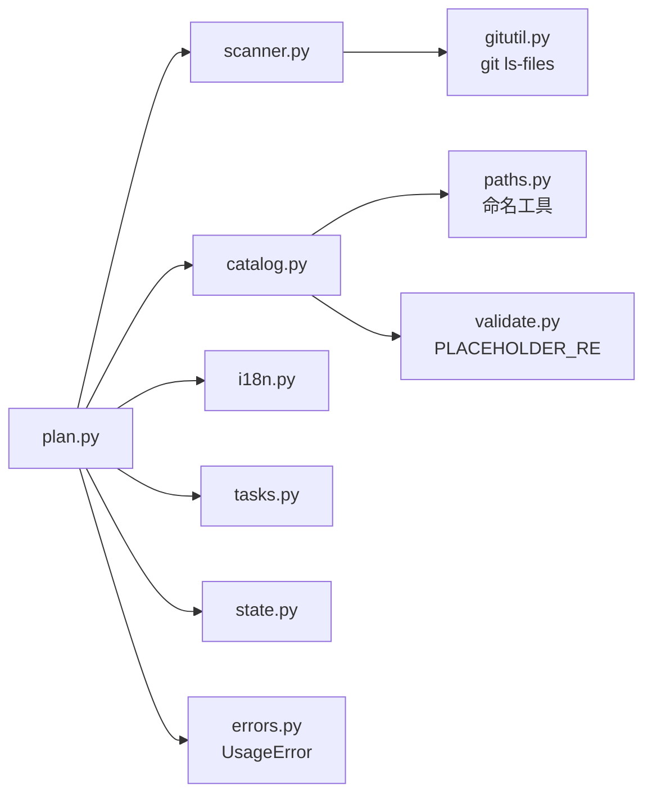

# 规划与扫描

## 目录
1. [简介](#简介)
2. [项目结构](#项目结构)
3. [核心组件](#核心组件)
4. [架构总览](#架构总览)
5. [详细组件分析](#详细组件分析)
6. [依赖关系分析](#依赖关系分析)
7. [性能与一致性考量](#性能与一致性考量)
8. [故障排查指南](#故障排查指南)
9. [结论](#结论)

## 简介

`plan` 是 repowiki 编排流程的第一个命令，职责是「扫描仓库并铺设任务清单」[plan.py:1](file://src/repowiki/plan.py#L1)。它把三件确定性工作串在一起：由 scanner.py 生成仓库文件清单（代码文件识别、关键文件挑选、紧凑文件树）；由 i18n.py 以零网络的确定性算法检测产出语言（zh 或 en）并持久化到 `state/locale`；再由 catalog.py 校验章节树（catalog.json）并推导每个页面的落盘路径，最终通过 tasks.py 与 state.py 把 catalog 任务或页面任务写入任务队列 [plan.py:8-15](file://src/repowiki/plan.py#L8-L15)。本页逐一剖析这四层实现与其参数行为，是理解后续 worker 循环与增量更新的前置。

## 项目结构

- `src/repowiki/plan.py`：plan 命令的编排入口（140 行），串起扫描、语言解析、catalog 校验入库与任务生成，并处理 `--replan` / `--max-pages` / `--knowledge` / `--locale` 参数 [plan.py:38-40](file://src/repowiki/plan.py#L38-L40)。
- `src/repowiki/scanner.py`：仓库扫描器（170 行）。优先用 `git ls-files`（精确遵循 .gitignore），否则退化为手动遍历；跳过二进制、VCS / 构建 / vendor 目录与 repowiki 自己的产出 `.repowiki` [scanner.py:1-6](file://src/repowiki/scanner.py#L1-L6)。
- `src/repowiki/catalog.py`：catalog 的 schema 校验、展平与输出路径推导（193 行），是「什么样的 catalog 合法、每个页面落在 `<locale>/content/` 下何处」的唯一事实源 [catalog.py:1-7](file://src/repowiki/catalog.py#L1-L7)。
- `src/repowiki/i18n.py`：多语言支持（161 行），包含 zh/en 两套界面文案与校验器小节表，以及基于 CJK 占比的确定性语言检测；新增语言只需在 STRINGS 加一项并配一个模板目录 [i18n.py:1-7](file://src/repowiki/i18n.py#L1-L7)。

**图表来源**
- [plan.py:8-15](file://src/repowiki/plan.py#L8-L15)

**章节来源**
- [plan.py:1-15](file://src/repowiki/plan.py#L1-L15)
- [scanner.py:1-6](file://src/repowiki/scanner.py#L1-L6)
- [catalog.py:1-7](file://src/repowiki/catalog.py#L1-L7)
- [i18n.py:1-7](file://src/repowiki/i18n.py#L1-L7)

## 核心组件

- run_plan（plan.py）：plan 命令主流程——replan 清理、扫描、语言解析、catalog 校验、任务入库与结果输出 [plan.py:38-103](file://src/repowiki/plan.py#L38-L103)。
- _resolve_locale（plan.py）：语言解析三级优先——显式 `--locale` 胜出；否则读取已持久化的 `state/locale`；否则现场检测 [plan.py:29-35](file://src/repowiki/plan.py#L29-L35)。
- _busy_tasks（plan.py）：收集 in_progress 任务 id；索引存在但不可解析时返回 None 以区分「无人执行」与「无法确认」[plan.py:116-124](file://src/repowiki/plan.py#L116-L124)。
- _warn_dangling_outputs（plan.py）：已生成但不在当前 catalog 中的页面被视为旧残留并给出警告 [plan.py:127-140](file://src/repowiki/plan.py#L127-L140)。
- scan（scanner.py）：扫描主入口，产出 Inventory——文件清单、关键文件、紧凑文件树与代码文件计数 [scanner.py:116-147](file://src/repowiki/scanner.py#L116-L147)。
- Inventory / FileEntry（scanner.py）：清单数据结构，每个文件记录路径、行数、语言与是否代码；known_paths 供 catalog 校验对账 [scanner.py:54-71](file://src/repowiki/scanner.py#L54-L71)。
- _render_tree（scanner.py）：按目录聚合的紧凑文件树，单目录至多 20 项、总量至多 400 行 [scanner.py:150-170](file://src/repowiki/scanner.py#L150-L170)。
- validate_catalog（catalog.py）：catalog.json 的规则引擎——唯一性、深度、archetype、dependent_files 存在性等 [catalog.py:45-135](file://src/repowiki/catalog.py#L45-L135)。
- flatten（catalog.py）：把校验通过的章节树展平为带输出路径的 FlatNode 列表 [catalog.py:138-179](file://src/repowiki/catalog.py#L138-L179)。
- catalog_tree_text（catalog.py）：把展平结果渲染成带「章 / 页」标记与 page_brief 的缩进树，供总览任务规格引用 [catalog.py:182-193](file://src/repowiki/catalog.py#L182-L193)。
- detect_locale（i18n.py）：zh/en 判定——README 信号足够时由 README 决定，否则看源码样本中的 CJK 密度 [i18n.py:135-161](file://src/repowiki/i18n.py#L135-L161)。
- strings（i18n.py）：按 locale 取界面文案与校验器小节表，未知 locale 回退默认值 zh [i18n.py:121-122](file://src/repowiki/i18n.py#L121-L122)。

**章节来源**
- [plan.py:29-140](file://src/repowiki/plan.py#L29-L140)
- [scanner.py:54-71](file://src/repowiki/scanner.py#L54-L71)
- [catalog.py:45-193](file://src/repowiki/catalog.py#L45-L193)
- [i18n.py:121-161](file://src/repowiki/i18n.py#L121-L161)

## 架构总览

run_plan 的执行是一条线性流水线：先处理 replan 清理与最小规模门槛，再扫描仓库得到 Inventory；语言必须在创建输出目录之前解析——locale 决定创建哪个 `<locale>/content` 与 `<locale>/meta` 目录 [plan.py:62-68](file://src/repowiki/plan.py#L62-L68)；随后读取已有 catalog：合法则直接展平生成页面任务（幂等），非法或缺失则只发放 catalog 规划任务；`--knowledge` 追加知识库规划任务，最后输出任务统计与下一步提示 [plan.py:70-103](file://src/repowiki/plan.py#L70-L103)。

**图表来源**
- [plan.py:38-103](file://src/repowiki/plan.py#L38-L103)
- [plan.py:62-68](file://src/repowiki/plan.py#L62-L68)

**章节来源**
- [plan.py:38-103](file://src/repowiki/plan.py#L38-L103)

## 详细组件分析

### 仓库扫描（scanner.py）

- 职责：为规划提供确定性的仓库文件清单。
- 关键行为：优先执行 `git ls-files -z`（要求 `.git` 存在，超时 120 秒），失败或非 git 仓库则回退到剪枝遍历——遍历时直接剔除 IGNORE_DIRS（node_modules、venv、dist、build、`.repowiki` 等约 20 个目录）与 `.git` 前缀目录 [scanner.py:74-95](file://src/repowiki/scanner.py#L74-L95) [scanner.py:36-41](file://src/repowiki/scanner.py#L36-L41)；每个文件跳过二进制（头 8192 字节含 `\0` 即判二进制），按扩展名对照 CODE_EXTS（29 种代码扩展名）判 is_code、对照 LANG_BY_EXT 标注语言，无扩展名的 Dockerfile / Makefile / Procfile 单独识别 [scanner.py:98-136](file://src/repowiki/scanner.py#L98-L136) [scanner.py:16-34](file://src/repowiki/scanner.py#L16-L34)。
- 实现要点：关键文件挑选只看仓库根目录——文件须命中 KEY_FILE_GLOBS（README*、pyproject.toml、package.json、go.mod、Cargo.toml、Makefile、requirements*.txt、pom.xml 等）且父目录为根 [scanner.py:43-47](file://src/repowiki/scanner.py#L43-L47) [scanner.py:143-145](file://src/repowiki/scanner.py#L143-L145)；行数统计对超过 2 MB 的文本文件直接记 0（列入清单但不计 LOC）[scanner.py:49](file://src/repowiki/scanner.py#L49) [scanner.py:106-113](file://src/repowiki/scanner.py#L106-L113)；文件树按目录聚合展示，单目录至多列 20 个文件名（超出显示省略行），全树超过 400 行即截断并注明遗漏目录数 [scanner.py:150-170](file://src/repowiki/scanner.py#L150-L170)。

**章节来源**
- [scanner.py:16-51](file://src/repowiki/scanner.py#L16-L51)
- [scanner.py:74-147](file://src/repowiki/scanner.py#L74-L147)
- [scanner.py:150-170](file://src/repowiki/scanner.py#L150-L170)

### 语言自动检测与持久化（i18n.py 与 plan.py）

- 职责：确定性决定 wiki 产出语言（zh 或 en），零网络，一次检测全流程生效 [i18n.py:1-7](file://src/repowiki/i18n.py#L1-L7)。
- 关键行为：detect_locale 优先读 README——README 的 CJK 加拉丁字母总数达到 20（_MIN_README_SIGNAL）即视为信号充分，CJK 占比不低于 0.15 判 zh，否则判 en；README 信号不足或缺失时，抽样前 24 个代码文件（_CODE_SAMPLES）加 README 本身，任一样本头 8192 字节内 CJK 字符达到 30（_MIN_CODE_CJK，即非英文注释 / 文档字符串）判 zh，全不命中判 en [i18n.py:111-118](file://src/repowiki/i18n.py#L111-L118) [i18n.py:135-161](file://src/repowiki/i18n.py#L135-L161)。
- 实现要点：README 权重最高的原因写在注释里——代码中的标识符必然是拉丁字母，不得稀释文档语言信号；且主 README.md 优先于翻译版兄弟文件（README.en.md / README.zh.md），否则排序会让翻译版抢先 [i18n.py:135-146](file://src/repowiki/i18n.py#L135-L146)。plan 侧的解析顺序为：显式 `--locale` 胜出；否则若 `state/locale` 已存在则沿用持久值；否则现场检测。持久化时机：从未持久化过、或本次显式指定了 `--locale` 时写入 [plan.py:29-35](file://src/repowiki/plan.py#L29-L35) [plan.py:62-68](file://src/repowiki/plan.py#L62-L68)。检测算法还刻意要求「README 决定论」——标识符不影响判定，使结果可复现 [i18n.py:1-7](file://src/repowiki/i18n.py#L1-L7)。

**章节来源**
- [i18n.py:109-161](file://src/repowiki/i18n.py#L109-L161)
- [plan.py:29-35](file://src/repowiki/plan.py#L29-L35)
- [plan.py:62-68](file://src/repowiki/plan.py#L62-L68)

### catalog 校验与页面路径推导（catalog.py）

- 职责：作为唯一事实源，定义合法 catalog 的形态，并推导每个页面在 `<locale>/content/` 下的落盘路径 [catalog.py:1-7](file://src/repowiki/catalog.py#L1-L7)。
- 关键行为：validate_catalog 递归遍历 chapters——根章节深度为 1、整树不得超过 4 层（MAX_DEPTH）；id、title、slug 均须非空且全局唯一（title 按 NFC 归一后比对）；slug 必须匹配小写英文与连字符的正则 SLUG_RE；kind 只能是 chapter 或 page 且 page 不能有 children；archetype 只能是 module 或 flow（省略默认 module）；page_brief（页面要点提示词）必填；dependent_files 必须是数组，其中不在仓库清单 known_paths 里的条目被剔除并汇总为警告 [catalog.py:17-19](file://src/repowiki/catalog.py#L17-L19) [catalog.py:45-135](file://src/repowiki/catalog.py#L45-L135)。
- 实现要点：title 若呈 `{{占位符}}` 形态会被直接拒绝——标题会写进页面 H1，触发校验器「未替换占位符」误判，错误信息中给出了这一因果解释 [catalog.py:91-95](file://src/repowiki/catalog.py#L91-L95)。flatten 的路径规则：每个 chapter 得到以其标题命名的目录加同名索引页；根级 page 是 `<locale>/content/` 下的独立文件；同级标题经 sanitize_component 清洗、unique_name 以 `__2` 后缀消解碰撞 [catalog.py:138-179](file://src/repowiki/catalog.py#L138-L179)。catalog_tree_text 输出带「章 / 页」标记、输出路径与 page_brief 的缩进树，供总览任务规格嵌入 [catalog.py:182-193](file://src/repowiki/catalog.py#L182-L193)。

**章节来源**
- [catalog.py:17-19](file://src/repowiki/catalog.py#L17-L19)
- [catalog.py:45-135](file://src/repowiki/catalog.py#L45-L135)
- [catalog.py:138-193](file://src/repowiki/catalog.py#L138-L193)

### plan 命令参数与幂等行为（plan.py）

- 职责：把上述组件编排成一条可重复执行的命令，并在危险操作前强制确认。
- 关键行为：`--replan` 会删除整个 `.repowiki` 重建，因此执行前做双重门禁——索引存在但无法解析时（无法确认是否有任务在执行）要求 `--force`；存在 in_progress 任务时同样要求 `--force`（replan 会删除正在被写入的产物）[plan.py:41-53](file://src/repowiki/plan.py#L41-L53) [plan.py:116-124](file://src/repowiki/plan.py#L116-L124)。仓库规模门槛：代码文件数少于 10（MIN_CODE_FILES）直接拒绝，报「仓库太小，不适合生成 RepoWiki」[plan.py:17](file://src/repowiki/plan.py#L17) [plan.py:57-60](file://src/repowiki/plan.py#L57-L60)。
- 实现要点：plan 是幂等的——已有合法 catalog.json 时跳过 catalog 任务，直接 flatten 展开全部页面任务（`--max-pages` 可截取前 N 页）；catalog 校验失败不阻断，而是记警告「将重新规划」并回落到发放 catalog 任务；`--knowledge` 追加知识库规划任务；结尾输出语言、代码文件数、新增与总任务数、当前阶段与下一步提示 [plan.py:70-103](file://src/repowiki/plan.py#L70-L103) [plan.py:106-113](file://src/repowiki/plan.py#L106-L113)。重跑 plan 还会对「已生成但不在 catalog 中的页面」发旧残留警告 [plan.py:127-140](file://src/repowiki/plan.py#L127-L140)。

**章节来源**
- [plan.py:17](file://src/repowiki/plan.py#L17)
- [plan.py:38-60](file://src/repowiki/plan.py#L38-L60)
- [plan.py:70-140](file://src/repowiki/plan.py#L70-L140)

## 依赖关系分析

- plan.py 是依赖汇聚点：从 errors.py 取 UsageError、从 i18n.py 取 SUPPORTED / detect_locale / strings、从 output.py 取 emit、从 paths.py 取 WikiPaths，再调用 tasks、catalog（validate_catalog / flatten）、scanner（scan）与 state（TaskStore）[plan.py:8-15](file://src/repowiki/plan.py#L8-L15)。
- scanner.py 只依赖 gitutil.py 的 run_git 执行 `git ls-files`，其余全部使用标准库，保证非 git 目录也能扫描 [scanner.py:14](file://src/repowiki/scanner.py#L14) [scanner.py:74-80](file://src/repowiki/scanner.py#L74-L80)。
- catalog.py 依赖 paths.py 的命名工具（sanitize_component / unique_name / nfc）与 validate.py 的 PLACEHOLDER_RE（拒绝占位符形态的标题）[catalog.py:14-15](file://src/repowiki/catalog.py#L14-L15)。
- i18n.py 是叶子模块，只依赖标准库 re 与 pathlib；STRINGS 同时供校验器取必备小节表、site 命令取界面文案 [i18n.py:9-19](file://src/repowiki/i18n.py#L9-L19)。

**图表来源**
- [plan.py:8-15](file://src/repowiki/plan.py#L8-L15)
- [scanner.py:14](file://src/repowiki/scanner.py#L14)
- [catalog.py:14-15](file://src/repowiki/catalog.py#L14-L15)
- [i18n.py:9-19](file://src/repowiki/i18n.py#L9-L19)

**章节来源**
- [plan.py:8-15](file://src/repowiki/plan.py#L8-L15)
- [scanner.py:74-80](file://src/repowiki/scanner.py#L74-L80)
- [catalog.py:14-15](file://src/repowiki/catalog.py#L14-L15)
- [i18n.py:9-19](file://src/repowiki/i18n.py#L9-L19)

## 性能与一致性考量

- 扫描性能：git ls-files 一次调用（超时 120 秒）替代全树遍历，并精确继承 .gitignore 语义；遍历回退路径在 os.walk 中原地剪枝，不进入忽略目录 [scanner.py:74-80](file://src/repowiki/scanner.py#L74-L80) [scanner.py:92-95](file://src/repowiki/scanner.py#L92-L95)。
- 大仓库防护：行数统计对超过 2 MB 的文件跳过；文件树展示单目录 20 项、总量 400 行双重截断，防止 catalog 任务的提示词被超大仓库撑爆 [scanner.py:49-51](file://src/repowiki/scanner.py#L49-L51) [scanner.py:150-170](file://src/repowiki/scanner.py#L150-L170)。
- 语言样本受限：语言检测只读每个样本头 8192 字节、至多抽 24 个代码文件，检测成本与仓库大小无关 [i18n.py:111-118](file://src/repowiki/i18n.py#L111-L118)。
- 一致性：语言一次解析即持久化到 `state/locale`，后续所有命令沿用，避免中途换语言导致产出混杂；换语言需显式 `--locale` 或 replan [plan.py:29-35](file://src/repowiki/plan.py#L29-L35) [plan.py:62-68](file://src/repowiki/plan.py#L62-L68)。
- 幂等与安全：重跑 plan 不会重复发放 catalog 任务（已有合法 catalog 直接展开页面任务，已存在的任务 id 被 add_tasks 跳过）；replan 的破坏性操作被 busy 检测与 `--force` 双重门禁拦截 [plan.py:41-53](file://src/repowiki/plan.py#L41-L53) [plan.py:72-84](file://src/repowiki/plan.py#L72-L84)。

**章节来源**
- [scanner.py:49-51](file://src/repowiki/scanner.py#L49-L51)
- [scanner.py:74-95](file://src/repowiki/scanner.py#L74-L95)
- [scanner.py:150-170](file://src/repowiki/scanner.py#L150-L170)
- [i18n.py:111-118](file://src/repowiki/i18n.py#L111-L118)
- [plan.py:29-68](file://src/repowiki/plan.py#L29-L68)
- [plan.py:41-84](file://src/repowiki/plan.py#L41-L84)

## 故障排查指南

- 报「代码文件数 N < 10，仓库太小」：plan 的最小规模门槛，代码文件不足 10 个的仓库不生成 wiki [plan.py:57-60](file://src/repowiki/plan.py#L57-L60)。
- `--replan` 报「检测到 N 个 in_progress 任务」或「index.json 无法解析」：前者有任务正在被写入，后者无法确认执行状态；确认要放弃恢复才加 `--force` [plan.py:41-53](file://src/repowiki/plan.py#L41-L53) [plan.py:116-124](file://src/repowiki/plan.py#L116-L124)。
- catalog 校验报「id / title / slug 重复」「树深度超过 4 层」「slug 非法」：目录规划任务的产出不合法，plan 会自动回落为重新发放 catalog 任务并在警告中列出前 5 条错误 [plan.py:76-78](file://src/repowiki/plan.py#L76-L78) [catalog.py:63-130](file://src/repowiki/catalog.py#L63-L130)。
- 警告「title 含模板占位符形态」：把 `{{...}}` 写进了章节标题；因标题会进入页面 H1 触发误判，须改用普通措辞 [catalog.py:91-95](file://src/repowiki/catalog.py#L91-L95)。
- 警告「以下 dependent_files 不在仓库清单中，已剔除」：catalog 引用了扫描清单之外的路径（可能被 .gitignore 忽略或路径拼写错误），条目被剔除后该页 hint 文件会变少 [catalog.py:116-134](file://src/repowiki/catalog.py#L116-L134)。
- 警告「N 个已生成页面不在当前 catalog 中」：catalog 改版后遗留的旧页面，属旧残留提示，可人工清理或调整 catalog [plan.py:127-140](file://src/repowiki/plan.py#L127-L140)。
- 检测出的语言不符合预期：显式 `--locale zh|en` 覆盖检测；注意翻译版 README（README.en.md 等）不会参与主判定，主 README.md 信号充分时拥有决定权 [plan.py:29-35](file://src/repowiki/plan.py#L29-L35) [i18n.py:140-152](file://src/repowiki/i18n.py#L140-L152)。

**章节来源**
- [plan.py:41-60](file://src/repowiki/plan.py#L41-L60)
- [plan.py:76-78](file://src/repowiki/plan.py#L76-L78)
- [plan.py:127-140](file://src/repowiki/plan.py#L127-L140)
- [catalog.py:63-134](file://src/repowiki/catalog.py#L63-L134)
- [i18n.py:135-152](file://src/repowiki/i18n.py#L135-L152)

## 结论

规划与扫描层决定了 repowiki 后续一切任务的形态：scanner.py 以 git 优先、遍历兜底的确定性清单圈定「这个仓库有什么」，i18n.py 以 README 主导的 CJK 占比检测定下「wiki 用什么语言写并持久化」，catalog.py 以严格 schema 保证「章节树合法且每页路径无碰撞」，plan.py 则以幂等展开、危险操作门禁与最小规模门槛把这串能力变成一条可放心重复执行的命令。使用建议：常规路径是直接 `plan` 让语言与 catalog 自动流转；需要换语言或重规划时用 `--locale` 与 `--replan`，并理解 `--force` 在 replan 上的破坏性——它会删除正在进行的全部任务与产出 [plan.py:38-60](file://src/repowiki/plan.py#L38-L60) [plan.py:62-68](file://src/repowiki/plan.py#L62-L68)。

**章节来源**
- [plan.py:1-15](file://src/repowiki/plan.py#L1-L15)
- [plan.py:38-68](file://src/repowiki/plan.py#L38-L68)
- [catalog.py:1-7](file://src/repowiki/catalog.py#L1-L7)
- [i18n.py:1-7](file://src/repowiki/i18n.py#L1-L7)

<cite>
**本文引用的文件**
- [plan.py](file://src/repowiki/plan.py)
- [scanner.py](file://src/repowiki/scanner.py)
- [catalog.py](file://src/repowiki/catalog.py)
- [i18n.py](file://src/repowiki/i18n.py)
</cite>
