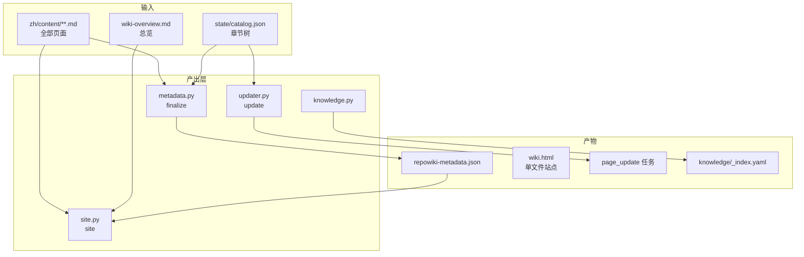
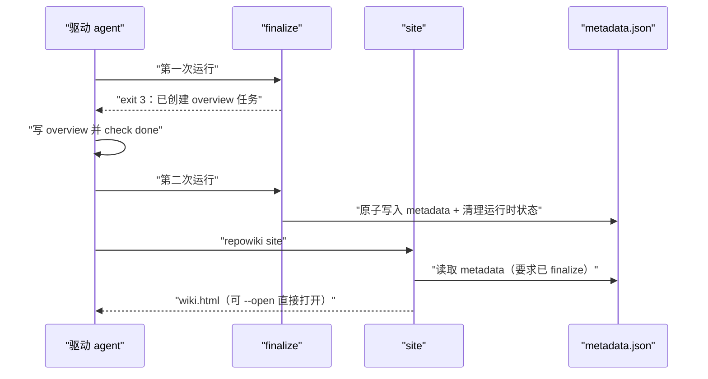
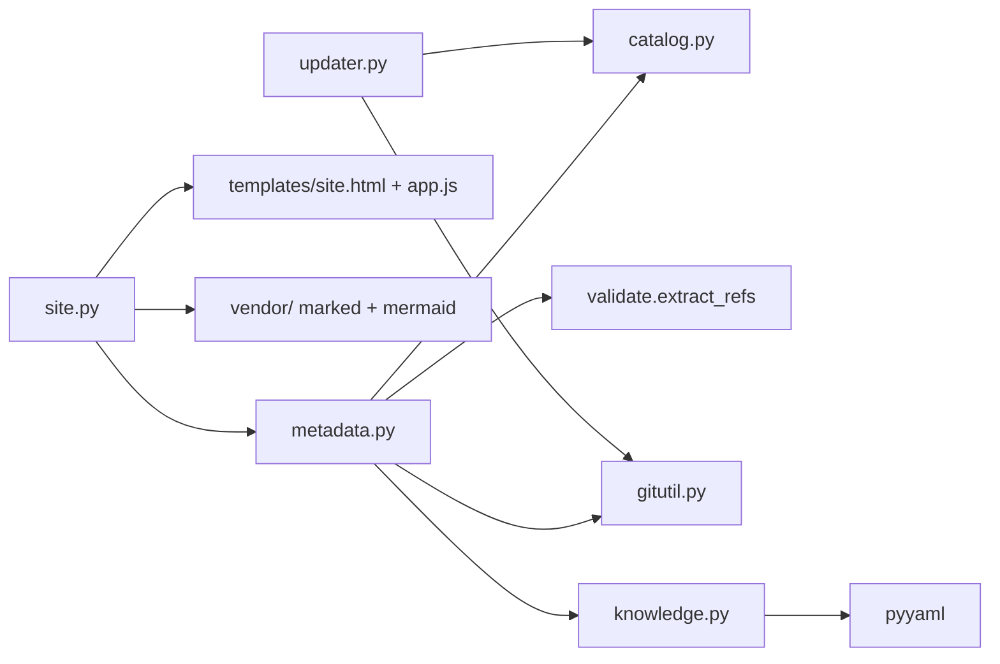

# 产出与站点

<cite>
**本文引用的文件**
- [src/repowiki/metadata.py](file://src/repowiki/metadata.py)
- [src/repowiki/site.py](file://src/repowiki/site.py)
- [src/repowiki/updater.py](file://src/repowiki/updater.py)
- [src/repowiki/knowledge.py](file://src/repowiki/knowledge.py)
</cite>

## 目录
1. [简介](#简介)
2. [项目结构](#项目结构)
3. [核心组件](#核心组件)
4. [架构总览](#架构总览)
5. [详细组件分析](#详细组件分析)
6. [依赖关系分析](#依赖关系分析)
7. [性能与一致性考量](#性能与一致性考量)
8. [故障排查指南](#故障排查指南)
9. [结论](#结论)

## 简介
页面写完只是原材料，本章关注 wiki 的四种最终产出及其生成机制：`finalize` 把全部页面聚合成机器可读的 metadata.json；`update` 基于 git diff 计算受影响页面并发起增量重写；`knowledge` 生成独立于页面体系的知识卡片；`site` 把整份 wiki 连同被引用的源码行打包成浏览器双击即看的单文件 HTML。四个命令共享一个原则：只做确定性转换，产出永远是纯静态文件。

章节来源
- [src/repowiki/metadata.py:1-6](file://src/repowiki/metadata.py#L1-L6)
- [src/repowiki/site.py:1-7](file://src/repowiki/site.py#L1-L7)

## 项目结构
产出层的模块与它们的产物一一对应：

- `src/repowiki/metadata.py`：`run_finalize` 扫描全部页面的 file:// 引用，产出 `<locale>/meta/repowiki-metadata.json`。
- `src/repowiki/site.py`：`run_site` 组装 payload 并渲染 `<locale>/wiki.html`。
- `src/repowiki/updater.py`：`run_update` 做 git diff 到页面任务的映射。
- `src/repowiki/knowledge.py`：知识任务集的发放与 finalize 时的 _index.yaml 聚合。
- `src/repowiki/templates/site.html` 与 `templates/site/app.js`：站点壳层与前端逻辑。

图表来源
- [src/repowiki/metadata.py:59-113](file://src/repowiki/metadata.py#L59-L113)
- [src/repowiki/site.py:27-59](file://src/repowiki/site.py#L27-L59)

章节来源
- [README.md:82-94](file://README.md#L82-L94)

## 核心组件
- metadata.json：wiki_repo（含 last_commit_id）、wiki_catalogs、wiki_items、source_files、code_snippets、knowledge_relations 六大字段。
- extract_refs：从页面文本提取全部 file:// 引用的共享工具，finalize 与 site 都靠它。
- map_affected：把变更文件集合映射到 dependent_files 相交的页面及其祖先链。
- payload：site 的全部数据（nav、pages、snippets、UI 字符串），以 JSON 内嵌进 HTML。
- cleanup_runtime：finalize 成功后清理 claims/tasks，保留 index/catalog/knowledge。

章节来源
- [src/repowiki/metadata.py:79-113](file://src/repowiki/metadata.py#L79-L113)
- [src/repowiki/updater.py:32-42](file://src/repowiki/updater.py#L32-L42)
- [src/repowiki/site.py:44-52](file://src/repowiki/site.py#L44-L52)

## 架构总览
finalize 是从「任务世界」到「产物世界」的出入口：它验收全部任务、聚合引用关系、记录生成时的 git 位置，然后瘦身状态目录；site 则是纯读取的单向转换。下图是 finalize 的两步协议与 site 的衔接：

图表来源
- [src/repowiki/metadata.py:27-50](file://src/repowiki/metadata.py#L27-L50)
- [src/repowiki/site.py:27-36](file://src/repowiki/site.py#L27-L36)

章节来源
- [DECISIONS.md:19-20](file://DECISIONS.md#L19-L20)

## 详细组件分析
### finalize 的引用聚合
- 职责：把页面里的源码引用变成结构化索引。
- 关键行为：对每个节点读页面文本，extract_refs 提取（路径、起、止）三元组；文件去重进 source_files（md5 id），带行区间的进 code_snippets；页面与文件、片段与页面分别建立 CONTAINS / REFERENCED_BY 关系。
- 实现要点：metadata 先写临时文件再 os.replace，与状态账本同样的原子写纪律。

章节来源
- [src/repowiki/metadata.py:59-77](file://src/repowiki/metadata.py#L59-L77)
- [src/repowiki/metadata.py:117-120](file://src/repowiki/metadata.py#L117-L120)

### 增量更新映射
- 职责：让 wiki 跟随仓库演进，只重写真正受影响的页面。
- 关键行为：`git diff --name-only since..HEAD` 取变更集（默认 since 是 metadata 里的 last_commit_id）；与每页 dependent_files 求交集命中页面，并沿 parent 链补齐祖先（章节索引需要反映子页变化）；对全新页面退化为普通 page 任务，不强加更新摘要。
- 实现要点：新顶级目录超过 2 个会建议全量 replan，因为这通常意味着结构变化超出了增量模型的适用范围。

章节来源
- [src/repowiki/updater.py:16-42](file://src/repowiki/updater.py#L16-L42)
- [src/repowiki/updater.py:86-97](file://src/repowiki/updater.py#L86-L97)
- [src/repowiki/tasks.py:132-173](file://src/repowiki/tasks.py#L132-L173)

### 单文件站点组装
- 职责：零依赖浏览整份 wiki。
- 关键行为：收集全部页面 markdown、按 catalog 顺序构建导航树（clean 后退化为目录序）、把每个 file:// 引用对应的源码行内嵌为 snippets；payload 以 JSON 注入 site.html 壳，marked 与 mermaid 从 vendor 内联。
- 实现要点：内联脚本中的 `</script` 统一转义为 `<\/script`，防止提前闭合标签；单片段超过 2 万行则跳过以控制体积。

章节来源
- [src/repowiki/site.py:37-59](file://src/repowiki/site.py#L37-L59)
- [src/repowiki/site.py:193-225](file://src/repowiki/site.py#L193-L225)
- [src/repowiki/site.py:230-251](file://src/repowiki/site.py#L230-L251)

**章节来源**
- [README.md:96-110](file://README.md#L96-L110)

## 依赖关系分析
- finalize 依赖 catalog（flatten）、validate（extract_refs）、gitutil（rev-parse HEAD）与 state（清理运行时产物）。
- site 依赖 metadata 的存在性校验（要求先 finalize），但内容以页面文件为准，metadata 只贡献总览与仓库名。
- updater 依赖 catalog 的树结构与 dependent_files 字段——这正是 finalize 后保留 catalog.json 的原因。
- knowledge 聚合在 finalize 内部被调用，卡片 front matter 的解析用到唯一的第三方依赖 pyyaml。

图表来源
- [src/repowiki/metadata.py:14-21](file://src/repowiki/metadata.py#L14-L21)
- [src/repowiki/site.py:16-22](file://src/repowiki/site.py#L16-L22)

章节来源
- [src/repowiki/metadata.py:171-180](file://src/repowiki/metadata.py#L171-L180)

## 性能与一致性考量
- metadata 与 site 都用「临时文件 + os.replace」写产物，中断不会留下半个文件。
- 站点体积主要来自内嵌源码行与 vendor 库（约 4-5 MB），片段上限与二进制跳过保证极端仓库不会失控。
- last_commit_id 在 finalize 时一次性记录，update 以它为默认起点，保证「生成时点」与「增量起点」严格一致。
- overview 不参与增量更新是显式边界：结构性重构后建议 replan 全量重生成。

章节来源
- [src/repowiki/metadata.py:87-88](file://src/repowiki/metadata.py#L87-L88)
- [src/repowiki/site.py:24](file://src/repowiki/site.py#L24-L24)
- [README.md:208-209](file://README.md#L208-L209)

## 故障排查指南
- finalize 报「仍有 N 个任务未完成」：按报错列出的 id 用 `status` 核对，全部 done 后重试。
- finalize 报「catalog 中有页面尚未生成」：常见于 --max-pages 试跑后直接 finalize；补齐页面或 replan。
- site 报「未找到 metadata」：site 要求先 finalize；finalize 后又删了 metadata 就重跑 finalize。
- update 报「无法确定增量起点」：metadata 缺 last_commit_id（例如手删过），用 `--since <commit>` 显式指定。
- wiki.html 里片段弹层提示源文件缺失：引用的文件在生成后被删除或改名，重建站点也无法恢复，需修页面引用。

章节来源
- [src/repowiki/metadata.py:41-57](file://src/repowiki/metadata.py#L41-L57)
- [src/repowiki/site.py:28-35](file://src/repowiki/site.py#L28-L35)
- [src/repowiki/updater.py:46-56](file://src/repowiki/updater.py#L46-L56)

## 结论
产出层把 wiki 从「一堆 markdown」升级为三种可消费形态：机器可读的 metadata、可持续演化的增量任务流、人可直接打开的单文件站点。它对上游的全部要求只有「页面存在且引用真实」，因此任何合格页面都能无损进入这三种形态——这也是校验层如此执着于 file:// 引用真实性的原因。

章节来源
- [src/repowiki/metadata.py:1-6](file://src/repowiki/metadata.py#L1-L6)
- [src/repowiki/site.py:1-7](file://src/repowiki/site.py#L1-L7)
