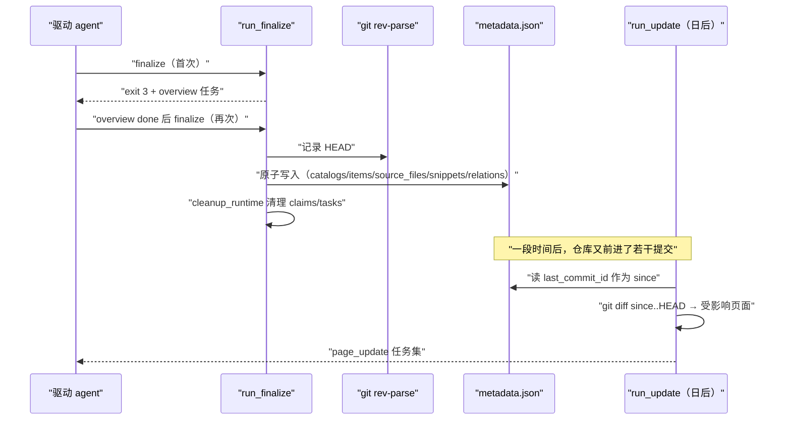
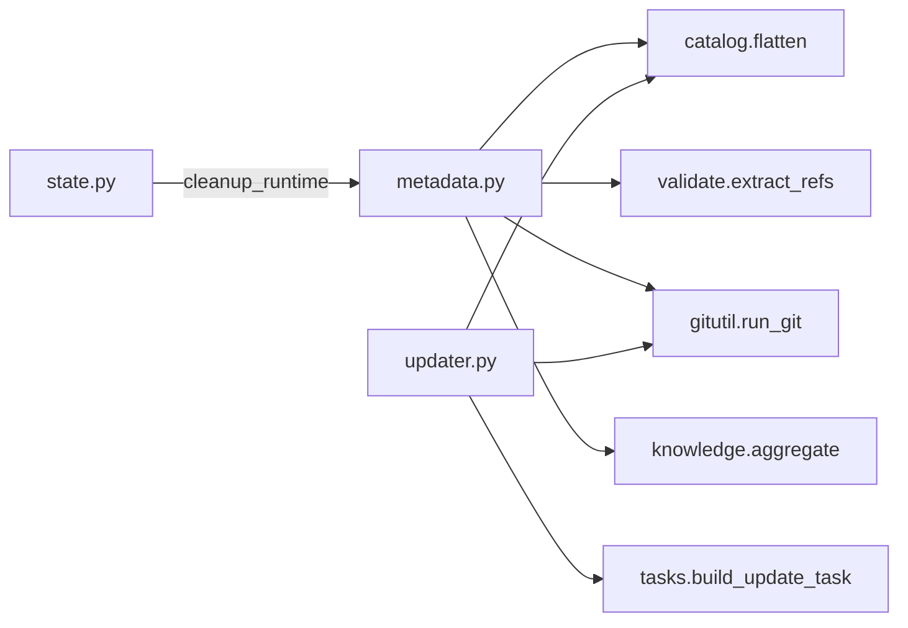

# 元数据组装与增量更新

<cite>
**本文引用的文件**
- [src/repowiki/metadata.py](file://src/repowiki/metadata.py)
- [src/repowiki/updater.py](file://src/repowiki/updater.py)
- [src/repowiki/knowledge.py](file://src/repowiki/knowledge.py)
- [src/repowiki/gitutil.py](file://src/repowiki/gitutil.py)
- [tests/test_flow.py](file://tests/test_flow.py)
</cite>

## 目录
1. [简介](#简介)
2. [项目结构](#项目结构)
3. [核心组件](#核心组件)
4. [架构总览](#架构总览)
5. [详细组件分析](#详细组件分析)
6. [依赖关系分析](#依赖关系分析)
7. [性能与一致性考量](#性能与一致性考量)
8. [故障排查指南](#故障排查指南)
9. [结论](#结论)

## 简介
本页深入两个「页面完成之后」的机制：finalize 如何校验完工状态、聚合引用并组装 `repowiki-metadata.json`（含两步协议与运行时瘦身），以及 update 如何把 `since..HEAD` 的 git 变更映射为最小化的增量重写任务集。两者共同保证 wiki 不是一次性快照，而是可以随仓库演进的活文档。

章节来源
- [src/repowiki/metadata.py:1-6](file://src/repowiki/metadata.py#L1-L6)
- [src/repowiki/updater.py:1-14](file://src/repowiki/updater.py#L1-L14)

## 项目结构
本页涉及的两个主模块各约百余行，职责高度内聚：

- `src/repowiki/metadata.py`：run_finalize 主流程、引用聚合、catalog 校验、知识聚合接入。
- `src/repowiki/updater.py`：git diff 提取、map_affected 影响面计算、增量任务创建与过期任务告警。
- `src/repowiki/knowledge.py`：aggregate_knowledge 在 finalize 尾部被调用，产出 `_index.yaml` 与模块索引。
- `src/repowiki/gitutil.py`：run_git 统一封装，diff 与 rev-parse 的底层通道。

章节来源
- [src/repowiki/metadata.py:27-57](file://src/repowiki/metadata.py#L27-L57)
- [src/repowiki/updater.py:45-70](file://src/repowiki/updater.py#L45-L70)

## 核心组件
- 两步 finalize：首次运行创建 overview 任务并退出码 3（进展性等待），第二次才组装 metadata。
- extract_refs：finalize 与 site 共享的 file:// 引用提取器。
- last_commit_id：finalize 时记录的 HEAD，update 的默认增量起点。
- map_affected：变更集与 dependent_files 求交，并沿 parent 链补齐祖先页面。
- cleanup_runtime：finalize 尾部清理 claims/ 与 tasks/，保留 index/catalog/knowledge 供增量更新。

章节来源
- [src/repowiki/metadata.py:33-39](file://src/repowiki/metadata.py#L33-L39)
- [src/repowiki/updater.py:32-42](file://src/repowiki/updater.py#L32-L42)
- [src/repowiki/state.py:331-342](file://src/repowiki/state.py#L331-L342)

## 架构总览
从「最后一页 done」到「可以开始增量迭代」的完整时序如下，注意 finalize 的两步协议与 metadata 里 commit 锚点的去向：

图表来源
- [src/repowiki/metadata.py:27-50](file://src/repowiki/metadata.py#L27-L50)
- [src/repowiki/updater.py:45-60](file://src/repowiki/updater.py#L45-L60)

章节来源
- [DECISIONS.md:19-20](file://DECISIONS.md#L19-L20)

## 详细组件分析
### finalize 的完工验收
- 职责：确保只有真正完工的 wiki 才会产生 metadata。
- 关键行为：三道闸——catalog 存在且全部节点对应的页面文件在盘、无未 done 任务、（首次运行时）先创建 overview 任务。
- 实现要点：页面存在性校验使得 --max-pages 试跑不会产出含幽灵条目的 metadata（DECISIONS #11 的评审修复）。

章节来源
- [src/repowiki/metadata.py:41-57](file://src/repowiki/metadata.py#L41-L57)
- [DECISIONS.md:29-35](file://DECISIONS.md#L29-L35)

### metadata 字段的来源
- 职责：输出只含可读字段，不泄露内部状态。
- 关键行为：wiki_catalogs 来自 flatten 节点（id/名称/slug/page_brief/父子关系/dependent_files）；source_files 以路径 md5 为 id 去重；code_snippets 以「路径:区间」为 id；relations 记录 CONTAINS 与 REFERENCED_BY 两类边。
- 实现要点：knowledge_summary 来自 aggregate_knowledge，仅在执行过 knowledge 任务集时出现。

章节来源
- [src/repowiki/metadata.py:59-107](file://src/repowiki/metadata.py#L59-L107)
- [README.md:201](file://README.md#L201-L201)

### 增量映射的边界处理
- 职责：保证增量任务集既不遗漏也不过度。
- 关键行为：命中页面沿祖先链补齐（父索引页需反映子页变化）；已存在同 id 任务时跳过；检测到基于旧快照的未完成 update 任务时告警；新顶级目录过多时建议 replan。
- 实现要点：diff 只识别已提交变更，工作区未提交的改动不可见——这是与 git 语义对齐的显式选择。

章节来源
- [src/repowiki/updater.py:62-97](file://src/repowiki/updater.py#L62-L97)
- [README.md:175](file://README.md#L175-L175)

### 知识聚合
- 职责：把散落的知识卡片收拢为机器可读索引。
- 关键行为：从任务记录恢复「模块 id 到输出目录」的映射，写 `_index.yaml` 与各模块 `_module.yaml`。
- 实现要点：聚合发生在 finalize 内部，因此知识卡片也是「全部 done」才有索引。

章节来源
- [src/repowiki/knowledge.py:38-60](file://src/repowiki/knowledge.py#L38-L60)
- [src/repowiki/metadata.py:171-180](file://src/repowiki/metadata.py#L171-L180)

**章节来源**
- [tests/test_flow.py:1-80](file://tests/test_flow.py#L1-L80)

## 依赖关系分析
- finalize 是产出层的汇聚点：catalog 提供结构、validate 提供引用提取、gitutil 提供 commit 锚点、state 提供清理。
- updater 是 catalog 的最大受益者：没有持久化的 dependent_files 与树结构，增量映射无从谈起——这就是 finalize 只清运行时产物的原因。
- 两者对 git 的依赖都被 gitutil 的「失败返回 None」策略吸收，转成明确的 UsageError 而非堆栈。

图表来源
- [src/repowiki/metadata.py:14-21](file://src/repowiki/metadata.py#L14-L21)
- [src/repowiki/updater.py:5-13](file://src/repowiki/updater.py#L5-L13)

章节来源
- [DECISIONS.md:25-28](file://DECISIONS.md#L25-L28)

## 性能与一致性考量
- 引用聚合是每页一次的正则遍历，代价与总页数线性相关；md5 作 id 保证跨页去重稳定。
- 原子写入贯穿始终：metadata 先 tmp 后 replace，绝无半写文件。
- 增量粒度是「页面」而非「段落」：受影响页整页重写并附更新摘要小节，简单且不会产生拼接痕迹。
- 一致性边界：metadata 记录的是 finalize 时点的快照，之后页面被手改不会反映进去，site 重建以页面文件为准。

章节来源
- [src/repowiki/metadata.py:61-77](file://src/repowiki/metadata.py#L61-L77)
- [src/repowiki/site.py:91-100](file://src/repowiki/site.py#L91-L100)

## 故障排查指南
- finalize 退出码 3 不是错误：按提示领取 overview 任务执行并 check，再跑一次 finalize 即可。
- finalize 报页面缺失：页面文件被手删或 --max-pages 试跑未补齐；补页面或 `plan --replan`。
- update 命中 0 页但代码明明变了：确认变更已提交（update 不看工作区），且 since 起点选择正确。
- update 报 git diff 失败：since commit 可能在浅克隆或被 rebase 掉，换有效起点。
- metadata 里没有 knowledge 字段：知识聚合只在执行过 `repowiki knowledge` 任务集时发生。

章节来源
- [src/repowiki/metadata.py:33-50](file://src/repowiki/metadata.py#L33-L50)
- [src/repowiki/updater.py:46-56](file://src/repowiki/updater.py#L46-L56)
- [README.md:175-176](file://README.md#L175-L176)

## 结论
finalize 与 update 组成了 wiki 的「发布」与「迭代」两端：前者用三道验收闸与引用聚合保证产物的完整与可索引，后者用 dependent_files 交集加祖先链把演进成本压到与变更面成正比。两者都依赖 finalize 后保留的最小规划状态（index/catalog），理解这一点就能理解为什么 `clean` 会同时关闭增量更新与幂等 plan。

章节来源
- [src/repowiki/state.py:331-342](file://src/repowiki/state.py#L331-L342)
- [src/repowiki/updater.py:45-52](file://src/repowiki/updater.py#L45-L52)
