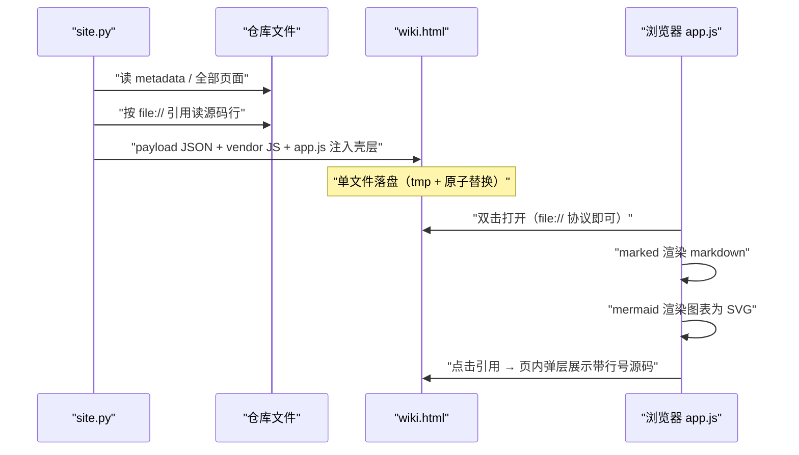
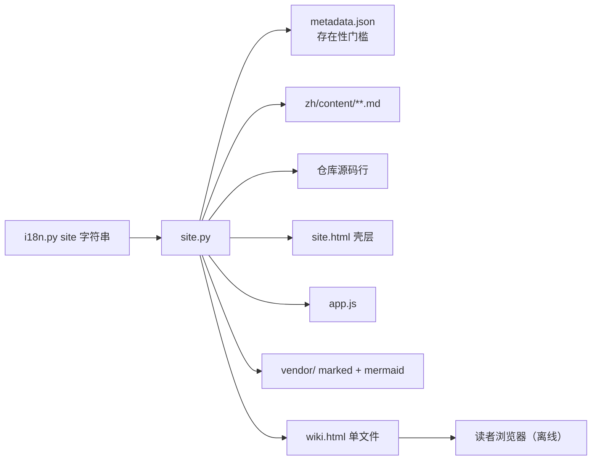

# 单文件离线站点

<cite>
**本文引用的文件**
- [src/repowiki/site.py](file://src/repowiki/site.py)
- [src/repowiki/i18n.py](file://src/repowiki/i18n.py)
- [src/repowiki/templates/site.html](file://src/repowiki/templates/site.html)
- [src/repowiki/templates/site/app.js](file://src/repowiki/templates/site/app.js)
- [src/repowiki/vendor/README.md](file://src/repowiki/vendor/README.md)
</cite>

## 目录
1. [简介](#简介)
2. [项目结构](#项目结构)
3. [核心组件](#核心组件)
4. [架构总览](#架构总览)
5. [详细组件分析](#详细组件分析)
6. [依赖关系分析](#依赖关系分析)
7. [性能与一致性考量](#性能与一致性考量)
8. [故障排查指南](#故障排查指南)
9. [结论](#结论)

## 简介
`repowiki site` 是整条流水线的最后一环：把 `<locale>/content/` 下的全部页面、总览与每个 file:// 引用背后的源码行，连同 markdown 与 mermaid 渲染库一起，打包成一个约 4-5 MB 的自包含 `wiki.html`。它的设计目标是不妥协的离线可用——双击即开、无需服务器、无需网络、单个文件即可转发给同事。

章节来源
- [src/repowiki/site.py:1-7](file://src/repowiki/site.py#L1-L7)
- [README.md:100-110](file://README.md#L100-L110)

## 项目结构
站点功能由一个 Python 组装器与一套前端壳层构成：

- `src/repowiki/site.py`：数据收集（页面、导航、源码片段）与 HTML 渲染的主流程。
- `src/repowiki/templates/site.html`：站点壳层——侧边栏、搜索框、主题按钮、模态框与全部 CSS。
- `src/repowiki/templates/site/app.js`：前端逻辑——渲染、导航切换、搜索、主题、片段弹层。
- `src/repowiki/vendor/`：内嵌的 marked.min.js 与 mermaid.min.js（均为 MIT 许可）。
- `src/repowiki/i18n.py` 的 site 字符串组：界面文案随 wiki 语言本地化。

章节来源
- [src/repowiki/vendor/README.md:1-14](file://src/repowiki/vendor/README.md#L1-L14)
- [src/repowiki/i18n.py:39-48](file://src/repowiki/i18n.py#L39-L48)

## 核心组件
- payload：注入 HTML 的完整数据——repo、locale、generatedAt、ui 文案、nav 导航树、pages 全部页面 markdown、snippets 源码片段。
- _collect_snippets：遍历每页的 file:// 引用，读取对应源码行区间内嵌进 payload（单区间上限 2 万行）。
- _build_nav：按 catalog 的计划顺序构建章节树导航；`clean` 之后退化为磁盘目录序，站点仍可构建。
- _render_html：把 payload JSON、marked、mermaid、app.js 注入 site.html 壳，`</script` 统一转义防标签提前闭合。
- 前端运行时：app.js 负责调用 marked 渲染 markdown、mermaid 渲染图表、维护路由与搜索索引。

章节来源
- [src/repowiki/site.py:44-52](file://src/repowiki/site.py#L44-L52)
- [src/repowiki/site.py:193-213](file://src/repowiki/site.py#L193-L213)
- [src/repowiki/site.py:230-251](file://src/repowiki/site.py#L230-L251)

## 架构总览
站点的生成与阅读是两个完全解耦的阶段：生成期 Python 做纯数据拼装，阅读期浏览器里的 JS 做纯本地渲染。下图覆盖两个阶段：

图表来源
- [src/repowiki/site.py:27-61](file://src/repowiki/site.py#L27-L61)
- [src/repowiki/templates/site/app.js:63-80](file://src/repowiki/templates/site/app.js#L63-L80)

章节来源
- [README.md:100-110](file://README.md#L100-L110)

## 详细组件分析
### 生成期：数据收集与导航
- 职责：把磁盘上的页面集合变成有序、可导航的 payload。
- 关键行为：总览页置顶；页面按 catalog flatten 顺序排列；nav 树由父子关系推导，无子页面的顶级页面降级为独立条目；`_nodes_from_disk` 在 catalog 缺失时按「目录即章节、文件即页面」重建顺序。
- 实现要点：整条链路幂等，finalize 或 update 后重跑 `site` 即得最新站点。

章节来源
- [src/repowiki/site.py:87-125](file://src/repowiki/site.py#L87-L125)
- [src/repowiki/site.py:157-188](file://src/repowiki/site.py#L157-L188)

### 生成期：源码片段内嵌
- 职责：让 file:// 引用在无源码环境也可查看。
- 关键行为：按「路径或路径#区间」为键去重收集；无行区间的引用内嵌整文件；二进制文件与超上限区间标记为 missing。
- 实现要点：片段在生成期一次性读盘，阅读期零 IO、零请求。

章节来源
- [src/repowiki/site.py:193-225](file://src/repowiki/site.py#L193-L225)

### 阅读期：前端运行时
- 职责：把静态 payload 变成可交互的阅读界面。
- 关键行为：openPage 切换页面并高亮导航；slug 函数生成标题锚点；showSnippet 打开源码弹层（Esc 或点击遮罩关闭）；搜索对页面 markdown 的小写索引做子串匹配并截取前 20 条；主题按钮在深浅色间切换。
- 实现要点：整个前端是无构建步骤的原生 JS，IIFE 封装，与壳层 DOM ID 一一对应。

章节来源
- [src/repowiki/templates/site/app.js:97-140](file://src/repowiki/templates/site/app.js#L97-L140)
- [src/repowiki/templates/site/app.js:143-163](file://src/repowiki/templates/site/app.js#L143-L163)
- [src/repowiki/templates/site/app.js:18-30](file://src/repowiki/templates/site/app.js#L18-L30)

**章节来源**
- [src/repowiki/templates/site.html:1-55](file://src/repowiki/templates/site.html#L1-L55)

## 依赖关系分析
- 运行时零外部依赖：marked 与 mermaid 内嵌在文件里，浏览器无需联网加载任何 CDN。
- site.py 对 metadata 的依赖是「存在性门槛」（要求先 finalize），内容仅取总览与仓库名。
- 对 vendor 的依赖是单向内嵌：JS 文件不参与 Python 逻辑，只在渲染时读入。
- 界面文案经 i18n 的 site 字符串组注入 payload，站点的语言与 wiki 内容语言一致。

图表来源
- [src/repowiki/site.py:27-59](file://src/repowiki/site.py#L27-L59)
- [src/repowiki/site.py:230-251](file://src/repowiki/site.py#L230-L251)

章节来源
- [README.md:106-109](file://README.md#L106-L109)

## 性能与一致性考量
- 体积控制：片段区间上限 2 万行、二进制跳过、missing 标记而非失败，保证任何仓库都能产出站点。
- 一致性：payload 在一次渲染内快照完成，页面与片段不会来自不同时间点。
- 原子落盘：临时文件带进程号后缀，写完 os.replace，并发重跑站点也不会损坏文件。
- 安全细节：payload JSON 序列化时把 `<` 转义为 unicode escape，内联脚本统一转义 `</script`，杜绝注入与提前闭合。

章节来源
- [src/repowiki/site.py:24](file://src/repowiki/site.py#L24-L24)
- [src/repowiki/site.py:56-59](file://src/repowiki/site.py#L56-L59)
- [src/repowiki/site.py:230-251](file://src/repowiki/site.py#L230-L251)

## 故障排查指南
- 报「未找到 metadata」：先 finalize；metadata 被删则重跑 finalize。
- 报「未找到任何已生成的 wiki 页面」：content 目录为空，检查 locale 是否与页面目录一致。
- 图表渲染失败：mermaid 语法错误时前端会降级显示源码文本，回到对应页面的 mermaid 块修语法后重建站点。
- 片段弹层提示源文件不存在：页面引用的文件已被删除或改名，需修正页面引用（可配合 update 重写）。
- 站点内容落后于页面：站点是快照，页面改动后重跑 `repowiki site` 即可，幂等无损。

章节来源
- [src/repowiki/site.py:28-40](file://src/repowiki/site.py#L28-L40)
- [src/repowiki/templates/site/app.js:75-80](file://src/repowiki/templates/site/app.js#L75-L80)

## 结论
单文件站点是「确定性转换」哲学的最好展示：输入是页面与源码，输出是一个字节确定的自包含 HTML，中间没有任何服务、状态或网络。它把 repowiki 的产出标准从「机器可读」提升到「人可随时随地阅读」，同时保持了与流水线其他环节相同的幂等与原子纪律。

章节来源
- [src/repowiki/site.py:1-7](file://src/repowiki/site.py#L1-L7)
- [README.md:106-110](file://README.md#L106-L110)
