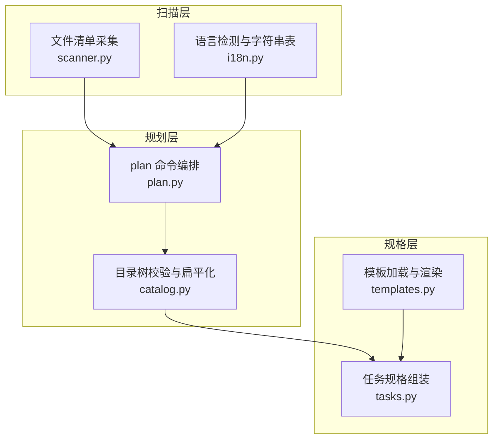
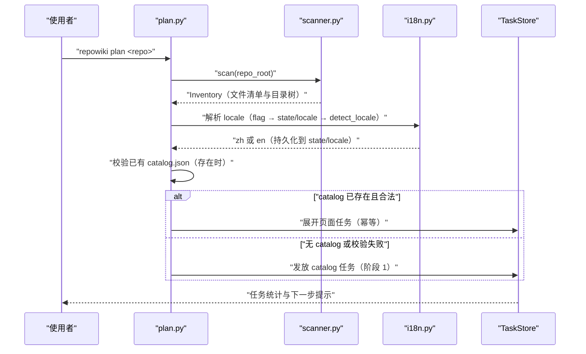
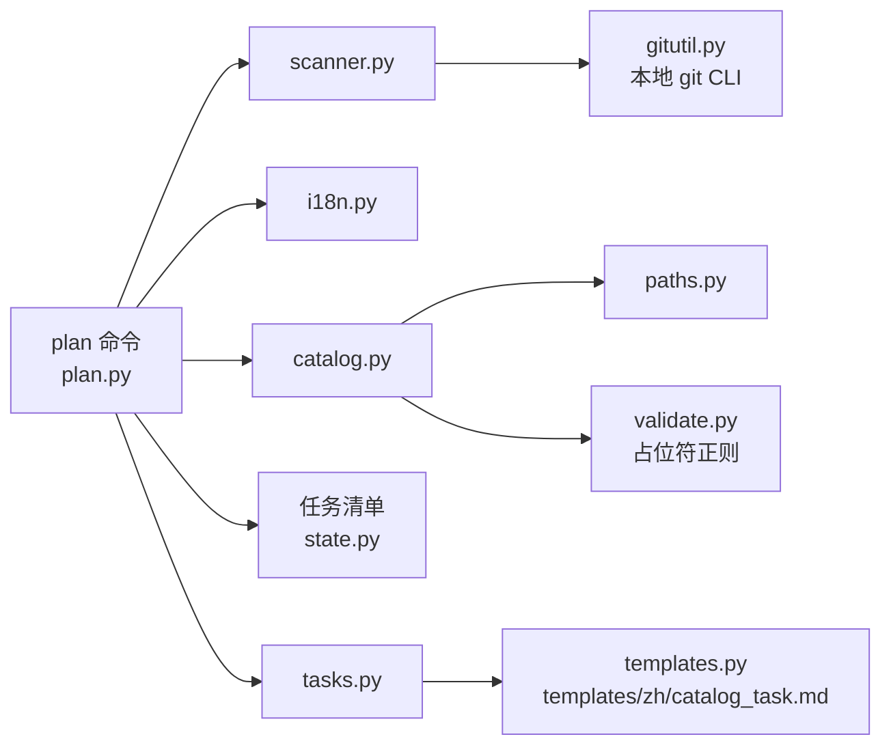

# 仓库扫描与任务规划

<cite>
**本文引用的文件**
- [scanner.py](file://src/repowiki/scanner.py)
- [i18n.py](file://src/repowiki/i18n.py)
- [plan.py](file://src/repowiki/plan.py)
- [catalog.py](file://src/repowiki/catalog.py)
- [templates.py](file://src/repowiki/templates.py)
- [tasks.py](file://src/repowiki/tasks.py)
- [catalog_task.md](file://src/repowiki/templates/zh/catalog_task.md)
</cite>

## 更新摘要

**变更内容**
- `src/repowiki/i18n.py` 的双语字符串表 `STRINGS` 新增 `section_sources` key（中文「章节来源」/ 英文「Section sources」），供校验器执行新的逐小节来源标记规则——每个 `##` 小节（目录与更新摘要除外）必须非空且携带该来源标记，见 [src/repowiki/i18n.py:33-36](file://src/repowiki/i18n.py#L33-L36) 与 [src/repowiki/i18n.py:76-79](file://src/repowiki/i18n.py#L76-L79)。
- 本页「简介」小节按新规则补齐了「章节来源」；「i18n.py：产出语言检测」小节的职责描述同步提及该新增 key。

## 目录
1. [更新摘要](#更新摘要)
2. [简介](#简介)
3. [项目结构](#项目结构)
4. [核心组件](#核心组件)
5. [架构总览](#架构总览)
6. [详细组件分析](#详细组件分析)
7. [依赖关系分析](#依赖关系分析)
8. [性能与一致性考量](#性能与一致性考量)
9. [故障排查指南](#故障排查指南)
10. [结论](#结论)

## 简介
「仓库扫描与任务规划」是 repowiki 构建流程的起点：`repowiki plan` 先用 scanner 把仓库变成一份确定性的文件清单，再用 i18n 的纯本地算法判定产出语言，随后由 plan 编排落盘任务清单（目录规划任务最先发放），catalog 则定义了目录树 `state/catalog.json` 的合法形态与每个页面的落盘路径。规划完成后，templates 把 catalog 任务模板渲染成自包含的任务规格，任何 worker 无需额外上下文即可执行。本页覆盖 `src/repowiki/` 中的 scanner.py、i18n.py、plan.py、catalog.py 与 templates.py 五个模块及其模板资产。

章节来源
- [src/repowiki/plan.py:38-103](file://src/repowiki/plan.py#L38-L103)
- [src/repowiki/i18n.py:19-45](file://src/repowiki/i18n.py#L19-L45)

## 项目结构
- `src/repowiki/scanner.py`：文件清单采集——git ls-files 优先、目录遍历兜底，产出 Inventory（文件、代码行数、语言、关键文件、压缩目录树）。
- `src/repowiki/i18n.py`：产出语言检测与各语言 UI 字符串表；检测基于 README 与源码样本的 CJK 占比，零网络。
- `src/repowiki/plan.py`：`plan` 命令编排——仓库规模门禁、locale 解析与持久化、catalog 加载校验、任务清单落盘。
- `src/repowiki/catalog.py`：catalog.json 的 schema 校验、树扁平化与 `<locale>/content/` 输出路径推导。
- `src/repowiki/templates.py`：模板资产加载器，按 locale 读取 `templates/<locale>/` 并做 `{{PLACEHOLDER}}` 替换。
- `src/repowiki/tasks.py`：把扫描结果与模板组装成任务规格（catalog 任务与页面任务），落盘到 `state/tasks/`。
- `src/repowiki/templates/zh/catalog_task.md`：目录规划任务的规格模板，含 JSON Schema、规划规则与质量自检清单。

图表来源
- [src/repowiki/plan.py:1-15](file://src/repowiki/plan.py#L1-L15)
- [src/repowiki/scanner.py:1-6](file://src/repowiki/scanner.py#L1-L6)

章节来源
- [src/repowiki/plan.py:1-17](file://src/repowiki/plan.py#L1-L17)
- [src/repowiki/scanner.py:1-6](file://src/repowiki/scanner.py#L1-L6)
- [src/repowiki/i18n.py:1-7](file://src/repowiki/i18n.py#L1-L7)
- [src/repowiki/catalog.py:1-7](file://src/repowiki/catalog.py#L1-L7)
- [src/repowiki/templates.py:1-8](file://src/repowiki/templates.py#L1-L8)

## 核心组件
- scan / Inventory：采集仓库全部文本文件（跳过二进制与忽略目录），统计代码行数与语言，识别仓库根的关键文件并渲染压缩目录树。
- detect_locale：按「README 优先、源码注释兜底」的确定性规则判定 zh / en，结果持久化到 `state/locale`，后续命令一律遵循。
- run_plan：plan 命令入口——规模门禁（代码文件数下限）、replan 守卫、locale 解析、catalog 加载校验、任务发放。
- validate_catalog / flatten：catalog.json 的 schema 校验（id、title、slug 全局唯一、深度上限、占位符禁令），并把树扁平化为带输出路径的 FlatNode 列表。
- templates.load / render：按 locale 加载模板并对 `{{PLACEHOLDER}}` 做替换，未知占位符刻意保留原样，交由产物校验器发现漏替换。
- build_catalog_task / build_page_tasks：把 Inventory 与模板渲染成任务规格写入 `state/tasks/`，并向任务清单注册 catalog 任务（阶段 1）与页面任务（阶段 2）。

章节来源
- [src/repowiki/scanner.py:116-147](file://src/repowiki/scanner.py#L116-L147)
- [src/repowiki/i18n.py:135-161](file://src/repowiki/i18n.py#L135-L161)
- [src/repowiki/plan.py:38-103](file://src/repowiki/plan.py#L38-L103)
- [src/repowiki/catalog.py:45-135](file://src/repowiki/catalog.py#L45-L135)
- [src/repowiki/templates.py:22-38](file://src/repowiki/templates.py#L22-L38)
- [src/repowiki/tasks.py:61-115](file://src/repowiki/tasks.py#L61-L115)

## 架构总览
`plan` 的执行是一条单向数据流：scanner 产出 Inventory，i18n 依据 Inventory 中的代码文件判定 locale 并持久化，plan 检查仓库规模与 replan 前置条件后，优先加载已有的 `state/catalog.json`——存在且校验通过则直接扁平化展开为页面任务（幂等入口），否则发放 catalog 任务等待 agent 规划目录树；模板层把仓库信息注入 catalog 任务规格。规划阶段是整个流程的阶段 1，页面任务（阶段 2）与总览任务（阶段 3）由阶段门控顺序发放。

图表来源
- [src/repowiki/plan.py:38-103](file://src/repowiki/plan.py#L38-L103)
- [src/repowiki/plan.py:29-35](file://src/repowiki/plan.py#L29-L35)

章节来源
- [src/repowiki/plan.py:70-88](file://src/repowiki/plan.py#L70-L88)
- [src/repowiki/catalog.py:45-46](file://src/repowiki/catalog.py#L45-L46)

## 详细组件分析
### scanner.py：确定性文件清单与摘要截断
- 职责：为规划任务提供一份可复现的仓库文件清单与压缩目录树，作为目录规划的全部输入。
- 关键行为：仓库含 `.git` 时执行 `git ls-files -z`（精确遵循 .gitignore），失败或无 `.git` 时回退到剪枝目录遍历；随后逐文件过滤二进制（首 8 KB 含 NUL 字节）、按扩展名映射语言并标记是否代码文件；再按 KEY_FILE_GLOBS 识别仓库根的 README、pyproject.toml、package.json 等关键文件。
- 实现要点：所有截断都是确定性常量——单文件超过 2 MB 只列出不数行数；目录树每目录最多显示 20 个文件、总量超 400 行即截断并注明省略的目录数，保证超大仓库的规划输入体积有上界。

章节来源
- [src/repowiki/scanner.py:74-95](file://src/repowiki/scanner.py#L74-L95)
- [src/repowiki/scanner.py:98-113](file://src/repowiki/scanner.py#L98-L113)
- [src/repowiki/scanner.py:49-51](file://src/repowiki/scanner.py#L49-L51)
- [src/repowiki/scanner.py:143-170](file://src/repowiki/scanner.py#L143-L170)

### i18n.py：产出语言检测（零网络）
- 职责：决定 Wiki 产出语言（zh / en），并为校验器、站点等提供各语言的 UI 字符串表（必备小节名、「章节来源」标记文案、站点文案等）；其中 `section_sources` key（zh「章节来源」/ en「Section sources」）是校验器逐小节来源规则的标记词来源。
- 关键行为：README 优先——README.md 存在且含足够自然文本（CJK 与拉丁字母合计不少于 20）时直接由其 CJK 占比决定（阈值 0.15）；README 不够 decisive 时，退而检查代码文件样本（最多 24 个、各取头 8 KB）中是否有 CJK 字符不少于 30 的文件（非英文注释即判 zh）。
- 实现要点：翻译版姊妹文件（README.en.md / README.zh.md）不会盖过主 README——排序后取到 README.en.md 也不许它投票；代码中的标识符恒为拉丁字母，因此不计入文档语言信号。检测结果持久化到 `state/locale`，plan 时锁定，后续命令一律读取持久值。

章节来源
- [src/repowiki/i18n.py:135-161](file://src/repowiki/i18n.py#L135-L161)
- [src/repowiki/i18n.py:109-118](file://src/repowiki/i18n.py#L109-L118)
- [src/repowiki/i18n.py:19-45](file://src/repowiki/i18n.py#L19-L45)
- [src/repowiki/i18n.py:33-36](file://src/repowiki/i18n.py#L33-L36)
- [src/repowiki/i18n.py:76-79](file://src/repowiki/i18n.py#L76-L79)
- [src/repowiki/plan.py:29-35](file://src/repowiki/plan.py#L29-L35)
- [src/repowiki/plan.py:62-67](file://src/repowiki/plan.py#L62-L67)

### catalog.py：schema 校验与输出路径推导
- 职责：作为「什么是合法目录树」的唯一事实来源，校验 `state/catalog.json` 并把树扁平化为带输出路径的节点列表。
- 关键行为：校验 repo_name 与非空 chapters；递归检查每个节点的 id、title、slug 全局唯一（slug 必须匹配小写英文加连字符的正则）、树深度不超过 4、kind 只能是 chapter 或 page、page 不得有 children；title 含 `{{...}}` 占位符形态直接报错（标题会写进页面 H1，触发产物校验误判）；page_brief 必填；dependent_files 引用不在仓库清单的路径时剔除并给 warning 而非报错。
- 实现要点：flatten 为每个 chapter 生成同名目录与同名索引页，根级 page 落在 `<locale>/content/` 顶层；同级标题净化后冲突时追加 `__2` 后缀；archetype 只认 module / flow，缺省回落 module。catalog_tree_text 把扁平树渲染为带 page_brief 的缩进文本，供后续任务规格引用。

章节来源
- [src/repowiki/catalog.py:17-19](file://src/repowiki/catalog.py#L17-L19)
- [src/repowiki/catalog.py:45-135](file://src/repowiki/catalog.py#L45-L135)
- [src/repowiki/catalog.py:138-179](file://src/repowiki/catalog.py#L138-L179)
- [src/repowiki/catalog.py:182-193](file://src/repowiki/catalog.py#L182-L193)

### templates.py 与 catalog 任务规格
- 职责：把仓库信息与写作规则注入文本模板，产出任何 worker 都能独立执行的任务规格。
- 关键行为：templates.load 按 locale 读取 `templates/<locale>/` 下的模板文件，缺文件时回落默认语言；render 用正则替换 `{{PLACEHOLDER}}`，未提供值的占位符刻意原样保留，让产物校验器能发现「忘替换」；build_catalog_task 把仓库名、代码文件数、关键文件、目录树与代码文件清单注入 catalog_task.md，规格落盘 `state/tasks/catalog.md`。
- 实现要点：catalog_task.md 内嵌 JSON Schema（chapters 树结构）、八条规划规则（根章节数建议、深度上限、title 全局唯一且禁占位符、dependent_files 必须真实存在、page_brief 要具体、archetype 选择指引）与写前质量自检清单，使规划 agent 无需阅读 repowiki 源码即可产出合法目录树。

章节来源
- [src/repowiki/templates.py:17-38](file://src/repowiki/templates.py#L17-L38)
- [src/repowiki/tasks.py:61-78](file://src/repowiki/tasks.py#L61-L78)
- [src/repowiki/templates/zh/catalog_task.md:29-58](file://src/repowiki/templates/zh/catalog_task.md#L29-L58)
- [src/repowiki/templates/zh/catalog_task.md:60-66](file://src/repowiki/templates/zh/catalog_task.md#L60-L66)

## 依赖关系分析
- plan 的上游：scanner 依赖 gitutil 调用本地 git CLI（`git ls-files`）；i18n 与 catalog 是 plan 的直接依赖；plan 通过 tasks 间接依赖 templates 与 paths。
- plan 的下游：任务清单写入 TaskStore（state.py），catalog 任务与页面任务的规格分别引用 catalog_task.md 与 page_task.md 模板；catalog 校验复用 validate 的占位符正则，路径净化复用 paths 的工具函数。
- 模块边界：catalog.py 是输出路径的唯一事实来源；i18n.py 是语言相关的唯一事实来源；两者共同保证「同一仓库重复 plan 产出一致」。

图表来源
- [src/repowiki/plan.py:8-15](file://src/repowiki/plan.py#L8-L15)
- [src/repowiki/catalog.py:14-15](file://src/repowiki/catalog.py#L14-L15)

章节来源
- [src/repowiki/plan.py:1-15](file://src/repowiki/plan.py#L1-L15)
- [src/repowiki/scanner.py:14](file://src/repowiki/scanner.py#L14)
- [src/repowiki/tasks.py:67-77](file://src/repowiki/tasks.py#L67-L77)

## 性能与一致性考量
- 规划输入有上界：目录树每目录 20 个文件、总量 400 行截断，代码文件清单有 FILE_LIST_CAP 上限，超大仓库的规划 prompt 体积仍然可控。
- 检测零成本零网络：locale 判定只读 README 头 8 KB 与最多 24 个代码文件样本头 8 KB，无任何 API 调用；结果持久化后全流程只判定一次。
- 幂等与评审回路：`plan` 遇到已存在且合法的 catalog.json 时不再创建 catalog 任务、直接展开页面任务；人或 agent 可以直接编辑 `state/catalog.json` 后重新 plan，这就是目录评审回路的入口。
- 一致性守卫：replan 会删除现有状态与规格，因此存在 in_progress 任务或 index 无法解析时必须显式 `--force`，防止误删他人正在写入的产物；locale 目录决定 `<locale>/content` 的创建位置，因此 locale 必须在 ensure() 之前解析。
- 残留检测：展开页面任务后对比磁盘上已有页面与 catalog 期望输出，不在 catalog 中的旧页面会产生 warning 提示清理。

章节来源
- [src/repowiki/scanner.py:49-51](file://src/repowiki/scanner.py#L49-L51)
- [src/repowiki/i18n.py:115-118](file://src/repowiki/i18n.py#L115-L118)
- [src/repowiki/plan.py:38-53](file://src/repowiki/plan.py#L38-L53)
- [src/repowiki/plan.py:62-68](file://src/repowiki/plan.py#L62-L68)
- [src/repowiki/plan.py:127-140](file://src/repowiki/plan.py#L127-L140)

## 故障排查指南
- plan 报「代码文件数少于 10，仓库太小」：代码文件数低于 MIN_CODE_FILES 常量的硬门禁，说明仓库规模不适合生成 Wiki；确认目标仓库路径无误。
- replan 报「检测到 in_progress 任务」：replan 会删除正在被写入的产物；等待任务完成，或确认放弃恢复后加 `--force`。
- replan 报「index 无法解析」：状态文件损坏时 plan 拒绝在无法确认执行状态的情况下清空，同样以 `--force` 显式确认。
- plan 产出 warning「已有 catalog.json 校验失败，将重新规划」：目录树违反 schema（如 id 重复、深度超限、slug 非法），按 warning 中列出的前 5 条错误修复 catalog 或让它重新规划。
- 产出 warning「以下 dependent_files 不在仓库清单中，已剔除」：catalog 引用了不存在的文件路径；这些引用已被剔除，可修正后重新 plan。
- 产出语言不符合预期：locale 在 plan 时锁定并持久化于 `state/locale`；显式 `plan --locale zh|en` 或 replan 重新检测（注意 replan 清空任务状态）。
- 产出 warning「N 个已生成页面不在当前 catalog 中」：磁盘上存在旧残留页面；对照 warning 列出的路径确认后手工清理或 replan。

章节来源
- [src/repowiki/plan.py:17](file://src/repowiki/plan.py#L17)
- [src/repowiki/plan.py:41-53](file://src/repowiki/plan.py#L41-L53)
- [src/repowiki/plan.py:72-78](file://src/repowiki/plan.py#L72-L78)
- [src/repowiki/catalog.py:91-95](file://src/repowiki/catalog.py#L91-L95)
- [src/repowiki/catalog.py:133-134](file://src/repowiki/catalog.py#L133-L134)
- [src/repowiki/plan.py:127-140](file://src/repowiki/plan.py#L127-L140)

## 结论
仓库扫描与任务规划把「一个仓库」确定性地变成「一份任务清单」：scanner 提供有界的文件清单，i18n 零网络锁定产出语言，plan 负责门禁、幂等与落盘，catalog 定义目录树的合法形态与页面路径，templates 把这一切包装成自包含的任务规格。正确使用方式是先 `plan` 生成目录规划任务，agent 完成 catalog 后再次 `plan` 展开页面任务；注意事项是 catalog 的 schema 约束（唯一性、深度、真实路径）会在校验时逐条执行，产出语言在 plan 时锁定，replan 属破坏性操作需显式 `--force`。

章节来源
- [src/repowiki/plan.py:38-103](file://src/repowiki/plan.py#L38-L103)
- [src/repowiki/catalog.py:1-7](file://src/repowiki/catalog.py#L1-L7)
- [src/repowiki/templates/zh/catalog_task.md:50-58](file://src/repowiki/templates/zh/catalog_task.md#L50-L58)
