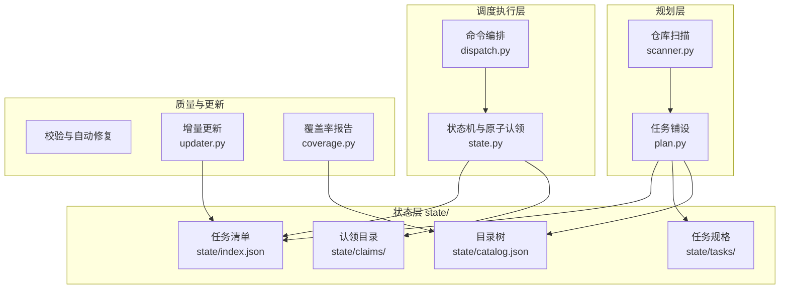
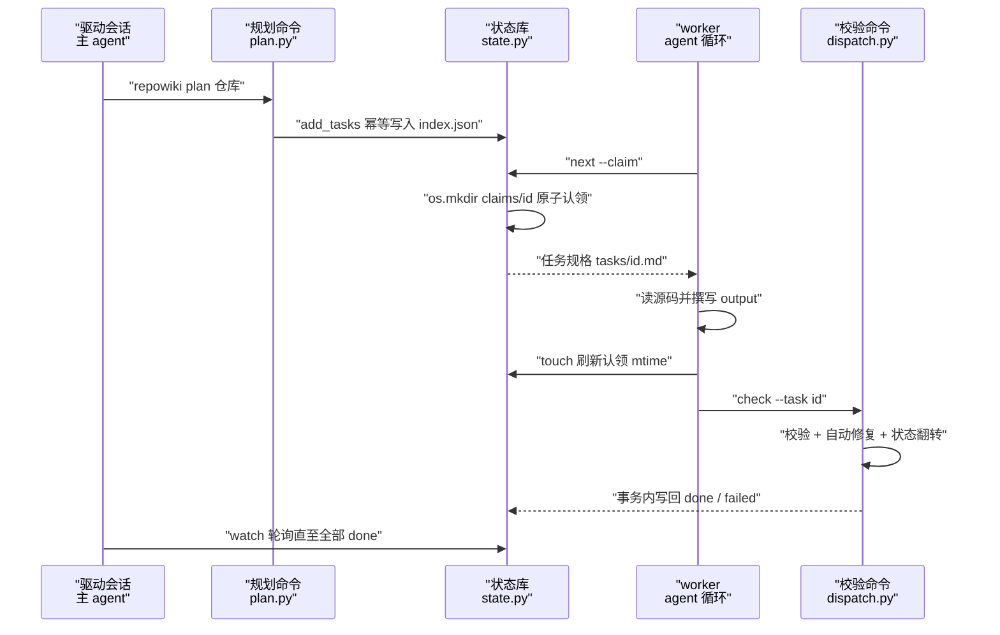
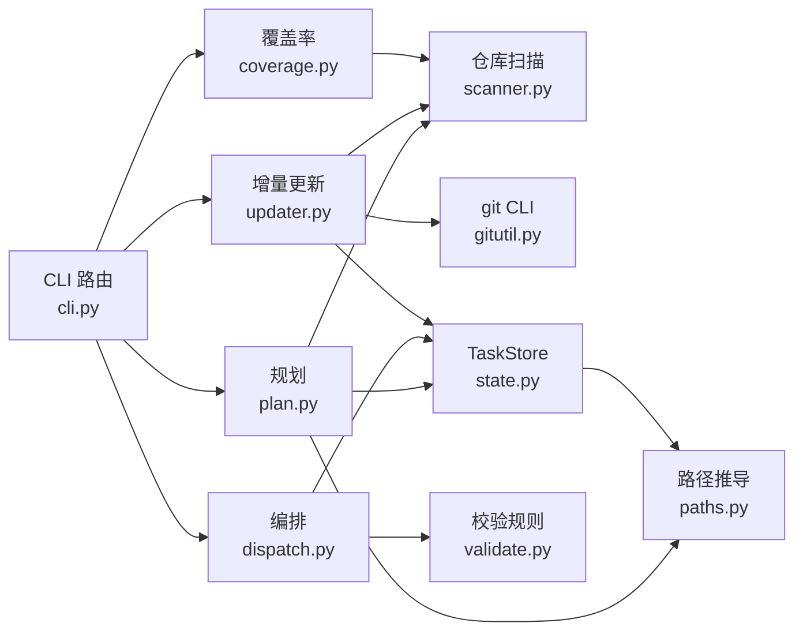

# 任务编排与状态管理

<cite>
**本文引用的文件**
- [plan.py](file://src/repowiki/plan.py)
- [dispatch.py](file://src/repowiki/dispatch.py)
- [state.py](file://src/repowiki/state.py)
- [paths.py](file://src/repowiki/paths.py)
- [updater.py](file://src/repowiki/updater.py)
- [coverage.py](file://src/repowiki/coverage.py)
</cite>

## 更新摘要

**变更内容**
- `run_check` 调用 `check_page` 时新增传入 `known_paths=inv.known_paths()`（仓库文件清单），用于校验器核对 mermaid 图节点标签中的文件名（不存在仅告警），见 [src/repowiki/dispatch.py:293-296](file://src/repowiki/dispatch.py#L293-L296) 与 [src/repowiki/dispatch.py:354-357](file://src/repowiki/dispatch.py#L354-L357)；「run_check：校验与自动修复」小节的校验行为描述已同步更新。
- 配套的校验规则变化：行号校验分层（仅终点越界自动钳制；起点越界、区间倒置、引用区间全为空行判 error）、每个 `##` 小节须非空且含「章节来源」；本页「结论」小节据此补齐了来源引用。

## 目录
1. [更新摘要](#更新摘要)
2. [简介](#简介)
3. [项目结构](#项目结构)
4. [核心组件](#核心组件)
5. [架构总览](#架构总览)
6. [详细组件分析](#详细组件分析)
7. [依赖关系分析](#依赖关系分析)
8. [性能与一致性考量](#性能与一致性考量)
9. [故障排查指南](#故障排查指南)
10. [结论](#结论)

## 简介

任务编排与状态管理是 repowiki 的编排侧机制层，解决「如何把一次仓库扫描变成一份可多 worker 并发消费、可失败重试、可增量续写的工作清单」这一问题。它由五大机制构成：扫描与规划（`plan.py` 落任务清单）、领取与调度（`dispatch.py` 与 `state.py` 的 FIFO 认领）、校验与自动修复（`check` 命令驱动的规则引擎）、增量更新（`updater.py` 把 git 变更映射为 page_update 任务）与覆盖率报告（`coverage.py` 统计 wiki 引用过的仓库文件）。所有机制的单一事实来源是仓库内的 `.repowiki/state/` 目录——`index.json` 记录任务状态、`tasks/` 存任务规格、`claims/` 存认领、`catalog.json` 存目录树规划、`locale` 文件固定产出语言，任何命令崩溃后重启都能从该目录恢复现场。

章节来源
- [src/repowiki/plan.py:1-17](file://src/repowiki/plan.py#L1-L17)
- [src/repowiki/state.py:1-6](file://src/repowiki/state.py#L1-L6)
- [src/repowiki/paths.py:107-137](file://src/repowiki/paths.py#L107-L137)

## 项目结构

编排侧代码与运行时状态的组织如下：

- `src/repowiki/plan.py`：`plan` 命令实现——扫描仓库、确定 locale、铺设 catalog 或页面任务。
- `src/repowiki/dispatch.py`：`next` / `check` / `touch` / `release` / `status` / `watch` 六个命令的编排层。
- `src/repowiki/state.py`：`TaskStore` 任务状态库——状态机、原子认领、心跳与 stale 回收。
- `src/repowiki/paths.py`：全部路径的确定性推导（`.repowiki/` 下各目录、GitHub 锚点、文件名清洗）。
- `src/repowiki/updater.py`：`update` / `stale` 命令——把 git 变更映射为增量更新任务或只读过期报告。
- `src/repowiki/coverage.py`：`coverage` 命令——仓库文件与 wiki 引用的覆盖率对账。
- `.repowiki/state/`（运行时生成）：`index.json` 任务清单、`tasks/<id>.md` 任务规格、`claims/<id>/` 认领目录、`catalog.json` 目录树、`locale` 语言标记。

图表来源
- [src/repowiki/plan.py:54-85](file://src/repowiki/plan.py#L54-L85)
- [src/repowiki/dispatch.py:1-28](file://src/repowiki/dispatch.py#L1-L28)
- [src/repowiki/coverage.py:24-44](file://src/repowiki/coverage.py#L24-L44)

章节来源
- [src/repowiki/plan.py:1-17](file://src/repowiki/plan.py#L1-L17)
- [src/repowiki/dispatch.py:1-28](file://src/repowiki/dispatch.py#L1-L28)
- [src/repowiki/state.py:1-6](file://src/repowiki/state.py#L1-L6)
- [src/repowiki/updater.py:1-16](file://src/repowiki/updater.py#L1-L16)
- [src/repowiki/coverage.py:1-21](file://src/repowiki/coverage.py#L1-L21)

## 核心组件

- `run_plan`（plan.py）：流程起点，扫描仓库并幂等地添加任务记录，代码文件数不足 10 个时拒绝生成。
- `run_next` / `run_check` / `run_touch` / `run_release` / `run_status` / `run_watch`（dispatch.py）：worker 循环与主 agent 监控所需的全部命令实现。
- `TaskStore`（state.py）：跨进程任务状态机，提供文件锁事务、`os.mkdir` 原子认领、touch 心跳、stale 回收与重试上限。
- `WikiPaths`（paths.py）：把章节标题确定性映射为目录/文件名（NFC 归一、非法字符替换、`__2` 消歧），并推导 `.repowiki/` 下全部路径。
- `run_update` / `run_stale`（updater.py）：以 `last_commit_id` 为起点的 git diff 映射，分别产出增量任务与只读过期报告。
- `run_coverage`（coverage.py）：对仓库清单与全部 `file://` 引用（页面、总览、知识卡片 source_files）求差集，输出可复现的覆盖率指标。

章节来源
- [src/repowiki/plan.py:38-103](file://src/repowiki/plan.py#L38-L103)
- [src/repowiki/dispatch.py:50-76](file://src/repowiki/dispatch.py#L50-L76)
- [src/repowiki/state.py:93-97](file://src/repowiki/state.py#L93-L97)
- [src/repowiki/paths.py:42-74](file://src/repowiki/paths.py#L42-L74)
- [src/repowiki/updater.py:99-225](file://src/repowiki/updater.py#L99-L225)
- [src/repowiki/coverage.py:24-76](file://src/repowiki/coverage.py#L24-L76)

## 架构总览

运行时交互为：`plan` 扫描仓库后经 `TaskStore.add_tasks` 幂等写入 `state/index.json`；worker 以 `next --claim` 从 `ready_tasks` 按 FIFO 领取——认领的原子性由对 `claims/<id>/` 的 `os.mkdir` 保证；撰写期间以 `touch` 刷新认领 mtime；`check` 在文件锁事务内校验产出、自动修复确定性缺陷并翻转状态；catalog 任务通过校验后展开全部页面任务，队列清空后进入 finalize。主 agent 可用 `watch` 阻塞轮询进度，`update` / `coverage` 则在同一状态目录上做增量与质量延伸。整个过程中没有常驻进程，全部并发协调都落在 state/ 目录的文件系统语义上。

图表来源
- [src/repowiki/plan.py:80-103](file://src/repowiki/plan.py#L80-L103)
- [src/repowiki/state.py:294-308](file://src/repowiki/state.py#L294-L308)
- [src/repowiki/dispatch.py:318-370](file://src/repowiki/dispatch.py#L318-L370)

章节来源
- [src/repowiki/state.py:1-6](file://src/repowiki/state.py#L1-L6)
- [src/repowiki/dispatch.py:50-76](file://src/repowiki/dispatch.py#L50-L76)
- [src/repowiki/dispatch.py:127-200](file://src/repowiki/dispatch.py#L127-L200)

## 详细组件分析

### TaskStore：状态机与原子认领

- 职责：维护 pending / in_progress / done / failed 四态任务生命周期，是全部命令共享的唯一写入方。
- 关键行为：`load` 在 `.index.lock` 文件锁下读取 index，`_transaction` 把读改写序列化；`claim` 借助 `os.mkdir` 的原子性发放任务，竞争失败抛 `ConflictError`；`ready_tasks` 只返回当前开放阶段中 pending、未达重试上限的 failed，以及认领已 stale 的 in_progress 任务，并按 `(attempts, phase, 插入顺序)` 排序——失败少的任务优先重试。
- 实现要点：认领的新鲜度以 `claims/<id>/` 目录 mtime 衡量（默认 15 分钟窗口），因为 CLI 进程短命、记录的 pid 无意义；stale 认领通过先 rename 成僵尸目录再重试 mkdir 被安全偷取，多竞争者只有一个成功。

章节来源
- [src/repowiki/state.py:1-6](file://src/repowiki/state.py#L1-L6)
- [src/repowiki/state.py:100-163](file://src/repowiki/state.py#L100-L163)
- [src/repowiki/state.py:213-243](file://src/repowiki/state.py#L213-L243)
- [src/repowiki/state.py:259-308](file://src/repowiki/state.py#L259-L308)

### run_next 与领取调度

- 职责：把就绪任务公平地分发给并发 worker。
- 关键行为：`--claim` 模式下对 `ready_tasks(limit=1)` 逐个尝试认领，每次只发放一个任务（worker 契约：一次只持有一个认领）；认领竞争失败被静默跳过，由下一次 `next` 重新挑选。
- 实现要点：返回的 payload 携带任务规格全文（从 `state/tasks/<id>.md` 读取）与进度统计，worker 无需第二个往返即可开始撰写；未加 `--claim` 时为只读预览。

章节来源
- [src/repowiki/dispatch.py:50-76](file://src/repowiki/dispatch.py#L50-L76)
- [src/repowiki/dispatch.py:35-47](file://src/repowiki/dispatch.py#L35-L47)
- [src/repowiki/state.py:219-243](file://src/repowiki/state.py#L219-L243)

### run_check：校验与自动修复

- 职责：task 输出的唯一验收入口，兼做规划任务的展开器。
- 关键行为：先执行所有权守卫（in_progress 任务被其他存活 worker 认领时拒绝并返回退出码 2）；按任务类型分发到 `check_page` 等校验器，调用时传入 `inv.known_paths()` 仓库文件清单；凡可计算缺陷（仅终点越界的行号钳制、路径分隔符、H1、目录锚点）原地修复写回，语义缺陷（行号起点越界、区间倒置、引用区间全为空行、小节缺失/为空/缺「章节来源」、引用不存在的文件）判 failed；校验动作同时刷新认领心跳。
- 实现要点：catalog / knowledge_plan 这类规划任务通过校验后会调用 `_expand_pages` / `_expand_knowledge` 把后续任务集落库——队列的阶段性展开因此成为 check 的副作用；done 为终态，重复 check 只读报告不再翻转状态（只读路径同样以 `known_paths` 复核页面）。

章节来源
- [src/repowiki/dispatch.py:205-262](file://src/repowiki/dispatch.py#L205-L262)
- [src/repowiki/dispatch.py:282-301](file://src/repowiki/dispatch.py#L282-L301)
- [src/repowiki/dispatch.py:318-370](file://src/repowiki/dispatch.py#L318-L370)
- [src/repowiki/dispatch.py:382-421](file://src/repowiki/dispatch.py#L382-L421)

### run_plan：扫描与任务铺设

- 职责：把仓库快照变成任务清单的入口。
- 关键行为：`scan` 盘点文件后先做规模门槛（少于 10 个代码文件直接拒绝）；locale 按「显式参数 > 持久化的 state/locale > README 加权检测」解析并持久化；已有合法 catalog 时用 `flatten` 展开为页面任务，否则只添加 catalog 任务（阶段 1），由 catalog 任务的 check 副作用展开页面任务（阶段 2）。
- 实现要点：`add_tasks` 按 id 幂等——重复 plan 不会产生重复任务；`--replan` 会先检查 `_busy_tasks`，存在在飞任务或 index 不可解析时要求显式 `--force`，避免删除正在被写入的产物。

章节来源
- [src/repowiki/plan.py:38-68](file://src/repowiki/plan.py#L38-L68)
- [src/repowiki/plan.py:80-88](file://src/repowiki/plan.py#L80-L88)
- [src/repowiki/plan.py:116-124](file://src/repowiki/plan.py#L116-L124)
- [src/repowiki/state.py:173-185](file://src/repowiki/state.py#L173-L185)

### run_update 与 run_stale：增量更新

- 职责：让 wiki 跟随代码演进而无需全量重生成。
- 关键行为：以 metadata 中的 `last_commit_id`（或 `--since` 指定 ref）做 `git diff --name-only`，`map_affected` 把变更文件与 catalog 节点的 `dependent_files` 求交集并沿父链传播；命中的页面生成 `<id>-update` 任务，任意命中时 overview 也一并刷新；知识卡片按 `source_files`、模块按 `scope` 联动映射。`run_stale` 是同一映射的只读版本，供 CI 用 `--fail-if-stale` 做过期门禁（命中即退出码 1）。
- 实现要点：`queue_or_rearm` 处理三种历史——在飞任务不动、全新 id 创建任务、上一轮已 done 的更新任务重置为 pending 并重写规格（重新武装），保证第二轮 update 不会静默失效；同时告警未完成的旧增量任务与 catalog 未覆盖的新顶级目录。

章节来源
- [src/repowiki/updater.py:19-53](file://src/repowiki/updater.py#L19-L53)
- [src/repowiki/updater.py:99-147](file://src/repowiki/updater.py#L99-L147)
- [src/repowiki/updater.py:196-225](file://src/repowiki/updater.py#L196-L225)
- [src/repowiki/updater.py:251-305](file://src/repowiki/updater.py#L251-L305)

### run_coverage：引用覆盖率报告

- 职责：以可计算事实衡量 wiki 对仓库的覆盖程度。
- 关键行为：收集全部页面与总览中的 `file://` 引用路径，加上知识卡片的 `source_files`，与 `scan` 得到的仓库清单求差集；输出覆盖率（被引用文件占比）、未引用文件列表与零引用页面警告。
- 实现要点：纯只读、不调用任何 agent——数字是确定性事实，既可作为补写指南也可作为质量门禁；人类输出最多列 50 个未引用文件，JSON 输出含全量。

章节来源
- [src/repowiki/coverage.py:1-21](file://src/repowiki/coverage.py#L1-L21)
- [src/repowiki/coverage.py:24-76](file://src/repowiki/coverage.py#L24-L76)

## 依赖关系分析

- `cli.py` 是唯一入口，按子命令把控制流交给 plan、dispatch、updater、coverage 各模块的 `run_*` 函数。
- 四个编排模块都依赖 `state.py` 的 `TaskStore` 做状态读写，依赖 `paths.py` 的 `WikiPaths` 定位 state/ 与产出目录。
- `plan` / `update` / `coverage` 共同依赖 `scanner.scan` 提供仓库清单，`update` / `coverage` 又都依赖 `catalog.flatten` 解析目录树。
- `dispatch.check` 依赖 `validate` 的规则引擎（本页只述编排，规则细节见校验器实现）。
- `updater` 依赖 `gitutil.run_git` 执行 git diff，并把产出任务交给 `tasks` 构建器与 `TaskStore.add_tasks` 落库。
- 外部依赖仅两项：文件系统语义（锁、原子 rename/mkdir）与 git CLI。

图表来源
- [src/repowiki/dispatch.py:14-28](file://src/repowiki/dispatch.py#L14-L28)
- [src/repowiki/updater.py:8-16](file://src/repowiki/updater.py#L8-L16)
- [src/repowiki/coverage.py:14-19](file://src/repowiki/coverage.py#L14-L19)

章节来源
- [src/repowiki/plan.py:8-15](file://src/repowiki/plan.py#L8-L15)
- [src/repowiki/updater.py:3-16](file://src/repowiki/updater.py#L3-L16)
- [src/repowiki/coverage.py:14-19](file://src/repowiki/coverage.py#L14-L19)

## 性能与一致性考量

- 一致性优先：index 的读改写全程持有 `.index.lock` 独占文件锁（POSIX fcntl / Windows msvcrt），读也走同一把锁，牺牲少量吞吐换取跨进程强一致。
- 缩小写窗口：事务只合并被触碰的任务条目而非整表重写，index 保存先写临时文件再 `os.replace` 原子替换，崩溃不会留下半截清单。
- Windows 兼容：`os.replace` 与并发读在同一文件上可能撞 `PermissionError`，读写两侧都做了亚毫秒级重试。
- 无常驻进程的活性判定：认领 liveness 完全由 `claims/<id>/` 的 mtime 与 15 分钟 stale 窗口表达，`touch` 心跳即续期；`stats` 把 stale 认领排除出 busy 计数，避免 watch 误报停滞。
- 调度公平性：`ready_tasks` 以 attempts 升序为先，天然让失败任务优先重试且抑制毒任务占队首。
- 监控成本：`watch` 默认 10 秒轮询一次 `stats`，输出去重（状态行不变不打印），对 state 目录的读压力可忽略。

章节来源
- [src/repowiki/state.py:35-48](file://src/repowiki/state.py#L35-L48)
- [src/repowiki/state.py:100-163](file://src/repowiki/state.py#L100-L163)
- [src/repowiki/state.py:137-142](file://src/repowiki/state.py#L137-L142)
- [src/repowiki/state.py:385-418](file://src/repowiki/state.py#L385-L418)
- [src/repowiki/dispatch.py:127-200](file://src/repowiki/dispatch.py#L127-L200)

## 故障排查指南

- `next --claim` 一直拿不到任务 → 当前阶段任务全部 in_progress 且认领新鲜 → `status` 查看 busy 与各 worker 心跳，等待或由持有者完成，见 [src/repowiki/dispatch.py:79-88](file://src/repowiki/dispatch.py#L79-L88)。
- `check` 报「任务 X 正被其他 worker 执行中」→ 认领目录存在且未过期 → 确认 worker 标识一致后再试；确属僵尸认领会随 stale 窗口自动可抢，见 [src/repowiki/state.py:294-308](file://src/repowiki/state.py#L294-L308)。
- `watch` 报「停滞」退出码 1 → 剩余任务 exhausted（重试 3 次仍失败）→ `status` 找出 exhausted id，`release --task <id> --force` 重置后重跑，见 [src/repowiki/dispatch.py:175-192](file://src/repowiki/dispatch.py#L175-L192)。
- `StateError: state/index.json 损坏` → 异常中断留下非法 JSON（文件原样保留，不会被当空清单覆盖）→ 手工修复该文件或 `plan --replan --force` 重来，见 [src/repowiki/state.py:126-133](file://src/repowiki/state.py#L126-L133)。
- `update` 报「无法确定增量起点」→ metadata 缺 `last_commit_id` 且未给 `--since` → 用 `--since <commit>` 显式指定，见 [src/repowiki/updater.py:99-110](file://src/repowiki/updater.py#L99-L110)。
- `coverage` / `update` 报「state/catalog.json 不存在」→ 首次生成未完成或 state 被清理 → 先走完整 plan → check → finalize 流程，见 [src/repowiki/coverage.py:24-32](file://src/repowiki/coverage.py#L24-L32)。
- 任务写了很久突然被他人接手 → 撰写期间未 touch，认领 mtime 越过 stale 窗口被偷取 → 长任务每 2-3 分钟执行 `touch --task <id>`，见 [src/repowiki/state.py:259-267](file://src/repowiki/state.py#L259-L267)。
- `.index.lock` 被长期占用报错 → Windows 下 msvcrt 锁约 10 秒未获得即放弃 → 确认持锁的 repowiki 进程是否存活后重试，见 [src/repowiki/state.py:52-73](file://src/repowiki/state.py#L52-L73)。

章节来源
- [src/repowiki/dispatch.py:99-116](file://src/repowiki/dispatch.py#L99-L116)
- [src/repowiki/dispatch.py:175-192](file://src/repowiki/dispatch.py#L175-L192)
- [src/repowiki/state.py:52-73](file://src/repowiki/state.py#L52-L73)
- [src/repowiki/updater.py:99-110](file://src/repowiki/updater.py#L99-L110)

## 结论

任务编排与状态管理把 repowiki 的全部协调问题收敛到一个文件系统目录（`.repowiki/state/`）加一个状态机类（`TaskStore`）：plan 幂等铺任务、next 原子发放、touch 维持活性、check 校验并展开、update 与 coverage 在同一状态上做增量与质量延伸。正确使用方式是始终经由 CLI 命令间接读写 state 目录、让 worker 遵守一次一个认领与心跳纪律；需要注意 state/index.json 是易损的单点（损坏须手工恢复或强制重规划），重试上限与 stale 窗口这两个默认值（3 次、15 分钟）可用环境变量按仓库规模调节。

章节来源
- [src/repowiki/dispatch.py:205-262](file://src/repowiki/dispatch.py#L205-L262)
- [src/repowiki/state.py:93-153](file://src/repowiki/state.py#L93-L153)
- [src/repowiki/state.py:219-267](file://src/repowiki/state.py#L219-L267)
