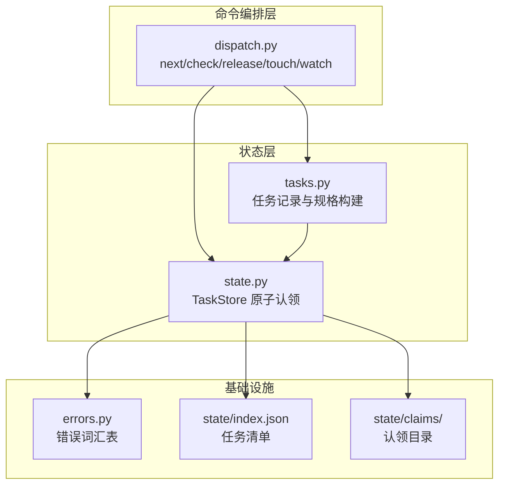
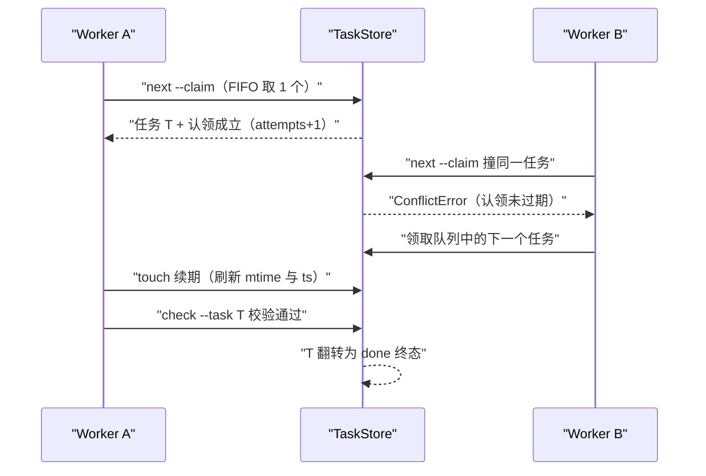
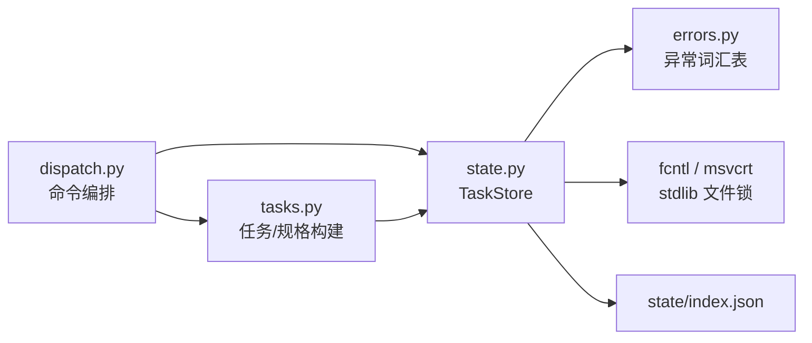

# 任务领取与并发调度

<cite>
**本文引用的文件**
- [dispatch.py](file://src/repowiki/dispatch.py)
- [state.py](file://src/repowiki/state.py)
- [tasks.py](file://src/repowiki/tasks.py)
- [errors.py](file://src/repowiki/errors.py)
</cite>

## 更新摘要

**变更内容**
- `run_check` 调用页面校验器时新增传入 `known_paths=inv.known_paths()`（仓库文件清单），供校验器核对 mermaid 图节点标签中的文件名（不存在仅告警、不判失败），见 [src/repowiki/dispatch.py:354-357](file://src/repowiki/dispatch.py#L354-L357)；「check 的归属守卫与终态语义」小节已同步更新。
- 校验器语义缺陷清单扩充：行号起点越界、区间倒置、引用区间全为空行、`##` 小节缺失/为空/缺「章节来源」均判 failed（仅终点越界仍自动钳制）；本页「简介」小节按新规则补齐了「章节来源」。

## 目录
1. [更新摘要](#更新摘要)
2. [简介](#简介)
3. [项目结构](#项目结构)
4. [核心组件](#核心组件)
5. [架构总览](#架构总览)
6. [详细组件分析](#详细组件分析)
7. [依赖关系分析](#依赖关系分析)
8. [性能与一致性考量](#性能与一致性考量)
9. [故障排查指南](#故障排查指南)
10. [结论](#结论)

## 简介

任务领取与并发调度是 repowiki 编排层的核心：多个 worker（agent / 进程 / 人）通过 `next --claim` 从同一个 FIFO 队列原子地领取任务，靠 `touch` 心跳维持认领新鲜，过期认领被自动回收转给他人，`watch` 命令为主控会话提供阻塞式完成/停滞信号。这套机制由 `dispatch.py`（命令编排）、`state.py`（状态机与原子认领）、`tasks.py`（任务记录与规格构建）和 `errors.py`（错误词汇表）四个模块协作实现，是「多 worker 并发安全、断点续跑」这两个卖点的直接落点。

章节来源
- [src/repowiki/dispatch.py:1-7](file://src/repowiki/dispatch.py#L1-L7)
- [src/repowiki/state.py:1-6](file://src/repowiki/state.py#L1-L6)

## 项目结构

调度相关代码集中在 `src/repowiki/` 下，分层清晰：

- `src/repowiki/dispatch.py`：命令编排原语 `next` / `check` / `release` / `status` / `touch` / `watch` 的实现与退出码约定。
- `src/repowiki/state.py`：`TaskStore` 状态存储——状态机、原子认领、stale 回收、文件锁事务。
- `src/repowiki/tasks.py`：任务记录与规格文件构建器——每份任务在 `state/index.json` 有记录，在 `state/tasks/<id>.md` 有不可变规格。
- `src/repowiki/errors.py`：共享错误词汇表（叶子模块，不依赖任何其他模块）。
- 运行时数据：`state/index.json`（任务清单）、`state/claims/<id>/`（认领目录）、`state/tasks/<id>.md`（任务规格）。

图表来源
- [src/repowiki/dispatch.py:1-28](file://src/repowiki/dispatch.py#L1-L28)
- [src/repowiki/state.py:1-20](file://src/repowiki/state.py#L1-L20)
- [src/repowiki/tasks.py:1-18](file://src/repowiki/tasks.py#L1-L18)
- [src/repowiki/errors.py:1-9](file://src/repowiki/errors.py#L1-L9)

章节来源
- [src/repowiki/dispatch.py:1-7](file://src/repowiki/dispatch.py#L1-L7)
- [src/repowiki/state.py:1-6](file://src/repowiki/state.py#L1-L6)
- [src/repowiki/tasks.py:1-7](file://src/repowiki/tasks.py#L1-L7)

## 核心组件

- `TaskStore`（state.py）：任务状态存储，提供状态机迁移、原子认领、stale 判定与回收、锁内读改写事务。
- `run_next`（dispatch.py）：FIFO 拉取入口，`ready_tasks(limit=1)` 一次只发放一个任务，返回体携带 `busy` 字段供 worker 判断等待。
- `run_check`（dispatch.py）：循环的心脏——按任务类型校验产出、自动修复确定性缺陷、翻转状态，并对规划任务展开后续任务集。
- `run_watch`（dispatch.py）：阻塞式监控，退出码 0 表示全部完成、1 表示停滞或超时，供主控会话免轮询决策。
- `run_touch` / `heartbeat`：worker 侧心跳原语，防止长任务执行期间认领被判 stale 遭回收。
- 任务规格（tasks.py）：每任务一份自包含 markdown 规格，内嵌完整页面模板与文风规范，换取并行安全。
- 错误词汇表（errors.py）：`UsageError` / `StateError` 映射退出码 1，`ConflictError` 映射退出码 2。

章节来源
- [src/repowiki/dispatch.py:50-76](file://src/repowiki/dispatch.py#L50-L76)
- [src/repowiki/dispatch.py:205-262](file://src/repowiki/dispatch.py#L205-L262)
- [src/repowiki/dispatch.py:127-134](file://src/repowiki/dispatch.py#L127-L134)
- [src/repowiki/state.py:93-97](file://src/repowiki/state.py#L93-L97)
- [src/repowiki/errors.py:1-7](file://src/repowiki/errors.py#L1-L7)

## 架构总览

两个 worker 并发领取时的交互时序如下：worker A 先 `next --claim` 拿到任务并立即 `touch` 建立认领；worker B 随后对同一任务发起认领时，`os.mkdir` 原子性使其失败并收到 `ConflictError`（A 的认领未过期）；A 执行期间定期 `touch` 续期 claim 目录的 mtime；A 完成 `check` 通过后任务进入 done 终态。若 A 中途死亡，其认领在 stale 窗口（默认 15 分钟）后过期，`ready_tasks` 把任务重新纳入可领取集合，下一个 `next --claim` 走抢占路径自动回收。

图表来源
- [src/repowiki/state.py:269-292](file://src/repowiki/state.py#L269-L292)
- [src/repowiki/state.py:294-308](file://src/repowiki/state.py#L294-L308)
- [src/repowiki/state.py:353-367](file://src/repowiki/state.py#L353-L367)

章节来源
- [src/repowiki/state.py:245-308](file://src/repowiki/state.py#L245-L308)
- [src/repowiki/dispatch.py:50-76](file://src/repowiki/dispatch.py#L50-L76)

## 详细组件分析

### next 与 FIFO 队列

- 职责：以纯 FIFO 拉取方式向 worker 发放任务，一次只发放一个，维持「一次只持有一个认领」的 worker 契约。
- 关键行为：`run_next` 调用 `ready_tasks(limit=1)`，认领时的 `ConflictError` 被有意吞掉（输掉竞态就等下一次 next 重新挑选）；未指定 `--worker` 时默认取 `hostname:pid`；返回体含 `busy`（真正存活中的认领数，stale 认领不计入）与进度统计，worker 据此实现「空且 busy>0 → 等待重试」。
- 实现要点：`ready_tasks` 只发放当前最小未完成 phase 中的任务；排序键为 `(attempts, phase, index 顺序)`——失败任务不插队、新任务优先，防止坏任务拖死 worker；failed 且 attempts 达上限的任务被排除（exhausted）。

章节来源
- [src/repowiki/dispatch.py:50-76](file://src/repowiki/dispatch.py#L50-L76)
- [src/repowiki/state.py:219-243](file://src/repowiki/state.py#L219-L243)
- [src/repowiki/state.py:213-217](file://src/repowiki/state.py#L213-L217)

### 原子认领与 stale 回收

- 职责：保证同一任务同一时刻只有一个存活 worker；死亡 worker 的认领自动回队列，无需人工干预。
- 关键行为：并发安全来自单一原语——对 `claims/<id>/` 的 `os.mkdir`（原子，已存在即失败）；认领时写入 `worker` 与 `ts` 两个标记文件并使 attempts 加 1；发现目录已存在时先判 stale，stale 则把它改名成 `.stale-<id>-<随机>` 留痕（只有一个竞争者能成功）后重试 mkdir，最多 3 轮。
- 实现要点：stale 判定的单一事实来源是 claim 目录自身的 mtime——不读目录内的 ts 文件，因为 ts 在 mkdir 之后才写入，刚建的认领会因 ts 缺失被误判为无限旧而遭抢占；不做 pid 存活检测（短命 CLI 进程的 pid 无意义），touch 心跳是唯一的存活信号。

章节来源
- [src/repowiki/state.py:269-292](file://src/repowiki/state.py#L269-L292)
- [src/repowiki/state.py:250-267](file://src/repowiki/state.py#L250-L267)
- [src/repowiki/state.py:294-308](file://src/repowiki/state.py#L294-L308)

### touch 心跳与认领续期

- 职责：worker 在长任务执行期间周期性续期认领，避免被误判 stale 遭回收。
- 关键行为：`touch` 要求任务处于 in_progress，否则抛 `ConflictError`；带 `--worker` 时校验认领归属（认领者不是自己则拒绝）；`heartbeat` 同时刷新目录内 ts 文件与目录 mtime（utime），并把 `heartbeat_at` 写回 index。
- 实现要点：stale 窗口默认 900 秒（`DEFAULT_STALE_SECONDS` = 15 分钟），可用环境变量 `REPOWIKI_STALE_SECONDS` 覆盖；`check` 校验 in_progress 任务时也会顺带调用 `heartbeat` 续期，防执行期被抢双写。

章节来源
- [src/repowiki/state.py:343-367](file://src/repowiki/state.py#L343-L367)
- [src/repowiki/state.py:21-28](file://src/repowiki/state.py#L21-L28)
- [src/repowiki/dispatch.py:255-257](file://src/repowiki/dispatch.py#L255-L257)

### check 的归属守卫与终态语义

- 职责：校验 agent 产出、自动修复确定性缺陷、翻转状态，并防止跨 worker 误翻别人的任务。
- 关键行为：必须显式 `--task <id>`（单任务）或 `--all`（崩溃恢复，检查全部 in_progress/failed）；带 worker 参数时对 in_progress 目标读取认领目录的 worker 文件，非本 worker 认领则抛 `ConflictError` 提示需 `--force`；done 是终态——重复 check 只走只读路径报告产出是否存在，绝不翻转状态（规格可能已被清理，翻转会产生无规格可执行的任务）。
- 实现要点：按 kind 分派校验器（page/overview/knowledge_card/knowledge_module），页面校验调用 `check_page` 时传入 `inv.known_paths()` 仓库文件清单（校验器据此对 mermaid 图节点标签中的文件名做 basename 核对，不存在仅告警）；校验产生的自动修复直接写回产出文件；校验通过置 done、失败置 failed；catalog/knowledge-plan 类规划任务校验通过后会展开后续页面/知识任务集。

章节来源
- [src/repowiki/dispatch.py:205-262](file://src/repowiki/dispatch.py#L205-L262)
- [src/repowiki/dispatch.py:282-301](file://src/repowiki/dispatch.py#L282-L301)
- [src/repowiki/dispatch.py:318-370](file://src/repowiki/dispatch.py#L318-L370)
- [src/repowiki/dispatch.py:354-357](file://src/repowiki/dispatch.py#L354-L357)
- [src/repowiki/dispatch.py:382-410](file://src/repowiki/dispatch.py#L382-L410)

### watch 监控与 release 重置

- 职责：`watch` 给主控会话一个阻塞式信号（完成/停滞/超时三分支）；`release` 提供人工重置入口。
- 关键行为：watch 轮询 stats，全部 done → 退出码 0；「剩余任务但无执行中且无可领取」→ 停滞退出码 1（先用新鲜 stats 复核，避免快照滞后造成假停滞）；超过 `--timeout` → 超时退出码 1。stale 认领被明确排除在 in_flight 之外——它们的 worker 已死、队列会重新发放，计入会掩盖真停滞。`release` 对 in_progress 任务校验认领归属（他人认领需 `--force`），释放时把认领目录改名 `.released-*`；对 exhausted 毒任务必须 `--force` 才能重置为 pending 并清零 attempts。
- 实现要点：watch 输出行有变化才打印（避免刷屏）；`run_clean` 可整体删除 state/（保留 wiki 产出），但会失去增量更新与断点续跑能力。

章节来源
- [src/repowiki/dispatch.py:127-200](file://src/repowiki/dispatch.py#L127-L200)
- [src/repowiki/state.py:310-341](file://src/repowiki/state.py#L310-L341)
- [src/repowiki/state.py:421-437](file://src/repowiki/state.py#L421-L437)

## 依赖关系分析

- dispatch.py 是 state.py 的唯一命令层消费者：所有命令先构造 `TaskStore`，再调用其状态机方法；check 另依赖 scanner（仓库清单）与 validate（各 kind 校验器）。
- state.py 依赖 errors.py 的三个异常与 paths.py 的路径布局；文件锁优先 fcntl、回退 msvcrt，两者都不可用时报 `UsageError`。
- tasks.py 依赖 state.py 的 `new_task`（统一记录字段）与 templates/catalog/scanner（渲染规格），产出被 dispatch 的 check 展开逻辑消费。
- errors.py 是叶子模块：不导入任何兄弟模块，使命令模块可以无环地引用异常类型。

图表来源
- [src/repowiki/dispatch.py:14-28](file://src/repowiki/dispatch.py#L14-L28)
- [src/repowiki/state.py:17-20](file://src/repowiki/state.py#L17-L20)
- [src/repowiki/tasks.py:13-17](file://src/repowiki/tasks.py#L13-L17)
- [src/repowiki/state.py:52-73](file://src/repowiki/state.py#L52-L73)

章节来源
- [src/repowiki/errors.py:1-7](file://src/repowiki/errors.py#L1-L7)
- [src/repowiki/state.py:52-73](file://src/repowiki/state.py#L52-L73)
- [src/repowiki/tasks.py:76-90](file://src/repowiki/tasks.py#L76-L90)

## 性能与一致性考量

- 一致性基石：index.json 的读改写全部经 `_transaction` 串行化——进程级独占文件锁 + 临时文件 `os.replace` 原子替换；每次事务只合并被触任务条目（`_merge_task`），把读改写窗口压到最小。
- 读路径也走锁：Windows 上 `os.replace` 与并发读者冲突（CPython 不以 FILE_SHARE_DELETE 打开），无锁读会破坏并发写，因此读者与写者共用同一把锁；锁持有时间亚毫秒，热读路径是轮询而非紧旋。
- Windows 特有竞态：一个进程 `os.replace` 原子换路径期间，另一进程 open 同一路径可能短暂 PermissionError，`_retry_windows_fs` 以 20 次 × 50 毫秒重试吸收这个亚毫秒窗口。
- 坏索引绝不静默：index.json 损坏时抛 `StateError` 保留现场，而不是当作空清单——否则下一次读改写事务会用单个任务覆写整个计划。
- 防毒任务策略：`ready_tasks` 按 attempts 升序排空新任务优先；failed 达 `REPOWIKI_MAX_ATTEMPTS`（默认 3）上限即 exhausted 出队，需人工 `release --force` 重置。

章节来源
- [src/repowiki/state.py:100-135](file://src/repowiki/state.py#L100-L135)
- [src/repowiki/state.py:137-171](file://src/repowiki/state.py#L137-L171)
- [src/repowiki/state.py:35-49](file://src/repowiki/state.py#L35-L49)
- [src/repowiki/state.py:24-28](file://src/repowiki/state.py#L24-L28)

## 故障排查指南

- `next` 退出码 2 / 报「正被其他 worker 执行中」：目标认领未过期，属正常竞争——不争抢、不加 `--force`，直接领取队列中的下一个任务。
- 任务卡在 in_progress 且 status 显示 stale：worker 已死或停止 touch；stale 窗口（默认 15 分钟）过后 `next --claim` 会自动回收（`.stale-*` 留痕），无需人工释放，确认 worker 存活情况或补派即可。
- `touch` 报「由 X 认领，不是 Y」：`--worker` 名与认领者不一致；核对启动该 worker 时使用的名字，认领归属不可冒用。
- watch 报停滞（stalled）：剩余任务无执行中且无可领取，通常是 exhausted 毒任务——`repowiki status` 查看 exhausted 清单，`release --task <id> --force` 重置。
- 报「state/index.json 损坏」：文件已原样保留，可手工修复恢复任务清单，或确认无需恢复后 `repowiki plan --replan --force` 重来；绝不静默清空。
- Windows 下报 state 锁被长期占用：`msvcrt.locking(LK_LOCK)` 约 10 秒未获得锁即抛 `StateError`，稍后重试或确认持有锁的 repowiki 进程已退出。

章节来源
- [src/repowiki/state.py:294-299](file://src/repowiki/state.py#L294-L299)
- [src/repowiki/state.py:353-367](file://src/repowiki/state.py#L353-L367)
- [src/repowiki/dispatch.py:179-192](file://src/repowiki/dispatch.py#L179-L192)
- [src/repowiki/state.py:118-135](file://src/repowiki/state.py#L118-L135)
- [src/repowiki/state.py:63-71](file://src/repowiki/state.py#L63-L71)

## 结论

任务领取与并发调度的定位是「用最少的原语换最强的并发保证」：`os.mkdir` 一个原子操作支撑认领互斥，claim 目录 mtime 一个信号支撑存活判定，文件锁一个事务支撑清单一致性；在此之上，`next` 的一次一发放、`touch` 的心跳纪律、check 的归属守卫与 watch 的三分支退出码构成完整的 worker 契约。正确使用方式是：worker 严格遵守「一次只持有一个认领 + 认领后立即 touch + 撰写期间周期 touch」，遇到退出码 2 不争抢，exhausted 交给 `release --force` 人工决策。

章节来源
- [src/repowiki/state.py:1-6](file://src/repowiki/state.py#L1-L6)
- [src/repowiki/state.py:219-243](file://src/repowiki/state.py#L219-L243)
- [src/repowiki/dispatch.py:50-76](file://src/repowiki/dispatch.py#L50-L76)
- [src/repowiki/dispatch.py:229-241](file://src/repowiki/dispatch.py#L229-L241)
