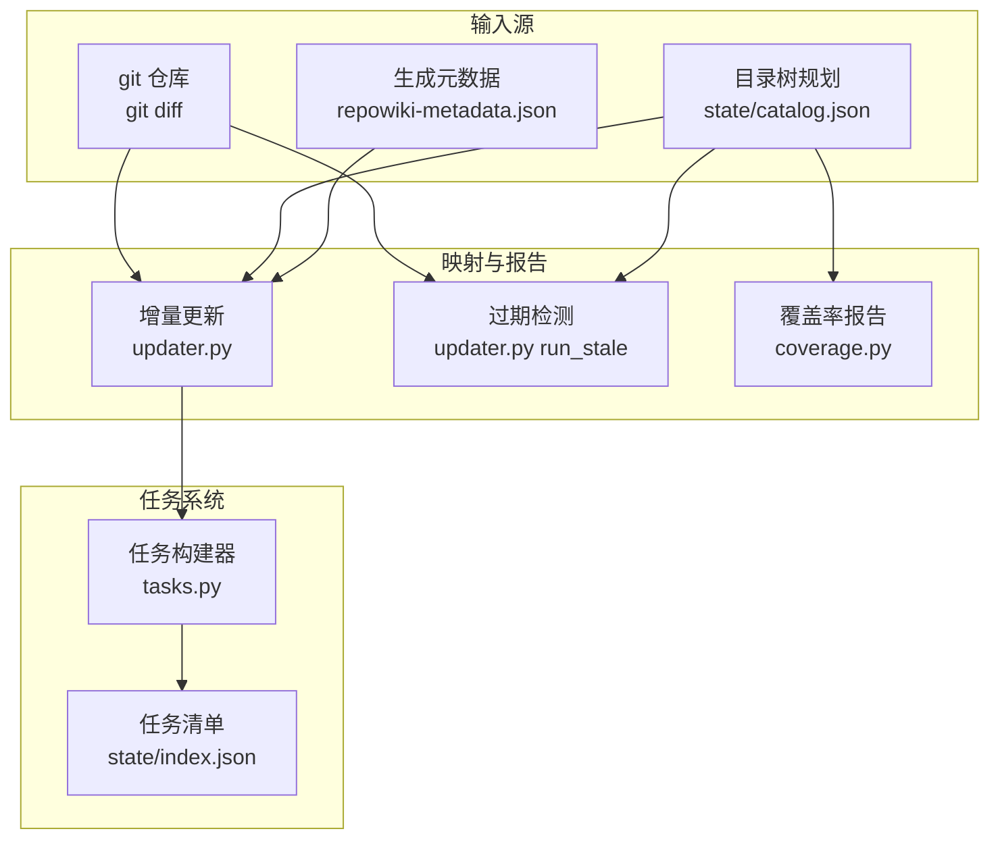
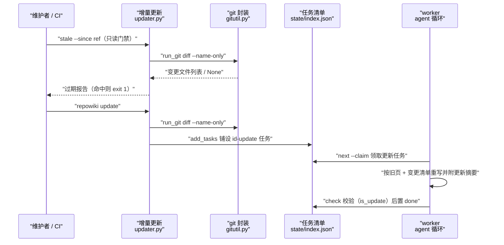
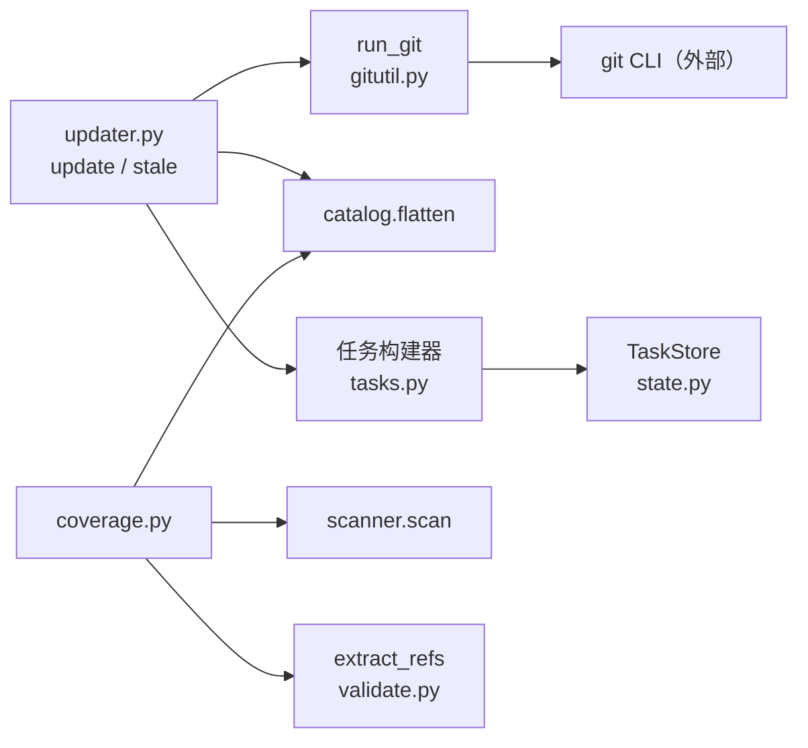

# 增量更新与覆盖率

<cite>
**本文引用的文件**
- [updater.py](file://src/repowiki/updater.py)
- [gitutil.py](file://src/repowiki/gitutil.py)
- [coverage.py](file://src/repowiki/coverage.py)
- [tasks.py](file://src/repowiki/tasks.py)
- [validate.py](file://src/repowiki/validate.py)
- [update_task.md](file://src/repowiki/templates/zh/update_task.md)
</cite>

## 更新摘要

**变更内容**
- `coverage.py` 的未引用文件对账升级：未引用文件做确定性分组（vendor / locale_mirror / other），新增 `effective_coverage` 有效覆盖率（分母剔除 vendor 目录与其他语言镜像文件），human 输出按分组展示并在两组覆盖率不同时并列给出，见 [src/repowiki/coverage.py:63-78](file://src/repowiki/coverage.py#L63-L78) 与 [src/repowiki/coverage.py:95-108](file://src/repowiki/coverage.py#L95-L108)；「run_coverage：未引用文件对账」小节已同步改写。
- 补充对 `src/repowiki/templates/zh/update_task.md`（update 任务规格模板，49 行）的引用与说明；「update 任务规格与『更新摘要』小节」的校验器引用行区间按现行 validate.py 重排。
- 本页「结论」小节按新的逐小节来源规则补齐了「章节来源」。

## 目录
1. [更新摘要](#更新摘要)
2. [简介](#简介)
3. [项目结构](#项目结构)
4. [核心组件](#核心组件)
5. [架构总览](#架构总览)
6. [详细组件分析](#详细组件分析)
7. [依赖关系分析](#依赖关系分析)
8. [性能与一致性考量](#性能与一致性考量)
9. [故障排查指南](#故障排查指南)
10. [结论](#结论)

## 简介

增量更新与覆盖率是 repowiki「wiki 保活」工作流的三个确定性机制：`update` 以 git diff 为起点把代码变更映射成 `page_update` 任务（受影响页面与总览页自动重写，页面需附「更新摘要」小节）；`stale` 是同一映射的只读版本，为 CI 提供「wiki 是否过期」的门禁信号；`coverage` 则反向对账——统计仓库中从未被任何 wiki 页面、总览或知识卡片引用过的文件，输出可复现的覆盖率指标。三者共同实现于 `src/repowiki/` 下的 `updater.py`、`coverage.py` 与共享的 `gitutil.py`，全程不调用任何 agent 或 LLM，是首次全量生成完成后维护 wiki 与代码同步的主要手段。

章节来源
- [src/repowiki/updater.py:1-16](file://src/repowiki/updater.py#L1-L16)
- [src/repowiki/coverage.py:1-21](file://src/repowiki/coverage.py#L1-L21)

## 项目结构

本主题涉及的代码与状态文件：

- `src/repowiki/updater.py`：`update` 与 `stale` 两个命令——git diff 映射、受影响节点计算、增量任务铺设与只读过期报告。
- `src/repowiki/gitutil.py`：共享 git 子进程封装 `run_git`，统一「成功返回 stdout、失败返回 None」的约定。
- `src/repowiki/coverage.py`：`coverage` 命令——仓库清单与 wiki 引用的覆盖率对账。
- `src/repowiki/tasks.py`：`build_update_task` / `build_overview_update_task` 等任务构建器，负责生成增量任务规格。
- `src/repowiki/validate.py`：`check_page` 的 `is_update` 分支把「更新摘要」加入必备小节。
- `.repowiki/state/catalog.json`（读取）：页面的 `dependent_files` 依赖清单是变更映射的依据。
- `.repowiki/zh/meta/repowiki-metadata.json`（读取）：`last_commit_id` 是默认增量起点。

图表来源
- [src/repowiki/updater.py:34-53](file://src/repowiki/updater.py#L34-L53)
- [src/repowiki/coverage.py:24-44](file://src/repowiki/coverage.py#L24-L44)
- [src/repowiki/tasks.py:163-204](file://src/repowiki/tasks.py#L163-L204)

章节来源
- [src/repowiki/updater.py:19-31](file://src/repowiki/updater.py#L19-L31)
- [src/repowiki/gitutil.py:1-5](file://src/repowiki/gitutil.py#L1-L5)
- [src/repowiki/coverage.py:24-32](file://src/repowiki/coverage.py#L24-L32)

## 核心组件

- `run_git`（gitutil.py）：唯一 git 子进程入口，`check=True` 加异常捕获，成功返回解码后的 stdout、任何失败（超时、非零退出、git 缺失）返回 None。
- `_git_diff`（updater.py）：计算变更文件集，默认 `since..HEAD` 仅提交，`--dirty` 时改为 diff 单个起点（含工作区）并叠加未跟踪文件。
- `map_affected`（updater.py）：把变更集与 catalog 节点的 `dependent_files` 求交集，并沿父链把影响传播到祖先章节。
- `run_update`（updater.py）：编排整条增量链路——前置检查、diff、映射、任务铺设（含重新武装与知识联动）、告警汇总。
- `run_stale`（updater.py）：同一映射的只读版本，`--fail-if-stale` 时命中即退出码 1，供 CI 门禁。
- `run_coverage`（coverage.py）：聚合页面、总览与知识卡片的全部引用路径，与仓库清单求差集输出覆盖率。

章节来源
- [src/repowiki/gitutil.py:13-19](file://src/repowiki/gitutil.py#L13-L19)
- [src/repowiki/updater.py:19-53](file://src/repowiki/updater.py#L19-L53)
- [src/repowiki/updater.py:251-305](file://src/repowiki/updater.py#L251-L305)
- [src/repowiki/coverage.py:24-76](file://src/repowiki/coverage.py#L24-L76)

## 架构总览

保活工作流的运行时交互为：维护者或 CI 先跑 `stale --since <ref>`（只读）判断 wiki 是否过期；过期则跑 `update`，它经 `run_git` 取变更文件、对照 catalog 的 `dependent_files` 算出受影响页面，把 `<id>-update` 任务写入任务清单；worker 像普通页面任务一样领取这些任务，按规格里的旧页面全文与变更文件清单重写页面并附「更新摘要」小节，`check` 以 `is_update` 模式校验；随后即可重新 finalize 与 site。`coverage` 与这条链路正交：它在任意时刻回答「哪些模块还没有页面引用」，为下一轮补写提供指南。

图表来源
- [src/repowiki/updater.py:99-115](file://src/repowiki/updater.py#L99-L115)
- [src/repowiki/updater.py:251-305](file://src/repowiki/updater.py#L251-L305)
- [src/repowiki/gitutil.py:13-19](file://src/repowiki/gitutil.py#L13-L19)

章节来源
- [src/repowiki/updater.py:196-225](file://src/repowiki/updater.py#L196-L225)
- [src/repowiki/validate.py:112-124](file://src/repowiki/validate.py#L112-L124)

## 详细组件分析

### run_git：git 子进程约定

- 职责：为 updater 与 metadata 提供统一的 git 调用出口。
- 关键行为：以 `check=True` 运行 `git`，成功时返回 UTF-8 解码的原始 stdout，`SubprocessError` 或 `OSError` 一律返回 None。
- 实现要点：刻意不区分「命令失败」与「空输出」以外的状态——调用方（如 `diff --name-only`）必须自己区分二者，空列表是合法结果（无变更），None 则必须报错；默认超时 30 秒，diff 调用放宽到 60 秒。

章节来源
- [src/repowiki/gitutil.py:1-19](file://src/repowiki/gitutil.py#L1-L19)
- [src/repowiki/updater.py:23](file://src/repowiki/updater.py#L23)

### run_update：变更到任务的映射

- 职责：把 `since` 以来的代码变更转成可执行的增量任务。
- 关键行为：前置检查 git 仓库、增量起点（metadata 的 `last_commit_id` 或 `--since`）与 catalog 存在性；`_git_diff` 取变更集（`--dirty` 时 diff 起点为单个 commit 即包含未提交改动，再叠加 `git ls-files --others` 的未跟踪文件）；`map_affected` 命中页面并沿父链传播；每个命中页面生成 `<id>-update` 任务，任意命中时总览生成 `overview-update`；知识卡片按 `source_files` 交集、模块按 `scope` 覆盖联动映射。
- 实现要点：`queue_or_rearm` 区分三种任务历史——在飞（pending/failed/in_progress）不动、全新 id 创建、上一轮已 done 的更新任务重置 pending 并重写规格（重新武装），确保第二轮 update 不会静默失效；输出还携带三类告警：未完成的旧增量任务、knowledge-plan 未展开项、catalog 未覆盖的新顶级目录（超过 2 个时建议全量 replan）。

章节来源
- [src/repowiki/updater.py:19-53](file://src/repowiki/updater.py#L19-L53)
- [src/repowiki/updater.py:99-147](file://src/repowiki/updater.py#L99-L147)
- [src/repowiki/updater.py:158-209](file://src/repowiki/updater.py#L158-L209)

### update 任务规格与「更新摘要」小节

- 职责：让 worker 在原页面上做受控修订而非重写。
- 关键行为：`build_update_task` 把旧页面全文、变更文件清单与 page_brief 渲染进任务规格，任务 kind 为 `page_update`、output 与原页面相同；`check_page` 在 `is_update` 时把「更新摘要」插到必备小节最前，强制页面说明本轮改了什么。
- 实现要点：旧页面文件不存在时降级为全新 page 任务（新页面不应被强制携带更新摘要小节）；`overview-update` 由 `check_overview` 校验，形状与全新总览一致、无需更新摘要小节。
- 规格模板：update 任务由 `templates/zh/update_task.md` 渲染——front matter（kind: page_update）内嵌变更文件清单、page_brief 与旧页面全文，正文给出「更新摘要」小节的插入位置（H1 之后、目录之前）与逐条更新规则、硬性检查项，见 [src/repowiki/templates/zh/update_task.md:1-16](file://src/repowiki/templates/zh/update_task.md#L1-L16) 与 [src/repowiki/templates/zh/update_task.md:27-49](file://src/repowiki/templates/zh/update_task.md#L27-L49)。

章节来源
- [src/repowiki/tasks.py:165-204](file://src/repowiki/tasks.py#L165-L204)
- [src/repowiki/tasks.py:136-160](file://src/repowiki/tasks.py#L136-L160)
- [src/repowiki/validate.py:129-139](file://src/repowiki/validate.py#L129-L139)
- [src/repowiki/templates/zh/update_task.md:1-49](file://src/repowiki/templates/zh/update_task.md#L1-L49)

### run_stale：CI 过期门禁

- 职责：只读回答「wiki 相对某个 git 参考点是否已过期」。
- 关键行为：与 update 完全相同的 diff 与映射（catalog `dependent_files` 含父链、知识计划联动），但除报告外不写任何状态；`stale` 字段为布尔值，`--fail-if-stale` 且命中时进程退出码 1。
- 实现要点：因为不创建任务、不改 index，可安全嵌入 CI 流水线的高频调用；catalog 损坏时同样以 `UsageError` 明确报错而非静默通过。

章节来源
- [src/repowiki/updater.py:251-305](file://src/repowiki/updater.py#L251-L305)

### run_coverage：未引用文件对账

- 职责：量化 wiki 对仓库的覆盖程度，找出从未被引用的文件。
- 关键行为：聚合三类引用——全部页面 `file://` 引用、总览引用、知识卡片 `source_files`，与 `scan` 盘点的仓库清单求差集；输出覆盖率小数、未引用文件全量列表（JSON）与零引用页面警告。未引用文件进一步做确定性分组：`vendor`（路径含 /vendor/ 的第三方代码）、`locale_mirror`（其他语言镜像——把路径中的 locale 段替换后已在引用集合中的文件）与 `other`（值得补引用的行动项），见 [src/repowiki/coverage.py:95-108](file://src/repowiki/coverage.py#L95-L108)。
- 实现要点：新增 `effective_coverage` 有效覆盖率——分母剔除 vendor 与其他语言镜像文件，避免「镜像页从未被引用」拉低真实覆盖口径；human 输出按分组展示（镜像与 vendor 各至多列 5 个并给总数，other 至多列 `MAX_LISTING`=50 个），两组覆盖率不同时并列给出（[src/repowiki/coverage.py:63-78](file://src/repowiki/coverage.py#L63-L78)、[src/repowiki/coverage.py:111-145](file://src/repowiki/coverage.py#L111-L145)）；无 agent、无 LLM，数字是可复现的计算事实；某页面引用数为零会被点名，作为疑似空页线索。

章节来源
- [src/repowiki/coverage.py:1-21](file://src/repowiki/coverage.py#L1-L21)
- [src/repowiki/coverage.py:24-80](file://src/repowiki/coverage.py#L24-L80)
- [src/repowiki/coverage.py:83-108](file://src/repowiki/coverage.py#L83-L108)
- [src/repowiki/coverage.py:111-145](file://src/repowiki/coverage.py#L111-L145)

## 依赖关系分析

- `updater` 上游依赖 `gitutil.run_git`（git CLI）、`gitutil` 之外还依赖 `catalog.flatten` 解析目录树、`scanner.scan` 盘点文件、`tasks` 构建器生成规格，下游写入 `TaskStore`（state/index.json）。
- `coverage` 上游依赖 `scanner.scan`（仓库清单）、`validate.extract_refs`（从页面文本抽取 `file://` 引用的正则引擎）与 `catalog.flatten`，无任何写入。
- `gitutil` 是纯工具层，被 updater 与 metadata（记录 `last_commit_id`）共用，自身只依赖标准库 subprocess。
- 三者的公共前提是首次全量生成已完成：catalog.json 与 metadata 中的 `last_commit_id` 缺一不可。

图表来源
- [src/repowiki/updater.py:8-16](file://src/repowiki/updater.py#L8-L16)
- [src/repowiki/coverage.py:14-19](file://src/repowiki/coverage.py#L14-L19)
- [src/repowiki/tasks.py:163-204](file://src/repowiki/tasks.py#L163-L204)

章节来源
- [src/repowiki/updater.py:3-16](file://src/repowiki/updater.py#L3-L16)
- [src/repowiki/coverage.py:3-19](file://src/repowiki/coverage.py#L3-L19)

## 性能与一致性考量

- 一致性以「宁可报错不可误判」为先：`run_git` 失败返回 None，`update` / `stale` 把 None 显式转成 `UsageError`，绝不把失败当成「无变更」而漏建任务。
- diff 成本受控：单次 `git diff --name-only`（60 秒超时）只取文件名不取内容；`--dirty` 额外一次 `ls-files --others`，均为毫秒级操作。
- 映射是纯内存集合运算：`map_affected` 以 ordered dict 去重并保持 catalog 顺序，复杂度与页面数和依赖文件数线性相关。
- stale 的零写入特性使 CI 可以高频并发调用而不触碰 state 目录，不存在与 worker 的锁竞争。
- coverage 每次全量重读所有页面文本，成本随页面数线性增长；对数百页规模的仓库仍在亚秒级，未做缓存是为保证结果绝对新鲜。
- 增量任务的输出路径与原页面重合，重写期间原页面可能短暂处于中间态——与首次生成一样依赖 check 通过才置 done 来保证最终一致。

章节来源
- [src/repowiki/updater.py:19-31](file://src/repowiki/updater.py#L19-L31)
- [src/repowiki/updater.py:43-53](file://src/repowiki/updater.py#L43-L53)
- [src/repowiki/updater.py:303-304](file://src/repowiki/updater.py#L303-L304)
- [src/repowiki/coverage.py:37-63](file://src/repowiki/coverage.py#L37-L63)

## 故障排查指南

- `update` 报「增量更新需要 git 仓库」→ 目标目录没有 `.git` → 在 git 仓库根运行，或先 `git init`，见 [src/repowiki/updater.py:99-101](file://src/repowiki/updater.py#L99-L101)。
- `update` / `stale` 报「无法确定增量起点」→ metadata 无 `last_commit_id` 且未给 `--since` → 用 `--since <commit|ref>` 显式指定起点，见 [src/repowiki/updater.py:102-104](file://src/repowiki/updater.py#L102-L104)。
- `update` 报「git diff 失败」→ `run_git` 返回 None（起点 commit 不存在、git 损坏或超时）→ 核对 `--since` 指向的 ref 是否存在，见 [src/repowiki/updater.py:108-110](file://src/repowiki/updater.py#L108-L110)。
- `update` 后任务没被创建 → 命中的 id 已有在飞任务（queue_or_rearm 跳过），或上一轮已 done 的任务未触发重新武装的预期场景 → `status` 查看现存 `<id>-update` 任务状态，见 [src/repowiki/updater.py:134-147](file://src/repowiki/updater.py#L134-L147)。
- 第二轮 update 「看起来什么都没做」 → 上一轮同名任务已 done 但规格是旧变更快照 → 机制上已由重新武装处理；若仍异常，确认任务 id 确实出现在 `rearmed_tasks` 输出中，见 [src/repowiki/updater.py:199-203](file://src/repowiki/updater.py#L199-L203)。
- `check` 打回更新页面 → 缺「更新摘要」必备小节或语义缺陷 → 在页面中补写该小节并按错误列表修复，见 [src/repowiki/validate.py:114-124](file://src/repowiki/validate.py#L114-L124)。
- `coverage` 报「state/catalog.json 不存在」→ 首次生成未完成或 state 已清理 → 先完成全量生成流程，见 [src/repowiki/coverage.py:24-26](file://src/repowiki/coverage.py#L24-L26)。
- coverage 显示大量未引用测试或配置文件 → 扫描器把它们计入清单但页面通常不引用 → 属正常现象，结合 `uncited_files` 列表判断是否确需补页，见 [src/repowiki/coverage.py:63-74](file://src/repowiki/coverage.py#L63-L74)。

章节来源
- [src/repowiki/updater.py:99-110](file://src/repowiki/updater.py#L99-L110)
- [src/repowiki/updater.py:134-147](file://src/repowiki/updater.py#L134-L147)
- [src/repowiki/updater.py:199-209](file://src/repowiki/updater.py#L199-L209)
- [src/repowiki/coverage.py:24-32](file://src/repowiki/coverage.py#L24-L32)

## 结论

增量更新与覆盖率把 wiki 的长期维护压缩为三条确定性命令：`stale` 在 CI 里只读地把关过期、`update` 把代码变更精确映射为带「更新摘要」要求的增量任务、`coverage` 周期性揭露未被任何页面引用的盲区。正确使用方式是：以 metadata 的 `last_commit_id` 为默认起点，先 stale 后 update，最后像首次生成一样走 worker 循环与 finalize 收尾；需要注意三者都依赖首次生成的 catalog 与 git 仓库存在，且变更映射的精度完全取决于页面 `dependent_files` 的质量——catalog 覆盖不到的新顶级目录积累过多时应果断 `plan --replan` 全量重规划。

章节来源
- [src/repowiki/updater.py:19-53](file://src/repowiki/updater.py#L19-L53)
- [src/repowiki/coverage.py:24-80](file://src/repowiki/coverage.py#L24-L80)
- [src/repowiki/templates/zh/update_task.md:1-49](file://src/repowiki/templates/zh/update_task.md#L1-L49)
