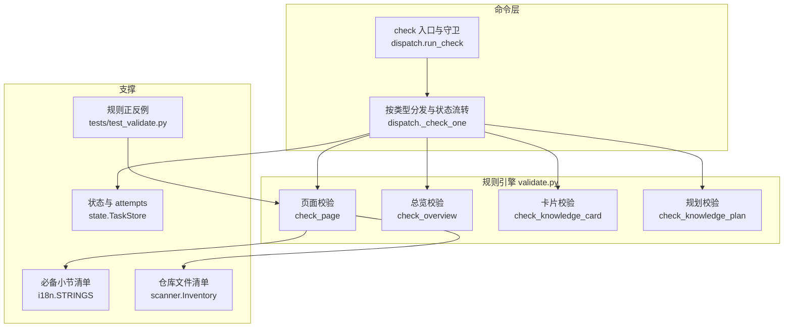
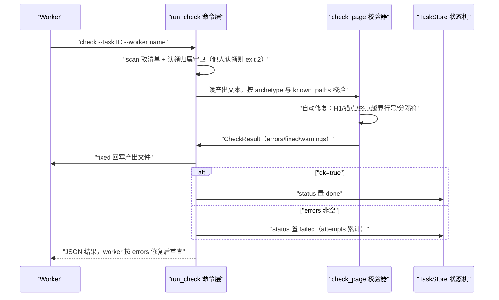
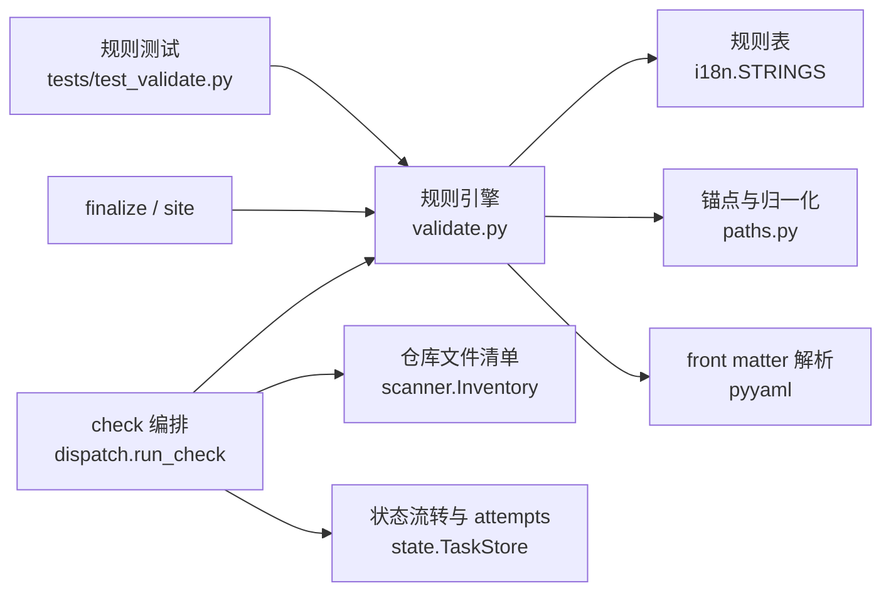

# 校验与自动修复

<cite>
**本文引用的文件**
- [src/repowiki/validate.py](file://src/repowiki/validate.py)
- [src/repowiki/dispatch.py](file://src/repowiki/dispatch.py)
- [tests/test_validate.py](file://tests/test_validate.py)
- [src/repowiki/i18n.py](file://src/repowiki/i18n.py)
- [src/repowiki/state.py](file://src/repowiki/state.py)
- [docs/zh/USAGE.md](file://docs/zh/USAGE.md)
</cite>

## 更新摘要

**变更内容**
- 行号校验策略改为分层：仅终点越界（end > 文件行数）自动钳制到文件末尾并记入 fixed；起点越界（start > 文件行数）与区间倒置（start > end）改判 error 打回重写；新增「引用区间全为空行 → error」规则，见 [src/repowiki/validate.py:176-201](file://src/repowiki/validate.py#L176-L201)。「自动修复与语义失败的分界」与「故障排查指南」小节已同步改写。
- `check_page` 新增 `known_paths` 参数：`check` 调用时传入 `inv.known_paths()` 仓库文件清单（[src/repowiki/dispatch.py:354-357](file://src/repowiki/dispatch.py#L354-L357)），对 mermaid 图节点标签中形如文件名的 token 按 basename 核对，不存在仅告警（[src/repowiki/validate.py:209-225](file://src/repowiki/validate.py#L209-L225)）。
- 新增逐小节规则：每个 `##` 小节（目录与更新摘要除外）必须非空且携带「章节来源」标记，判 error 不自动修复（[src/repowiki/validate.py:227-240](file://src/repowiki/validate.py#L227-L240)）；标记词来自 i18n.STRINGS 新增的 `section_sources` key（[src/repowiki/i18n.py:33-36](file://src/repowiki/i18n.py#L33-L36)）。
- tests/test_validate.py 扩充上述全部规则的边界用例（起点越界 / 区间倒置 / 空行区间 / mermaid 文件名警告 / 小节缺来源），全量 202 项测试通过；本页引用的 validate.py 行区间已按现行 417 行版本逐一重排。

## 目录
1. [更新摘要](#更新摘要)
2. [简介](#简介)
3. [项目结构](#项目结构)
4. [核心组件](#核心组件)
5. [架构总览](#架构总览)
6. [详细组件分析](#详细组件分析)
7. [依赖关系分析](#依赖关系分析)
8. [性能与一致性考量](#性能与一致性考量)
9. [故障排查指南](#故障排查指南)
10. [结论](#结论)

## 简介

check 是 worker 循环的心脏：它按任务类型校验 agent 产出，把可计算的缺陷（锚点、H1、路径分隔符、越界的行区间终点）静默修复并回写，只有语义缺陷（行号起点越界、区间倒置、引用区间全为空行、小节缺失/为空/缺「章节来源」、引用不存在文件、mermaid 不闭合等）才判任务失败（[src/repowiki/dispatch.py:1-6](file://src/repowiki/dispatch.py#L1-L6)、[src/repowiki/validate.py:1-9](file://src/repowiki/validate.py#L1-L9)）。这套机制解决的问题是：产出质量不能依赖 agent 自觉，必须变成程序化契约——页面模板是否齐全、源码引用是否可回溯、目录锚点是否可跳转，全部由确定性代码裁决。实现上，规则引擎位于 src/repowiki/validate.py，命令编排（`check --task` / `--all`、认领归属守卫、状态流转）位于 src/repowiki/dispatch.py，tests/test_validate.py 为每条规则提供正反例用例。

章节来源
- [src/repowiki/dispatch.py:1-6](file://src/repowiki/dispatch.py#L1-L6)
- [src/repowiki/validate.py:1-9](file://src/repowiki/validate.py#L1-L9)
- [tests/test_validate.py:1-16](file://tests/test_validate.py#L1-L16)

## 项目结构

- src/repowiki/validate.py：规则引擎本体。CheckResult 数据类承载 ok / errors / warnings / fixed / text 五类结果；check_page 是页面校验主入口，check_overview、check_knowledge_card、check_knowledge_module、check_knowledge_plan 分别覆盖总览、知识卡片、模块文档与知识规划 JSON；_fix_toc 与内联的 _fix_link 完成自动修复。
- src/repowiki/dispatch.py：命令层。run_check 处理 `--task` 单任务与 `--all` 崩溃恢复两种入口，先 `scan` 仓库取得清单并做认领归属守卫，_check_one 按任务类型调用对应校验器（页面校验附带传入 `known_paths`）、回写修复、流转状态；规划类任务（catalog / knowledge_plan）校验通过后在此展开后续任务集。
- src/repowiki/i18n.py：按 locale 定义必备小节清单与「章节来源」标记词（section_sources）等规则参数（module / flow 两套页面小节、卡片小节、总览小节与 H1 后缀），校验器据此实现与语言无关的规则（[src/repowiki/i18n.py:19-48](file://src/repowiki/i18n.py#L19-L48)）。
- src/repowiki/state.py：check 的裁决落点——状态置 done / failed，attempts 计数，exhausted 任务从就绪队列排除（[src/repowiki/state.py:219-243](file://src/repowiki/state.py#L219-L243)）。
- tests/test_validate.py：正反例测试，每条规则既有通过夹具也有失败夹具（[tests/test_validate.py:1](file://tests/test_validate.py#L1)）。

图表来源
- [src/repowiki/dispatch.py:205-262](file://src/repowiki/dispatch.py#L205-L262)
- [src/repowiki/validate.py:103-254](file://src/repowiki/validate.py#L103-L254)

章节来源
- [src/repowiki/dispatch.py:1-6](file://src/repowiki/dispatch.py#L1-L6)
- [src/repowiki/validate.py:1-9](file://src/repowiki/validate.py#L1-L9)
- [src/repowiki/i18n.py:19-48](file://src/repowiki/i18n.py#L19-L48)

## 核心组件

- CheckResult：校验结果载体，ok 为总判定，errors 判失败，warnings 只提示，fixed 记录自动修复动作，text 携带修复后的文本（[src/repowiki/validate.py:37-48](file://src/repowiki/validate.py#L37-L48)）。
- check_page：页面校验主入口，按 locale 取小节清单、按 archetype（module / flow）选规则表，覆盖占位符、H1、必备小节、cite、mermaid、file:// 引用与行号区间、mermaid 节点文件名（基于 known_paths）、逐小节「章节来源」、页间链接、目录锚点等检查（[src/repowiki/validate.py:103-254](file://src/repowiki/validate.py#L103-L254)）。
- 校验阈值常量：MIN_SECTIONS=6（小节数下限，防内容截断）、MIN_MERMAID=2（至少结构图与时序/依赖图各一）、MAX_CITED_FILES=15（单页引用文件上限，超限仅告警）（[src/repowiki/validate.py:22-24](file://src/repowiki/validate.py#L22-L24)）。
- _fix_toc：从实际 `##` 标题确定性重建数字目录与锚点，返回变更说明（[src/repowiki/validate.py:257-272](file://src/repowiki/validate.py#L257-L272)）。
- extract_refs：把页面全部 file:// 引用解析为 (path, start, end) 三元组，供 finalize 与 site 复用（[src/repowiki/validate.py:50-57](file://src/repowiki/validate.py#L50-L57)）。
- check_overview / check_knowledge_card / check_knowledge_module / check_knowledge_plan：总览、知识卡片、模块文档与知识规划 JSON 的专用校验器（[src/repowiki/validate.py:399-417](file://src/repowiki/validate.py#L399-L417)、[src/repowiki/validate.py:354-396](file://src/repowiki/validate.py#L354-L396)、[src/repowiki/validate.py:339-351](file://src/repowiki/validate.py#L339-L351)、[src/repowiki/validate.py:283-334](file://src/repowiki/validate.py#L283-L334)）。
- run_check 与 _check_one：命令入口（含认领归属守卫与 done 终态只读复查）与按类型分发、回写修复、状态流转的执行体（[src/repowiki/dispatch.py:205-262](file://src/repowiki/dispatch.py#L205-L262)、[src/repowiki/dispatch.py:318-370](file://src/repowiki/dispatch.py#L318-L370)）。

章节来源
- [src/repowiki/validate.py:22-57](file://src/repowiki/validate.py#L22-L57)
- [src/repowiki/validate.py:103-254](file://src/repowiki/validate.py#L103-L254)
- [src/repowiki/validate.py:257-272](file://src/repowiki/validate.py#L257-L272)
- [src/repowiki/dispatch.py:205-262](file://src/repowiki/dispatch.py#L205-L262)
- [src/repowiki/dispatch.py:318-370](file://src/repowiki/dispatch.py#L318-L370)

## 架构总览

worker 提交产出后运行 `repowiki check --task <id> --worker <name>`，命令层先 `scan` 仓库取得文件清单，再做认领归属守卫（他人活认领的任务拒绝翻转，退出码 2），随后按任务类型调用校验器（页面校验额外传入 `known_paths`）；校验器产出 CheckResult，确定性修复直接回写产出文件，语义缺陷进入 errors；最终状态置 done 或 failed——failed 任务若反复失败达到 attempts 上限则被排除出就绪队列，需显式 `release --force` 重置（[src/repowiki/dispatch.py:318-370](file://src/repowiki/dispatch.py#L318-L370)、[src/repowiki/state.py:24-28](file://src/repowiki/state.py#L24-L28)）。校验过程本身也顺带刷新认领心跳，避免长校验期间认领被误回收（[src/repowiki/dispatch.py:255-257](file://src/repowiki/dispatch.py#L255-L257)）。

图表来源
- [src/repowiki/dispatch.py:205-262](file://src/repowiki/dispatch.py#L205-L262)
- [src/repowiki/dispatch.py:318-370](file://src/repowiki/dispatch.py#L318-L370)

章节来源
- [src/repowiki/dispatch.py:205-262](file://src/repowiki/dispatch.py#L205-L262)
- [src/repowiki/dispatch.py:318-370](file://src/repowiki/dispatch.py#L318-L370)
- [src/repowiki/dispatch.py:354-357](file://src/repowiki/dispatch.py#L354-L357)
- [src/repowiki/state.py:24-28](file://src/repowiki/state.py#L24-L28)

## 详细组件分析

### 页面校验的检查项全景（check_page）

- 职责：对页面 markdown 做一次确定性裁决，输出修复与错误清单。
- 关键行为（按执行顺序）：占位符检查（正文残留 `{{...}}` 判失败，但代码块与行内代码豁免，靠 _strip_code 剥离后扫描）；H1 检查（缺 H1 判失败，与任务标题不符则自动改写并记入 fixed）；必备小节检查（按 module / flow 两套清单逐项匹配 exact 或前缀，update 页额外要求「更新摘要」，小节总数低于 MIN_SECTIONS 判「疑似内容截断」）；cite 块检查（缺失或无 file:// 引用判失败）；mermaid 检查（围栏不配对判失败，数量低于 2 判失败）；file:// 引用检查（文件不存在判失败；行号分层——仅终点越界自动钳制，起点越界、区间倒置、区间全空行判失败；分隔符归一；单页引用文件超 15 个告警）；mermaid 节点文件名核对（形如文件名的 token 与 known_paths 按 basename 比对，不存在仅告警）；逐小节规则（除目录与更新摘要外，每个 `##` 小节必须非空且含「章节来源」）；页间 .md 链接告警（页间零链接约定）；目录锚点从实际标题重建。
- 实现要点：行号钳制以 _file_loc 统计的真实行数为准（文件缺失或含二进制空字节返回 None，使引用判失败）；known_paths 由 dispatch 调用 check_page 时传入（[src/repowiki/dispatch.py:354-357](file://src/repowiki/dispatch.py#L354-L357)）；archetype 由 catalog 节点经 dispatch._node_archetype 解析，非法值回落 module（[src/repowiki/dispatch.py:265-279](file://src/repowiki/dispatch.py#L265-L279)）。

章节来源
- [src/repowiki/validate.py:66-93](file://src/repowiki/validate.py#L66-L93)
- [src/repowiki/validate.py:103-254](file://src/repowiki/validate.py#L103-L254)
- [src/repowiki/validate.py:209-240](file://src/repowiki/validate.py#L209-L240)
- [src/repowiki/dispatch.py:265-279](file://src/repowiki/dispatch.py#L265-L279)

### 自动修复与语义失败的分界

- 职责：把「机器能算对的」与「必须回给 agent 的」分开，最大化自动化、最小化返工。
- 关键行为：四类缺陷被静默修复——H1 与任务标题不符时改写、目录锚点与实际标题不符时按 github_anchor 重建、行区间仅终点越界时钳制到文件实际行数、反斜杠路径分隔符归一为正斜杠；其余缺陷进 errors——特别是行号起点越界（几乎必为幻觉行号）、区间倒置、引用区间全为空行（无法支撑任何论断）、小节为空或缺「章节来源」，worker 按 errors 修复同一文件后重新 check。
- 实现要点（tests/test_validate.py 的边界用例）：H1 错误修复后整页仍判通过（test_wrong_h1_autofixed）；终点越界 L9999 被钳到实际行数且不判失败（test_line_range_clamped）；起点越界、区间倒置、空行区间各自判失败（test_start_beyond_eof_fails、test_inverted_range_fails、test_blank_cited_slice_fails）；错锚点被重建（test_toc_anchor_autofixed）；反斜杠路径归一（test_backslash_path_normalized）；反例方面，引用不存在文件、围栏不配对、mermaid 不足、缺 cite、小节缺「章节来源」均判失败（test_dangling_file_ref_fails、test_unbalanced_mermaid_fails、test_too_few_mermaid_fails、test_missing_cite_fails、test_section_without_sources_fails）。

章节来源
- [src/repowiki/validate.py:162-201](file://src/repowiki/validate.py#L162-L201)
- [src/repowiki/validate.py:227-240](file://src/repowiki/validate.py#L227-L240)
- [tests/test_validate.py:29-34](file://tests/test_validate.py#L29-L34)
- [tests/test_validate.py:50-94](file://tests/test_validate.py#L50-L94)
- [tests/test_validate.py:108-147](file://tests/test_validate.py#L108-L147)

### check 在 dispatch 中的三条路径与重试上限

- 职责：把校验结果接入任务状态机，并保证并发下的认领安全。
- 关键行为：成功路径——res.ok 时状态置 done，fixed 非空且文本有变化则回写产出文件；失败路径——errors 非空时状态置 failed，任务回到就绪队列可重试，attempts 达到 `REPOWIKI_MAX_ATTEMPTS`（默认 3）后成为 exhausted 毒任务，不再发放，`release --force` 是显式人工重置；冲突路径——带 `--worker` 的 check 发现任务由他人活认领时抛 ConflictError（退出码 2），确要代为校验须加 `--force`。
- 实现要点：每次 check 先 `scan` 得到 Inventory，把 `known_paths()` 传给 check_page 用于 mermaid 文件名核对（[src/repowiki/dispatch.py:354-357](file://src/repowiki/dispatch.py#L354-L357)）；done 为终态，复查走 _check_readonly 只读报告（同样以 known_paths 复核页面）、绝不再翻转状态；`check --all` 面向崩溃恢复，检查全部 in_progress / failed 任务；catalog 与 knowledge_plan 这类规划任务的 check 通过即触发后续任务集展开（_expand_pages / _expand_knowledge）。

章节来源
- [src/repowiki/dispatch.py:229-241](file://src/repowiki/dispatch.py#L229-L241)
- [src/repowiki/dispatch.py:246-262](file://src/repowiki/dispatch.py#L246-L262)
- [src/repowiki/dispatch.py:282-301](file://src/repowiki/dispatch.py#L282-L301)
- [src/repowiki/dispatch.py:318-370](file://src/repowiki/dispatch.py#L318-L370)
- [src/repowiki/dispatch.py:384-412](file://src/repowiki/dispatch.py#L384-L412)
- [src/repowiki/state.py:24-28](file://src/repowiki/state.py#L24-L28)
- [src/repowiki/state.py:310-323](file://src/repowiki/state.py#L310-L323)

### 知识卡片、总览与模块文档校验

- 职责：覆盖页面体系之外的三类产出，规则各有侧重。
- 关键行为：知识卡片校验 YAML front matter（kind / name / category 必填、category 须取自类别清单、source_files 逐一验证存在）、四个编号小节齐全、H1 与卡片标题一致——注意卡片 H1 不符是 error 而非自动修复，与页面不同；is_update 卡片额外要求「更新摘要」小节（tests/test_update_requires_summary 覆盖正反例）。总览校验禁止 front matter、H1 须为「仓库名 Wiki 总览」（不符则自动改写，test_h1_autofixed）、必备「章节导航」与「如何使用本 Wiki」两小节。模块文档校验目录内必需文件（概述.md / 技术栈.md / 架构设计.md）存在且非空。
- 实现要点：卡片类别合法性优先用运行时生效类别（effective_categories，支持 `--categories` 整表替换），规划 JSON 校验（check_knowledge_plan）另含模块 id / title 去重、children 等引用存在性检查（tests/test_duplicate_ids、test_dangling_child_ref 覆盖）。

章节来源
- [src/repowiki/validate.py:354-396](file://src/repowiki/validate.py#L354-L396)
- [src/repowiki/validate.py:339-351](file://src/repowiki/validate.py#L339-L351)
- [src/repowiki/validate.py:399-417](file://src/repowiki/validate.py#L399-L417)
- [src/repowiki/validate.py:283-334](file://src/repowiki/validate.py#L283-L334)
- [tests/test_validate.py:242-272](file://tests/test_validate.py#L242-L272)
- [tests/test_validate.py:290-305](file://tests/test_validate.py#L290-L305)

### 双语与原型规则的参数化

- 职责：让同一套规则引擎服务 zh / en 两种产出语言与 module / flow 两种页面原型。
- 关键行为：小节清单、H1 后缀、卡片小节、逐小节来源标记词（section_sources：zh「章节来源」/ en「Section sources」）、站点文案全部收在 i18n.STRINGS 表中，校验器通过 strings(locale) 取用；flow 原型页面按 flow_sections 校验（流程总览 / 关键步骤 / 数据与状态变化等），module 页面按 required_sections 校验，选错规则表即失败。
- 实现要点：前缀匹配的小节（如「性能」「故障」）允许变体标题——「性能考量」可替代「性能与一致性考量」（test_performance_heading_variant_ok）；archetype 正反例由 TestPageArchetype 覆盖：flow 页在 module 规则下因缺「项目结构」失败，module 页在 flow 规则下因缺「流程总览」失败。

章节来源
- [src/repowiki/i18n.py:19-48](file://src/repowiki/i18n.py#L19-L48)
- [src/repowiki/i18n.py:33-36](file://src/repowiki/i18n.py#L33-L36)
- [src/repowiki/i18n.py:76-79](file://src/repowiki/i18n.py#L76-L79)
- [src/repowiki/validate.py:125-139](file://src/repowiki/validate.py#L125-L139)
- [src/repowiki/validate.py:229-240](file://src/repowiki/validate.py#L229-L240)
- [tests/test_validate.py:41-44](file://tests/test_validate.py#L41-L44)
- [tests/test_validate.py:307-336](file://tests/test_validate.py#L307-L336)

## 依赖关系分析

- validate.py 是被依赖方：dispatch.py 的五类任务校验全部经由它；metadata.py 与 site.py 复用其 extract_refs 解析页面引用。
- validate.py 的上游支撑：i18n.strings 提供 locale 化规则表；paths 提供 github_anchor（中文锚点算法）与 nfc（Unicode 归一化）；卡片 front matter 解析依赖 pyyaml；mermaid 文件名核对所需的仓库文件清单由 dispatch 每次校验前 scan 得到并经 known_paths 参数注入。
- dispatch.run_check 的下游是 state.TaskStore：状态流转、attempts 累计、exhausted 判定与心跳刷新都落在状态机；认领归属守卫读取 claims 目录内的 worker 文件。
- 测试侧：tests/test_validate.py 依赖 conftest 的 valid_page / flow_page / repo 夹具构造合法与非法产出。

图表来源
- [src/repowiki/dispatch.py:14-28](file://src/repowiki/dispatch.py#L14-L28)
- [src/repowiki/validate.py:11-20](file://src/repowiki/validate.py#L11-L20)
- [tests/test_validate.py:7-16](file://tests/test_validate.py#L7-L16)

章节来源
- [src/repowiki/dispatch.py:14-28](file://src/repowiki/dispatch.py#L14-L28)
- [src/repowiki/validate.py:11-20](file://src/repowiki/validate.py#L11-L20)
- [src/repowiki/validate.py:103-105](file://src/repowiki/validate.py#L103-L105)
- [tests/test_validate.py:1-16](file://tests/test_validate.py#L1-L16)

## 性能与一致性考量

- 确定性优先：校验与修复全部可计算、可重复，同一输入恒得同一输出；修复结果直接回写文件，worker 无需猜测哪里被改（[src/repowiki/validate.py:1-9](file://src/repowiki/validate.py#L1-L9)）。
- 行数统计的健壮性：_file_loc 直接读字节计数换行符，文件缺失或前 8 KB 含空字节（二进制）返回 None——前者让引用判失败，后者避免对二进制文件误报行数（[src/repowiki/validate.py:81-93](file://src/repowiki/validate.py#L81-L93)）。
- 误报抑制：_strip_code 在占位符扫描前剥离围栏代码块与行内代码，使「文档化占位符机制本身」的页面合法通过（test_placeholder_inside_code_passes）（[src/repowiki/validate.py:66-78](file://src/repowiki/validate.py#L66-L78)、[tests/test_validate.py:149-163](file://tests/test_validate.py#L149-L163)）。
- 轻重分级：mermaid 文件名不存在、页间链接与引用文件超上限只作 warnings 不判失败——保持约定提示，又不阻断任务流转（[src/repowiki/validate.py:206-207](file://src/repowiki/validate.py#L206-L207)、[src/repowiki/validate.py:209-225](file://src/repowiki/validate.py#L209-L225)、[src/repowiki/validate.py:242-245](file://src/repowiki/validate.py#L242-L245)）。
- 一致性守卫：认领归属检查在状态翻转前进行，防止 A worker 的 check 把 B worker 正在写的任务置 failed；校验即心跳的设计让长校验不产生过期窗口（[src/repowiki/dispatch.py:229-257](file://src/repowiki/dispatch.py#L229-L257)）。
- 失败成本的收敛：语义失败只回传 errors 列表，worker 修同一文件重查即可，无需重写整页；重试上限防止坏任务无限占用队列（[src/repowiki/state.py:219-243](file://src/repowiki/state.py#L219-L243)）。

章节来源
- [src/repowiki/validate.py:66-93](file://src/repowiki/validate.py#L66-L93)
- [src/repowiki/validate.py:206-245](file://src/repowiki/validate.py#L206-L245)
- [src/repowiki/dispatch.py:229-257](file://src/repowiki/dispatch.py#L229-L257)
- [src/repowiki/state.py:219-243](file://src/repowiki/state.py#L219-L243)
- [tests/test_validate.py:149-163](file://tests/test_validate.py#L149-L163)

## 故障排查指南

- 报「缺少必备小节」：对照 i18n 中当前 locale 的 required_sections / flow_sections 清单；先确认任务对应 catalog 节点的 archetype——flow 页用错了 module 规则表会误报缺「项目结构」（[src/repowiki/i18n.py:23-43](file://src/repowiki/i18n.py#L23-L43)、[src/repowiki/dispatch.py:265-279](file://src/repowiki/dispatch.py#L265-L279)、[tests/test_validate.py:313-318](file://tests/test_validate.py#L313-L318)）。
- 报「引用行号起点越界」/「行区间倒置」/「引用区间全为空行」：引用锚点指向了不存在或无内容的行区间——先 `wc -l` 核对文件实际行数，改用区间内有真实内容的行号；注意仅终点越界不是错误，只会被钳制并在 fixed 中说明（对照 test_line_range_clamped 与 test_start_beyond_eof_fails）（[src/repowiki/validate.py:176-201](file://src/repowiki/validate.py#L176-L201)、[tests/test_validate.py:62-94](file://tests/test_validate.py#L62-L94)）。
- 报「小节缺少『章节来源』」或「小节内容为空」：逐小节来源规则命中——为该小节补 1-2 条真实引用（可复用页面其他小节已用的引用），纯概念小节可写模板允许的占位行（[src/repowiki/validate.py:227-240](file://src/repowiki/validate.py#L227-L240)、[tests/test_validate.py:108-120](file://tests/test_validate.py#L108-L120)）。
- 警告「mermaid 图节点引用了仓库中不存在的文件名」：图中标签写了个形如文件名但仓库里没有的 token；运行时产物名（如 wiki.html）可忽略，文件名确实写错的顺手修正（[src/repowiki/validate.py:209-225](file://src/repowiki/validate.py#L209-L225)、[tests/test_validate.py:96-106](file://tests/test_validate.py#L96-L106)）。
- 报「页面仍含未替换的模板占位符」：正文残留 `{{...}}`；若占位符出现在代码块中属于合法内容，不会被误报（[src/repowiki/validate.py:110-113](file://src/repowiki/validate.py#L110-L113)、[tests/test_validate.py:149-163](file://tests/test_validate.py#L149-L163)）。
- check 退出码 2（冲突）：任务由他人活认领，不争抢、不加 `--force`，改领其他任务或等待过期回收（[src/repowiki/dispatch.py:229-241](file://src/repowiki/dispatch.py#L229-L241)、[docs/zh/USAGE.md:126-127](file://docs/zh/USAGE.md#L126-L127)）。
- 任务从就绪队列消失：attempts 达上限成为 exhausted；`repowiki status` 确认后用 `release --task <id> --force` 显式重置（[src/repowiki/state.py:310-323](file://src/repowiki/state.py#L310-L323)）。
- 发现 H1 或目录被改动：那是确定性自动修复而非数据损坏，check 输出的 fixed 列表会说明改了什么（[src/repowiki/validate.py:115-123](file://src/repowiki/validate.py#L115-L123)、[src/repowiki/validate.py:257-272](file://src/repowiki/validate.py#L257-L272)）。
- 增量更新页报缺「更新摘要」：page_update / 卡片更新任务比普通产出多一个必备小节，补写后重查（[src/repowiki/validate.py:129-130](file://src/repowiki/validate.py#L129-L130)、[tests/test_validate.py:172-175](file://tests/test_validate.py#L172-L175)）。

章节来源
- [src/repowiki/validate.py:110-113](file://src/repowiki/validate.py#L110-L113)
- [src/repowiki/validate.py:176-240](file://src/repowiki/validate.py#L176-L240)
- [src/repowiki/dispatch.py:265-279](file://src/repowiki/dispatch.py#L265-L279)
- [src/repowiki/state.py:310-323](file://src/repowiki/state.py#L310-L323)
- [tests/test_validate.py:62-175](file://tests/test_validate.py#L62-L175)

## 结论

校验与自动修复层把 repowiki 的产出质量从约定变成契约：validate.py 用占位符、H1、必备小节、cite、mermaid、行号区间、mermaid 文件名、逐小节来源、页间链接、目录锚点等检查裁决页面、总览、卡片与规划 JSON，dispatch.run_check 把裁决接入任务状态机，四类确定性缺陷（H1、锚点、越界的行区间终点、路径分隔符）静默修复，语义缺陷（含行号起点越界、区间倒置、空行引用区间、缺「章节来源」）以 errors 列表回给 worker 定点修复。正确用法是：worker 提交产出后立即 check，按 errors（而非 fixed）修复同一文件后重查；遇到 exit 2 不争抢，遇到 exhausted 用 `release --force` 显式重置。注意事项：卡片 H1 不符是失败而非自动修复，flow 原型页面必须走 flow_sections 规则，done 是终态、复查只读。一句话定位：锚点、行号、H1 交给程序，语义与内容交回 agent。

章节来源
- [src/repowiki/validate.py:1-9](file://src/repowiki/validate.py#L1-L9)
- [src/repowiki/dispatch.py:1-6](file://src/repowiki/dispatch.py#L1-L6)
- [src/repowiki/state.py:24-28](file://src/repowiki/state.py#L24-L28)
- [tests/test_validate.py:1-16](file://tests/test_validate.py#L1-L16)
