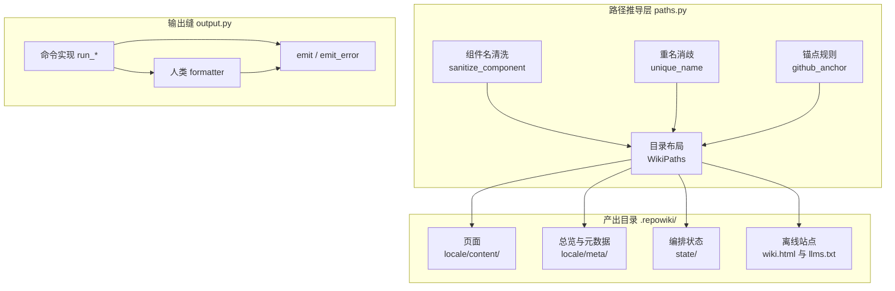
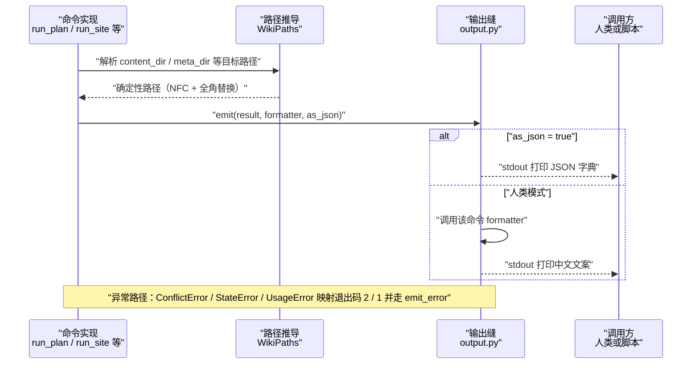
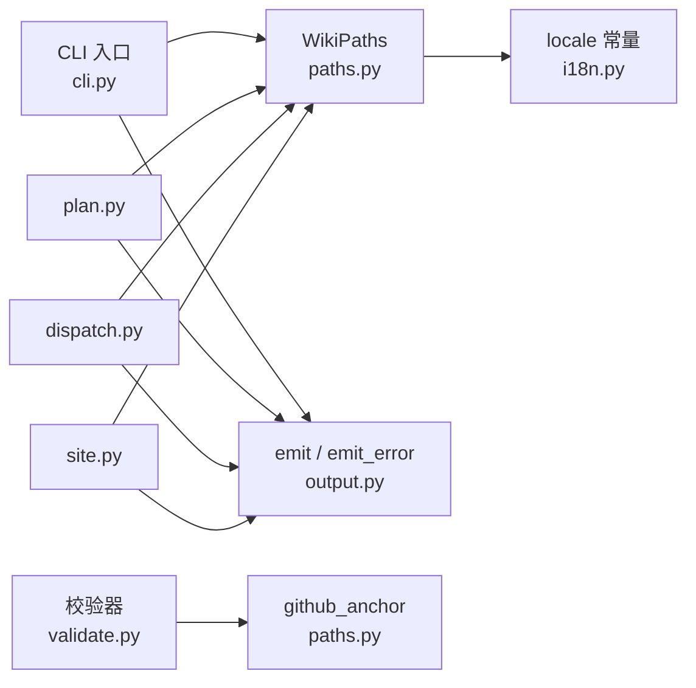

# 产出写入与路径规则

<cite>
**本文引用的文件**
- [paths.py](file://src/repowiki/paths.py)
- [output.py](file://src/repowiki/output.py)
- [plan.py](file://src/repowiki/plan.py)
- [dispatch.py](file://src/repowiki/dispatch.py)
- [site.py](file://src/repowiki/site.py)
</cite>

## 目录
1. [简介](#简介)
2. [项目结构](#项目结构)
3. [核心组件](#核心组件)
4. [架构总览](#架构总览)
5. [详细组件分析](#详细组件分析)
6. [依赖关系分析](#依赖关系分析)
7. [性能与一致性考量](#性能与一致性考量)
8. [故障排查指南](#故障排查指南)
9. [结论](#结论)

## 简介

产出写入与路径规则回答 repowiki 两个「写出去」的问题：写到哪里、以什么格式写。前者的实现是 `paths.py`——它把中文章节标题确定性地变换为目录名与文件名（NFC 归一化、文件系统非法字符全角替换、`__2` 后缀消歧），并推导 `.repowiki/` 下全部产出位置（`<locale>/content` 页面、`<locale>/meta` 总览与元数据、`knowledge/<locale>` 知识文档、`state/` 编排状态）；后者的实现是 `output.py`——所有命令的结果都经同一个 `emit` 缝隙输出，`--json` 模式原样转储结果字典、人类模式走各命令自己的 formatter，两条表示被强制保持同构。两者共同保证 macOS、Linux 与 Windows 上产出的目录树与输出契约逐字节一致。

章节来源
- [src/repowiki/paths.py:1-9](file://src/repowiki/paths.py#L1-L9)
- [src/repowiki/output.py:1-7](file://src/repowiki/output.py#L1-L7)

## 项目结构

与产出写入相关的代码与目录组织：

- `src/repowiki/paths.py`：路径推导规则（`sanitize_component`、`unique_name`、`github_anchor`）与 `WikiPaths` 布局类。
- `src/repowiki/output.py`：`emit` / `emit_error` 双格式输出缝。
- `src/repowiki/plan.py`、`dispatch.py`、`site.py` 等命令模块：各自提供人类模式 formatter（`_plan_human`、`_next_human`、`_site_human` 等），经 `emit` 打印。
- `.repowiki/<locale>/content/`：全部 wiki 页面，章节即子目录。
- `.repowiki/<locale>/meta/`：`wiki-overview.md` 总览与 `repowiki-metadata.json` 元数据。
- `.repowiki/<locale>/wiki.html`、`llms.txt`、`llms-full.txt`：site 命令的站点与 agent 索引产物。
- `.repowiki/knowledge/<locale>/`：知识模块文档与卡片。
- `.repowiki/state/`：任务编排状态（index、tasks、claims、catalog、locale）。

图表来源
- [src/repowiki/paths.py:42-74](file://src/repowiki/paths.py#L42-L74)
- [src/repowiki/paths.py:107-173](file://src/repowiki/paths.py#L107-L173)
- [src/repowiki/output.py:15-25](file://src/repowiki/output.py#L15-L25)

章节来源
- [src/repowiki/paths.py:1-9](file://src/repowiki/paths.py#L1-L9)
- [src/repowiki/output.py:1-7](file://src/repowiki/output.py#L1-L7)

## 核心组件

- `sanitize_component`（paths.py）：把章节标题变换为单个合法路径组件——NFC 归一、剔除控制字符、九个非法字符全角替换、去首尾点空格，空结果兜底 `untitled`。
- `unique_name`（paths.py）：同名冲突时追加 `__2`、`__3` 后缀，保证目录内文件名唯一。
- `github_anchor`（paths.py）：GitHub 风格锚点——小写、删除标点（含中文标点）、空格转连字符，页面目录锚点由此而来。
- `WikiPaths`（paths.py）：单一来源地推导 `.repowiki/` 下每个读取/写入位置，`locale` 属性按「显式参数 > state/locale 持久值 > 默认 zh」解析。
- `emit`（output.py）：每个命令的唯一打印出口——`as_json` 时 `json.dumps` 结果字典，否则调用人类 formatter。
- `emit_error`（output.py）：错误输出契约——JSON 模式把 `{"ok": false, "error": ...}` 打到 stdout，人类模式把带前缀的一行打到 stderr。

章节来源
- [src/repowiki/paths.py:19-74](file://src/repowiki/paths.py#L19-L74)
- [src/repowiki/paths.py:77-105](file://src/repowiki/paths.py#L77-L105)
- [src/repowiki/output.py:18-34](file://src/repowiki/output.py#L18-L34)

## 架构总览

运行时数据流为：命令实现（如 `run_plan`、`run_site`）组装一个结果字典，路径类字段全部取自 `WikiPaths` 的确定性推导；随后 `emit(result, human_formatter, as_json)` 决定呈现方式——JSON 模式把字典逐字段原样输出（脚本可稳定解析），人类模式调用该命令私有的 formatter 渲染中文文案；错误沿异常边界被 `cli.main` 捕获，按类型映射为退出码 2 / 1 并交 `emit_error` 输出。由于结果字典只有一份，JSON 与人类两种表示天然不会分叉；由于路径只有一套推导规则，任何平台、任何语言目录下产物位置都可预计算。

图表来源
- [src/repowiki/output.py:18-34](file://src/repowiki/output.py#L18-L34)
- [src/repowiki/paths.py:84-105](file://src/repowiki/paths.py#L84-L105)
- [src/repowiki/cli.py:170-183](file://src/repowiki/cli.py#L170-L183)

章节来源
- [src/repowiki/plan.py:90-113](file://src/repowiki/plan.py#L90-L113)
- [src/repowiki/site.py:77-97](file://src/repowiki/site.py#L77-L97)
- [src/repowiki/dispatch.py:303-315](file://src/repowiki/dispatch.py#L303-L315)

## 详细组件分析

### 章节标题到文件名的确定性变换

- 职责：让「任务编排与状态管理」这类中文标题成为跨平台合法且可复现的目录/文件名。
- 关键行为：`sanitize_component` 依次执行 NFC 归一、剔除控制字符、把 `/ \ : * ? " < > |` 九个字符替换为全角对应物（斜体分隔符与 Windows 保留字符一并覆盖）、剥离首尾的点和空格；替换后为空则兜底 `untitled`。
- 实现要点：全角替换而非删除——标题信息不丢失，文件名仍可读；冒号 `:` 被替换意味着「附录：一键运行清单」这类标题无需人工干预即可落盘；同名场景由 `unique_name` 以 `__2` 后缀消歧，先到先得且顺序确定。

章节来源
- [src/repowiki/paths.py:19-62](file://src/repowiki/paths.py#L19-L62)

### .repowiki 目录布局与 locale 解析

- 职责：以单一属性类固定全部产出位置，避免路径字符串散落各命令。
- 关键行为：`root` 固定为仓库下 `.repowiki/`；`content_dir`、`meta_dir`、`knowledge_dir`、`site_file`、`llms_file` 等属性都带 `<locale>` 前缀；`locale` 属性按「构造参数 > `state/locale` 文件 > 默认 zh」三级解析并惰性缓存，`persist_locale` 把显式选择钉进 state。
- 实现要点：locale 必须在目录创建前解析——它决定哪些 `<locale>/content`、`<locale>/meta` 目录被 `ensure()` 建出；`state/` 下与 locale 无关的编排文件（index、claims、catalog）则独立于语言存在，重跑 `plan` 不会因语言切换而丢任务。

章节来源
- [src/repowiki/paths.py:77-105](file://src/repowiki/paths.py#L77-L105)
- [src/repowiki/paths.py:107-173](file://src/repowiki/paths.py#L107-L173)
- [src/repowiki/plan.py:62-68](file://src/repowiki/plan.py#L62-L68)

### GitHub 中文锚点规则

- 职责：让页面「目录」小节的跳转链接与真实章节标题一一对应。
- 关键行为：`github_anchor` 把标题转小写、删除中英文标点（正则显式枚举含 `：`、`：` 类全角符号）、空白折叠为 `-`、再压缩连续连字符——「附录：一键运行清单」得到 `附录一键运行清单`，「BM25 关键词」得到 `bm25-关键词`。
- 实现要点：同一函数被校验器复用——`check` 按「实际标题 → 期望锚点」重建目录列表，人工写错的锚点会被确定性修复而非报错；规则内嵌正则与 GitHub 渲染行为对齐，CJK 字符保留不转义。

章节来源
- [src/repowiki/paths.py:32-35](file://src/repowiki/paths.py#L32-L35)
- [src/repowiki/paths.py:65-74](file://src/repowiki/paths.py#L65-L74)

### 双格式输出缝

- 职责：保证每个命令的 JSON 契约与人类可读文案同生共死。
- 关键行为：`emit` 接收一份结果字典与一个 formatter——`as_json` 直接 `json.dumps(ensure_ascii=False, indent=2)` 输出字典本身；人类模式调用 formatter，formatter 返回空串时静默不打印。`emit_error` 对错误做同样分流，并把人类文案定向到 stderr、JSON 契约留在 stdout，方便脚本按流消费。
- 实现要点：formatter 是各命令模块的私有函数（如 `_plan_human`、`_next_human`、`_check_human`、`_site_human`），历史上有测试盲区的文案由此获得可调用测试面；一份字典两条表示，新增字段会同时出现在两种输出或都不出现。

章节来源
- [src/repowiki/output.py:15-34](file://src/repowiki/output.py#L15-L34)
- [src/repowiki/plan.py:106-113](file://src/repowiki/plan.py#L106-L113)
- [src/repowiki/dispatch.py:307-315](file://src/repowiki/dispatch.py#L307-L315)

## 依赖关系分析

- `paths.WikiPaths` 是纯下游工具：被 CLI 入口（构造实例）、全部命令模块（取路径）、状态库（定位 index 与 claims）共同依赖，自身只依赖标准库与 `i18n` 的 locale 常量。
- `output.emit` 是所有 `run_*` 函数的最后一步：plan、dispatch、site、updater、coverage 的每个命令都以「结果字典 + formatter」收尾，`cli.main` 的异常分支依赖 `emit_error`。
- formatter 依赖各自命令的结果字典结构；`_update_human` 这类需要额外上下文（页面标题不在 JSON 契约里）的 formatter 以闭包带入。
- 标题清洗与锚点规则还被校验器消费，用于把标题变回锚点做目录比对，形成「规划侧生成、校验侧复核」的闭环。

图表来源
- [src/repowiki/paths.py:65-74](file://src/repowiki/paths.py#L65-L74)
- [src/repowiki/output.py:15-25](file://src/repowiki/output.py#L15-L25)

章节来源
- [src/repowiki/paths.py:77-97](file://src/repowiki/paths.py#L77-L97)
- [src/repowiki/output.py:18-34](file://src/repowiki/output.py#L18-L34)
- [src/repowiki/cli.py:170-183](file://src/repowiki/cli.py#L170-L183)

## 性能与一致性考量

- 确定性优先：标题到路径是纯函数——同输入永远同输出，无随机后缀、无时间戳，catalog 不变则磁盘布局不变，增量更新得以按路径精确命中。
- 跨平台一致：九个非法字符的全角替换同时规避了 POSIX 分隔符歧义与 Windows 保留字符；`file://` 链接统一正斜杠，校验器会把误写的反斜杠自动归一。
- locale 三级解析的取舍：持久化的 `state/locale` 优先于自动检测，保证多次命令运行产出目录稳定；代价是切换语言必须显式传 `--locale`（plan 会随即重写持久值）。
- 输出的零分叉约束：双格式共享一份结果字典，人类文案只是字典的投影；formatter 返回空则不打印，避免空行噪音。
- 性能上这些都是毫秒级纯内存操作：清洗正则小而固定，`unique_name` 对集合做 O(1) 探测，`emit` 的序列化成本与结果字典大小线性相关。

章节来源
- [src/repowiki/paths.py:19-62](file://src/repowiki/paths.py#L19-L62)
- [src/repowiki/paths.py:29-35](file://src/repowiki/paths.py#L29-L35)
- [src/repowiki/output.py:18-25](file://src/repowiki/output.py#L18-L25)

## 故障排查指南

- 页面文件名与章节标题「长得不一样」→ 冒号等字符被全角替换、首尾点空格被剥离 → 按 `sanitize_component` 规则手动推导，或直接以 catalog 里的 `output` 字段为准，见 [src/repowiki/paths.py:42-49](file://src/repowiki/paths.py#L42-L49)。
- 出现 `__2` 后缀的目录或文件 → 两个章节标题清洗后同名 → `unique_name` 的预期消歧行为，检查 catalog 是否有重复标题，见 [src/repowiki/paths.py:52-62](file://src/repowiki/paths.py#L52-L62)。
- 页面目录锚点跳转失效 → 手写锚点与 `github_anchor` 规则不符（标点未去、大小写未转）→ 无需手修，`check` 会按实际标题重建目录，见 [src/repowiki/paths.py:65-74](file://src/repowiki/paths.py#L65-L74)。
- 产物落在 `zh/` 而期望 `en/`（或相反）→ `state/locale` 持久值优先于自动检测 → 显式传 `--locale` 重跑 plan 使其重写持久值，见 [src/repowiki/paths.py:88-105](file://src/repowiki/paths.py#L88-L105)。
- 脚本解析不到错误信息 → 人类模式的错误走 stderr 而 stdout 只有空 → 加 `--json`，此时错误契约也输出到 stdout，见 [src/repowiki/output.py:28-34](file://src/repowiki/output.py#L28-L34)。
- JSON 输出与人类输出字段对不上 → 不应发生：两者同源于一份结果字典 → 若确属不一致，检查该命令是否绕过 `emit` 直接 print（当前实现没有此类路径），见 [src/repowiki/output.py:1-7](file://src/repowiki/output.py#L1-L7)。

章节来源
- [src/repowiki/paths.py:42-74](file://src/repowiki/paths.py#L42-L74)
- [src/repowiki/paths.py:88-105](file://src/repowiki/paths.py#L88-L105)
- [src/repowiki/output.py:28-34](file://src/repowiki/output.py#L28-L34)

## 结论

产出写入与路径规则用两个小模块钉住了 repowiki 产出层的确定性：`paths.py` 把「标题 → 路径 → 锚点」全部变成可复现的纯函数，`output.py` 把「结果 → JSON / 人类文案」收敛到单一缝隙。正确使用方式是：永远通过 `WikiPaths` 的属性取产出路径、通过 `emit` 输出命令结果、以 catalog 的 `output` 字段为页面落盘位置的唯一事实；注意事项是 locale 一经持久化即主导目录语言，跨平台场景下标题中的特殊字符会以全角形态出现在文件名里——这是设计行为而非缺陷。

章节来源
- [src/repowiki/output.py:15-25](file://src/repowiki/output.py#L15-L25)

