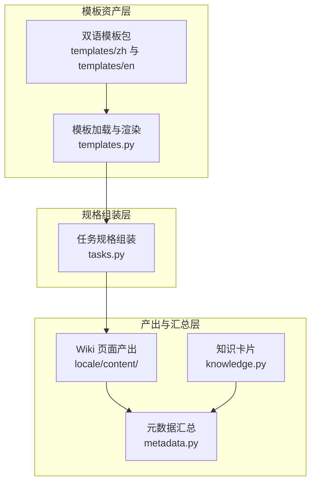
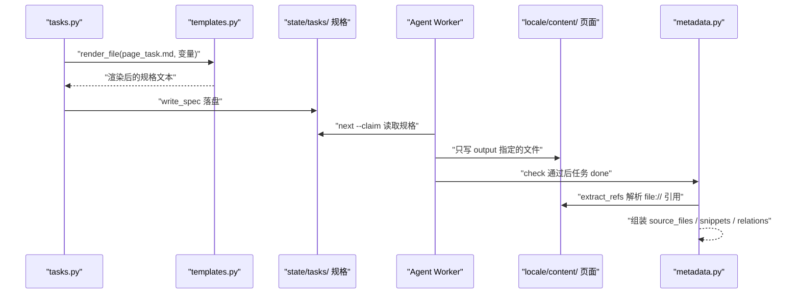
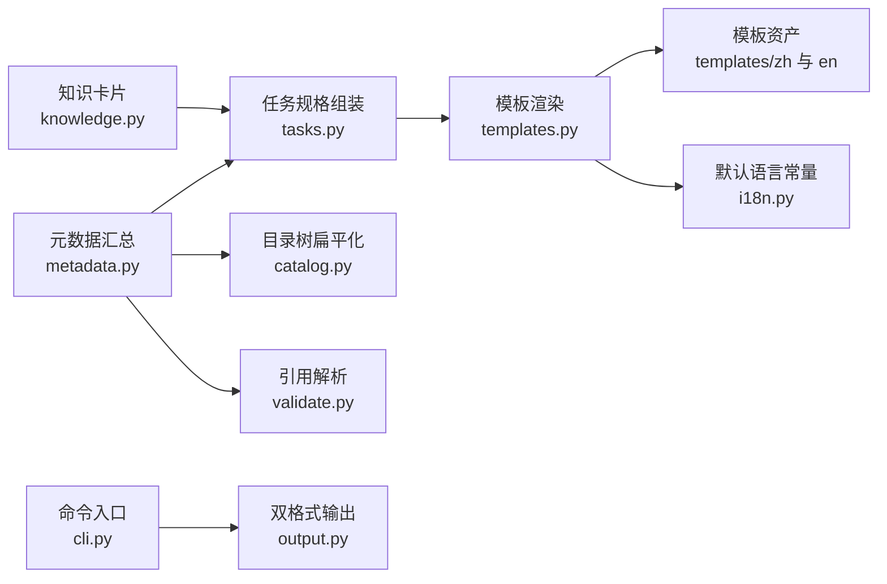

# 内容产出与模板

<cite>
**本文引用的文件**
- [templates.py](file://src/repowiki/templates.py)
- [output.py](file://src/repowiki/output.py)
- [tasks.py](file://src/repowiki/tasks.py)
- [metadata.py](file://src/repowiki/metadata.py)
- [knowledge.py](file://src/repowiki/knowledge.py)
- [page_task.md](file://src/repowiki/templates/zh/page_task.md)
- [STYLE.md](file://src/repowiki/templates/zh/STYLE.md)
- [i18n.py](file://src/repowiki/i18n.py)
</cite>

## 更新摘要

**变更内容**
- 校验器规则升级连带影响本页描述的「模板强制 + 程序化校验」闭环：行号校验分层（仅终点越界自动钳制；起点越界、区间倒置、引用区间全为空行判 error）；每个 `##` 小节（目录与更新摘要除外）必须非空且携带「章节来源」标记，标记词由 i18n.STRINGS 新增的 `section_sources` key 提供（zh「章节来源」/ en「Section sources」），见 [src/repowiki/validate.py:227-240](file://src/repowiki/validate.py#L227-L240)。
- `check_page` 新增 `known_paths` 参数（`check` 传入仓库文件清单），mermaid 图节点标签中形如文件名的 token 与真实文件核对，不存在仅告警，见 [src/repowiki/validate.py:209-225](file://src/repowiki/validate.py#L209-L225)。
- 本页「简介」小节按新规则补齐了「章节来源」。

## 目录
1. [更新摘要](#更新摘要)
2. [简介](#简介)
3. [项目结构](#项目结构)
4. [核心组件](#核心组件)
5. [架构总览](#架构总览)
6. [详细组件分析](#详细组件分析)
7. [依赖关系分析](#依赖关系分析)
8. [性能与一致性考量](#性能与一致性考量)
9. [故障排查指南](#故障排查指南)
10. [结论](#结论)

## 简介
「内容产出与模板」面向 repowiki 中「写页面」的一侧，回答三个问题：agent 拿到的任务规格从哪里来、产出写到哪里、完成后如何被汇总。任务规格由 templates.py 从 `templates/<locale>/` 加载模板、按占位符渲染后经 tasks.py 组装落盘；产出只写入任务规格 output 字段指定的那一个 markdown 文件；全部页面完成后由 finalize 解析每页的 `file://` 引用，汇总成机器可读的 `metadata.json`，知识卡片与模块文档则通过独立的 knowledge 任务集生成并聚合。本页覆盖模板资产体系、规格注入点、CLI 双格式输出与 finalize 元数据汇总。

章节来源
- [src/repowiki/templates.py:1-8](file://src/repowiki/templates.py#L1-L8)
- [src/repowiki/tasks.py:53-56](file://src/repowiki/tasks.py#L53-L56)

## 项目结构
- `src/repowiki/templates/zh/` 与 `src/repowiki/templates/en/`：双语模板包，每个语言各 13 个文件——page_task.md（页面任务规格）、page_template.md 与 flow_template.md（module / flow 两种页面骨架）、catalog_task.md（目录规划）、overview_task.md 与 overview_update_task.md（总览）、update_task.md（增量更新）、knowledge_task.md 与 knowledge_card_task.md 等（知识卡片）、STYLE.md（文风与图表规范）。
- `src/repowiki/templates.py`：模板资产加载器——按 locale 读取模板文件并做 `{{PLACEHOLDER}}` 替换，缺文件回落默认语言。
- `src/repowiki/tasks.py`：把 Inventory、catalog 节点与模板组装成任务规格（catalog / page / overview / update / knowledge），写入 `state/tasks/`。
- `src/repowiki/output.py`：CLI 双格式输出的唯一缝隙——`--json` 原样输出结果字典，人类模式走每命令格式化器。
- `src/repowiki/metadata.py`：finalize 实现——校验完成度、解析页面 `file://` 引用、组装 `metadata.json` 并瘦身运行时产物。
- `src/repowiki/knowledge.py`：知识卡片任务编排与聚合——内置类别清单、类别整表替换、完成后的知识库聚合。

图表来源
- [src/repowiki/templates.py:17-26](file://src/repowiki/templates.py#L17-L26)
- [src/repowiki/tasks.py:87-115](file://src/repowiki/tasks.py#L87-L115)

章节来源
- [src/repowiki/templates.py:1-8](file://src/repowiki/templates.py#L1-L8)
- [src/repowiki/tasks.py:53-56](file://src/repowiki/tasks.py#L53-L56)
- [src/repowiki/metadata.py:1-6](file://src/repowiki/metadata.py#L1-L6)
- [src/repowiki/knowledge.py:102-117](file://src/repowiki/knowledge.py#L102-L117)

## 核心组件
- templates.load / render / render_file：模板加载、占位符替换与整文件渲染；未知占位符刻意保留原样，让产物校验器能发现漏替换。
- page_task.md 规格模板：页面任务的完整自包含说明——YAML front matter（id / title / output / hint_files）、章节路径与 page_brief、内嵌页面骨架与文风规范、硬性检查项。
- STYLE.md：文风与图表规范——语言约定、章节来源与图表来源的引用格式、mermaid 图风格、标题层级与锚点规则，由校验器按 locale 强制。
- output.emit / emit_error：所有命令共用的输出缝隙，保证 JSON 契约与人类可读文案同步演进。
- run_finalize：finalize 命令实现——两步执行（先建 overview 任务）、完成度校验、引用解析、元数据落盘与运行时瘦身。
- knowledge 任务集：knowledge_plan（规划）→ knowledge_card / knowledge_module（撰写）→ aggregate（聚合），内置六类机制卡片类别，支持整表自定义。

章节来源
- [src/repowiki/templates.py:22-38](file://src/repowiki/templates.py#L22-L38)
- [src/repowiki/templates/zh/page_task.md:1-9](file://src/repowiki/templates/zh/page_task.md#L1-L9)
- [src/repowiki/templates/zh/STYLE.md:1-15](file://src/repowiki/templates/zh/STYLE.md#L1-L15)
- [src/repowiki/output.py:18-34](file://src/repowiki/output.py#L18-L34)
- [src/repowiki/metadata.py:28-40](file://src/repowiki/metadata.py#L28-L40)
- [src/repowiki/knowledge.py:209-226](file://src/repowiki/knowledge.py#L209-L226)

## 架构总览
内容产出的数据流是一条「模板 → 规格 → 页面 → 元数据」的链路：plan 阶段 tasks.py 用 templates.py 渲染出每个任务的规格文件；worker 领取任务后只写规格指定的 output 文件；check 校验产出（模板小节由 i18n 的 STRINGS 表按 locale 定义）；全部任务 done 后 finalize 两次运行——首次创建 overview 任务并以退出码 3 表达进展，二次运行解析每页 `file://` 引用，生成 source_files / code_snippets / knowledge_relations 三张关系表并原子写入 `metadata.json`。

图表来源
- [src/repowiki/tasks.py:97-113](file://src/repowiki/tasks.py#L97-L113)
- [src/repowiki/metadata.py:62-78](file://src/repowiki/metadata.py#L62-L78)

章节来源
- [src/repowiki/metadata.py:28-58](file://src/repowiki/metadata.py#L28-L58)
- [src/repowiki/i18n.py:19-45](file://src/repowiki/i18n.py#L19-L45)

## 详细组件分析
### 模板包与规格组装（templates.py 与 tasks.py）
- 职责：让任何 worker 在不阅读 repowiki 源码的前提下拿到写页面所需的全部信息。
- 关键行为：templates.load 按 locale 从 `templates/<locale>/` 读文件，缺失时回落默认语言；render 以正则替换 `{{PLACEHOLDER}}`，未提供值的占位符保留原样；build_page_tasks 为每个 catalog 节点渲染 page_task.md——注入任务 id、标题、输出路径、hint 文件清单、章节路径、姊妹页面、按 archetype 选择的页面骨架（module / flow）与 STYLE 规范，标题占位符先预渲染为真实标题。
- 实现要点：规格经 write_spec 落盘到 `state/tasks/<id>.md`，与任务清单解耦；页面骨架中的 `{{TITLE}}` 在任务规格里已替换为真实标题，避免 agent 忘记替换；产出语言由模板目录与规格内嵌指令共同决定，每个 locale 自带完整模板集。

章节来源
- [src/repowiki/templates.py:17-38](file://src/repowiki/templates.py#L17-L38)
- [src/repowiki/tasks.py:83-115](file://src/repowiki/tasks.py#L83-L115)
- [src/repowiki/templates/zh/page_task.md:22-32](file://src/repowiki/templates/zh/page_task.md#L22-L32)
- [src/repowiki/templates/zh/STYLE.md:47-50](file://src/repowiki/templates/zh/STYLE.md#L47-L50)

### 双格式输出缝隙（output.py）
- 职责：让每条 CLI 命令同时服务 agent（`--json` 契约）与人（可读文案），且两者不漂移。
- 关键行为：emit 是唯一打印缝隙——`--json` 模式把结果字典原样 JSON 输出（ensure_ascii=False），人类模式调用每命令注册的格式化器渲染文本；emit_error 对错误统一输出 `{"ok": false, "error": kind, "detail": ...}`，人类文案走 stderr 且带 conflict / state error 前缀。
- 实现要点：同一结果字典路由两种表示，新字段要么同时出现在两种格式中、要么都不出现（lockstep）；人类分支是可调用的纯函数，具备可测试性。

章节来源
- [src/repowiki/output.py:1-7](file://src/repowiki/output.py#L1-L7)
- [src/repowiki/output.py:18-34](file://src/repowiki/output.py#L18-L34)

### finalize 元数据汇总与知识卡片（metadata.py 与 knowledge.py）
- 职责：把分散的页面产出汇总为机器可读索引，并把可选的知识卡片聚合成知识库。
- 关键行为：finalize 首次运行若无 overview 任务则创建它并返回退出码 3（进展性等待）；二次运行校验 catalog 中每个页面都已生成、无未完成任务，然后逐页 extract_refs 解析 `file://` 引用——文件级引用进 source_files 并建 CONTAINS 关系，带行区间的引用另进 code_snippets 并建 REFERENCED_BY 关系，id 用 md5 稳定生成；元数据写入采用临时文件加 os.replace 原子替换，随后 cleanup_runtime 清理 claims / tasks 等运行时产物（保留 index / catalog / knowledge 供增量更新）。
- 实现要点：知识卡片类别默认六类（配置、日志、错误处理、构建、依赖、前端风格），`knowledge --categories <file>` 整表替换内置清单并持久化到 `state/knowledge_categories.json`，类别数上限 12；finalize 时 aggregate_knowledge 把完成的卡片聚合进知识库。

章节来源
- [src/repowiki/metadata.py:28-58](file://src/repowiki/metadata.py#L28-L58)
- [src/repowiki/metadata.py:62-78](file://src/repowiki/metadata.py#L62-L78)
- [src/repowiki/metadata.py:116-135](file://src/repowiki/metadata.py#L116-L135)
- [src/repowiki/knowledge.py:26](file://src/repowiki/knowledge.py#L26)
- [src/repowiki/knowledge.py:102-117](file://src/repowiki/knowledge.py#L102-L117)
- [src/repowiki/tasks.py:209-228](file://src/repowiki/tasks.py#L209-L228)

## 依赖关系分析
- 模板链：tasks.py 依赖 templates.py，templates.py 依赖 i18n 的默认语言常量并从包内 `templates/<locale>/` 读资产；页面骨架与文风规范作为数据随规格内嵌，运行期不再依赖模板文件。
- 汇总链：metadata.py 依赖 catalog.flatten（还原节点树）、validate.extract_refs（解析引用）、tasks.build_overview_task（两步 finalize）与 state.TaskStore（完成度校验与瘦身）；knowledge.py 聚合时读取 knowledge_plan_file 并按任务记录过滤。
- 输出链：cli.py 的所有命令经 output.emit 打印，dispatch / plan / finalize 等各自注册人类格式化器。

图表来源
- [src/repowiki/templates.py:15-26](file://src/repowiki/templates.py#L15-L26)
- [src/repowiki/metadata.py:14-21](file://src/repowiki/metadata.py#L14-L21)

章节来源
- [src/repowiki/tasks.py:61-78](file://src/repowiki/tasks.py#L61-L78)
- [src/repowiki/metadata.py:156-176](file://src/repowiki/metadata.py#L156-L176)

## 性能与一致性考量
- 规格自包含的体积取舍：每个页面任务内嵌完整骨架与文风规范（约 4-6k tokens），换取任何 worker 无需额外上下文、页面任务完全并行；小上下文 agent 可将规格中的模板段落替换为对 `templates/` 目录的引用。
- 占位符双向防线：规格渲染时未知占位符保留原样（templates.py），产物校验再扫描散文中的占位符残留（剔除代码块后），两层共同保证「模板字面量不会泄漏进最终页面」。
- 双格式一致性：JSON 与人类文案共用一个结果字典，单缝隙路由保证字段同步；错误统一走 emit_error 的固定形状，agent 可按 `ok` 字段编程判断。
- 元数据一致性：只含可读字段（wiki_catalogs / wiki_items / source_files / code_snippets / knowledge_relations），运行时状态留在 `state/`；原子写入避免半写文件；`last_commit_id` 记录生成时的 HEAD，便于增量更新定位基线。

章节来源
- [src/repowiki/templates.py:29-34](file://src/repowiki/templates.py#L29-L34)
- [src/repowiki/output.py:1-7](file://src/repowiki/output.py#L1-L7)
- [src/repowiki/metadata.py:81-121](file://src/repowiki/metadata.py#L81-L121)

## 故障排查指南
- check 报「未替换占位符」：散文里残留了 `{{...}}` 字面量；代码块与行内代码中的占位符是合法内容，只有正文残留才算缺陷；定位到对应文本替换或改写即可。
- finalize 提示「已创建阶段3 overview 任务」并返回退出码 3：正常进展而非错误；领取并完成 overview 任务、check 通过后再次运行 finalize。
- finalize 报「catalog 中有 N 个页面尚未生成」：使用过 `--max-pages` 试跑或部分任务被跳过；补齐页面或 `plan --replan` 重来。
- finalize 报「state/catalog.json 损坏」：catalog 文件无法 JSON 解析；可手工修复该文件，或 replan 重新规划。
- knowledge 报「类别过多」：自定义类别数超过 MAX_CATEGORIES（12）；机制卡片贵精不贵多，精简类别文件后重试。
- 知识库聚合提示「knowledge.json 解析失败，已跳过聚合」：knowledge_plan 文件损坏；修复该 JSON 后重新 finalize。

章节来源
- [src/repowiki/metadata.py:34-51](file://src/repowiki/metadata.py#L34-L51)
- [src/repowiki/metadata.py:156-164](file://src/repowiki/metadata.py#L156-L164)
- [src/repowiki/metadata.py:167-176](file://src/repowiki/metadata.py#L167-L176)
- [src/repowiki/knowledge.py:26](file://src/repowiki/knowledge.py#L26)
- [src/repowiki/knowledge.py:97-98](file://src/repowiki/knowledge.py#L97-L98)

## 结论
「内容产出与模板」是 repowiki 的写作侧供给线：双语模板包经 templates.py 渲染、tasks.py 组装成自包含任务规格，worker 据此产出唯一的 output 文件，finalize 再把全部页面汇总成带引用关系的 `metadata.json`。正确使用方式是信任规格——按内嵌骨架与 STYLE 规范写作、只写 output 指定文件；注意事项是不要在正文残留模板占位符、finalize 需要跑两次（overview 两步），知识卡片类别应贵精不贵多。

章节来源
- [src/repowiki/templates/zh/page_task.md:11-14](file://src/repowiki/templates/zh/page_task.md#L11-L14)
- [src/repowiki/metadata.py:28-40](file://src/repowiki/metadata.py#L28-L40)
- [src/repowiki/templates.py:29-34](file://src/repowiki/templates.py#L29-L34)
