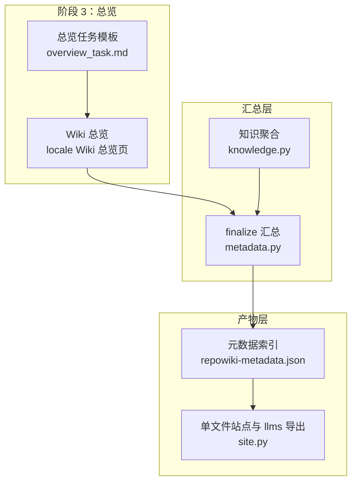
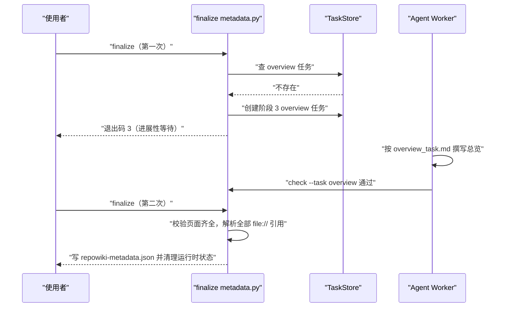
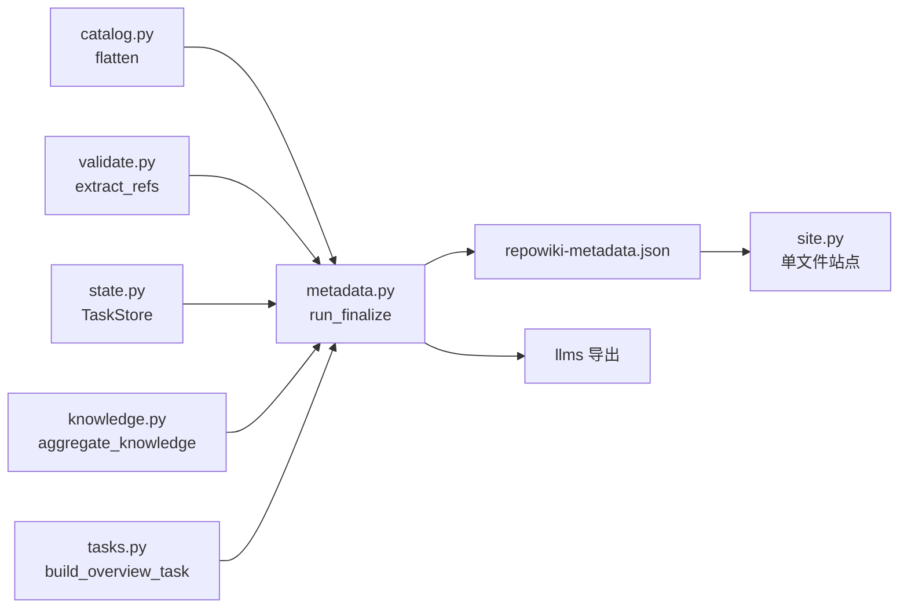

# 总览页与元数据汇总

<cite>
**本文引用的文件**
- [metadata.py](file://src/repowiki/metadata.py)
- [overview_task.md](file://src/repowiki/templates/zh/overview_task.md)
- [overview_update_task.md](file://src/repowiki/templates/zh/overview_update_task.md)
- [tasks.py](file://src/repowiki/tasks.py)
- [site.py](file://src/repowiki/site.py)
- [knowledge.py](file://src/repowiki/knowledge.py)
- [DECISIONS.md](file://docs/zh/DECISIONS.md)
</cite>

## 目录
1. [简介](#简介)
2. [项目结构](#项目结构)
3. [核心组件](#核心组件)
4. [架构总览](#架构总览)
5. [详细组件分析](#详细组件分析)
6. [依赖关系分析](#依赖关系分析)
7. [性能与一致性考量](#性能与一致性考量)
8. [故障排查指南](#故障排查指南)
9. [结论](#结论)

## 简介
「总览页与元数据汇总」覆盖 repowiki 构建流程的收官环节：finalize 两步走——第一次运行创建阶段 3 的 overview 任务（退出码 3 表达进展性等待），agent 撰写总览并 check 通过后再次运行，才真正汇总出 `<locale>/meta/repowiki-metadata.json`。metadata.py 逐页解析已完成页面中的 `file://` 引用，构建 source_files、code_snippets 与 knowledge_relations 三张索引表；成功后自动瘦身运行时产物（tasks / claims），同时保留 catalog 与 index 供增量更新。这份元数据是 `site` 单文件站点与 `llms.txt` 导出的直接输入。

章节来源
- [src/repowiki/metadata.py:1-6](file://src/repowiki/metadata.py#L1-L6)
- [src/repowiki/metadata.py:110-121](file://src/repowiki/metadata.py#L110-L121)

## 项目结构
- `src/repowiki/metadata.py`：finalize 命令实现——完成度校验、引用解析、元数据组装、原子落盘与运行时清理。
- `src/repowiki/templates/zh/overview_task.md`：overview 任务的规格模板——输入为目录树（含每章子页标题与 page_brief），产出为「Wiki 总览」纯 markdown（定位概述、章节导航、如何使用本 Wiki 三部分）。
- `src/repowiki/templates/zh/overview_update_task.md`：总览增量刷新模板——输入变更文件清单与当前总览，要求保持结构、只改受影响部分、不加「更新摘要」小节。
- `src/repowiki/tasks.py`：build_overview_task 与 build_overview_update_task 把上述模板渲染成任务规格。
- `src/repowiki/site.py`：site 命令消费元数据——要求 `repowiki-metadata.json` 存在，读取 wiki_overview 与 wiki_repo.name 组装单文件站点。
- `src/repowiki/knowledge.py`：finalize 末尾聚合知识卡片（aggregate_knowledge）。
- `.repowiki/<locale>/meta/repowiki-metadata.json`：finalize 的最终产物，机器可读的整份 Wiki 索引。

图表来源
- [src/repowiki/metadata.py:28-40](file://src/repowiki/metadata.py#L28-L40)
- [src/repowiki/templates/zh/overview_task.md:24-29](file://src/repowiki/templates/zh/overview_task.md#L24-L29)

章节来源
- [src/repowiki/metadata.py:1-6](file://src/repowiki/metadata.py#L1-L6)
- [src/repowiki/templates/zh/overview_update_task.md:32-37](file://src/repowiki/templates/zh/overview_update_task.md#L32-L37)
- [src/repowiki/tasks.py:120-163](file://src/repowiki/tasks.py#L120-L163)

## 核心组件
- overview 任务：整份 Wiki 的导读页（阶段 3），由 finalize 第一次运行创建；产出会被原样收入 `metadata.json` 的 `wiki_overview` 字段。
- run_finalize：两步执行的汇总器——先建 overview 任务再汇总；校验 catalog 页面齐全、无未完成任务后解析引用并写元数据。
- extract_refs 引用解析：从每页 markdown 提取 `file://` 引用（可带行区间），文件级进 source_files、行级进 code_snippets，均以 md5 生成稳定 id。
- knowledge_relations：页面与源文件、代码片段与页面之间的 CONTAINS / REFERENCED_BY 关系表。
- cleanup_runtime：finalize 成功后清除 `state/claims/` 与 `state/tasks/`，保留 index.json / catalog.json / knowledge.json。
- site / llms 消费端：site 强制要求元数据存在并读取其中的 wiki_overview 与仓库名；agent 索引与站点导航据此组装。

章节来源
- [src/repowiki/metadata.py:34-40](file://src/repowiki/metadata.py#L34-L40)
- [src/repowiki/metadata.py:62-78](file://src/repowiki/metadata.py#L62-L78)
- [src/repowiki/metadata.py:123-135](file://src/repowiki/metadata.py#L123-L135)
- [src/repowiki/site.py:36-47](file://src/repowiki/site.py#L36-L47)

## 架构总览
总览与汇总的时序体现了「阶段门控 + 两步 finalize」设计：页面阶段全部 done 后，使用者首次运行 finalize，它发现任务清单中没有 overview 任务，便从 catalog 展开节点、创建阶段 3 任务并以退出码 3 返回；worker 按总览模板撰写导读页并 check；第二次运行 finalize 时校验全部页面存在（含总览），逐页解析 `file://` 引用构建三张索引表，原子写入 `repowiki-metadata.json`，随后清理运行时状态——此后 `site` 与 `llms` 导出即可执行。

图表来源
- [src/repowiki/metadata.py:34-40](file://src/repowiki/metadata.py#L34-L40)
- [src/repowiki/metadata.py:62-78](file://src/repowiki/metadata.py#L62-L78)

章节来源
- [src/repowiki/metadata.py:28-58](file://src/repowiki/metadata.py#L28-L58)
- [docs/zh/DECISIONS.md:21-22](file://docs/zh/DECISIONS.md#L21-L22)

## 详细组件分析
### overview 任务的生命周期
- 职责：在全部页面完成后补上整份 Wiki 的导读，并在 finalize 前强制存在。
- 关键行为：finalize 第一次运行发现任务清单缺少 overview 时，从 catalog 展开节点树、调用 build_overview_task 渲染总览规格（输入为仓库名、带 page_brief 的目录树）并返回退出码 3；总览规格要求纯 markdown、无 YAML front matter，H1 为「仓库名 Wiki 总览」，必含「章节导航」与「如何使用本 Wiki」两个小节；增量更新场景改用 overview_update_task.md——输入变更文件与当前总览，保持三段结构只改受影响部分，明确不加「更新摘要」小节（总览不是页面）。
- 实现要点：总览产出的校验走 check_overview 的独立形状检查（H1 加两小节），不走页面模板；总览写完后会作为 metadata 的 `wiki_overview` 字段原样嵌入，站点端也优先从元数据读取它。

章节来源
- [src/repowiki/metadata.py:34-40](file://src/repowiki/metadata.py#L34-L40)
- [src/repowiki/templates/zh/overview_task.md:9-29](file://src/repowiki/templates/zh/overview_task.md#L9-L29)
- [src/repowiki/templates/zh/overview_update_task.md:9-13](file://src/repowiki/templates/zh/overview_update_task.md#L9-L13)
- [src/repowiki/templates/zh/overview_update_task.md:32-37](file://src/repowiki/templates/zh/overview_update_task.md#L32-L37)

### metadata.json 的组装与运行时瘦身
- 职责：把分散的页面与知识卡片汇总为单一机器可读索引，并收敛运行时现场。
- 关键行为：finalize 二次运行时先做两道门禁——catalog 中每个输出文件都必须存在（列出缺失页 id 与标题）、任务清单不得有非 done 任务；随后逐页 extract_refs：文件级引用以 md5(path) 为 id 归入 source_files 并追加 CONTAINS 关系，带行区间的引用以 md5(path:range) 归入 code_snippets 并追加 REFERENCED_BY 关系；元数据主体含 wiki_repo（名称、locale、last_commit_id、生成时间）、wiki_catalogs（章节树节点及 dependent_files）、wiki_items、三张索引表与 wiki_overview。
- 实现要点：写入用临时文件加 os.replace 原子替换，避免半写文件；若存在 knowledge_plan 则聚合知识库；成功后 cleanup_runtime 清除 claims 与 tasks 目录——保留 index / catalog / knowledge 是因为 update 的增量映射依赖 catalog 的 dependent_files 与树结构（DECISIONS 记录的第 10 条决策）。

章节来源
- [src/repowiki/metadata.py:42-58](file://src/repowiki/metadata.py#L42-L58)
- [src/repowiki/metadata.py:62-78](file://src/repowiki/metadata.py#L62-L78)
- [src/repowiki/metadata.py:80-121](file://src/repowiki/metadata.py#L80-L121)
- [src/repowiki/metadata.py:167-176](file://src/repowiki/metadata.py#L167-L176)
- [docs/zh/DECISIONS.md:27-30](file://docs/zh/DECISIONS.md#L27-L30)

## 依赖关系分析
- finalize 的上游：catalog.flatten 提供节点树，validate.extract_refs 提供引用解析，state.TaskStore 提供任务记录与瘦身，knowledge.aggregate_knowledge 提供知识库聚合。
- finalize 的下游：site.py 以元数据为硬前置——文件缺失或损坏都会拒绝生成站点；wiki_overview 与 wiki_repo.name 直接决定站点的总览页与标题；llms 索引与站点共享页面集合。
- 任务模板链：build_overview_task 与 build_overview_update_task 依赖 templates.py 渲染两个总览模板，规格落盘后由普通 worker 循环执行。

图表来源
- [src/repowiki/metadata.py:14-21](file://src/repowiki/metadata.py#L14-L21)
- [src/repowiki/site.py:36-47](file://src/repowiki/site.py#L36-L47)

章节来源
- [src/repowiki/metadata.py:1-21](file://src/repowiki/metadata.py#L1-L21)
- [src/repowiki/site.py:102-124](file://src/repowiki/site.py#L102-L124)

## 性能与一致性考量
- 两步 finalize 的代价与收益：多一次命令往返换来阶段门控的简单实现——总览需要读全部页面之后才能写，退出码 3 让 agent 把它当进展而非错误。
- 幂等与原子性：元数据写盘走临时文件加原子替换；finalize 可在失败后修复问题重跑，产物以最后一次成功运行为准。
- 引用 id 稳定：source_files 与 code_snippets 的 id 由路径（与行区间）的 md5 生成，同一文件的重复引用自动去重，元数据体积与页面数线性相关。
- 运行时现场收敛：成功后清理 claims / tasks，但保留 index / catalog / knowledge——增量更新（update）依赖 catalog 的 dependent_files 与树结构重建页面路径，index 支撑 plan 幂等与 status 统计。
- 站点侧防御：site 对超大行区间设 MAX_SNIPPET_LINES 上限（2 万行），过大的引用片段被跳过而非撑爆单文件站点。

章节来源
- [src/repowiki/metadata.py:110-121](file://src/repowiki/metadata.py#L110-L121)
- [src/repowiki/metadata.py:123-135](file://src/repowiki/metadata.py#L123-L135)
- [docs/zh/DECISIONS.md:27-30](file://docs/zh/DECISIONS.md#L27-L30)
- [src/repowiki/site.py:33](file://src/repowiki/site.py#L33)

## 故障排查指南
- finalize 返回退出码 3：第一次运行创建了 overview 任务，属正常进展；领取完成 overview 并 check 通过后再运行即可。
- finalize 报「catalog 中有 N 个页面尚未生成」：页面文件缺失（如 `--max-pages` 试跑或任务被跳过）；按报错列出的页面 id 补齐后重跑。
- finalize 报「仍有 N 个任务未完成」：任务清单存在非 done 状态的记录；用 status 查看具体任务，完成或释放后重试。
- finalize 报「没有任务」或「catalog 不存在 / 损坏」：先 `plan` 生成任务清单；catalog 损坏可手工修复或 `plan --replan`。
- site 报「未找到 repowiki-metadata.json」或「元数据损坏」：先成功执行 finalize；元数据 JSON 解析失败时重新 finalize 覆盖。
- 总览被 check 打回：检查 H1 是否为「仓库名 Wiki 总览」、是否缺「章节导航」或「如何使用本 Wiki」小节、是否误加了 YAML front matter 或页间链接。
- 增量更新后总览未刷新：update 命中任何页面都会排 overview-update 任务；确认该任务已完成，注意总览规格明确不写「更新摘要」小节。

章节来源
- [src/repowiki/metadata.py:28-58](file://src/repowiki/metadata.py#L28-L58)
- [src/repowiki/metadata.py:156-164](file://src/repowiki/metadata.py#L156-L164)
- [src/repowiki/site.py:36-45](file://src/repowiki/site.py#L36-L45)
- [src/repowiki/templates/zh/overview_task.md:24-29](file://src/repowiki/templates/zh/overview_task.md#L24-L29)
- [src/repowiki/templates/zh/overview_update_task.md:32-37](file://src/repowiki/templates/zh/overview_update_task.md#L32-L37)

## 结论
总览页与元数据汇总是 repowiki 的收官环节：finalize 以两步走的方式强制补上整份 Wiki 的导读页，再把全部页面的源码引用汇总为带关系表的 `repowiki-metadata.json`，随后收敛运行时现场并为 site 与 llms 导出供料。正确使用方式是页面任务全部 done 后连续执行两次 finalize（中间完成 overview 任务）；注意事项是总览有独立的形状校验（不加 front matter 与更新摘要）、元数据是 site 的硬前置，finalize 幂等可重跑。

章节来源
- [src/repowiki/metadata.py:28-40](file://src/repowiki/metadata.py#L28-L40)
- [src/repowiki/metadata.py:123-135](file://src/repowiki/metadata.py#L123-L135)
- [src/repowiki/site.py:36-47](file://src/repowiki/site.py#L36-L47)
