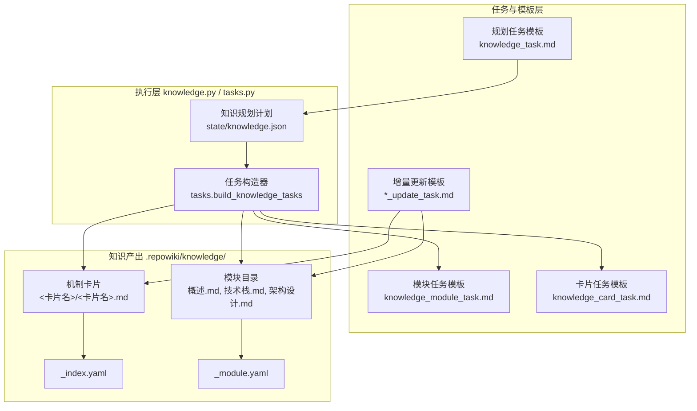
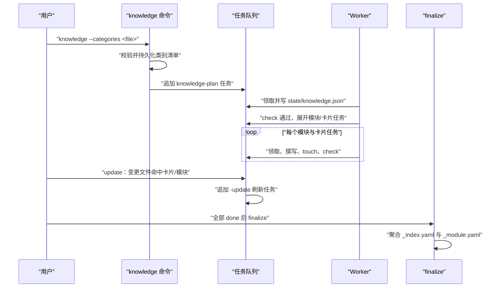
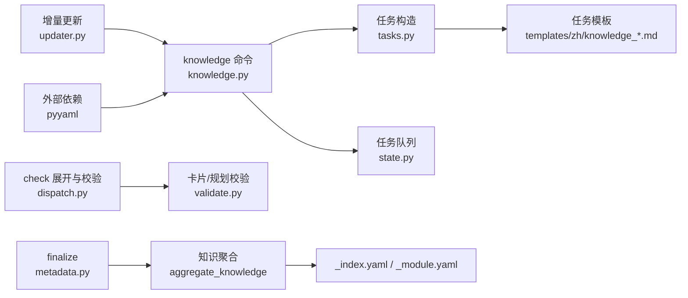

# 知识卡片系统

<cite>
**本文引用的文件**
- [src/repowiki/knowledge.py](file://src/repowiki/knowledge.py)
- [src/repowiki/tasks.py](file://src/repowiki/tasks.py)
- [src/repowiki/templates/zh/knowledge_task.md](file://src/repowiki/templates/zh/knowledge_task.md)
- [src/repowiki/templates/zh/knowledge_card_task.md](file://src/repowiki/templates/zh/knowledge_card_task.md)
- [src/repowiki/templates/zh/knowledge_module_task.md](file://src/repowiki/templates/zh/knowledge_module_task.md)
- [src/repowiki/templates/zh/knowledge_card_update_task.md](file://src/repowiki/templates/zh/knowledge_card_update_task.md)
- [src/repowiki/templates/zh/knowledge_module_update_task.md](file://src/repowiki/templates/zh/knowledge_module_update_task.md)
- [src/repowiki/updater.py](file://src/repowiki/updater.py)
- [src/repowiki/metadata.py](file://src/repowiki/metadata.py)
</cite>

## 目录
1. [简介](#简介)
2. [项目结构](#项目结构)
3. [核心组件](#核心组件)
4. [架构总览](#架构总览)
5. [详细组件分析](#详细组件分析)
6. [依赖关系分析](#依赖关系分析)
7. [性能与一致性考量](#性能与一致性考量)
8. [故障排查指南](#故障排查指南)
9. [结论](#结论)

## 简介

知识卡片系统是 repowiki 页面体系之外的可选产出层：`knowledge` 命令向任务队列追加一组知识任务，由 agent 规划并撰写「机制卡片」（横切机制，如配置加载、日志、错误处理）与「模块文档」（子系统结构），全部落在目标仓库的 `.repowiki/knowledge/<locale>/` 下；finalize 时再聚合导出机器可读的 _index.yaml 与逐模块 _module.yaml（[src/repowiki/knowledge.py:1-8](file://src/repowiki/knowledge.py#L1-L8)）。它解决的问题与页面体系互补：页面按章节组织、面向人阅读，知识卡片按机制与模块组织、面向检索与 agent 消费。整套机制的关键设计是：类别清单可整表自定义并持久化，规划、撰写、增量更新、finalize 聚合四环都基于同一份 knowledge.json 计划，卡片描述「机制」、模块描述「结构」，两者相互独立又可互相推导（[src/repowiki/templates/zh/knowledge_task.md:54](file://src/repowiki/templates/zh/knowledge_task.md#L54)）。

章节来源
- [src/repowiki/knowledge.py:1-8](file://src/repowiki/knowledge.py#L1-L8)
- [src/repowiki/knowledge.py:10-23](file://src/repowiki/knowledge.py#L10-L23)

## 项目结构

知识卡片系统的代码与模板分布如下：

- src/repowiki/knowledge.py：`knowledge` 命令入口（追加 knowledge-plan 任务、持久化自定义类别）、类别文件解析校验、finalize 时的 _index.yaml / _module.yaml 聚合；
- src/repowiki/tasks.py：知识任务构造器——knowledge-plan 规划任务、模块与卡片的展开任务、两类增量更新任务（[src/repowiki/tasks.py:207-246](file://src/repowiki/tasks.py#L207-L246)）；
- src/repowiki/templates/zh/：五份任务模板——knowledge_task.md（规划）、knowledge_module_task.md（模块文档）、knowledge_card_task.md（机制卡片）、knowledge_module_update_task.md 与 knowledge_card_update_task.md（增量更新），en/ 目录有对应英文镜像；
- src/repowiki/updater.py：`update` 的增量映射，把变更文件对照 knowledge.json 命中卡片与模块（[src/repowiki/updater.py:65-96](file://src/repowiki/updater.py#L65-L96)）；
- src/repowiki/metadata.py：finalize 时调用知识聚合（[src/repowiki/metadata.py:167-176](file://src/repowiki/metadata.py#L167-L176)）。

产出的目录形态（`<locale>` 为 zh 或 en）：

- .repowiki/knowledge/\<locale\>/\<模块目录名\>/：每个模块一个目录，含概述.md、技术栈.md、架构设计.md 等片段文档，`_module.yaml` 由工具在 finalize 时自动生成；
- .repowiki/knowledge/\<locale\>/\<卡片目录名\>/\<卡片目录名\>.md：每张机制卡片一个目录一个文件；
- .repowiki/knowledge/_index.yaml：finalize 产出的知识库总索引；
- .repowiki/state/knowledge.json：知识规划计划（模块树 + 卡片清单），是展开与聚合的依据。

图表来源
- [src/repowiki/tasks.py:249-291](file://src/repowiki/tasks.py#L249-L291)
- [src/repowiki/knowledge.py:147-159](file://src/repowiki/knowledge.py#L147-L159)

章节来源
- [src/repowiki/knowledge.py:1-8](file://src/repowiki/knowledge.py#L1-L8)
- [src/repowiki/tasks.py:207-246](file://src/repowiki/tasks.py#L207-L246)
- [src/repowiki/updater.py:65-96](file://src/repowiki/updater.py#L65-L96)

## 核心组件

- run_knowledge：`repowiki knowledge` 命令入口——可选写入自定义类别文件，然后向队列追加一个 knowledge-plan 规划任务（[src/repowiki/knowledge.py:29-51](file://src/repowiki/knowledge.py#L29-L51)）。
- knowledge-plan 任务：agent 的唯一产出是 state/knowledge.json（模块树 + 卡片清单），check 通过后自动展开为模块与卡片任务集（[src/repowiki/templates/zh/knowledge_task.md:9-12](file://src/repowiki/templates/zh/knowledge_task.md#L9-L12)、[src/repowiki/dispatch.py:394-408](file://src/repowiki/dispatch.py#L394-L408)）。
- 类别清单：默认六类（configuration_system / logging_system / error_handling / build_system / dependency_management / frontend_style），`--categories <file>` 用 YAML/JSON 文件整表替换并持久化到 state/knowledge_categories.json（[src/repowiki/tasks.py:212-219](file://src/repowiki/tasks.py#L212-L219)、[src/repowiki/knowledge.py:102-115](file://src/repowiki/knowledge.py#L102-L115)）。
- build_knowledge_tasks：把校验过的计划展开为任务——每模块一个 knowledge_module 任务（产出目录 knowledge/\<locale\>/\<目录名\>），每卡片一个 knowledge_card 任务（产出文件 knowledge/\<locale\>/\<目录名\>/\<目录名\>.md）（[src/repowiki/tasks.py:249-291](file://src/repowiki/tasks.py#L249-L291)）。
- 卡片任务模板：强制 YAML front matter（kind / name / category / scope / source_files）与固定四个编号小节（体系概览 / 关键文件与包 / 架构与设计约定 / 开发者应遵循的规则）（[src/repowiki/templates/zh/knowledge_card_task.md:14-53](file://src/repowiki/templates/zh/knowledge_card_task.md#L14-L53)）。
- 模块任务模板：撰写概述 / 技术栈 / 架构设计等片段文档，明确 `_module.yaml` 由工具自动生成、不要手写（[src/repowiki/templates/zh/knowledge_module_task.md:11-24](file://src/repowiki/templates/zh/knowledge_module_task.md#L11-L24)）。
- 增量更新任务构造器：源文件命中变更的卡片与 scope 被触及的模块各建一个 -update 任务，旧卡片全文内嵌进规格供对照修订（[src/repowiki/tasks.py:296-354](file://src/repowiki/tasks.py#L296-L354)）。
- aggregate_knowledge：finalize 时写 _index.yaml 与逐模块 _module.yaml，模块到目录的映射来自任务记录的 output 字段（[src/repowiki/knowledge.py:147-159](file://src/repowiki/knowledge.py#L147-L159)）。

章节来源
- [src/repowiki/knowledge.py:29-51](file://src/repowiki/knowledge.py#L29-L51)
- [src/repowiki/knowledge.py:102-159](file://src/repowiki/knowledge.py#L102-L159)
- [src/repowiki/tasks.py:212-291](file://src/repowiki/tasks.py#L212-L291)
- [src/repowiki/tasks.py:296-354](file://src/repowiki/tasks.py#L296-L354)

## 架构总览

知识卡片系统的完整数据流是一条「规划 → 展开 → 撰写 → 聚合」的流水线：用户运行 `repowiki knowledge`（可附带 `--categories`）后，类别清单被持久化，knowledge-plan 任务入队；agent 领取后阅读仓库文件树，产出 state/knowledge.json；check 校验该 JSON（id 唯一、引用存在、类别合法）通过后，自动展开出全部模块与卡片任务；各 worker 并行撰写；`update` 依据 git diff 为受影响的卡片与模块追加 -update 任务；finalize 最后把计划与任务记录聚合为 _index.yaml 与 _module.yaml（[src/repowiki/knowledge.py:29-51](file://src/repowiki/knowledge.py#L29-L51)、[src/repowiki/dispatch.py:394-410](file://src/repowiki/dispatch.py#L394-L410)、[src/repowiki/updater.py:167-173](file://src/repowiki/updater.py#L167-L173)、[src/repowiki/metadata.py:167-176](file://src/repowiki/metadata.py#L167-L176)）。

图表来源
- [src/repowiki/knowledge.py:29-51](file://src/repowiki/knowledge.py#L29-L51)
- [src/repowiki/dispatch.py:394-410](file://src/repowiki/dispatch.py#L394-L410)
- [src/repowiki/updater.py:167-173](file://src/repowiki/updater.py#L167-L173)

章节来源
- [src/repowiki/knowledge.py:29-51](file://src/repowiki/knowledge.py#L29-L51)
- [src/repowiki/dispatch.py:394-410](file://src/repowiki/dispatch.py#L394-L410)
- [src/repowiki/updater.py:65-96](file://src/repowiki/updater.py#L65-L96)
- [src/repowiki/metadata.py:167-176](file://src/repowiki/metadata.py#L167-L176)

## 详细组件分析

### knowledge-plan：规划任务与类别定制

- 职责：产出整份知识库的蓝图 state/knowledge.json——模块树（2~8 个、可 1~2 层，id 顶层 m01、子模块 m0101）与机制卡片清单（每类 0~2 张，宁缺毋滥）（[src/repowiki/templates/zh/knowledge_task.md:48-54](file://src/repowiki/templates/zh/knowledge_task.md#L48-L54)）。
- 关键行为：`--categories <file>` 提供的清单会被解析校验后整体替换内置六类，并持久化到 state/knowledge_categories.json，使后续 check 与 update 轮次用同一份清单裁决（[src/repowiki/knowledge.py:29-35](file://src/repowiki/knowledge.py#L29-L35)、[src/repowiki/knowledge.py:102-115](file://src/repowiki/knowledge.py#L102-L115)）。
- 实现要点：类别文件校验相当严格——必须是非空数组，项为字符串 id 或含 id / name / guidance 的对象；id 须匹配正则（小写字母开头，仅小写字母、数字、下划线），不允许重复，总数上限 12（「机制卡片贵精不贵多」）（[src/repowiki/knowledge.py:25-26](file://src/repowiki/knowledge.py#L25-L26)、[src/repowiki/knowledge.py:60-99](file://src/repowiki/knowledge.py#L60-L99)）。

章节来源
- [src/repowiki/knowledge.py:25-26](file://src/repowiki/knowledge.py#L25-L26)
- [src/repowiki/knowledge.py:29-35](file://src/repowiki/knowledge.py#L29-L35)
- [src/repowiki/knowledge.py:60-115](file://src/repowiki/knowledge.py#L60-L115)
- [src/repowiki/templates/zh/knowledge_task.md:48-60](file://src/repowiki/templates/zh/knowledge_task.md#L48-L60)

### 卡片与模块两级任务模板

- 职责：把 plan 中的每个条目变成自包含的写作任务，两类模板分工明确——卡片描述横切「机制」，模块描述「结构」。
- 关键行为：卡片模板要求 YAML front matter 逐字段填写（kind 与 category 同值、scope 与 source_files 以 YAML 列表内嵌），正文固定四个编号小节，标题不可改；「开发者应遵循的规则」必须是可执行约定（何时 / 何地 / 做什么 / 禁止什么），篇幅 30~80 行（[src/repowiki/templates/zh/knowledge_card_task.md:14-61](file://src/repowiki/templates/zh/knowledge_card_task.md#L14-L61)）。模块模板要求写概述（1~2 句）、技术栈（1~3 句）、架构设计（3~6 条 bullet），另有特殊配置与命令和可选的编码规范，且不使用标题层级（片段文档直接正文）（[src/repowiki/templates/zh/knowledge_module_task.md:19-29](file://src/repowiki/templates/zh/knowledge_module_task.md#L19-L29)）。
- 实现要点：目录名由标题经 sanitize_component 与 unique_name 处理生成，保证唯一与文件系统安全；展开时即创建产出目录；模块的 `_module.yaml` 不由 agent 撰写，finalize 时由工具生成（[src/repowiki/tasks.py:249-291](file://src/repowiki/tasks.py#L249-L291)、[src/repowiki/templates/zh/knowledge_module_task.md:12](file://src/repowiki/templates/zh/knowledge_module_task.md#L12)）。

章节来源
- [src/repowiki/templates/zh/knowledge_card_task.md:14-61](file://src/repowiki/templates/zh/knowledge_card_task.md#L14-L61)
- [src/repowiki/templates/zh/knowledge_module_task.md:11-29](file://src/repowiki/templates/zh/knowledge_module_task.md#L11-L29)
- [src/repowiki/tasks.py:249-291](file://src/repowiki/tasks.py#L249-L291)

### 增量更新任务联动（*_update_task）

- 职责：代码变更后让知识库跟随，避免「代码改了、卡片还是旧的」。
- 关键行为：`update` 把变更文件集对照 knowledge.json——卡片按 source_files 与变更集的交集命中，模块按 scope 前缀覆盖命中；命中的条目各生成一个 id 带 -update 后缀的刷新任务（[src/repowiki/updater.py:65-96](file://src/repowiki/updater.py#L65-L96)、[docs/zh/USAGE.md:117](file://docs/zh/USAGE.md#L117)）。
- 卡片更新模板：内嵌变更文件清单、核心依据文件与当前卡片全文，要求整体重写——未受影响小节保持原样，front matter 逐字段保留，并在末尾追加固定的小节「## 5. 更新摘要」说明哪部分内容因哪个文件变更而更新；若旧卡片文件已不存在，则退化为按首次生成模板重写（[src/repowiki/templates/zh/knowledge_card_update_task.md:14-42](file://src/repowiki/templates/zh/knowledge_card_update_task.md#L14-L42)、[src/repowiki/tasks.py:320-333](file://src/repowiki/tasks.py#L320-L333)）。
- 模块更新模板：只列落在模块 scope 内的变更文件，要求重写三个核心文档（概述 / 技术栈 / 架构设计），未受影响的文档保持原样但仍须存在且非空，硬性检查项即三个文件存在且非空（[src/repowiki/templates/zh/knowledge_module_update_task.md:17-31](file://src/repowiki/templates/zh/knowledge_module_update_task.md#L17-L31)）。

**章节来源**
- [src/repowiki/updater.py:65-96](file://src/repowiki/updater.py#L65-L96)
- [src/repowiki/tasks.py:296-354](file://src/repowiki/tasks.py#L296-L354)
- [src/repowiki/templates/zh/knowledge_card_update_task.md:25-42](file://src/repowiki/templates/zh/knowledge_card_update_task.md#L25-L42)
- [src/repowiki/templates/zh/knowledge_module_update_task.md:25-31](file://src/repowiki/templates/zh/knowledge_module_update_task.md#L25-L31)

### finalize 聚合：_index.yaml 与 _module.yaml

- 职责：把分散的知识产出聚合成机器可读索引，供 agent 与工具按结构消费。
- 关键行为：aggregate_knowledge 先从任务记录收集 knowledge_module 任务的产出目录名（模块 id 到目录的映射以此为准）；随后逐模块写 _module.yaml（schema_version、module_path、title、scope、source_files、depends_on / related_to 映射为目录名）；最后写 _index.yaml，以 module_path 为键组织模块树，附 locale、分支名与导出时间（[src/repowiki/knowledge.py:147-226](file://src/repowiki/knowledge.py#L147-L226)）。
- 实现要点：模块的 source_files 不是自行声明，而是「卡片声明的 source_files 中落在该模块 scope 内」的集合——结构文档的关键文件由机制卡片推导（_module_source_files）；scope 覆盖判断由 scope_covers 完成，支持 `**`、`src/core/`、`src/core/**` 等写法；若仓库没有知识计划，finalize 跳过聚合、不影响主流程（[src/repowiki/knowledge.py:118-144](file://src/repowiki/knowledge.py#L118-L144)、[src/repowiki/metadata.py:167-176](file://src/repowiki/metadata.py#L167-L176)）。

章节来源
- [src/repowiki/knowledge.py:118-144](file://src/repowiki/knowledge.py#L118-L144)
- [src/repowiki/knowledge.py:147-226](file://src/repowiki/knowledge.py#L147-L226)
- [src/repowiki/metadata.py:167-176](file://src/repowiki/metadata.py#L167-L176)

## 依赖关系分析

- knowledge.py 上游依赖 tasks.py（DEFAULT_KNOWLEDGE_CATEGORIES 与任务构造）、scanner.py（仓库清单）、state.py（任务队列）；自身被 metadata.py（finalize 聚合）与 updater.py（scope_covers）依赖。
- 知识任务校验复用 validate.py 的 check_knowledge_plan 与 check_knowledge_card，类别合法性以 effective_categories 的运行时清单为准（[src/repowiki/dispatch.py:394-398](file://src/repowiki/dispatch.py#L394-L398)）。
- 产出路径统一挂在 WikiPaths.knowledge_dir（.repowiki/knowledge/）下，与页面体系（content/）互不干扰，但 finalize 会把两者合并进同一份 metadata.json。
- 外部依赖：pyyaml（类别文件与 YAML 导出）、git CLI（_index.yaml 记录分支名）（[src/repowiki/knowledge.py:168](file://src/repowiki/knowledge.py#L168)）。

图表来源
- [src/repowiki/knowledge.py:10-23](file://src/repowiki/knowledge.py#L10-L23)
- [src/repowiki/metadata.py:167-176](file://src/repowiki/metadata.py#L167-L176)

章节来源
- [src/repowiki/knowledge.py:10-23](file://src/repowiki/knowledge.py#L10-L23)
- [src/repowiki/dispatch.py:394-398](file://src/repowiki/dispatch.py#L394-L398)
- [src/repowiki/updater.py:11](file://src/repowiki/updater.py#L11)
- [src/repowiki/metadata.py:167-176](file://src/repowiki/metadata.py#L167-L176)

## 性能与一致性考量

- 一致性锚点：类别清单只持久化一份（state/knowledge_categories.json），规划、校验、更新各环节都用 effective_categories 解析，避免「规划用自定义清单、校验用内置清单」的漂移（[src/repowiki/knowledge.py:102-115](file://src/repowiki/knowledge.py#L102-L115)）。
- 目录名唯一性：展开时用 unique_name 对目录名去重，卡片与模块共用一个已用名集合，产出自带唯一目录；卡片更新任务的产出路径直接取自原任务记录的 output，而非重新推导——目录名在展开时一次性确定，任务记录是唯一可信来源（[src/repowiki/tasks.py:296-307](file://src/repowiki/tasks.py#L296-L307)）。
- 并行安全：模块与卡片任务相互独立、页间零链接的约定同样适用于知识产出，全部任务可并行撰写（[docs/zh/USAGE.md:149-151](file://docs/zh/USAGE.md#L149-L151)）。
- 聚合的幂等与容错：_index.yaml / _module.yaml 由 finalize 每次全量重写，可重复执行；knowledge.json 解析失败时聚合跳过并明确提示，不阻断 finalize 主流程（[src/repowiki/metadata.py:167-176](file://src/repowiki/metadata.py#L167-L176)）。
- 规模约束：类别数上限 12、卡片每类 0~2 张、卡片篇幅 30~80 行，从源头约束知识库规模，防任务集膨胀（[src/repowiki/knowledge.py:97-99](file://src/repowiki/knowledge.py#L97-L99)、[src/repowiki/templates/zh/knowledge_card_task.md:61](file://src/repowiki/templates/zh/knowledge_card_task.md#L61)）。

章节来源
- [src/repowiki/knowledge.py:97-115](file://src/repowiki/knowledge.py#L97-L115)
- [src/repowiki/tasks.py:296-307](file://src/repowiki/tasks.py#L296-L307)
- [src/repowiki/metadata.py:167-176](file://src/repowiki/metadata.py#L167-L176)
- [docs/zh/USAGE.md:143-151](file://docs/zh/USAGE.md#L143-L151)

## 故障排查指南

- 报「请先运行 `repowiki plan <repo>`」：知识任务依赖已有任务清单，先 plan 再 knowledge（[src/repowiki/knowledge.py:36-39](file://src/repowiki/knowledge.py#L36-L39)）。
- 报「类别文件解析失败」或「id 非法」：--categories 文件须为非空 YAML/JSON 数组，id 小写字母开头且仅含小写字母、数字、下划线，不得重复，总数不超过 12（[src/repowiki/knowledge.py:60-99](file://src/repowiki/knowledge.py#L60-L99)）。
- check 报「category 非法」：knowledge.json 中的 category 不在生效清单内；若用过 --categories，检查是否与持久化清单一致（[src/repowiki/knowledge.py:40-43](file://src/repowiki/knowledge.py#L40-L43)）。
- check 报「source_files 引用不存在的文件」或「children 引用了不存在的 id」：knowledge.json 中的路径或 id 写错，对照仓库文件树与模块 id 修正后重查（[src/repowiki/dispatch.py:394-398](file://src/repowiki/dispatch.py#L394-L398)、[src/repowiki/templates/zh/knowledge_task.md:56-60](file://src/repowiki/templates/zh/knowledge_task.md#L56-L60)）。
- update 后没有卡片刷新任务：命中条件是卡片 source_files 与变更集有交集、或模块 scope 覆盖变更路径；变更文件不在任何 source_files / scope 内则不会建任务，属预期行为（[src/repowiki/updater.py:65-96](file://src/repowiki/updater.py#L65-L96)）。
- _module.yaml 缺失或与手写内容冲突：该文件只能由 finalize 生成，手写无效且会被覆盖；确认 finalize 已运行（[src/repowiki/templates/zh/knowledge_module_task.md:12](file://src/repowiki/templates/zh/knowledge_module_task.md#L12)、[src/repowiki/knowledge.py:170-190](file://src/repowiki/knowledge.py#L170-L190)）。
- 卡片更新 check 报缺「## 5. 更新摘要」：增量卡片比首刷多一个固定编号小节，按模板在正文末尾补齐（[src/repowiki/templates/zh/knowledge_card_update_task.md:27-34](file://src/repowiki/templates/zh/knowledge_card_update_task.md#L27-L34)）。

章节来源
- [src/repowiki/knowledge.py:36-99](file://src/repowiki/knowledge.py#L36-L99)
- [src/repowiki/knowledge.py:170-190](file://src/repowiki/knowledge.py#L170-L190)
- [src/repowiki/updater.py:65-96](file://src/repowiki/updater.py#L65-L96)
- [src/repowiki/templates/zh/knowledge_card_update_task.md:27-42](file://src/repowiki/templates/zh/knowledge_card_update_task.md#L27-L42)

## 结论

知识卡片系统以「一份计划、两级任务、一次聚合」组织仓库的机制知识：knowledge-plan 产出 state/knowledge.json 蓝图，check 通过后展开为模块文档与机制卡片两类并行任务，类别清单可整表自定义并全程一致；update 通过 -update 任务让知识库跟随代码演进；finalize 把产出聚合为 _index.yaml 与 _module.yaml 供机器消费。正确用法是：先 plan 后 knowledge，类别贵精不贵多，卡片聚焦真实存在且值得记录的机制，模块文档保持片段化与克制篇幅；注意 `_module.yaml` 由工具生成不可手写，增量卡片必须携带「更新摘要」小节。一句话定位：页面体系回答「这个仓库如何被理解」，知识卡片回答「这些机制与模块的实况是什么」。

章节来源
- [src/repowiki/knowledge.py:1-8](file://src/repowiki/knowledge.py#L1-L8)
- [src/repowiki/knowledge.py:147-226](file://src/repowiki/knowledge.py#L147-L226)
- [src/repowiki/tasks.py:207-291](file://src/repowiki/tasks.py#L207-L291)
- [src/repowiki/updater.py:65-96](file://src/repowiki/updater.py#L65-L96)
