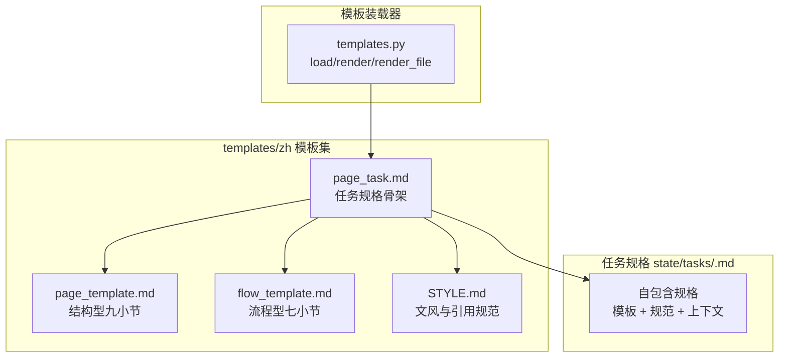
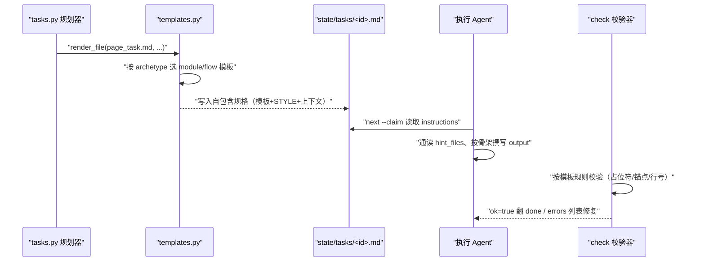
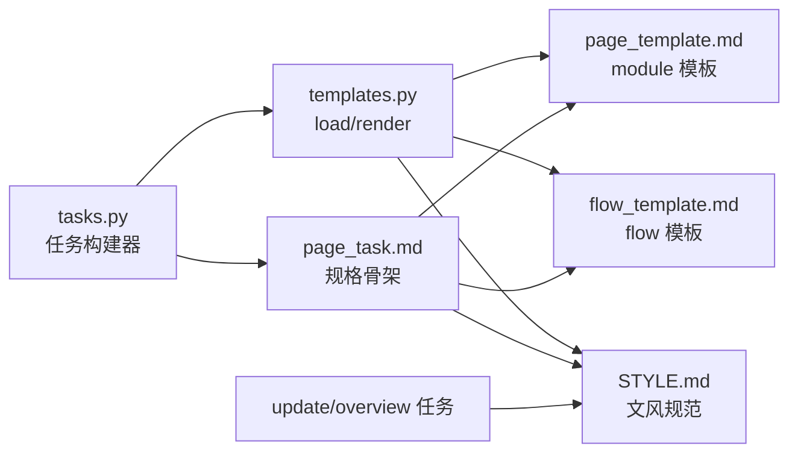

# 页面模板与撰写规范

<cite>
**本文引用的文件**
- [templates.py](file://src/repowiki/templates.py)
- [page_task.md](file://src/repowiki/templates/zh/page_task.md)
- [page_template.md](file://src/repowiki/templates/zh/page_template.md)
- [flow_template.md](file://src/repowiki/templates/zh/flow_template.md)
- [STYLE.md](file://src/repowiki/templates/zh/STYLE.md)
- [tasks.py](file://src/repowiki/tasks.py)
</cite>

## 更新摘要

**变更内容**
- `templates/zh/STYLE.md` 的「章节来源与图表来源」一节更新了行号规则表述：行号区间不得超出文件实际行数；仅终点越界会被自动钳制到文件末尾，起点越界或区间倒置会被 `check` 打回重写，见 [src/repowiki/templates/zh/STYLE.md:9-15](file://src/repowiki/templates/zh/STYLE.md#L9-L15)；本页「STYLE.md：文风与引用红线」小节同步改写。
- 校验器同步新增两条与撰写规范联动的硬性规则，已写入对应小节：引用区间不得全为空行（无法支撑任何论断则判失败）；除「目录」与「更新摘要」外每个 `##` 小节必须非空且携带「章节来源」标记。
- `templates/zh/page_task.md` 的行号规则描述同步更新（45 行）；本页「简介」小节按新的逐小节来源规则补齐了「章节来源」。

## 目录
1. [更新摘要](#更新摘要)
2. [简介](#简介)
3. [项目结构](#项目结构)
4. [核心组件](#核心组件)
5. [架构总览](#架构总览)
6. [详细组件分析](#详细组件分析)
7. [依赖关系分析](#依赖关系分析)
8. [性能与一致性考量](#性能与一致性考量)
9. [故障排查指南](#故障排查指南)
10. [结论](#结论)

## 简介

页面模板与撰写规范是 repowiki 内容质量的约束层：`page_task.md` 把任务上下文（hint_files、output 路径、姊妹页面、硬性检查项）组装成自包含的任务规格；`page_template.md`（结构型 module，默认）与 `flow_template.md`（流程型）定义页面的必备小节骨架；`STYLE.md` 规定引用格式、图表风格与文风红线；`templates.py` 则是这批模板资产的装载与 `{{PLACEHOLDER}}` 变量注入器。plan 阶段这四类内容被渲染进每份任务规格，check 阶段校验器按同一套规则把关，构成「模板强制 + 程序化校验」的闭环。

章节来源
- [src/repowiki/templates/zh/page_task.md:1-9](file://src/repowiki/templates/zh/page_task.md#L1-L9)
- [src/repowiki/templates/zh/STYLE.md:3-15](file://src/repowiki/templates/zh/STYLE.md#L3-L15)
- [src/repowiki/templates.py:17-26](file://src/repowiki/templates.py#L17-L26)

## 项目结构

模板资产按语言分目录存放，每个 locale 携带完整模板集：

- `src/repowiki/templates.py`：模板装载器——按 locale 查找文件、缺失时回落默认 locale、以正则替换注入变量。
- `src/repowiki/templates/zh/page_task.md`：page 任务规格骨架，front matter 与撰写指令的容器。
- `src/repowiki/templates/zh/page_template.md`：结构型（module）页面模板，九个必备小节。
- `src/repowiki/templates/zh/flow_template.md`：流程型页面模板，七个小节，面向流程/机制主题。
- `src/repowiki/templates/zh/STYLE.md`：文风与图表规范，随每份页面/总览/更新任务规格内嵌。
- `src/repowiki/templates/en/`：英文镜像目录，同名文件一一对应；产出语言在 plan 时锁定。

图表来源
- [src/repowiki/templates.py:17-26](file://src/repowiki/templates.py#L17-L26)
- [src/repowiki/templates/zh/page_task.md:28-32](file://src/repowiki/templates/zh/page_task.md#L28-L32)
- [src/repowiki/tasks.py:107-112](file://src/repowiki/tasks.py#L107-L112)

章节来源
- [src/repowiki/templates.py:1-8](file://src/repowiki/templates.py#L1-L8)
- [src/repowiki/templates/zh/page_task.md:1-9](file://src/repowiki/templates/zh/page_task.md#L1-L9)

## 核心组件

- `load` / `render` / `render_file`（templates.py）：按 locale 装载模板文本、以 `{{PLACEHOLDER}}` 正则替换注入变量；未提供的占位符刻意原样保留，供校验器发现「忘记替换」的产出。
- `page_task.md`：任务规格骨架——front matter（id/kind/phase/title/output/hint_files）加六段撰写指令，规格尾部固定给出硬性检查项与 touch/check 命令提示。
- `page_template.md`（module 原型）：九小节骨架——简介、项目结构、核心组件、架构总览、详细组件分析、依赖关系分析、性能与一致性考量、故障排查指南、结论，含 `{{TITLE}}` 预渲染的 H1 与 cite 块。
- `flow_template.md`（flow 原型）：七小节骨架——简介、流程总览、关键步骤、参与组件、数据与状态变化、故障排查指南、结论。
- `STYLE.md`：硬性文风规范——中英空格、禁 emoji/表格、`[path:Lx-Ly](file://path#Lx-Ly)` 引用格式、页间零链接、mermaid 节点引号包裹、GitHub 中文锚点规则。

章节来源
- [src/repowiki/templates.py:22-38](file://src/repowiki/templates.py#L22-L38)
- [src/repowiki/templates/zh/page_task.md:34-45](file://src/repowiki/templates/zh/page_task.md#L34-L45)
- [src/repowiki/templates/zh/page_template.md:1-12](file://src/repowiki/templates/zh/page_template.md#L1-L12)
- [src/repowiki/templates/zh/flow_template.md:3-10](file://src/repowiki/templates/zh/flow_template.md#L3-L10)
- [src/repowiki/templates/zh/STYLE.md:1-15](file://src/repowiki/templates/zh/STYLE.md#L1-L15)

## 架构总览

模板的流转是一条「渲染 → 撰写 → 校验」的流水线：catalog 任务 check 通过后，`build_page_tasks` 为每个目录节点渲染 `page_task.md`——注入章节路径、hint_files、姊妹页面，并按节点的 `archetype` 选载 module 或 flow 页面模板（`{{TITLE}}` 已预渲染，防 agent 忘记替换）；`STYLE.md` 全文内嵌进规格。agent 按 `next --claim` 读到规格后照骨架撰写 output 文件；check 时校验器按同一套模板规则逐项检查，确定性缺陷（锚点/行号/H1）自动修复，语义缺陷判 failed。

图表来源
- [src/repowiki/tasks.py:87-115](file://src/repowiki/tasks.py#L87-L115)
- [src/repowiki/tasks.py:83-84](file://src/repowiki/tasks.py#L83-L84)
- [src/repowiki/templates.py:29-38](file://src/repowiki/templates.py#L29-L38)

章节来源
- [src/repowiki/tasks.py:87-115](file://src/repowiki/tasks.py#L87-L115)
- [src/repowiki/templates/zh/page_task.md:11-26](file://src/repowiki/templates/zh/page_task.md#L11-L26)

## 详细组件分析

### 模板装载与变量注入（templates.py）

- 职责：把 `templates/<locale>/` 下的纯文本模板变成渲染后的任务规格。
- 关键行为：`load` 按 locale 目录查找，缺失时回落默认 locale 的同名文件；`render` 用正则 `\{\{([A-Z][A-Z0-9_]*)\}\}` 匹配占位符并按关键字参数替换。
- 实现要点：未知占位符刻意保留原样（docstring 明示「so the validator can flag forgotten substitutions」）——agent 产出中残留 `{{XXX}}` 形态即说明有变量没替换，校验器据此报错；模板本身不含逻辑，全部上下文由调用方注入。

章节来源
- [src/repowiki/templates.py:1-8](file://src/repowiki/templates.py#L1-L8)
- [src/repowiki/templates.py:17-38](file://src/repowiki/templates.py#L17-L38)

### page_task：任务规格骨架

- 职责：给执行 agent 一份「自包含、并行安全」的完整指令，无需回读任何其他任务或页面。
- 关键行为：front matter 声明 id/kind/phase/title/output/hint_files；正文六段依次是页面定位（章节路径、摘要、page_brief 要点）、参考文件清单（附语言与行数元信息）、姊妹页面（仅供定位、禁止链接）、内嵌页面模板（声明「小节顺序不可变」）、内嵌 STYLE 规范、硬性检查项七条。
- 实现要点：output 路径同时给出绝对形式（`{{OUTPUT_ABS}}`，即 `.repowiki/` 前缀）与仓库相对形式；规格尾部固定提醒 touch 续期与 check 命令，把 worker 契约写进每份任务。

章节来源
- [src/repowiki/templates/zh/page_task.md:1-26](file://src/repowiki/templates/zh/page_task.md#L1-L26)
- [src/repowiki/templates/zh/page_task.md:28-45](file://src/repowiki/templates/zh/page_task.md#L28-L45)

### module 与 flow 两套页面模板

- 职责：按主题性质选择页面骨架——结构型主题（模块/子系统）用 module 默认模板，流程/机制主题（端到端流程）用 flow 模板。
- 关键行为：module 模板九小节，以「项目结构 + 架构总览 + 详细组件分析」承载结构叙事，要求至少一个 `graph TB` 结构图、一个 `sequenceDiagram` 时序图、一个 `graph LR` 依赖图；flow 模板七小节，以「流程总览（时序图）→ 关键步骤（输入/处理/失败路径）→ 参与组件 → 数据与状态变化（状态迁移图）」承载流程叙事。
- 实现要点：原型由 catalog 节点的可选 `archetype` 字段声明，规划器经 `_page_template_name` 选模板文件；check 不在任务记录里存 archetype，而是按任务 id 反查 catalog——单一事实来源，重规划后旧任务不会校验错模板；两套模板的 cite 块与引用格式要求完全一致，校验器的 cite/锚点/行号规则原型无关。

章节来源
- [src/repowiki/templates/zh/page_template.md:14-107](file://src/repowiki/templates/zh/page_template.md#L14-L107)
- [src/repowiki/templates/zh/flow_template.md:12-81](file://src/repowiki/templates/zh/flow_template.md#L12-L81)
- [src/repowiki/tasks.py:83-84](file://src/repowiki/tasks.py#L83-L84)

### STYLE.md：文风与引用红线

- 职责：把「什么样的页面算合格」压缩成一页可内嵌的硬性规范，让任意 agent 产出风格一致的页面。
- 关键行为：语言层面要求正文简体中文、技术名词保留英文、中英文/数字间留一个空格、禁 emoji、默认禁表格；引用层面要求每个正文章节末尾附「章节来源」、每个 mermaid 图后附「图表来源」，格式固定为 `[path:Lx-Ly](file://path#Lx-Ly)`，行号区间不得超出文件实际行数——仅终点越界会被自动钳制到文件末尾，起点越界或区间倒置会被 `check` 打回重写，且引用区间不得全为空行，无对应代码的小节须写明「本节为概念性说明」；图表层面规定 graph TB/LR、sequenceDiagram 的选用场景与节点标签双引号包裹；页面层面规定 H1 唯一、目录锚点用 GitHub 中文锚点规则、结论给出一句话定位与使用建议。与 STYLE 联动的程序化校验还包括：除「目录」与「更新摘要」外每个 `##` 小节必须非空且携带「章节来源」，由校验器按 i18n 的 `section_sources` 标记词逐节核查。
- 实现要点：页间零链接是刻意设计——正因页面互不依赖，所有页面任务才可完全并行；STYLE 全文随页面、总览、增量更新任务规格一起内嵌，规格自包含由此成立。

章节来源
- [src/repowiki/templates/zh/STYLE.md:3-15](file://src/repowiki/templates/zh/STYLE.md#L3-L15)
- [src/repowiki/templates/zh/STYLE.md:17-45](file://src/repowiki/templates/zh/STYLE.md#L17-L45)
- [src/repowiki/templates/zh/STYLE.md:47-50](file://src/repowiki/templates/zh/STYLE.md#L47-L50)
- [src/repowiki/validate.py:227-240](file://src/repowiki/validate.py#L227-L240)
- [src/repowiki/validate.py:176-201](file://src/repowiki/validate.py#L176-L201)

## 依赖关系分析

- `tasks.py` 是模板系统的最大消费者：page 任务注入 `PAGE_TEMPLATE` 与 `STYLE`；overview 任务同样内嵌 `STYLE.md`；增量更新任务（update_task.md）复用 `STYLE` 并携带旧页面全文（OLD_PAGE）作更新基底。
- 回落复用：`build_update_task` 遇到旧页面不存在时，直接改用 `page_task.md` 按全新页面渲染——新增页面不被强迫携带「更新摘要」小节。
- `templates.py` 依赖 `i18n.DEFAULT_LOCALE` 决定回落目标；任务规格在 plan 时按仓库语言锁定 locale，模板即对应语言。
- 校验器（validate.py）与模板共享同一套约定：占位符形态由 `templates.py` 的正则定义，锚点规则与 STYLE.md 的描述一致。

图表来源
- [src/repowiki/templates.py:22-38](file://src/repowiki/templates.py#L22-L38)
- [src/repowiki/tasks.py:107-112](file://src/repowiki/tasks.py#L107-L112)
- [src/repowiki/tasks.py:120-133](file://src/repowiki/tasks.py#L120-L133)
- [src/repowiki/tasks.py:165-204](file://src/repowiki/tasks.py#L165-L204)

章节来源
- [src/repowiki/tasks.py:165-189](file://src/repowiki/tasks.py#L165-L189)
- [src/repowiki/tasks.py:190-204](file://src/repowiki/tasks.py#L190-L204)
- [src/repowiki/tasks.py:120-133](file://src/repowiki/tasks.py#L120-L133)

## 性能与一致性考量

- 一致性收益：模板与规范内嵌进每份规格（约 4-6k tokens），换来「任意 agent 任意页面产出同构」——这是页面任务可完全并行、页间零链接的前提；小上下文 agent 也可把规格中的模板段落替换为对 `templates/` 目录的引用以节省预算。
- 双保险防占位符残留：渲染侧未知占位符原样保留供校验器识别；`{{TITLE}}` 在规划期就预渲染为真实标题，防止 agent 忘记替换 H1。
- 语言一致性：每个 locale 携带完整模板集，`load` 缺失回落默认 locale；产出语言 plan 时锁定于 `state/locale`，中途更换需 `plan --replan`。
- 原型选择的稳定性：archetype 存于 catalog 而非任务记录，check 时按 id 反查，避免重规划后新旧模板校验错位。

章节来源
- [src/repowiki/templates.py:1-8](file://src/repowiki/templates.py#L1-L8)
- [src/repowiki/templates.py:22-26](file://src/repowiki/templates.py#L22-L26)
- [src/repowiki/tasks.py:107-112](file://src/repowiki/tasks.py#L107-L112)
- [src/repowiki/dispatch.py:265-279](file://src/repowiki/dispatch.py#L265-L279)

## 故障排查指南

- 校验器报「未替换占位符」：散文中残留 `{{XXX}}` 形态即缺陷；代码块/行内代码中的字面占位符是合法内容（扫描会剔除后进行）。修复方式是替换为真实内容，而非删除占位符标记。
- check 时页面按错误的模板校验（如 flow 页被判缺「项目结构」小节）：archetype 来自 catalog 节点声明，check 按任务 id 反查 catalog；确认 catalog 中该节点的 `archetype` 字段取值应为 `module` 或 `flow`，改 catalog 后无需改任务记录。
- 引用行号越界报错：行号区间必须来自真实文件内容，先确认目标文件实际行数再写 `[path:Lx-Ly]`；越界的确定性缺陷会被自动修复，但最好在撰写时就核准。
- 目录锚点跳转失效：GitHub 中文锚点规则是「去标点、空白转 -」，例如「附录：一键」对应 `#附录一键` 而非 `#附录-一键`；按此规则修正目录项。
- 页面被报缺小节：对照所选原型核对必备小节——module 九小节、flow 七小节，小节顺序不可变；确有需要可追加「附录：<主题>」小节，但不可替换必备小节。

章节来源
- [src/repowiki/templates.py:29-34](file://src/repowiki/templates.py#L29-L34)
- [src/repowiki/templates/zh/STYLE.md:8-15](file://src/repowiki/templates/zh/STYLE.md#L8-L15)
- [src/repowiki/templates/zh/STYLE.md:47-50](file://src/repowiki/templates/zh/STYLE.md#L47-L50)
- [src/repowiki/templates/zh/page_task.md:34-41](file://src/repowiki/templates/zh/page_task.md#L34-L41)

## 结论

页面模板与撰写规范的定位是「用静态模板换动态质量」：`page_task.md` 打包任务上下文，module/flow 两套页面模板按主题提供骨架，`STYLE.md` 用一页规范锁死引用格式与文风红线，`templates.py` 以最简单的占位符替换把四者组装进自包含规格。正确使用方式是：规划者为流程主题声明 `archetype: flow`、其余保持默认 module；执行 agent 严格照骨架与 STYLE 撰写，行号引用先核实；无需也不应绕过模板自行发挥——check 会按同一套规则逐项把关。

章节来源
- [src/repowiki/templates/zh/page_task.md:28-45](file://src/repowiki/templates/zh/page_task.md#L28-L45)
- [src/repowiki/templates/zh/STYLE.md:1-15](file://src/repowiki/templates/zh/STYLE.md#L1-L15)
- [src/repowiki/tasks.py:83-84](file://src/repowiki/tasks.py#L83-L84)
