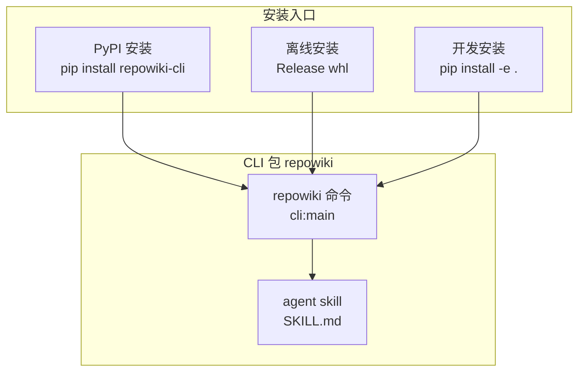
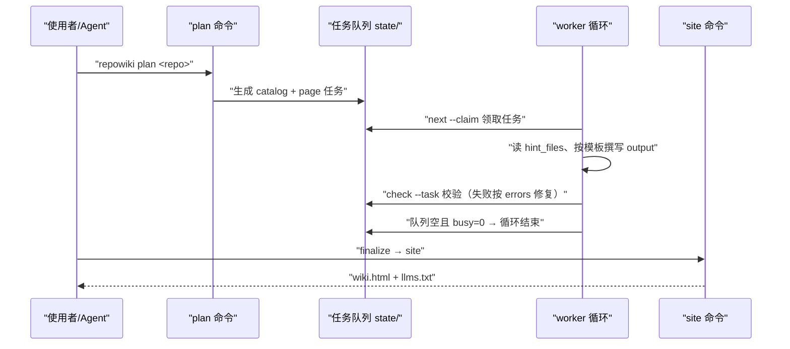
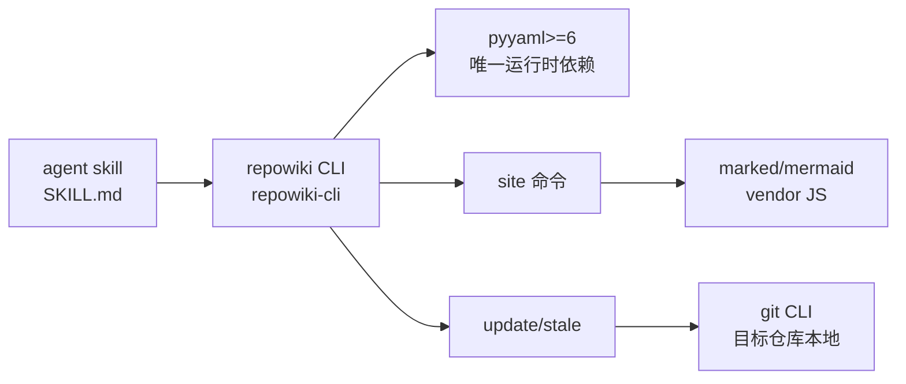

# 快速开始

<cite>
**本文引用的文件**
- [README.md](file://README.md)
- [pyproject.toml](file://pyproject.toml)
- [SKILL.md](file://src/repowiki/skills/repowiki/SKILL.md)
- [USAGE.md](file://docs/zh/USAGE.md)
</cite>

## 更新摘要

**变更内容**
- `src/repowiki/skills/repowiki/SKILL.md` 的硬性规则更新了行号校验描述：行号不越界（起点越界 / 区间倒置会被打回，仅终点越界自动钳制）；`check` 的确定性缺陷（锚点 / H1 / 越界的行区间终点）自动修复，只需修复 `errors` 列出的语义问题，见 [src/repowiki/skills/repowiki/SKILL.md:102-107](file://src/repowiki/skills/repowiki/SKILL.md#L102-L107)。「并发流程与 worker 循环」小节的 check 行为描述已同步补充。
- 校验器同步新增逐小节「章节来源」要求与「引用区间全为空行 → error」规则；本页「简介」小节按新规则补齐了「章节来源」。

## 目录
1. [更新摘要](#更新摘要)
2. [简介](#简介)
3. [项目结构](#项目结构)
4. [核心组件](#核心组件)
5. [架构总览](#架构总览)
6. [详细组件分析](#详细组件分析)
7. [依赖关系分析](#依赖关系分析)
8. [性能与一致性考量](#性能与一致性考量)
9. [故障排查指南](#故障排查指南)
10. [结论](#结论)

## 简介

本页是安装 repowiki CLI 并跑通第一个 wiki 生成的最短路径：先装 CLI（PyPI、离线 whl 或源码 editable 三选一），可选装 agent skill 让编码 agent 自动触发工作流，再按「plan → next/claim → 撰写 → check → finalize → site」的最小流程走完一遍，即可得到位于 `<repo>/.repowiki/` 下的结构化 wiki 与单文件离线站点。本页内容对应 README 的安装章节与 SKILL.md 的标准流程。

章节来源
- [README.md:13-16](file://README.md#L13-L16)
- [src/repowiki/skills/repowiki/SKILL.md:1-12](file://src/repowiki/skills/repowiki/SKILL.md#L1-L12)

## 项目结构

与快速开始直接相关的仓库文件：

- `README.md`：安装章节（CLI / Agent Skill / 离线安装三节）、命令一览与退出码约定。
- `src/repowiki/skills/repowiki/SKILL.md`：agent skill 指引，定义串行标准流程与并发 worker 循环契约。
- `pyproject.toml`：打包元数据——分发名 `repowiki-cli`、Python ≥ 3.10、运行时依赖仅 `pyyaml>=6`、命令入口 `repowiki = "repowiki.cli:main"`。
- `docs/zh/USAGE.md`：完整命令参考、Worker 循环契约与并发配样的详解文档。
- 产出目录：`<repo>/.repowiki/`（`<locale>/content/` 页面、`<locale>/wiki.html` 单文件站点、`state/` 任务状态）。

图表来源
- [README.md:61-90](file://README.md#L61-L90)
- [pyproject.toml:39-46](file://pyproject.toml#L39-L46)

章节来源
- [README.md:61-90](file://README.md#L61-L90)
- [pyproject.toml:5-15](file://pyproject.toml#L5-L15)
- [src/repowiki/skills/repowiki/SKILL.md:1-12](file://src/repowiki/skills/repowiki/SKILL.md#L1-L12)

## 核心组件

- repowiki CLI：确定性构建系统本体，PyPI 分发名 `repowiki-cli`，命令名 `repowiki`，负责任务规划、原子认领、产出校验、自动修复、元数据组装。
- agent skill：随 CLI 分发的工作流指引，`repowiki skill install` 一条命令装入全局 skills 目录或指定客户端目录，告诉 agent 按什么流程调用 CLI。
- 任务队列：`plan` 生成的全局 FIFO 任务清单，worker 通过 `next --claim` 领取，规格内嵌完整模板与文风规范。
- 单文件站点：`site` 命令产出的自包含 HTML（约 5 MB）与 `llms.txt` / `llms-full.txt` agent 索引。

章节来源
- [README.md:13-16](file://README.md#L13-L16)
- [README.md:71-83](file://README.md#L71-L83)
- [pyproject.toml:6-15](file://pyproject.toml#L6-L15)
- [README.md:100-109](file://README.md#L100-L109)

## 架构总览

最小流程共七步：`plan` 扫描仓库生成任务清单（首个任务是 catalog 目录规划）；随后循环「`next --claim` 领取任务 → 按 instructions 撰写 → `check` 校验」直到队列清空且 busy=0；`finalize` 组装 metadata.json（两步：首次运行创建 overview 任务并退出码 3，执行完 overview 再次运行才完成）；最后 `site` 生成单文件离线站点。串行全流程在 SKILL.md 的标准流程一节给出逐条命令。

图表来源
- [src/repowiki/skills/repowiki/SKILL.md:25-45](file://src/repowiki/skills/repowiki/SKILL.md#L25-L45)
- [README.md:116-131](file://README.md#L116-L131)

章节来源
- [src/repowiki/skills/repowiki/SKILL.md:25-45](file://src/repowiki/skills/repowiki/SKILL.md#L25-L45)
- [README.md:130-131](file://README.md#L130-L131)

## 详细组件分析

### 安装 CLI（三种方式）

- 职责：让 `repowiki` 命令在本机可用，这是唯一必需的安装步骤。
- 关键行为：首选 `pip install repowiki-cli`（或 `pipx install repowiki-cli`），装完用 `repowiki --version` 验证；要求 Python ≥ 3.10，macOS / Linux / Windows 原生支持，无需 WSL。
- 实现要点：开发安装是克隆仓库后 `pip install -e .`（跑测试用 `pip install -e '.[test]'` 再 `pytest`）；离线安装利用「运行时依赖只有 pyyaml」的极简定位——在有网机器下载 PyYAML wheel 与 Release 页附带的 `repowiki_cli-*.whl`，拷到目标机后 `pip install --no-index` 两个 wheel 即可。

章节来源
- [README.md:63-69](file://README.md#L63-L69)
- [README.md:85-90](file://README.md#L85-L90)
- [pyproject.toml:10-15](file://pyproject.toml#L10-L15)
- [README.md:148-156](file://README.md#L148-L156)

### 安装 agent skill（可选）

- 职责：让编码 agent（Claude Code / Codex / ZCode 等）在用户提到「生成 repowiki」时自动按标准流程驱动 CLI。
- 关键行为：`repowiki skill install` 默认装入 `~/.agents/skills/repowiki/`（各 agent 通用的全局 skills 目录），`--agent claude` 等参数可装入指定客户端目录（claude / codex / zcode / cursor / opencode）；`repowiki skill status` 查看已装版本与是否过期。
- 实现要点：skill 只是指引，真正干活的是第 1 步装的 `repowiki` 命令；也可把本仓库作为插件安装（`.claude-plugin/` 清单自动识别），或手动拷贝 `src/repowiki/skills/repowiki/` 到客户端 skills 目录。

章节来源
- [README.md:71-83](file://README.md#L71-L83)
- [src/repowiki/skills/repowiki/SKILL.md:1-12](file://src/repowiki/skills/repowiki/SKILL.md#L1-L12)

### 最小流程：plan 到 site

- 职责：对目标仓库 `<repo>` 跑通第一个 wiki 的完整串行命令序列。
- 关键行为：依次执行 `repowiki plan <repo>`（自动检测产出语言 zh/en）、`repowiki next <repo> --claim --json` 领取任务、按 instructions 通读 hint_files 并把页面写到 output 路径、`repowiki check <repo> --task <id>` 校验（失败按 errors 修复后重查）、循环到 `next` 返回空且 busy=0、`repowiki finalize <repo>`（首次退出码 3 属正常进展）、`repowiki site <repo>`（`--open` 自动打开浏览器）。
- 实现要点：任务类型顺序为 catalog（目录树规划）→ page（逐页撰写）→ overview（总览）；finalize 成功后自动清理 state/claims 与 state/tasks，catalog/index 保留供后续 `update` 增量更新；不需要增量更新时可 `repowiki clean <repo>` 删除全部任务状态。

章节来源
- [src/repowiki/skills/repowiki/SKILL.md:29-45](file://src/repowiki/skills/repowiki/SKILL.md#L29-L45)
- [README.md:120-131](file://README.md#L120-L131)

### 并发流程与 worker 循环（推荐）

- 职责：catalog 任务完成后用多个等价 subagent 并行消费页面任务，加速大仓库生成。
- 关键行为：主 agent 只决定 worker 数量与 `--worker` 命名，禁止给 worker 指定任务 ID——队列是全局 FIFO，分工完全由 `next` 决定；每个 worker 循环执行「next --claim → 空且 busy>0 则等 30 秒重试 → 按 instructions 执行 → check」，当前任务完成前不得再次 next --claim。
- 实现要点：认领后立即 `touch` 一次，撰写期间每约 3 分钟 touch 一次（认领超过 stale 窗口未续期会被自动回收转给他人，默认 15 分钟，可用 `REPOWIKI_STALE_SECONDS` 调整）；check 报「由他人认领」冲突（exit 2）时不争抢、不加 `--force`，直接回到 next；check 会自动修复确定性缺陷（锚点 / H1 / 越界的行区间终点），无需手动处理——起点越界、区间倒置、引用区间全为空行、小节缺「章节来源」等语义缺陷才需要按 errors 修复同一文件后重查，最多 3 次，仍失败则 `release --task <id> --force` 并结束本任务；单任务尝试超过 `REPOWIKI_MAX_ATTEMPTS`（默认 3）次后进入 exhausted。

章节来源
- [src/repowiki/skills/repowiki/SKILL.md:47-75](file://src/repowiki/skills/repowiki/SKILL.md#L47-L75)
- [src/repowiki/skills/repowiki/SKILL.md:95-100](file://src/repowiki/skills/repowiki/SKILL.md#L95-L100)
- [src/repowiki/skills/repowiki/SKILL.md:102-107](file://src/repowiki/skills/repowiki/SKILL.md#L102-L107)

## 依赖关系分析

- CLI 运行时唯一依赖是 `pyyaml>=6`，Python 版本下限 3.10，这使离线安装只需携带两个 wheel。
- agent skill 依赖 CLI：skill 文件随 whl 打包分发（`skills/repowiki/*` 进 package-data），安装后执行 `repowiki skill install` 做纯本地拷贝。
- `site` 命令依赖内嵌的 marked/mermaid 渲染库（MIT，随仓库 vendor 分发），因此产物完全离线可看。
- `update` / `stale` 依赖目标仓库本地的 git CLI（`git diff` / `git rev-parse`），这是快速开始之外的增量能力的前置。

图表来源
- [pyproject.toml:10-15](file://pyproject.toml#L10-L15)
- [pyproject.toml:45-46](file://pyproject.toml#L45-L46)
- [README.md:107-109](file://README.md#L107-L109)
- [README.md:145](file://README.md#L145)

章节来源
- [pyproject.toml:5-15](file://pyproject.toml#L5-L15)
- [README.md:85-90](file://README.md#L85-L90)
- [README.md:144-146](file://README.md#L144-L146)

## 性能与一致性考量

- 上手摩擦最小化：一条 `pip install repowiki-cli` 即完成安装；对比 git-URL 安装，PyPI 是上手摩擦的最大单项改进。
- 并发一致性：多 worker 共享同一任务队列时，原子认领（POSIX `fcntl` / Windows `msvcrt` 文件锁）+ 心跳续期 + 过期自动回收保证不双写；worker 遵守 touch 纪律时不会被误抢。
- 产物一致性：模板与文风规范内嵌进每份任务规格（约 4-6k tokens），换取自包含与并行安全——各页面任务互不依赖、可完全并行。
- 幂等性：`site` 幂等可重跑，finalize、update 或手动改了页面之后随时重建；执行过 `clean` 也能从磁盘页面重建（章节顺序退化为目录序）。

章节来源
- [README.md:46-51](file://README.md#L46-L51)
- [README.md:133-140](file://README.md#L133-L140)
- [README.md:108-109](file://README.md#L108-L109)
- [README.md:145](file://README.md#L145)

## 故障排查指南

- `repowiki` 命令不存在：执行前先用 `command -v repowiki`（PowerShell 用 `Get-Command repowiki`）确认命令可用，不存在则回到安装步骤重装。
- `check` 退出码 2（任务被他人认领）：说明该认领已过期被回收并被其他 worker 接手，不争抢、不加 `--force`，回到 `next --claim` 领取下一个任务。
- `finalize` 退出码 3：这是进展性等待而非错误——首次运行已创建 overview 任务，执行完 overview 任务并 check done 后再次运行 finalize 即可完成。
- `watch` 退出码可疑：前台交给有超时限制的 shell 工具时，超时会杀掉 watch，被杀进程的退出码不可信（exit 0 可能只是截断假象），存疑时先用 `repowiki status` 核实队列状态。
- 任务进入 exhausted：单任务尝试超过 `REPOWIKI_MAX_ATTEMPTS`（默认 3）次，用 `release --task <id> --force` 重置后重新进入队列。

章节来源
- [src/repowiki/skills/repowiki/SKILL.md:22-23](file://src/repowiki/skills/repowiki/SKILL.md#L22-L23)
- [src/repowiki/skills/repowiki/SKILL.md:74-75](file://src/repowiki/skills/repowiki/SKILL.md#L74-L75)
- [src/repowiki/skills/repowiki/SKILL.md:88-93](file://src/repowiki/skills/repowiki/SKILL.md#L88-L93)
- [README.md:130-131](file://README.md#L130-L131)

## 结论

快速开始的正确定位是「最小可跑通路径」：CLI 安装是唯一必需步骤（PyPI 一条命令，离线场景两个 wheel），agent skill 是提升自动化程度的可选项；跑通顺序严格遵循 plan → claim → 撰写 → check 循环，再以 finalize（注意两步语义与退出码 3）和 site 收尾。注意事项有三：撰写期间遵守 touch 心跳纪律以防认领被回收；一次只持有一个认领；不要给 worker 指定任务清单，分工完全交给队列。

章节来源
- [README.md:61-90](file://README.md#L61-L90)
- [src/repowiki/skills/repowiki/SKILL.md:25-45](file://src/repowiki/skills/repowiki/SKILL.md#L25-L45)
- [src/repowiki/skills/repowiki/SKILL.md:102-107](file://src/repowiki/skills/repowiki/SKILL.md#L102-L107)
