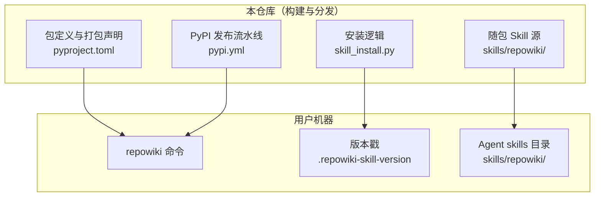
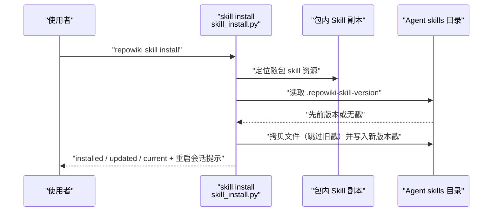
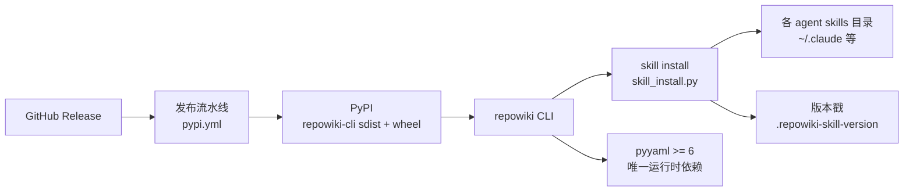

# 安装与 Agent Skill 安装

## 目录
1. [简介](#简介)
2. [项目结构](#项目结构)
3. [核心组件](#核心组件)
4. [架构总览](#架构总览)
5. [详细组件分析](#详细组件分析)
6. [依赖关系分析](#依赖关系分析)
7. [性能与一致性考量](#性能与一致性考量)
8. [故障排查指南](#故障排查指南)
9. [结论](#结论)

## 简介

本页说明 repowiki 的两条安装主线：其一是安装 `repowiki` CLI 本体（PyPI 在线的 pip / pipx 安装，或面向隔离网络的离线 whl 安装），其二是用 `repowiki skill install` 把随包分发的 Agent Skill 拷贝进各 agent 客户端的 skills 目录，使 agent 会话能自动识别并触发 repowiki 工作流。CLI 是唯一必装组件，Skill 只是指引文件、完全可选；两者都随同一个 wheel 分发，因此装好 CLI 后安装 Skill 是一次纯本地拷贝。

## 项目结构

与安装相关的仓库组织如下：

- `pyproject.toml`：包元数据（包名 `repowiki-cli`、版本、`requires-python`、依赖 `pyyaml>=6`），并把 `skills/repowiki/*` 声明为包数据随 wheel 打包。
- `src/repowiki/skill_install.py`：`skill install` / `skill status` 两个子命令的实现，负责目录映射、拷贝与版本戳管理。
- `src/repowiki/skills/repowiki/`：随包分发的 Skill 源文件（含 SKILL.md），是安装时的拷贝来源。
- `.github/workflows/pypi.yml`：PyPI Trusted Publisher 发布流水线，Release 发布时自动构建并上传 sdist 与 wheel。
- `README.md`：安装文档本体，覆盖在线、离线与 Skill 的全部安装路径。

图表来源
- [pyproject.toml:45-46](file://pyproject.toml#L45-L46)
- [src/repowiki/skill_install.py:17-37](file://src/repowiki/skill_install.py#L17-L37)
- [.github/workflows/pypi.yml:36-41](file://.github/workflows/pypi.yml#L36-L41)

章节来源
- [pyproject.toml:5-16](file://pyproject.toml#L5-L16)
- [src/repowiki/skill_install.py:1-7](file://src/repowiki/skill_install.py#L1-L7)
- [README.md:62-96](file://README.md#L62-L96)

## 核心组件

- repowiki CLI 包：PyPI 包名 `repowiki-cli`，要求 Python ≥ 3.10，运行时依赖只有 `pyyaml>=6`，安装入口为 `repowiki` 命令。
- 随包 Skill：`skills/repowiki/` 目录随 wheel 一起分发，pip 安装即携带，无需额外下载。
- skill install 子命令：把包内 Skill 拷贝到目标 skills 目录并写入版本戳，已一致时跳过（幂等）。
- skill status 子命令：对比已装副本的版本戳与当前包版本，报告 missing / unstamped / outdated / newer / current。
- PyPI 发布流水线：`.github/workflows/pypi.yml` 借助 Trusted Publisher（OIDC 免 token）在 Release 发布时自动上传 sdist 与 wheel。

章节来源
- [pyproject.toml:5-16](file://pyproject.toml#L5-L16)
- [src/repowiki/skill_install.py:17-20](file://src/repowiki/skill_install.py#L17-L20)
- [src/repowiki/skill_install.py:79-122](file://src/repowiki/skill_install.py#L79-L122)
- [.github/workflows/pypi.yml:1-14](file://.github/workflows/pypi.yml#L1-L14)

## 架构总览

`repowiki skill install` 的执行是一个「读版本戳、按需拷贝、写新戳」的短流程：命令先通过 `importlib.resources` 定位包内 Skill 副本，再解析目标目录列表（`--agent` / `--target` / 默认共享目录），对每个目标读取旧版本戳决定跳过或覆盖，最后写出新版本戳并提示重启客户端会话。

图表来源
- [src/repowiki/skill_install.py:36-50](file://src/repowiki/skill_install.py#L36-L50)
- [src/repowiki/skill_install.py:79-98](file://src/repowiki/skill_install.py#L79-L98)

章节来源
- [src/repowiki/skill_install.py:79-98](file://src/repowiki/skill_install.py#L79-L98)
- [README.md:75-87](file://README.md#L75-L87)

## 详细组件分析

### 在线安装 CLI（pip / pipx）

- 职责：在联网机器上获得 `repowiki` 命令，这是唯一必装步骤。
- 关键行为：`pip install git+https://github.com/luomsis/repowiki.git`（或 pipx 同 URL）；已克隆仓库时在仓库内 `pip install -e .`。
- 实现要点：要求 Python ≥ 3.10；运行时依赖仅 `pyyaml>=6`；macOS / Linux / Windows 原生支持（Windows 并发锁用 `msvcrt`，POSIX 用 `fcntl`），无需 WSL。

章节来源
- [README.md:62-74](file://README.md#L62-L74)
- [pyproject.toml:5-16](file://pyproject.toml#L5-L16)

### 离线安装（whl + pyyaml wheel）

- 职责：在无法访问 PyPI / GitHub 的目标机上完成安装。
- 关键行为：在有网机器准备三样物料——仓库源码（或 `repowiki_cli-*.whl`，可直接取 GitHub Release 页附带的产物）、按目标机平台与 Python 版本用 `pip download PyYAML==6.*` 下载的 pyyaml wheel、目标机上的 Python ≥ 3.10；拷到目标机后先 `pip install --no-index wheels/PyYAML-*.whl` 装唯一依赖，再 `pip install --no-index repowiki_cli-*.whl` 装本体，`repowiki --version` 验证；pipx 用户用 `pipx install --no-index repowiki_cli-*.whl`。
- 实现要点：各平台 / 各 Python 版本的 pyyaml wheel 互不通用，需按目标机准备；要跑测试套再额外离线装 `pytest`（`[test]` extra）。Agent Skill 同样离线可用——skill 已随 whl 打包，装好 CLI 后执行 `repowiki skill install` 即可。

章节来源
- [README.md:98-122](file://README.md#L98-L122)
- [pyproject.toml:36-37](file://pyproject.toml#L36-L37)

### 安装 Agent Skill：skill install

- 职责：把包内 Skill 副本装入 agent 客户端的全局 skills 目录，让 agent 自动识别 repowiki 工作流。
- 关键行为：默认装入跨客户端共享的 `~/.agents/skills/`（最终目录为 `~/.agents/skills/repowiki/`）；`--agent` 可重复指定 `claude` / `codex` / `zcode` / `cursor` / `opencode`，分别映射到 `~/.claude/skills/`、`~/.codex/skills/`、`~/.zcode/skills/`、`~/.cursor/skills/`、`~/.config/opencode/skills/`；`--target <目录>` 可重复指定任意自定义 skills 目录；未给任何参数时落到共享目录。
- 实现要点：目录映射集中在 `agent_skills_dirs` 一处定义；目标列表按传入顺序去重；拷贝时跳过旧的 `.repowiki-skill-version` 戳文件，完成后写入当前包版本；若目标已有同版本戳且 `SKILL.md` 存在则报告 current 并跳过，实现幂等；装完提示重启客户端会话生效，升级 repowiki 后重跑一次即更新。

章节来源
- [src/repowiki/skill_install.py:17-33](file://src/repowiki/skill_install.py#L17-L33)
- [src/repowiki/skill_install.py:40-61](file://src/repowiki/skill_install.py#L40-L61)
- [src/repowiki/skill_install.py:79-98](file://src/repowiki/skill_install.py#L79-L98)
- [README.md:79-87](file://README.md#L79-L87)

### 查看 Skill 状态：skill status

- 职责：检查已装副本与当前包版本的一致性，识别手动拷贝或过期副本。
- 关键行为：对每个目标目录依次判定——无 `SKILL.md` 报 missing；有文件但无版本戳报 unstamped（提示可能是手动拷贝，重跑 skill install 即可接管）；戳版本小于包版本报 outdated，大于则报 newer，相等报 current。`--agent` / `--target` 的目录解析与 install 完全一致。
- 实现要点：版本比较把版本串拆成数字元组逐位比较，容忍 `0.6.0` 与 `0.6` 之类的书写差异；`skill status` 与 `skill install` 不需要仓库上下文，任何目录下都可执行。

章节来源
- [src/repowiki/skill_install.py:64-76](file://src/repowiki/skill_install.py#L64-L76)
- [src/repowiki/skill_install.py:101-122](file://src/repowiki/skill_install.py#L101-L122)
- [src/repowiki/skill_install.py:138-153](file://src/repowiki/skill_install.py#L138-L153)

### GitHub Release 与 PyPI 发布路径

- 职责：说明在线安装所用的 wheel 从哪里来——仓库通过 PyPI Trusted Publisher 自动发版。
- 关键行为：push main 创建 GitHub Release 后，`pypi.yml` 被自动触发（也支持手动 dispatch），在 ubuntu 上 `python -m build` 构建 sdist 与 wheel 并发布到 PyPI。
- 实现要点：身份由 GitHub OIDC（`id-token: write`）证明，全程无需 API token；首次发布前需在 PyPI 用 Pending Publisher 预登记（项目名 `repowiki-cli`、Owner `luomsis`、Repo `repowiki`、Workflow 文件名 `pypi.yml`、Environment `pypi`），之后新版本无需任何 PyPI 侧操作。

章节来源
- [.github/workflows/pypi.yml:1-25](file://.github/workflows/pypi.yml#L1-L25)
- [.github/workflows/pypi.yml:27-41](file://.github/workflows/pypi.yml#L27-L41)

## 依赖关系分析

- 上游依赖：`repowiki-cli` 包运行时只依赖 `pyyaml>=6` 与 Python ≥ 3.10；skill 安装逻辑依赖标准库 `importlib.resources` 读取包内资源，不引入额外第三方包。
- 分发链路：`.github/workflows/pypi.yml` 依赖 GitHub Release 事件与 PyPI Trusted Publisher 登记；GitHub Release 页附带的 whl 是离线安装的直接物料来源。
- 下游产物：skill install 把包内副本落到各 agent 的 skills 目录，并用版本戳文件维持「包版本 ↔ 已装版本」的一致性；skill 只调用本机已装好的 `repowiki` 命令，自身不依赖任何在线服务。

图表来源
- [.github/workflows/pypi.yml:16-25](file://.github/workflows/pypi.yml#L16-L25)
- [src/repowiki/skill_install.py:79-98](file://src/repowiki/skill_install.py#L79-L98)
- [pyproject.toml:5-16](file://pyproject.toml#L5-L16)

章节来源
- [pyproject.toml:5-16](file://pyproject.toml#L5-L16)
- [.github/workflows/pypi.yml:1-25](file://.github/workflows/pypi.yml#L1-L25)
- [README.md:119-122](file://README.md#L119-L122)

## 性能与一致性考量

- 安装体积与速度：运行时依赖只有 pyyaml，在线安装下载量极小；skill 安装是本地文件拷贝，无网络往返。
- 幂等语义：`skill install` 对已一致的目标准确跳过（版本戳相等且 SKILL.md 存在），重复执行安全；`skill status` 是只读检查，可随时运行。
- 一致性维护：版本戳是包版本与已装副本之间唯一的对账凭据；绕过 install 的手动拷贝会因缺戳被判为 unstamped，从而可被 status 识别并收回管理。
- 升级路径：`pip install --upgrade repowiki-cli` 后重跑 `repowiki skill install`，各目标目录按 outdated 判定逐个更新；安装与更新后均需重启客户端会话才能生效。

章节来源
- [src/repowiki/skill_install.py:79-98](file://src/repowiki/skill_install.py#L79-L98)
- [src/repowiki/skill_install.py:101-122](file://src/repowiki/skill_install.py#L101-L122)
- [README.md:85-87](file://README.md#L85-L87)
- [README.md:100-100](file://README.md#L100-L100)

## 故障排查指南

- 现象：`repowiki` 命令不存在。原因：CLI 未安装或不在 PATH。定位：`command -v repowiki`（PowerShell 用 `Get-Command repowiki`），未装则按在线或离线路径安装后 `repowiki --version` 验证。
- 现象：`skill status` 报 unstamped（unknown version）。原因：目标目录里的副本是手动拷贝的、没有版本戳。定位：重跑 `repowiki skill install`，让该目录回到受管理的幂等更新轨道。
- 现象：`skill status` 报 outdated。原因：包已升级而 skills 目录还是旧版本。定位：`pip install --upgrade repowiki-cli` 后重跑 `repowiki skill install`，再重启客户端会话。
- 现象：装了 skill 但 agent 不识别。原因：客户端会话在安装前已启动。定位：重启客户端会话即可，安装输出的 hint 也明确提示这一点。
- 现象：`--agent` 传入了不支持的名称。原因：不在支持列表。定位：目前支持 `agents`（共享目录）、`claude`、`codex`、`zcode`、`cursor`、`opencode`，其他客户端用 `--target` 指定其 skills 目录。
- 现象：离线目标机安装失败。原因：物料不齐或 pyyaml wheel 平台不匹配。定位：核对三要素（源码或 whl、匹配目标机平台与 Python 版本的 pyyaml wheel、Python ≥ 3.10），按 `--no-index` 顺序先装依赖再装本体。

章节来源
- [src/repowiki/skills/repowiki/SKILL.md:22-22](file://src/repowiki/skills/repowiki/SKILL.md#L22-L22)
- [src/repowiki/skill_install.py:17-20](file://src/repowiki/skill_install.py#L17-L20)
- [src/repowiki/skill_install.py:138-142](file://src/repowiki/skill_install.py#L138-L142)
- [README.md:98-122](file://README.md#L98-L122)
- [README.md:62-74](file://README.md#L62-L74)

## 结论

安装 repowiki 的正确次序是：先用 pip / pipx（在线）或 whl 加 pyyaml wheel（离线）装好 `repowiki` CLI 本体，再用 `repowiki skill install` 把随包 Skill 装入所用 agent 的 skills 目录并用 `skill status` 确认版本一致。Skill 完全可选、只是流程指引，真正执行工作的始终是 CLI；升级包之后记得重跑一次 skill install 并重启客户端会话，避免出现 outdated 或 unstamped 的失控副本。

章节来源
- [README.md:62-96](file://README.md#L62-L96)
- [src/repowiki/skill_install.py:79-122](file://src/repowiki/skill_install.py#L79-L122)
- [README.md:119-122](file://README.md#L119-L122)

<cite>
**本文引用的文件**
- [README.md](file://README.md)
- [skill_install.py](file://src/repowiki/skill_install.py)
- [pypi.yml](file://.github/workflows/pypi.yml)
- [pyproject.toml](file://pyproject.toml)
</cite>
