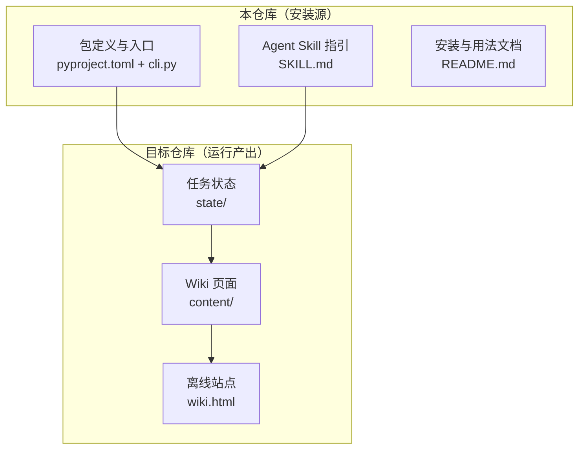
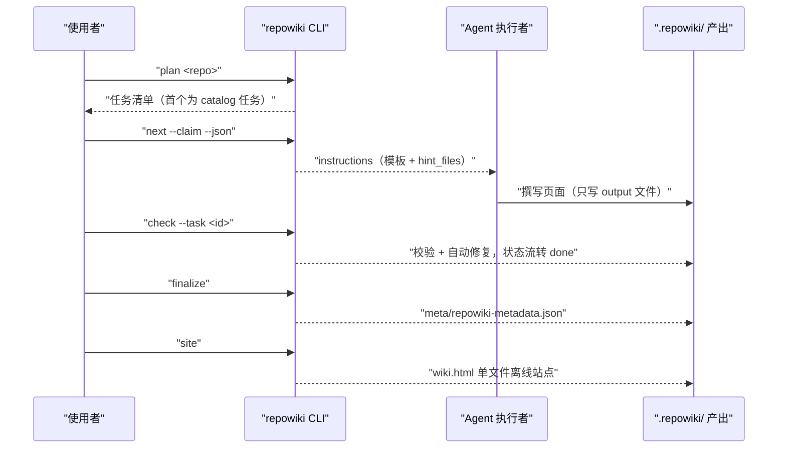
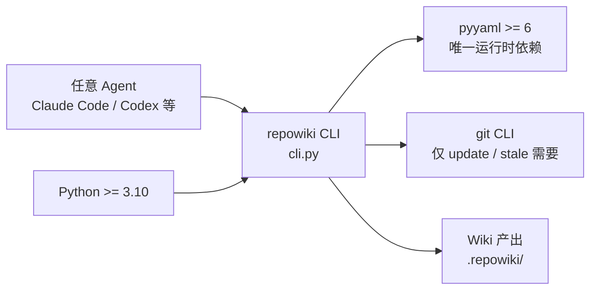

# 快速开始

## 目录
1. [简介](#简介)
2. [项目结构](#项目结构)
3. [核心组件](#核心组件)
4. [架构总览](#架构总览)
5. [详细组件分析](#详细组件分析)
6. [依赖关系分析](#依赖关系分析)
7. [性能与一致性考量](#性能与一致性考量)
8. [故障排查指南](#故障排查指南)
9. [结论](#结论)

## 简介

本页给出从零开始使用 repowiki 的最短路径：安装 CLI 与（可选的）Agent Skill，然后按 plan、next、check、finalize、site 五步主流程，为一个目标仓库生成第一个可双击打开的单文件离线 wiki 站点。repowiki 本身是一个确定性的任务编排器，负责任务规划、原子认领、产出校验与元数据组装；读代码、写 wiki 的智能工作由驱动它的任意 agent（Claude Code / Codex / OpenCode 等）或人完成，全程零 API Key、零网络调用。

## 项目结构

与「快速开始」相关的仓库组织如下：

- `pyproject.toml`：包定义，声明 Python ≥ 3.10 要求、唯一运行时依赖 `pyyaml>=6` 以及 `repowiki` 命令入口。
- `src/repowiki/cli.py`：命令行入口，定义 plan / next / touch / check / watch / release / finalize / site 等全部子命令与退出码。
- `src/repowiki/skills/repowiki/SKILL.md`：随包分发的 Agent Skill 指引，告诉 agent 按什么流程调用 CLI。
- `README.md`：面向人的安装文档（含离线安装）与用法说明。
- 目标仓库侧的产出目录 `.repowiki/`：`<locale>/content/` 存放 wiki 页面、`<locale>/meta/` 存放元数据、`<locale>/wiki.html` 是单文件离线站点、`state/` 存放可随时删除重规划的任务状态。

图表来源
- [pyproject.toml:39-46](file://pyproject.toml#L39-L46)
- [src/repowiki/cli.py:27-33](file://src/repowiki/cli.py#L27-L33)
- [README.md:135-148](file://README.md#L135-L148)

章节来源
- [README.md:62-74](file://README.md#L62-L74)
- [src/repowiki/skills/repowiki/SKILL.md:102-107](file://src/repowiki/skills/repowiki/SKILL.md#L102-L107)

## 核心组件

- repowiki CLI：确定性任务编排器，所有能力通过 `repowiki` 命令的子命令暴露，入口为 `repowiki.cli:main`。
- Agent Skill：随 CLI 一起分发的指引文件，只告诉 agent 按什么流程调用 CLI，真正干活的是 `repowiki` 命令本身。
- 五步主流程：plan（扫描并生成任务清单）→ next（领取任务）→ check（校验产出）→ finalize（组装元数据）→ site（生成离线站点）。
- Worker 循环契约：多个执行者并发参与的统一循环（next → 执行 → touch 心跳 → check），是页面任务并行加速的基础。

章节来源
- [pyproject.toml:39-40](file://pyproject.toml#L39-L40)
- [src/repowiki/cli.py:35-101](file://src/repowiki/cli.py#L35-L101)
- [src/repowiki/skills/repowiki/SKILL.md:25-45](file://src/repowiki/skills/repowiki/SKILL.md#L25-L45)
- [README.md:180-196](file://README.md#L180-L196)

## 架构总览

一次典型的首次运行是「人发起命令、agent 做智能工作、CLI 做确定性工作」的交替过程：plan 产出任务清单后，next 以原子认领方式发放任务并把内嵌模板的 instructions 交给 agent；agent 按规格只写指定的 output 文件；check 校验并自动修复确定性缺陷；全部任务完成后 finalize 组装元数据，site 渲染出单文件离线站点。

图表来源
- [src/repowiki/cli.py:35-101](file://src/repowiki/cli.py#L35-L101)
- [src/repowiki/skills/repowiki/SKILL.md:29-38](file://src/repowiki/skills/repowiki/SKILL.md#L29-L38)

章节来源
- [src/repowiki/skills/repowiki/SKILL.md:25-45](file://src/repowiki/skills/repowiki/SKILL.md#L25-L45)
- [README.md:124-133](file://README.md#L124-L133)

## 详细组件分析

### 第一步：安装 CLI

- 职责：让目标机器获得 `repowiki` 命令，这是唯一必装组件。
- 关键行为：在线环境用 `pip install git+https://github.com/luomsis/repowiki.git`（或 pipx 同 URL）；已克隆本仓库时在仓库内 `pip install -e .`。
- 实现要点：要求 Python ≥ 3.10，运行时依赖只有 `pyyaml>=6`；`repowiki` 命令由 pyproject 的 scripts 段映射到 `repowiki.cli:main`；macOS / Linux / Windows 原生支持，无需 WSL。

章节来源
- [README.md:62-74](file://README.md#L62-L74)
- [pyproject.toml:5-16](file://pyproject.toml#L5-L16)
- [pyproject.toml:39-40](file://pyproject.toml#L39-L40)

### 第二步：安装 Agent Skill（可选）

- 职责：让 agent 会话能自动识别并触发 repowiki 工作流；不装也能手动按 README 指引操作。
- 关键行为：装完 CLI 后执行 `repowiki skill install`（默认装入 `~/.agents/skills/repowiki/`），或用 `--agent claude --agent zcode` 等装入指定客户端的全局 skills 目录；`repowiki skill status` 查看已装版本与是否过期。
- 实现要点：`--agent` 支持 `claude` / `codex` / `zcode` / `cursor` / `opencode`；skill 已随 whl 打包，安装是纯本地拷贝、无任何在线操作；skill 只是指引文件，实际工作全部由第 1 步安装的 `repowiki` 命令完成。

章节来源
- [README.md:75-96](file://README.md#L75-L96)
- [src/repowiki/cli.py:145-165](file://src/repowiki/cli.py#L145-L165)

### 第三步：五步主流程生成第一个站点

- 职责：把「一个裸仓库」变成「一个可浏览的离线 wiki」的最短命令序列。
- 关键行为：
  - `repowiki plan <repo>`：扫描仓库并生成任务清单，产出语言自动跟随仓库（zh/en，`--locale` 可显式指定）；代码文件少于 10 个会被拒绝。
  - `repowiki next <repo> --claim --json`：原子领取一个就绪任务，返回的 `instructions` 字段内嵌完整撰写规格（输出路径、页面模板、hint_files 依赖文件）。
  - `repowiki check <repo> --task <id>`：校验产出；锚点、行号区间、H1 等确定性缺陷自动修复，只有语义缺陷才判失败；通过后任务流转 done。
  - `repowiki finalize <repo>`：全部任务 done 后组装 `meta/repowiki-metadata.json`；首次运行会先创建 overview 任务（退出码 3 属正常进展），执行完该任务再次运行即成功。
  - `repowiki site <repo>`：渲染出 `.repowiki/<locale>/wiki.html` 单文件离线站点（导航、搜索、mermaid、源码弹层全部内嵌），同时导出 `llms.txt` / `llms-full.txt` 供 agent 与 IDE 按索引消费。
- 实现要点：退出码约定为 0 成功、1 校验失败或用法错误、2 状态冲突（任务被他人认领）、3 进展性等待；`check` 必须显式带 `--task`（崩溃恢复用 `--all`），done 是终态。

章节来源
- [README.md:124-133](file://README.md#L124-L133)
- [src/repowiki/skills/repowiki/SKILL.md:29-41](file://src/repowiki/skills/repowiki/SKILL.md#L29-L41)
- [src/repowiki/cli.py:1-5](file://src/repowiki/cli.py#L1-L5)
- [README.md:225-244](file://README.md#L225-L244)

### 并发 worker 模式（可选加速）

- 职责：在大仓库上把逐页撰写工作并行化，缩短总时长。
- 关键行为：catalog 任务完成后所有页面任务相互独立、可安全并行；每个 worker 执行同一循环——`next --claim` 领任务、按 instructions 只写指定 output 文件、执行期定期 `touch --task` 心跳续期、完成后 `check`；`tasks` 为空且 busy>0 时等 30 秒重试，空且 busy=0 时退出。
- 实现要点：一次只持有一个认领（每次 next 只发放一个任务，当前任务 check 通过前不得再次 next）；认领默认 15 分钟未续期会被自动回收转给他人，因此长任务必须遵守 touch 纪律；check 报「由他人认领」冲突（退出码 2）时不争抢、不加 `--force`，直接回到 next。除 subagent 方式外，README 还给出无人值守的 `worker.sh` 脚本配方，可把 `claude -p` 换成任意 headless agent CLI。

章节来源
- [src/repowiki/skills/repowiki/SKILL.md:47-75](file://src/repowiki/skills/repowiki/SKILL.md#L47-L75)
- [README.md:180-196](file://README.md#L180-L196)
- [README.md:198-223](file://README.md#L198-L223)

## 依赖关系分析

- 运行时依赖：repowiki CLI 依赖 Python ≥ 3.10 与 `pyyaml>=6`，除此之外无任何第三方依赖，也无网络调用。
- 执行者依赖：CLI 本身不绑定任何 agent CLI；智能工作由驱动它的任意 agent（或人）完成。
- 可选外部依赖：`update` / `stale` 命令基于 git diff 工作，依赖目标仓库本地的 git CLI（`git diff` / `git rev-parse`），git 预装的机器无需额外配置。
- 产出依赖方向：site 渲染所需的 markdown/mermaid 库已内嵌进产物，浏览 wiki 端无需任何安装。

图表来源
- [pyproject.toml:5-16](file://pyproject.toml#L5-L16)
- [src/repowiki/cli.py:103-120](file://src/repowiki/cli.py#L103-L120)

章节来源
- [pyproject.toml:5-16](file://pyproject.toml#L5-L16)
- [README.md:98-122](file://README.md#L98-L122)
- [README.md:292](file://README.md#L292)

## 性能与一致性考量

- 断点续跑：每个任务的状态落盘于 `state/index.json`，随时中断随时继续，崩溃不留孤儿认领。
- 并发安全：认领通过原子 `mkdir` 完成，过期判定基于目录 mtime（默认 15 分钟，`REPOWIKI_STALE_SECONDS` 可调）；活认领靠 `touch` 心跳续期防止被误抢。
- 队列自愈：worker 崩溃或被杀后，过期认领由 `next` 自动回收重新入队（改名留痕、attempts 加一），无需人工释放。
- 并行安全性：页面之间零链接、任务规格自包含（内嵌完整模板与文风规范），因此页面任务可以完全并行而互不干扰；代价是每个任务规格较大（约 4-6k tokens）。
- 幂等重跑：finalize、update 或手动改页面之后可随时重跑 `repowiki site` 重建站点，产物可重复生成。

章节来源
- [README.md:260-275](file://README.md#L260-L275)
- [src/repowiki/skills/repowiki/SKILL.md:95-100](file://src/repowiki/skills/repowiki/SKILL.md#L95-L100)
- [README.md:167-176](file://README.md#L167-L176)
- [README.md:284-288](file://README.md#L284-L288)

## 故障排查指南

- 现象：`repowiki: command not found`。原因：CLI 未安装或不在 PATH。定位：`command -v repowiki`（PowerShell 用 `Get-Command repowiki`）；未装则执行 pip 安装并用 `repowiki --version` 验证。
- 现象：`plan` 拒绝执行。原因：目标仓库代码文件少于 10 个，属于有意设计的下限保护。定位：换更大的仓库，或确认扫对了目录。
- 现象：`check` 返回退出码 2。原因：任务已被其他活着的 worker 认领（状态冲突）。定位：不争抢、不加 `--force`，回到 `next` 领取其他任务；若确属自己的孤儿认领，用 `release --task <id> --force` 释放。
- 现象：`finalize` 返回退出码 3。原因：首次运行已创建 overview 任务，属正常进展。定位：按普通页面任务执行 overview 后再次运行 finalize。
- 现象：执行中的任务被回收转给他人。原因：认领超过 15 分钟未续期。定位：撰写期间每约 3 分钟执行一次 `repowiki touch --task <id>` 心跳；长任务尤其要遵守。
- 现象：离线机器装不上 CLI。原因：无法访问 PyPI / GitHub。定位：在有网机器上准备仓库源码（或 whl）与 `pyyaml` 的 wheel 三样物料，目标机 `pip install --no-index` 依次安装后 `repowiki --version` 验证。

章节来源
- [src/repowiki/skills/repowiki/SKILL.md:13-23](file://src/repowiki/skills/repowiki/SKILL.md#L13-L23)
- [src/repowiki/cli.py:170-183](file://src/repowiki/cli.py#L170-L183)
- [src/repowiki/skills/repowiki/SKILL.md:64-75](file://src/repowiki/skills/repowiki/SKILL.md#L64-L75)
- [README.md:98-122](file://README.md#L98-L122)
- [README.md:262-266](file://README.md#L262-L266)

## 结论

快速开始的核心就是「装一个 CLI、跑五条命令」：`pip install` 获得 `repowiki` 命令，`plan`、`next --claim`、`check`、`finalize`、`site` 依次执行，即可在目标仓库的 `.repowiki/<locale>/wiki.html` 得到第一个离线 wiki 站点。建议首次先串行跑通全流程熟悉产物形态，再按 Worker 循环契约引入并发 worker 加速大仓库；使用中注意保持 `touch` 心跳纪律、尊重退出码 2/3 的语义，避免与并发参与者争抢任务。

章节来源
- [README.md:124-133](file://README.md#L124-L133)
- [src/repowiki/skills/repowiki/SKILL.md:57-72](file://src/repowiki/skills/repowiki/SKILL.md#L57-L72)

<cite>
**本文引用的文件**
- [README.md](file://README.md)
- [SKILL.md](file://src/repowiki/skills/repowiki/SKILL.md)
- [pyproject.toml](file://pyproject.toml)
- [cli.py](file://src/repowiki/cli.py)
</cite>
