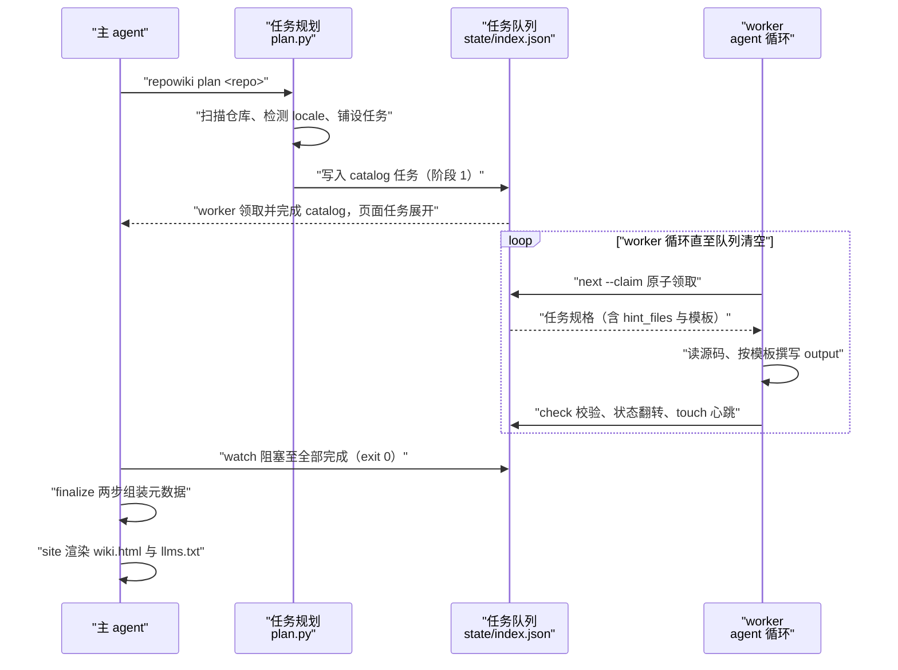
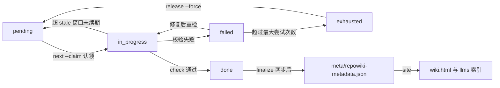

# 标准生成流程

## 目录
1. [简介](#简介)
2. [流程总览](#流程总览)
3. [关键步骤](#关键步骤)
4. [参与组件](#参与组件)
5. [数据与状态变化](#数据与状态变化)
6. [故障排查指南](#故障排查指南)
7. [结论](#结论)

## 简介

标准生成流程是 repowiki 把一个代码仓库变成结构化 Wiki 的完整编排路径：由 `repowiki plan` 触发，扫描仓库并铺设任务清单，随后经任务领取（`next --claim`）、agent 按规格撰写、校验（`check`）的循环推进，全部任务完成后由 `finalize` 组装元数据，最终以 `repowiki site` 产出单文件离线站点收尾。该流程定义于包内 skill 指引（SKILL.md）并由 CLI 各子命令实现，是 repowiki 作为「确定性编排器 + agent 执行者」这一协作模式的主干路径。

章节来源
- [src/repowiki/skills/repowiki/SKILL.md:8-11](file://src/repowiki/skills/repowiki/SKILL.md#L8-L11)
- [src/repowiki/skills/repowiki/SKILL.md:29-39](file://src/repowiki/skills/repowiki/SKILL.md#L29-L39)

## 流程总览

端到端路径为：`plan` 扫描仓库、确定产出语言并生成首个 catalog 任务 → 主 agent 执行 catalog 规划目录树，`plan` 据此展开全部页面任务 → worker 循环（`next --claim` 领取、按规格撰写、`check` 校验）消化任务队列，期间 `touch` 心跳续期、主 agent 以后台 `watch` 监控 → 队列清空后 `finalize` 组装元数据（首次运行会创建 overview 任务，需执行后再 finalize 一次）→ `site` 渲染单文件离线站点并导出 agent 索引。串行模式下同一循环顺序执行；并发模式下多个等价 worker 并行消费同一个全局 FIFO 队列，流程形状不变。

图表来源
- [src/repowiki/skills/repowiki/SKILL.md:29-39](file://src/repowiki/skills/repowiki/SKILL.md#L29-L39)
- [src/repowiki/skills/repowiki/SKILL.md:55-72](file://src/repowiki/skills/repowiki/SKILL.md#L55-L72)
- [src/repowiki/cli.py:35-53](file://src/repowiki/cli.py#L35-L53)

章节来源
- [src/repowiki/skills/repowiki/SKILL.md:25-45](file://src/repowiki/skills/repowiki/SKILL.md#L25-L45)
- [src/repowiki/cli.py:35-101](file://src/repowiki/cli.py#L35-L101)

## 关键步骤

### 步骤 1：plan——扫描仓库并铺设任务清单

- 输入：目标仓库路径与可选参数（`--locale`、`--max-pages`、`--knowledge`、`--replan`）。
- 处理：扫描器盘点仓库文件，代码文件数不足 10 个时拒绝生成；按「显式 `--locale` > 已持久化的 `state/locale` > README 加权自动检测」的顺序确定产出语言；已有 catalog 则展开为页面任务，否则添加 catalog 规划任务（阶段 1），`--knowledge` 时附加知识卡片任务集。
- 失败路径：仓库过小抛 `UsageError`（exit 1）；`--replan` 检测到 in_progress 任务或 index.json 不可解析时要求显式 `--force`，防止删除正在被写入的产物。

章节来源
- [src/repowiki/plan.py:38-60](file://src/repowiki/plan.py#L38-L60)
- [src/repowiki/plan.py:29-35](file://src/repowiki/plan.py#L29-L35)
- [src/repowiki/plan.py:41-53](file://src/repowiki/plan.py#L41-L53)
- [src/repowiki/plan.py:70-88](file://src/repowiki/plan.py#L70-L88)

### 步骤 2：next --claim——原子领取任务

- 输入：仓库路径与 worker 标识（`--worker`）。
- 处理：从就绪任务中按全局 FIFO 顺序原子认领一个任务并返回其规格（instructions 含 output 路径、页面模板、hint_files）；每次只发放一个任务，worker 当前任务完成前不得再次认领。
- 失败路径：队列为空时——若 busy>0 说明其他 worker 正在写，等待约 30 秒重试；若 busy=0 则全部完成，循环结束。

章节来源
- [src/repowiki/cli.py:48-53](file://src/repowiki/cli.py#L48-L53)
- [src/repowiki/skills/repowiki/SKILL.md:55-65](file://src/repowiki/skills/repowiki/SKILL.md#L55-L65)

### 步骤 3：按任务规格撰写页面

- 输入：任务规格（instructions）与 hint_files 列出的仓库源码。
- 处理：通读 hint_files 后严格按规格内嵌模板撰写页面（简体中文），写入规格指定的 output 路径；只写这一个文件，绝不改动仓库源码或其他 wiki 页面；认领后立即 `touch`，撰写期间每约 3 分钟续期一次，防止认领超过 stale 窗口（默认 15 分钟）被自动回收。
- 失败路径：认领被回收转给他人时，后续 `check` 会报「由他人认领」冲突（exit 2），worker 不争抢、不加 `--force`，回到领取循环。

章节来源
- [src/repowiki/skills/repowiki/SKILL.md:62-65](file://src/repowiki/skills/repowiki/SKILL.md#L62-L65)
- [src/repowiki/skills/repowiki/SKILL.md:102-107](file://src/repowiki/skills/repowiki/SKILL.md#L102-L107)
- [src/repowiki/cli.py:67-72](file://src/repowiki/cli.py#L67-L72)

### 步骤 4：check——校验产出并翻转状态

- 输入：任务 id 与 worker 标识（`check` 必须显式带 `--task`，崩溃恢复用 `--all`）。
- 处理：对产出做确定性校验，锚点、行号区间、H1 等确定性缺陷自动修复，只需按 errors 列表修复语义问题后重新 check；通过则任务翻转为 done（终态，重复 check 只读不改状态）。
- 失败路径：他人认领冲突返回 exit 2；校验失败返回 exit 1 并附 errors；同一任务修复重检最多 3 次，仍失败则 `release --force` 重置后放弃。

章节来源
- [src/repowiki/cli.py:55-65](file://src/repowiki/cli.py#L55-L65)
- [src/repowiki/skills/repowiki/SKILL.md:66-75](file://src/repowiki/skills/repowiki/SKILL.md#L66-L75)
- [src/repowiki/skills/repowiki/SKILL.md:102-107](file://src/repowiki/skills/repowiki/SKILL.md#L102-L107)

### 步骤 5：finalize——两步组装元数据

- 输入：全部任务处于 done 的任务清单。
- 处理：首次运行创建 overview 总览任务（退出码 3，属正常进展）；执行 overview 任务后再次运行 `finalize`，组装 `meta/repowiki-metadata.json` 并自动清理 state/claims 与 state/tasks（catalog/index 保留供增量更新）。
- 失败路径：仍有任务未完成时拒绝执行；损坏的 catalog.json 在 finalize 路径给出友好错误而非裸 traceback。

章节来源
- [src/repowiki/cli.py:90-93](file://src/repowiki/cli.py#L90-L93)
- [src/repowiki/skills/repowiki/SKILL.md:35-37](file://src/repowiki/skills/repowiki/SKILL.md#L35-L37)
- [src/repowiki/skills/repowiki/SKILL.md:74-75](file://src/repowiki/skills/repowiki/SKILL.md#L74-L75)

### 步骤 6：site——渲染单文件离线站点

- 输入：finalize 后的全部页面与元数据。
- 处理：把全部页面渲染为自包含的 `wiki.html`（内嵌 marked 与 mermaid 渲染库、源码弹层、搜索），同时导出 `llms.txt` 与 `llms-full.txt` 供 agent/IDE 按索引消费；幂等可重跑，`clean` 之后仍可从磁盘页面重建。
- 失败路径：站点构建依赖 finalize 产物，跳过 finalize 直接 site 会缺少导航所需的元数据；重跑 site 本身无副作用。

章节来源
- [src/repowiki/cli.py:95-101](file://src/repowiki/cli.py#L95-L101)
- [src/repowiki/skills/repowiki/SKILL.md:36-42](file://src/repowiki/skills/repowiki/SKILL.md#L36-L42)

## 参与组件

- `repowiki plan`（plan.py 的 run_plan）：扫描仓库、解析产出语言、铺设 catalog/页面/知识卡片任务，是流程唯一入口。
- `repowiki next`（dispatch 的 run_next，经 cli.py 注册）：全局 FIFO 原子认领，返回任务规格；`--worker` 记录认领者。
- `repowiki touch`：认领心跳，刷新认领时间戳防止 stale 回收。
- `repowiki check`：产出校验、确定性自动修复与状态翻转；`--all` 用于崩溃恢复。
- `repowiki release`：把 in_progress 任务退回 pending，`--force` 用于毒任务重置。
- `repowiki watch`：阻塞至全部任务完成或停滞/超时，exit 0 表示可 finalize，exit 1 表示需干预。
- `repowiki finalize`：组装元数据并瘦身状态目录。
- `repowiki site`：渲染离线站点与 llms 索引。
- SKILL.md：上述循环契约与硬性规则的权威文档，worker 与主 agent 均以其为准。

章节来源
- [src/repowiki/cli.py:35-143](file://src/repowiki/cli.py#L35-L143)
- [src/repowiki/skills/repowiki/SKILL.md:55-100](file://src/repowiki/skills/repowiki/SKILL.md#L55-L100)

## 数据与状态变化

流程的副作用集中在 `.repowiki/` 之下：`plan` 产出 `state/index.json` 任务清单与 `state/catalog.json` 目录树（首轮回合后）、持久化 `state/locale`；每个 worker 认领生成 claim 记录，撰写产出落在 `<locale>/content/` 页面文件；`check` 把任务状态从 in_progress 翻转为 done；`finalize` 生成 `<locale>/meta/repowiki-metadata.json` 并清理 state/claims 与 state/tasks；`site` 追加 `<locale>/wiki.html` 与 llms 索引。任务本体是一个带自愈的状态机：pending 经原子认领进入 in_progress，校验通过到 done；校验失败记 failed 可修复重检；尝试超限转 exhausted 需强制重置；认领过期自动回队列。

图表来源
- [src/repowiki/skills/repowiki/SKILL.md:59-72](file://src/repowiki/skills/repowiki/SKILL.md#L59-L72)
- [src/repowiki/skills/repowiki/SKILL.md:95-100](file://src/repowiki/skills/repowiki/SKILL.md#L95-L100)
- [src/repowiki/skills/repowiki/SKILL.md:35-42](file://src/repowiki/skills/repowiki/SKILL.md#L35-L42)

章节来源
- [src/repowiki/skills/repowiki/SKILL.md:55-107](file://src/repowiki/skills/repowiki/SKILL.md#L55-L107)
- [src/repowiki/plan.py:90-103](file://src/repowiki/plan.py#L90-L103)

## 故障排查指南

- `next` 返回空但流程未结束：`busy>0` 表示其他 worker 正在写，等待约 30 秒重试；`busy=0` 表示队列确实清空，应进入 finalize 阶段。
- `check` 报「由他人认领」冲突（exit 2）：该认领已因过期被回收并被其他 worker 接手，不争抢、不加 `--force`，直接回到领取循环。
- `check` 反复失败（exit 1）：按 errors 修复同一文件后重检，最多 3 次；仍失败说明任务规格与产出存在持续语义冲突，用 `release --task <id> --force` 重置并放弃该轮。
- `watch` 以 exit 1 退出（停滞或超时）：用 `repowiki status` 查看详情；stale 认领会自动回队列，重点确认 worker 是否存活，必要时补派；exhausted 毒任务用 `release --force` 重置。注意前台 shell 超时杀掉的 watch 退出码不可信，存疑时用 status 核实。
- `finalize` 退出码 3：并非错误——首次运行创建 overview 任务，执行该任务后再次 finalize 即可。
- `plan --replan` 拒绝执行：存在 in_progress 任务或 index.json 不可解析；确认放弃恢复才加 `--force`，否则先让队列跑完。
- 命令异常退出：CLI 的统一退出码语义为 0 成功、1 校验失败/用法错误/状态损坏、2 状态冲突（他人认领），按退出码分流处理。

章节来源
- [src/repowiki/cli.py:1-5](file://src/repowiki/cli.py#L1-L5)
- [src/repowiki/cli.py:170-183](file://src/repowiki/cli.py#L170-L183)
- [src/repowiki/skills/repowiki/SKILL.md:59-72](file://src/repowiki/skills/repowiki/SKILL.md#L59-L72)
- [src/repowiki/skills/repowiki/SKILL.md:77-100](file://src/repowiki/skills/repowiki/SKILL.md#L77-L100)
- [src/repowiki/plan.py:41-53](file://src/repowiki/plan.py#L41-L53)

## 结论

标准生成流程以 `plan` 为唯一入口、`site` 为终点，中间由「领取、撰写、校验」的 worker 循环消化确定性任务队列，`finalize` 两步收口元数据；退出码 0/1/2/3 各有明确语义，watch 与 touch 保障并发场景的可观测与自愈。使用时的注意点：worker 必须遵守一次只持有一个认领与心跳续期的契约，finalize 前确认队列清空，`--force` 类参数只在理解后果时使用；增量维护场景可在此流程之上叠加 `update`/`stale`，但首次建站应完整走一遍标准串行或并发路径。

章节来源
- [src/repowiki/skills/repowiki/SKILL.md:29-45](file://src/repowiki/skills/repowiki/SKILL.md#L29-L45)
- [src/repowiki/cli.py:35-101](file://src/repowiki/cli.py#L35-L101)

<cite>
**本文引用的文件**
- [src/repowiki/cli.py](file://src/repowiki/cli.py)
- [src/repowiki/plan.py](file://src/repowiki/plan.py)
- [src/repowiki/skills/repowiki/SKILL.md](file://src/repowiki/skills/repowiki/SKILL.md)
</cite>
