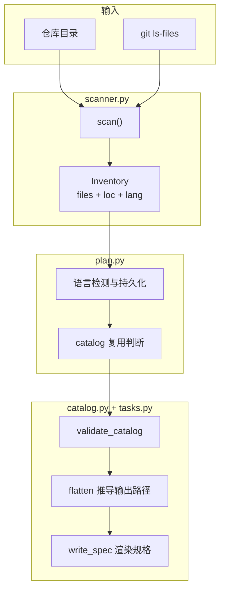
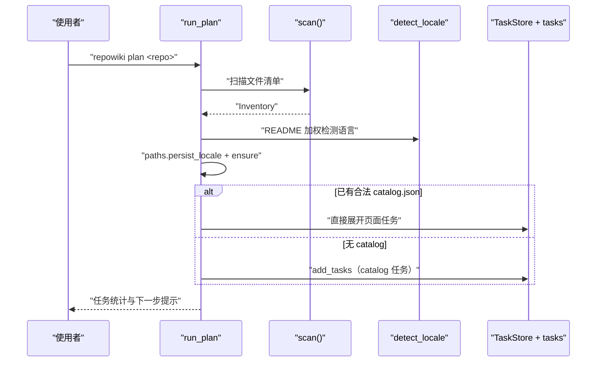
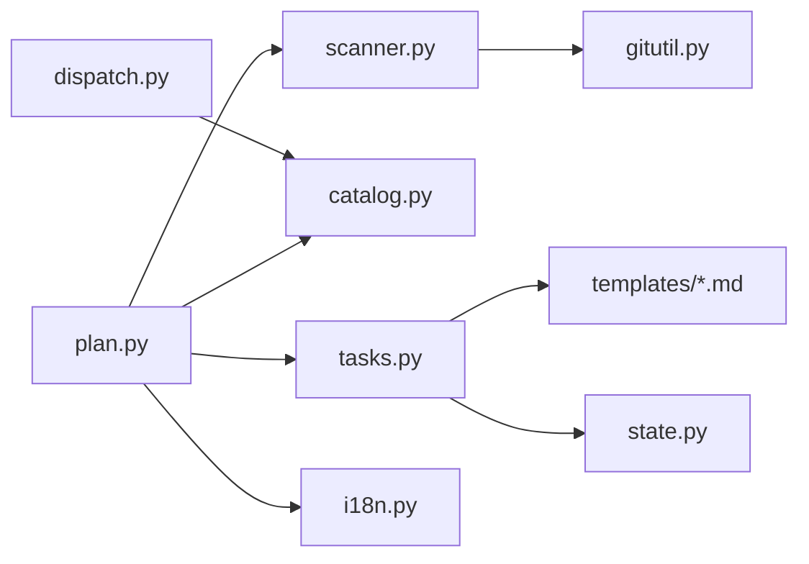

# 仓库扫描与任务规划

<cite>
**本文引用的文件**
- [src/repowiki/scanner.py](file://src/repowiki/scanner.py)
- [src/repowiki/plan.py](file://src/repowiki/plan.py)
- [src/repowiki/catalog.py](file://src/repowiki/catalog.py)
- [src/repowiki/tasks.py](file://src/repowiki/tasks.py)
- [src/repowiki/i18n.py](file://src/repowiki/i18n.py)
</cite>

## 目录
1. [简介](#简介)
2. [项目结构](#项目结构)
3. [核心组件](#核心组件)
4. [架构总览](#架构总览)
5. [详细组件分析](#详细组件分析)
6. [依赖关系分析](#依赖关系分析)
7. [性能与一致性考量](#性能与一致性考量)
8. [故障排查指南](#故障排查指南)
9. [结论](#结论)

## 简介
本页覆盖规划层的完整链路：`scanner.py` 把仓库变成一份带语言与行数标注的文件清单，`plan.py` 决定发放什么任务，`catalog.py` 校验 agent 规划的章节树并推导每页的输出路径，`tasks.py` 把节点渲染成内嵌模板与文风规范的自包含规格，`i18n.py` 决定产出语言。规划层的产出质量决定了后续所有页面任务能否正确并行，因此这里的每一步都是确定性代码。

章节来源
- [src/repowiki/scanner.py:1-6](file://src/repowiki/scanner.py#L1-L6)
- [src/repowiki/plan.py:1-17](file://src/repowiki/plan.py#L1-L17)

## 项目结构
规划层由五个模块组成，输入是仓库目录，输出是 `state/` 下的任务账本与规格文件：

- `src/repowiki/scanner.py`：`scan()` 返回 Inventory，处理 git/遍历两种文件来源。
- `src/repowiki/gitutil.py`：git 子进程的统一封装，失败一律返回 None。
- `src/repowiki/plan.py`：`run_plan` 编排扫描、语言检测、catalog 复用与任务创建。
- `src/repowiki/catalog.py`：schema 校验、flatten、输出路径推导三件事。
- `src/repowiki/tasks.py`：catalog/page/overview/update/knowledge 各类任务的规格构建器。

图表来源
- [src/repowiki/scanner.py:116-147](file://src/repowiki/scanner.py#L116-L147)
- [src/repowiki/plan.py:53-88](file://src/repowiki/plan.py#L53-L88)

章节来源
- [src/repowiki/scanner.py:54-72](file://src/repowiki/scanner.py#L54-L72)

## 核心组件
- Inventory：`files`（每个文件的路径、行数、语言、是否代码）、`key_files`、`tree_summary`、`code_file_count` 的聚合结构。
- CODE_EXTS 与 IGNORE_DIRS：判定「代码文件」的扩展名表与扫描时跳过的目录表。
- detect_locale：README 权重最高的 zh/en 自动检测，纯文本统计、零网络。
- FlatNode：flatten 后的节点，携带最终输出路径 `output` 与章节路径。
- 任务规格模板：`templates/<locale>/*.md`，经 `templates.render_file` 填充变量后写入 `state/tasks/`。

章节来源
- [src/repowiki/scanner.py:16-51](file://src/repowiki/scanner.py#L16-L51)
- [src/repowiki/i18n.py:111-133](file://src/repowiki/i18n.py#L111-L133)

## 架构总览
`plan` 命令的一次执行是五步串行：扫描、定语言、复用或新建 catalog、落任务、报告。语言必须在创建目录前确定，因为它决定 `<locale>/content` 的目录名：

图表来源
- [src/repowiki/plan.py:53-88](file://src/repowiki/plan.py#L53-L88)
- [src/repowiki/i18n.py:111-133](file://src/repowiki/i18n.py#L111-L133)

章节来源
- [src/repowiki/plan.py:37-56](file://src/repowiki/plan.py#L37-L56)

## 详细组件分析
### 仓库扫描 scanner.scan
- 职责：产出规划所需的完整文件清单。
- 关键行为：有 `.git` 时用 `git ls-files -z`（准确遵循 .gitignore），失败或无 git 时手工遍历并跳过 IGNORE_DIRS；读文件头 8KB 探测二进制；统计行数（超过 2MB 只列出不计数）。
- 实现要点：tree_summary 是给 agent 看的压缩视图，每目录最多 20 项、全局 400 行封顶。

章节来源
- [src/repowiki/scanner.py:74-115](file://src/repowiki/scanner.py#L74-L115)
- [src/repowiki/scanner.py:150-170](file://src/repowiki/scanner.py#L150-L170)

### catalog 校验与 flatten
- 职责：作为「什么是合法章节树」的唯一事实来源。
- 关键行为：校验 id/title/slug 全局唯一、深度不超 4、kind 合法、page 无 children、page_brief 非空；dependent_files 引用不存在的路径时剔除并告警（不判失败）。
- 实现要点：flatten 为每个节点推导输出路径——章节得到同名目录与索引页，根级页面落在 content 根，兄弟重名自动加后缀。

章节来源
- [src/repowiki/catalog.py:42-121](file://src/repowiki/catalog.py#L42-L121)
- [src/repowiki/catalog.py:124-164](file://src/repowiki/catalog.py#L124-L164)

### 任务规格生成
- 职责：把 catalog 节点变成 worker 可独立执行的规格文件。
- 关键行为：page 规格内嵌 hint 清单、章节路径、姊妹页标题（只列名禁止链接）、完整页面模板与 STYLE；catalog/overview/knowledge/update 各有专属模板。
- 实现要点：标题在渲染期就替换进模板，避免 agent 忘记替换占位符；YAML 列表对特殊首字符加引号防解析歧义。

章节来源
- [src/repowiki/tasks.py:22-56](file://src/repowiki/tasks.py#L22-L56)
- [src/repowiki/tasks.py:83-111](file://src/repowiki/tasks.py#L83-L111)
- [DECISIONS.md:12-13](file://DECISIONS.md#L12-L13)

### 语言检测与持久化
- 职责：让产出语言自动跟随目标仓库，且全流程一致。
- 关键行为：README 中 CJK 占比不低于 15% 且文本量足够时直接判 zh，否则看源码样本是否有成段中文注释；显式 `--locale` 永远优先，结果持久化到 `state/locale`。
- 实现要点：代码标识符必然是拉丁字母，因此不参与 README 信号，避免稀释文档语言判断。

章节来源
- [src/repowiki/i18n.py:85-98](file://src/repowiki/i18n.py#L85-L98)
- [src/repowiki/i18n.py:111-133](file://src/repowiki/i18n.py#L111-L133)
- [src/repowiki/plan.py:28-35](file://src/repowiki/plan.py#L28-L35)

**章节来源**
- [src/repowiki/tasks.py:1-18](file://src/repowiki/tasks.py#L1-L18)

## 依赖关系分析
- scanner 依赖 gitutil 调用 git，git 不可用时静默退化为遍历，规划流程永不因 git 缺失而中断。
- plan 依赖 catalog 的 validate 与 flatten、tasks 的构建器、i18n 的语言表，是规划层的组装点。
- tasks 生成的规格内容来自 templates 目录，模板本身不入版本控制的渲染产物写在 `state/tasks/`。
- 校验器（validate/dispatch）反向依赖 catalog 的同一套规则，保证「规划时合法」与「check 时合法」标准一致。

图表来源
- [src/repowiki/plan.py:9-15](file://src/repowiki/plan.py#L9-L15)
- [src/repowiki/gitutil.py:13-19](file://src/repowiki/gitutil.py#L13-L19)

章节来源
- [src/repowiki/gitutil.py:1-6](file://src/repowiki/gitutil.py#L1-L6)

## 性能与一致性考量
- 扫描只读文件头与行数，不解析内容，几千文件的仓库也在亚秒级完成。
- 清单上限：规格内嵌文件清单截断至 800 条，防止超大仓库把规格撑爆。
- 幂等性：catalog.json 已存在且合法时 `plan` 不再重建 catalog 任务，直接展开页面任务；`--replan` 才清空重来，且检测到 in_progress 任务时要求 `--force`。
- 语言持久化避免了后续命令再次检测带来的不一致；中途换语言必须 `plan --replan`。

章节来源
- [src/repowiki/tasks.py:19](file://src/repowiki/tasks.py#L19-L19)
- [src/repowiki/plan.py:40-66](file://src/repowiki/plan.py#L40-L66)
- [README.md:211-213](file://README.md#L211-L213)

## 故障排查指南
- `plan` 报「仓库太小」：代码文件数低于 10（MIN_CODE_FILES），这是有意的产品门槛而非 bug。
- catalog check 报 title/id/slug 重复：全局唯一性是硬规则，改 catalog.json 后重新 check。
- dependent_files 被剔除的告警：引用了清单外路径，多半是路径拼写或大小写错误，已剔除的文件不会出现在 hint 里。
- 产出语言不符合预期：检查 README 的语言构成，或用 `plan --locale zh|en` 显式指定；已持久化的语言要 replan 才能更改。
- replan 被拒绝：有任务执行中或 index.json 损坏，确认后加 `--force`。

章节来源
- [src/repowiki/plan.py:16-17](file://src/repowiki/plan.py#L16-L17)
- [src/repowiki/plan.py:40-52](file://src/repowiki/plan.py#L40-L52)
- [src/repowiki/catalog.py:60-116](file://src/repowiki/catalog.py#L60-L116)

## 结论
规划层的价值在于把「理解仓库」这个开放问题压缩成一个受 schema 约束的 JSON（catalog.json），其余一切——路径、规格、语言、任务顺序——都由确定性代码推导。这保证了任何 agent 的规划质量波动都被限制在「章节划分好不好」这一件事上，不会波及流程正确性。

章节来源
- [src/repowiki/plan.py:37-110](file://src/repowiki/plan.py#L37-L110)
- [src/repowiki/catalog.py:1-18](file://src/repowiki/catalog.py#L1-L18)
