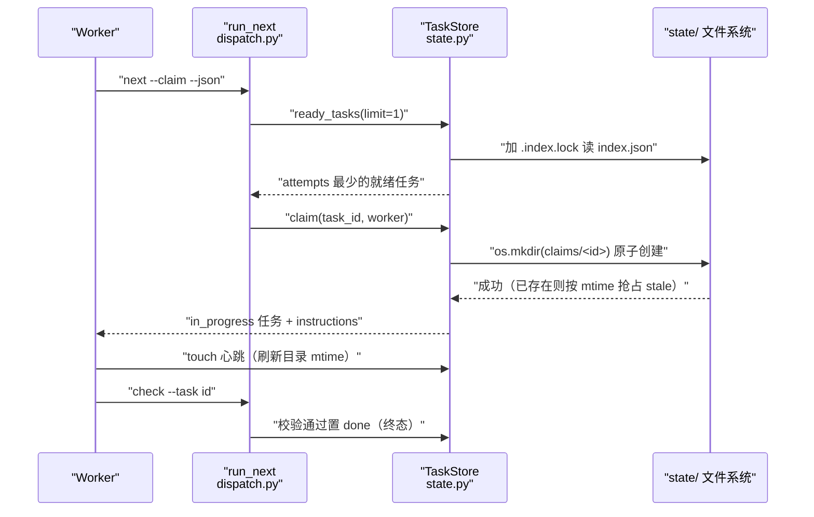
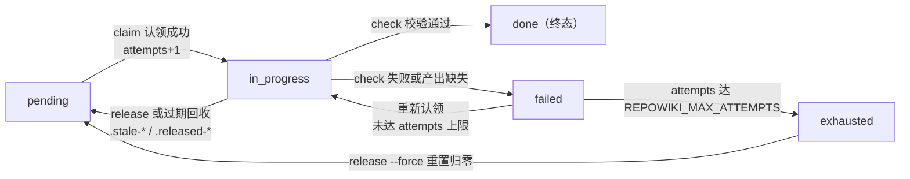

# 任务状态机与并发控制

## 目录
1. [简介](#简介)
2. [流程总览](#流程总览)
3. [关键步骤](#关键步骤)
4. [参与组件](#参与组件)
5. [数据与状态变化](#数据与状态变化)
6. [故障排查指南](#故障排查指南)
7. [结论](#结论)

## 简介

本页描述 repowiki 的任务状态机与并发控制流程：一个任务从 plan / catalog 展开时以 pending 状态写入 `state/index.json` 起，到 worker 领取（claim）进入 in_progress、校验通过置 done 终态止，中间经历心跳续期、过期回收、failed 重试与 exhausted 毒任务重置。该流程由 src/repowiki/state.py 提供状态机与并发原语（原子 mkdir 认领、文件锁事务、mtime 过期判定），由 src/repowiki/dispatch.py 提供命令编排（next / touch / check / release / status / watch），错误词汇与退出码映射定义在 src/repowiki/errors.py。

## 流程总览

端到端路径为：plan 或 catalog 校验通过后把任务以 pending 写入队列 → worker 执行 `next --claim`，ready_tasks 在当前开放阶段按 attempts 升序挑出一个任务 → claim 用 `os.mkdir` 原子创建 `claims/<id>/` 完成独占，任务翻为 in_progress 且 attempts 加一 → worker 撰写期间定期 touch 心跳刷新认领目录 mtime → worker 执行 `check`，校验通过置 done（终态），失败置 failed 等待重试，重试次数达 `REPOWIKI_MAX_ATTEMPTS` 后成为 exhausted 毒任务，需 `release --force` 显式重置。整个循环中，过期认领由 next 自动回收，无需人工干预。

图表来源
- [src/repowiki/state.py:294-308](file://src/repowiki/state.py#L294-L308)
- [src/repowiki/dispatch.py:50-76](file://src/repowiki/dispatch.py#L50-L76)

章节来源
- [src/repowiki/state.py:1-6](file://src/repowiki/state.py#L1-L6)
- [src/repowiki/dispatch.py:1-6](file://src/repowiki/dispatch.py#L1-L6)

## 关键步骤

### 步骤 1：任务入队（pending）

- 输入：plan 扫描产出的任务记录，或 catalog / knowledge_plan 校验通过后展开的页面任务（`new_task` 构造：status 为 pending、attempts 为 0）。
- 处理：`add_tasks` 在事务内插入新任务（已存在的 id 跳过）；index.json 的读改写由 `_transaction` 串行化——先取 `state/.index.lock` 进程级独占锁（POSIX 用 fcntl、Windows 用 msvcrt），读旧值、变异、再以临时文件加 `os.replace` 原子落盘。
- 失败路径：index.json JSON 损坏时抛 StateError，文件原样保留并提示手工修复或 `plan --replan --force`，绝不静默当作空清单（否则下一次读改写会只写被触碰的任务、清空整个计划）。

章节来源
- [src/repowiki/state.py:76-90](file://src/repowiki/state.py#L76-L90)
- [src/repowiki/state.py:118-142](file://src/repowiki/state.py#L118-L142)
- [src/repowiki/state.py:144-185](file://src/repowiki/state.py#L144-L185)
- [src/repowiki/dispatch.py:413-419](file://src/repowiki/dispatch.py#L413-L419)

### 步骤 2：就绪筛选与阶段门控（ready_tasks）

- 输入：index.json 中的全量任务。
- 处理：`current_phase` 取所有未完成任务的最小 phase，实现目录规划 → 页面 → 总览的阶段门控；ready 集合包含当前阶段的 pending 与 failed 任务（failed 且 attempts 达上限者除外），以及认领已过期的 in_progress 任务（死 worker 的回收通道）；排序键为 (attempts, phase, 插入顺序) 升序，失败任务不插队，避免坏任务拖死 worker。
- 失败路径：当前阶段无任何可领取任务时返回空列表；`next` 的返回体以 busy 字段（活跃 in_progress 数，排除 stale）告知 worker「空且 busy>0 应等待重试」。

章节来源
- [src/repowiki/state.py:213-243](file://src/repowiki/state.py#L213-L243)
- [src/repowiki/state.py:385-418](file://src/repowiki/state.py#L385-L418)
- [src/repowiki/dispatch.py:79-88](file://src/repowiki/dispatch.py#L79-L88)

### 步骤 3：原子认领（claim）

- 输入：就绪任务 id 与 worker 名（未指定时以 `主机名:pid` 生成）。
- 处理：`_try_mkdir_claim` 用 `os.mkdir` 原子创建 `claims/<id>/`——目录已存在说明有人持有；若该认领已过期（目录 mtime 距今达到 stale 窗口，默认 900 秒，`REPOWIKI_STALE_SECONDS` 可调），则把旧目录改名为 `.stale-<id>-<随机串>` 留痕后重试抢占（最多三轮，改名只有一个竞速者能成功）；mkdir 成功后写入 worker 与 ts 文件，任务更新为 in_progress、记录 claimed_at / heartbeat_at、attempts 加一。
- 失败路径：认领被他人活跃持有时抛 ConflictError（`run_next` 的认领循环将其静默吞掉——输掉竞速的 worker 下次 next 会重新挑选）；对 done 任务认领同样抛 ConflictError。

章节来源
- [src/repowiki/state.py:21](file://src/repowiki/state.py#L21)
- [src/repowiki/state.py:247-308](file://src/repowiki/state.py#L247-L308)
- [src/repowiki/dispatch.py:31-32](file://src/repowiki/dispatch.py#L31-L32)
- [src/repowiki/dispatch.py:56-62](file://src/repowiki/dispatch.py#L56-L62)

### 步骤 4：心跳续期（touch / heartbeat）

- 输入：任务 id 与可选 worker 名（`run_touch` 命令入口）。
- 处理：`heartbeat` 重写 `claims/<id>/ts` 并用 `os.utime` 刷新认领目录自身的 mtime——目录 mtime 是过期判定的唯一依据（ts 文件在 mkdir 之后才写，若以它为据，新建认领会被误判为无限旧而遭抢占）；同时把 heartbeat_at 合并进 index.json。`touch` 额外校验任务必须处于 in_progress、且 worker 名与认领目录记录的持有者一致。
- 失败路径：任务不在执行中（如已 done/failed）或被他人认领时抛 ConflictError；这是 worker 需在 check 冲突（退出码 2）后放弃当前认领的信号。

章节来源
- [src/repowiki/state.py:250-267](file://src/repowiki/state.py#L250-L267)
- [src/repowiki/state.py:343-367](file://src/repowiki/state.py#L343-L367)
- [src/repowiki/dispatch.py:119-124](file://src/repowiki/dispatch.py#L119-L124)

### 步骤 5：校验与状态翻转（check）

- 输入：任务 id（或 --all 崩溃恢复模式）与对应产出文件。
- 处理：先做认领归属守卫——目标任务是 in_progress 且认领目录记录的持有者与 --worker 不同则拒绝翻转（确要代为校验需 --force）；done 是终态，重复 check 走只读报告路径（规格可能已被清理，绝不翻状态，否则任务变成无规格可执行）；`_check_one` 按任务类型校验产出，确定性缺陷（锚点/行号/H1）自动修复后回写文件，res.ok 为真置 done，否则置 failed；对 in_progress 任务的校验顺带 heartbeat 续期；catalog / knowledge_plan 通过后自动展开后续任务集。
- 失败路径：输出文件不存在直接置 failed；failed 任务再次被认领时 attempts 已在上次 claim 时加一，达到 `REPOWIKI_MAX_ATTEMPTS`（默认 3）后不再进入 ready 集合，成为 exhausted。

章节来源
- [src/repowiki/dispatch.py:205-262](file://src/repowiki/dispatch.py#L205-L262)
- [src/repowiki/dispatch.py:318-370](file://src/repowiki/dispatch.py#L318-L370)
- [src/repowiki/dispatch.py:382-410](file://src/repowiki/dispatch.py#L382-L410)

### 步骤 6：释放与毒任务重置（release）

- 输入：任务 id 与 --force 开关（崩溃恢复场景）。
- 处理：对 in_progress 任务释放时，若认领目录记录的持有者与 index 中 worker 不一致则要求 --force；释放把认领目录改名为 `.released-<id>-<随机串>` 并把任务重置回 pending（清空 worker / claimed_at / heartbeat_at）。对 exhausted 毒任务（failed 且 attempts 达上限），不加 --force 会抛 ConflictError，加 --force 则重置为 pending 且 attempts 归零，这是唯一的人工重置通道。
- 失败路径：对非 in_progress 且非 exhausted 的任务调用释放会抛 ConflictError（「状态为 xx，无需释放」）。

章节来源
- [src/repowiki/state.py:310-341](file://src/repowiki/state.py#L310-L341)
- [src/repowiki/dispatch.py:91-96](file://src/repowiki/dispatch.py#L91-L96)

## 参与组件

- TaskStore（src/repowiki/state.py）：状态机与并发原语的唯一实现——锁事务、原子认领、mtime 过期判定、心跳、释放、统计；并发安全的根基是「每个任务一个认领目录的 `os.mkdir` 原子性」与「index.json 只合并被触碰任务条目以缩小读改写窗口」。
- `_exclusive_lock` 与 `_retry_windows_fs`（src/repowiki/state.py）：跨平台文件锁（fcntl / msvcrt，均为标准库）与 Windows 下 os.replace 竞态窗口的短暂重试；msvcrt 的 LK_LOCK 约 10 秒未获锁时抛 StateError。
- `run_next`（src/repowiki/dispatch.py）：队列唯一出口——FIFO 拉取、一次只发放一个任务（worker 契约：一次只持有一个认领），返回体带 instructions 与 busy 信号。
- `run_touch` / `run_release` / `run_status`（src/repowiki/dispatch.py）：心跳续期、认领释放与进度观测的命令入口；status 汇总 failed / exhausted / stale 认领清单。
- `run_check`（src/repowiki/dispatch.py）：循环的心脏——校验产出、自动修复、翻转状态、展开后续任务；`run_watch` 依赖同一套统计做停滞判定（过期认领不计入 in_flight，worker 全部死亡时停滞能被及时报告而非干等超时）。
- errors.py（src/repowiki/errors.py）：错误词汇表——ConflictError 映射退出码 2，StateError 与 UsageError 映射退出码 1（映射实现在 cli.main）；刻意放在叶子模块，使各命令模块引用它时不产生反向导入。

章节来源
- [src/repowiki/state.py:1-6](file://src/repowiki/state.py#L1-L6)
- [src/repowiki/state.py:35-73](file://src/repowiki/state.py#L35-L73)
- [src/repowiki/dispatch.py:50-76](file://src/repowiki/dispatch.py#L50-L76)
- [src/repowiki/dispatch.py:99-200](file://src/repowiki/dispatch.py#L99-L200)
- [src/repowiki/errors.py:1-7](file://src/repowiki/errors.py#L1-L7)

## 数据与状态变化

流程的持久化副作用集中在两处：`state/index.json` 中任务条目的字段变化（status、worker、claimed_at、heartbeat_at、attempts），以及 `state/claims/` 下认领目录的生灭（创建、改名 `.stale-*` 留痕、改名 `.released-*` 释放）；finalize 成功后 `cleanup_runtime` 会清除 claims 与 tasks 规格目录，保留 index/catalog 供增量更新。busy 与 watch 的 in_flight 统计都排除过期认领，保证「执行中」只反映真实存活的 worker。状态迁移如下：

图表来源
- [src/repowiki/state.py:219-243](file://src/repowiki/state.py#L219-L243)
- [src/repowiki/state.py:294-341](file://src/repowiki/state.py#L294-L341)
- [src/repowiki/dispatch.py:356-360](file://src/repowiki/dispatch.py#L356-L360)

章节来源
- [src/repowiki/state.py:24-28](file://src/repowiki/state.py#L24-L28)
- [src/repowiki/state.py:369-380](file://src/repowiki/state.py#L369-L380)
- [src/repowiki/state.py:385-418](file://src/repowiki/state.py#L385-L418)
- [src/repowiki/dispatch.py:145-200](file://src/repowiki/dispatch.py#L145-L200)

## 故障排查指南

- `next` 领不到任务但确认存在未完成任务：多为阶段门控生效——ready 只发放当前开放阶段的任务；用 `repowiki status` 查看 current_phase 与各状态计数，等待前置阶段完成（src/repowiki/state.py:213-243）。
- `check` 报「任务由某 worker 认领；如确要代为校验请加 --force」：认领归属守卫命中，说明该任务当前由其他 worker 持有；若是自己的任务，检查 --worker 名是否一致（src/repowiki/dispatch.py:229-241）。
- `touch` 报 ConflictError「状态为 xx，无需续期」或「由某某认领，不是本 worker」：任务已不在自己手中（已翻转或被过期回收后他人接手）；按 worker 契约应停止当前任务、回到 next（src/repowiki/state.py:353-367）。
- 报「state/.index.lock 被其他进程长期占用（约 10 秒未获得锁）」：Windows msvcrt 锁等待超时，确认持有锁的 repowiki 进程已退出后重试（src/repowiki/state.py:64-71）。
- 报「state/index.json 损坏」：StateError 数据保护路径，文件已原样保留；手工修复该文件，或确认无需恢复后 `plan --replan --force` 重来（src/repowiki/state.py:126-133）。
- watch 报「停滞：剩余任务未完成，但无执行中且无可领取任务」：通常是 exhausted 毒任务堵住队列；`repowiki status` 查看 exhausted 清单，逐个 `release --task <id> --force` 重置（src/repowiki/dispatch.py:179-192；src/repowiki/state.py:313-323）。
- Windows 下偶发 PermissionError：os.replace 与并发读打开的亚毫秒竞态，`_retry_windows_fs` 已内置最多 20 次、每次 50ms 的重试，出现即说明并发极高，无需处理（src/repowiki/state.py:35-49）。

章节来源
- [src/repowiki/state.py:35-49](file://src/repowiki/state.py#L35-L49)
- [src/repowiki/state.py:126-133](file://src/repowiki/state.py#L126-L133)
- [src/repowiki/state.py:313-323](file://src/repowiki/state.py#L313-L323)
- [src/repowiki/state.py:353-367](file://src/repowiki/state.py#L353-L367)
- [src/repowiki/dispatch.py:179-192](file://src/repowiki/dispatch.py#L179-L192)
- [src/repowiki/dispatch.py:229-241](file://src/repowiki/dispatch.py#L229-L241)

## 结论

任务状态机以「单一 index.json + 每任务一个原子 mkdir 认领目录」为基座，用 fcntl / msvcrt 文件锁串行化读改写、用认领目录 mtime 作为过期与存活的唯一信号，实现了多 worker 并发下的无锁队列：pending 经认领进入 in_progress，check 通过翻 done 终态，失败重试至 exhausted 后由 release --force 人工重置。正确使用方式是遵守 worker 契约——一次只持有一个认领、撰写期定期 touch、check 冲突（退出码 2）不争抢；done 是终态不应重复翻转，exhausted 毒任务必须显式 --force 才会回到队列。

章节来源
- [src/repowiki/state.py:1-6](file://src/repowiki/state.py#L1-L6)
- [src/repowiki/state.py:294-341](file://src/repowiki/state.py#L294-L341)
- [src/repowiki/dispatch.py:50-76](file://src/repowiki/dispatch.py#L50-L76)

<cite>
**本文引用的文件**
- [state.py](file://src/repowiki/state.py)
- [dispatch.py](file://src/repowiki/dispatch.py)
- [errors.py](file://src/repowiki/errors.py)
</cite>
