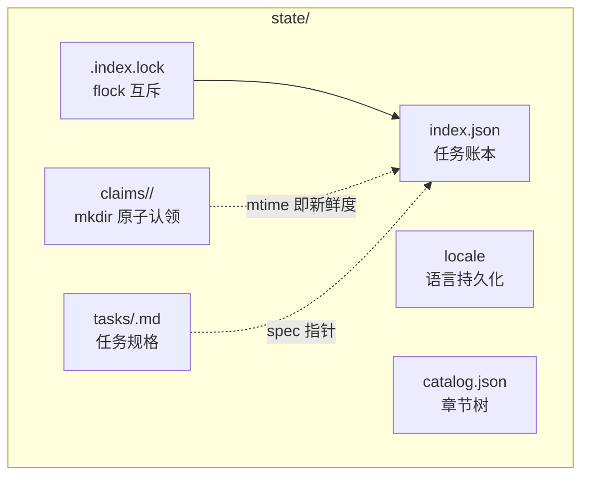
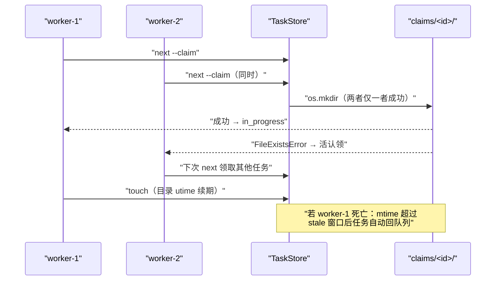
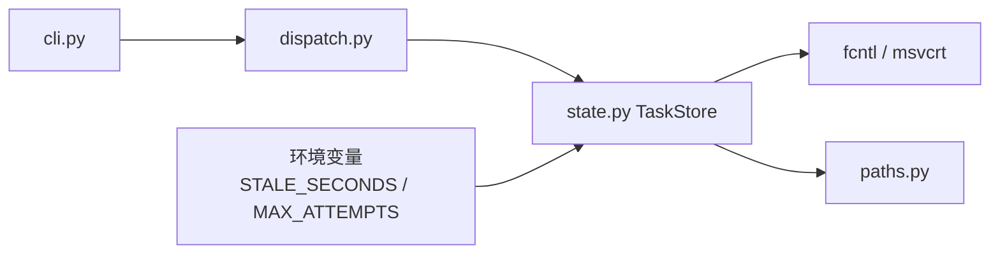

# 任务状态机与并发认领

<cite>
**本文引用的文件**
- [src/repowiki/state.py](file://src/repowiki/state.py)
- [src/repowiki/dispatch.py](file://src/repowiki/dispatch.py)
- [src/repowiki/paths.py](file://src/repowiki/paths.py)
- [DECISIONS.md](file://DECISIONS.md)
- [tests/test_state.py](file://tests/test_state.py)
</cite>

## 目录
1. [简介](#简介)
2. [项目结构](#项目结构)
3. [核心组件](#核心组件)
4. [架构总览](#架构总览)
5. [详细组件分析](#详细组件分析)
6. [依赖关系分析](#依赖关系分析)
7. [性能与一致性考量](#性能与一致性考量)
8. [故障排查指南](#故障排查指南)
9. [结论](#结论)

## 简介
本页剖析 repowiki 并发能力的全部来源：`state.py` 中的 TaskStore。它把任务账本（`state/index.json`）、认领目录（`state/claims/<id>/`）与规格文件组织成一个跨进程一致的状态机，只靠两个文件系统原子操作（`mkdir` 与 `os.replace`）加一把进程级文件锁，就实现了多 worker 领取互斥、心跳续期、崩溃后过期回收与毒任务熔断。理解本页是编写任何并发 worker 或移植该机制的前提。

章节来源
- [src/repowiki/state.py:1-6](file://src/repowiki/state.py#L1-L6)
- [src/repowiki/state.py:20-27](file://src/repowiki/state.py#L20-L27)

## 项目结构
状态层的磁盘布局由 paths.py 统一定义，每个位置都有明确角色：

- `state/index.json`：全部任务的账本（id、kind、phase、status、attempts、worker、心跳时间）。
- `state/tasks/<id>.md`：任务规格，创建后不变。
- `state/claims/<id>/`：认领标记目录，存在即被认领，内含 worker 与 ts 文件。
- `state/.index.lock`：账本读改写的进程间互斥锁文件。
- `state/locale`、`state/catalog.json`、`state/knowledge.json`：规划产物，finalize 后保留。

图表来源
- [src/repowiki/paths.py:107-133](file://src/repowiki/paths.py#L107-L133)
- [src/repowiki/state.py:106-115](file://src/repowiki/state.py#L106-L115)

章节来源
- [src/repowiki/paths.py:77-105](file://src/repowiki/paths.py#L77-L105)

## 核心组件
- TaskStore：状态层唯一门面，所有读写必须经它的事务。
- _transaction：文件锁内的「读取 → 变更 → 原子写回」三步，账本一致性的保证。
- _try_mkdir_claim：用 `os.mkdir` 的原子性实现认领，含过期抢占与三次重试。
- _claim_stale：认领是否已被遗弃的单一判据——认领目录的 mtime 年龄。
- ready_tasks：阶段门控 + 状态过滤 + attempts 升序的待领任务选取器。
- heartbeat/touch：worker 存活信号，刷新目录 mtime 与账本心跳时间。

章节来源
- [src/repowiki/state.py:75-98](file://src/repowiki/state.py#L75-L98)
- [src/repowiki/state.py:117-133](file://src/repowiki/state.py#L117-L133)

## 架构总览
两个并发 worker 同时领取时的关键路径如下：账本写入被锁串行化，认领由 mkdir 裁决胜负，败者从 `next` 的下一次调用重新选任务：

图表来源
- [src/repowiki/state.py:231-254](file://src/repowiki/state.py#L231-L254)
- [src/repowiki/state.py:305-329](file://src/repowiki/state.py#L305-L329)

章节来源
- [src/repowiki/dispatch.py:48-83](file://src/repowiki/dispatch.py#L48-L83)

## 详细组件分析
### 账本事务
- 职责：保证并发进程对 index.json 的读改写不丢失更新。
- 关键行为：_lock 打开并 flock 独占（POSIX 用 fcntl，Windows 用 msvcrt 的阻塞锁）；事务内 load、按任务合并、临时文件写后 `os.replace` 原子替换。
- 实现要点：load 遇到损坏的 JSON 会抛 StateError 并原样保留现场，绝不把损坏账本当成空账本重写。

章节来源
- [src/repowiki/state.py:82-115](file://src/repowiki/state.py#L82-L115)
- [src/repowiki/state.py:34-55](file://src/repowiki/state.py#L34-L55)

### 原子认领与过期回收
- 职责：同一任务同一时刻至多一个有效认领；死 worker 的认领自动回归队列。
- 关键行为：mkdir 成功即认领（并写入 worker 与 ts 文件）；已存在时检查 mtime，未过期则冲突（exit 2），过期则先改名 `.stale-*` 留痕再重试 mkdir；ready_tasks 把「in_progress 且认领过期」纳入可发放列表，回收因此无需人工干预。
- 实现要点：新鲜度看目录自身的 mtime 而非目录内 ts 文件——ts 在 mkdir 之后写入，若看 ts，刚创建的认领会因 ts 短暂缺失而被误判无限旧（单测捕获的真实竞态）。

章节来源
- [src/repowiki/state.py:209-254](file://src/repowiki/state.py#L209-L254)
- [src/repowiki/state.py:181-205](file://src/repowiki/state.py#L181-L205)
- [DECISIONS.md:10-11](file://DECISIONS.md#L10-L11)

### 心跳与释放
- 职责：区分「正在执行的活认领」与「遗留的死认领」。
- 关键行为：touch 校验任务在途与认领归属后刷新 ts 文件并对目录 utime；check 校验通过也顺带续期；release 区分他人认领（需 --force）与 exhausted 毒任务重置（必须 --force）。
- 实现要点：短命 CLI 记录的 pid 毫无存活意义，心跳是唯一存活信号，这是刻意设计而非简化。

章节来源
- [src/repowiki/state.py:272-329](file://src/repowiki/state.py#L272-L329)
- [DECISIONS.md:44-47](file://DECISIONS.md#L44-L47)

### 阶段门控与调度排序
- 职责：让任务按 catalog → page → overview 的顺序推进，且不饿死任何任务。
- 关键行为：current_phase 取「仍有未完成任务的最低阶段」，ready_tasks 只发当前阶段的任务；同阶段内按 attempts 升序、再按清单顺序排序。
- 实现要点：attempts 升序让新任务优先于反复失败的任务，防止毒任务占住队列头部。

章节来源
- [src/repowiki/state.py:175-205](file://src/repowiki/state.py#L175-L205)
- [DECISIONS.md:23-24](file://DECISIONS.md#L23-L24)

**章节来源**
- [tests/test_state.py:1-149](file://tests/test_state.py#L1-L149)

## 依赖关系分析
- state.py 只依赖标准库（json/os/time/uuid/fcntl 或 msvcrt）与 cli.py 的异常类型，无第三方依赖。
- dispatch.py 在其上封装命令语义：next 的 FIFO 发放、check 的归属校验、watch 的停滞判定。
- paths.py 提供全部路径常量，state 不自己拼路径。
- 环境变量 REPOWIKI_STALE_SECONDS 与 REPOWIKI_MAX_ATTEMPTS 是仅有的两个运行时旋钮。

图表来源
- [src/repowiki/state.py:10-27](file://src/repowiki/state.py#L10-L27)
- [src/repowiki/state.py:76-78](file://src/repowiki/state.py#L76-L78)

章节来源
- [README.md:183-188](file://README.md#L183-L188)

## 性能与一致性考量
- 锁粒度是整个账本：事务期间其他进程的写操作阻塞等待，但每次事务只合并被触碰的任务条目，临界区极短。
- 一致性优先于可用性：拿不到锁或账本损坏就报错退出（exit 1/2），绝不降级为无锁写入。
- 过期窗口 15 分钟是「冻结上限」与「误抢风险」的平衡：worker 遵守 touch 纪律时无误抢，窗口可经环境变量调整。
- stats 与 watch 都把过期认领从 busy 中剔除，保证「停滞」这个信号不被假活任务掩盖。

章节来源
- [src/repowiki/state.py:347-380](file://src/repowiki/state.py#L347-L380)
- [src/repowiki/dispatch.py:145-152](file://src/repowiki/dispatch.py#L145-L152)
- [DECISIONS.md:36-43](file://DECISIONS.md#L36-L43)

## 故障排查指南
- 报「任务正被其他 worker 执行中」：认领未过期，属正常并发信号；确认持有者是否存活，死掉就等过期窗口自动回收。
- 任务卡在 in_progress 很久：看 `status` 是否列出 stale；列了就等回收，没列说明 worker 还活着，检查其心跳纪律。
- exhausted 任务：attempts 达到上限被熔断，确认产出问题根因后 `release --task <id> --force` 重置。
- index.json 损坏报错：工具拒绝静默清空，手工修复文件或 `plan --replan --force` 显式重来。
- Windows 上锁等待约 10 秒后失败：msvcrt 的 LK_LOCK 阻塞上限，稍后重试或确认持锁进程已退出。

章节来源
- [src/repowiki/state.py:40-54](file://src/repowiki/state.py#L40-L54)
- [src/repowiki/state.py:272-286](file://src/repowiki/state.py#L272-L286)
- [src/repowiki/state.py:92-96](file://src/repowiki/state.py#L92-L96)

## 结论
TaskStore 证明了分布式队列的核心性质可以建立在最朴素的文件系统原语上：mkdir 提供互斥，mtime 提供租约，flock 提供串行化，原子替换提供持久性。它没有守护进程、没有网络、没有时钟服务，却支撑起了多 worker 并发、崩溃自愈与断点续跑——代价仅仅是「worker 必须遵守 touch 纪律」这一条契约。

章节来源
- [src/repowiki/state.py:1-6](file://src/repowiki/state.py#L1-L6)
- [README.md:184-191](file://README.md#L184-L191)
