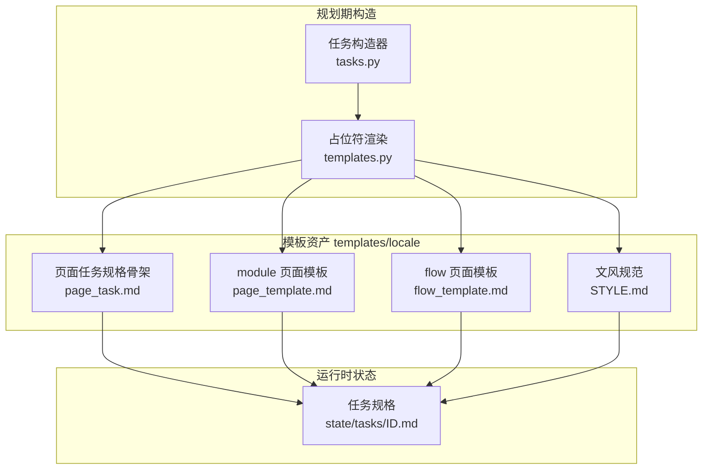
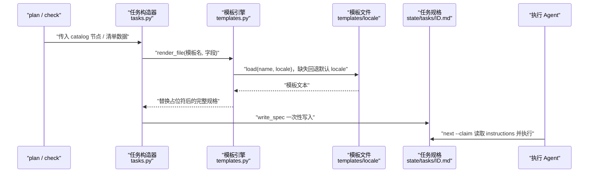
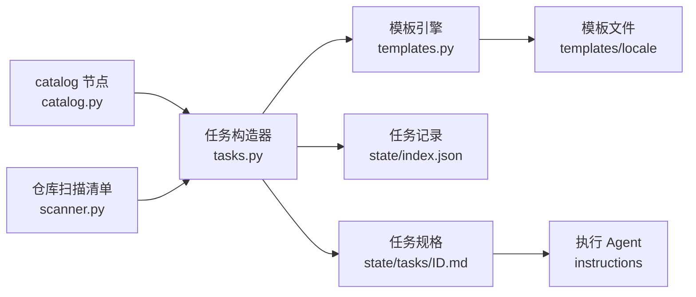

# 任务规格与模板体系

## 目录
1. [简介](#简介)
2. [项目结构](#项目结构)
3. [核心组件](#核心组件)
4. [架构总览](#架构总览)
5. [详细组件分析](#详细组件分析)
6. [依赖关系分析](#依赖关系分析)
7. [性能与一致性考量](#性能与一致性考量)
8. [故障排查指南](#故障排查指南)
9. [结论](#结论)

## 简介

repowiki 的每个任务都是两部分：`state/index.json` 里的一条记录，加上 `state/tasks/<id>.md` 下一份不可变的 markdown 规格——规格通过 `next --claim` 返回的 `instructions` 字段交给执行 agent，明确告知写什么、写到哪、按什么模板写。规格内嵌完整的页面模板与文风规范，使任务自包含、页间零链接，从而天然并行安全；模板资产按 zh / en 两套 locale 成镜镜像，由一个极简的占位符渲染引擎在规划时填充。

## 项目结构

与任务规格和模板相关的仓库组织如下：

- `src/repowiki/tasks.py`：全部任务规格的构造器，按阶段划分——catalog（phase 1）、页面（phase 2）、总览（phase 3），以及增量更新与知识库系列。
- `src/repowiki/templates.py`：模板资产加载器与 `{{PLACEHOLDER}}` 渲染引擎。
- `src/repowiki/templates/zh/` 与 `src/repowiki/templates/en/`：成对镜像的模板目录，各含 13 个模板文件。
- `state/tasks/<id>.md`：规格渲染产物（位于目标仓库的 `.repowiki/` 下），内容不可变。
- 关键模板文件：`page_task.md`（页面任务规格骨架）、`page_template.md`（module 结构型页面模板）、`flow_template.md`（flow 流程型页面模板）、`STYLE.md`（文风与图表规范）。

图表来源
- [src/repowiki/tasks.py:87-115](file://src/repowiki/tasks.py#L87-L115)
- [src/repowiki/templates.py:22-38](file://src/repowiki/templates.py#L22-L38)
- [src/repowiki/templates/zh/page_task.md:1-9](file://src/repowiki/templates/zh/page_task.md#L1-L9)

章节来源
- [src/repowiki/tasks.py:1-7](file://src/repowiki/tasks.py#L1-L7)
- [src/repowiki/templates.py:1-8](file://src/repowiki/templates.py#L1-L8)

## 核心组件

- 任务规格文件：`state/tasks/<id>.md`，YAML frontmatter（id / kind / phase / title / output / hint_files）加 instructions 正文，是执行 agent 的唯一输入。
- 渲染引擎：`templates.py` 的 `load` / `render` / `render_file`，用正则匹配 `{{PLACEHOLDER}}` 并做字典替换，未知占位符有意原样保留。
- 页面任务构造器 `build_page_tasks`：把 catalog 展开出的节点逐个渲染成页面任务规格，填充标题、输出路径、提示文件、姊妹页面、页面模板与文风规范。
- 原型选择器 `_page_template_name`：按节点 `archetype` 字段选 `flow_template.md`（流程型）或 `page_template.md`（结构型，默认）。
- 文风规范 `STYLE.md`：定义语言、章节来源 / 图表来源引用格式、mermaid 图表风格与页面其他约定，随每份规格整段内嵌。

章节来源
- [src/repowiki/tasks.py:83-115](file://src/repowiki/tasks.py#L83-L115)
- [src/repowiki/templates.py:22-34](file://src/repowiki/templates.py#L22-L34)
- [src/repowiki/templates/zh/page_task.md:1-14](file://src/repowiki/templates/zh/page_task.md#L1-L14)
- [src/repowiki/templates/zh/STYLE.md:1-15](file://src/repowiki/templates/zh/STYLE.md#L1-L15)

## 架构总览

规格的生成发生在规划期（plan 展开任务、check 校验通过后展开后续阶段），是一次「构造器取数 → 模板引擎渲染 → 落盘」的确定性流水线；执行期 agent 只读取现成规格，不再接触模板系统。

图表来源
- [src/repowiki/tasks.py:97-113](file://src/repowiki/tasks.py#L97-L113)
- [src/repowiki/templates.py:22-38](file://src/repowiki/templates.py#L22-L38)

章节来源
- [src/repowiki/tasks.py:53-56](file://src/repowiki/tasks.py#L53-L56)
- [src/repowiki/tasks.py:87-115](file://src/repowiki/tasks.py#L87-L115)

## 详细组件分析

### 任务规格文件的结构

- 职责：让执行 agent 在不读任何其他文档的情况下完成一份合格产出。
- 关键行为：frontmatter 依次给出 `id`、`kind: page`、`phase: 2`、`title`、`output`（相对仓库根的产出路径）与 `hint_files` YAML 列表；正文先给「只写这一个文件」的硬约束，再给页面定位（章节路径、摘要、page_brief 要点）、带语言与行数元信息的参考文件清单、仅供定位且禁止链接的姊妹页面列表，然后整段内嵌页面模板与 STYLE 规范，最后列出校验器逐条检查的硬性检查项与 touch / check 提醒。
- 实现要点：`_hint_list` 用扫描清单为每个提示文件补上语言与行数；`_yaml_list` 对以 `*`、`&`、`!`、`{`、`[`、`#` 开头的 YAML 不安全标量自动加引号；`_brief_bullets` 在 catalog 未提供要点时输出「请通读提示文件后自行提炼」的占位提示。

章节来源
- [src/repowiki/templates/zh/page_task.md:1-45](file://src/repowiki/templates/zh/page_task.md#L1-L45)
- [src/repowiki/tasks.py:22-50](file://src/repowiki/tasks.py#L22-L50)
- [src/repowiki/tasks.py:96-112](file://src/repowiki/tasks.py#L96-L112)

### 模板渲染机制

- 职责：把纯文本模板变成填好的规格，不引入任何模板引擎依赖。
- 关键行为：`load(name, locale)` 从 `templates/<locale>/` 读取模板，文件缺失时回退默认 locale 的同名文件；`render(text, **kwargs)` 用正则 `\{\{([A-Z][A-Z0-9_]*)\}\}` 匹配占位符并替换，`render_file` 是两者的组合。
- 实现要点：未知占位符有意原样保留——校验器据此能发现 agent 产出里被遗忘替换的模板残留；模板是普通文本文件，任务规格自身携带输出语言指令，渲染引擎与语言无关。

章节来源
- [src/repowiki/templates.py:1-8](file://src/repowiki/templates.py#L1-L8)
- [src/repowiki/templates.py:17-38](file://src/repowiki/templates.py#L17-L38)

### zh 与 en 双语模板镜像的 13 个文件

- 职责：`templates/zh/` 与 `templates/en/` 内容一一对应，各含 13 个模板文件，覆盖全部任务类型。
- 关键行为（文件 → 用途 → 对应构造器）：
  - `catalog_task.md`：catalog 目录规划任务规格（phase 1）→ `build_catalog_task`。
  - `page_task.md`：页面任务规格骨架（phase 2）→ `build_page_tasks` 与 `build_update_task` 的新页回退路径。
  - `page_template.md`：module 结构型页面模板（默认原型）。
  - `flow_template.md`：flow 流程型页面模板（`archetype: flow`）。
  - `overview_task.md`：总览页任务规格（phase 3）→ `build_overview_task`。
  - `update_task.md`：既有页面的增量更新规格（附旧全文与变更文件）→ `build_update_task`。
  - `overview_update_task.md`：总览页增量更新规格 → `build_overview_update_task`。
  - `knowledge_task.md`：知识库规划任务规格（modules + cards）→ `build_knowledge_plan_task`。
  - `knowledge_module_task.md`：知识模块文档任务规格 → `build_knowledge_tasks`。
  - `knowledge_card_task.md`：知识卡片任务规格 → `build_knowledge_tasks`。
  - `knowledge_card_update_task.md`：卡片增量更新规格（旧卡片存在时）→ `build_knowledge_card_update_task`。
  - `knowledge_module_update_task.md`：模块增量更新规格 → `build_knowledge_module_update_task`。
  - `STYLE.md`：文风与图表规范，被页面、总览与更新类规格整段内嵌。
- 实现要点：增量更新任务遇到旧产出不存在时降级为全新规格（如 `build_update_task` 旧页缺失时改用 `page_task.md`，卡片更新同理），保证新页面不被强制携带「更新摘要」小节。

章节来源
- [src/repowiki/tasks.py:61-78](file://src/repowiki/tasks.py#L61-L78)
- [src/repowiki/tasks.py:120-160](file://src/repowiki/tasks.py#L120-L160)
- [src/repowiki/tasks.py:165-204](file://src/repowiki/tasks.py#L165-L204)
- [src/repowiki/tasks.py:231-291](file://src/repowiki/tasks.py#L231-L291)
- [src/repowiki/tasks.py:296-354](file://src/repowiki/tasks.py#L296-L354)

### module 与 flow 两类页面原型

- 职责：按主题性质选择合适的页面骨架，让结构型主题与流程型主题各得其所。
- 关键行为：module 原型（`page_template.md`）固定九节——简介、项目结构（graph TB）、核心组件、架构总览（sequenceDiagram）、详细组件分析、依赖关系分析（graph LR）、性能与一致性考量、故障排查指南、结论；flow 原型（`flow_template.md`）固定七节——简介、流程总览（sequenceDiagram）、关键步骤（每步含输入 / 处理 / 失败路径）、参与组件、数据与状态变化（graph LR）、故障排查指南、结论。
- 实现要点：选择逻辑收敛在 `_page_template_name` 一处——节点 `archetype == "flow"` 取 flow 模板，否则取 module 模板；两类模板的 `{{TITLE}}` 占位符在拼入规格前已被替换为具体页面标题，规格中的骨架因此是「可直接照抄的成品结构」。

章节来源
- [src/repowiki/tasks.py:83-84](file://src/repowiki/tasks.py#L83-L84)
- [src/repowiki/templates/zh/page_template.md:9-18](file://src/repowiki/templates/zh/page_template.md#L9-L18)
- [src/repowiki/templates/zh/flow_template.md:9-16](file://src/repowiki/templates/zh/flow_template.md#L9-L16)
- [src/repowiki/templates/zh/flow_template.md:41-54](file://src/repowiki/templates/zh/flow_template.md#L41-L54)
- [README.md:170-176](file://README.md#L170-L176)

## 依赖关系分析

- 上游输入：任务构造器依赖 catalog 展开出的节点（标题、输出路径、依赖文件、page_brief、archetype）与扫描清单（为提示文件补充元信息）。
- 核心依赖：`tasks.py` 通过 `new_task` 生成任务记录、通过 `templates` 渲染规格，两者分别落入 `state/index.json` 与 `state/tasks/<id>.md`。
- 下游消费：规格文件是 `next --claim` 返回 `instructions` 的直接来源；页面模板（module / flow）与 STYLE 决定产出的最终形态，也是校验器规则的参照。

图表来源
- [src/repowiki/tasks.py:13-17](file://src/repowiki/tasks.py#L13-L17)
- [src/repowiki/tasks.py:87-115](file://src/repowiki/tasks.py#L87-L115)

章节来源
- [src/repowiki/tasks.py:13-19](file://src/repowiki/tasks.py#L13-L19)
- [src/repowiki/tasks.py:53-56](file://src/repowiki/tasks.py#L53-L56)

## 性能与一致性考量

- 用体积换并行：每份规格内嵌完整模板与文风规范（约 4-6k tokens），换取任务自包含与并行安全；小上下文 agent 可把规格中的模板段落替换为对 `templates/` 目录的引用。
- 规格不可变：`write_spec` 在规划期一次性写入，执行期无人改写，认领者读到的内容永远一致。
- 防呆设计：未知占位符原样保留供校验器识别漏替换；YAML 不安全标量自动加引号，避免 frontmatter 解析歧义。
- 规模上限：catalog 规格的代码文件清单有 `FILE_LIST_CAP = 800` 的截断保护，超大仓库不会生成失控规格。
- 语言一致性：locale 在 plan 时确定并持久化，模板加载缺失时回退默认 locale，保证双语镜像目录即使缺文件也能产出。

章节来源
- [src/repowiki/tasks.py:19-19](file://src/repowiki/tasks.py#L19-L19)
- [src/repowiki/tasks.py:53-56](file://src/repowiki/tasks.py#L53-L56)
- [src/repowiki/tasks.py:35-41](file://src/repowiki/tasks.py#L35-L41)
- [src/repowiki/templates.py:22-26](file://src/repowiki/templates.py#L22-L26)
- [README.md:284-288](file://README.md#L284-L288)

## 故障排查指南

- 现象：规格或产出里出现未替换的 `{{XXX}}` 占位符。原因：渲染时缺少对应字段，`render` 按设计原样保留未知占位符。定位：对照 `tasks.py` 相应构造器的 `render_file` 调用，确认字段名拼写与数据来源。
- 现象：en locale 下渲染出了中文模板。原因：`templates/en/` 缺少同名文件，`load` 回退到默认 locale。定位：检查两个镜像目录的文件清单是否一一对应。
- 现象：流程型主题页拿到了 module 九节骨架。原因：catalog 节点未设置 `archetype: flow`，`_page_template_name` 落到默认。定位：调整 catalog 后 `plan --replan` 重新展开页面任务。
- 现象：规格的 page_brief 处显示「catalog 未提供要点」占位。原因：catalog 节点没写 page_brief。定位：属于预期降级行为，agent 应通读提示文件自行提炼要点。
- 现象：frontmatter 的 hint_files 列表解析异常。原因：路径以 `*` 等字符开头被当作 YAML 特殊节点。定位：`_yaml_list` 已对六类不安全前缀自动加引号，若仍有问题检查自定义类别文件或 catalog 生成逻辑。

章节来源
- [src/repowiki/templates.py:29-34](file://src/repowiki/templates.py#L29-L34)
- [src/repowiki/templates.py:22-26](file://src/repowiki/templates.py#L22-L26)
- [src/repowiki/tasks.py:35-50](file://src/repowiki/tasks.py#L35-L50)
- [src/repowiki/tasks.py:83-84](file://src/repowiki/tasks.py#L83-L84)

## 结论

任务规格与模板体系是 repowiki「确定性编排 + agent 智能执行」分工的接口层：`tasks.py` 在规划期把 catalog 数据渲染成自包含的 markdown 规格，`templates.py` 以极简占位符替换驱动 zh / en 双语镜像的 13 个模板文件，module 与 flow 两种页面原型覆盖结构与流程两类主题。理解这套体系后，定制 wiki 产出只需改模板或调 catalog 的 archetype 与 page_brief，而无需触碰编排代码；注意保持 zh / en 模板镜像同步，并避免在规格外改写 `state/tasks/` 下的文件。

章节来源
- [src/repowiki/tasks.py:1-7](file://src/repowiki/tasks.py#L1-L7)
- [src/repowiki/templates.py:1-8](file://src/repowiki/templates.py#L1-L8)
- [src/repowiki/templates/zh/page_task.md:28-45](file://src/repowiki/templates/zh/page_task.md#L28-L45)

<cite>
**本文引用的文件**
- [tasks.py](file://src/repowiki/tasks.py)
- [templates.py](file://src/repowiki/templates.py)
- [page_task.md](file://src/repowiki/templates/zh/page_task.md)
- [STYLE.md](file://src/repowiki/templates/zh/STYLE.md)
- [page_template.md](file://src/repowiki/templates/zh/page_template.md)
- [flow_template.md](file://src/repowiki/templates/zh/flow_template.md)
</cite>
