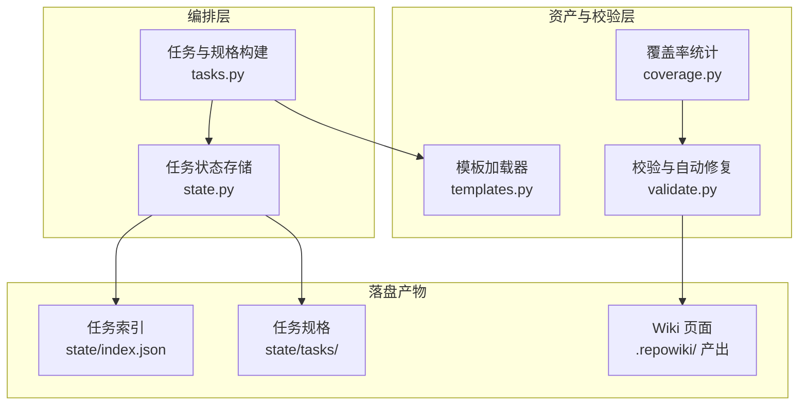
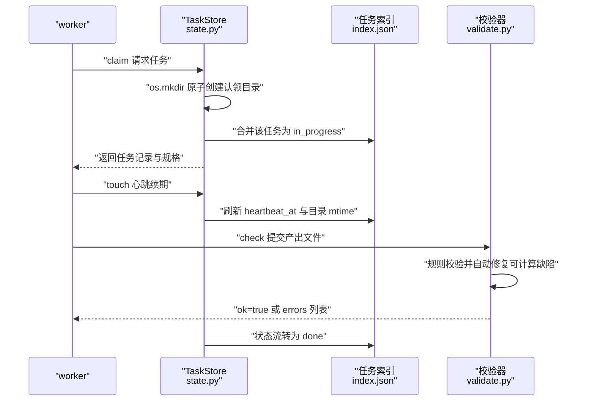
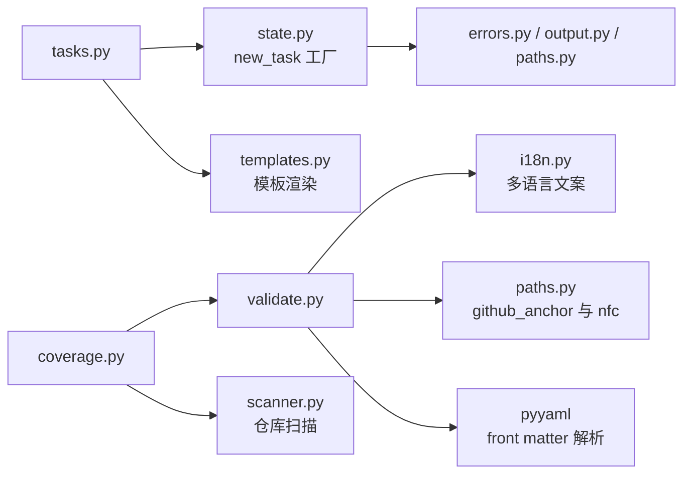

# 核心机制

## 目录
1. [简介](#简介)
2. [项目结构](#项目结构)
3. [核心组件](#核心组件)
4. [架构总览](#架构总览)
5. [详细组件分析](#详细组件分析)
6. [依赖关系分析](#依赖关系分析)
7. [性能与一致性考量](#性能与一致性考量)
8. [故障排查指南](#故障排查指南)
9. [结论](#结论)

## 简介

本页剖析 repowiki 编排器的三大核心机制的内部实现：其一是任务状态机与并发控制——任务从 pending 到 done 的流转、基于 `os.mkdir` 的原子认领与过期回收，全部集中在 `src/repowiki/state.py`；其二是任务规格体系——每个任务对应一份内嵌完整模板与文风规范的 markdown 规格，由 `src/repowiki/tasks.py` 生成、`src/repowiki/templates.py` 按 zh/en 语言渲染；其三是质量门禁——`src/repowiki/validate.py` 以「确定性自动修复 + 语义缺陷判失败」的规则引擎校验产出，`src/repowiki/coverage.py` 统计 wiki 对仓库文件的引用覆盖率。这三层机制共同支撑了「多 worker 并发安全、产出质量可程序化保证」的设计目标。

## 项目结构

- `src/repowiki/state.py`：任务状态存储（437 行）。模块文档开宗明义：并发安全来自一个原语——逐任务认领目录的 `os.mkdir`（原子、已存在即失败）；索引更新只合并被触碰的任务条目，以缩小读-改-写窗口 [state.py:1-6](file://src/repowiki/state.py#L1-L6)。
- `src/repowiki/tasks.py`：任务记录与规格文件构建器（354 行）。每个任务既是 `state/index.json` 中的一条记录，也是 `state/tasks/<id>.md` 下一份不可变的 markdown 规格；规格内嵌完整页面模板与文风规则，使任务自包含、可并行 [tasks.py:1-7](file://src/repowiki/tasks.py#L1-L7)。
- `src/repowiki/validate.py`：产出校验规则引擎（356 行）。一切可计算的缺陷（锚点、行区间、H1、路径分隔符）被静默修复并记入 fixed 列表；只有语义缺陷（缺小节、引用不存在的文件、围栏不闭合）才判任务失败 [validate.py:1-6](file://src/repowiki/validate.py#L1-L6)。
- `src/repowiki/templates.py`：模板资产加载器（38 行）。模板是 `repowiki/templates/<locale>/` 下的纯文本文件，以 `{{PLACEHOLDER}}` 占位符替换渲染；未知占位符故意保留原样，让校验器能在 agent 产出中标记遗漏的替换 [templates.py:1-8](file://src/repowiki/templates.py#L1-L8)。
- `src/repowiki/coverage.py`：覆盖率只读报告（96 行）。将仓库文件清单与全部 wiki 页面、总览及知识卡片 source_files 的 `file://` 引用并集对比，纯确定性计算，无 agent、无 LLM [coverage.py:1-8](file://src/repowiki/coverage.py#L1-L8)。
- `src/repowiki/templates/`：按语言组织的模板资产目录，每个 locale 携带一整套模板，任务规格自身携带产出语言指令 [templates.py:3-7](file://src/repowiki/templates.py#L3-L7)。

**图表来源**
- [tasks.py:1-7](file://src/repowiki/tasks.py#L1-L7)
- [state.py:1-6](file://src/repowiki/state.py#L1-L6)
- [templates.py:1-8](file://src/repowiki/templates.py#L1-L8)

**章节来源**
- [state.py:1-6](file://src/repowiki/state.py#L1-L6)
- [tasks.py:1-7](file://src/repowiki/tasks.py#L1-L7)
- [validate.py:1-6](file://src/repowiki/validate.py#L1-L6)
- [templates.py:1-8](file://src/repowiki/templates.py#L1-L8)
- [coverage.py:1-8](file://src/repowiki/coverage.py#L1-L8)

## 核心组件

- TaskStore（state.py）：任务状态存储类，承载索引读写、就绪队列计算、认领/释放/心跳与进度统计 [state.py:93-96](file://src/repowiki/state.py#L93-L96)。
- new_task（state.py）：任务记录工厂，初始状态 pending，含 spec 路径 `state/tasks/<id>.md`、attempts 计数与认领字段 [state.py:76-90](file://src/repowiki/state.py#L76-L90)。
- claim / release / touch / heartbeat（state.py）：认领的生命周期四件套——mkdir 原子独占、人工或崩溃后的释放、worker 侧心跳续期与底层 mtime 刷新 [state.py:294-367](file://src/repowiki/state.py#L294-L367)。
- ready_tasks（state.py）：就绪队列——当前开放阶段内可认领的任务，按 attempts 少者优先排序 [state.py:219-243](file://src/repowiki/state.py#L219-L243)。
- build_catalog_task / build_page_tasks / build_overview_task（tasks.py）：三个阶段的规格生成器，分别产出目录规划、页面与总览任务 [tasks.py:59-133](file://src/repowiki/tasks.py#L59-L133)。
- load / render / render_file（templates.py）：模板加载（含 locale 回退）与 `{{占位符}}` 替换渲染 [templates.py:22-38](file://src/repowiki/templates.py#L22-L38)。
- check_page（validate.py）：页面校验主入口——占位符、H1、必备小节、cite 块、mermaid 围栏、file:// 链接与目录锚点的规则集 [validate.py:91-193](file://src/repowiki/validate.py#L91-L193)。
- _fix_toc（validate.py）：按实际 `##` 标题与 github_anchor 确定性重建目录锚点列表 [validate.py:196-211](file://src/repowiki/validate.py#L196-L211)。
- check_knowledge_plan / check_knowledge_card / check_overview（validate.py）：知识库规划、知识卡片与总览页的专用校验 [validate.py:222-356](file://src/repowiki/validate.py#L222-L356)。
- run_coverage（coverage.py）：覆盖率统计入口，输出仓库文件总数、已引用数、覆盖率与未引用清单 [coverage.py:24-76](file://src/repowiki/coverage.py#L24-L76)。

**章节来源**
- [state.py:76-96](file://src/repowiki/state.py#L76-L96)
- [state.py:219-243](file://src/repowiki/state.py#L219-L243)
- [state.py:294-367](file://src/repowiki/state.py#L294-L367)
- [tasks.py:59-133](file://src/repowiki/tasks.py#L59-L133)
- [templates.py:22-38](file://src/repowiki/templates.py#L22-L38)
- [validate.py:91-211](file://src/repowiki/validate.py#L91-L211)
- [coverage.py:24-76](file://src/repowiki/coverage.py#L24-L76)

## 架构总览

三大机制在运行时串成一条链：worker 通过 `next` 触发 TaskStore 的原子认领（mkdir 抢目录 + 索引合并为 in_progress），执行期间以 `touch` 心跳刷新认领目录 mtime 与索引 heartbeat_at，产出完成后 `check` 调用 validate.py 的规则引擎——可修复项直接改写产出文本，语义缺陷返回 errors，通过则状态流转为 done [state.py:294-367](file://src/repowiki/state.py#L294-L367) [validate.py:91-193](file://src/repowiki/validate.py#L91-L193)。

**图表来源**
- [state.py:294-308](file://src/repowiki/state.py#L294-L308)
- [state.py:343-367](file://src/repowiki/state.py#L343-L367)
- [validate.py:91-193](file://src/repowiki/validate.py#L91-L193)

**章节来源**
- [state.py:294-367](file://src/repowiki/state.py#L294-L367)
- [validate.py:91-193](file://src/repowiki/validate.py#L91-L193)

## 详细组件分析

### 任务状态机与原子认领

- 职责：以五种状态（pending / in_progress / done / failed / exhausted 由 attempts 触顶隐式表达）管理任务生命周期，并保证多进程下同一任务同一时刻至多一个有效认领。
- 关键行为：`claim` 先拒绝 done 任务，再尝试 `_try_mkdir_claim`——用 `os.mkdir` 原子创建 `claims/<id>/`，成功后写入 worker 与 ts 文件并把索引合并为 in_progress、attempts+1；目录已存在且未过期则抛 ConflictError「正被其他 worker 执行中」 [state.py:294-308](file://src/repowiki/state.py#L294-L308)。`release` 对 exhausted 毒任务要求显式 `--force` 重置（attempts 归零回 pending）；释放时把认领目录改名 `.released-<id>-<hex>` 留痕 [state.py:310-341](file://src/repowiki/state.py#L310-L341)。
- 实现要点：过期判定以认领目录本身的 mtime 为准而非目录内 ts 文件——ts 在 mkdir 之后才写，若看 ts 会让刚创建的认领显得无限旧而被误抢 [state.py:250-257](file://src/repowiki/state.py#L250-L257)；认领目录消失或 mtime 年龄达到过期窗口即判定被遗弃，窗口是唯一存活信号——repowiki 是短命 CLI 进程，记录的 pid 对存活判断无意义 [state.py:259-267](file://src/repowiki/state.py#L259-L267)；抢回收时先改名 `.stale-<id>-<hex>`（只有一个竞争者能成功）再重试 mkdir [state.py:269-292](file://src/repowiki/state.py#L269-L292)。

**章节来源**
- [state.py:247-341](file://src/repowiki/state.py#L247-L341)
- [state.py:21-28](file://src/repowiki/state.py#L21-L28)

### 文件锁与事务化索引写入

- 职责：保证 `state/index.json` 的跨进程读-改-写串行化与原子落盘。
- 关键行为：所有索引变更走 `_transaction`——在 `.index.lock` 文件锁保护下读出索引、执行变更、原子写回 [state.py:155-163](file://src/repowiki/state.py#L155-L163)；写入采用临时文件加 `os.replace` 的原子替换 [state.py:137-142](file://src/repowiki/state.py#L137-L142)；连只读的 `load` 也加入同一把锁——Windows 下 `os.replace` 会在其他进程持有文件句柄时失败（CPython 不以 FILE_SHARE_DELETE 打开），无锁读取可能破坏并发写入者 [state.py:100-116](file://src/repowiki/state.py#L100-L116)。
- 实现要点：文件锁在 POSIX 用 fcntl、Windows 用 msvcrt（均为标准库），Windows 侧 `LK_LOCK` 阻塞约 10 秒后放弃并报错 [state.py:52-73](file://src/repowiki/state.py#L52-L73)；针对 Windows 原子替换瞬间的亚毫秒 PermissionError 竞态，读写都有短重试 `_retry_windows_fs` [state.py:35-49](file://src/repowiki/state.py#L35-L49)；索引损坏时绝不伪装成空清单——那会让下一次事务用单个任务覆写整个计划，因此原样保留文件并给出恢复指引（手工修复或 `plan --replan --force`）[state.py:118-135](file://src/repowiki/state.py#L118-L135)；`_merge_task` 在事务内只更新被触碰的任务条目 [state.py:165-171](file://src/repowiki/state.py#L165-L171)。

**章节来源**
- [state.py:35-49](file://src/repowiki/state.py#L35-L49)
- [state.py:52-73](file://src/repowiki/state.py#L52-L73)
- [state.py:100-171](file://src/repowiki/state.py#L100-L171)

### 任务规格的生成与模板渲染

- 职责：把 catalog 规划结果展开为自包含的任务规格，任何 worker 无需额外上下文即可执行。
- 关键行为：phase 1 的 `build_catalog_task` 渲染 catalog 任务模板，代码文件清单上限 800 个（FILE_LIST_CAP），产出 `state/catalog.json` 任务 [tasks.py:19](file://src/repowiki/tasks.py#L19) [tasks.py:61-78](file://src/repowiki/tasks.py#L61-L78)；phase 2 的 `build_page_tasks` 为每个 catalog 节点渲染 page_task.md 规格，填入标题、输出路径、hint 文件清单（附语言与行数）、章节路径、摘要、要点、姊妹页面，并按节点原型选模板——flow 原型用 flow_template.md，否则 page_template.md，页面模板与文风规范（STYLE.md）整体内嵌 [tasks.py:83-115](file://src/repowiki/tasks.py#L83-L115)；phase 3 的 `build_overview_task` 产出总览任务，输出为 `<locale>/meta/wiki-overview.md` [tasks.py:120-133](file://src/repowiki/tasks.py#L120-L133)。
- 实现要点：增量更新的 `build_update_task` 在旧产出不存在时退化为全新页面任务——新页面不应被迫携带「更新摘要」小节；存在时则内嵌旧页面全文（OLD_PAGE）供对照改写 [tasks.py:165-204](file://src/repowiki/tasks.py#L165-L204)。模板渲染层极薄：`load` 按 locale 读取 `templates/<locale>/<name>`，缺失时回退默认 locale 全套模板；`render` 只替换 `{{大写占位符}}`，未知占位符原样保留，使校验器能据此标记 agent 产出中遗漏的替换 [templates.py:19-34](file://src/repowiki/templates.py#L19-L34)。知识卡片内置六类（配置、日志、错误处理、构建、依赖管理、前端样式），可经 `knowledge --categories` 整表替换并持久化于 state [tasks.py:209-219](file://src/repowiki/tasks.py#L209-L219)。

**章节来源**
- [tasks.py:59-133](file://src/repowiki/tasks.py#L59-L133)
- [tasks.py:165-219](file://src/repowiki/tasks.py#L165-L219)
- [templates.py:1-38](file://src/repowiki/templates.py#L1-L38)

### 页面校验规则与自动修复

- 职责：程序化判定 wiki 页面产出是否合格，并把一切可计算的缺陷自动修复。
- 关键行为：`check_page` 依次检查——正文残留 `{{...}}` 占位符（只扫描散文，代码块内可合法演示占位符语法，由 `_strip_code` 剔除围栏与行内代码）判失败 [validate.py:23](file://src/repowiki/validate.py#L23) [validate.py:63-75](file://src/repowiki/validate.py#L63-L75) [validate.py:97-100](file://src/repowiki/validate.py#L97-L100)；H1 必须恰好一个且等于任务标题，不一致时直接改写并记入 fixed [validate.py:102-110](file://src/repowiki/validate.py#L102-L110)；必备小节按原型查表（module 结构型或 flow 流程型），缺节判失败，且 `##` 小节数少于 6 视为内容截断 [validate.py:112-126](file://src/repowiki/validate.py#L112-L126)；`<cite>` 块缺失或无 file:// 引用判失败，mermaid 图少于 2 个或代码围栏不配对判失败 [validate.py:128-143](file://src/repowiki/validate.py#L128-L143)。
- 实现要点：file:// 链接逐条核对文件存在性（不存在判失败），行区间超出文件行数则钳制回有效范围、反斜杠分隔符归一为正斜杠，均属自动修复 [validate.py:145-179](file://src/repowiki/validate.py#L145-L179)；页间 `.md` 链接只警告不判失败（应为页间零链接）[validate.py:181-184](file://src/repowiki/validate.py#L181-L184)；目录锚点不做逐条比对，而是按实际 `##` 标题加 github_anchor 整表重建 [validate.py:186-211](file://src/repowiki/validate.py#L186-L211)。常量门槛起类似作用：至少 6 个小节、至少 2 张 mermaid 图、单页引用文件超过 15 个给警告 [validate.py:19-21](file://src/repowiki/validate.py#L19-L21) [validate.py:178-179](file://src/repowiki/validate.py#L178-L179)。知识规划校验覆盖 modules/cards 结构、id 与 title 唯一性、类别合法性与 source_files 存在性；知识卡片校验 YAML front matter、编号小节与 H1 一致性；总览校验禁止 front matter 并核对 H1 与必备小节 [validate.py:222-273](file://src/repowiki/validate.py#L222-L273) [validate.py:293-335](file://src/repowiki/validate.py#L293-L335) [validate.py:338-356](file://src/repowiki/validate.py#L338-L356)。

**章节来源**
- [validate.py:19-31](file://src/repowiki/validate.py#L19-L31)
- [validate.py:91-211](file://src/repowiki/validate.py#L91-L211)
- [validate.py:222-356](file://src/repowiki/validate.py#L222-L356)

### 覆盖率统计

- 职责：回答「仓库里哪些文件从未被 wiki 引用」，作为确定性的写作指引与质量指标。
- 关键行为：`run_coverage` 先要求 `state/catalog.json` 存在（缺失提示先完成首次生成），损坏则报错并建议手工修复或 replan；随后扫描仓库得到文件清单，逐页用 validate.py 的 `extract_refs` 抽取 file:// 引用并集（含总览页与知识卡片 source_files），`uncited = known - cited` 即未引用清单，覆盖率为已引用数除以总数（保留 4 位小数）[coverage.py:24-76](file://src/repowiki/coverage.py#L24-L76)。
- 实现要点：人类可读输出至多列出 50 个未引用文件（JSON 含全量），并会点名没有任何 file:// 引用的「零引用页面」[coverage.py:21](file://src/repowiki/coverage.py#L21) [coverage.py:79-96](file://src/repowiki/coverage.py#L79-L96)。

**章节来源**
- [coverage.py:1-8](file://src/repowiki/coverage.py#L1-L8)
- [coverage.py:24-96](file://src/repowiki/coverage.py#L24-L96)

## 依赖关系分析

- tasks.py 是规格生成的汇聚点：向 state.py 取 new_task 工厂、向 templates.py 取模板渲染、向 catalog.py 取节点展平与树文本、向 scanner.py 取仓库清单、向 paths.py 取路径与命名工具 [tasks.py:11-17](file://src/repowiki/tasks.py#L11-L17)。
- state.py 依赖 errors.py（ConflictError / StateError / UsageError）、output.py（emit）与 paths.py（WikiPaths 提供索引、认领与规格路径）[state.py:17-19](file://src/repowiki/state.py#L17-L19)。
- validate.py 依赖 i18n.py 的多语言文案（必备小节表按 locale 取）、paths.py 的 github_anchor 与 nfc，以及外部依赖 pyyaml（解析知识卡片 front matter）[validate.py:8-17](file://src/repowiki/validate.py#L8-L17)。
- coverage.py 复用 validate.py 的 extract_refs 与 scanner.py 的 scan，是校验层的只读消费者 [coverage.py:14-19](file://src/repowiki/coverage.py#L14-L19)。

**图表来源**
- [tasks.py:11-17](file://src/repowiki/tasks.py#L11-L17)
- [state.py:17-19](file://src/repowiki/state.py#L17-L19)
- [validate.py:8-17](file://src/repowiki/validate.py#L8-L17)
- [coverage.py:14-19](file://src/repowiki/coverage.py#L14-L19)

**章节来源**
- [tasks.py:11-17](file://src/repowiki/tasks.py#L11-L17)
- [state.py:17-19](file://src/repowiki/state.py#L17-L19)
- [validate.py:8-17](file://src/repowiki/validate.py#L8-L17)
- [coverage.py:14-19](file://src/repowiki/coverage.py#L14-L19)

## 性能与一致性考量

- 缩小竞态窗口：索引事务内只合并被触碰的单个任务条目，而非整表重写，读-改-写窗口随事务粒度缩小 [state.py:1-6](file://src/repowiki/state.py#L1-L6) [state.py:165-171](file://src/repowiki/state.py#L165-L171)。
- 锁开销有界：锁持有为亚毫秒级，热读路径是轮询循环而非紧密自旋 [state.py:100-108](file://src/repowiki/state.py#L100-L108)；Windows 侧锁阻塞约 10 秒即放弃并明确报错，避免无限等待 [state.py:64-71](file://src/repowiki/state.py#L64-L71)。
- 原子性取舍：认领用 `os.mkdir` 的「已存在即失败」语义，免去独立锁文件；索引写用临时文件加 `os.replace`，读者要么看到旧全量要么看到新全量 [state.py:1-6](file://src/repowiki/state.py#L1-L6) [state.py:137-142](file://src/repowiki/state.py#L137-L142)。
- 一致性防护：损坏的 index.json 绝不按空清单处理，防止下一次事务静默抹掉整个任务计划 [state.py:126-133](file://src/repowiki/state.py#L126-L133)。
- 存活信号的简化：以心跳窗口（默认 900 秒，`REPOWIKI_STALE_SECONDS` 可调）为唯一存活信号，省去跨进程 pid 探测的复杂度与不可靠性 [state.py:21](file://src/repowiki/state.py#L21) [state.py:94-96](file://src/repowiki/state.py#L94-L96) [state.py:259-267](file://src/repowiki/state.py#L259-L267)。

**章节来源**
- [state.py:1-6](file://src/repowiki/state.py#L1-L6)
- [state.py:100-171](file://src/repowiki/state.py#L100-L171)
- [state.py:259-267](file://src/repowiki/state.py#L259-L267)

## 故障排查指南

- 报「state/index.json 损坏」：JSON 解析失败时文件被原样保留，可手工修复该文件恢复任务清单，或确认无需恢复后执行 `plan --replan --force` 重来 [state.py:126-133](file://src/repowiki/state.py#L126-L133)。
- 报「任务正被其他 worker 执行中（认领未过期）」：mkdir 撞上活认领，属正常并发保护；若持有者已死亡，等过期窗口（默认 15 分钟）后 `next` 会自动回收 [state.py:294-299](file://src/repowiki/state.py#L294-L299) [state.py:269-292](file://src/repowiki/state.py#L269-L292)。
- `touch` 报「状态为 xx，无需续期」或「由他人认领」：前者说明任务不在 in_progress（可能已 done 或已被回收），后者说明认领已被抢走，应停止写入该任务的产出文件 [state.py:353-367](file://src/repowiki/state.py#L353-L367)。
- 任务反复失败后不再入队：attempts 达到 `REPOWIKI_MAX_ATTEMPTS`（默认 3）上限成为 exhausted，需 `release --task <id> --force` 显式重置 [state.py:24-28](file://src/repowiki/state.py#L24-L28) [state.py:310-323](file://src/repowiki/state.py#L310-L323)。
- Windows 下报「state/.index.lock 被其他进程长期占用」：msvcrt 锁阻塞约 10 秒未获得，稍后重试或确认持锁的 repowiki 进程已退出 [state.py:64-71](file://src/repowiki/state.py#L64-L71)。
- 页面校验报「仍含未替换的模板占位符」：规格模板中的 `{{大写占位符}}` 未被替换；注意占位符扫描只针对散文，代码块内演示占位符语法不会误报 [validate.py:97-100](file://src/repowiki/validate.py#L97-L100) [validate.py:63-75](file://src/repowiki/validate.py#L63-L75)。
- 校验报「引用了仓库中不存在的文件」：file:// 链接指向的路径不存在，需改为真实路径；行号越界则会被自动钳制而非报错 [validate.py:145-177](file://src/repowiki/validate.py#L145-L177)。
- `coverage` 报「state/catalog.json 不存在」：需先完成首次 `plan` 与 catalog 任务再运行覆盖率统计 [coverage.py:25-32](file://src/repowiki/coverage.py#L25-L32)。

**章节来源**
- [state.py:24-28](file://src/repowiki/state.py#L24-L28)
- [state.py:64-71](file://src/repowiki/state.py#L64-L71)
- [state.py:126-133](file://src/repowiki/state.py#L126-L133)
- [state.py:269-367](file://src/repowiki/state.py#L269-L367)
- [validate.py:63-100](file://src/repowiki/validate.py#L63-L100)
- [validate.py:145-177](file://src/repowiki/validate.py#L145-L177)
- [coverage.py:25-32](file://src/repowiki/coverage.py#L25-L32)

## 结论

repowiki 的核心机制是一条「确定性流水线」：state.py 用一个 `os.mkdir` 原语加文件锁事务支撑起任务状态机与多进程并发安全；tasks.py 与 templates.py 把每次规划展开为自包含、双语化的任务规格；validate.py 以「可计算缺陷自动修复、语义缺陷才判失败」的规则引擎守住产出质量，coverage.py 再以只读统计补上覆盖面视角。理解这些机制后，使用者的正确姿势是：信任认领与过期回收而不要手工干预状态文件，遵守 touch 心跳纪律，把 check 返回的 fixed 视为免费修复、把 errors 视为必须处理的真实缺陷 [state.py:1-6](file://src/repowiki/state.py#L1-L6) [validate.py:1-6](file://src/repowiki/validate.py#L1-L6)。

**章节来源**
- [state.py:1-6](file://src/repowiki/state.py#L1-L6)
- [tasks.py:1-7](file://src/repowiki/tasks.py#L1-L7)
- [validate.py:1-6](file://src/repowiki/validate.py#L1-L6)
- [coverage.py:1-8](file://src/repowiki/coverage.py#L1-L8)

<cite>
**本文引用的文件**
- [state.py](file://src/repowiki/state.py)
- [tasks.py](file://src/repowiki/tasks.py)
- [validate.py](file://src/repowiki/validate.py)
- [templates.py](file://src/repowiki/templates.py)
- [coverage.py](file://src/repowiki/coverage.py)
</cite>
