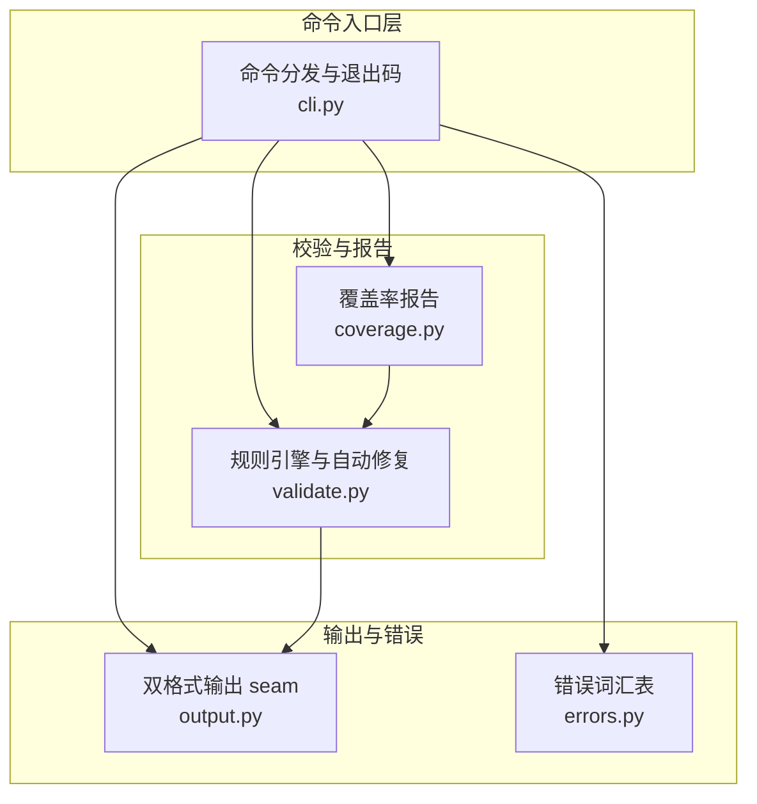
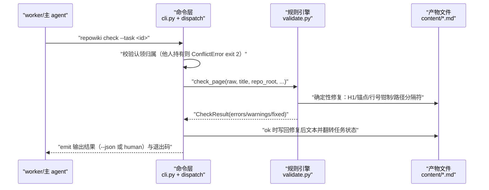
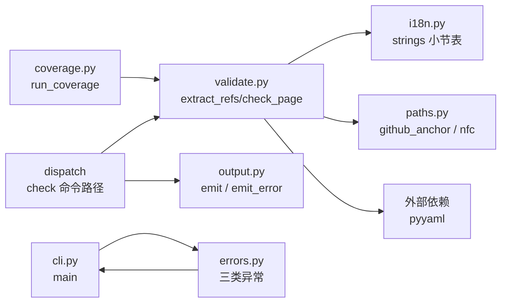

# 页面校验与自动修复

## 目录
1. [简介](#简介)
2. [项目结构](#项目结构)
3. [核心组件](#核心组件)
4. [架构总览](#架构总览)
5. [详细组件分析](#详细组件分析)
6. [依赖关系分析](#依赖关系分析)
7. [性能与一致性考量](#性能与一致性考量)
8. [故障排查指南](#故障排查指南)
9. [结论](#结论)

## 简介

页面校验与自动修复是 repowiki 保证 wiki 产出质量的确定性关卡：`repowiki check` 调用 validate.py 的规则引擎对每个页面产物逐条检查，所有可计算的缺陷（锚点、行号区间、H1、路径分隔符）被静默修复并记入 `fixed`，只有语义缺陷（缺小节、引用不存在的文件、围栏不配对、残留占位符）才报 `errors` 交回 agent 修复。同一机制族还包含 coverage.py 的只读覆盖率报告（统计 wiki 从未引用的仓库文件）与 output.py 的双格式输出 seam（`--json` 与 human 模式同源），三者共同构成「校验可证明、质量可量化、输出可测试」的核心机制层。

章节来源
- [src/repowiki/validate.py:1-6](file://src/repowiki/validate.py#L1-L6)
- [src/repowiki/coverage.py:1-8](file://src/repowiki/coverage.py#L1-L8)
- [src/repowiki/output.py:1-7](file://src/repowiki/output.py#L1-L7)

## 项目结构

校验与输出机制由四个小模块组成，各司其职：

- `src/repowiki/validate.py`：规则引擎主体。`check_page` 校验页面产物（占位符、H1、必备小节、cite 块、mermaid 围栏、file:// 引用、目录锚点），`_fix_toc` 重建目录锚点，另有知识规划 `check_knowledge_plan`、知识模块 `check_knowledge_module`、知识卡片 `check_knowledge_card` 与总览 `check_overview` 四个入口。
- `src/repowiki/coverage.py`：`run_coverage` 只读报告——把仓库文件清单与全部 wiki 页面、总览、知识卡片引用过的 file:// 路径求差集，输出覆盖率与未引用清单。
- `src/repowiki/output.py`：双格式输出 seam，`emit` 按 `--json` 与 human 两种模式打印同一份结果 dict，`emit_error` 处理错误通道。
- `src/repowiki/errors.py`：错误词汇表（叶子模块，零导入），`UsageError`/`StateError` 映射 exit 1、`ConflictError` 映射 exit 2，映射发生在 cli.py 的 main。



图表来源
- [src/repowiki/cli.py:13-24](file://src/repowiki/cli.py#L13-L24)
- [src/repowiki/coverage.py:14-19](file://src/repowiki/coverage.py#L14-L19)
- [src/repowiki/errors.py:1-7](file://src/repowiki/errors.py#L1-L7)

章节来源
- [src/repowiki/validate.py:19-31](file://src/repowiki/validate.py#L19-L31)
- [src/repowiki/coverage.py:21-24](file://src/repowiki/coverage.py#L21-L24)
- [src/repowiki/output.py:15-25](file://src/repowiki/output.py#L15-L25)
- [src/repowiki/errors.py:9-21](file://src/repowiki/errors.py#L9-L21)

## 核心组件

- `check_page`（validate.py）：页面产物校验主入口，产出 CheckResult（errors/warnings/fixed 与修复后的 text），按 archetype（module/flow）与 is_update 选择必备小节表。
- `CheckResult`（validate.py）：校验结果数据类，`fail` 同时置 ok=False 并追加 errors；`text` 字段承载自动修复后的全文供落盘。
- `extract_refs`（validate.py）：从文本提取全部 file:// 引用为 (path, start, end) 元组，是 coverage 统计的复用接口。
- `_fix_toc`（validate.py）：按实际 H2 标题与 github_anchor 规则确定性重建「目录」小节。
- `check_knowledge_plan` / `check_knowledge_card` / `check_knowledge_module` / `check_overview`（validate.py）：知识规划 JSON、知识卡片（YAML front matter + 编号小节）与总览页的专用校验。
- `run_coverage`（coverage.py）：覆盖率统计——cited 为页面、总览与知识卡片 source_files 三者引用文件之并集，uncited = known - cited。
- `emit` / `emit_error`（output.py）：所有命令打印的唯一出口；JSON 契约走 stdout，human 文案走 stderr。
- `ConflictError` / `StateError` / `UsageError`（errors.py）：共享错误词汇，分别对应 exit 2 与 exit 1。

章节来源
- [src/repowiki/validate.py:34-54](file://src/repowiki/validate.py#L34-L54)
- [src/repowiki/validate.py:91-92](file://src/repowiki/validate.py#L91-L92)
- [src/repowiki/validate.py:196-211](file://src/repowiki/validate.py#L196-L211)
- [src/repowiki/coverage.py:24-76](file://src/repowiki/coverage.py#L24-L76)
- [src/repowiki/output.py:18-34](file://src/repowiki/output.py#L18-L34)
- [src/repowiki/errors.py:12-21](file://src/repowiki/errors.py#L12-L21)

## 架构总览

check 的运行时交互是一条单通道管线：worker 写完页面后调用 `repowiki check --task <id>`，命令层先校验认领归属（他人持有的 in_progress 任务被拒绝，`ConflictError` 落 exit 2），随后按任务类型把产出交给 validate.py 的对应校验函数；校验函数返回 CheckResult，确定性修复直接写回产物文件并记入 `fixed`，语义错误经 dispatch 翻转任务状态并以 errors 返回；无论成功失败，最终结果都经 output.py 的 emit/emit_error 以 `--json` 或 human 格式输出，退出码由 cli.main 把异常类型映射为 0/1/2。



图表来源
- [src/repowiki/cli.py:170-183](file://src/repowiki/cli.py#L170-L183)
- [src/repowiki/validate.py:91-193](file://src/repowiki/validate.py#L91-L193)
- [src/repowiki/output.py:18-34](file://src/repowiki/output.py#L18-L34)

章节来源
- [src/repowiki/validate.py:91-193](file://src/repowiki/validate.py#L91-L193)
- [src/repowiki/cli.py:55-65](file://src/repowiki/cli.py#L55-L65)
- [src/repowiki/cli.py:170-183](file://src/repowiki/cli.py#L170-L183)

## 详细组件分析

### check_page：确定性校验项与自动修复边界

- 职责：对页面 markdown 做全量规则检查，把「机器可判定」的问题就地修好，把「需要智能判断」的问题报错。
- 关键行为：校验顺序为——残留模板占位符（先剔除 fenced 代码块与行内代码再扫描，文档页合法展示 `{{...}}` 不误伤）；H1 有且仅有一个且等于任务标题（不匹配时直接改写为期望标题并记 fixed）；必备小节按 archetype 选表（module 用结构型九段表，flow 用流程型表，is_update 在表头插入「更新摘要」），小节数低于 6 判疑似截断；cite 块缺失或无 file:// 引用报错；mermaid 图至少 2 个且代码围栏成对；file:// 引用检查文件存在性（缺失报错），路径分隔符归一与行区间钳制（超出文件行数时收回到实际行数）为自动修复；单页引用文件超过 15 个给 warning；指向 .md 的页间链接给 warning；「目录」锚点整表按实际标题重建。
- 实现要点：修复与报错的分界写在模块 docstring——anchors、line ranges、H1、path separators 一切可计算项静默修复，missing sections、dangling references、broken fences 等语义缺陷才 fail；`_file_loc` 以字节数统计行数并探测二进制文件（前 8192 字节含 `\0` 即视为不可引用）。

章节来源
- [src/repowiki/validate.py:1-6](file://src/repowiki/validate.py#L1-L6)
- [src/repowiki/validate.py:19-31](file://src/repowiki/validate.py#L19-L31)
- [src/repowiki/validate.py:63-88](file://src/repowiki/validate.py#L63-L88)
- [src/repowiki/validate.py:97-143](file://src/repowiki/validate.py#L97-L143)
- [src/repowiki/validate.py:145-193](file://src/repowiki/validate.py#L145-L193)
- [src/repowiki/validate.py:196-211](file://src/repowiki/validate.py#L196-L211)

### run_coverage：wiki 从未引用文件的覆盖率报告

- 职责：以纯确定性计算回答「哪些仓库文件从未被 wiki 提及」，既当写作指南（这些模块还没有页面）也当可证明的质量指标。
- 关键行为：前置要求 `state/catalog.json` 存在且可解析（损坏时报 UsageError 并提示 `plan --replan`）；扫描仓库得到 known 文件集；遍历 catalog 全部页面，用 validate.extract_refs 提取每页 file:// 引用并过滤出仓库内路径，累计为 cited 并逐页统计引用数；总览页与知识卡片的 source_files 同样并入 cited；uncited = known - cited，输出覆盖率（保留 4 位小数）、全量未引用清单与逐页引用密度。
- 实现要点：human 输出至多列出 50 个未引用文件（JSON 输出全量），并单独点名「没有任何 file:// 引用」的零引用页面，作为页面质量预警。

章节来源
- [src/repowiki/coverage.py:1-8](file://src/repowiki/coverage.py#L1-L8)
- [src/repowiki/coverage.py:24-44](file://src/repowiki/coverage.py#L24-L44)
- [src/repowiki/coverage.py:46-76](file://src/repowiki/coverage.py#L46-L76)
- [src/repowiki/coverage.py:79-96](file://src/repowiki/coverage.py#L79-L96)

### output.py 与 errors.py：双格式输出 seam 和退出码词汇

- 职责：让所有子命令的「成功输出」与「错误报告」走同一出口，保证 `--json` 契约与 human 文案不漂移。
- 关键行为：`emit` 在 JSON 模式下原样 dumps 结果 dict，human 模式下经每命令的 formatter 渲染（空文本跳过打印）；`emit_error` 的通道刻意分离——JSON 契约打印到 stdout，human 文案打印到 stderr，前缀按 kind 区分 conflict/state error/error。
- 实现要点：errors.py 有意做成零导入的叶子模块，任何命令模块都能 raise 而不反向依赖 cli；exit code 映射集中在 cli.main 的异常处理——ConflictError 到 2，StateError 与 UsageError 到 1，其余路径返回命令自身返回值（成功为 0）。

章节来源
- [src/repowiki/output.py:1-7](file://src/repowiki/output.py#L1-L7)
- [src/repowiki/output.py:18-34](file://src/repowiki/output.py#L18-L34)
- [src/repowiki/errors.py:1-7](file://src/repowiki/errors.py#L1-L7)
- [src/repowiki/cli.py:170-183](file://src/repowiki/cli.py#L170-L183)

## 依赖关系分析

- 上游消费：validate.check_page 被 check 命令路径（dispatch）调用；coverage 依赖 validate 的 extract_refs、catalog 的 flatten、scanner 的 scan，是纯只读组合器。
- 下游支撑：validate 依赖 i18n 的 strings（按 locale 取必备小节表）与 paths 的 github_anchor/nfc（锚点生成与 Unicode 归一）；输出统一经 output.emit。
- 错误传播：errors.py 定义的三个异常类由 cli.main 统一捕获并映射退出码，dispatch 与各命令模块只负责 raise。
- 外部依赖：validate 解析知识卡片 front matter 使用 pyyaml，这是运行时唯一的第三方依赖。



图表来源
- [src/repowiki/validate.py:14-17](file://src/repowiki/validate.py#L14-L17)
- [src/repowiki/coverage.py:14-19](file://src/repowiki/coverage.py#L14-L19)
- [src/repowiki/cli.py:170-183](file://src/repowiki/cli.py#L170-L183)

章节来源
- [src/repowiki/validate.py:10-17](file://src/repowiki/validate.py#L10-L17)
- [src/repowiki/coverage.py:10-19](file://src/repowiki/coverage.py#L10-L19)
- [src/repowiki/errors.py:1-7](file://src/repowiki/errors.py#L1-L7)
- [src/repowiki/output.py:28-34](file://src/repowiki/output.py#L28-L34)

## 性能与一致性考量

- 校验是确定性的：同一输入恒得同一结果，锚点与行号修复不依赖任何模型，重复 check 幂等（done 为终态，重复 check 只读）。
- 修复优先于报错：可计算缺陷不消耗 agent 重试次数（REPOWIKI_MAX_ATTEMPTS 只计语义失败），把 3 次尝试预算留给真正需要智能的问题。
- 双格式同源：JSON 与 human 输出由同一份结果 dict 派生，新增字段要么两边都有要么都没有，human 分支也因此获得可调用的测试面。
- 引用一致性约束：单页引用文件上限 15 个（warning），行号钳制保证 file:// 链接永不越界，coverage 与 site 的源码弹层因此可以信任行号区间。
- 占位符扫描的取舍：先剥离代码块再扫描，牺牲一点扫描宽度换取「文档页可合法讨论占位符机制」的表达能力。

章节来源
- [src/repowiki/validate.py:1-6](file://src/repowiki/validate.py#L1-L6)
- [src/repowiki/validate.py:63-75](file://src/repowiki/validate.py#L63-L75)
- [src/repowiki/validate.py:178-184](file://src/repowiki/validate.py#L178-L184)
- [src/repowiki/output.py:1-7](file://src/repowiki/output.py#L1-L7)

## 故障排查指南

- check 报「页面仍含未替换的模板占位符」：正文散文里残留了 `{{...}}`；先剔除代码块后扫描意味着占位符一定在散文中，按错误定位替换即可。
- check 报「引用了仓库中不存在的文件」：file:// 路径拼错或文件已移动；注意此错误不会被自动修复（行号才会被钳制），需改写为真实路径。
- check 报「缺少必备小节」：页面 archetype 与任务规格不符（flow 页缺流程型小节，或 update 任务缺「更新摘要」）；按规格补齐对应 H2 小节。
- check 报「代码围栏不配对」：某个 mermaid 块未闭合，全文围栏数为奇数；从最后一个正常图后排查未闭合的 ```。
- check 后产物被「意外」改写：这是自动修复的正常行为（H1 改写、目录锚点重建、行号钳制、路径分隔符归一），结果 JSON 的 fixed 数组逐条列出了改动，无需人工回滚。
- coverage 报「state/catalog.json 不存在/损坏」：coverage 依赖 catalog 作为页面清单，先完成首次生成；损坏时可手工修复该文件或 `plan --replan` 重新规划。
- coverage 显示大量未引用文件：对照 uncited 清单判断是页面遗漏还是文件本身无需覆盖；零引用页面（cited_files=0）通常意味着该页没有实质源码引用，应回炉补引用。
- exit 2 而非 exit 1：是认领冲突（他人持有该任务）而非校验失败，按并发契约不争抢、回领取循环。

章节来源
- [src/repowiki/validate.py:97-100](file://src/repowiki/validate.py#L97-L100)
- [src/repowiki/validate.py:112-143](file://src/repowiki/validate.py#L112-L143)
- [src/repowiki/validate.py:149-177](file://src/repowiki/validate.py#L149-L177)
- [src/repowiki/coverage.py:24-32](file://src/repowiki/coverage.py#L24-L32)
- [src/repowiki/coverage.py:79-96](file://src/repowiki/coverage.py#L79-L96)
- [src/repowiki/errors.py:12-21](file://src/repowiki/errors.py#L12-L21)

## 结论

页面校验与自动修复机制用一条清晰的分界线支撑整个 repowiki 的质量模型：凡可计算的缺陷（H1、锚点、行号、路径分隔符）由 check_page 静默修复，凡语义缺陷（缺小节、坏引用、残留占位符、围栏不配对）以 errors 交回 agent，coverage 再以纯计算给出覆盖率与零引用页面的量化画像，output 与 errors 则保证所有结论以一致的 JSON/human 双格式与 0/1/2 退出码送达调用方。使用上的要点是：写完页面直接 check，优先看 errors 而非 fixed；质量复盘用 coverage 找盲区；遇到 exit 2 按并发契约处理而非重试同一任务。

章节来源
- [src/repowiki/validate.py:1-6](file://src/repowiki/validate.py#L1-L6)
- [src/repowiki/coverage.py:1-8](file://src/repowiki/coverage.py#L1-L8)
- [src/repowiki/output.py:1-7](file://src/repowiki/output.py#L1-L7)

<cite>
**本文引用的文件**
- [src/repowiki/validate.py](file://src/repowiki/validate.py)
- [src/repowiki/coverage.py](file://src/repowiki/coverage.py)
- [src/repowiki/output.py](file://src/repowiki/output.py)
- [src/repowiki/errors.py](file://src/repowiki/errors.py)
- [src/repowiki/cli.py](file://src/repowiki/cli.py)
</cite>
