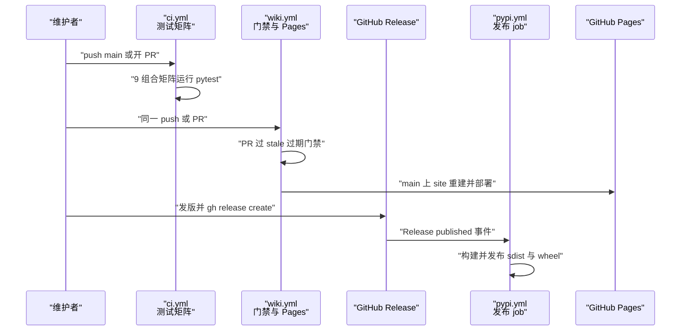
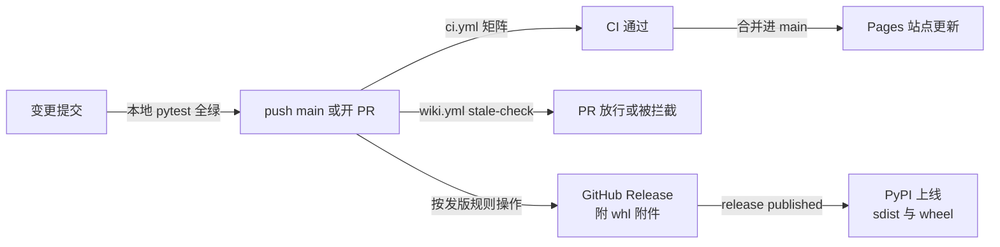

# CI 与发布流水线

## 目录
1. [简介](#简介)
2. [流程总览](#流程总览)
3. [关键步骤](#关键步骤)
4. [参与组件](#参与组件)
5. [数据与状态变化](#数据与状态变化)
6. [故障排查指南](#故障排查指南)
7. [结论](#结论)

## 简介

本页描述 repowiki 从一次 push 到 PyPI 上线与 GitHub Pages 更新的完整流水线。仓库共有三条 GitHub Actions workflow：ci.yml 在 push main 与所有 PR 上跑三平台 × Python 3.10-3.13 的测试矩阵 [ci.yml:1-14](file://.github/workflows/ci.yml#L1-L14)；wiki.yml 在 PR 上做只读的 wiki 过期门禁、在 push main（或手动）时重建单文件站点并发布到 Pages [wiki.yml:1-12](file://.github/workflows/wiki.yml#L1-L12)；pypi.yml 在 GitHub Release 发布时经 Trusted Publisher（OIDC 免 token）自动上传 sdist 与 wheel 到 PyPI [pypi.yml:1-14](file://.github/workflows/pypi.yml#L1-L14)。三条流水线之外，AGENTS.md 以仓库协作规则的形式约定了发版前的人工步骤（版本号、双语 CHANGELOG、wheel 附件、pytest 门禁、gh release create）[AGENTS.md:3-11](file://AGENTS.md#L3-L11)。

## 流程总览

端到端路径为：维护者 push 或开 PR → ci.yml 的 9 个矩阵 job 回归 pytest → PR 侧同时被 wiki.yml 的 stale 门禁检查（wiki 过期则评论并拦截）→ 合并进 main 后 wiki.yml 的 publish-pages job 重建站点并部署 Pages → 维护者按 AGENTS.md 规则打 wheel、附 Release 并 `gh release create` → Release published 事件触发 pypi.yml，构建产物经 OIDC 免 token 发布到 PyPI。三条 workflow 相互独立、可按需单独禁用 [wiki.yml:12](file://.github/workflows/wiki.yml#L12)。

**图表来源**
- [ci.yml:1-24](file://.github/workflows/ci.yml#L1-L24)
- [wiki.yml:14-24](file://.github/workflows/wiki.yml#L14-L24)
- [pypi.yml:16-25](file://.github/workflows/pypi.yml#L16-L25)
- [AGENTS.md:3-11](file://AGENTS.md#L3-L11)

**章节来源**
- [ci.yml:1-24](file://.github/workflows/ci.yml#L1-L24)
- [wiki.yml:1-24](file://.github/workflows/wiki.yml#L1-L24)
- [pypi.yml:1-25](file://.github/workflows/pypi.yml#L1-L25)
- [AGENTS.md:3-11](file://AGENTS.md#L3-L11)

## 关键步骤

### 步骤 1：持续集成测试矩阵（ci.yml）

- 输入：push 到 main 的提交，或任意 pull_request 事件 [ci.yml:3-7](file://.github/workflows/ci.yml#L3-L7)。
- 处理：以 fail-fast: false 的策略展开 ubuntu / macos / windows 三平台与 Python 3.10-3.13 四版本的 9 组合矩阵；每个组合依次执行 checkout（actions/checkout@v4）、setup-python（actions/setup-python@v5）、`pip install -e .[test]` 与 `pytest` [ci.yml:8-24](file://.github/workflows/ci.yml#L8-L24)。
- 失败路径：任一组合测试失败即该 job 失败、workflow 标红；因 fail-fast 关闭，其余组合仍会跑完，便于一次性看清跨平台问题面。

**章节来源**
- [ci.yml:1-24](file://.github/workflows/ci.yml#L1-L24)

### 步骤 2：PR 的 wiki 过期门禁（wiki.yml stale-check）

- 输入：pull_request 事件；仓库已跟踪 `.repowiki/`（至少 state/catalog.json 与内容目录）[wiki.yml:1-5](file://.github/workflows/wiki.yml#L1-L5)。
- 处理：仅在 PR 事件运行（if 条件门控）；checkout 带 fetch-depth: 0 取全历史，安装本包后执行 `repowiki stale . --since "origin/<base_ref>" --fail-if-stale --json` 并 tee 到 stale.json；该步 continue-on-error: true，把「已过期」与「执行出错」都收敛到 steps.stale.outcome 供后续步骤判别 [wiki.yml:26-47](file://.github/workflows/wiki.yml#L26-L47)。
- 失败路径：检出过期时先用 gh pr comment 把受影响的 pages / cards / modules 以 JSON 代码块评论到 PR（附刷新方式：合并后在 main 执行 update、finalize、site），随后独立步骤 `exit 1` 拦截合并 [wiki.yml:48-68](file://.github/workflows/wiki.yml#L48-L68)。

**章节来源**
- [wiki.yml:26-68](file://.github/workflows/wiki.yml#L26-L68)

### 步骤 3：Pages 发布（wiki.yml publish-pages）

- 输入：push main 或手动 workflow_dispatch（非 PR 事件）；仓库已 finalize 出 metadata [wiki.yml:1-12](file://.github/workflows/wiki.yml#L1-L12) [wiki.yml:70-72](file://.github/workflows/wiki.yml#L70-L72)。
- 处理：安装本包后执行 `repowiki site .` 重建 wiki.html 与 llms.txt / llms-full.txt；随后把全部 locale 下的这三个产物收进 `_site/`（保留 zh/en 目录层级），并生成一段 meta refresh 的 `_site/index.html` 跳到首个存在的 locale 站点；最后经 actions/upload-pages-artifact@v3 与 actions/deploy-pages@v4 部署到 Pages 环境 github-pages [wiki.yml:81-106](file://.github/workflows/wiki.yml#L81-L106)。
- 失败路径：job 需要 pages: write 与 id-token: write 权限及 Pages 环境配置；仓库未跟踪 metadata 时因缺 metadata 失败（文件头注释说明此时可禁用本 job）[wiki.yml:11-12](file://.github/workflows/wiki.yml#L11-L12) [wiki.yml:74-80](file://.github/workflows/wiki.yml#L74-L80)。

**章节来源**
- [wiki.yml:70-106](file://.github/workflows/wiki.yml#L70-L106)

### 步骤 4：PyPI Trusted Publisher 发布（pypi.yml）

- 输入：GitHub Release 的 published 事件，或 Actions 页面手动 workflow_dispatch [pypi.yml:16-21](file://.github/workflows/pypi.yml#L16-L21)。
- 处理：publish job 运行于 ubuntu、Python 3.12、environment pypi；先 `python -m build` 构建 sdist 与 wheel，再用 pypa/gh-action-pypi-publish@release/v1 发布 [pypi.yml:27-41](file://.github/workflows/pypi.yml#L27-L41)。
- 失败路径：认证不走 API token——workflow 仅声明 contents: read 与 id-token: write，身份由 GitHub OIDC 证明，因此 PyPI 侧必须预先登记 Trusted Publisher（未上传过首版的项目用 Pending Publisher 预登记：项目名 repowiki-cli、Owner luomsis、Repository repowiki、Workflow 文件名 pypi.yml、Environment pypi），登记不符则发布被拒 [pypi.yml:1-14](file://.github/workflows/pypi.yml#L1-L14) [pypi.yml:23-25](file://.github/workflows/pypi.yml#L23-L25)。

**章节来源**
- [pypi.yml:1-41](file://.github/workflows/pypi.yml#L1-L41)

### 步骤 5：人工发版规则（AGENTS.md）

- 输入：待发布的成套变更（代码、文档、测试均就绪）。
- 处理：按 AGENTS.md 发版规则的编号流程执行——同步升级 pyproject.toml 与 .claude-plugin/plugin.json 的版本号；在 CHANGELOG.md 与 CHANGELOG.en.md 各加一节（按新增 / 修复 / 文档 / 测试 / 清理分类）；用 `python -m build --wheel` 打出 dist/repowiki_cli-<版本>-py3-none-any.whl；把 whl 作为 asset 附到 GitHub Release（离线安装一节直接引用它）；本地 pytest 全绿后，push main 并 `gh release create vX.Y.Z --target <HEAD sha>`，Release 的发布随即触发步骤 4 的自动上传 [AGENTS.md:5-11](file://AGENTS.md#L5-L11)。
- 失败路径：测试门禁不绿则中止发版；whl 附件缺失会破坏 README 约定的离线安装路径；首次发布前若漏做 PyPI 侧 Pending Publisher 预登记，步骤 4 会失败 [AGENTS.md:7-11](file://AGENTS.md#L7-L11)。

**章节来源**
- [AGENTS.md:3-11](file://AGENTS.md#L3-L11)

## 参与组件

- AGENTS.md：流程的人工起点——发版规则的唯一载体，约定版本号同步、双语 CHANGELOG、wheel 打包与 Release 创建 [AGENTS.md:1-11](file://AGENTS.md#L1-L11)。
- ci.yml：质量门禁——push 与 PR 上的三平台 × 四 Python 版本 pytest 矩阵 [ci.yml:8-24](file://.github/workflows/ci.yml#L8-L24)。
- wiki.yml（stale-check job）：PR 侧只读门禁——diff 映射受影响 wiki 页面，过期即评论并拦截 [wiki.yml:26-68](file://.github/workflows/wiki.yml#L26-L68)。
- wiki.yml（publish-pages job）：main 侧发布——`repowiki site` 重建后部署 Pages [wiki.yml:70-106](file://.github/workflows/wiki.yml#L70-L106)。
- GitHub Release：发布事件源——published 事件是 pypi.yml 的唯一自动触发器 [pypi.yml:18-21](file://.github/workflows/pypi.yml#L18-L21)。
- pypi.yml（publish job）：终点之一——构建 sdist 与 wheel 并经 OIDC Trusted Publisher 上线 PyPI [pypi.yml:27-41](file://.github/workflows/pypi.yml#L27-L41)。
- GitHub Pages 与 PyPI：两大产出终点——前者承载 wiki.html 与 llms 索引，后者承载安装包 [wiki.yml:88-106](file://.github/workflows/wiki.yml#L88-L106) [pypi.yml:36-41](file://.github/workflows/pypi.yml#L36-L41)。

**章节来源**
- [AGENTS.md:3-11](file://AGENTS.md#L3-L11)
- [ci.yml:1-24](file://.github/workflows/ci.yml#L1-L24)
- [wiki.yml:26-106](file://.github/workflows/wiki.yml#L26-L106)
- [pypi.yml:16-41](file://.github/workflows/pypi.yml#L16-L41)

## 数据与状态变化

流水线的输入是 git 推送与 Release 事件，副作用集中在四处：PyPI 上的新版本（sdist 与 wheel）、Pages 上的新站点（wiki.html 与 llms.txt / llms-full.txt）、PR 上的过期评论、以及 Release 页新增的 whl 附件。状态迁移上，一次变更要先后通过「本地 pytest 门禁」「CI 矩阵门禁」「stale 门禁」三道检查才进入 main；进入 main 后站点随每次 push 自动重建；只有显式创建 Release 才会把构建产物推向 PyPI [AGENTS.md:9-11](file://AGENTS.md#L9-L11) [wiki.yml:6-9](file://.github/workflows/wiki.yml#L6-L9)。

**图表来源**
- [AGENTS.md:5-11](file://AGENTS.md#L5-L11)
- [ci.yml:3-24](file://.github/workflows/ci.yml#L3-L24)
- [wiki.yml:26-47](file://.github/workflows/wiki.yml#L26-L47)
- [pypi.yml:16-41](file://.github/workflows/pypi.yml#L16-L41)

**章节来源**
- [AGENTS.md:3-11](file://AGENTS.md#L3-L11)
- [wiki.yml:1-12](file://.github/workflows/wiki.yml#L1-L12)
- [pypi.yml:1-25](file://.github/workflows/pypi.yml#L1-L25)

## 故障排查指南

- CI 某个平台或 Python 版本失败：矩阵 fail-fast 已关闭，其余组合继续执行；在 Actions 日志中按失败组合定位，通常是平台相关行为差异 [ci.yml:10-15](file://.github/workflows/ci.yml#L10-L15)。
- PR 被 wiki staleness gate 拦截（stale-check 步骤 exit 1）：说明 diff 命中了 wiki 覆盖的源码；查看 PR 上自动评论中的受影响 pages / cards / modules 清单，按评论给出的刷新方式在合并后的 main 上执行 update、finalize、site [wiki.yml:48-68](file://.github/workflows/wiki.yml#L48-L68)。
- stale-check 直接报错而非判过期：仓库尚未跟踪 `.repowiki/`（缺 catalog 时 stale 必然失败）；先提交 wiki 产物或禁用该 job——两个 job 相互独立，可单独禁用 [wiki.yml:11-12](file://.github/workflows/wiki.yml#L11-L12)。
- publish-pages 失败：常见于仓库未跟踪 metadata（未 finalize）或 Pages 权限 / 环境未配置；确认 metadata 存在且 job 拥有 pages: write 与 id-token: write [wiki.yml:11-12](file://.github/workflows/wiki.yml#L11-L12) [wiki.yml:74-80](file://.github/workflows/wiki.yml#L74-L80)。
- pypi.yml 发布被 PyPI 拒绝：Trusted Publisher 登记与实际不符——核对项目名 repowiki-cli、Owner luomsis、Repository repowiki、Workflow 文件名 pypi.yml、Environment pypi 五项必须完全一致（文件名与 environment 尤其要求精确匹配）[pypi.yml:3-11](file://.github/workflows/pypi.yml#L3-L11)。
- 发版后 PyPI 没有新版本：确认 Release 状态确为 published（draft 不触发）、且 AGENTS.md 规则中的 `gh release create` 指向了已 push 的 HEAD sha [pypi.yml:18-21](file://.github/workflows/pypi.yml#L18-L21) [AGENTS.md:10-11](file://AGENTS.md#L10-L11)。
- 离线安装路径失效：Release 页缺少 repowiki_cli-*.whl 附件；按发版规则第 4 条补传（gh release upload）[AGENTS.md:8](file://AGENTS.md#L8)。

**章节来源**
- [ci.yml:8-24](file://.github/workflows/ci.yml#L8-L24)
- [wiki.yml:11-12](file://.github/workflows/wiki.yml#L11-L12)
- [wiki.yml:48-68](file://.github/workflows/wiki.yml#L48-L68)
- [wiki.yml:74-80](file://.github/workflows/wiki.yml#L74-L80)
- [pypi.yml:3-21](file://.github/workflows/pypi.yml#L3-L21)
- [AGENTS.md:8-11](file://AGENTS.md#L8-L11)

## 结论

这条流水线的适用边界清晰：ci.yml 守质量，wiki.yml 守「文档不过期」与站点常新，pypi.yml 守发布，三者相互独立、可按需禁用，任何一步都不依赖 agent 参与——CI 内只有确定性命令（pytest、repowiki stale、repowiki site、python -m build）[wiki.yml:1-12](file://.github/workflows/wiki.yml#L1-L12)。正确的使用方式是：日常变更走 push / PR 让矩阵与 stale 门禁自动把关；发版严格按 AGENTS.md 的编号规则走，特别是先本地 pytest 全绿、whl 必须附上 Release；首次发布前完成 PyPI 侧 Pending Publisher 预登记，此后新版本从 Release 到 PyPI 全自动、全程免 token [AGENTS.md:3-11](file://AGENTS.md#L3-L11) [pypi.yml:1-14](file://.github/workflows/pypi.yml#L1-L14)。

**章节来源**
- [ci.yml:1-24](file://.github/workflows/ci.yml#L1-L24)
- [wiki.yml:1-12](file://.github/workflows/wiki.yml#L1-L12)
- [pypi.yml:1-41](file://.github/workflows/pypi.yml#L1-L41)
- [AGENTS.md:3-11](file://AGENTS.md#L3-L11)

<cite>
**本文引用的文件**
- [ci.yml](file://.github/workflows/ci.yml)
- [pypi.yml](file://.github/workflows/pypi.yml)
- [wiki.yml](file://.github/workflows/wiki.yml)
- [AGENTS.md](file://AGENTS.md)
</cite>
