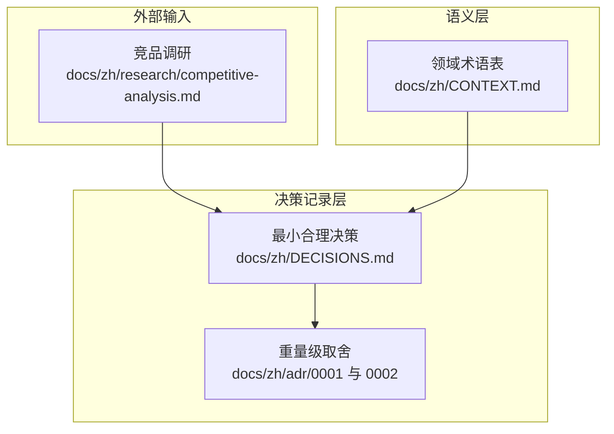
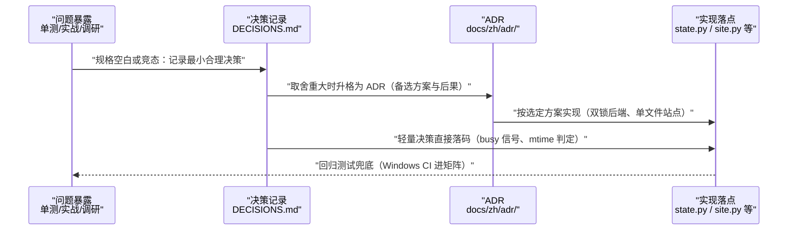
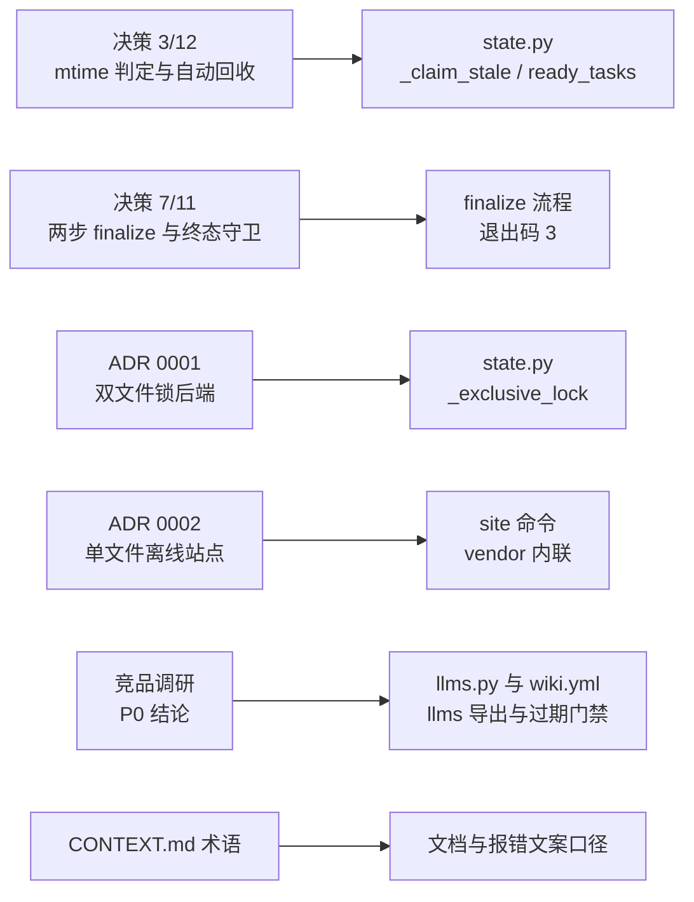

# 架构决策与术语

## 目录
1. [简介](#简介)
2. [项目结构](#项目结构)
3. [核心组件](#核心组件)
4. [架构总览](#架构总览)
5. [详细组件分析](#详细组件分析)
6. [依赖关系分析](#依赖关系分析)
7. [性能与一致性考量](#性能与一致性考量)
8. [故障排查指南](#故障排查指南)
9. [结论](#结论)

## 简介

repowiki 的设计决策沉淀在 docs/zh 目录的三类文档中：DECISIONS.md 记录实现过程中规格空白处的最小合理决策（遇到空白不得臆造，逐条记录理由与暴露途径），docs/zh/adr/ 下两份 ADR 承载需要权衡备选方案的重量级取舍（Windows 原生支持的锁后端、单文件离线站点），CONTEXT.md 提供三组领域术语表（产物、编排、执行）并给每条术语标注 Avoid list 以统一表述边界。配套的竞品调研报告则给出「差距不在生成质量，在分发摩擦与生态接口」的定位结论，直接驱动了 llms 导出、stale 门禁等 P0 项落地。本页汇总这些决策的要点、动机与落点，是理解代码形态「为什么长这样」的索引。

章节来源
- [docs/zh/DECISIONS.md:1-5](file://docs/zh/DECISIONS.md#L1-L5)
- [docs/zh/research/competitive-analysis.md:8-16](file://docs/zh/research/competitive-analysis.md#L8-L16)

## 项目结构

设计决策文档集中于 docs/zh 之下，与英文版镜像：

- `docs/zh/DECISIONS.md`：最小合理决策记录，现有 17 条，每条含决策内容、理由与暴露途径（哪个测试或实战场景）。
- `docs/zh/CONTEXT.md`：领域术语表，按产出物、编排、执行三组组织，每组术语附 Avoid（禁用近义词）。
- `docs/zh/adr/0001-windows-native-support.md`：Windows 原生支持的 stdlib 双文件锁后端取舍。
- `docs/zh/adr/0002-single-file-offline-site.md`：单文件离线 HTML 查看器的备选方案与后果。
- `docs/zh/research/competitive-analysis.md`：竞品调研（DeepWiki、DeepWiki-Open、CodeWiki、GitDiagram、Swimm、Repomix）与 P0-P2 改进分级。

图表来源
- [docs/zh/DECISIONS.md:1-5](file://docs/zh/DECISIONS.md#L1-L5)
- [docs/zh/adr/0001-windows-native-support.md:1-3](file://docs/zh/adr/0001-windows-native-support.md#L1-L3)
- [docs/zh/CONTEXT.md:1-5](file://docs/zh/CONTEXT.md#L1-L5)

章节来源
- [docs/zh/DECISIONS.md:1-5](file://docs/zh/DECISIONS.md#L1-L5)
- [docs/zh/CONTEXT.md:7-77](file://docs/zh/CONTEXT.md#L7-L77)

## 核心组件

- DECISIONS.md 决策条目：规格空白处的就地决策记录，典型如 busy 信号、认领过期以目录 mtime 判定、两步 finalize、过期认领自动回收、不做 pid 存活检测等。
- ADR 0001（Windows 原生支持）：按平台选择 stdlib 锁后端，POSIX 用 fcntl、Windows 用 msvcrt.locking，零新增依赖。
- ADR 0002（单文件离线站点）：`site` 命令生成完全自包含的 wiki.html，回撤原 Non-Goal 中的「HTML 预览」条目并改述为「不做常驻预览服务器」。
- CONTEXT.md 术语表：仓库 Wiki、Wiki 页面、章节、总览、源码引用、任务、任务规格、Worker、认领、心跳等核心名词的边界定义与 Avoid list。
- 竞品调研结论：赛道差距在分发摩擦与生态接口而非生成质量，据此采纳 P0 四项（llms 导出、PyPI 元数据、stale 门禁与 GitHub Action）。

章节来源
- [docs/zh/DECISIONS.md:7-62](file://docs/zh/DECISIONS.md#L7-L62)
- [docs/zh/adr/0001-windows-native-support.md:5-7](file://docs/zh/adr/0001-windows-native-support.md#L5-L7)
- [docs/zh/adr/0002-single-file-offline-site.md:5-10](file://docs/zh/adr/0002-single-file-offline-site.md#L5-L10)
- [docs/zh/CONTEXT.md:9-77](file://docs/zh/CONTEXT.md#L9-L77)

## 架构总览

决策文档的演化是一条「实战暴露 → 记录决策 → 沉淀为代码不变量」的管线：单元测试或并发生成暴露竞态与规格空白后，按执行规则先在 DECISIONS.md 记录最小合理决策及其理由；当取舍涉及多个备选方案与长期后果时升格为独立 ADR（记录 Considered Options 与 Consequences）；术语边界由 CONTEXT.md 统一，避免文档与校验器报错口径漂移。竞品调研作为外部输入，其结论经第 15、16 条决策转化为具体特性（site 导出、stale 门禁、archetype 原型、coverage 报告）。

图表来源
- [docs/zh/DECISIONS.md:1-5](file://docs/zh/DECISIONS.md#L1-L5)
- [docs/zh/adr/0001-windows-native-support.md:15-20](file://docs/zh/adr/0001-windows-native-support.md#L15-L20)
- [docs/zh/adr/0002-single-file-offline-site.md:18-24](file://docs/zh/adr/0002-single-file-offline-site.md#L18-L24)

章节来源
- [docs/zh/DECISIONS.md:1-5](file://docs/zh/DECISIONS.md#L1-L5)
- [docs/zh/adr/0001-windows-native-support.md:1-20](file://docs/zh/adr/0001-windows-native-support.md#L1-L20)

## 详细组件分析

### DECISIONS.md：17 条最小合理决策

- 职责：为计划规格未覆盖的空白就地补决策，要求「遇规格空白不得臆造，记录于此」，每条附暴露途径（哪个测试或哪次实战）。
- 关键行为：影响并发核心的条目包括——busy 信号（无任务但 busy>0 时 worker 必须等待重试，防提前退出）；认领过期以 claim 目录 mtime 为准而非 ts 文件（堵住新建认领被误抢的竞态）；attempt 计数每次 claim 加一并升序排队（失败任务不插队）；过期认领自动回收（实战中 worker 退出冻结 25% 队列 50 分钟后，ready_tasks 纳入「in_progress 且认领过期」，stale 窗口 45 缩至 15 分钟）；不做 pid 存活检测（短命 CLI 进程的 pid 无意义，touch 心跳是唯一存活信号），且 next 不按 ID 发放以保持纯 FIFO。
- 实现要点：生命周期守卫组（第 11 条）确立 done 终态、check 显式 `--task`/`--all`、exhausted 需 `release --force`、finalize 两步（首次退出码 3 为进展）等不变量；第 14 条把占位符扫描限定为非代码文本并在 catalog 源头拒绝占位符标题；第 16、17 条记录 P1 四项取舍与范围冻结（语言冻结 zh/en、CLI 消息维持中文、Roadmap 移除、分发名 repowiki-cli）。

章节来源
- [docs/zh/DECISIONS.md:7-62](file://docs/zh/DECISIONS.md#L7-L62)
- [docs/zh/DECISIONS.md:38-49](file://docs/zh/DECISIONS.md#L38-L49)
- [docs/zh/DECISIONS.md:63-86](file://docs/zh/DECISIONS.md#L63-L86)

### ADR 0001：Windows 原生支持的锁后端取舍

- 职责：记录从「WSL-only」到「Windows 原生支持」的方案选择。
- 关键行为：选定按平台选择 stdlib 锁后端——POSIX 保持 fcntl.flock，Windows 用 msvcrt.locking（约 20 行，零新增依赖），语义同为单机阻塞独占锁。
- 实现要点：备选方案明确否决 portalocker（打破唯一依赖 pyyaml 的定位）与「原子 mkdir 重造锁」（需重写并发核心，风险最高）；已知语义差异是 msvcrt 约 10 秒抢不到锁抛错（fcntl 无限阻塞），已映射为带重试提示的 StateError；Windows CI 进入矩阵作回归兜底。

章节来源
- [docs/zh/adr/0001-windows-native-support.md:5-13](file://docs/zh/adr/0001-windows-native-support.md#L5-L13)
- [docs/zh/adr/0001-windows-native-support.md:15-20](file://docs/zh/adr/0001-windows-native-support.md#L15-L20)

### ADR 0002：单文件离线站点

- 职责：记录「给生成的文档加一个 web 页面」需求的方案选择与 Non-Goal 回撤理由。
- 关键行为：选定 finalize 之后由独立命令 `site` 生成一个自包含 HTML——全部页面、被引用源码行区间、marked 与 mermaid 渲染库全部内嵌，浏览器双击即看，零服务器零网络；排除的本意是「不做常驻服务」，静态单文件不违背初衷，Non-Goals 相应改述为「不做常驻预览服务器」。
- 实现要点：否决本地 serve 命令（常驻进程、不如单文件易分享）、Python 端渲染（新增依赖且 mermaid 仍需浏览器或 CDN）与 CDN 引用（离线打开无法渲染）；代价是每个 wiki.html 约 4-5 MB（mermaid 约 3.5 MB），vendor 的 minified JS 随仓库与 wheel 分发；站点为纯派生产物，幂等可重跑，clean 后仍可从磁盘页面重建；页间零链接的既定设计不变，导航由目录规划树派生。

章节来源
- [docs/zh/adr/0002-single-file-offline-site.md:5-16](file://docs/zh/adr/0002-single-file-offline-site.md#L5-L16)
- [docs/zh/adr/0002-single-file-offline-site.md:18-24](file://docs/zh/adr/0002-single-file-offline-site.md#L18-L24)

### CONTEXT.md 术语表与 Avoid list

- 职责：统一文档与校验报错的领域词汇，每组术语显式标注不应使用的近义词。
- 关键行为：产出物组界定仓库 Wiki、Wiki 页面、章节、总览、源码引用、元数据索引、知识卡片与 Wiki 站点（单文件离线 HTML，Avoid「网页版」因为不经过服务器）；编排组界定目录规划、任务（状态仅 pending/in_progress/done/failed/exhausted）、任务规格（Avoid「prompt」）与阶段（目录规划到页面到总览的门控）；执行组界定 Worker（Avoid「agent」以免与驱动 CLI 的 agent 混淆）、认领（原子独占，Avoid「锁」）、过期认领（自动回收即队列自愈）与心跳（唯一存活信号）。
- 实现要点：Avoid list 直接对应易混淆概念——「锚点」仅指页内目录跳转、「目录」保留给 Catalog 语义、「章节」不叫模块，写文档与报错文案时应遵循。

章节来源
- [docs/zh/CONTEXT.md:9-42](file://docs/zh/CONTEXT.md#L9-L42)
- [docs/zh/CONTEXT.md:43-59](file://docs/zh/CONTEXT.md#L43-L59)
- [docs/zh/CONTEXT.md:61-77](file://docs/zh/CONTEXT.md#L61-L77)

### 竞品调研的定位结论

- 职责：为「该往哪里投入」提供外部参照，落盘为可追溯的调研报告（基线 v0.4.0，2026-09-07）。
- 关键行为：结论认定「仓库到 wiki」赛道拥挤（DeepWiki、DeepWiki-Open、CodeWiki 等），但它们全部走内置 LLM 的云端或本地服务路线，repowiki 的「确定性编排加智能外包给任意 agent 加代码不出本机」定位在开源界无人重合；差距不在生成质量，在分发摩擦与生态接口；预警信号是 CodeWiki 已支持 Claude Code/Codex CLI 作为免 API key 后端，核心思路部分趋同、窗口期有限。
- 实现要点：据此采纳 P0 四项（llms 导出、PyPI 元数据、只读 stale 加 GitHub Action、对标 Swimm 的「文档不过期」门禁），P1（页面原型、知识类别可配置、coverage）列为下版本候选并已落地，P2（问答层、MCP、大仓库实证）待拍板。

章节来源
- [docs/zh/research/competitive-analysis.md:1-16](file://docs/zh/research/competitive-analysis.md#L1-L16)
- [docs/zh/DECISIONS.md:55-62](file://docs/zh/DECISIONS.md#L55-L62)
- [docs/zh/DECISIONS.md:63-80](file://docs/zh/DECISIONS.md#L63-L80)

## 依赖关系分析

- 决策到代码的映射：第 3、12 条（mtime 判定与自动回收）落在 state.py 的 `_claim_stale` 与 `ready_tasks`；第 7 条（两步 finalize）落在 finalize 流程与退出码 3；第 1 条（模块拆分）形成 plan.py 与 dispatch.py 的边界。
- ADR 到代码的映射：ADR 0001 落在 state.py 的 `_exclusive_lock`（fcntl/msvcrt 双后端）；ADR 0002 落在 site 命令与 vendor 内联策略。
- 术语到机制的映射：CONTEXT.md 的认领/心跳/过期认领对应 state.py 的 claim/touch/stale 回收；任务状态的五种取值与 stats 报告一致。
- 调研到特性的映射：第 15 条直接引用 research 报告全文，P0 项分别落在 llms.py、pyproject.toml 与 wiki.yml/stale 命令。

图表来源
- [docs/zh/DECISIONS.md:12-13](file://docs/zh/DECISIONS.md#L12-L13)
- [docs/zh/DECISIONS.md:38-45](file://docs/zh/DECISIONS.md#L38-L45)
- [docs/zh/adr/0001-windows-native-support.md:5-7](file://docs/zh/adr/0001-windows-native-support.md#L5-L7)
- [docs/zh/adr/0002-single-file-offline-site.md:5-9](file://docs/zh/adr/0002-single-file-offline-site.md#L5-L9)
- [docs/zh/DECISIONS.md:55-62](file://docs/zh/DECISIONS.md#L55-L62)

章节来源
- [docs/zh/DECISIONS.md:7-30](file://docs/zh/DECISIONS.md#L7-L30)
- [docs/zh/DECISIONS.md:55-62](file://docs/zh/DECISIONS.md#L55-L62)
- [docs/zh/CONTEXT.md:61-77](file://docs/zh/CONTEXT.md#L61-L77)

## 性能与一致性考量

- 决策一致性有据可查：每条决策附暴露途径（T5/T9 测试、40 页并发生成实战、6x12 压测），回溯决策时能同时找到验证它的场景。
- 语义单一来源：stale 判定统一为 claim 目录 mtime（废弃基于 index.heartbeat_at 的第二套判定），避免回收清扫与 busy 统计口径打架；archetype 不存任务记录而按任务 id 反查 catalog，重规划后旧任务不会校验错模板。
- 依赖极简作为决策约束：ADR 0001 与 0002 都以「不新增运行时依赖」为否决备选的重要理由，pyyaml 之外仅 vendor 两个 MIT 前端库。
- 范围冻结控制漂移：第 17 条把产出语言冻结为 zh/en、取消 CLI 双语计划、移除 Roadmap，防止方向性讨论反复重启；方向性讨论归 Discussions。
- 术语表的防漂移作用：Avoid list 在文档写作与代码报错两个出口同时约束用词，减少「同一概念多个名字」的认知成本。

章节来源
- [docs/zh/DECISIONS.md:38-45](file://docs/zh/DECISIONS.md#L38-L45)
- [docs/zh/DECISIONS.md:63-68](file://docs/zh/DECISIONS.md#L63-L68)
- [docs/zh/DECISIONS.md:81-86](file://docs/zh/DECISIONS.md#L81-L86)
- [docs/zh/adr/0001-windows-native-support.md:11-11](file://docs/zh/adr/0001-windows-native-support.md#L11-L11)

## 故障排查指南

- 想知道「某个行为为什么这样设计」：先查 DECISIONS.md 对应条目（并发类多在第 2、3、9、11、12、13 条，产物类在第 6、7、10、14 条），重量级取舍再看对应 ADR 的 Considered Options。
- Windows 上报「.index.lock 被其他进程长期占用」：这是 msvcrt.locking 约 10 秒拿不到锁的既知语义差异（fcntl 为无限阻塞），按提示确认持有锁的 repowiki 进程是否已退出后重试。
- 认领被误抢或冻结：核对 stale 窗口语义——过期以认领目录 mtime 为准、默认 15 分钟，worker 只要在执行期保持 touch 心跳即无误抢；死 worker 的任务由 ready_tasks 自动回收，无需人工 release。
- 文档用词不一致：以 CONTEXT.md 为准（如 Worker 不称 agent、认领不称锁、锚点仅指页内跳转）。
- 评估「为什么不做 MCP/问答层」：查竞品调研的 P2 分级与第 15 条决策——当前定位是分发摩擦优先，问答层与 MCP 待拍板。
- 需要恢复历史决策背景：决策条目中的测试编号与实战数字（如 6x12 压测、50 分钟冻结）是定位对应测试用例与 issue 的线索。

章节来源
- [docs/zh/DECISIONS.md:7-49](file://docs/zh/DECISIONS.md#L7-L49)
- [docs/zh/adr/0001-windows-native-support.md:18-19](file://docs/zh/adr/0001-windows-native-support.md#L18-L19)
- [docs/zh/CONTEXT.md:61-77](file://docs/zh/CONTEXT.md#L61-L77)
- [docs/zh/research/competitive-analysis.md:8-16](file://docs/zh/research/competitive-analysis.md#L8-L16)

## 结论

repowiki 的架构决策体系由三层构成：DECISIONS.md 以 17 条最小合理决策覆盖规格空白（每条带理由与暴露途径），两份 ADR 记录 Windows 双锁后端与单文件离线站点的备选权衡，CONTEXT.md 用三组术语表加 Avoid list 固定领域词汇；竞品调研报告则以「差距在分发摩擦与生态接口」的结论驱动了 llms 导出与 stale 门禁等特性。阅读源码前先过这批文档能显著降低理解成本；修改并发核心或产物格式前，应先核对相关决策条目与 ADR 的 Consequences，确认新方案不违背已记录的取舍理由，并在必要时追加新的决策记录。

章节来源
- [docs/zh/DECISIONS.md:1-5](file://docs/zh/DECISIONS.md#L1-L5)
- [docs/zh/adr/0001-windows-native-support.md:15-20](file://docs/zh/adr/0001-windows-native-support.md#L15-L20)
- [docs/zh/adr/0002-single-file-offline-site.md:18-24](file://docs/zh/adr/0002-single-file-offline-site.md#L18-L24)
- [docs/zh/CONTEXT.md:7-9](file://docs/zh/CONTEXT.md#L7-L9)

<cite>
**本文引用的文件**
- [docs/zh/DECISIONS.md](file://docs/zh/DECISIONS.md)
- [docs/zh/CONTEXT.md](file://docs/zh/CONTEXT.md)
- [docs/zh/adr/0001-windows-native-support.md](file://docs/zh/adr/0001-windows-native-support.md)
- [docs/zh/adr/0002-single-file-offline-site.md](file://docs/zh/adr/0002-single-file-offline-site.md)
- [docs/zh/research/competitive-analysis.md](file://docs/zh/research/competitive-analysis.md)
</cite>
