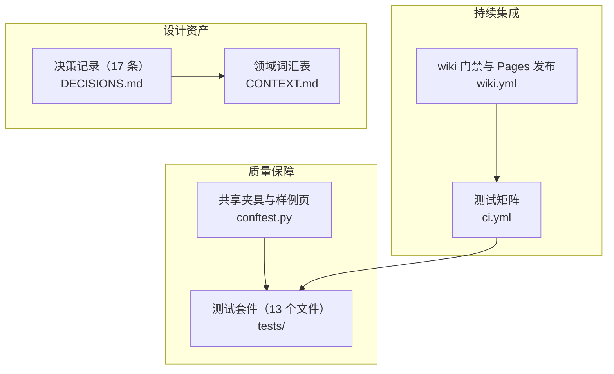
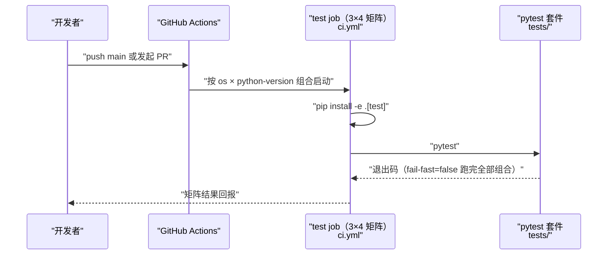
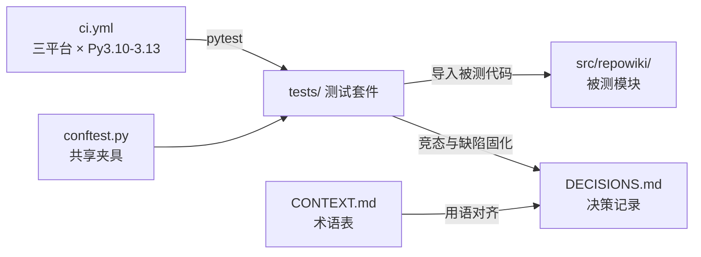

# 测试、CI 与设计决策

## 目录
1. [简介](#简介)
2. [项目结构](#项目结构)
3. [核心组件](#核心组件)
4. [架构总览](#架构总览)
5. [详细组件分析](#详细组件分析)
6. [依赖关系分析](#依赖关系分析)
7. [性能与一致性考量](#性能与一致性考量)
8. [故障排查指南](#故障排查指南)
9. [结论](#结论)

## 简介

本页描述 repowiki 的质量保障体系：tests/ 下的测试套件（conftest.py 与 12 个 test_*.py 共 13 个文件，README 声明 187 个单测）、.github/workflows/ci.yml 定义的三平台乘以 Python 3.10-3.13 的持续集成矩阵（配套 wiki.yml 的 wiki 门禁与 GitHub Pages 发布、pypi.yml 的 Trusted Publisher 发布），以及 docs/zh/DECISIONS.md 记录的规格空白处最小合理决策与 docs/zh/CONTEXT.md 的领域词汇表。三者共同落实项目的「确定性优先」理念：行为变更由全量测试门禁，实现中暴露的每一次规格空白都固化为可追溯的决策条目。

## 项目结构

- tests/conftest.py：共享夹具——合成 demo 仓库、repo / git_repo / paths fixture、合法 catalog 与两种原型（module / flow）的样例页面；
- tests/ 下 12 个 test_*.py：按状态并发、校验规则、端到端与双语、命令与报告四组划分覆盖面；
- .github/workflows/ci.yml：push main 与 PR 触发的测试矩阵；
- .github/workflows/wiki.yml：PR wiki 过期门禁与 push main 后的 GitHub Pages 发布（README.md:246-258）；
- docs/zh/DECISIONS.md：决策记录，当前 17 条，遇规格空白不臆造、记录于此（docs/zh/DECISIONS.md:1-5）；
- docs/zh/CONTEXT.md：领域词汇表，产出物 / 编排 / 执行三组术语，每条附 Avoid 对照（docs/zh/CONTEXT.md:7-77）。

图表来源
- [tests/conftest.py:1-11](file://tests/conftest.py#L1-L11)
- [.github/workflows/ci.yml:1-8](file://.github/workflows/ci.yml#L1-L8)

章节来源
- [tests/conftest.py:1-11](file://tests/conftest.py#L1-L11)
- [.github/workflows/ci.yml:1-8](file://.github/workflows/ci.yml#L1-L8)
- [README.md:260-275](file://README.md#L260-L275)

## 核心组件

- conftest 共享夹具（tests/conftest.py）：以一个 FILES 字典定义 13 个文件的合成仓库，提供 repo / git_repo / paths fixture 与合法 catalog、两种原型的样例页面。
- test_state.py（tests/test_state.py）：状态存储测试——claim / release、过期回收与一次真实多进程竞态（tests/test_state.py:1-2）。
- test_validate.py（tests/test_validate.py）：校验器测试——每条规则配正例与反例夹具（tests/test_validate.py:1-2）。
- test_flow.py 与 test_i18n.py（tests/test_flow.py、tests/test_i18n.py）：无 LLM 的端到端流（测试模拟 agent 的写入）与 zh / en 双语产出全流程（tests/test_flow.py:1-2）。
- test_stale.py 与 test_coverage.py（tests/test_stale.py、tests/test_coverage.py）：只读过期门禁与覆盖率统计（含知识卡联动、零引用页面旗标）。
- test_robustness.py（tests/test_robustness.py）：损坏状态文件与非法任务 id 必须以友好错误失败，绝不裸 traceback、绝不静默毁数据（tests/test_robustness.py:1-2）。
- ci.yml（.github/workflows/ci.yml）：ubuntu / macos / windows 乘以 Python 3.10-3.13 的测试矩阵。
- DECISIONS.md 与 CONTEXT.md：决策记录与术语表，是理解实现取舍的入口（docs/zh/DECISIONS.md:1-5）。

章节来源
- [tests/conftest.py:1-11](file://tests/conftest.py#L1-L11)
- [.github/workflows/ci.yml:9-24](file://.github/workflows/ci.yml#L9-L24)
- [README.md:270-275](file://README.md#L270-L275)

## 架构总览

CI 的运行路径为：开发者 push main 或提交 PR 触发 GitHub Actions；ci.yml 按 os 与 python-version 的组合启动 3 × 4 = 12 个 test job；每个 job 先 `pip install -e .[test]` 安装本地包与测试依赖，再运行 pytest 全量套件；由于 fail-fast 关闭，一次触发即可暴露全部平台组合的问题。PR 上另有 wiki.yml 以 `repowiki stale --fail-if-stale` 做 wiki 过期门禁，push main 后自动重建并发布单文件站点到 GitHub Pages（README.md:246-258）。

图表来源
- [.github/workflows/ci.yml:9-24](file://.github/workflows/ci.yml#L9-L24)

章节来源
- [.github/workflows/ci.yml:1-24](file://.github/workflows/ci.yml#L1-L24)
- [README.md:246-258](file://README.md#L246-L258)

## 详细组件分析

### 测试套件的组织与覆盖面

- 职责：以无 LLM、无网络的确定性测试覆盖全部核心行为，README 声明 187 个单测（README.md:275）。
- 关键行为（状态与并发）：test_state.py 覆盖 claim / release、stale 回收与多进程竞态；test_robustness.py 覆盖损坏状态文件与非法输入的友好报错（tests/test_state.py:1-2；tests/test_robustness.py:1-2）。
- 关键行为（校验与路径）：test_validate.py 对每条校验规则配正反例；test_paths_catalog.py 覆盖路径 sanitize / 锚点与 catalog schema（tests/test_validate.py:1-2；tests/test_paths_catalog.py:1-2）。
- 关键行为（端到端与双语）：test_flow.py 以「测试模拟 agent 写入」的方式跑端到端流程；test_i18n.py 补齐 en 语言的全流程（tests/test_flow.py:1-2；tests/test_i18n.py:1-2）。
- 关键行为（命令与报告）：test_stale.py 覆盖过期报告与 --fail-if-stale 门禁；test_coverage.py 覆盖覆盖率统计与零引用页面旗标；test_site.py 覆盖站点 payload 安全、导航结构与 clean 后降级模式；test_output.py 覆盖 emit 双路输出；test_skill_install.py 覆盖 skill 安装与版本戳；test_scanner.py 覆盖扫描器 git 与 walk 的奇偶性、忽略规则与截断（tests/test_stale.py:1-3；tests/test_coverage.py:1-2；tests/test_site.py:1-2；tests/test_output.py:1-2；tests/test_skill_install.py:1-2；tests/test_scanner.py:1-2）。

章节来源
- [tests/test_state.py:1-2](file://tests/test_state.py#L1-L2)
- [tests/test_validate.py:1-2](file://tests/test_validate.py#L1-L2)
- [tests/test_flow.py:1-2](file://tests/test_flow.py#L1-L2)
- [tests/test_stale.py:1-3](file://tests/test_stale.py#L1-L3)
- [tests/test_site.py:1-2](file://tests/test_site.py#L1-L2)
- [README.md:270-275](file://README.md#L270-L275)

### 共享夹具（conftest.py）

- 职责：为所有测试提供确定性的仓库样本与合法产出样例。
- 关键行为：FILES 字典内联合成一个微型 demo 服务（README、pyproject、src/demo 的 main / models / api / config / utils / log / errors、两个测试文件与一个构建脚本），恰好跨过 plan 的最小文件数门槛（tests/conftest.py:13-35）。
- 关键行为：make_repo 写出仓库，git=True 时额外执行 git init 与首次提交，供 update / stale 的 diff 路径测试；repo / git_repo / paths 三个 fixture 复用该构造（tests/conftest.py:38-69）。
- 实现要点：valid_catalog 提供含章节与页面两级节点的合法目录树；valid_page 给出 module 原型的完整合法页面；flow_page 给出 flow 原型的中英双语样例——三者是校验器正反例测试的基准语料（tests/conftest.py:72-97、100-193、203-371）。

章节来源
- [tests/conftest.py:13-69](file://tests/conftest.py#L13-L69)
- [tests/conftest.py:72-97](file://tests/conftest.py#L72-L97)
- [tests/conftest.py:100-193](file://tests/conftest.py#L100-L193)
- [tests/conftest.py:203-371](file://tests/conftest.py#L203-L371)

### CI 矩阵与发布流水线

- 职责：在三个操作系统与四个 Python 版本上回归全部测试，并衔接 wiki 门禁、Pages 发布与 PyPI 发布。
- 关键行为：ci.yml 由 push main 与 pull_request 触发；矩阵 os 为 ubuntu-latest / macos-latest / windows-latest，python-version 为 3.10 / 3.11 / 3.12 / 3.13，fail-fast: false；步骤为 checkout、setup-python、`pip install -e .[test]`、`pytest`（.github/workflows/ci.yml:1-24）。
- 关键行为：wiki.yml 提供两个独立 job——PR 的 `repowiki stale . --since origin/main --fail-if-stale` 过期门禁（拦截 wiki 过期的合并并评论受影响页面），以及 push main 后 `repowiki site` 重建发布 GitHub Pages（README.md:246-258）。
- 关键行为：PyPI 发布走 Trusted Publisher（pypi.yml，OIDC 免 token），分发名定为 repowiki-cli（`repowiki` 名被同用途项目占用，命令名与 import 包名保持不变）（docs/zh/DECISIONS.md:81-86）。

章节来源
- [.github/workflows/ci.yml:1-24](file://.github/workflows/ci.yml#L1-L24)
- [README.md:246-258](file://README.md#L246-L258)
- [docs/zh/DECISIONS.md:81-86](file://docs/zh/DECISIONS.md#L81-L86)

### 决策记录与术语表

- 职责：把实现过程中规格空白处的每一次取舍固化为可追溯的最小合理决策，并以统一词汇约束文档表达。
- 关键行为：DECISIONS.md 开篇即立规——「遇规格空白不得臆造，记录于此」；当前共 17 条，多数由并发单测与实战事故直接暴露（docs/zh/DECISIONS.md:1-5）。
- 关键行为（并发契约类）：busy 等待语义防止 worker 提前退出（第 2 条）；认领过期以目录 mtime 为准（第 3 条）；生命周期守卫——touch 心跳、done 终态、exhausted 上限、check 认领归属校验（第 11 条）；过期认领自动回收与 15 分钟 stale 窗口的平衡（第 12 条）；不做 pid 存活检测、next 不加 --task 保持纯 FIFO（第 13 条）（docs/zh/DECISIONS.md:7-13、31-49）。
- 关键行为（内容与校验类）：catalog 任务幂等与 --replan 入口（第 6 条）；两步 finalize 退出码 3（第 7 条）；占位符扫描剔除代码块、只查散文（第 14 条）；竞品调研后采纳 site 导出 llms 索引与 stale 门禁等 P0 四项（第 15 条）；页面原型 archetype、--dirty、overview 增量与自定义知识类别四项 P1 取舍（第 16 条）（docs/zh/DECISIONS.md:16-30、50-80）。
- 实现要点：CONTEXT.md 术语表分产出物 / 编排 / 执行三组，每条给出 Avoid 对照（例如认领 Avoid「锁」、心跳 Avoid「ping」），约束后续文档与消息的用语一致（docs/zh/CONTEXT.md:7-77）。

章节来源
- [docs/zh/DECISIONS.md:1-5](file://docs/zh/DECISIONS.md#L1-L5)
- [docs/zh/DECISIONS.md:7-49](file://docs/zh/DECISIONS.md#L7-L49)
- [docs/zh/DECISIONS.md:50-80](file://docs/zh/DECISIONS.md#L50-L80)
- [docs/zh/CONTEXT.md:7-77](file://docs/zh/CONTEXT.md#L7-L77)

## 依赖关系分析

- 测试的上游依赖：pytest（经 `pip install -e .[test]` 安装的 test extra）与被测的 repowiki 包本身；conftest.py 仅额外导入 repowiki.paths.WikiPaths 来构造路径对象（tests/conftest.py:7-11）。
- CI 的上游依赖：GitHub Actions 官方动作 actions/checkout@v4 与 actions/setup-python@v5，无需任何第三方 action（.github/workflows/ci.yml:17-20）。
- 测试与决策的联动：并发单测暴露的竞态（busy 语义、mtime 过期判定）固化为 DECISIONS.md 条目，决策条目又反过来约束后续实现的演进方向（docs/zh/DECISIONS.md:7-13）。
- 发布链路的依赖：Pages 发布依赖 ci 通过后的 wiki.yml；PyPI 发布依赖 Release 触发的 Trusted Publisher 配置，均不引入额外凭证（docs/zh/DECISIONS.md:81-86）。

图表来源
- [.github/workflows/ci.yml:9-24](file://.github/workflows/ci.yml#L9-L24)
- [tests/conftest.py:7-11](file://tests/conftest.py#L7-L11)

章节来源
- [tests/conftest.py:7-11](file://tests/conftest.py#L7-L11)
- [.github/workflows/ci.yml:17-20](file://.github/workflows/ci.yml#L17-L20)
- [docs/zh/DECISIONS.md:7-13](file://docs/zh/DECISIONS.md#L7-L13)
- [docs/zh/DECISIONS.md:81-86](file://docs/zh/DECISIONS.md#L81-L86)

## 性能与一致性考量

- fail-fast: false 使 12 个矩阵组合彼此独立跑完，一次 CI 触发即可得到全平台问题清单，而不是修一个暴露一个（.github/workflows/ci.yml:10-14）。
- 竞态测试用 multiprocessing 起真实并发进程验证认领互斥，而非模拟并发，保证测试结论对真实多 worker 场景可信（tests/test_state.py:1-2）。
- 测试全程无 LLM、无网络：端到端流由测试模拟 agent 的写入，回归成本低且结果确定，这是三平台乘四版本矩阵可日常运行的前提（tests/test_flow.py:1-2）。
- Windows 与 POSIX 的文件锁差异（msvcrt / fcntl）由 CI 矩阵中的 windows-latest 组合持续回归，防止平台特定竞态回归（.github/workflows/ci.yml:12-14）。
- 文档一致性由两道机制保障：DECISIONS.md 强制「空白不臆造」，CONTEXT.md 的 Avoid 对照约束术语使用，避免同一概念在文档中出现多个名字（docs/zh/DECISIONS.md:1-5；docs/zh/CONTEXT.md:7-77）。

章节来源
- [.github/workflows/ci.yml:9-24](file://.github/workflows/ci.yml#L9-L24)
- [tests/test_state.py:1-2](file://tests/test_state.py#L1-L2)
- [tests/test_flow.py:1-2](file://tests/test_flow.py#L1-L2)
- [docs/zh/DECISIONS.md:1-5](file://docs/zh/DECISIONS.md#L1-L5)
- [docs/zh/CONTEXT.md:7-77](file://docs/zh/CONTEXT.md#L7-L77)

## 故障排查指南

- 某平台 CI 失败而本地通过：优先怀疑平台文件锁差异（Windows 用 msvcrt、POSIX 用 fcntl）或路径大小写；在 ci.yml 矩阵中定位对应组合的日志复查（.github/workflows/ci.yml:12-14）。
- 本地 pytest 夹具异常（如 repo 目录缺失）：确认在仓库根运行 pytest、tests/conftest.py 可被收集，fixture 链为 repo / git_repo → paths（tests/conftest.py:56-69）。
- 修改校验规则后大量测试变红：先对照 test_validate.py 的正反例夹具确认是规则变更还是夹具过期；样例页面以 valid_page 与 flow_page 为基准（tests/conftest.py:100-193；tests/test_validate.py:1-2）。
- PR 被 wiki 过期门禁拦截：本地运行 `repowiki stale . --since origin/main` 查看受影响页面，重新生成后推送（README.md:246-258）。
- 对某个实现取舍有疑问：先查 DECISIONS.md 是否已有对应条目（含背景与事故来源），避免重复讨论或推翻已有结论（docs/zh/DECISIONS.md:1-5）。
- 术语使用分歧：以 CONTEXT.md 的术语与 Avoid 对照为准，不另造同义词（docs/zh/CONTEXT.md:7-77）。

章节来源
- [.github/workflows/ci.yml:12-14](file://.github/workflows/ci.yml#L12-L14)
- [tests/conftest.py:56-69](file://tests/conftest.py#L56-L69)
- [tests/conftest.py:100-193](file://tests/conftest.py#L100-L193)
- [README.md:246-258](file://README.md#L246-L258)
- [docs/zh/DECISIONS.md:1-5](file://docs/zh/DECISIONS.md#L1-L5)

## 结论

测试、CI 与设计决策三者构成 repowiki「确定性优先」的质量闭环：13 个测试文件以合成仓库与无 LLM 的端到端流覆盖竞态、校验规则、双语产出与损坏恢复；CI 在三平台乘四个 Python 版本上全矩阵回归，并以 wiki 门禁、Pages 发布与 Trusted Publisher 打通从合并到分发的链路；DECISIONS.md 与 CONTEXT.md 则把每一次规格空白与术语取舍沉淀为可追溯的文字。正确使用方式：行为变更先跑全量 pytest；发现规格空白时新增 DECISIONS 条目而非临时拍板；文档措辞对齐 CONTEXT.md 的术语表。

章节来源
- [tests/conftest.py:1-11](file://tests/conftest.py#L1-L11)
- [.github/workflows/ci.yml:1-24](file://.github/workflows/ci.yml#L1-L24)
- [docs/zh/DECISIONS.md:1-5](file://docs/zh/DECISIONS.md#L1-L5)
- [README.md:260-275](file://README.md#L260-L275)

<cite>
**本文引用的文件**
- [conftest.py](file://tests/conftest.py)
- [ci.yml](file://.github/workflows/ci.yml)
- [DECISIONS.md](file://docs/zh/DECISIONS.md)
- [CONTEXT.md](file://docs/zh/CONTEXT.md)
- [README.md](file://README.md)
</cite>
