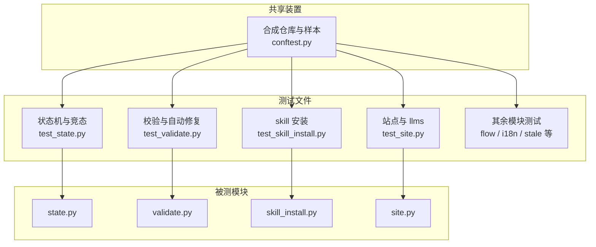
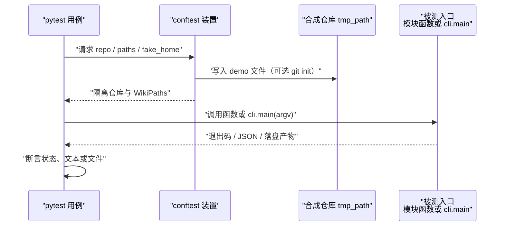
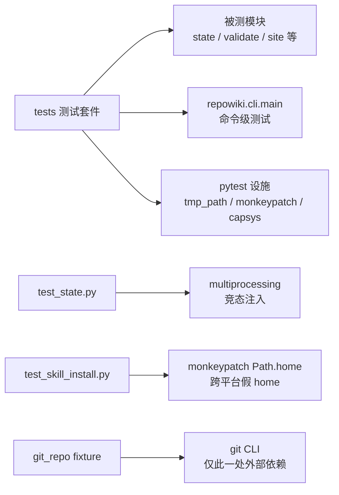

# 测试套件

## 目录
1. [简介](#简介)
2. [项目结构](#项目结构)
3. [核心组件](#核心组件)
4. [架构总览](#架构总览)
5. [详细组件分析](#详细组件分析)
6. [依赖关系分析](#依赖关系分析)
7. [性能与一致性考量](#性能与一致性考量)
8. [故障排查指南](#故障排查指南)
9. [结论](#结论)

## 简介

repowiki 的测试套件是一套完全不依赖 LLM 的 pytest 测试：测试自己模拟 agent 的写入动作，从而端到端地覆盖任务状态机与并发认领、页面校验与自动修复、skill 安装、单文件站点与 llms 导出等全部核心模块。共享装置集中在 `tests/conftest.py`，提供一个合成的微型示例仓库以及合法的 catalog、module 页与 flow 页样本；测试通过 `pip install -e '.[test]'` 安装后以 `pytest` 运行，CI 在三大平台与多个 Python 版本上回归。

## 项目结构

tests/ 目录按被测模块一一对应组织：

- `tests/conftest.py`：共享 fixture——合成示例仓库（README、pyproject、src/demo 包、tests、scripts 共 13 个文件）与 valid_catalog、valid_page、flow_page 三类合法样本。
- `tests/test_state.py`：任务状态机（认领、冲突、释放、过期回收、阶段门控）与多进程竞态。
- `tests/test_validate.py`：校验器每条规则的正例与反例，以及确定性自动修复行为。
- `tests/test_skill_install.py`：skill 随包分发、六种目标目录映射、版本戳幂等与状态判定。
- `tests/test_site.py`：单文件站点组装、源码片段内嵌、payload 注入防护、降级模式与 llms.txt 导出。
- 其余文件：`test_flow.py`（端到端流程）、`test_i18n.py`（语言检测与双语产出）、`test_stale.py`（只读过期映射）、`test_coverage.py`（覆盖率报告）、`test_scanner.py`（扫描器）、`test_paths_catalog.py`（路径与 catalog 模式）、`test_output.py`（双格式输出）、`test_robustness.py`（新手会踩到的失败路径）。
- pytest 配置位于 `pyproject.toml`：`testpaths = ["tests"]`，默认 `-q`；测试依赖为 `[test]` extra 的 pytest。

图表来源
- [tests/conftest.py:56-69](file://tests/conftest.py#L56-L69)
- [pyproject.toml:36-37](file://pyproject.toml#L36-L37)
- [pyproject.toml:48-50](file://pyproject.toml#L48-L50)

章节来源
- [tests/conftest.py:1-1](file://tests/conftest.py#L1-L1)
- [tests/test_state.py:1-1](file://tests/test_state.py#L1-L1)
- [tests/test_validate.py:1-1](file://tests/test_validate.py#L1-L1)
- [tests/test_site.py:1-2](file://tests/test_site.py#L1-L2)
- [tests/test_skill_install.py:1-1](file://tests/test_skill_install.py#L1-L1)

## 核心组件

- make_repo 与 repo / git_repo fixture：在 pytest 的 tmp_path 里落出合成 demo 仓库，可选执行 git init 与首次提交。
- valid_catalog / valid_page / flow_page：合法的 catalog 结构、module 原型页面与 flow 原型页面（zh / en 双语）的「金标准」样本。
- store fixture：以 `stale_seconds=2` 构造 TaskStore 并灌入 20 个任务，把过期回收实验压缩到秒级。
- fake_home / fake_version fixture：monkeypatch `Path.home` 与包版本号，让 skill 安装测试在隔离的假 home 中进行。
- build_finished_wiki：在站点测试中模拟一次已完成的全流程（catalog + 页面 + metadata）。

章节来源
- [tests/conftest.py:38-69](file://tests/conftest.py#L38-L69)
- [tests/test_state.py:17-22](file://tests/test_state.py#L17-L22)
- [tests/test_skill_install.py:16-27](file://tests/test_skill_install.py#L16-L27)
- [tests/test_site.py:37-42](file://tests/test_site.py#L37-L42)

## 架构总览

测试统一遵循「装置准备 → 驱动被测入口 → 断言产物」的三段式：conftest 造出隔离的合成仓库，用例或直接调用模块函数（如 `check_page`）、或经由 `cli.main` 走完整命令路径，再对退出码、JSON 输出与落盘文件做断言；全程无 LLM，agent 的写入行为由测试自身模拟。

图表来源
- [tests/conftest.py:38-53](file://tests/conftest.py#L38-L53)
- [tests/test_site.py:16-17](file://tests/test_site.py#L16-L17)

章节来源
- [tests/conftest.py:1-1](file://tests/conftest.py#L1-L1)
- [tests/test_flow.py:1-1](file://tests/test_flow.py#L1-L1)

## 详细组件分析

### 合成示例仓库与页面样本（conftest.py）

- 职责：为所有测试提供确定性的输入材料，避免依赖真实仓库。
- 关键行为：`FILES` 字典定义 13 个文件（含中文 README、demo 包的入口 / 模型 / API / 配置 / 日志 / 异常、两个测试文件与一个构建脚本）；`make_repo` 按字典落盘并可执行 git init、配置用户与首次提交；`valid_catalog` 给出含章节嵌套（c01 章节带子页 c0101、独立页 c02）的合法目录；`valid_page` 与 `flow_page` 分别给出通过 module 与 flow 原型校验的完整页面（flow_page 另含 en 版本）。
- 实现要点：`write_catalog` 把 catalog 写入 state 目录供 update / stale / site 类测试使用；样本页面本身内嵌合法的图表与引用区间（如 `src/demo/main.py:1-7`），成为校验器测试的基准。

章节来源
- [tests/conftest.py:13-35](file://tests/conftest.py#L13-L35)
- [tests/conftest.py:38-53](file://tests/conftest.py#L38-L53)
- [tests/conftest.py:72-97](file://tests/conftest.py#L72-L97)
- [tests/conftest.py:100-193](file://tests/conftest.py#L100-L193)
- [tests/conftest.py:203-288](file://tests/conftest.py#L203-L288)

### 状态机与并发测试（test_state.py）

- 职责：验证任务认领的原子性、过期回收与阶段门控，保证多 worker 并发正确。
- 关键行为：认领冲突（第二个 worker 认领同一任务抛 ConflictError 且 attempts 加一）、释放后可被他人重新认领；把认领目录的 mtime 回拨到过期阈值之外模拟死 worker，验证 `ready_tasks` 重新放行、stats 报告 stale_claims、新 worker 可抢占；认领目录丢失（崩溃恢复中途）视同孤儿认领；阶段门控保证 catalog → 页面 → 总览 的发放顺序，failed 任务可重新就绪。
- 实现要点：多进程竞态测试用 `multiprocessing.Pool` 起 6 个进程按文档化的 worker 循环抢 30 个任务，断言零重复、零遗漏；store fixture 以 `stale_seconds=2` 缩短过期窗口，用 `os.utime` 回拨时间而不是真实睡眠。

章节来源
- [tests/test_state.py:30-44](file://tests/test_state.py#L30-L44)
- [tests/test_state.py:47-84](file://tests/test_state.py#L47-L84)
- [tests/test_state.py:87-111](file://tests/test_state.py#L87-L111)
- [tests/test_state.py:114-149](file://tests/test_state.py#L114-L149)

### 校验规则与自动修复测试（test_validate.py）

- 职责：为校验器每条规则提供正例与反例，并锁定确定性自动修复的边界。
- 关键行为：页面规则覆盖缺失或错误的 H1（后者自动修复为正确标题）、缺失必备小节、标题变体放行、截断页面、缺失 cite、引用不存在的文件、行号越界（自动钳制到真实行数）、反斜杠路径规范化、mermaid 围栏不闭合与数量不足、目录锚点错误自动修复、遗留 `{{占位符}}` 判失败而代码块内的字面占位符放行、页间链接只警告不判死、增量更新页面必须有「更新摘要」。
- 实现要点：知识规划规则覆盖非法 category、悬空 source_files、悬空 children 与重复 id；知识卡片规则覆盖 front matter、H1 与更新摘要；原型测试证明 flow 页面只在 `archetype="flow"` 下通过、module 页面在 flow 规则下失败，且 en 版 flow 页同样可校验——规则按语言与原型分套。

章节来源
- [tests/test_validate.py:19-128](file://tests/test_validate.py#L19-L128)
- [tests/test_validate.py:131-172](file://tests/test_validate.py#L131-L172)
- [tests/test_validate.py:175-220](file://tests/test_validate.py#L175-L220)
- [tests/test_validate.py:256-287](file://tests/test_validate.py#L256-L287)

### Skill 安装测试（test_skill_install.py）

- 职责：锁定 skill 的分发、目录映射与版本戳语义。
- 关键行为：验证包内确实携带 SKILL.md 与 SKILL.en.md；默认安装落到共享的 `.agents/skills/repowiki/` 并写入版本戳；`--agent claude` 与 `--target` 自定义目录可同时生效；重复安装报 current（幂等），把版本戳改旧后重装报 updated 并带上 previous 版本；人类可读输出包含 restart 提示。
- 实现要点：`fake_home` fixture 用 `monkeypatch.setattr(Path, "home", ...)` 把家目录重定向到 tmp_path，实现跨平台隔离；`fake_version` 把包版本替换为 9.9.9 以便测试比较逻辑；status 测试用四个目标目录一次性覆盖 missing / unstamped / outdated / current 全部状态。

章节来源
- [tests/test_skill_install.py:16-27](file://tests/test_skill_install.py#L16-L27)
- [tests/test_skill_install.py:30-45](file://tests/test_skill_install.py#L30-L45)
- [tests/test_skill_install.py:48-76](file://tests/test_skill_install.py#L48-L76)
- [tests/test_skill_install.py:79-105](file://tests/test_skill_install.py#L79-L105)

### 站点与 llms 导出测试（test_site.py）

- 职责：验证单文件离线站点的组装正确性与鲁棒性。
- 关键行为：未 finalize 时 site 拒绝执行；正常路径产出以 `<!doctype html>` 开头的自包含 HTML（vendored 的 marked / mermaid 内嵌而非外链）；SITE_DATA payload 按顺序装入总览与各页、nav 还原章节树；UI 文案跟随 locale；重复构建幂等（仅时间戳不同）；片段按行区间内嵌、缺失源码标记 missing 而不报错。
- 实现要点：payload 安全测试注入 `</script>` 并断言转义后 script 标签数量不变；降级模式验证 clean 删除 state 后仍可从磁盘重建导航、缺失页面文件被跳过、章节自己的页面排在子页首位；llms 测试断言索引与全文的顺序、每个链接相对 llms.txt 目录可解析、en 产出不污染 zh；`--open` 通过 monkeypatch webbrowser 验证只打开一次且是 file:// 地址。

章节来源
- [tests/test_site.py:53-76](file://tests/test_site.py#L53-L76)
- [tests/test_site.py:79-121](file://tests/test_site.py#L79-L121)
- [tests/test_site.py:126-164](file://tests/test_site.py#L126-L164)
- [tests/test_site.py:169-200](file://tests/test_site.py#L169-L200)
- [tests/test_site.py:205-269](file://tests/test_site.py#L205-L269)

### 其余测试文件速览

- 职责：把剩余模块的行为也锁进确定性测试。
- 关键行为：`test_flow.py` 以端到端方式跑通 flow 原型的完整流程（测试模拟 agent 写入）；`test_i18n.py` 覆盖语言检测、en 输出路径与校验、locale 持久化及完整 en 端到端；`test_stale.py` 验证只读的受影响页面映射；`test_coverage.py` 验证引用与清单的对账、知识卡片联动与零引用页面标记；`test_scanner.py` 验证 git 与 walk 两种扫描的等价性、忽略规则、截断与关键文件；`test_paths_catalog.py` 覆盖路径净化、锚点与 catalog 模式；`test_output.py` 覆盖 human / JSON 双格式输出及其历史回归；`test_robustness.py` 保证新手第一天的各类失败路径绝不裸抛 traceback、绝不静默毁数据。

章节来源
- [tests/test_flow.py:1-1](file://tests/test_flow.py#L1-L1)
- [tests/test_i18n.py:1-2](file://tests/test_i18n.py#L1-L2)
- [tests/test_stale.py:1-2](file://tests/test_stale.py#L1-L2)
- [tests/test_coverage.py:1-2](file://tests/test_coverage.py#L1-L2)
- [tests/test_scanner.py:1-1](file://tests/test_scanner.py#L1-L1)
- [tests/test_paths_catalog.py:1-1](file://tests/test_paths_catalog.py#L1-L1)
- [tests/test_output.py:1-2](file://tests/test_output.py#L1-L2)
- [tests/test_robustness.py:1-2](file://tests/test_robustness.py#L1-L2)

## 依赖关系分析

- 测试对被测代码的依赖：各测试文件直接 import 对应模块（validate 的各 check 函数、state 的 TaskStore 与 new_task、skill_install 的 bundled_skill）或经由 `repowiki.cli.main` 驱动完整命令。
- 对 pytest 设施的依赖：tmp_path（隔离目录）、monkeypatch（重定向 Path.home、webbrowser、包版本）、capsys（捕获输出解析 JSON）、multiprocessing（竞态）。
- 对外部工具的依赖：仅 git（git_repo fixture 与 make_repo 的 git=True 路径），与 repowiki 自身「唯一可选外部依赖」的定位一致。

图表来源
- [tests/conftest.py:44-52](file://tests/conftest.py#L44-L52)
- [tests/test_state.py:141-149](file://tests/test_state.py#L141-L149)
- [tests/test_skill_install.py:16-19](file://tests/test_skill_install.py#L16-L19)

章节来源
- [tests/test_validate.py:7-16](file://tests/test_validate.py#L7-L16)
- [tests/test_state.py:10-14](file://tests/test_state.py#L10-L14)
- [tests/test_site.py:10-13](file://tests/test_site.py#L10-L13)

## 性能与一致性考量

- 无 LLM、全确定性：测试模拟 agent 的写入，任何一次运行的成本与结果都可复现，这也是「tests simulate the agent's writes」这一注释的意图。
- 时间相关测试不真实等待：`stale_seconds=2` 配合 `os.utime` 回拨认领目录时间戳，把过期回收实验压缩到毫秒级且不引入 flaky。
- 并发断言足够强：6 进程 × 30 任务的竞态测试同时断言「零重复」与「零遗漏」，等价于对原子认领的双向验证。
- 跨平台可移植：路径一律经由 `Path` 与 tmp_path，家目录相关逻辑用 monkeypatch 隔离，支撑 CI 的 ubuntu / macOS / Windows 与 Python 3.10-3.13 矩阵回归。
- 样本即契约：`valid_page` / `flow_page` 是校验规则的活文档，改动样本能立刻暴露规则的意外收紧或放松。

章节来源
- [tests/test_state.py:17-22](file://tests/test_state.py#L17-L22)
- [tests/test_state.py:47-58](file://tests/test_state.py#L47-L58)
- [tests/test_state.py:141-149](file://tests/test_state.py#L141-L149)
- [tests/test_flow.py:1-1](file://tests/test_flow.py#L1-L1)
- [README.md:275-275](file://README.md#L275-L275)

## 故障排查指南

- 现象：skill 安装测试写入了真实家目录。原因：用例未启用 fake_home fixture。定位：所有 skill 相关用例都应显式声明 `fake_home`（其内部 monkeypatch 了 `Path.home`）。
- 现象：多进程竞态测试偶发较慢。原因：`_worker_claim` 在队列暂时为空时会轮询等待（最多 200 次、每次 20 毫秒）。定位：属预期的退避设计，不是死锁；持续超时再排查 TaskStore 的锁实现。
- 现象：批量用例因「样本页面」同时失败。原因：conftest 的 valid_page / flow_page 是多数用例的公共输入，其不合法会级联。定位：先修 conftest 样本，再看待例。
- 现象：Windows 上路径相关断言失败。原因：源码引用被写成反斜杠分隔。定位：校验器会把反斜杠规范化为正斜杠，测试 `test_backslash_path_normalized` 锁定了该行为，自定义断言应基于规范化后的文本。
- 现象：新增校验规则后不确定行为边界。定位：参照 test_validate 的做法为规则补一条正例与一条反例，确定性自动修复另加断言 `res.fixed`。
- 现象：本地跑测试缺依赖。定位：以 `pip install -e '.[test]'` 安装（test extra 含 pytest），`pyproject.toml` 已配置 testpaths 与 `-q` 默认参数。

章节来源
- [tests/test_skill_install.py:16-19](file://tests/test_skill_install.py#L16-L19)
- [tests/test_state.py:116-138](file://tests/test_state.py#L116-L138)
- [tests/test_validate.py:72-75](file://tests/test_validate.py#L72-L75)
- [pyproject.toml:36-37](file://pyproject.toml#L36-L37)
- [pyproject.toml:48-50](file://pyproject.toml#L48-L50)

## 结论

测试套件是 repowiki「确定性优先」承诺的执行证明：conftest 用合成仓库与金标准页面样本把输入固定，12 个测试文件把状态机并发、校验与自动修复、skill 安装、站点组装与 llms 导出等全部关键行为锁进可复现的断言，且全程不需要 LLM 或网络。参与贡献时请遵循既有模式——新行为配正反例、时间与家目录等环境因素一律 monkeypatch 隔离，改动共享样本前先评估其对全部用例的级联影响。

章节来源
- [tests/conftest.py:1-1](file://tests/conftest.py#L1-L1)
- [tests/test_state.py:114-114](file://tests/test_state.py#L114-L114)
- [tests/test_validate.py:1-1](file://tests/test_validate.py#L1-L1)
- [README.md:275-275](file://README.md#L275-L275)

<cite>
**本文引用的文件**
- [conftest.py](file://tests/conftest.py)
- [test_state.py](file://tests/test_state.py)
- [test_validate.py](file://tests/test_validate.py)
- [test_skill_install.py](file://tests/test_skill_install.py)
- [test_site.py](file://tests/test_site.py)
- [test_flow.py](file://tests/test_flow.py)
- [test_i18n.py](file://tests/test_i18n.py)
- [test_stale.py](file://tests/test_stale.py)
- [test_coverage.py](file://tests/test_coverage.py)
- [test_robustness.py](file://tests/test_robustness.py)
- [test_scanner.py](file://tests/test_scanner.py)
- [test_paths_catalog.py](file://tests/test_paths_catalog.py)
- [test_output.py](file://tests/test_output.py)
- [pyproject.toml](file://pyproject.toml)
</cite>
