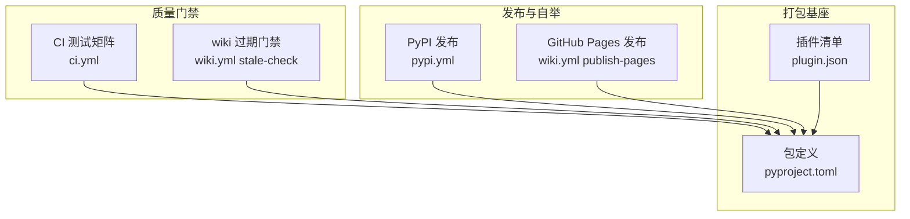
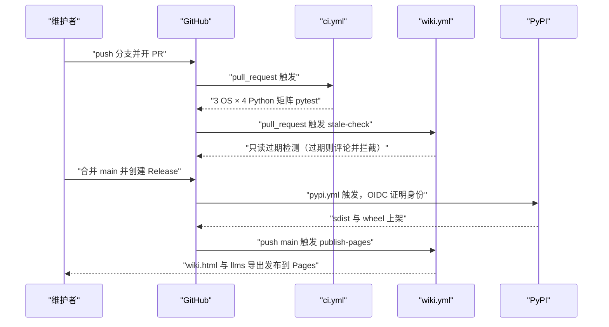
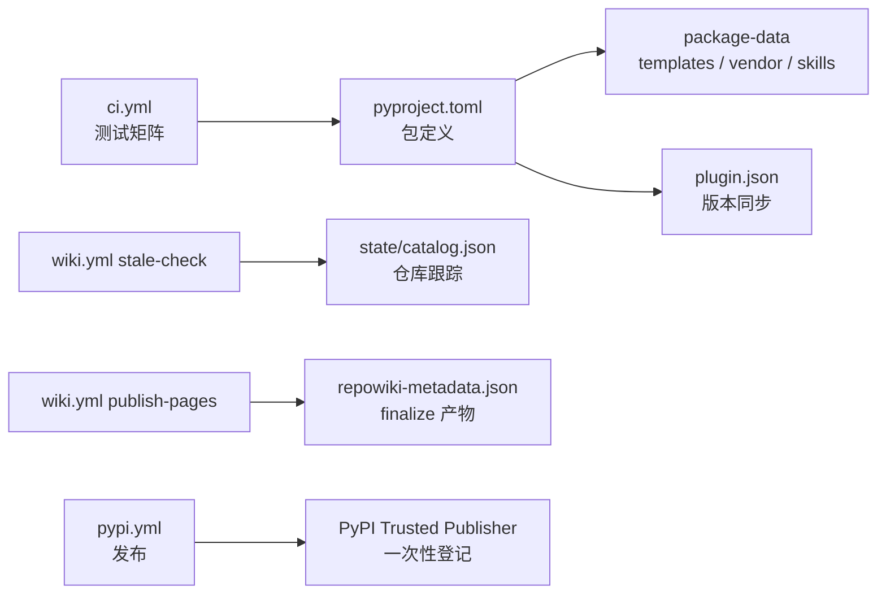

# CI 与发布流水线

<cite>
**本文引用的文件**
- [ci.yml](file://.github/workflows/ci.yml)
- [pypi.yml](file://.github/workflows/pypi.yml)
- [wiki.yml](file://.github/workflows/wiki.yml)
- [pyproject.toml](file://pyproject.toml)
- [plugin.json](file://.claude-plugin/plugin.json)
</cite>

## 目录
1. [简介](#简介)
2. [项目结构](#项目结构)
3. [核心组件](#核心组件)
4. [架构总览](#架构总览)
5. [详细组件分析](#详细组件分析)
6. [依赖关系分析](#依赖关系分析)
7. [性能与一致性考量](#性能与一致性考量)
8. [故障排查指南](#故障排查指南)
9. [结论](#结论)

## 简介
「CI 与发布流水线」描述 repowiki 仓库自身的三条 GitHub Actions 工作流与配套打包配置：ci.yml 是测试门禁，在三平台与四个 Python 版本的矩阵上跑 pytest；pypi.yml 是发布流水线，GitHub Release 发布时通过 PyPI Trusted Publisher（OIDC 免 token）自动上传 sdist 与 wheel；wiki.yml 是 repowiki 的自举工作流——pull_request 上跑只读 stale 门禁拦截「代码改了、wiki 没跟」，push main 后重建单文件站点并发布到 GitHub Pages。打包配置集中在 pyproject.toml（包数据含 templates / vendor / skills），插件元数据 `.claude-plugin/plugin.json` 的版本号需与 pyproject 保持同步。

章节来源
- [.github/workflows/ci.yml:1-6](file://.github/workflows/ci.yml#L1-L6)
- [.github/workflows/ci.yml:3-15](file://.github/workflows/ci.yml#L3-L15)

## 项目结构
- `.github/workflows/ci.yml`：CI 测试门禁——push main 与全部 pull_request 触发，3 OS × Python 3.10-3.13 矩阵执行 `pip install -e .[test]` 加 pytest。
- `.github/workflows/pypi.yml`：PyPI 发布——Release published 或手动 dispatch 触发，`python -m build` 构建后经 Trusted Publisher 上传，无需任何 API token。
- `.github/workflows/wiki.yml`：wiki 自举——stale-check（仅 PR，只读过期检测加评论加拦截）与 publish-pages（非 PR，site 重建加 Pages 部署）两个相互独立的 job。
- `pyproject.toml`：包定义——`repowiki-cli` 元数据、运行时依赖仅 `pyyaml>=6`、入口脚本、package-data 打包模板 / 渲染库 / skill。
- `.claude-plugin/plugin.json`：Claude 插件清单——名称、版本、描述与 skills 目录指针。

图表来源
- [.github/workflows/ci.yml:3-15](file://.github/workflows/ci.yml#L3-L15)
- [.github/workflows/wiki.yml:25-68](file://.github/workflows/wiki.yml#L25-L68)

章节来源
- [.github/workflows/ci.yml:1-6](file://.github/workflows/ci.yml#L1-L6)
- [.github/workflows/pypi.yml:16-21](file://.github/workflows/pypi.yml#L16-L21)
- [.github/workflows/wiki.yml:1-12](file://.github/workflows/wiki.yml#L1-L12)
- [pyproject.toml:5-15](file://pyproject.toml#L5-L15)

## 核心组件
- ci.yml test job：fail-fast 关闭的 3 OS × 4 Python 版本矩阵，每格安装 `.[test]` 附加依赖后跑 pytest，是合并前的唯一质量门禁。
- pypi.yml publish job：environment 固定为 `pypi`，权限仅 contents read 加 id-token write——身份由 GitHub OIDC 证明，PyPI 侧按 Trusted Publisher 登记校验。
- stale-check job：仅 PR 触发，`repowiki stale . --since origin/<base> --fail-if-stale --json` 只读检测受影响页面，命中则自动评论受影响清单并以退出码 1 拦截合并。
- publish-pages job：非 PR 触发，`repowiki site .` 重建后收集 wiki.html 与 llms.txt / llms-full.txt 组装 Pages artifact 并部署，index.html 重定向到 locale 站点。
- package-data 打包：`templates/*/*`、`templates/site.html`、`templates/site/*`、`vendor/*.js`、`skills/repowiki/*` 随 wheel 分发，是 skill 离线安装与 site 离线渲染的基础。

章节来源
- [.github/workflows/ci.yml:8-24](file://.github/workflows/ci.yml#L8-L24)
- [.github/workflows/pypi.yml:23-41](file://.github/workflows/pypi.yml#L23-L41)
- [.github/workflows/wiki.yml:26-47](file://.github/workflows/wiki.yml#L26-L47)
- [.github/workflows/wiki.yml:70-106](file://.github/workflows/wiki.yml#L70-L106)
- [pyproject.toml:45-46](file://pyproject.toml#L45-L46)

## 架构总览
发布是一条「打 tag → 建 Release → 自动上 PyPI」的链路：维护者推送版本提交并创建 GitHub Release 后，pypi.yml 由 release published 事件触发，在 ubuntu 上用 Python 3.12 执行 `python -m build` 构建 sdist 与 wheel，再由 pypa 官方 publish action 借 OIDC 身份直接上传 PyPI——全程无 token、无人工步骤。质量侧，PR 会同时触发 ci.yml 矩阵测试与 wiki.yml 的 stale 只读门禁，二者都绿才可合并；合并进 main 后 wiki.yml 重建站点并发布 Pages。

图表来源
- [.github/workflows/pypi.yml:18-25](file://.github/workflows/pypi.yml#L18-L25)
- [.github/workflows/wiki.yml:16-23](file://.github/workflows/wiki.yml#L16-L23)

章节来源
- [.github/workflows/pypi.yml:1-14](file://.github/workflows/pypi.yml#L1-L14)
- [.github/workflows/ci.yml:3-6](file://.github/workflows/ci.yml#L3-L6)

## 详细组件分析
### ci.yml：跨平台测试矩阵
- 职责：在每个受支持平台上验证行为一致，守住「macOS / Linux / Windows 原生支持」的承诺。
- 关键行为：push 到 main 与全部 pull_request 触发；矩阵为 ubuntu / macos / windows 三系统乘 Python 3.10 / 3.11 / 3.12 / 3.13 共 12 格，`fail-fast: false` 保证一格失败不取消其余格，能一次看全各平台失败面。
- 实现要点：步骤极简——checkout、setup-python、`pip install -e .[test]`、pytest；测试附加依赖只有 pytest，运行时依赖仅 pyyaml，安装快且不依赖系统包。

章节来源
- [.github/workflows/ci.yml:1-15](file://.github/workflows/ci.yml#L1-L15)
- [.github/workflows/ci.yml:16-24](file://.github/workflows/ci.yml#L16-L24)
- [pyproject.toml:36-37](file://pyproject.toml#L36-L37)

### pypi.yml：Trusted Publisher 发布
- 职责：在 Release 发布时把 sdist 与 wheel 自动上传 PyPI，全程免 token。
- 关键行为：触发条件是 release published 或手动 dispatch；job 固定 environment 为 `pypi`；权限收紧为 contents read 加 id-token write，身份由 GitHub OIDC 短时令牌证明；构建用标准 `python -m build`，发布用 pypa 官方 gh-action-pypi-publish。
- 实现要点：前置是一次性的 PyPI 侧登记——项目未上传过时用 Pending Publisher 预登记（项目名 `repowiki-cli`、Owner `luomsis`、仓库 `repowiki`、workflow 文件名必须与 pypi.yml 完全一致、environment 为 `pypi`）；之后新版本无需任何 PyPI 侧操作。

章节来源
- [.github/workflows/pypi.yml:1-14](file://.github/workflows/pypi.yml#L1-L14)
- [.github/workflows/pypi.yml:16-30](file://.github/workflows/pypi.yml#L16-L30)
- [.github/workflows/pypi.yml:31-41](file://.github/workflows/pypi.yml#L31-L41)

### wiki.yml：repowiki 自举（stale 门禁与 Pages 发布）
- 职责：让本仓库自己的 Wiki 以 wiki-as-code 模式持续保鲜——仓库跟踪 `.repowiki/` 的 catalog、content 与 meta。
- 关键行为：stale-check 仅在 PR 上运行——checkout 拉全量历史后，执行只读的 `repowiki stale --since origin/<base> --fail-if-stale --json`；命中过期时把受影响页面 / 卡片 / 模块列表自动评论到 PR，并以退出码 1 拦截合并（continue-on-error 先吞掉检测退出码，便于先评论再失败）。publish-pages 在 push main 与手动 dispatch 时运行——`repowiki site .` 重建后，收集各 locale 的 wiki.html 与 llms.txt / llms-full.txt 拷入 _site，生成跳转 index.html，经 upload-pages-artifact 与 deploy-pages 发布。
- 实现要点：两个 job 相互独立、按事件名互斥（`if: github.event_name == 'pull_request'` 与其反），可按需禁用其一；仓库未跟踪 `.repowiki/` 时 stale-check 会因缺 catalog 失败、publish-pages 会因缺 metadata 失败，工作流头注写明了这一前提；Pages 部署权限沿用 OIDC（id-token write），与 pypi.yml 同一免 token 思路。

章节来源
- [.github/workflows/wiki.yml:1-12](file://.github/workflows/wiki.yml#L1-L12)
- [.github/workflows/wiki.yml:26-47](file://.github/workflows/wiki.yml#L26-L47)
- [.github/workflows/wiki.yml:48-68](file://.github/workflows/wiki.yml#L48-L68)
- [.github/workflows/wiki.yml:70-87](file://.github/workflows/wiki.yml#L70-L87)
- [.github/workflows/wiki.yml:88-106](file://.github/workflows/wiki.yml#L88-L106)

### 打包配置与插件元数据同步
- 职责：保证「pip 装出的 wheel」携带运行所需的全部非代码资产，且插件入口与 PyPI 包版本一致。
- 关键行为：package-data 声明五类资产——各 locale 的模板目录（`templates/*/*`）、单文件站点模板与站点资源、内嵌渲染库（`vendor/*.js`）与 skill 目录（`skills/repowiki/*`）；`[project.scripts]` 把 `repowiki` 命令指向 `repowiki.cli:main`；test 附加依赖单独声明。
- 实现要点：pyproject.toml 的 version（当前 0.6.1）与 `.claude-plugin/plugin.json` 的 version 必须同步修改——后者是 Claude 插件市场的清单，版本错位会让插件分发与 PyPI 分发指向不同版本；发版流程同时要求更新双语 CHANGELOG 并打包 wheel 附到 GitHub Release（README 的离线安装章节直接引用 Release 页的 whl）。

章节来源
- [pyproject.toml:1-15](file://pyproject.toml#L1-L15)
- [pyproject.toml:36-46](file://pyproject.toml#L36-L46)
- [.claude-plugin/plugin.json:1-9](file://.claude-plugin/plugin.json#L1-L9)
- [README.md:85-90](file://README.md#L85-L90)

## 依赖关系分析
- 工作流对仓库资产的依赖：三个工作流都以 `pip install .`（或 `-e .[test]`）安装当前仓库为前提；stale-check 依赖仓库跟踪的 `state/catalog.json` 与页面，publish-pages 依赖 finalize 产物 `repowiki-metadata.json`。
- 发布链依赖：pypi.yml 依赖 PyPI 侧的 Trusted Publisher 登记与 workflow 文件名、environment 名完全匹配；不依赖任何仓库 secret。
- 包数据依赖：wheel 的 site 离线渲染依赖 vendor 内嵌库，skill 安装依赖 package-data 中的 skills 目录——缺一项都会让对应功能在用户机上不可用。

图表来源
- [.github/workflows/wiki.yml:1-12](file://.github/workflows/wiki.yml#L1-L12)
- [pyproject.toml:45-46](file://pyproject.toml#L45-L46)

章节来源
- [.github/workflows/ci.yml:21-22](file://.github/workflows/ci.yml#L21-L22)
- [.github/workflows/wiki.yml:40](file://.github/workflows/wiki.yml#L40)
- [.github/workflows/wiki.yml:86-87](file://.github/workflows/wiki.yml#L86-L87)
- [pyproject.toml:39-43](file://pyproject.toml#L39-L43)

## 性能与一致性考量
- 矩阵成本与覆盖：12 格并行矩阵换来三平台四版本的全量回归；fail-fast 关闭让一次 CI 就能暴露全部平台差异，避免多轮往返。
- 免 token 安全：pypi.yml 与 Pages 部署都走 OIDC 短时凭证，权限最小化（contents read 加 id-token write），消除长期 secret 泄露面。
- 门禁确定性：stale-check 在 CI 内不跑任何 agent，`repowiki stale` 是纯只读的 git diff 映射，检测结果可复现、不写 state。
- 版本一致性约束：pyproject.toml 与 plugin.json 的版本号需人工保持同步；PyPI 侧登记项（workflow 文件名与 environment）与 pypi.yml 强耦合，改名任一侧都会导致上传被拒。
- 前置产物约束：publish-pages 与 site 一样以 finalize 元数据为硬前置，因此 main 分支必须始终跟踪有效的 `.repowiki/` 产物。

章节来源
- [.github/workflows/ci.yml:10-14](file://.github/workflows/ci.yml#L10-L14)
- [.github/workflows/pypi.yml:23-25](file://.github/workflows/pypi.yml#L23-L25)
- [.github/workflows/wiki.yml:6-7](file://.github/workflows/wiki.yml#L6-L7)
- [pyproject.toml:7](file://pyproject.toml#L7)
- [.claude-plugin/plugin.json:3](file://.claude-plugin/plugin.json#L3)

## 故障排查指南
- CI 某平台格失败：查该格日志中 pytest 的失败用例；fail-fast 关闭意味着其余格会继续跑完，可对比是否平台相关。
- PR 被 wiki 门禁拦截：stale-check 判定 PR 改动了 wiki 覆盖的源码；按 PR 评论列出的受影响页面，合并后在 main 执行 `repowiki update .` 完成增量任务再 finalize 加 site，或显式跳过该 workflow 豁免。
- stale-check 直接报错而非拦截：仓库未跟踪 `state/catalog.json`（先提交 wiki 产物）或 base 分支 fetch 失败（工作流已设 fetch-depth 0，一般不需处理）。
- publish-pages 失败报缺 metadata：main 上的 `.repowiki/<locale>/meta/repowiki-metadata.json` 缺失或损坏；本地 finalize 后提交，或确认 site 可在本地跑通。
- PyPI 上传被 Trusted Publisher 拒绝：核对 PyPI 登记项与 pypi.yml 是否逐字匹配——workflow 文件名必须为 `pypi.yml`、environment 必须为 `pypi`、Owner 与仓库名必须一致。
- 插件版本与 PyPI 版本不一致：发版时漏改其一；同时更新 pyproject.toml 与 `.claude-plugin/plugin.json` 的 version 后重新打包发布。

章节来源
- [.github/workflows/ci.yml:10-14](file://.github/workflows/ci.yml#L10-L14)
- [.github/workflows/wiki.yml:44-68](file://.github/workflows/wiki.yml#L44-L68)
- [.github/workflows/wiki.yml:10-12](file://.github/workflows/wiki.yml#L10-L12)
- [.github/workflows/pypi.yml:3-11](file://.github/workflows/pypi.yml#L3-L11)
- [pyproject.toml:7](file://pyproject.toml#L7)
- [.claude-plugin/plugin.json:3](file://.claude-plugin/plugin.json#L3)

## 结论
CI 与发布流水线用三个小工作流覆盖了仓库的完整工程闭环：ci.yml 以 3 OS × 4 Python 矩阵守住跨平台质量，pypi.yml 以 Trusted Publisher 免 token 地把 Release 自动送上 PyPI，wiki.yml 则让 repowiki 用自己的 stale 门禁与 Pages 发布为自身 Wiki 保鲜。正确使用方式是 PR 依赖双门禁（测试加 stale）合并、发版按「同步版本号 → Release → 自动上架」执行；注意事项是 PyPI 登记项与 workflow 文件名的强耦合、以及 pyproject 与插件清单的版本同步。

章节来源
- [.github/workflows/ci.yml:8-15](file://.github/workflows/ci.yml#L8-L15)
- [.github/workflows/pypi.yml:1-14](file://.github/workflows/pypi.yml#L1-L14)
- [.github/workflows/wiki.yml:1-12](file://.github/workflows/wiki.yml#L1-L12)
- [pyproject.toml:5-15](file://pyproject.toml#L5-L15)
