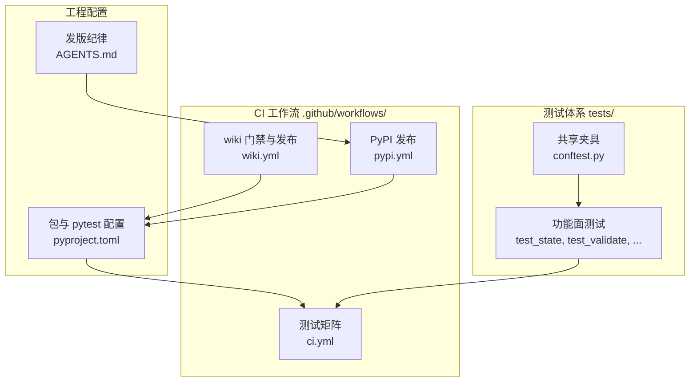
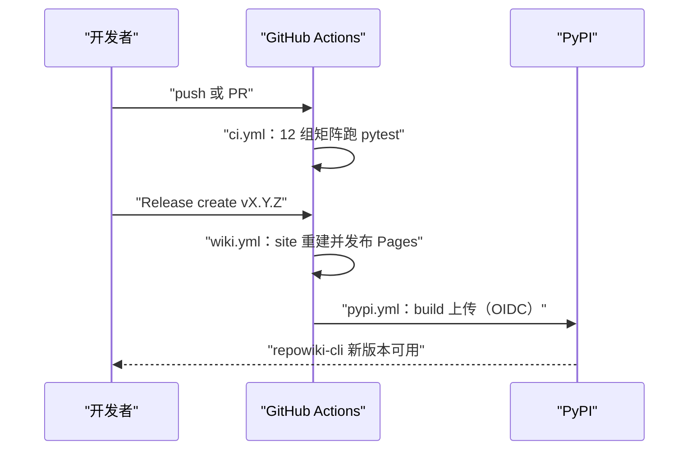
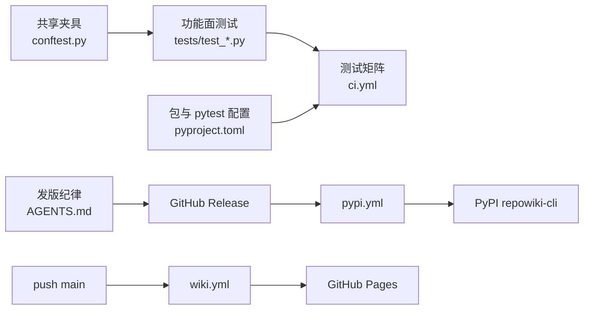

# 测试与工程化

<cite>
**本文引用的文件**
- [tests/conftest.py](file://tests/conftest.py)
- [tests/test_validate.py](file://tests/test_validate.py)
- [.github/workflows/ci.yml](file://.github/workflows/ci.yml)
- [.github/workflows/wiki.yml](file://.github/workflows/wiki.yml)
- [.github/workflows/pypi.yml](file://.github/workflows/pypi.yml)
- [pyproject.toml](file://pyproject.toml)
- [AGENTS.md](file://AGENTS.md)
- [docs/zh/USAGE.md](file://docs/zh/USAGE.md)
</cite>

## 更新摘要

**变更内容**
- `tests/conftest.py`（现 386 行）夹具扩充：valid_page / flow_page 金标准样本与各破坏性变体跟随校验器新规则同步扩充，全量 202 项测试通过，见 [tests/conftest.py:100-203](file://tests/conftest.py#L100-L203) 与 [tests/conftest.py:212-240](file://tests/conftest.py#L212-L240)。
- 修复本页两处指向 conftest.py 空行区间的失效引用（原 L203-204 落在夹具函数之间的空行，无法支撑论断），改指 write_catalog 与 flow_page 的实际代码区间；「结论」等小节引用行号一并按现行文件核对。
- 本页「简介」小节按新的逐小节「章节来源」规则补齐了来源列表。

## 目录
1. [更新摘要](#更新摘要)
2. [简介](#简介)
3. [项目结构](#项目结构)
4. [核心组件](#核心组件)
5. [架构总览](#架构总览)
6. [详细组件分析](#详细组件分析)
7. [依赖关系分析](#依赖关系分析)
8. [性能与一致性考量](#性能与一致性考量)
9. [故障排查指南](#故障排查指南)
10. [结论](#结论)

## 简介

本页覆盖 repowiki 的质量保障与发布工程：pytest 测试体系如何映射功能面、CI 如何在跨平台矩阵上自动回归、wiki 门禁与 Pages 发布如何随 push 与 PR 自动执行、PyPI 发布如何通过 Trusted Publisher 免 token 完成，以及约束每次发版的协作纪律。repowiki 自身是确定性 CLI，测试的重点因此不在算法正确性，而在并发竞态、状态机流转、校验规则正反例、损坏输入的友好报错这些「可靠性合同」上——单测覆盖竞态、孤儿认领自动回收、校验规则、增量映射、过期门禁、双语产出、单文件站点等（[docs/zh/USAGE.md:168-170](file://docs/zh/USAGE.md#L168-L170)）。测试代码位于 tests/，工作流位于 .github/workflows/，发版规则写在仓库的 AGENTS.md 中（[AGENTS.md:3-11](file://AGENTS.md#L3-L11)）。

章节来源
- [docs/zh/USAGE.md:168-170](file://docs/zh/USAGE.md#L168-L170)
- [AGENTS.md:3-11](file://AGENTS.md#L3-L11)
- [tests/conftest.py:1-13](file://tests/conftest.py#L1-L13)

## 项目结构

- tests/conftest.py：共享夹具——一个内存构造的微型示例仓库（demo）、valid_catalog / valid_page / flow_page 三份合法样本，是全部测试的公共地基（[tests/conftest.py:1](file://tests/conftest.py#L1)）；
- tests/test_state.py、test_validate.py、test_robustness.py、test_stale.py、test_coverage.py、test_site.py、test_i18n.py、test_flow.py、test_paths_catalog.py、test_output.py、test_skill_install.py、test_scanner.py：按功能面一一对应的状态机、校验规则、损坏防护、过期门禁、覆盖率、站点生成、双语、flow 原型等测试模块；
- .github/workflows/ci.yml：三平台（ubuntu / macos / windows）乘 Python 3.10-3.13 的测试矩阵（[.github/workflows/ci.yml:10-14](file://.github/workflows/ci.yml#L10-L14)）；
- .github/workflows/wiki.yml：PR 的 wiki 过期门禁与 push main 的 Pages 发布两个独立 job（[.github/workflows/wiki.yml:1-12](file://.github/workflows/wiki.yml#L1-L12)）；
- .github/workflows/pypi.yml：Release 发布触发的 PyPI Trusted Publisher 上传（[.github/workflows/pypi.yml:16-21](file://.github/workflows/pypi.yml#L16-L21)）；
- pyproject.toml：包元数据、test extra（pytest）与 pytest 运行配置（testpaths、addopts）（[pyproject.toml:36-37](file://pyproject.toml#L36-L37)、[pyproject.toml:48-50](file://pyproject.toml#L48-L50)）；
- AGENTS.md：发版纪律七条（版本号同步、双语 CHANGELOG、whl 附 Release、pytest 门禁等）（[AGENTS.md:3-11](file://AGENTS.md#L3-L11)）。

图表来源
- [tests/conftest.py:1-13](file://tests/conftest.py#L1-L13)
- [.github/workflows/ci.yml:8-24](file://.github/workflows/ci.yml#L8-L24)

章节来源
- [tests/conftest.py:1-13](file://tests/conftest.py#L1-L13)
- [.github/workflows/ci.yml:1-24](file://.github/workflows/ci.yml#L1-L24)
- [pyproject.toml:36-50](file://pyproject.toml#L36-L50)
- [AGENTS.md:3-11](file://AGENTS.md#L3-L11)

## 核心组件

- 合成仓库夹具（repo / git_repo / paths）：conftest 用一份内嵌的 FILES 字典在临时目录构造 demo 示例仓库，git_repo 变体额外执行 git init 与首次提交，供 update / stale 类测试使用（[tests/conftest.py:13-63](file://tests/conftest.py#L13-L63)）。
- 合法产出样本：valid_catalog（章节树）、valid_page（module 原型完整页面）、flow_page（flow 原型页面，zh / en 双语），作为校验器与端到端流程测试的金标准夹具（[tests/conftest.py:72-97](file://tests/conftest.py#L72-L97)、[tests/conftest.py:100-193](file://tests/conftest.py#L100-L193)、[tests/conftest.py:212-240](file://tests/conftest.py#L212-L240)）。
- CI 测试矩阵：ubuntu / macos / windows 三平台乘 Python 3.10-3.13 四版本，fail-fast 关闭，安装后直接 pytest（[.github/workflows/ci.yml:10-24](file://.github/workflows/ci.yml#L10-L24)）。
- wiki 门禁与发布工作流：PR 上跑 `repowiki stale --fail-if-stale` 拦截过期 wiki 并评论受影响页面；push main 上重建 site 并发布 GitHub Pages（[.github/workflows/wiki.yml:26-68](file://.github/workflows/wiki.yml#L26-L68)、[.github/workflows/wiki.yml:70-106](file://.github/workflows/wiki.yml#L70-L106)）。
- PyPI 发布工作流：Release published 或手动 dispatch 触发，构建 sdist + wheel 后经 OIDC 身份上传 PyPI，无任何 API token（[.github/workflows/pypi.yml:18-41](file://.github/workflows/pypi.yml#L18-L41)）。
- 发版纪律：AGENTS.md 规定版本号同步、双语 CHANGELOG、打包 wheel、whl 附 Release、pytest 全绿门禁、Release 创建与 PyPI 自动上传七步（[AGENTS.md:3-11](file://AGENTS.md#L3-L11)）。
- 测试运行配置：test extra 声明 pytest 依赖；pytest 以 tests/ 为根、默认安静输出（[pyproject.toml:36-37](file://pyproject.toml#L36-L37)、[pyproject.toml:48-50](file://pyproject.toml#L48-L50)）。

章节来源
- [tests/conftest.py:13-97](file://tests/conftest.py#L13-L97)
- [.github/workflows/ci.yml:10-24](file://.github/workflows/ci.yml#L10-L24)
- [.github/workflows/wiki.yml:26-106](file://.github/workflows/wiki.yml#L26-L106)
- [.github/workflows/pypi.yml:18-41](file://.github/workflows/pypi.yml#L18-L41)
- [AGENTS.md:3-11](file://AGENTS.md#L3-L11)

## 架构总览

repowiki 的工程化链路全部由 GitHub Actions 驱动，三个工作流各管一段且相互独立：push 与 pull_request 触发 ci.yml 的跨平台测试矩阵，这是所有合并前的质量门禁；pull_request 触发 wiki.yml 的 stale 门禁（确定性 diff 检查，CI 内不跑任何 agent），push main 触发同一文件里的 Pages 发布；Release 发布触发 pypi.yml 自动上传 PyPI。本地开发遵循同一门禁：`pip install -e '.[test]'` 后 `pytest` 全绿才算可发版（[README.md:150-156](file://README.md#L150-L156)、[AGENTS.md:9](file://AGENTS.md#L9)）。

图表来源
- [.github/workflows/ci.yml:3-24](file://.github/workflows/ci.yml#L3-L24)
- [.github/workflows/pypi.yml:18-41](file://.github/workflows/pypi.yml#L18-L41)

章节来源
- [.github/workflows/ci.yml:3-24](file://.github/workflows/ci.yml#L3-L24)
- [.github/workflows/wiki.yml:14-21](file://.github/workflows/wiki.yml#L14-L21)
- [.github/workflows/pypi.yml:18-41](file://.github/workflows/pypi.yml#L18-L41)
- [README.md:150-156](file://README.md#L150-L156)

## 详细组件分析

### 共享测试夹具（conftest.py）

- 职责：为零网络、零外部依赖的确定性测试提供统一的仓库样本与合法产出模板。
- 关键行为：FILES 字典内嵌 demo 仓库的全部文件内容（README、pyproject、src/demo 下的入口、模型、API、配置、日志、错误模块，以及测试与脚本），make_repo 把它们写入临时目录，git 参数决定是否补一次真实 git 提交；repo / git_repo / paths 三个 fixture 供各测试模块按需取用（[tests/conftest.py:13-69](file://tests/conftest.py#L13-L69)）。
- 实现要点：valid_page 覆盖 module 原型的全部必备小节、cite 块、目录与三类 mermaid 图，flow_page 覆盖 flow 原型并有 en 版本——校验器测试因此能对「合法样本加一处破坏」做正反对照，例如错误 H1 被自动修复、缺必备小节判失败等（[tests/test_validate.py:20-34](file://tests/test_validate.py#L20-L34)、[tests/conftest.py:205-217](file://tests/conftest.py#L205-L217)）。

章节来源
- [tests/conftest.py:13-69](file://tests/conftest.py#L13-L69)
- [tests/conftest.py:72-193](file://tests/conftest.py#L72-L193)
- [tests/conftest.py:205-386](file://tests/conftest.py#L205-L386)
- [tests/test_validate.py:20-34](file://tests/test_validate.py#L20-L34)

### CI 测试矩阵与测试门禁

- 职责：保证 repowiki 在全部支持平台上行为一致——文件锁、路径分隔符、mtime 语义都因操作系统而异，跨平台矩阵是并发与状态机代码的硬门禁。
- 关键行为：ci.yml 由 push（main）与 pull_request 触发；矩阵展开为 12 个 job（3 系统 × 4 Python 版本），fail-fast 设为 false 以便一次跑出全平台全貌；每个 job 仅两步——`pip install -e .[test]` 安装本包与测试依赖，然后 `pytest`（[.github/workflows/ci.yml:3-24](file://.github/workflows/ci.yml#L3-L24)）。
- 实现要点：pytest 的运行范围与输出风格集中在 pyproject.toml（testpaths = tests、addopts = -q），test extra 只声明 pytest>=8，测试套件不引入其他依赖，与运行时仅 pyyaml 的轻量承诺一致（[pyproject.toml:15](file://pyproject.toml#L15)、[pyproject.toml:36-37](file://pyproject.toml#L36-L37)、[pyproject.toml:48-50](file://pyproject.toml#L48-L50)）。

章节来源
- [.github/workflows/ci.yml:3-24](file://.github/workflows/ci.yml#L3-L24)
- [pyproject.toml:15](file://pyproject.toml#L15)
- [pyproject.toml:36-50](file://pyproject.toml#L36-L50)

### wiki 门禁与 Pages 发布（wiki.yml）

- 职责：实现「wiki-as-code」模式的两个自动化——文档不过期门禁与在线样例发布。
- 关键行为：stale-check job 只在 PR 上运行，checkout 全量历史后执行 `repowiki stale . --since origin/<base> --fail-if-stale`；命中过期时用 gh 向 PR 评论受影响的页面、卡片与模块清单，并以 exit 1 拦截合并（[.github/workflows/wiki.yml:26-68](file://.github/workflows/wiki.yml#L26-L68)）。publish-pages job 在 push main 与手动触发时运行，执行 `repowiki site .` 重建 wiki.html 与 llms 索引，收集产物后部署到 GitHub Pages，并生成一个跳转用 index.html（[.github/workflows/wiki.yml:70-106](file://.github/workflows/wiki.yml#L70-L106)）。
- 实现要点：两个 job 相互独立、可按需禁用；仓库未跟踪 .repowiki/ 时 stale-check 因缺 catalog 失败、publish-pages 因缺 metadata 失败，工作流头部注释写明了这一前提（[.github/workflows/wiki.yml:1-12](file://.github/workflows/wiki.yml#L1-L12)）。

章节来源
- [.github/workflows/wiki.yml:1-12](file://.github/workflows/wiki.yml#L1-L12)
- [.github/workflows/wiki.yml:26-68](file://.github/workflows/wiki.yml#L26-L68)
- [.github/workflows/wiki.yml:70-106](file://.github/workflows/wiki.yml#L70-L106)

### PyPI 发布与发版纪律

- 职责：把「打 tag 发 Release」变成发布的唯一人工动作，其余全自动。
- 关键行为：pypi.yml 由 Release published 或手动 dispatch 触发，使用 PyPI Trusted Publisher——权限仅 contents: read 与 id-token: write，身份由 GitHub OIDC 证明，无需任何 API token；job 内先用 python -m build 构建 sdist 与 wheel，再经 pypa/gh-action-pypi-publish 上传（[.github/workflows/pypi.yml:13-25](file://.github/workflows/pypi.yml#L13-L25)、[.github/workflows/pypi.yml:36-41](file://.github/workflows/pypi.yml#L36-L41)）。
- 实现要点：AGENTS.md 把发版纪律固化为七条——pyproject.toml 与 .claude-plugin/plugin.json 版本号同步、双语 CHANGELOG 各加一节、`python -m build --wheel` 打包、whl 必须附到 GitHub Release（离线安装路径依赖它）、发版前 pytest 全绿、push main 后 `gh release create vX.Y.Z --target <HEAD sha>`、PyPI 侧仅在首次上传前预登记 Pending Publisher（Owner luomsis / Repo repowiki / Workflow pypi.yml / Environment pypi），之后新版本零 PyPI 侧操作（[AGENTS.md:3-11](file://AGENTS.md#L3-L11)）。当前版本 0.6.1 记录在 pyproject.toml（[pyproject.toml:6-7](file://pyproject.toml#L6-L7)）。

章节来源
- [.github/workflows/pypi.yml:1-25](file://.github/workflows/pypi.yml#L1-L25)
- [.github/workflows/pypi.yml:36-41](file://.github/workflows/pypi.yml#L36-L41)
- [AGENTS.md:3-11](file://AGENTS.md#L3-L11)
- [pyproject.toml:6-7](file://pyproject.toml#L6-L7)

## 依赖关系分析

- 测试体系：全部测试模块依赖 conftest.py 的夹具与样本；conftest 依赖 repowiki.paths（构造 WikiPaths）与 pytest，不依赖网络与真实外部仓库（[tests/conftest.py:9-11](file://tests/conftest.py#L9-L11)）。
- CI 链路：ci.yml 依赖 pyproject.toml 的 test extra 与 pytest 配置；wiki.yml 与 pypi.yml 各自安装本包后调用 repowiki CLI（stale / site / build）。
- 发布链路：AGENTS.md 的发版纪律是 pypi.yml 的前置——Release 由人工按纪律创建，pypi.yml 监听 Release published 事件；PyPI 侧依赖一次性的 Pending Publisher 登记。
- 运行时依赖面保持最小：包依赖仅 pyyaml，测试仅 pytest，这也是离线安装与 CI 矩阵能轻量运转的前提（[pyproject.toml:15](file://pyproject.toml#L15)、[pyproject.toml:37](file://pyproject.toml#L37)）。

图表来源
- [tests/conftest.py:9-11](file://tests/conftest.py#L9-L11)
- [.github/workflows/pypi.yml:18-21](file://.github/workflows/pypi.yml#L18-L21)
- [.github/workflows/wiki.yml:16-20](file://.github/workflows/wiki.yml#L16-L20)

章节来源
- [tests/conftest.py:9-11](file://tests/conftest.py#L9-L11)
- [pyproject.toml:15](file://pyproject.toml#L15)
- [pyproject.toml:36-37](file://pyproject.toml#L36-L37)
- [AGENTS.md:3-11](file://AGENTS.md#L3-L11)
- [.github/workflows/pypi.yml:18-21](file://.github/workflows/pypi.yml#L18-L21)
- [.github/workflows/wiki.yml:16-20](file://.github/workflows/wiki.yml#L16-L20)

## 性能与一致性考量

- 确定性夹具保证可重复：测试仓库内容由字面量字典定义、写入临时目录，测试结果不受环境残留影响；需要 git 语义的用例显式用 git_repo 夹具现场建库（[tests/conftest.py:38-53](file://tests/conftest.py#L38-L53)）。
- fail-fast 关闭换取全貌：12 个矩阵 job 互不牵连，一次 CI 就能暴露「仅 Windows 的锁行为」或「仅新 Python 的语法」这类平台相关问题（[.github/workflows/ci.yml:10-14](file://.github/workflows/ci.yml#L10-L14)）。
- 门禁一致性：本地发版门禁（pytest 全绿）与 CI 门禁是同一套测试，避免「本地能过、CI 挂」的规则分叉；pytest 配置集中在 pyproject.toml 而非散落命令行（[pyproject.toml:48-50](file://pyproject.toml#L48-L50)、[AGENTS.md:9](file://AGENTS.md#L9)）。
- 发布的一致性取舍：whl 附 Release 是硬要求，因为 README 离线安装一节直接引用 Release 资产——缺 asset 会破坏离线路径，这是发布完整性与分发便利之间的显式取舍（[AGENTS.md:8](file://AGENTS.md#L8)）。
- 免 token 发布的安全面：pypi.yml 权限最小化（contents: read + id-token: write），凭据生命周期限于单次 workflow run，不存在长期 secret 轮换问题（[.github/workflows/pypi.yml:23-25](file://.github/workflows/pypi.yml#L23-L25)）。

章节来源
- [tests/conftest.py:38-53](file://tests/conftest.py#L38-L53)
- [.github/workflows/ci.yml:10-14](file://.github/workflows/ci.yml#L10-L14)
- [.github/workflows/pypi.yml:23-25](file://.github/workflows/pypi.yml#L23-L25)
- [pyproject.toml:48-50](file://pyproject.toml#L48-L50)
- [AGENTS.md:8-9](file://AGENTS.md#L8-L9)

## 故障排查指南

- CI 某平台或某 Python 版本失败：矩阵 fail-fast 已关闭，直接在 Actions 页按 job 定位对应系统与版本组合，本地用同版本 Python 复现 `pytest`（[.github/workflows/ci.yml:10-24](file://.github/workflows/ci.yml#L10-L24)）。
- 本地跑测试报缺 pytest：先安装测试 extra——`pip install -e '.[test]'`，pytest 依赖由 pyproject 声明（[pyproject.toml:36-37](file://pyproject.toml#L36-L37)）。
- PR 被 wiki.yml 的 stale 门禁拦截：按 PR 评论列出的受影响页面，在 main 合并后执行 `repowiki update .` 完成增量任务再 finalize + site；也可显式跳过该 workflow 豁免一次（[.github/workflows/wiki.yml:53-68](file://.github/workflows/wiki.yml#L53-L68)）。
- publish-pages 失败：多为仓库尚未跟踪 .repowiki/ 的 metadata——先在本地完成全部任务并 finalize，提交后再触发（[.github/workflows/wiki.yml:11-12](file://.github/workflows/wiki.yml#L11-L12)）。
- PyPI 发布未出现新版本：确认 Release 已是 published 状态（draft 不会触发）、pypi.yml 文件名与 Pending Publisher 登记完全一致、environment 名为 pypi（[.github/workflows/pypi.yml:9-21](file://.github/workflows/pypi.yml#L9-L21)）。
- 离线安装拿不到 whl：检查 Release 资产里是否有 repowiki_cli-*.whl——发版纪律要求每次上传，缺失即违反流程（[AGENTS.md:7-8](file://AGENTS.md#L7-L8)）。
- 校验器行为与预期不符时：优先对照 tests/test_validate.py 的同名场景正反例，样本页面由 conftest 的 valid_page / flow_page 提供（[tests/test_validate.py:1-16](file://tests/test_validate.py#L1-L16)）。

章节来源
- [.github/workflows/ci.yml:10-24](file://.github/workflows/ci.yml#L10-L24)
- [.github/workflows/wiki.yml:53-68](file://.github/workflows/wiki.yml#L53-L68)
- [.github/workflows/pypi.yml:9-21](file://.github/workflows/pypi.yml#L9-L21)
- [pyproject.toml:36-37](file://pyproject.toml#L36-L37)
- [AGENTS.md:7-8](file://AGENTS.md#L7-L8)
- [tests/test_validate.py:1-16](file://tests/test_validate.py#L1-L16)

## 结论

测试与工程化是 repowiki「确定性、跨平台、零依赖」承诺的执行面：conftest 用合成仓库与合法产出样本把功能面测试做成正反例对照，CI 以 12 组矩阵把并发与状态机代码压在三平台四版本上验证，wiki.yml 把「文档不过期」变成 PR 门禁、把在线样例变成 push 副产品，pypi.yml 用 Trusted Publisher 让发布零 token、零 PyPI 侧操作。正确用法是：本地改动一律先 `pip install -e '.[test]' && pytest`，行为变更先开 issue 对齐；发版严格按 AGENTS.md 七条纪律走，尤其不能漏掉 whl 附 Release。注意事项：wiki 门禁依赖仓库已提交 .repowiki/，PyPI 首发前需完成一次 Pending Publisher 登记。

章节来源
- [tests/conftest.py:1-13](file://tests/conftest.py#L1-L13)
- [.github/workflows/ci.yml:10-24](file://.github/workflows/ci.yml#L10-L24)
- [.github/workflows/wiki.yml:1-12](file://.github/workflows/wiki.yml#L1-L12)
- [.github/workflows/pypi.yml:1-25](file://.github/workflows/pypi.yml#L1-L25)
- [AGENTS.md:3-11](file://AGENTS.md#L3-L11)
