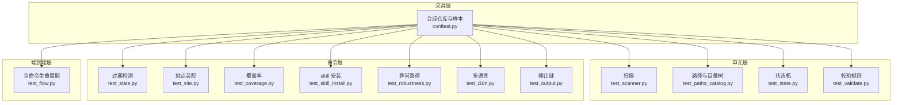
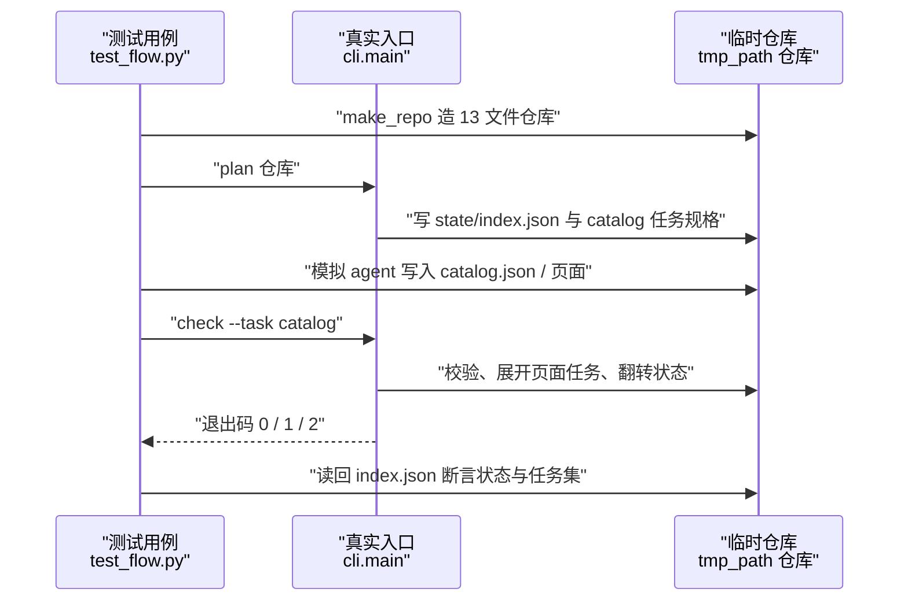
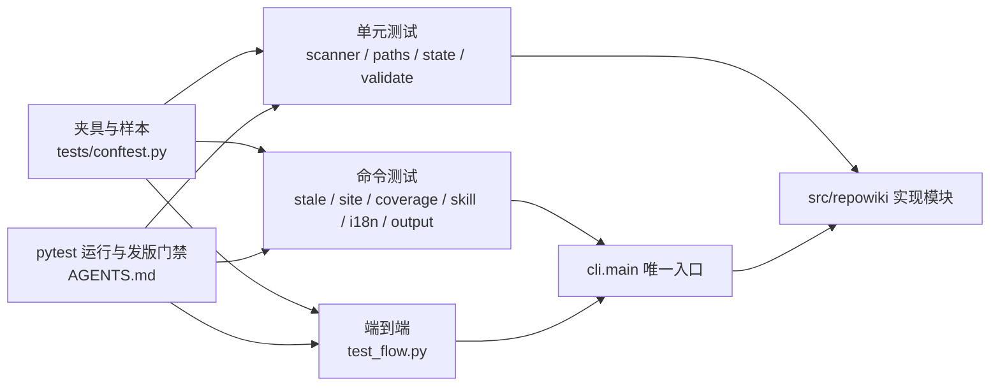

# 测试体系

<cite>
**本文引用的文件**
- [conftest.py](file://tests/conftest.py)
- [test_scanner.py](file://tests/test_scanner.py)
- [test_paths_catalog.py](file://tests/test_paths_catalog.py)
- [test_state.py](file://tests/test_state.py)
- [test_flow.py](file://tests/test_flow.py)
- [test_validate.py](file://tests/test_validate.py)
- [test_stale.py](file://tests/test_stale.py)
- [test_site.py](file://tests/test_site.py)
- [test_coverage.py](file://tests/test_coverage.py)
- [test_skill_install.py](file://tests/test_skill_install.py)
- [test_robustness.py](file://tests/test_robustness.py)
- [test_i18n.py](file://tests/test_i18n.py)
- [test_output.py](file://tests/test_output.py)
- [AGENTS.md](file://AGENTS.md)
</cite>

## 更新摘要

**变更内容**
- `tests/test_validate.py`（现 337 行）扩充校验器新规则的边界用例：行号起点越界 / 区间倒置 / 引用区间全为空行各自判失败、仅终点越界被钳制、mermaid 节点文件名警告、小节缺「章节来源」与小节为空判失败，见 [tests/test_validate.py:62-120](file://tests/test_validate.py#L62-L120)；「单元层」小节的 test_validate 描述已同步改写。
- `tests/test_coverage.py`（114 行）新增 `test_coverage_breakdown_and_effective_rate`，覆盖未引用文件确定性分组（vendor / locale_mirror / other）与 `effective_coverage` 有效覆盖率口径，见 [tests/test_coverage.py:92-114](file://tests/test_coverage.py#L92-L114)。
- `tests/conftest.py`（386 行）夹具同步扩充，全量 202 项测试通过；本页「结论」小节按新的逐小节「章节来源」规则补齐了来源引用。

## 目录
1. [更新摘要](#更新摘要)
2. [简介](#简介)
3. [项目结构](#项目结构)
4. [核心组件](#核心组件)
5. [架构总览](#架构总览)
6. [详细组件分析](#详细组件分析)
7. [依赖关系分析](#依赖关系分析)
8. [性能与一致性考量](#性能与一致性考量)
9. [故障排查指南](#故障排查指南)
10. [结论](#结论)

## 简介

测试体系是 repowiki 的质量基座：`tests/` 下的 13 个测试文件与 `src/repowiki/` 各功能模块一一对应，全程不依赖任何 LLM——测试通过模拟 agent 的文件写入来驱动真实 CLI 入口，验证从 plan、领取、check 到 finalize、update、site 的完整行为。体系分三层：`conftest.py` 提供合成仓库与合法产出样本两类夹具；单元测试覆盖 scanner、paths/catalog、state、validate 等纯函数层；`test_flow.py` 以 761 行承载端到端编排用例，`test_robustness.py` 专攻损坏状态与异常路径。发版门禁由仓库协作规则约束：发版前 `pytest` 必须全绿。

章节来源
- [tests/conftest.py:1-1](file://tests/conftest.py#L1-L1)
- [tests/test_flow.py:1-1](file://tests/test_flow.py#L1-L1)
- [tests/test_robustness.py:1-3](file://tests/test_robustness.py#L1-L3)
- [AGENTS.md:9](file://AGENTS.md#L9)

## 项目结构

- `tests/conftest.py`：共享夹具——`FILES` 定义的 13 文件合成仓库、`make_repo`（可选真实 git 化）、`repo` / `git_repo` / `paths` 夹具、`valid_catalog` / `valid_page` / `flow_page` 合法样本。
- `tests/test_scanner.py`：仓库扫描——git 与目录遍历一致性、忽略目录、二进制跳过、树摘要截断。
- `tests/test_paths_catalog.py`：路径清洗、锚点规则、catalog schema 校验与 flatten 推导。
- `tests/test_state.py`：任务状态机——认领冲突、stale 回收、阶段门控与多进程并发认领。
- `tests/test_flow.py`：端到端编排——plan / next / check / finalize / update / knowledge / site / watch 全命令生命周期。
- `tests/test_validate.py`：校验器每条规则的正负样本与自动修复断言。
- `tests/test_stale.py`：只读过期映射、CI 门禁退出码与用法错误。
- `tests/test_site.py`：单文件站点装配、载荷安全、降级模式与 llms 导出。
- `tests/test_coverage.py`：覆盖率对账与零引用页标记。
- `tests/test_skill_install.py`：skill 安装幂等性与版本戳状态机。
- `tests/test_robustness.py`：损坏状态文件的响亮失败回归。
- `tests/test_i18n.py`：locale 检测、持久化与英文端到端。
- `tests/test_output.py`：双格式输出缝与人类 formatter 回归。

图表来源
- [tests/conftest.py:38-69](file://tests/conftest.py#L38-L69)
- [tests/test_flow.py:1-23](file://tests/test_flow.py#L1-L23)

章节来源
- [tests/conftest.py:1-35](file://tests/conftest.py#L1-L35)
- [tests/test_scanner.py:1-1](file://tests/test_scanner.py#L1-L1)
- [tests/test_state.py:1-1](file://tests/test_state.py#L1-L1)

## 核心组件

- `make_repo` / `FILES`（conftest.py）：每次测试在 tmp_path 下重建一个 13 文件的微型 demo 仓库（README、pyproject、src/demo 六个模块、tests、scripts），`git=True` 时真实执行 git init 与首次提交。
- `valid_page` / `flow_page`（conftest.py）：分别满足 module 与 flow 两套 archetype 必备小节的合法页面样本，供校验与端到端测试复用。
- `run(*argv)` 各测试文件的辅助函数：直接调用 `repowiki.cli.main`，以真实退出码断言命令行为。
- 并发压力器（test_state.py 的 `_worker_claim`）：6 进程按 worker 循环认领 30 个任务，断言零重复、零遗漏。
- 破坏注入器（test_robustness.py 的 `_corrupt_index`）：写入非法 JSON 制造损坏状态，验证失败路径。

章节来源
- [tests/conftest.py:38-58](file://tests/conftest.py#L38-L58)
- [tests/conftest.py:100-203](file://tests/conftest.py#L100-L203)
- [tests/test_state.py:114-149](file://tests/test_state.py#L114-L149)
- [tests/test_robustness.py:20-27](file://tests/test_robustness.py#L20-L27)

## 架构总览

测试的运行时形态是「测试替代 agent」：用例先以 `make_repo` 造出目标仓库，调用 `plan` 铺任务，然后像 agent 那样直接把 catalog、页面或 overview 写到磁盘上（跳过 LLM），再调用 `check` 让真实校验器裁决，断言 `state/index.json` 中的状态翻转与任务展开是否正确。异常路径用例则反其道而行——先把 index 或 catalog 写坏，断言 CLI 以友好错误退出且原始数据原样保留。全部用例运行于临时目录，互相隔离，可安全并行。

图表来源
- [tests/test_flow.py:63-107](file://tests/test_flow.py#L63-L107)
- [tests/conftest.py:38-53](file://tests/conftest.py#L38-L53)

章节来源
- [tests/test_flow.py:20-23](file://tests/test_flow.py#L20-L23)
- [tests/test_flow.py:110-143](file://tests/test_flow.py#L110-L143)

## 详细组件分析

### test_flow.py：端到端编排用例

- 职责：以命令序列覆盖 worker 循环的每一个生命周期事件。
- 关键行为：`TestPlan` 验证任务铺设、微型仓库拒绝与 `--max-pages` 截断；`TestCheckLoop` 验证 catalog 通过校验后展开页面任务、缺输出即 failed；`TestFinalize` 验证两步语义——第一次运行返回退出码 3 并创建 overview 任务，第二次组装元数据；`TestUpdate` 验证 git 变更映射（命中页与祖先、旧页缺失降级为全新任务、`--dirty` 捕获未提交变更、done 任务跨轮重新武装）；`TestLifecycleGuards` 覆盖 touch 心跳、异 worker check 拒绝与 `--force`、毒任务 exhausted 与 `release --force` 重置；`TestWatch` 覆盖完成 / 停滞 / 超时三种退出。
- 实现要点：所有模拟都落在文件系统上，不 mock 任何内部函数——CLI 的退出码契约（0 成功、1 失败、2 冲突、3 finalize 推进）被逐条断言；`TestStaleRecovery` 是「孤儿认领自愈」事故的回归锁：worker 持认领退出后，队列必须自动把任务交还下一个 `next --claim`，并留下 `.stale-*` 审计痕迹。

章节来源
- [tests/test_flow.py:25-53](file://tests/test_flow.py#L25-L53)
- [tests/test_flow.py:63-107](file://tests/test_flow.py#L63-L107)
- [tests/test_flow.py:122-158](file://tests/test_flow.py#L122-L158)
- [tests/test_flow.py:161-280](file://tests/test_flow.py#L161-L280)
- [tests/test_flow.py:533-597](file://tests/test_flow.py#L533-L597)
- [tests/test_flow.py:606-654](file://tests/test_flow.py#L606-L654)
- [tests/test_flow.py:706-738](file://tests/test_flow.py#L706-L738)

### test_robustness.py：异常路径回归

- 职责：保证新用户第一天会踩到的失败都以友好错误收场——绝不裸 traceback，绝不静默毁数据。
- 关键行为：损坏的 `state/index.json` 让 `load` / `stats` 抛 `StateError` 且坏文件原样保留供人工恢复；`next` / `status` 在损坏状态下以退出码 1 输出 `state_corrupt` 契约；`--replan` 遇损坏 index 要求 `--force` 才可覆盖；未知任务 id 的 touch / release 输出「任务不存在」而非 KeyError；fcntl 与 msvcrt 双缺失时锁层缺失也报 `UsageError`。
- 实现要点：损坏 catalog 的场景覆盖 finalize、update 与 overview 校验三条路径，均断言错误文案与退出码；这正是实现侧「损坏清单不得伪装成空清单」约定的测试面。

章节来源
- [tests/test_robustness.py:1-3](file://tests/test_robustness.py#L1-L3)
- [tests/test_robustness.py:29-61](file://tests/test_robustness.py#L29-L61)
- [tests/test_robustness.py:73-95](file://tests/test_robustness.py#L73-L95)
- [tests/test_robustness.py:100-148](file://tests/test_robustness.py#L100-L148)

### 单元层：scanner、paths/catalog、state、validate

- `test_scanner.py`：断言目录遍历与 git ls-files 结果完全一致、`node_modules` 与 `.repowiki` 被忽略、二进制文件跳过、树摘要按目录与总数截断。
- `test_paths_catalog.py`：NFC 归一、非法字符全角替换、`untitled` 兜底、`__2` 消歧；锚点的中文冒号剥离与大小写转换；catalog 校验的重复标题、非法 slug、占位符标题、page 带 children、深度超限、未知 dependent_files 降级警告并剔除；flatten 的输出路径推导与 archetype 透传。
- `test_state.py`：认领冲突抛 `ConflictError`、stale 认领被偷取且 attempts 累加、孤儿认领重新进入就绪队列（「50 分钟冻结」回归）、阶段门控按 1 → 2 → 3 放行、6 进程并发认领 30 任务零重复零遗漏。
- `test_validate.py`：每条校验规则一正一负——H1 错误自动修复、缺小节拒绝、行号校验分层（仅终点越界钳制为 fixed，起点越界 / 区间倒置 / 引用区间全为空行判失败）、反斜杠路径归一、围栏不配对、mermaid 数量不足、目录锚点重建、mermaid 节点引用不存在文件名仅警告、小节缺「章节来源」与小节为空判失败、占位符失败但代码块内字面量豁免、页间链接仅警告、增量更新强制「更新摘要」小节、flow 与 module 规则互斥。

章节来源
- [tests/test_validate.py:62-120](file://tests/test_validate.py#L62-L120)
- [tests/test_scanner.py:12-69](file://tests/test_scanner.py#L12-L69)
- [tests/test_paths_catalog.py:15-105](file://tests/test_paths_catalog.py#L15-L105)
- [tests/test_state.py:25-102](file://tests/test_state.py#L25-L102)
- [tests/test_state.py:141-149](file://tests/test_state.py#L141-L149)
- [tests/test_validate.py:19-128](file://tests/test_validate.py#L19-L128)
- [tests/test_validate.py:256-287](file://tests/test_validate.py#L256-L287)
- [tests/test_validate.py:307-336](file://tests/test_validate.py#L307-L336)

### 命令层：stale、site、coverage、skill、i18n、output

- `test_stale.py`：受影响页含祖先链、无变更即干净、`--fail-if-stale` 命中退出 1 且不创建任何任务（只读）、`--dirty` 捕获工作区改动、四类用法错误与 update 镜像。
- `test_site.py`：无 metadata 拒绝生成、单文件内联全部资源（断言无 `src=` 外链）、`</script>` 注入被转义、clean 后降级磁盘导航、缺页静默跳过、llms 索引链接全部可解析、重建幂等。
- `test_coverage.py`：引用计数对账、知识卡片 source_files 计入、零引用页面被点名、指向已删除文件的引用自然失效，以及未引用文件确定性分组与 `effective_coverage` 有效覆盖率（test_coverage_breakdown_and_effective_rate）。
- `test_skill_install.py`：skill 随包携带（SKILL.md 与 SKILL.en.md）、默认装进共享技能目录、`--agent` / `--target` 多目标、重复安装报 current、旧戳覆盖报 updated、status 五态判定。
- `test_i18n.py`：中文 README 判 zh 且翻译版不反转决策、locale 持久化与显式参数优先、en 页面走 en 规则校验、完整英文端到端（plan 到 finalize 全链）。
- `test_output.py`：emit 的双格式与空文案跳过、emit_error 的 JSON 走 stdout 而人类文案走 stderr、「next 空队列带 busy 提示」的 NameError 回归。

章节来源
- [tests/test_stale.py:45-84](file://tests/test_stale.py#L45-L84)
- [tests/test_site.py:53-76](file://tests/test_site.py#L53-L76)
- [tests/test_site.py:152-188](file://tests/test_site.py#L152-L188)
- [tests/test_site.py:205-230](file://tests/test_site.py#L205-L230)
- [tests/test_coverage.py:31-64](file://tests/test_coverage.py#L31-L64)
- [tests/test_coverage.py:92-114](file://tests/test_coverage.py#L92-L114)
- [tests/test_skill_install.py:30-98](file://tests/test_skill_install.py#L30-L98)
- [tests/test_i18n.py:153-216](file://tests/test_i18n.py#L153-L216)
- [tests/test_i18n.py:298-328](file://tests/test_i18n.py#L298-L328)
- [tests/test_output.py:21-41](file://tests/test_output.py#L21-L41)
- [tests/test_output.py:69-98](file://tests/test_output.py#L69-L98)

## 依赖关系分析

- 全部测试文件依赖 `conftest.py` 的夹具与样本构造器，`conftest` 只依赖 `repowiki.paths.WikiPaths` 与 pytest。
- 端到端与命令层测试以 `repowiki.cli.main` 为唯一入口，间接覆盖 plan、dispatch、state、validate、metadata、site、updater、coverage、knowledge 全部实现模块。
- 单元测试直接 import 被测函数（`scan`、`sanitize_component`、`TaskStore`、`check_page` 等），断言粒度到规则级。
- 测试运行依赖额外测试组安装：`pip install -e '.[test]'` 后在仓库根执行 `pytest`；仓库协作规则把「pytest 全绿」定为发版门禁第 5 条。

图表来源
- [tests/conftest.py:7-11](file://tests/conftest.py#L7-L11)
- [tests/test_flow.py:14-17](file://tests/test_flow.py#L14-L17)
- [AGENTS.md:9](file://AGENTS.md#L9)

章节来源
- [AGENTS.md:5-9](file://AGENTS.md#L5-L9)
- [tests/test_flow.py:14-17](file://tests/test_flow.py#L14-L17)

## 性能与一致性考量

- 测试全部落在 `tmp_path` 并以真实文件系统为断言面——没有内存假实现，任何路径推导、原子写或锁行为都被原样 exercising；代价是 IO 略多，但单套全绿在秒级到十秒级。
- 并发用例有界可控：6 进程认领 30 任务、200 次空轮询上限，既压出竞态又保证测试确定终止。
- stale 相关用例通过 `os.utime` 回拨认领目录 mtime 模拟「worker 死亡」，不依赖真实睡眠等待，秒级 stale 窗口（`stale_seconds=2` 或 1）让回归测试即时完成。
- 校验用例刻意覆盖「自动修复不改变语义」：修复后断言 `res.ok` 且关键字段出现在 `fixed` 列表，锁定「确定性缺陷静默修、语义缺陷才报错」的契约。
- 回归注释即文档：`50-min freeze`、`orphaned-claim incident` 等注释把历史事故钉在用例上，防止修复被无意回退。

章节来源
- [tests/test_state.py:17-22](file://tests/test_state.py#L17-L22)
- [tests/test_state.py:61-70](file://tests/test_state.py#L61-L70)
- [tests/test_flow.py:606-624](file://tests/test_flow.py#L606-L624)
- [tests/test_validate.py:29-34](file://tests/test_validate.py#L29-L34)

## 故障排查指南

- 本地跑测试缺依赖 → 未安装测试组 → `pip install -e '.[test]'` 后重试 `pytest`，见 [README.md:150-156](file://README.md#L150-L156)。
- `test_concurrent_claims_no_duplicates` 偶发失败 → 多进程在高负载机器上轮询超时 → 重跑确认；持续失败说明认领原子性被破坏，优先检查 `state.py` 的 mkdir 认领逻辑，见 [tests/test_state.py:141-149](file://tests/test_state.py#L141-L149)。
- 新增命令后 `test_flow` 大面积失败 → 退出码契约被改动 → 对照 0 / 1 / 2 / 3 的约定（3 仅用于 finalize 第一步），见 [tests/test_flow.py:658-668](file://tests/test_flow.py#L658-L668)。
- 改动校验规则后负样本失败 → 规则文案或自动修复行为变化 → 同步更新 `test_validate.py` 的正负样本与 `fixed` 断言，见 [tests/test_validate.py:19-128](file://tests/test_validate.py#L19-L128)。
- site 测试断言 HTML 结构失败 → 外壳或载荷格式调整 → 同步更新 `extract_payload` 的正则与外链断言，见 [tests/test_site.py:20-48](file://tests/test_site.py#L20-L48)。
- Windows 上个别文件锁用例失败 → msvcrt 与 fcntl 行为差异 → `test_robustness.py` 已双后端覆盖，若新增锁逻辑需两平台各自验证，见 [tests/test_robustness.py:89-95](file://tests/test_robustness.py#L89-L95)。
- 发版流水线被门禁拦下 → 存在红测试 → 仓库规则要求全绿才可发版，先修复再走发布流程，见 [AGENTS.md:9](file://AGENTS.md#L9)。

章节来源
- [tests/test_state.py:141-149](file://tests/test_state.py#L141-L149)
- [tests/test_flow.py:657-668](file://tests/test_flow.py#L657-L668)
- [tests/test_validate.py:19-128](file://tests/test_validate.py#L19-L128)
- [tests/test_site.py:20-48](file://tests/test_site.py#L20-L48)
- [AGENTS.md:5-9](file://AGENTS.md#L5-L9)

## 结论

测试体系以「真实 CLI + 模拟 agent 写入」的方式覆盖了 repowiki 全部 13 个功能面：夹具层提供可复现的合成仓库，单元层锁定每条规则，命令层验证产物契约，`test_flow.py` 把整条生命周期串成端到端断言，`test_robustness.py` 守住损坏状态的失败姿态。正确使用方式是改动实现前先跑 `pytest`（发版门禁要求全绿）、新增行为时同步补正负样本、修过的事故以回归用例形式钉住；需要注意测试依赖真实文件系统语义与多进程，个别并发用例在高负载环境下可能需要重跑确认。

章节来源
- [tests/conftest.py:1-13](file://tests/conftest.py#L1-L13)
- [tests/test_validate.py:19-128](file://tests/test_validate.py#L19-L128)
- [tests/test_coverage.py:31-114](file://tests/test_coverage.py#L31-L114)
