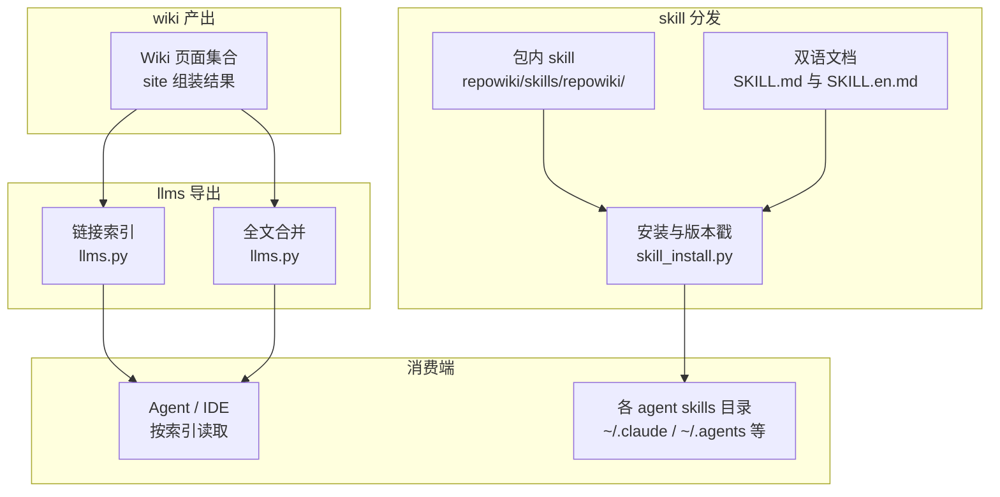
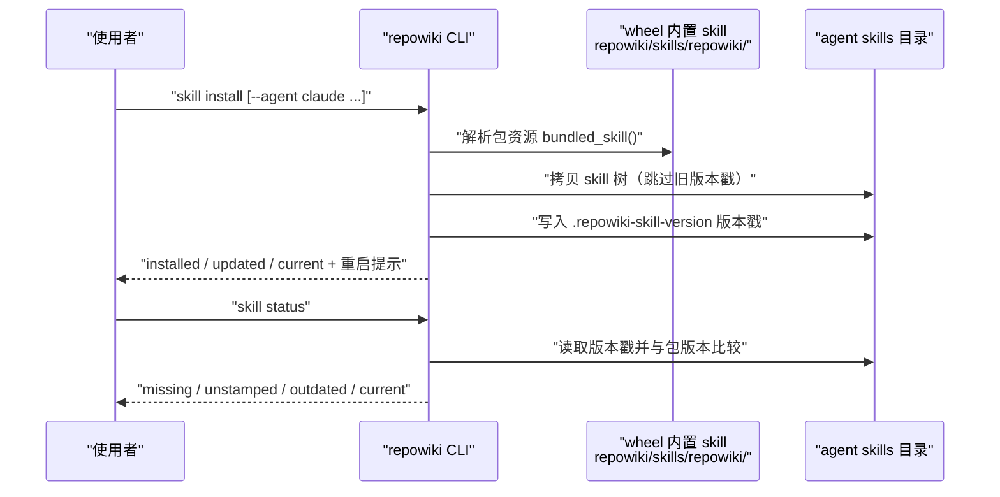
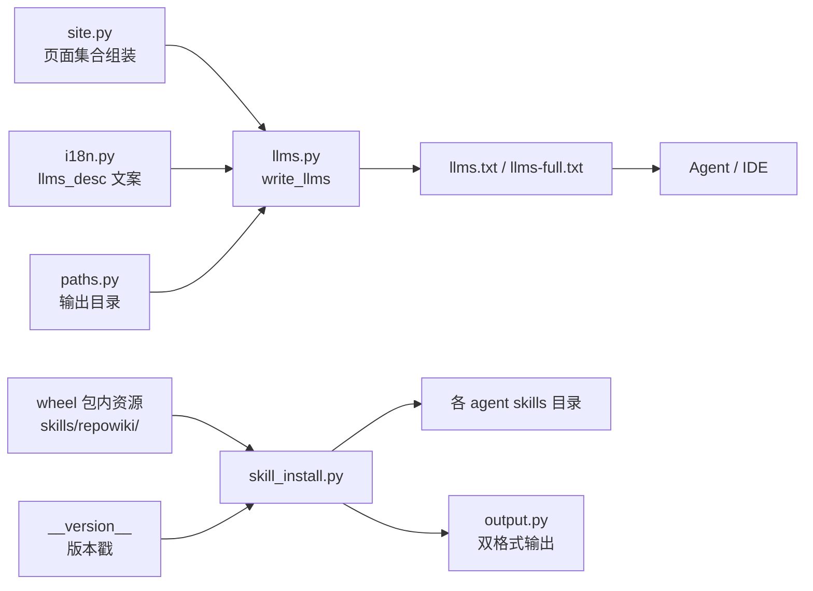

# llms 索引与 Skill 分发

<cite>
**本文引用的文件**
- [llms.py](file://src/repowiki/llms.py)
- [skill_install.py](file://src/repowiki/skill_install.py)
- [SKILL.md](file://src/repowiki/skills/repowiki/SKILL.md)
- [SKILL.en.md](file://src/repowiki/skills/repowiki/SKILL.en.md)
- [i18n.py](file://src/repowiki/i18n.py)
- [site.py](file://src/repowiki/site.py)
- [README.md](file://README.md)
</cite>

## 更新摘要

**变更内容**
- `src/repowiki/skills/repowiki/SKILL.md` 的「硬性规则」一节更新行号校验描述：行号不越界（起点越界 / 区间倒置会被打回，仅终点越界自动钳制）；`check` 的确定性缺陷（锚点 / H1 / 越界的行区间终点）自动修复，只需修复 `errors` 列出的语义问题，见 [src/repowiki/skills/repowiki/SKILL.md:102-107](file://src/repowiki/skills/repowiki/SKILL.md#L102-L107)；SKILL.en.md（142 行）同步更新，本页「SKILL.md 双语文档与离线安装路径」小节的描述已对齐。
- 本页「简介」小节按新的逐小节「章节来源」规则补齐了来源引用。

## 目录
1. [更新摘要](#更新摘要)
3. [简介](#简介)
3. [项目结构](#项目结构)
4. [核心组件](#核心组件)
5. [架构总览](#架构总览)
6. [详细组件分析](#详细组件分析)
7. [依赖关系分析](#依赖关系分析)
8. [性能与一致性考量](#性能与一致性考量)
9. [故障排查指南](#故障排查指南)
10. [结论](#结论)

## 简介
「llms 索引与 Skill 分发」覆盖 repowiki 的两条 agent 侧分发通道。其一是 llms 索引：`site` 命令在生成单文件站点的同时，按 llmstxt.org 约定导出 `llms.txt`（按章节组织的链接索引）与 `llms-full.txt`（全文合并版），任何 agent 或 IDE 按索引直接读取 Wiki，无需 MCP 服务器、无需网络。其二是 Skill 分发：skill 文件随 wheel 打包，`repowiki skill install` 把内置 skill 拷入各 coding agent 的用户级 skills 目录并盖版本戳，让 agent 在用户提出「生成仓库 Wiki」类需求时自动按 SKILL.md 的流程驱动 CLI。

章节来源
- [src/repowiki/skills/repowiki/SKILL.md:1-11](file://src/repowiki/skills/repowiki/SKILL.md#L1-L11)
- [README.md:71-90](file://README.md#L71-L90)

## 项目结构
- `src/repowiki/llms.py`：llms.txt 与 llms-full.txt 的生成器——复用站点组装的页面集合与导航树，输出到 `.repowiki/<locale>/`。
- `src/repowiki/skill_install.py`：skill 安装与状态检查——把包内 `repowiki/skills/repowiki/` 拷入各 agent 的用户级 skills 目录，写入版本戳文件 `.repowiki-skill-version`。
- `src/repowiki/skills/repowiki/SKILL.md`：中文 skill 指引——front matter 触发描述、标准流程、并发 worker 循环、环境变量与硬性规则。
- `src/repowiki/skills/repowiki/SKILL.en.md`：英文镜像版，与中文版同构，供英文环境的 agent 阅读。
- `.repowiki/<locale>/llms.txt` 与 `llms-full.txt`：site 命令的导出产物（finalize 之后可用）。

图表来源
- [src/repowiki/llms.py:19-46](file://src/repowiki/llms.py#L19-L46)
- [src/repowiki/skill_install.py:23-33](file://src/repowiki/skill_install.py#L23-L33)

章节来源
- [src/repowiki/llms.py:1-8](file://src/repowiki/llms.py#L1-L8)
- [src/repowiki/skill_install.py:1-7](file://src/repowiki/skill_install.py#L1-L7)
- [README.md:49](file://README.md#L49)

## 核心组件
- write_llms：由站点复用的 pages 与 nav 集合生成两份文件——llms.txt 按 nav 章节组织页面链接，llms-full.txt 以分隔线串联全部页面 markdown。
- _rel：把页面路径转成相对 llms.txt 所在目录（`<locale>/`）的 posix 相对链接，保证离线可点。
- run_skill_install：把包内 skill 树拷入目标目录；目标已存在且版本戳与包版本一致时跳过（幂等），否则覆盖并重写版本戳。
- run_skill_status：按版本戳报告各目标状态——missing / unstamped / outdated / newer / current，用于发现手工拷贝与过期副本。
- SKILL.md / SKILL.en.md：给 agent 的操作手册——标准流程、并发 worker 循环契约、touch 心跳纪律、环境变量与硬性规则。
- 离线安装路径：GitHub Release 附带的 `repowiki_cli-*.whl` 加 PyYAML wheel，目标机 `pip install --no-index` 两个 wheel 即可，skill 已随 whl 打包。

章节来源
- [src/repowiki/llms.py:19-26](file://src/repowiki/llms.py#L19-L26)
- [src/repowiki/llms.py:49-52](file://src/repowiki/llms.py#L49-L52)
- [src/repowiki/skill_install.py:79-98](file://src/repowiki/skill_install.py#L79-L98)
- [src/repowiki/skill_install.py:101-122](file://src/repowiki/skill_install.py#L101-L122)
- [src/repowiki/skills/repowiki/SKILL.md:102-107](file://src/repowiki/skills/repowiki/SKILL.md#L102-L107)
- [README.md:85-90](file://README.md#L85-L90)

## 架构总览
llms 导出与 skill 安装是两条互不依赖的分发链路。llms 链路：site 组装完页面集合后调用 write_llms，同一份 pages / nav 既进 HTML 也进两份文本产物，写入采用「临时文件加 os.replace」原子替换。skill 链路：CLI 从 wheel 内的包资源解析出 skill 目录，按 `--agent`（或缺省的跨工具共享目录 `~/.agents/skills`）解析目标，幂等拷贝并盖版本戳；`skill status` 随后可校验各目标的新旧。

图表来源
- [src/repowiki/skill_install.py:79-98](file://src/repowiki/skill_install.py#L79-L98)
- [src/repowiki/skill_install.py:101-122](file://src/repowiki/skill_install.py#L101-L122)

章节来源
- [src/repowiki/llms.py:40-46](file://src/repowiki/llms.py#L40-L46)
- [src/repowiki/skill_install.py:40-50](file://src/repowiki/skill_install.py#L40-L50)

## 详细组件分析
### llms.py：索引与全文伴随文件
- 职责：为 coding agent 提供文档集的链接索引与可选全文，使 agent 无需 MCP 或网络即可按索引消费 Wiki。
- 关键行为：llms.txt 的骨架是「H1 标题 + blockquote 描述 + 按章节组织的二级标题与 bullet 链接」——描述文案来自 i18n 的 site.llms_desc 按 locale 取值并填入仓库名；llms-full.txt 复用同一标题与描述，随后以 `---` 分隔逐页拼接页面 markdown 全文。
- 实现要点：两份文件是站点同一份 pages / nav 集合的确定性副产品（页面字典含 title / path / md，nav 节点是单页或带 children 的章节）；链接由 _rel 计算为相对 `<locale>/` 目录的 posix 相对路径，双击或 agent 读取均可在 `.repowiki/` 内闭合；写入使用带 pid 的临时文件加 os.replace，避免并发或中断留下半写文件。

章节来源
- [src/repowiki/llms.py:1-8](file://src/repowiki/llms.py#L1-L8)
- [src/repowiki/llms.py:27-38](file://src/repowiki/llms.py#L27-L38)
- [src/repowiki/llms.py:40-52](file://src/repowiki/llms.py#L40-L52)
- [src/repowiki/i18n.py:49-60](file://src/repowiki/i18n.py#L49-L60)

### skill_install.py：跨 agent 安装与版本戳
- 职责：把随 wheel 分发的 skill 安装到各 coding agent 的用户级 skills 目录，并能检测手工拷贝与过期副本。
- 关键行为：六个受支持的 target——agents（`~/.agents/skills`，跨工具共享缺省）、claude（`~/.claude/skills`）、codex（`~/.codex/skills`）、zcode（`~/.zcode/skills`）、cursor（`~/.cursor/skills`）、opencode（`~/.config/opencode/skills`）；`--target` 还可指定任意自定义目录。拷贝时跳过旧版本戳文件，完成后写入当前包版本；目标已有同版本戳且 SKILL.md 存在时判 current 跳过（幂等）。
- 实现要点：skill 源用 importlib.resources 的 Traversable 读取——无论正常安装还是 zip 安装都能解析包内资源；版本比较用「抽取数字段转元组」的容错算法，避免 `0.6.1` 与 `0.6.1rc1` 之类的字符串比较出错；status 的 unstamped 状态专门标记「存在 SKILL.md 但无版本戳」的手工拷贝，提示重跑 install 纳管。

章节来源
- [src/repowiki/skill_install.py:17-33](file://src/repowiki/skill_install.py#L17-L33)
- [src/repowiki/skill_install.py:36-37](file://src/repowiki/skill_install.py#L36-L37)
- [src/repowiki/skill_install.py:53-61](file://src/repowiki/skill_install.py#L53-L61)
- [src/repowiki/skill_install.py:64-76](file://src/repowiki/skill_install.py#L64-L76)
- [src/repowiki/skill_install.py:105-119](file://src/repowiki/skill_install.py#L105-L119)

### SKILL.md 双语文档与离线安装路径
- 职责：告诉驱动 CLI 的 agent「按什么流程调用 repowiki」——skill 只是指引，真正干活的是 CLI 命令。
- 关键行为：SKILL.md 的 front matter 描述定义触发时机（用户要求生成仓库 Wiki 等）；正文给出串行标准流程（plan → next --claim → 按规格撰写 → check → 循环至队列清空 → finalize 两步 → site）与并发流程（catalog 后派等价 subagent、禁止指定任务 ID、touch 心跳纪律、冲突不加 --force）；文末列出 REPOWIKI_STALE_SECONDS 与 REPOWIKI_MAX_ATTEMPTS 两个环境变量及硬性规则——其中行号规则表述为本轮更新重点：行号不越界（起点越界 / 区间倒置会被打回，仅终点越界自动钳制），`check` 的确定性缺陷（锚点 / H1 / 越界的行区间终点）自动修复、只需修复 `errors` 列出的语义问题。SKILL.en.md 为英文镜像，与中文版同构。
- 实现要点：双语文档互相链接且随 skill 树一起拷贝；skill 随 whl 打包，因此离线安装（Release 页 whl 加 PyYAML wheel 的 `pip install --no-index`）装好后同样执行 `skill install`，纯本地拷贝、无需网络；升级 CLI 后需重跑 `skill install`，让各 agent 目录的副本跟上包版本。

章节来源
- [src/repowiki/skills/repowiki/SKILL.md:1-11](file://src/repowiki/skills/repowiki/SKILL.md#L1-L11)
- [src/repowiki/skills/repowiki/SKILL.md:25-45](file://src/repowiki/skills/repowiki/SKILL.md#L25-L45)
- [src/repowiki/skills/repowiki/SKILL.md:47-100](file://src/repowiki/skills/repowiki/SKILL.md#L47-L100)
- [src/repowiki/skills/repowiki/SKILL.md:102-107](file://src/repowiki/skills/repowiki/SKILL.md#L102-L107)
- [src/repowiki/skills/repowiki/SKILL.en.md:8-13](file://src/repowiki/skills/repowiki/SKILL.en.md#L8-L13)
- [README.md:71-90](file://README.md#L71-L90)

## 依赖关系分析
- llms.py 的上游：依赖 i18n 的 strings 取本地化描述、paths 的 WikiPaths 定位输出目录；pages 与 nav 集合由 site.py 组装后传入，二者共享同一数据源。
- llms.py 的下游：产物供外部 agent / IDE 消费；与单文件站点互为补充——站点面向人，llms 面向机器。
- skill_install.py 的上下游：上游是包内资源（skills/repowiki/）与 `__version__`；下游是各 agent 的用户级 skills 目录；输出经 output.emit 双格式打印。

图表来源
- [src/repowiki/llms.py:15-16](file://src/repowiki/llms.py#L15-L16)
- [src/repowiki/skill_install.py:10-16](file://src/repowiki/skill_install.py#L10-L16)

章节来源
- [src/repowiki/llms.py:19-27](file://src/repowiki/llms.py#L19-L27)
- [src/repowiki/skill_install.py:36-50](file://src/repowiki/skill_install.py#L36-L50)
- [src/repowiki/site.py:36-56](file://src/repowiki/site.py#L36-L56)

## 性能与一致性考量
- 确定性副产品：llms 两份文件复用站点同一份 pages / nav 集合，站点与索引的页面清单天然一致，不会出现「站点有、索引无」的漂移。
- 原子写盘：llms 文件与元数据同样采用临时文件加 os.replace，中断不留半写产物；`site` 幂等可重跑，页面或 finalize 变化后重建即可。
- 零运行时成本：llms 导出是纯文本拼接，无渲染依赖；skill 安装是纯文件拷贝，版本戳让重复安装退化为一次文件读取的比较。
- 双语一致性：SKILL.md 与 SKILL.en.md 同构镜像，站点文案（llms_desc 等）与校验小节名均由 i18n 字符串表按 locale 供给，zh / en 产出行为对称。
- 分发一致性：skill 随 wheel 打包、随 pip 安装携带，消除了「文档与代码分仓维护」的版本错位；唯一的过期窗口是安装后的副本，由版本戳与 status 命令兜底。

章节来源
- [src/repowiki/llms.py:1-8](file://src/repowiki/llms.py#L1-L8)
- [src/repowiki/llms.py:40-46](file://src/repowiki/llms.py#L40-L46)
- [src/repowiki/skill_install.py:79-98](file://src/repowiki/skill_install.py#L79-L98)
- [README.md:49-52](file://README.md#L49-L52)

## 故障排查指南
- agent 未自动触发 repowiki 流程：确认 skill 已安装——`skill status` 查看目标目录状态为 missing 时执行 `skill install`；安装后需重启 agent 客户端会话才能加载新 skill。
- skill status 报 unstamped：目录里有 SKILL.md 但没有版本戳，属手工拷贝；重跑 `skill install` 覆盖纳管。
- skill status 报 outdated：包已升级而 skill 副本未跟上；重跑 `skill install`（安装输出与 hint 都会提示升级后重跑）。
- 报 newer：skill 副本版本高于当前包（常见于回滚了 CLI 版本）；确认包版本是否正确。
- site 报「未找到 repowiki-metadata.json」：llms 导出由 site 一并完成，硬前置是先成功 finalize；先跑 finalize 再 site。
- llms.txt 链接打不开：链接是相对 `<locale>/` 目录的相对路径，须保持 `.repowiki/` 目录整体结构移动，不要单独抽出文件。
- 离线机器安装 skill 失败：离线安装路径是「Release 页 `repowiki_cli-*.whl` + PyYAML wheel，`pip install --no-index` 两个 wheel」，skill 已随 whl 打包，装好后同样执行 `skill install`。

章节来源
- [src/repowiki/skill_install.py:101-122](file://src/repowiki/skill_install.py#L101-L122)
- [src/repowiki/skill_install.py:94-97](file://src/repowiki/skill_install.py#L94-L97)
- [src/repowiki/site.py:36-45](file://src/repowiki/site.py#L36-L45)
- [src/repowiki/llms.py:49-52](file://src/repowiki/llms.py#L49-L52)
- [README.md:85-90](file://README.md#L85-L90)

## 结论
llms 索引与 Skill 分发解决了 Wiki 的「机器可读」与「流程可触发」两个分发问题：前者把站点页面集合确定性导出为 llmstxt.org 约定的索引与全文，供任意 agent / IDE 离线按索引消费；后者把操作手册随 wheel 分发、一键装入六个 agent 的 skills 目录并以版本戳管理新旧。正确使用方式是 finalize 后执行 `site`（同时产出 llms 文件），并在安装或升级 CLI 后执行 `skill install`、用 `skill status` 校验；注意事项是 skill 副本需重启会话生效、离线环境走双 wheel 的 `--no-index` 安装路径。

章节来源
- [src/repowiki/llms.py:1-8](file://src/repowiki/llms.py#L1-L8)
- [src/repowiki/skill_install.py:1-7](file://src/repowiki/skill_install.py#L1-L7)
- [README.md:49](file://README.md#L49)
- [README.md:85-90](file://README.md#L85-L90)
