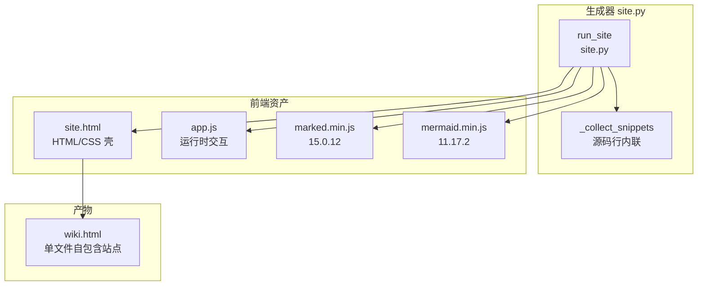
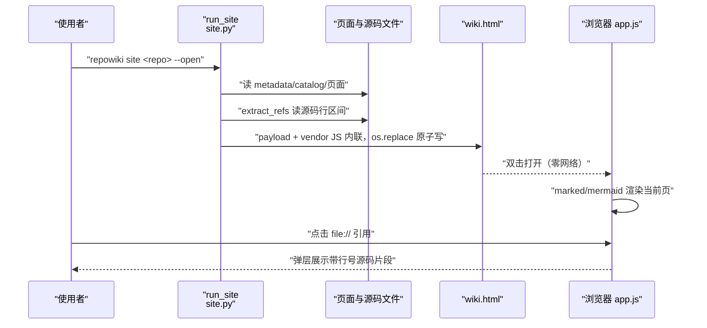
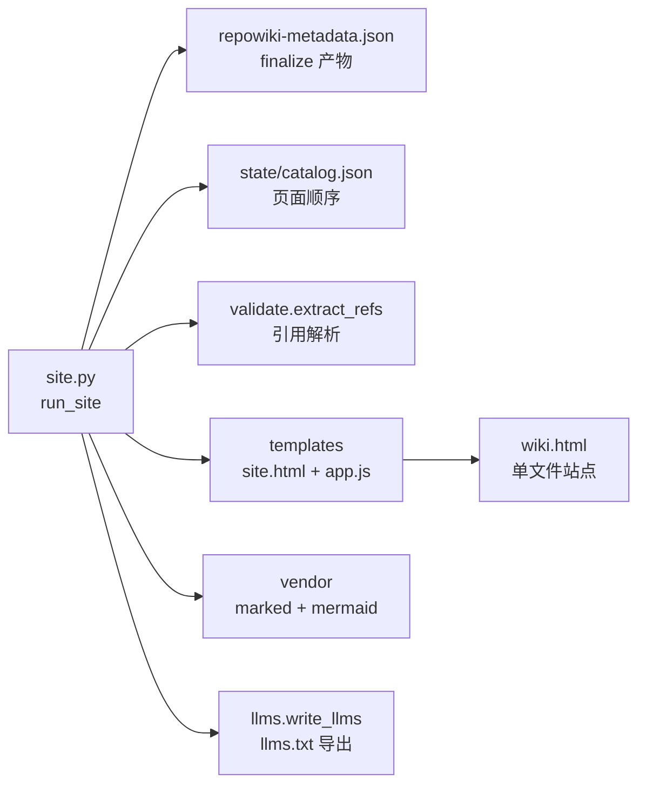

# 单文件离线站点

<cite>
**本文引用的文件**
- [site.py](file://src/repowiki/site.py)
- [site.html](file://src/repowiki/templates/site.html)
- [app.js](file://src/repowiki/templates/site/app.js)
- [README.md](file://src/repowiki/vendor/README.md)
- [marked.min.js](file://src/repowiki/vendor/marked.min.js)
- [0002-single-file-offline-site.md](file://docs/zh/adr/0002-single-file-offline-site.md)
</cite>

## 目录
1. [简介](#简介)
2. [项目结构](#项目结构)
3. [核心组件](#核心组件)
4. [架构总览](#架构总览)
5. [详细组件分析](#详细组件分析)
6. [依赖关系分析](#依赖关系分析)
7. [性能与一致性考量](#性能与一致性考量)
8. [故障排查指南](#故障排查指南)
9. [结论](#结论)

## 简介

`repowiki site` 把 finalize 后的全部 wiki 页面渲染成一个自包含 HTML 文件（`<locale>/wiki.html`，约 5 MB）：页面 markdown、每个 `file://` 引用背后的源码行区间、markdown 渲染库（marked）与 mermaid 渲染库全部内嵌，浏览器双击即看，零服务器、零网络，单文件即可分享。该决定记录于 ADR 0002——排除的本意是「不做常驻服务」，静态单文件产物不违背初衷。生成器实现在 `src/repowiki/site.py`，前端壳与运行时分别在 `templates/site.html` 与 `templates/site/app.js`。

章节来源
- [docs/zh/adr/0002-single-file-offline-site.md:5-10](file://docs/zh/adr/0002-single-file-offline-site.md#L5-L10)

## 项目结构

站点子系统由一个 Python 生成器加一套内嵌前端组成：

- `src/repowiki/site.py`：`run_site` 编排——读取 metadata、收集页面与知识页、构建导航、抽取源码片段、渲染 HTML、原子写盘。
- `src/repowiki/templates/site.html`：HTML/CSS 壳——设计令牌、明暗主题、布局（topbar/sidebar/content）、snippet 弹层样式，尾部留有四个 `{{占位符}}` 注入点。
- `src/repowiki/templates/site/app.js`：运行时——导航渲染、marked 解析、mermaid 渲染、全文搜索、hash 路由、弹层交互。
- `src/repowiki/vendor/marked.min.js`：marked 15.0.12（MIT）。
- `src/repowiki/vendor/mermaid.min.js`：mermaid 11.17.2（MIT）。
- `src/repowiki/vendor/README.md`：vendor 版本登记与更新策略。
- 产物：`.repowiki/<locale>/wiki.html`（站点）与 `llms.txt` / `llms-full.txt`（agent 索引，由 write_llms 一并导出）。

图表来源
- [src/repowiki/site.py:36-88](file://src/repowiki/site.py#L36-L88)
- [src/repowiki/site.py:363-378](file://src/repowiki/site.py#L363-L378)
- [src/repowiki/vendor/README.md:1-14](file://src/repowiki/vendor/README.md#L1-L14)

章节来源
- [src/repowiki/site.py:1-11](file://src/repowiki/site.py#L1-L11)
- [src/repowiki/vendor/README.md:1-14](file://src/repowiki/vendor/README.md#L1-L14)

## 核心组件

- `run_site`（site.py）：站点生成入口——前置要求 metadata 存在（即已 finalize），依次收集页面、知识页、导航与源码片段，组装 payload 后渲染并原子写盘，`--open` 可自动打开浏览器。
- payload（site.py）：单个 JSON 对象，含 repo 名、locale、生成时间、本地化 UI 文案、导航树、页面数组与源码片段字典，全部注入 `window.SITE_DATA`。
- `_collect_snippets`（site.py）：解析每页的 `file://` 引用，把对应源码行区间内联进 payload——阅读时点击引用无需读磁盘。
- `site.html` 壳：明暗双主题（CSS 设计令牌）、固定顶栏（搜索/主题切换/阅读进度条）、可折叠章节导航 + 本页目录、代码块头部栏、snippet 弹层与打印样式。
- `app.js` 运行时：marked 渲染 markdown、mermaid 渲染图表（明暗主题联动）、hash 路由（`#/p/N`）、全文搜索与命中高亮、复制按钮、Esc 关闭弹层。

章节来源
- [src/repowiki/site.py:36-88](file://src/repowiki/site.py#L36-L88)
- [src/repowiki/site.py:57-65](file://src/repowiki/site.py#L57-L65)
- [src/repowiki/templates/site.html:341-372](file://src/repowiki/templates/site.html#L341-L372)
- [src/repowiki/templates/site/app.js:1-17](file://src/repowiki/templates/site/app.js#L1-L17)

## 架构总览

生成时序：`run_site` 先校验 metadata（未 finalize 直接报 UsageError），再按 catalog 顺序收集页面（overview 置顶、知识页追加），对全部页面跑 `extract_refs` 抽取源码片段，随后把 payload 序列化进 `site.html` 壳的四个注入点（SITE_PAYLOAD / MARKED_JS / MERMAID_JS / APP_JS），经临时文件 `os.replace` 原子写出，并同步导出 llms 索引。浏览时序：打开 wiki.html 后 app.js 从 `window.SITE_DATA` 取数据，marked 渲染当前页、mermaid 渲染图表；点击任意 `file://` 引用被全局拦截，改为打开弹层展示带行号的内嵌源码。

图表来源
- [src/repowiki/site.py:36-88](file://src/repowiki/site.py#L36-L88)
- [src/repowiki/site.py:326-346](file://src/repowiki/site.py#L326-L346)
- [src/repowiki/templates/site/app.js:256-276](file://src/repowiki/templates/site/app.js#L256-L276)
- [src/repowiki/templates/site/app.js:278-305](file://src/repowiki/templates/site/app.js#L278-L305)

章节来源
- [src/repowiki/site.py:36-88](file://src/repowiki/site.py#L36-L88)
- [src/repowiki/templates/site/app.js:1-3](file://src/repowiki/templates/site/app.js#L1-L3)

## 详细组件分析

### 生成器：run_site 与内容装配

- 职责：把磁盘上的 wiki 页面集合变成一个可分发 HTML 文件。
- 关键行为：metadata 缺失或 JSON 损坏均抛 `UsageError` 并提示重新 finalize；页面收集顺序为 overview 置顶、catalog 展开顺序随后（`_ordered_nodes`），知识模块与卡片作为普通页面追加并挂到专设导航章（`_collect_knowledge`，排序遵循 `state/knowledge.json` 的计划序）；最后输出摘要含页面数、片段数与体积（size_mb）。
- 实现要点：`_ordered_nodes` 优先读 `state/catalog.json`，`repowiki clean` 之后退化为磁盘目录序（每个子目录一个章、每个 .md 一页），保证站点始终可重建；导航树由 `_build_nav` 按章/页层级派生，不依赖页间链接。

章节来源
- [src/repowiki/site.py:36-49](file://src/repowiki/site.py#L36-L49)
- [src/repowiki/site.py:106-131](file://src/repowiki/site.py#L106-L131)
- [src/repowiki/site.py:134-173](file://src/repowiki/site.py#L134-L173)
- [src/repowiki/site.py:176-207](file://src/repowiki/site.py#L176-L207)
- [src/repowiki/site.py:216-267](file://src/repowiki/site.py#L216-L267)

### 源码片段内联与 HTML 组装

- 职责：把 `file://` 引用背后的真实源码行预抽取进 payload，并把脚本安全地内联进 HTML。
- 关键行为：`_collect_snippets` 对每页调用 `extract_refs`，按 `path#Lstart-Lend` 去重后读取行区间；整文件引用（无行号）读全文件；文件缺失或二进制（前 8192 字节含 `\0`）标记为 missing，弹层显示「片段缺失」；超过 `MAX_SNIPPET_LINES`（20000 行）的区间跳过而不撑爆文件。
- 实现要点：payload 序列化时 `<` 转义为 `\u003c` 防 JSON 中的 `</script>` 提前闭合标签；`_script_safe` 把内联 JS 里的字面 `</script` 替换为 `<\/script`（JS 字符串与正则中的等价转义）；写盘用临时文件加 `os.replace` 原子替换，读写交叉不会产生半截文件。

章节来源
- [src/repowiki/site.py:326-358](file://src/repowiki/site.py#L326-L358)
- [src/repowiki/site.py:33-33](file://src/repowiki/site.py#L33-L33)
- [src/repowiki/site.py:363-384](file://src/repowiki/site.py#L363-L384)

### 前端壳：site.html

- 职责：提供完整的阅读界面骨架与视觉系统，产出即自包含、无任何外部资源引用。
- 关键行为：CSS 设计令牌定义明暗两套配色（`[data-theme="dark"]`），布局为固定顶栏 + 可折叠侧栏（章节导航 `#nav-tree` 与本页目录 `#toc-wrap`）+ 限宽正文；snippet 弹层 `#modal` 用行号表格展示源码；窄屏（900px 以下）侧栏变为抽屉，600px 以下进一步精简，另有打印样式隐藏界面元素。
- 实现要点：body 尾部四个 script 注入点依次是 `window.SITE_DATA`（payload）、marked、mermaid、app.js——顺序保证运行时可用；`<noscript>` 提示内容已全部内嵌但渲染需要 JavaScript。

章节来源
- [src/repowiki/templates/site.html:13-39](file://src/repowiki/templates/site.html#L13-L39)
- [src/repowiki/templates/site.html:287-313](file://src/repowiki/templates/site.html#L287-L313)
- [src/repowiki/templates/site.html:318-338](file://src/repowiki/templates/site.html#L318-L338)
- [src/repowiki/templates/site.html:341-372](file://src/repowiki/templates/site.html#L341-L372)

### 运行时：app.js

- 职责：在浏览器端完成 markdown/mermaid 渲染与全部交互，数据只来自 `window.SITE_DATA`，不发任何网络请求。
- 关键行为：`openPage` 按 hash 路由（`#/p/N`）切页——marked 解析 markdown、重解析 cite 块、为标题分配 GitHub 风格锚点 id（slug 函数与 `paths.github_anchor` 规则镜像）、包装代码块并加复制按钮、渲染 mermaid 图（securityLevel strict、主题跟随明暗切换、渲染失败回退显示源码）、重建本页目录与翻页器；全局点击代理拦截 `a[href^="file://"]`，改开弹层展示内嵌源码；搜索在全部页面小写文本上做 indexOf，命中词高亮、最多展示 20 条。
- 实现要点：主题、导航折叠状态与本页目录开合都持久化到 localStorage（file:// 下存储可能被禁，全部 try/catch 兜底）；滚动监听用 requestAnimationFrame 节流驱动阅读进度条与 scroll-spy 高亮。

章节来源
- [src/repowiki/templates/site/app.js:37-42](file://src/repowiki/templates/site/app.js#L37-L42)
- [src/repowiki/templates/site/app.js:96-125](file://src/repowiki/templates/site/app.js#L96-L125)
- [src/repowiki/templates/site/app.js:256-276](file://src/repowiki/templates/site/app.js#L256-L276)
- [src/repowiki/templates/site/app.js:278-305](file://src/repowiki/templates/site/app.js#L278-L305)
- [src/repowiki/templates/site/app.js:307-338](file://src/repowiki/templates/site/app.js#L307-L338)

### vendor 第三方库

- 职责：以源码内联方式提供 markdown 与 mermaid 渲染能力，保证完全离线。
- 关键行为：marked 15.0.12 与 mermaid 11.17.2 均为 MIT 许可的 minified 构建，原样提交进仓库并随 wheel 分发；生成时与查看时都不发起任何网络请求。
- 实现要点：更新策略是「重新下载 pinned 版本、保留 license 头注释、更新 README 登记表」；marked.min.js 头部的版权注释在升级时必须保留。

章节来源
- [src/repowiki/vendor/README.md:1-14](file://src/repowiki/vendor/README.md#L1-L14)
- [src/repowiki/vendor/marked.min.js:1-7](file://src/repowiki/vendor/marked.min.js#L1-L7)
- [docs/zh/adr/0002-single-file-offline-site.md:18-24](file://docs/zh/adr/0002-single-file-offline-site.md#L18-L24)

## 依赖关系分析

- 上游输入：`run_site` 依赖 metadata（finalize 产物）作前置门槛、`state/catalog.json` 决定页面顺序（clean 后退化磁盘序）、`state/knowledge.json` 决定知识页排序。
- 模块依赖：site.py 复用 `validate.extract_refs` 解析引用、`templates` 装载壳文件、`llms.write_llms` 导出 agent 索引、`i18n.strings` 提供站点 UI 文案。
- 运行时依赖：wiki.html 在浏览器端依赖内联的 marked/mermaid（vendor），与页面内容一起构成闭环，无需任何 CDN。

图表来源
- [src/repowiki/site.py:23-31](file://src/repowiki/site.py#L23-L31)
- [src/repowiki/site.py:46-55](file://src/repowiki/site.py#L46-L55)
- [src/repowiki/site.py:73-75](file://src/repowiki/site.py#L73-L75)

章节来源
- [src/repowiki/site.py:23-31](file://src/repowiki/site.py#L23-L31)
- [src/repowiki/site.py:134-144](file://src/repowiki/site.py#L134-L144)
- [src/repowiki/site.py:270-288](file://src/repowiki/site.py#L270-L288)

## 性能与一致性考量

- 体积取舍：内嵌 mermaid 约 3.5 MB，单个 wiki.html 约 4-5 MB——对一个仓库的文档而言可接受，换来完全离线与单文件分享（ADR 0002 的明确取舍）。
- 幂等重建：站点是纯派生产物，finalize、update 或手动改页后随时重跑 `site` 重建；执行过 `clean` 也能从磁盘页面重建（章节顺序退化为目录序，内容不受影响）。
- 原子写盘：临时文件 + `os.replace` 保证读方永远看到完整文件，不会读到半截 HTML。
- 片段体积护栏：单片段上限 20000 行，超限与缺失文件都标记 missing 而非中断生成；二进制文件直接跳过。
- 阅读性能：搜索为预载小写文本上的线性 indexOf（每页一次、无索引结构），滚动事件经 requestAnimationFrame 节流。

章节来源
- [docs/zh/adr/0002-single-file-offline-site.md:18-24](file://docs/zh/adr/0002-single-file-offline-site.md#L18-L24)
- [src/repowiki/site.py:33-33](file://src/repowiki/site.py#L33-L33)
- [src/repowiki/site.py:68-72](file://src/repowiki/site.py#L68-L72)
- [src/repowiki/site.py:147-149](file://src/repowiki/site.py#L147-L149)
- [src/repowiki/templates/site/app.js:215-231](file://src/repowiki/templates/site/app.js#L215-L231)

## 故障排查指南

- `site` 报「未找到 repowiki-metadata.json」：站点生成以 finalize 为前置门槛——先完成全部任务并运行 `repowiki finalize`（注意两步语义）再重试。
- 报 metadata JSON 损坏：按提示重新运行 `repowiki finalize` 重建 metadata 后再生成站点。
- 点击 `file://` 引用弹层显示「片段缺失」：生成时对应源码文件不存在（可能代码在生成后被移动/删除）或该文件是二进制；重新执行 `repowiki site` 即按当前仓库状态重建片段。
- 图表不渲染或显示源码回退：mermaid 渲染失败（语法错误）时 app.js 回退为显示原始文本；检查对应页面 mermaid 代码块语法，修复页面后重跑 site。
- 页面顺序与 plan 不一致：catalog.json 缺失（执行过 clean 或损坏）时退化为磁盘目录序；保留 state/catalog.json 即可恢复 plan 顺序。
- file:// 下主题或导航状态不记忆：部分浏览器禁用 file:// origin 的 localStorage，属预期兜底（try/catch 静默），不影响内容阅读。

章节来源
- [src/repowiki/site.py:37-44](file://src/repowiki/site.py#L37-L44)
- [src/repowiki/site.py:336-345](file://src/repowiki/site.py#L336-L345)
- [src/repowiki/site.py:134-144](file://src/repowiki/site.py#L134-L144)
- [src/repowiki/templates/site/app.js:109-114](file://src/repowiki/templates/site/app.js#L109-L114)
- [src/repowiki/templates/site/app.js:26-30](file://src/repowiki/templates/site/app.js#L26-L30)

## 结论

单文件离线站点的定位是「wiki 的最后一公里」：生成侧以 catalog 顺序装配全部页面与知识页、把每个源码引用的行区间预抽取进 payload，前端侧用内联的 marked 与 mermaid 在浏览器本地完成渲染，产物是一个双击即看、随处分发的 HTML 文件。正确使用方式是：finalize 之后运行 `repowiki site`（需要预览时加 `--open`），页面有任何变更后重跑即可，幂等无副作用；注意它依赖 metadata 存在，且 mermaid 渲染失败会回退显示源码而非报错中断。

章节来源
- [src/repowiki/site.py:1-11](file://src/repowiki/site.py#L1-L11)
- [src/repowiki/site.py:36-49](file://src/repowiki/site.py#L36-L49)
- [docs/zh/adr/0002-single-file-offline-site.md:5-10](file://docs/zh/adr/0002-single-file-offline-site.md#L5-L10)
