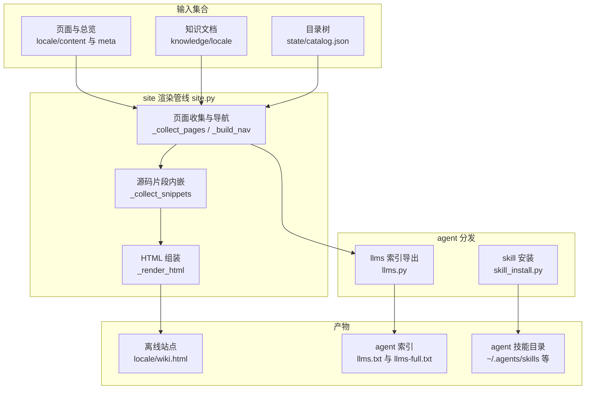
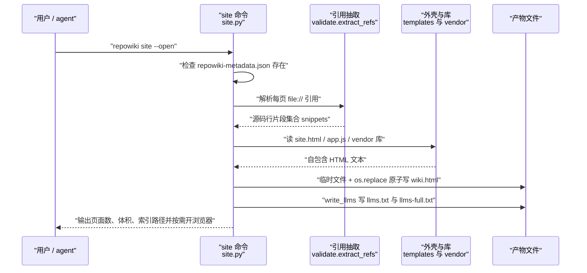
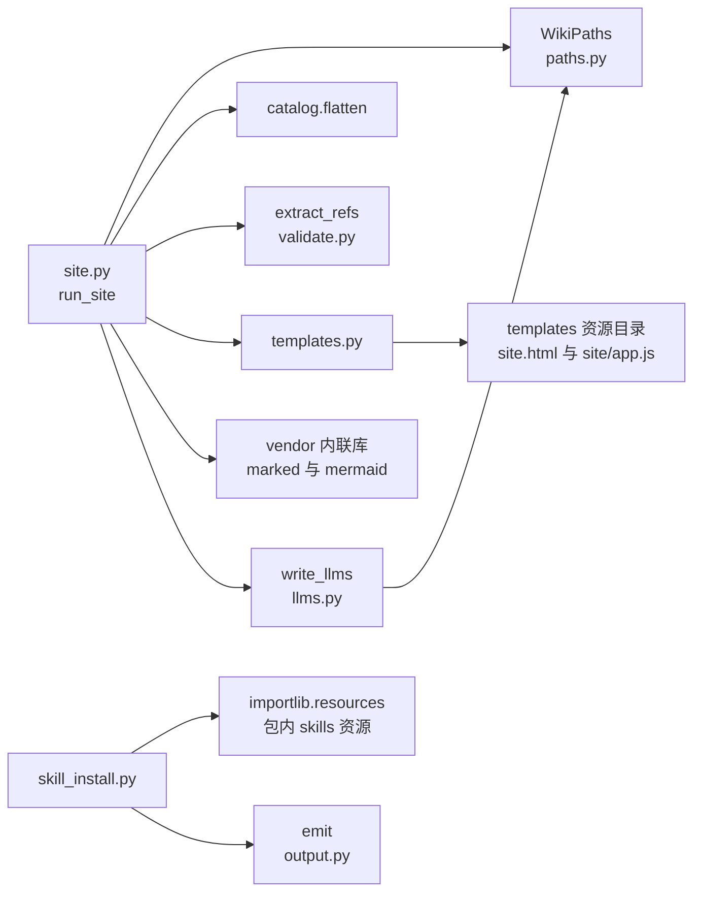

# 站点与分发

<cite>
**本文引用的文件**
- [site.py](file://src/repowiki/site.py)
- [llms.py](file://src/repowiki/llms.py)
- [skill_install.py](file://src/repowiki/skill_install.py)
- [templates.py](file://src/repowiki/templates.py)
- [cli.py](file://src/repowiki/cli.py)
</cite>

## 更新摘要

**变更内容**
- 校验器规则升级的连带同步：行号校验分层（仅终点越界自动钳制到文件末尾；起点越界、区间倒置、引用区间全为空行判 error）；每个 `##` 小节（目录与更新摘要除外）必须非空且携带「章节来源」标记，见 [src/repowiki/validate.py:227-240](file://src/repowiki/validate.py#L227-L240)。
- 本页「结论」小节按新规则补齐了「章节来源」；页面所引用的行号区间已按当前源码逐一核对。

## 目录
1. [更新摘要](#更新摘要)
2. [简介](#简介)
3. [项目结构](#项目结构)
4. [核心组件](#核心组件)
5. [架构总览](#架构总览)
6. [详细组件分析](#详细组件分析)
7. [依赖关系分析](#依赖关系分析)
8. [性能与一致性考量](#性能与一致性考量)
9. [故障排查指南](#故障排查指南)
10. [结论](#结论)

## 简介

站点与分发覆盖 repowiki 产出的两种消费形态与一种工具分发机制：面向人类，`site` 命令把全部页面、总览与知识文档渲染成一个自包含的 `wiki.html` 离线站点——markdown 与 mermaid 渲染器内联其中，浏览器双击打开、零网络零服务器；面向 agent 与 IDE，同一批页面被确定性导出为 `llms.txt`（链接索引）与 `llms-full.txt`（全文合集），遵循 llmstxt.org 约定；面向工具自身，`skill` 命令把随 wheel 内置的 agent skill 拷贝进各编码代理的技能目录并盖版本戳。实现依据为 `site.py`（渲染管线）、`llms.py`（agent 索引）、`skill_install.py`（skill 分发）与 `templates/site` 资源（HTML 外壳、前端脚本、内联 vendor 库）。

章节来源
- [src/repowiki/site.py:1-11](file://src/repowiki/site.py#L1-L11)
- [src/repowiki/llms.py:1-8](file://src/repowiki/llms.py#L1-L8)
- [src/repowiki/skill_install.py:1-7](file://src/repowiki/skill_install.py#L1-L7)

## 项目结构

本章涉及的代码与资源组织：

- `src/repowiki/site.py`：`site` 命令——页面收集、导航构建、源码片段内嵌、HTML 渲染与原子落盘。
- `src/repowiki/llms.py`：`write_llms`——从与 HTML 站点相同的页面集合导出 `llms.txt` / `llms-full.txt`。
- `src/repowiki/skill_install.py`：`skill install` / `skill status`——把内置 skill 安装到六类 agent 的技能目录并以版本戳管理新旧。
- `src/repowiki/templates.py`：模板资产加载器（任务规格模板与站点外壳共用一套 `{{PLACEHOLDER}}` 机制）。
- `src/repowiki/templates/site.html` 与 `templates/site/app.js`：站点 HTML 外壳与前端渲染逻辑。
- `src/repowiki/vendor/`：内联进站点的第三方库 `marked.min.js`（markdown 渲染）与 `mermaid.min.js`（图表渲染）。
- `src/repowiki/skills/repowiki/`：wheel 内置的 agent skill 本体，pip 安装即携带。
- 产出侧：`.repowiki/<locale>/wiki.html`、`.repowiki/<locale>/llms.txt`、`.repowiki/<locale>/llms-full.txt`。

图表来源
- [src/repowiki/site.py:46-73](file://src/repowiki/site.py#L46-L73)
- [src/repowiki/llms.py:19-46](file://src/repowiki/llms.py#L19-L46)
- [src/repowiki/skill_install.py:79-98](file://src/repowiki/skill_install.py#L79-L98)

章节来源
- [src/repowiki/site.py:1-11](file://src/repowiki/site.py#L1-L11)
- [src/repowiki/llms.py:1-8](file://src/repowiki/llms.py#L1-L8)
- [src/repowiki/skill_install.py:17-33](file://src/repowiki/skill_install.py#L17-L33)

## 核心组件

- `run_site`（site.py）：渲染管线总入口——校验 finalize 前置、收集页面与知识页、构建导航、内嵌源码片段、渲染并原子写 `wiki.html`。
- `write_llms`（llms.py）：同一页面集合的 agent 面——索引版按导航章节列出相对链接，全文版顺序拼接全部页面 markdown。
- `run_skill_install` / `run_skill_status`（skill_install.py）：把 wheel 内置 skill 拷入目标技能目录、盖版本戳，并按戳报告 missing / unstamped / outdated / newer / current 五种状态。
- `_render_html` 与 `_vendor`（site.py）：用 `templates/site.html` 外壳包住 JSON 载荷、应用脚本与内联的 marked / mermaid 库。
- `load` / `render`（templates.py）：`{{PLACEHOLDER}}` 文本替换，未知占位符故意保留原样，交给校验器发现漏替换。

章节来源
- [src/repowiki/site.py:36-88](file://src/repowiki/site.py#L36-L88)
- [src/repowiki/llms.py:19-46](file://src/repowiki/llms.py#L19-L46)
- [src/repowiki/skill_install.py:79-122](file://src/repowiki/skill_install.py#L79-L122)
- [src/repowiki/site.py:363-384](file://src/repowiki/site.py#L363-L384)
- [src/repowiki/templates.py:22-38](file://src/repowiki/templates.py#L22-L38)

## 架构总览

运行时交互为：用户运行 `site`（可加 `--open` 直接打开浏览器），命令先检查 finalize 产物存在；随后按 catalog 顺序收集 overview 与全部页面（catalog 缺失时降级为磁盘目录布局），把知识模块文档与卡片并入导航；`extract_refs` 从每页抽取 `file://` 引用并把对应源码行内嵌为 snippets 载荷；`_render_html` 把载荷、应用脚本与 vendor 库注入 HTML 外壳，先写临时文件再原子替换为 `wiki.html`，紧接着 `write_llms` 用同一份 pages/nav 生成两个 agent 索引文件。skill 分发与此管线独立：维护者在 pip 安装或升级后运行 `skill install`，把包内 skill 拷贝到目标 agent 的技能目录。

图表来源
- [src/repowiki/site.py:36-88](file://src/repowiki/site.py#L36-L88)
- [src/repowiki/site.py:326-346](file://src/repowiki/site.py#L326-L346)
- [src/repowiki/llms.py:19-46](file://src/repowiki/llms.py#L19-L46)

章节来源
- [src/repowiki/site.py:106-131](file://src/repowiki/site.py#L106-L131)
- [src/repowiki/site.py:134-173](file://src/repowiki/site.py#L134-L173)
- [src/repowiki/skill_install.py:79-98](file://src/repowiki/skill_install.py#L79-L98)

## 详细组件分析

### run_site：单文件站点的装配线

- 职责：把 finalize 之后的页面集合变成可离线分享的单 HTML 文件。
- 关键行为：前置要求 `repowiki-metadata.json` 存在且可解析；`_collect_pages` 先放 overview 再按 catalog 顺序放页面，文件缺失的节点静默跳过；`_collect_knowledge` 把知识模块文档与卡片并入页面列表与专属导航章节；`_collect_snippets` 为每个 `file://` 引用读取仓库源码行，引用键去重、超过 `MAX_SNIPPET_LINES = 20000` 行的区间整体跳过。
- 实现要点：catalog 不可用时 `_nodes_from_disk` 降级为「每目录一章、每 .md 一页」，保证 `repowiki clean` 清掉 state 后站点仍可重建；`--open` 复用标准库 `webbrowser` 打开产物。

章节来源
- [src/repowiki/site.py:36-88](file://src/repowiki/site.py#L36-L88)
- [src/repowiki/site.py:106-131](file://src/repowiki/site.py#L106-L131)
- [src/repowiki/site.py:134-173](file://src/repowiki/site.py#L134-L173)
- [src/repowiki/site.py:216-267](file://src/repowiki/site.py#L216-L267)
- [src/repowiki/site.py:326-346](file://src/repowiki/site.py#L326-L346)

### HTML 组装与脚本安全

- 职责：把数据载荷变成零依赖、可双击打开的自包含页面。
- 关键行为：载荷（导航、页面、snippets、界面文案）序列化为 JSON 注入 `templates/site.html` 外壳，`<` 转义为 `\u003c` 防止提前闭合标签；markdown 渲染与 mermaid 图渲染分别依赖内联的 `marked.min.js` 与 `mermaid.min.js`。
- 实现要点：`_script_safe` 把所有内联 JS 中的 `</script` 替换为等价转义 `<\/script`，这是单文件内联脚本必需的防御；外壳与脚本随包分发，站点生成不需要任何构建步骤或网络请求。

章节来源
- [src/repowiki/site.py:363-384](file://src/repowiki/site.py#L363-L384)

### write_llms：agent 消费面

- 职责：按 llmstxt.org 约定导出链接索引与全文合集。
- 关键行为：`llms.txt` 以 `# 仓库名 Wiki` 开头，按导航逐章列出 `- [标题](相对路径)` 条目，链接经 `_rel` 计算为相对 `llms.txt` 所在目录的 posix 路径；`llms-full.txt` 则按页面顺序以分隔线拼接每页 markdown 全文。
- 实现要点：两个文件是 HTML 站点同一 pages/nav 集合的确定性副产品——不重新读盘、不二次决策，链接直指 `.repowiki/` 内相对路径，无需 agent、网络或 MCP 服务器参与；落盘同样走临时文件加 `os.replace` 的原子替换。

章节来源
- [src/repowiki/llms.py:1-8](file://src/repowiki/llms.py#L1-L8)
- [src/repowiki/llms.py:19-46](file://src/repowiki/llms.py#L19-L46)
- [src/repowiki/llms.py:49-52](file://src/repowiki/llms.py#L49-L52)

### skill install 与 skill status：随 CLI 的工具分发

- 职责：让 agent skill 跟随 pip 安装到达用户机器，并可管理多 agent 目录中的副本。
- 关键行为：skill 本体打包在 wheel 的 `repowiki/skills/repowiki/`，`bundled_skill` 以 `importlib.resources` 定位；`skill install` 把它递归拷入目标目录并写 `.repowiki-skill-version` 版本戳，目标缺省为跨工具共享的 `~/.agents/skills`，也可 `--agent` 选择 claude / codex / zcode / cursor / opencode 等目录或 `--target` 指定任意目录；版本相同且 SKILL.md 存在时跳过（current）。
- 实现要点：`skill status` 读取版本戳做元组比较，报告 missing（未安装）、unstamped（手工拷贝、无戳）、outdated / newer（与包版本不一致）、current 五态——手工拷贝能被识别并提示改由 `skill install` 托管；安装后提示重启 agent 会话生效。

章节来源
- [src/repowiki/skill_install.py:1-7](file://src/repowiki/skill_install.py#L1-L7)
- [src/repowiki/skill_install.py:17-50](file://src/repowiki/skill_install.py#L17-L50)
- [src/repowiki/skill_install.py:53-76](file://src/repowiki/skill_install.py#L53-L76)
- [src/repowiki/skill_install.py:79-122](file://src/repowiki/skill_install.py#L79-L122)
- [src/repowiki/cli.py:145-165](file://src/repowiki/cli.py#L145-L165)

### templates.py：模板资产加载

- 职责：为任务规格与站点资源提供统一的文本模板机制。
- 关键行为：`load` 按 locale 读取 `templates/<locale>/` 下的模板，缺失时回退默认 locale；`render` 只替换 `{{UPPER_CASE}}` 形式的占位符，kwargs 未提供的占位符原样保留。
- 实现要点：保留未知占位符是刻意设计——校验器据此把「agent 忘记替换的模板占位符」判为语义错误，而不是让占位符悄悄混入最终页面。

章节来源
- [src/repowiki/templates.py:1-8](file://src/repowiki/templates.py#L1-L8)
- [src/repowiki/templates.py:17-38](file://src/repowiki/templates.py#L17-L38)

## 依赖关系分析

- `site` 依赖 `paths`（全部产出路径与 locale）、`catalog.flatten`（页面顺序）、`validate.extract_refs`（把页面引用变成 snippet 键）、`templates`（外壳定位）与包内 `vendor` 资源；`--open` 依赖标准库 `webbrowser`。
- `llms.write_llms` 被 `site.run_site` 在站点写盘后调用，仅依赖 `i18n`（索引描述文案）与 `paths`（相对路径计算），输入直接复用 site 的 pages/nav，不独立读盘。
- `skill_install` 不依赖仓库状态——它面向用户主目录操作，依赖 `importlib.resources`（读包内 skill）与 `output.emit`（双格式输出），因此 `skill` 子命令是全 CLI 中少数不需要 repo 参数的命令。
- `templates.py` 被 site（外壳）与 tasks（任务规格渲染）两侧共用，是文本资产层的单一入口。

图表来源
- [src/repowiki/site.py:23-33](file://src/repowiki/site.py#L23-L33)
- [src/repowiki/llms.py:15-16](file://src/repowiki/llms.py#L15-L16)
- [src/repowiki/skill_install.py:11-15](file://src/repowiki/skill_install.py#L11-L15)

章节来源
- [src/repowiki/site.py:36-55](file://src/repowiki/site.py#L36-L55)
- [src/repowiki/llms.py:19-27](file://src/repowiki/llms.py#L19-L27)
- [src/repowiki/templates.py:17](file://src/repowiki/templates.py#L17)

## 性能与一致性考量

- 一切产物一次写两处但同源：`llms.txt` / `llms-full.txt` 与 `wiki.html` 消费同一份 pages/nav 内存集合，页面顺序、标题、路径在三种产物间不会漂移。
- 原子替换贯穿所有产物：`wiki.html` 与两个 llms 文件都先写带 pid 的临时文件再 `os.replace`，读者永远不会看到半截站点。
- 单文件的体积取舍：源码片段内嵌让站点自包含，但超长引用（超过 20000 行）被跳过而不是撑爆文件；vendor 库内联换来零网络依赖。
- 内联脚本安全：`_script_safe` 对 `</script` 的转义防止载荷或库代码提前终止脚本标签，这是把 JS 内联进 HTML 的必要防御。
- skill 一致性靠版本戳而非文件哈希：拷贝是幂等的整树覆盖，戳对比让「装没装、旧不旧」成为可查询状态，多 agent 目录互不干扰。
- 渲染是纯确定性流程：无 agent、无 LLM、无网络，同一页面集合在任何机器上生成逐字节相同的产物（除时间戳与 pid 临时名）。

章节来源
- [src/repowiki/site.py:33](file://src/repowiki/site.py#L33)
- [src/repowiki/site.py:68-73](file://src/repowiki/site.py#L68-L73)
- [src/repowiki/site.py:381-384](file://src/repowiki/site.py#L381-L384)
- [src/repowiki/llms.py:40-46](file://src/repowiki/llms.py#L40-L46)
- [src/repowiki/skill_install.py:84-90](file://src/repowiki/skill_install.py#L84-L90)

## 故障排查指南

- `site` 报「未找到 repowiki-metadata.json」→ finalize 尚未完成（或 overview 两步只走了第一步）→ 先完成全部任务与两步 finalize 再运行 site，见 [src/repowiki/site.py:37-40](file://src/repowiki/site.py#L37-L40)。
- `site` 报「repowiki-metadata.json 损坏」→ 元数据 JSON 非法 → 重新运行 `repowiki finalize` 覆盖生成，见 [src/repowiki/site.py:42-44](file://src/repowiki/site.py#L42-L44)。
- `site` 报「未找到任何已生成的 wiki 页面」→ `<locale>/content` 为空 → 确认页面任务已全部完成、locale 与生成时一致，见 [src/repowiki/site.py:48-49](file://src/repowiki/site.py#L48-L49)。
- 站点里缺少某页面 → `_collect_pages` 对不存在的文件静默跳过 → 核对该页在磁盘上的实际路径与 catalog 的 output 是否一致，见 [src/repowiki/site.py:121-130](file://src/repowiki/site.py#L121-L130)。
- `skill status` 报 unstamped → 技能目录是手工拷贝的、没有版本戳 → 重跑 `skill install` 让该目录纳入版本管理，见 [src/repowiki/skill_install.py:108-110](file://src/repowiki/skill_install.py#L108-L110)。
- `skill status` 报 outdated → repowiki 升级后未同步技能副本 → 重新运行 `skill install` 并重启 agent 会话，见 [src/repowiki/skill_install.py:111-113](file://src/repowiki/skill_install.py#L111-L113)。
- `--open` 没有弹出浏览器 → 无图形环境或默认浏览器未配置 → 直接双击 `wiki.html` 或手动在浏览器打开该文件路径，见 [src/repowiki/site.py:74-75](file://src/repowiki/site.py#L74-L75)。
- 站点中源码片段缺失 → 引用区间超过 20000 行或文件为二进制 → 缩小页面中的引用行区间，见 [src/repowiki/site.py:342-344](file://src/repowiki/site.py#L342-L344)。

章节来源
- [src/repowiki/site.py:37-49](file://src/repowiki/site.py#L37-L49)
- [src/repowiki/site.py:121-130](file://src/repowiki/site.py#L121-L130)
- [src/repowiki/site.py:342-344](file://src/repowiki/site.py#L342-L344)
- [src/repowiki/skill_install.py:101-122](file://src/repowiki/skill_install.py#L101-L122)

## 结论

站点与分发把「页面集合」一次性变换为三种零依赖产物：人类双击即用的 `wiki.html`、agent 直接读取的 `llms.txt` / `llms-full.txt`，以及随 pip 传播、可自检新旧版本的 agent skill。正确使用方式是：严格在 finalize 之后运行 `site`，把两个 llms 文件与单文件站点一起纳入分发（它们互为补充而非替代），升级 repowiki 后对每个在用的 agent 目录重跑 `skill install`；需要注意站点是生成时快照——代码演进后应先走增量更新再重新生成，而不是直接编辑产物。

章节来源
- [src/repowiki/site.py:36-88](file://src/repowiki/site.py#L36-L88)
- [src/repowiki/llms.py:1-12](file://src/repowiki/llms.py#L1-L12)
