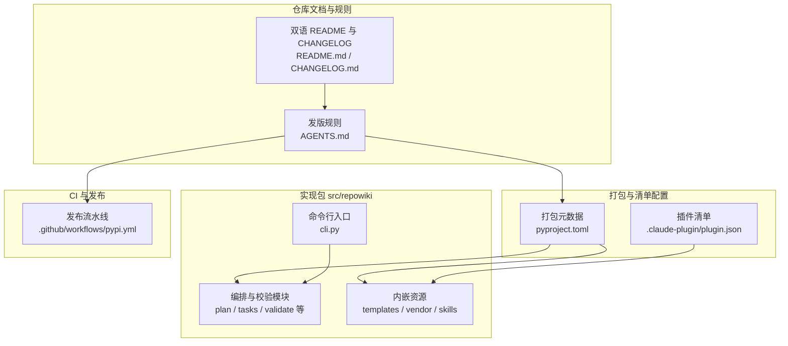
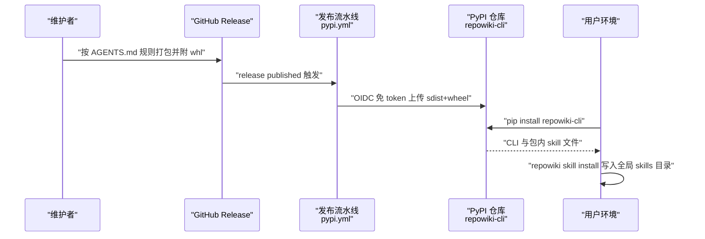
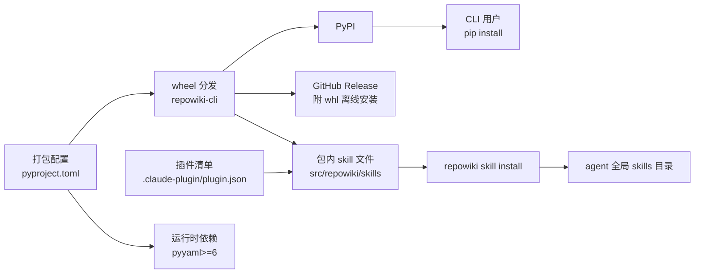

# 仓库结构与分发形态

## 目录
1. [简介](#简介)
2. [项目结构](#项目结构)
3. [核心组件](#核心组件)
4. [架构总览](#架构总览)
5. [详细组件分析](#详细组件分析)
6. [依赖关系分析](#依赖关系分析)
7. [性能与一致性考量](#性能与一致性考量)
8. [故障排查指南](#故障排查指南)
9. [结论](#结论)

## 简介

repowiki 的仓库组织采用 Python 标准的 src 布局，全部实现代码集中在单一包 `src/repowiki` 之下，并围绕这个包形成三条并行的分发线：其一，以分发名 `repowiki-cli` 发布到 PyPI 的 CLI wheel（命令名仍为 `repowiki`）；其二，随 wheel 一起打包、可经 `repowiki skill install` 安装到各类 agent 全局 skills 目录的 Agent Skill 文件；其三，经由 `.claude-plugin/plugin.json` 清单识别的插件市场安装路径。本页梳理这三条分发线对应的仓库结构、打包配置与发版纪律，帮助读者理解「一份源码、多种安装方式」是如何组织的。

章节来源
- [pyproject.toml:5-15](file://pyproject.toml#L5-L15)
- [CHANGELOG.md:47-50](file://CHANGELOG.md#L47-L50)

## 项目结构

仓库根目录同时承载打包配置、包源码、双语文档与 CI 工作流，关键位置如下：

- `pyproject.toml`：打包与元数据单一事实源。声明构建后端 setuptools、分发名 `repowiki-cli`、运行时依赖仅 `pyyaml>=6`、CLI 入口 `repowiki = "repowiki.cli:main"`，并通过 `where = ["src"]` 启用 src 布局。
- `.claude-plugin/plugin.json`：插件市场安装的清单文件，`skills` 字段指向包内 `src/repowiki/skills`，版本号与 `pyproject.toml` 保持同步（当前均为 0.6.0）。
- `src/repowiki/`：唯一实现包，包含 CLI 与全部编排、校验、站点、skill 安装等模块；`skills/repowiki/` 内嵌 SKILL.md 双语文件，`templates/` 内嵌页面模板与站点资源，`vendor/` 内嵌前端渲染库。
- `README.md` 与 `README.en.md`：双语说明书，安装一节给出三条安装路径（源码/pip、skill 安装、离线安装）。
- `CHANGELOG.md` 与 `CHANGELOG.en.md`：双语变更日志，每版按「新增 / 修复 / 文档 / 测试 / 清理」分类。
- `AGENTS.md`：仓库协作规则，其中的发版规则一节约束每次发布必须执行的步骤。
- `.github/workflows/`：CI 与发布流水线，其中 `pypi.yml` 负责在 Release 发布后自动上传 PyPI。
- `tests/`：pytest 测试套件（`testpaths = ["tests"]`）。

图表来源
- [pyproject.toml:39-46](file://pyproject.toml#L39-L46)
- [.claude-plugin/plugin.json:1-9](file://.claude-plugin/plugin.json#L1-L9)
- [AGENTS.md:3-11](file://AGENTS.md#L3-L11)

章节来源
- [pyproject.toml:39-46](file://pyproject.toml#L39-L46)
- [CHANGELOG.md:18-20](file://CHANGELOG.md#L18-L20)
- [CHANGELOG.md:141-146](file://CHANGELOG.md#L141-L146)

## 核心组件

- `pyproject.toml`：打包元数据与构建配置。分发名 `repowiki-cli`、版本 0.6.0、Python ≥ 3.10、运行时依赖仅 `pyyaml>=6`；`[project.scripts]` 把 `repowiki` 命令映射到 `repowiki.cli:main`；`package-data` 把 `templates/*/*`、`vendor/*.js`、`skills/repowiki/*` 一并随 wheel 打包。
- `.claude-plugin/plugin.json`：Claude 插件市场识别的清单。声明插件名 `repowiki`、版本号（须与 `pyproject.toml` 一致）以及 skill 目录 `src/repowiki/skills`。
- `src/repowiki/skills/repowiki/SKILL.md`：内嵌于包内的 Agent Skill 指引（双语），定义 worker 循环契约与硬性规则，是 agent 驱动 CLI 的说明书。
- `src/repowiki/__init__.py`：包版本检测。优先按新分发名 `repowiki-cli` 查询元数据，兼容旧分发名 `repowiki`，源码树直跑时回退 `0.0.0`。
- `AGENTS.md` 发版规则：约束版本号双文件同步、双语 CHANGELOG、wheel 打包、Release 附 whl、测试门禁、`gh release create` 与 PyPI Trusted Publisher 发布的完整链路。
- `.github/workflows/pypi.yml`：PyPI Trusted Publisher 发布流水线，Release 发布即触发，凭 GitHub OIDC 免 token 上传 sdist 与 wheel。

章节来源
- [pyproject.toml:5-15](file://pyproject.toml#L5-L15)
- [pyproject.toml:39-46](file://pyproject.toml#L39-L46)
- [.claude-plugin/plugin.json:2-8](file://.claude-plugin/plugin.json#L2-L8)
- [src/repowiki/__init__.py:13-21](file://src/repowiki/__init__.py#L13-L21)
- [AGENTS.md:3-11](file://AGENTS.md#L3-L11)
- [.github/workflows/pypi.yml:16-25](file://.github/workflows/pypi.yml#L16-L25)

## 架构总览

三条分发线共享同一个打包源头：`AGENTS.md` 的发版规则驱动维护者同步 `pyproject.toml` 与 `.claude-plugin/plugin.json` 的版本号并打包 wheel；wheel 附到 GitHub Release 作为离线安装物料，同时触发 `pypi.yml` 经 Trusted Publisher 自动上传 PyPI；用户 `pip install repowiki-cli` 后，包内的 skill 文件随 wheel 落地，再由 `repowiki skill install` 拷贝到 agent 的全局 skills 目录。整个链路是一条「维护者发布 → 双渠道分发 → 用户一步装 skill」的单向数据流。

图表来源
- [AGENTS.md:3-11](file://AGENTS.md#L3-L11)
- [.github/workflows/pypi.yml:18-41](file://.github/workflows/pypi.yml#L18-L41)
- [README.md:79-87](file://README.md#L79-L87)

章节来源
- [AGENTS.md:3-11](file://AGENTS.md#L3-L11)
- [.github/workflows/pypi.yml:1-14](file://.github/workflows/pypi.yml#L1-L14)
- [CHANGELOG.md:9-14](file://CHANGELOG.md#L9-L14)

## 详细组件分析

### src 布局与包内模块分工

- 职责：`[tool.setuptools.packages.find]` 的 `where = ["src"]` 强制「源码在包内、测试在包外」的标准布局，避免隐式导入当前目录代码，保证 wheel 与源码安装行为一致。
- 关键行为：`package-data` 显式列出随 wheel 分发的非代码资源——`templates/*/*`（双语页面模板）、`templates/site.html` 与 `templates/site/*`（单文件站点骨架）、`vendor/*.js`（内嵌的 marked 与 mermaid 渲染库）、`skills/repowiki/*`（Agent Skill 文件）。
- 实现要点：包内模块按职责单文件划分，CLI 入口经 `[project.scripts]` 暴露为 `repowiki` 命令；skill 文件自 0.6.0 起从仓库根 `skills/repowiki/` 迁入包内 `src/repowiki/skills/repowiki/`，使 wheel 安装与 git/插件安装读到同一份文件（单一事实源）。

章节来源
- [pyproject.toml:42-46](file://pyproject.toml#L42-L46)
- [pyproject.toml:1-3](file://pyproject.toml#L1-L3)
- [CHANGELOG.md:18-20](file://CHANGELOG.md#L18-L20)

### PyPI 分发线（repowiki-cli）

- 职责：把 CLI 以标准 Python 包形式发布到 PyPI，分发名为 `repowiki-cli`——因 PyPI 上的 `repowiki` 名称已被同用途项目占用，故 0.5.1 起定名；命令名 `repowiki` 与 import 包名 `repowiki` 均不受影响。
- 关键行为：发布完全自动化——GitHub Release 发布即触发 `pypi.yml`，流水线内 `python -m build` 构建 sdist 与 wheel，再经 `pypa/gh-action-pypi-publish` 以 Trusted Publisher（GitHub OIDC，`id-token: write`，无任何 API token）上传；首次启用前需在 PyPI 预登记 Pending Publisher（Owner `luomsis`、Repo `repowiki`、Workflow `pypi.yml`、Environment `pypi`）。
- 实现要点：分发名变更后，`__init__.py` 的版本检测优先查询 `repowiki-cli` 元数据、兼容旧名回退，避免干净安装下 `repowiki --version` 显示 `0.0.0`；运行时依赖刻意收敛为仅 `pyyaml>=6`，使离线安装只需额外备料 pyyaml 一个 wheel。

章节来源
- [pyproject.toml:5-15](file://pyproject.toml#L5-L15)
- [CHANGELOG.md:42-50](file://CHANGELOG.md#L42-L50)
- [src/repowiki/__init__.py:13-21](file://src/repowiki/__init__.py#L13-L21)
- [.github/workflows/pypi.yml:1-41](file://.github/workflows/pypi.yml#L1-L41)
- [README.md:98-122](file://README.md#L98-L122)

### Agent Skill 分发线（内嵌 skill 与插件清单）

- 职责：让 agent（Claude Code 等）能自动发现并遵循 repowiki 的工作流指引。skill 文件是纯指引，真正干活的是已安装的 `repowiki` 命令。
- 关键行为：skill 文件随 wheel 打包（`package-data` 的 `skills/repowiki/*`），0.6.0 起提供 `repowiki skill install`：默认装入 `~/.agents/skills/repowiki/`，`--agent claude|codex|zcode|cursor|opencode` 指定客户端目录，`--target` 完全自定义；安装写入版本戳、幂等可重复执行；`repowiki skill status` 报告未安装、手拷无版本戳、过期、已是最新四种状态。
- 实现要点：`.claude-plugin/plugin.json` 面向插件市场安装路径，其 `skills` 字段在 0.6.0 改指包内 `src/repowiki/skills`，与 wheel 打包同源；SKILL.md 内部定义 worker 循环契约（一次只持有一个认领、touch 续期、check 结果分支处理）与硬性规则，是并发 subagent 协作的权威说明。

章节来源
- [pyproject.toml:45-46](file://pyproject.toml#L45-L46)
- [.claude-plugin/plugin.json:8-8](file://.claude-plugin/plugin.json#L8-L8)
- [CHANGELOG.md:9-20](file://CHANGELOG.md#L9-L20)
- [src/repowiki/skills/repowiki/SKILL.md:55-72](file://src/repowiki/skills/repowiki/SKILL.md#L55-L72)
- [src/repowiki/skills/repowiki/SKILL.md:102-107](file://src/repowiki/skills/repowiki/SKILL.md#L102-L107)
- [README.md:75-96](file://README.md#L75-L96)

### 版本与发布纪律（AGENTS.md 发版规则）

- 职责：AGENTS.md 的「发版规则」一节列出每次发布必须遵守的清单，是三条分发线保持版本一致与物料齐全的守门规则。
- 关键行为：七条规则依次覆盖——`pyproject.toml` 与 `.claude-plugin/plugin.json` 版本号同步；`CHANGELOG.md` 与 `CHANGELOG.en.md` 双语各加一节并按「新增 / 修复 / 文档 / 测试 / 清理」分类；`python -m build --wheel` 打包；whl 必须附到 GitHub Release（README「离线安装」一节直接引用 Release 页的 `repowiki_cli-*.whl`，缺失会破坏离线路径）；发版前 `pytest` 全绿；push main 后 `gh release create vX.Y.Z --target <HEAD sha>`；Release 发布后由 `pypi.yml` Trusted Publisher 自动上传 PyPI。
- 实现要点：这套纪律把「版本号三处一致性」（pyproject、plugin.json、CHANGELOG 首节）与「离线物料齐全性」（Release 附 whl）变成发版流程的硬约束，而非依赖人工记忆；CHANGELOG 的历史条目（如 0.3.0 修复过 plugin.json 版本号滞后的实际问题）印证了该规则的由来。

章节来源
- [AGENTS.md:3-11](file://AGENTS.md#L3-L11)
- [CHANGELOG.md:208-208](file://CHANGELOG.md#L208-L208)
- [CHANGELOG.md:5-7](file://CHANGELOG.md#L5-L7)

## 依赖关系分析

- 打包上游：`repowiki-cli` 的运行时依赖仅 `pyyaml>=6`，构建期依赖 `setuptools>=77`；测试依赖经 optional-dependencies 的 `test` extra 引入 `pytest>=8`。
- 分发下游一（PyPI/wheel）：用户经 `pip install repowiki-cli` 获得 CLI 与包内全部资源（模板、vendor 前端库、skill 文件）。
- 分发下游二（Agent Skill）：包内 skill 文件经 `repowiki skill install` 拷入各类 agent 的全局 skills 目录；skill 只调用本机已装的 `repowiki` 命令，不需要任何在线服务。
- 分发下游三（插件市场）：`.claude-plugin/plugin.json` 依赖仓库内 `src/repowiki/skills` 路径有效，插件安装按清单定位 skill 文件。
- 流程约束：AGENTS.md 发版规则约束 `pyproject.toml`、`.claude-plugin/plugin.json` 与 Release 物料之间的版本一致性。

图表来源
- [pyproject.toml:15-15](file://pyproject.toml#L15-L15)
- [pyproject.toml:45-46](file://pyproject.toml#L45-L46)
- [README.md:98-122](file://README.md#L98-L122)
- [CHANGELOG.md:9-14](file://CHANGELOG.md#L9-L14)

章节来源
- [pyproject.toml:36-40](file://pyproject.toml#L36-L40)
- [README.md:98-122](file://README.md#L98-L122)
- [AGENTS.md:5-5](file://AGENTS.md#L5-L5)

## 性能与一致性考量

- 依赖面极小：运行时仅 `pyyaml>=6`，使离线安装只需仓库源码（或 whl）加一个 pyyaml wheel，也压缩了供应链风险面。
- 单一事实源：skill 文件自 0.6.0 迁入包内后，wheel 安装、git 安装与插件安装读同一份文件，消除了旧布局下双份文件漂移的可能。
- 版本一致性由流程保障：`pyproject.toml` 与 `.claude-plugin/plugin.json` 需人工保持同步（AGENTS.md 第 1 条），历史上曾出现 plugin.json 版本滞后的缺陷（0.3.0 修复），这是当前双文件同步规则的直接动机。
- 离线一致性：Release 页附带的 `repowiki_cli-*.whl` 是离线安装的唯一权威物料，AGENTS.md 第 4 条把「忘记附 whl」定义为破坏性遗漏。
- 版本检测的向后兼容：`__init__.py` 对新旧两个分发名依次查询元数据，保证从旧名升级到 `repowiki-cli` 的环境中 `--version` 输出连续。

章节来源
- [pyproject.toml:1-15](file://pyproject.toml#L1-L15)
- [CHANGELOG.md:18-20](file://CHANGELOG.md#L18-L20)
- [AGENTS.md:3-11](file://AGENTS.md#L3-L11)
- [CHANGELOG.md:208-208](file://CHANGELOG.md#L208-L208)
- [src/repowiki/__init__.py:13-21](file://src/repowiki/__init__.py#L13-L21)

## 故障排查指南

- `repowiki --version` 显示 `0.0.0`：多为分发名变更后的旧版残留——干净安装的旧版本按旧分发名查询元数据失败；升级到已适配 `repowiki-cli` 的版本（0.5.1 及以后）即可。版本检测逻辑见 `src/repowiki/__init__.py`。
- `repowiki skill install` 后 agent 未识别 skill：确认安装目标目录与所用客户端匹配（`--agent` 或 `--target`），安装后需重启客户端会话生效；用 `repowiki skill status` 查看四态（未安装、手拷无版本戳、过期、已是最新）定位。
- 离线机安装失败：按 README「离线安装」节备齐三样物料——仓库源码或 `repowiki_cli-*.whl`、按目标平台预下载的 pyyaml wheel、Python ≥ 3.10；注意 pyyaml wheel 在 macOS/Linux 各架构与 Windows 之间互不通用。
- PyPI 未随 Release 自动发布：检查 `pypi.yml` 是否在 PyPI 侧正确登记为 Trusted Publisher（项目名 `repowiki-cli`、Owner `luomsis`、Workflow 文件名必须与 `pypi.yml` 完全一致、Environment `pypi`），且触发来源为 Release published 事件。
- 插件方式安装后找不到 skill：核对 `.claude-plugin/plugin.json` 的 `skills` 字段指向（应为 `src/repowiki/skills`），旧版插件清单可能仍指向已迁移的仓库根 `skills/repowiki/` 旧路径。

章节来源
- [src/repowiki/__init__.py:13-21](file://src/repowiki/__init__.py#L13-L21)
- [README.md:75-96](file://README.md#L75-L96)
- [README.md:98-122](file://README.md#L98-L122)
- [.github/workflows/pypi.yml:1-14](file://.github/workflows/pypi.yml#L1-L14)
- [.claude-plugin/plugin.json:8-8](file://.claude-plugin/plugin.json#L8-L8)
- [CHANGELOG.md:42-50](file://CHANGELOG.md#L42-L50)

## 结论

repowiki 以 src 布局单包 `src/repowiki` 为唯一实现载体，通过 `pyproject.toml`（PyPI/wheel 线）、包内 skill 资源加 `repowiki skill install`（Agent Skill 线）与 `.claude-plugin/plugin.json`（插件市场线）把同一份源码分发到三类消费场景；AGENTS.md 的发版规则把版本同步、双语 CHANGELOG、Release 物料与 Trusted Publisher 发布固化为七步纪律。理解本页后，应通过 `pip install repowiki-cli` 获取 CLI、再执行 `repowiki skill install` 安装 agent 指引；发版时严格按 AGENTS.md 逐条执行，避免版本漂移或离线物料缺失。

章节来源
- [pyproject.toml:5-15](file://pyproject.toml#L5-L15)
- [AGENTS.md:3-11](file://AGENTS.md#L3-L11)

<cite>
**本文引用的文件**
- [pyproject.toml](file://pyproject.toml)
- [.claude-plugin/plugin.json](file://.claude-plugin/plugin.json)
- [src/repowiki/skills/repowiki/SKILL.md](file://src/repowiki/skills/repowiki/SKILL.md)
- [CHANGELOG.md](file://CHANGELOG.md)
- [AGENTS.md](file://AGENTS.md)
- [README.md](file://README.md)
- [.github/workflows/pypi.yml](file://.github/workflows/pypi.yml)
- [src/repowiki/__init__.py](file://src/repowiki/__init__.py)
</cite>
