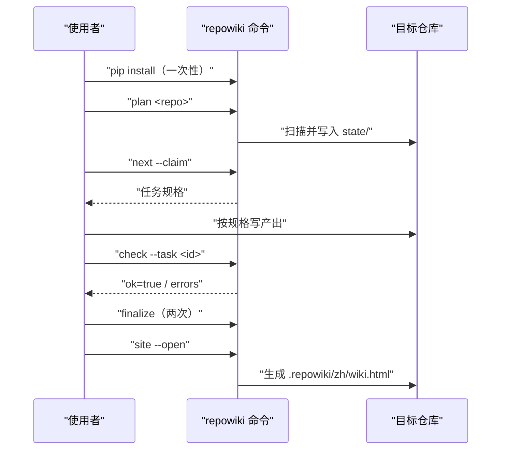
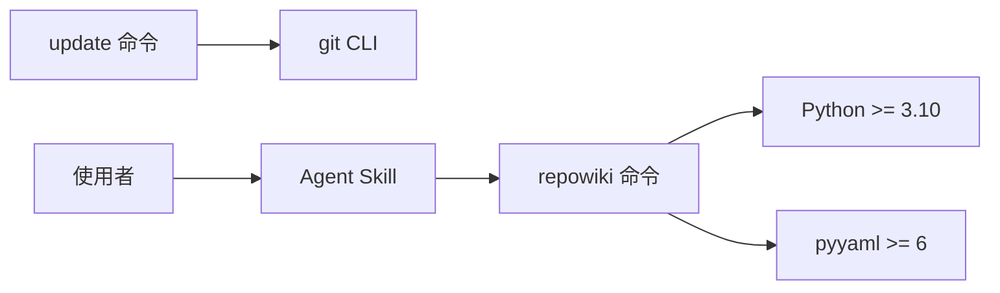

# 安装与快速上手

<cite>
**本文引用的文件**
- [README.md](file://README.md)
- [pyproject.toml](file://pyproject.toml)
- [skills/repowiki/SKILL.md](file://skills/repowiki/SKILL.md)
- [src/repowiki/plan.py](file://src/repowiki/plan.py)
</cite>

## 目录
1. [简介](#简介)
2. [项目结构](#项目结构)
3. [核心组件](#核心组件)
4. [架构总览](#架构总览)
5. [详细组件分析](#详细组件分析)
6. [依赖关系分析](#依赖关系分析)
7. [性能与一致性考量](#性能与一致性考量)
8. [故障排查指南](#故障排查指南)
9. [结论](#结论)

## 简介
本页介绍把 repowiki 跑起来所需的全部步骤：CLI 的三种安装方式（pip/pipx、源码可编辑安装、离线安装）、可选的 Agent Skill 安装，以及从 `plan` 到 `site` 的最小可用流程。repowiki 的运行时依赖只有 pyyaml 一项，因此安装与离线分发都异常简单——这也是「零网络」设计在安装环节的直接收益。

章节来源
- [README.md:21-32](file://README.md#L21-L32)
- [pyproject.toml:13](file://pyproject.toml#L13-L13)

## 项目结构
与安装相关的资产分布在仓库三处，各司其职：

- `pyproject.toml`：包定义与入口点（`repowiki = "repowiki.cli:main"`），pip 安装后生成同名命令。
- `skills/repowiki/SKILL.md`：符合开放约定的 Agent Skill 目录，教 agent 按正确流程调用 CLI。
- `.claude-plugin/plugin.json`：插件市场清单，支持把本仓库直接作为插件安装。

章节来源
- [pyproject.toml:25-32](file://pyproject.toml#L25-L32)
- [README.md:34-43](file://README.md#L34-L43)

## 核心组件
- CLI 包：Python 3.10+ 可装，macOS/Linux/Windows 原生支持，安装后提供 `repowiki` 命令。
- Agent Skill：纯文本目录，可整目录拷入客户端 skills 目录（如 `~/.agents/skills/repowiki/`），只调用本机已装好的命令，不需要任何在线服务。
- 离线安装物料：仓库源码（或 wheel）、pyyaml wheel、目标机上的 Python 3.10+，三样齐备即可在无网机器安装。

章节来源
- [README.md:23-32](file://README.md#L23-L32)
- [README.md:45-69](file://README.md#L45-L69)

## 架构总览
安装完成后，一次最小的生成流程是五个命令的循环推进：规划、领取、校验（反复）、组装、渲染站点。下图是它的时间线：

图表来源
- [README.md:73-80](file://README.md#L73-L80)
- [skills/repowiki/SKILL.md:27-37](file://skills/repowiki/SKILL.md#L27-L37)

章节来源
- [README.md:71-80](file://README.md#L71-L80)

## 详细组件分析
### CLI 安装
- 职责：提供可执行命令与全部依赖。
- 关键行为：`pip install git+https://github.com/luomsis/repowiki.git` 或 `pipx install`；已克隆仓库时在仓库根 `pip install -e .`。
- 实现要点：入口点指向 `repowiki.cli:main`，包数据（templates 与 vendor）由 `package-data` 声明随包安装。

章节来源
- [README.md:25-28](file://README.md#L25-L28)
- [pyproject.toml:25-32](file://pyproject.toml#L25-L32)

### Agent Skill 安装
- 职责：让 agent 客户端能自动触发正确的工作流。
- 关键行为：插件市场安装或手动把 `skills/repowiki/` 拷入个人 skills 目录。
- 实现要点：skill 只是指引，真正干活的是第 1 步装的命令；两者可独立更新。

章节来源
- [README.md:34-43](file://README.md#L34-L43)
- [skills/repowiki/SKILL.md:6-9](file://skills/repowiki/SKILL.md#L6-L9)

### 离线安装
- 职责：在无法访问 PyPI/GitHub 的目标机上完成部署。
- 关键行为：有网机器上 `pip download PyYAML==6.* -d wheels/` 与 `pip wheel --no-deps -w wheels/ .`，拷贝后 `pip install --no-index` 依次装依赖与本体。
- 实现要点：运行时依赖只有 pyyaml，因此离线物料清单极短；skill 是纯文本目录，直接拷贝即离线可用。

章节来源
- [README.md:45-69](file://README.md#L45-L69)

**章节来源**
- [pyproject.toml:1-13](file://pyproject.toml#L1-L13)

## 依赖关系分析
- Python 3.10+ 是唯一硬性运行环境要求（用到 `X | Y` 类型语法与标准库文件锁）。
- pyyaml 仅被知识卡片的 front matter 校验使用，页面流程不经过它。
- `update` 命令额外依赖目标仓库的 git CLI，git 预装的机器无需配置。
- Agent Skill 依赖客户端支持 SKILL.md 开放约定，但这是可选增强，不是运行前提。

图表来源
- [pyproject.toml:9-13](file://pyproject.toml#L9-L13)
- [README.md:68-69](file://README.md#L68-L69)

章节来源
- [README.md:23-24](file://README.md#L23-L24)

## 性能与一致性考量
- 安装体积小：除 Python 与 pyyaml 外无任何运行时依赖，vendor 的前端库只在生成站点时被内嵌进 HTML，不影响安装。
- 版本一致性：skill 与 CLI 可独立升级，但 skill 描述的流程契约（命令与退出码语义）以 CLI 版本为准，混用新旧版本时以 `repowiki --version` 核对。
- 幂等性：`plan` 在已有合法 catalog 时直接展开页面任务，重复执行不产生重复任务；`site` 可随时重跑重建。

章节来源
- [README.md:39](file://README.md#L39-L39)
- [src/repowiki/plan.py:72-85](file://src/repowiki/plan.py#L72-L85)

## 故障排查指南
- `command -v repowiki` 无输出：命令未装或不在 PATH，重新执行 pip 安装并核对 Python 环境。
- Windows 下无法安装：确认 Python 3.10+，无需 WSL，全部功能在 PowerShell/cmd/git-bash 下原生可用。
- 离线机安装报缺依赖：先装 pyyaml wheel 再装本体，顺序不能反；wheel 平台架构必须与目标机匹配。
- agent 不自动触发流程：确认 skill 目录已拷入所用客户端的 skills 路径，或改用手动执行命令。

章节来源
- [README.md:30-32](file://README.md#L30-L32)
- [README.md:52-56](file://README.md#L52-L56)
- [skills/repowiki/SKILL.md:20-21](file://skills/repowiki/SKILL.md#L20-L21)

## 结论
安装 repowiki 只需一条 pip 命令，可选地配一个纯文本 skill 让 agent 自动驱动；离线场景因为依赖极简也只需三样物料。跑通 `plan → next → check → finalize → site` 五步即可得到第一份 Wiki，之后的章节会逐层展开每一步背后的机制。

章节来源
- [README.md:71-94](file://README.md#L71-L94)
