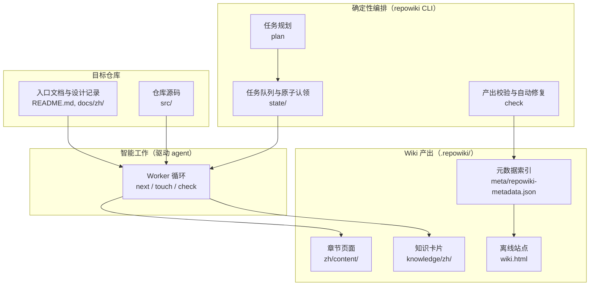
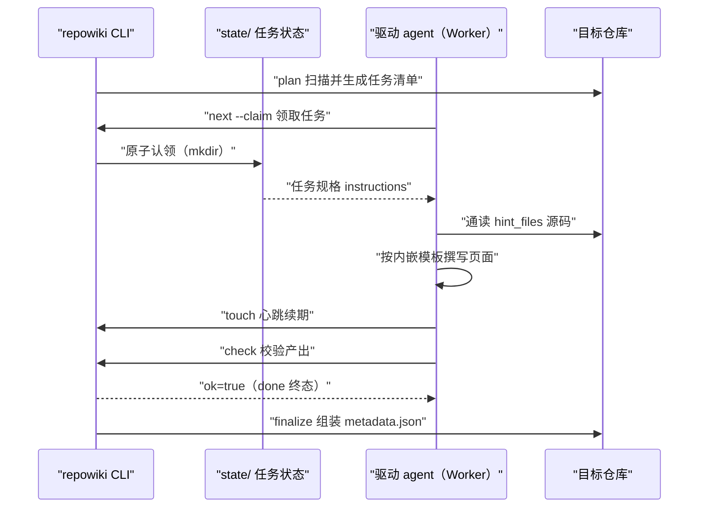
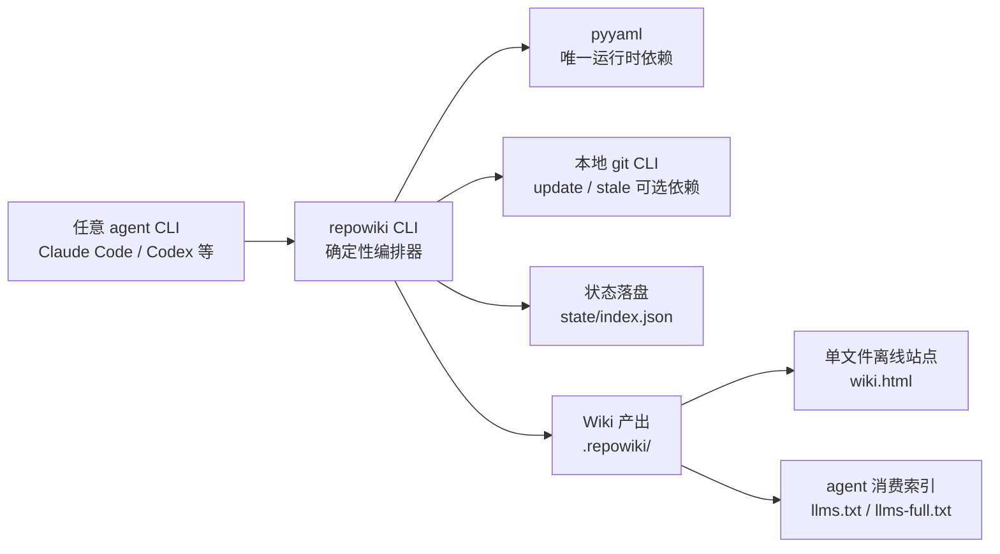

# 定位与设计理念

## 目录
1. [简介](#简介)
2. [项目结构](#项目结构)
3. [核心组件](#核心组件)
4. [架构总览](#架构总览)
5. [详细组件分析](#详细组件分析)
6. [依赖关系分析](#依赖关系分析)
7. [性能与一致性考量](#性能与一致性考量)
8. [故障排查指南](#故障排查指南)
9. [结论](#结论)

## 简介

本页说明 repowiki 的项目定位与设计理念。repowiki 是一个为任意代码仓库生成结构化 Wiki 的确定性构建系统：它把「读代码、写 wiki」的智能工作留给驱动它的任意 agent（Claude Code / Codex / OpenCode 等 agent CLI 或人），而把任务规划、原子认领、产出校验、自动修复、断点续跑、元数据组装等一切需要可靠性的环节做成无 LLM、零 API Key、零网络调用的确定性代码。本页梳理它面向的问题、编排器与 agent 的职责边界、产出物形态以及产出语言策略，是理解后续各机制章节的前提。

## 项目结构

repowiki 自身的仓库以 README.md 为入口说明定位、特性与用法；docs/zh/ 目录下的 CONTEXT.md 与 DECISIONS.md 分别承载领域词汇表与实现过程中的最小合理决策记录；CLI 源码位于 src/repowiki/。对一个目标仓库执行 repowiki 后，全部产出集中落在 `<repo>/.repowiki/` 目录（README.md:135-148）：

- `.repowiki/<locale>/content/`：章节树形式的 Wiki 页面，目录名即章节名，含索引页与子页，使用固定模板；
- `.repowiki/<locale>/meta/repowiki-metadata.json`：finalize 产出的机器可读元数据索引（catalogs/items/source_files/snippets/relations）；
- `.repowiki/<locale>/wiki.html`：单文件离线查看站点，由 `site` 命令生成，同时导出 `llms.txt` / `llms-full.txt` agent 消费索引；
- `.repowiki/knowledge/<locale>/`：可选的知识卡片（机制卡片与模块文档），独立于页面体系；
- `.repowiki/state/`：任务清单、任务规格、认领与 locale 等内部运行时状态，可随时删除重规划。

图表来源
- [README.md:135-148](file://README.md#L135-L148)

章节来源
- [README.md:135-148](file://README.md#L135-L148)
- [docs/zh/CONTEXT.md:9-41](file://docs/zh/CONTEXT.md#L9-L41)

## 核心组件

- 确定性编排器（repowiki CLI）：负责任务规划、原子认领、产出校验、自动修复与元数据组装；plan / claim / check 全是确定性代码，不绑定任何 agent CLI，无需 API Key、零网络调用（README.md:12-14、42-43）。
- 驱动 agent：承担全部智能工作——读仓库源码、按任务规格撰写 Wiki 页面；任何「能跑 shell + 读写文件」的执行者都能参与，包括并发（README.md:13-14）。
- 任务与任务规格：任务是编排器发放的最小工作单元（含唯一 id、类型、产出路径与规格）；任务规格内嵌完整写作指引（模板、文风、hint 文件清单），使任何 worker 无需额外上下文即可执行（docs/zh/CONTEXT.md:49-55）。
- 认领与心跳：认领是 worker 对某个任务的一次原子独占，同一任务同一时刻至多一个有效认领；worker 执行期靠 touch 心跳续期，过期认领自动回收重新入队（docs/zh/CONTEXT.md:63-77）。
- Wiki 产出物：仓库 Wiki、Wiki 页面、章节、总览、源码引用、元数据索引、知识卡片与 Wiki 站点八类概念共同构成产出形态（docs/zh/CONTEXT.md:9-41）。

章节来源
- [README.md:10-16](file://README.md#L10-L16)
- [README.md:42-51](file://README.md#L42-L51)
- [docs/zh/CONTEXT.md:43-77](file://docs/zh/CONTEXT.md#L43-L77)

## 架构总览

两个角色的分工可以概括为一句话：「agent 负责聪明，repowiki 负责靠谱」（README.md:38）。运行时交互遵循 worker 循环契约：`plan` 扫描仓库生成任务清单后，任意多个 worker 反复执行「next 领取任务、按规格撰写、touch 心跳续期、check 校验」，直至队列清空，最后由 finalize 组装元数据（README.md:124-133、180-196）。一次只持有一个认领：当前任务 check 通过（或放弃）后才回到 next，worker 中途异常退出时过期认领也会自动回队列。

图表来源
- [README.md:180-196](file://README.md#L180-L196)

章节来源
- [README.md:124-133](file://README.md#L124-L133)
- [README.md:180-196](file://README.md#L180-L196)

## 详细组件分析

### 面向的问题：三条路线的取舍

- 职责：说明 repowiki 为什么存在，即它解决「LLM 直接撰写 wiki 不可控、难并发」的问题。
- 关键行为：给仓库生成 wiki 的现成方案主要有两条路——云端 AI wiki 服务（代码要上传、按量付费、产出是黑盒），或让一个 agent 直接通读仓库现写（大仓库上下文装不下、中断即前功尽弃、难以并行）（README.md:23-24）。
- 实现要点：repowiki 走第三条路——读代码、写 wiki 的智能留给任意 agent，其余一切（任务规划、原子认领、产出校验、自动修复、断点续跑）做成确定性构建系统；由此换来任务切分逐页生成、状态落盘断点续跑、多 worker 原子认领天然并行，以及「模板强制 + 程序化校验 + 自动修复」的质量兜底而非靠 agent 自觉（README.md:25-36）。

章节来源
- [README.md:21-38](file://README.md#L21-L38)

### 职责边界：确定性编排与 agent 智能

- 职责：划清 CLI 与 agent 各自承担的工作，这是本项目最核心的设计理念。
- 关键行为：CLI 只做确定性部分——plan / claim / check / 自动修复全是确定性代码；锚点、行号区间、H1、路径分隔符由程序自动修复，只有语义缺陷（缺章节、引用不存在文件、mermaid 不闭合）才判失败（README.md:42、51、268-269）。
- 关键行为：agent 只做智能部分——读代码、写 wiki，按任务规格内嵌的模板与文风规范产出；规格空白处不臆造，记录为最小合理决策（docs/zh/DECISIONS.md:1-5）。
- 实现要点：关键契约均由并发测试暴露后固化为决策，例如 next 返回体的 busy 等待语义（空且 busy>0 时 worker 须等待重试，防止提前退出导致任务无人接手）、以 claim 目录 mtime 为认领过期判定依据（docs/zh/DECISIONS.md:7-13）。

章节来源
- [README.md:42-51](file://README.md#L42-L51)
- [README.md:268-269](file://README.md#L268-L269)
- [docs/zh/DECISIONS.md:1-13](file://docs/zh/DECISIONS.md#L1-L13)

### 产出物形态

- 职责：定义 repowiki 最终交付什么、交付到哪里。
- 关键行为：Wiki 页面是基本写作单元，一个 markdown 文件，固定模板结构（引用块、目录、必备小节、mermaid 图）；页面模板按原型分两种——module（结构型，默认）与 flow（流程型），由 catalog 节点的可选 archetype 字段声明，校验器按原型分规则（README.md:170-174；docs/zh/DECISIONS.md:63-68）。
- 关键行为：元数据索引是 finalize 产出的机器可读索引（章节树、源文件、代码片段及其与页面的关系），只含可读字段、不输出内部运行时状态（docs/zh/CONTEXT.md:31-33；README.md:279）。
- 关键行为：知识卡片是可选的机制卡片与模块文档，独立于页面体系，类别可用 `--categories` 整表替换内置六类（docs/zh/CONTEXT.md:35-37；docs/zh/DECISIONS.md:75-78）。
- 关键行为：Wiki 站点由 `site` 命令把整份 wiki 打包为单个自包含 HTML（约 4-5 MB），内嵌 markdown/mermaid 渲染库与被引用的源码行，双击即看；同时导出 `llms.txt` / `llms-full.txt` 供任何 agent / IDE 按索引直接读 wiki（README.md:46-48、159-168）。
- 实现要点：页面中每段结论以 `file://` 源码引用回溯到代码，这正是模板强制「章节来源 / 图表来源」的原因（docs/zh/CONTEXT.md:27-29）。

章节来源
- [README.md:135-148](file://README.md#L135-L148)
- [README.md:159-176](file://README.md#L159-L176)
- [docs/zh/CONTEXT.md:9-41](file://docs/zh/CONTEXT.md#L9-L41)
- [docs/zh/DECISIONS.md:63-78](file://docs/zh/DECISIONS.md#L63-L78)

### 产出语言策略

- 职责：说明 zh / en 产出语言如何决定与变更。
- 关键行为：plan 时自动检测目标仓库语言（README 权重最高），也可 `--locale zh|en` 显式指定；检测结果持久化于 `state/locale`（README.md:15、229）。
- 实现要点：产出语言由 plan 时确定并持久化，中途换语言需 `plan --replan`；语言范围冻结为简体中文与英文，表驱动机制保留但不再扩展（README.md:281、288；docs/zh/DECISIONS.md:81-86）。

章节来源
- [README.md:284-292](file://README.md#L284-L292)
- [docs/zh/DECISIONS.md:81-86](file://docs/zh/DECISIONS.md#L81-L86)

## 依赖关系分析

- 上游（谁依赖 repowiki）：驱动 agent 依赖 CLI 的 next / touch / check 契约参与协作；CLI 对 agent CLI 保持不可知——不做检测也不做执行器，这是明确的 Non-Goal（README.md:14、292）。
- 运行时依赖：仅 `pyyaml>=6`；离线安装只需仓库源码、pyyaml 的 wheel 与目标机上的 Python ≥ 3.10（README.md:100）。
- 可选外部依赖：`update` / `stale` 依赖目标仓库本地的 git CLI（`git diff` / `git rev-parse`），git 预装的机器无需额外配置；repowiki 自身始终保持零网络（README.md:121-122）。
- 下游（产出被谁消费）：人通过 wiki.html 单文件离线站点阅读；其他 agent / IDE 通过 `llms.txt` / `llms-full.txt` 静态索引读取 wiki，不提供 MCP 封装（README.md:48、292）。

图表来源
- [README.md:42-51](file://README.md#L42-L51)

章节来源
- [README.md:98-122](file://README.md#L98-L122)
- [README.md:290-292](file://README.md#L290-L292)

## 性能与一致性考量

- 并发安全：原子 `mkdir` 认领 + 目录 mtime 过期判定（默认 15 分钟，`REPOWIKI_STALE_SECONDS` 可调）；过期判定以 claim 目录自身 mtime 为准而非目录内 ts 文件，避免 mkdir 与 ts 写入之间的竞态窗口误判（README.md:262-263；docs/zh/DECISIONS.md:12-13）。
- 队列自愈：崩溃或被杀 worker 的过期认领由 next 自动回收重新入队（改名 `.stale-*` 留痕、attempts+1，毒任务上限照常生效），无需人工释放；存活信号只有自愿的 touch 心跳——repowiki 是短命 CLI 进程，记录的 pid 无存活意义，因此不做 pid 存活检测（README.md:264-266；docs/zh/DECISIONS.md:38-49）。
- 确定性优先：锚点、行号区间、H1、路径分隔符由程序自动修复，只有语义缺陷才判失败，保证产出一致性不依赖 agent 自觉（README.md:268-269）。
- 断点续跑：每任务状态落盘（`state/index.json`），随时中断随时继续；状态文件损坏时保留现场并明确报错，绝不静默清空任务清单（README.md:270-271）。
- 并行度：页面间零链接，正因如此所有页面任务可完全并行；代价是每个任务规格内嵌完整模板与文风规范（约 4-6k tokens）以换取任务自包含与并行安全（README.md:174-176、286-287）。

章节来源
- [README.md:260-275](file://README.md#L260-L275)
- [docs/zh/DECISIONS.md:12-13](file://docs/zh/DECISIONS.md#L12-L13)
- [docs/zh/DECISIONS.md:38-49](file://docs/zh/DECISIONS.md#L38-L49)

## 故障排查指南

- `next` 返回任务为空但 busy>0：其他 worker 正在执行，等待 30 秒后重试即可，不要退出——busy 契约正是为避免 worker 在他人执行中时提前退出、后续任务无人接手而设（README.md:186-188；docs/zh/DECISIONS.md:7-11）。
- `check` 报「由他人认领」冲突（退出码 2）：手中认领已过期并被其他 worker 接手；正确做法是不争抢、不加 --force，回到 next 继续领取新任务（README.md:244）。
- 长任务被过期回收：通常是撰写期间忘记定期 touch；心跳是唯一存活信号，执行期应每约 3 分钟续期一次，认领超过 stale 窗口未续期会被自动转给他人（README.md:190；docs/zh/CONTEXT.md:75-77）。
- finalize 退出码 3：属正常进展而非错误——首次 finalize 创建了阶段 3 的 overview 任务，写完总览并 check 通过后再次运行 finalize 即可生成 metadata.json（docs/zh/DECISIONS.md:21-22；README.md:244）。
- 产出语言与预期不符：语言在 plan 时确定并持久化，中途换语言需 `plan --replan` 重新规划（README.md:288）。

章节来源
- [README.md:180-196](file://README.md#L180-L196)
- [README.md:244](file://README.md#L244)
- [docs/zh/DECISIONS.md:7-22](file://docs/zh/DECISIONS.md#L7-L22)

## 结论

repowiki 的定位是「Wiki 的构建系统」而非「会写文档的 AI」：它以确定性编排（规划、认领、校验、修复、组装）承接可靠性，以任意驱动的 agent 承接智能，用任务切分与原子认领把大仓库的 wiki 生成变成可并行、可续跑的构建过程，产出落在 `.repowiki/` 下的章节页面、元数据、知识卡片与单文件离线站点（README.md:10-16、21-38、135-148）。正确使用方式是：plan 规划、多 worker 按循环契约领取执行（遵守 touch 心跳纪律）、check 校验、finalize 组装、site 出离线站点；注意事项包括产出语言在 plan 时锁定、页面之间零链接、以及只有语义缺陷才会导致校验失败。

章节来源
- [README.md:10-16](file://README.md#L10-L16)
- [README.md:260-275](file://README.md#L260-L275)

<cite>
**本文引用的文件**
- [README.md](file://README.md)
- [docs/zh/CONTEXT.md](file://docs/zh/CONTEXT.md)
- [docs/zh/DECISIONS.md](file://docs/zh/DECISIONS.md)
</cite>
