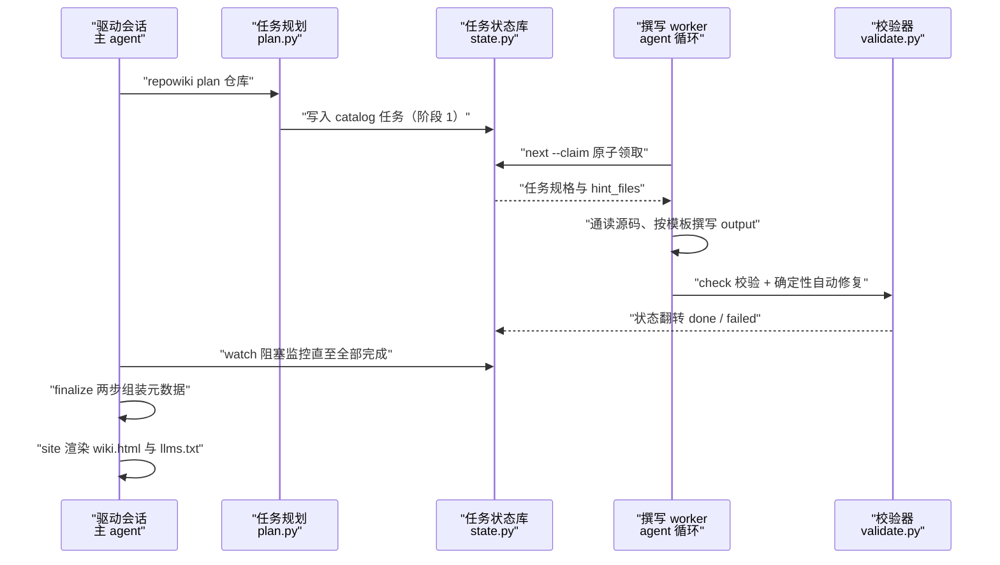
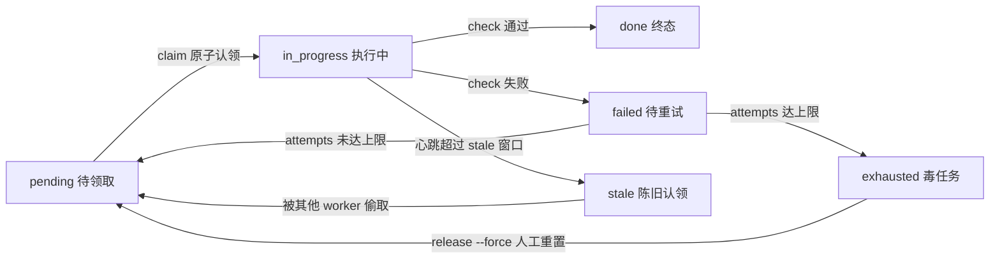

# 端到端构建流程

<cite>
**本文引用的文件**
- [cli.py](file://src/repowiki/cli.py)
- [plan.py](file://src/repowiki/plan.py)
- [dispatch.py](file://src/repowiki/dispatch.py)
- [state.py](file://src/repowiki/state.py)
- [validate.py](file://src/repowiki/validate.py)
- [metadata.py](file://src/repowiki/metadata.py)
- [site.py](file://src/repowiki/site.py)
- [output.py](file://src/repowiki/output.py)
</cite>

## 更新摘要

**变更内容**
- 校验器 `validate.py` 的行号校验策略改为分层处理：仅终点越界（end > 文件行数）自动钳制到文件末尾并记入 fixed；起点越界（start > 文件行数）或区间倒置（start > end）改判 error 打回重写；新增「引用区间全为空行 → error」规则——本页「步骤 4」小节的 check 行为描述已同步改写，见 [src/repowiki/validate.py:162-201](file://src/repowiki/validate.py#L162-L201)。
- `check_page` 新增逐小节规则：每个 `##` 小节（目录与更新摘要除外）必须非空且携带「章节来源」来源标记，否则判失败，见 [src/repowiki/validate.py:227-240](file://src/repowiki/validate.py#L227-L240)；本页「结论」小节据此补齐了来源引用。
- `check_page` 新增 `known_paths` 参数：`check` 调用时传入仓库文件清单（`inv.known_paths()`），用于把 mermaid 图节点标签中形如文件名的 token 与真实文件核对，不存在仅告警（warning），见 [src/repowiki/dispatch.py:354-357](file://src/repowiki/dispatch.py#L354-L357)。
- 「故障排查指南」新增针对上述新校验报错的排查条目；顺带清理了页面末尾残留的杂散标记文本。

## 目录
1. [更新摘要](#更新摘要)
2. [简介](#简介)
3. [流程总览](#流程总览)
4. [关键步骤](#关键步骤)
5. [参与组件](#参与组件)
6. [数据与状态变化](#数据与状态变化)
7. [故障排查指南](#故障排查指南)
8. [结论](#结论)

## 简介

端到端构建流程是 repowiki 把一个代码仓库变成结构化 Wiki 的完整生命周期：由 `repowiki plan` 触发（扫描仓库、检测语言、铺设任务清单），经「`next --claim` 领取 → agent 按规格撰写 → `check` 校验与自动修复」的循环消化任务队列，队列清空后由 `finalize` 组装元数据（含阶段 3 的 overview 任务），最终以 `repowiki site` 生成单文件离线站点并导出 `llms.txt` 索引收尾。该流程横跨 `src/repowiki/` 下的编排层（`cli.py`、`dispatch.py`）、规划层（`plan.py`）、执行层（`state.py` 任务状态库）与产出层（`validate.py`、`metadata.py`、`site.py`），是理解 repowiki「确定性编排器 + agent 执行者」协作模式的主干路径。

章节来源
- [src/repowiki/cli.py:1-5](file://src/repowiki/cli.py#L1-L5)
- [src/repowiki/cli.py:35-101](file://src/repowiki/cli.py#L35-L101)
- [src/repowiki/plan.py:38-103](file://src/repowiki/plan.py#L38-L103)

## 流程总览

端到端路径为：`plan` 扫描仓库并落首个 catalog 任务（阶段 1）→ catalog 任务通过 `check` 后展开全部页面任务（阶段 2）→ worker 循环领取、撰写、校验直至队列清空 → `finalize` 第一次运行创建 overview 任务（阶段 3），第二次运行组装 `zh/meta/repowiki-metadata.json` → `site` 读取元数据渲染 `zh/wiki.html` 并写出 `llms.txt` / `llms-full.txt`。标准串行流程由单一驱动会话顺序执行各步；多 worker 并发流程中，多个等价 worker 并行消费同一个全局 FIFO 队列，主 agent 以 `watch` 阻塞监控进度，`state.py` 的原子认领与 stale 回收保证并发安全——流程形状不变，仅调度方式不同。

图表来源
- [src/repowiki/cli.py:35-101](file://src/repowiki/cli.py#L35-L101)
- [src/repowiki/dispatch.py:50-76](file://src/repowiki/dispatch.py#L50-L76)
- [src/repowiki/dispatch.py:127-200](file://src/repowiki/dispatch.py#L127-L200)

章节来源
- [src/repowiki/plan.py:80-88](file://src/repowiki/plan.py#L80-L88)
- [src/repowiki/dispatch.py:382-410](file://src/repowiki/dispatch.py#L382-L410)
- [src/repowiki/metadata.py:28-58](file://src/repowiki/metadata.py#L28-L58)
- [src/repowiki/site.py:36-88](file://src/repowiki/site.py#L36-L88)

## 关键步骤

### 步骤 1：plan——扫描仓库并铺设任务清单

- 输入：目标仓库路径与可选参数（`--locale`、`--max-pages`、`--knowledge`、`--replan`）。
- 处理：`scan` 盘点仓库文件，代码文件数不足 `MIN_CODE_FILES = 10` 时拒绝生成；按「显式 `--locale` > 已持久化的 `state/locale` > README 加权自动检测」确定产出语言；已有合法 catalog 则展开为页面任务，否则只添加 catalog 规划任务（阶段 1），`--knowledge` 时附加知识卡片任务集；最后输出任务统计与领取指引。
- 失败路径：仓库过小抛 `UsageError`（exit 1）；`--replan` 检测到 in_progress 任务（`_busy_tasks`）或 index 不可解析时要求显式 `--force`，防止删除正在被写入的产物；catalog 存在但校验失败时告警并回退为重新规划。

章节来源
- [src/repowiki/plan.py:17](file://src/repowiki/plan.py#L17)
- [src/repowiki/plan.py:41-53](file://src/repowiki/plan.py#L41-L53)
- [src/repowiki/plan.py:55-68](file://src/repowiki/plan.py#L55-L68)
- [src/repowiki/plan.py:80-88](file://src/repowiki/plan.py#L80-L88)
- [src/repowiki/plan.py:116-124](file://src/repowiki/plan.py#L116-L124)

### 步骤 2：next --claim——原子领取任务

- 输入：仓库路径、`--worker` 标识与 `--claim` 开关。
- 处理：`run_next` 从就绪任务中按全局 FIFO 顺序领取一个任务；认领的原子性由 `TaskStore._try_mkdir_claim` 保证——对 `state/claims/<id>/` 执行 `os.mkdir`（已存在即失败），成功后写入 `worker` 与 `ts` 文件并把任务状态置为 `in_progress`、`attempts` 加一；`ready_tasks` 只发放当前开放阶段中 pending/failed（未达重试上限）的任务，以及认领已 stale 的 in_progress 任务（原 worker 已死亡）。
- 失败路径：认领竞争失败抛 `ConflictError`，`run_next` 静默跳过、下次 `next` 重新挑选；队列为空且 busy>0 时其他 worker 正在写，worker 应等待约 30 秒重试；busy=0 则全部完成，循环结束。

章节来源
- [src/repowiki/dispatch.py:50-76](file://src/repowiki/dispatch.py#L50-L76)
- [src/repowiki/state.py:219-243](file://src/repowiki/state.py#L219-L243)
- [src/repowiki/state.py:269-308](file://src/repowiki/state.py#L269-L308)

### 步骤 3：按任务规格撰写页面

- 输入：任务规格（instructions，来自 `state/tasks/<id>.md`）与 hint_files 列出的仓库源码。
- 处理：worker 通读源码后按内嵌模板把页面写入 `output` 指定的唯一文件；撰写期间周期性调用 `touch` 续期认领——`touch` 校验任务确在 in_progress 且归属本 worker 后刷新 `state/claims/<id>/` 的 mtime 与 ts 文件（`heartbeat`），该 mtime 是认领唯一的新鲜度信号（repowiki 进程短命，记录的 pid 不可靠）。
- 失败路径：认领 mtime 超过 stale 窗口（默认 15 分钟，`REPOWIKI_STALE_SECONDS` 可调）即被判定为废弃，其他 worker 可在竞争中原样 rename 走旧认领目录并重新 mkdir 抢占；写了 output 之外的文件不属于任何任务契约，也不会被校验器感知。

章节来源
- [src/repowiki/dispatch.py:35-47](file://src/repowiki/dispatch.py#L35-L47)
- [src/repowiki/dispatch.py:119-124](file://src/repowiki/dispatch.py#L119-L124)
- [src/repowiki/state.py:21](file://src/repowiki/state.py#L21)
- [src/repowiki/state.py:259-267](file://src/repowiki/state.py#L259-L267)
- [src/repowiki/state.py:353-367](file://src/repowiki/state.py#L353-L367)

### 步骤 4：check——校验、自动修复与状态翻转

- 输入：`--task <id>`（或主 agent 崩溃恢复用的 `--all`）与 worker 标识。
- 处理：`run_check` 先做所有权守卫——in_progress 任务若被其他存活 worker 认领则拒绝（exit 2 报 ConflictError）；随后按任务类型分发校验：页面任务走 `check_page`（占位符、唯一 H1、必备小节、`<cite>` 块、至少 2 个 mermaid 图、`file://` 引用存在性与行号区间合法性、逐小节「章节来源」标记、基于 `known_paths` 的 mermaid 节点文件名核对、目录锚点），凡可计算的缺陷（仅终点越界的行号钳制、路径分隔符、H1 措辞、锚点列表）原地自动修复并写回文件，语义缺陷判失败——包括行号起点越界、区间倒置、引用区间全为空行、小节缺失/为空/缺「章节来源」、引用不存在的文件、围栏不配对；校验通过即把状态翻转为 done，失败则 failed；catalog / knowledge_plan 这类规划任务通过校验后会继续展开后续任务集（catalog 通过即铺开全部页面任务）。
- 失败路径：输出文件不存在直接置 failed；failed 任务按 `attempts` 排序优先重新发放，重试上限默认 3 次（`REPOWIKI_MAX_ATTEMPTS`），达到上限即 exhausted，需人工 `release --force` 重置；done 为终态，`check` 对其只读不再翻转。

章节来源
- [src/repowiki/dispatch.py:205-262](file://src/repowiki/dispatch.py#L205-L262)
- [src/repowiki/dispatch.py:318-370](file://src/repowiki/dispatch.py#L318-L370)
- [src/repowiki/dispatch.py:382-410](file://src/repowiki/dispatch.py#L382-L410)
- [src/repowiki/dispatch.py:354-357](file://src/repowiki/dispatch.py#L354-L357)
- [src/repowiki/validate.py:1-9](file://src/repowiki/validate.py#L1-L9)
- [src/repowiki/validate.py:103-254](file://src/repowiki/validate.py#L103-L254)
- [src/repowiki/validate.py:162-201](file://src/repowiki/validate.py#L162-L201)
- [src/repowiki/state.py:24-29](file://src/repowiki/state.py#L24-L29)

### 步骤 5：finalize——两步组装元数据

- 输入：已全部 done 的任务清单与 `state/catalog.json`。
- 处理：`run_finalize` 分两步执行——第一次运行时若任务清单中尚无 overview 任务，则创建阶段 3 的 overview 任务并返回退出码 3（表示推进而非错误），待 overview 领取执行完成后再运行第二次；第二步校验 catalog 中每个页面文件都已生成、无未完成任务，随后解析全部页面的 `file://` 引用构建 `source_files`、`code_snippets` 与 `knowledge_relations`（以 md5 为 id、CONTAINS / REFERENCED_BY 为关系边），组装 `zh/meta/repowiki-metadata.json`（含 `last_commit_id` 与 overview 全文）并原子写入。
- 失败路径：catalog 缺失或 JSON 损坏抛 `UsageError`；存在缺页或未完成任务时列出前 8 个并拒绝继续；元数据落盘成功后调用 `cleanup_runtime` 清理 `state/claims/` 与 `state/tasks/`，但保留 index/catalog/knowledge 供 `update` 增量更新与 plan 幂等重跑。

章节来源
- [src/repowiki/metadata.py:28-58](file://src/repowiki/metadata.py#L28-L58)
- [src/repowiki/metadata.py:62-78](file://src/repowiki/metadata.py#L62-L78)
- [src/repowiki/metadata.py:118-134](file://src/repowiki/metadata.py#L118-L134)
- [src/repowiki/state.py:369-380](file://src/repowiki/state.py#L369-L380)

### 步骤 6：site——渲染离线站点与 agent 索引

- 输入：`zh/meta/repowiki-metadata.json`（finalize 产物）与全部页面文件。
- 处理：`run_site` 前置校验 metadata 存在且可解析；按 catalog 顺序收集 overview 与全部页面（catalog 缺失时降级为按磁盘目录布局），把 knowledge 模块文档与卡片并入导航；对每个页面用 `extract_refs` 抽取 `file://` 引用，从仓库读取对应源码行内嵌为 snippets（超过 `MAX_SNIPPET_LINES = 20000` 行的区间跳过以防文件膨胀）；最终渲染单个自包含 HTML（内联 markdown / mermaid JS）先写临时文件再 `os.replace` 原子落盘为 `zh/wiki.html`，同时导出 `llms.txt` 与 `llms-full.txt` agent 索引。
- 失败路径：metadata 不存在提示先 finalize；metadata JSON 损坏提示重新 finalize；一个页面都没有时拒绝生成空站点。

章节来源
- [src/repowiki/site.py:36-88](file://src/repowiki/site.py#L36-L88)
- [src/repowiki/site.py:326-346](file://src/repowiki/site.py#L326-L346)
- [src/repowiki/site.py:134-173](file://src/repowiki/site.py#L134-L173)

## 参与组件

- `cli.py`：argparse 入口与子命令路由，把 `ConflictError` / `StateError` / `UsageError` 映射为退出码 2 / 1 / 1，是流程所有步骤的统一入口。
- `plan.py`：`plan` 命令实现，负责扫描仓库、locale 决策、门槛检查与任务清单铺设（catalog 任务或页面任务）。
- `dispatch.py`：编排层，实现 `next` / `check` / `touch` / `release` / `status` / `watch` 六个命令，并按任务类型把校验分发到 validate 模块、把规划任务的展开逻辑接回任务库。
- `state.py`：`TaskStore` 任务状态库——文件锁串行化 index 读改写、`os.mkdir` 原子认领、touch 心跳、stale 回收、attempts 重试上限，是并发安全的核心。
- `validate.py`：规则引擎与确定性自动修复，区分「可计算缺陷（静默修复并记入 fixed）」与「语义缺陷（判失败）」。
- `metadata.py`：`finalize` 两步流程，汇总页面引用关系并生成 `repowiki-metadata.json`。
- `site.py`：`site` 命令，收集页面与源码片段，渲染单文件离线 HTML 并导出 llms 索引。
- `output.py`：双格式输出 seam，`emit` / `emit_error` 让每个命令的 JSON 与人类可读两种表示保持同构。

章节来源
- [src/repowiki/cli.py:170-183](file://src/repowiki/cli.py#L170-L183)
- [src/repowiki/dispatch.py:1-28](file://src/repowiki/dispatch.py#L1-L28)
- [src/repowiki/state.py:93-153](file://src/repowiki/state.py#L93-L153)
- [src/repowiki/output.py:18-34](file://src/repowiki/output.py#L18-L34)

## 数据与状态变化

流程的本质是一条状态机驱动的数据管道：输入是目标仓库源码，中间态是 `state/index.json` 里的任务清单（每个任务带 status / attempts / worker / heartbeat_at）与 `state/claims/<id>/` 认领目录，产出依次为 `state/catalog.json`（规划产物）、`zh/content/` 页面、`zh/meta/repowiki-metadata.json`（finalize 产物）与 `zh/wiki.html` + `llms.txt`（site 产物）。任务生命周期为：pending 经原子认领进入 in_progress；check 通过即 done（终态），失败则 failed 并按 attempts 排队重试，达到上限成为 exhausted 等待人工重置；worker 心跳超过 stale 窗口的 in_progress 认领会被其他 worker 偷走重新发放。串行与并发的差异仅体现在调度：串行时单 worker 顺序消费队列；并发时 `watch` 以轮询输出进度、以退出码 0/1 告知完成或停滞，`stats` 的 busy 计数刻意排除 stale 认领（它们会被重新发放，不算真正在执行），避免停滞误判。

图表来源
- [src/repowiki/state.py:294-341](file://src/repowiki/state.py#L294-L341)
- [src/repowiki/state.py:385-418](file://src/repowiki/state.py#L385-L418)
- [src/repowiki/dispatch.py:175-198](file://src/repowiki/dispatch.py#L175-L198)

章节来源
- [src/repowiki/state.py:137-163](file://src/repowiki/state.py#L137-L163)
- [src/repowiki/state.py:219-267](file://src/repowiki/state.py#L219-L267)
- [src/repowiki/metadata.py:62-78](file://src/repowiki/metadata.py#L62-L78)
- [src/repowiki/site.py:46-73](file://src/repowiki/site.py#L46-L73)

## 故障排查指南

- `next` 返回空任务但进度未完 → 其他 worker 正持有任务（busy>0）→ 按 worker 契约等待约 30 秒重试，`status` 可查看 busy 明细，见 [src/repowiki/dispatch.py:79-88](file://src/repowiki/dispatch.py#L79-L88)。
- `check` 报「任务 X 由某 worker 认领」→ 所有权守卫命中：in_progress 任务的认领目录 `worker` 文件与调用者不符 → 换回原 worker 标识重试，或确认接管时加 `--force`，见 [src/repowiki/dispatch.py:230-241](file://src/repowiki/dispatch.py#L230-L241)。
- `watch` 以退出码 1 报「停滞」→ 剩余任务全部 exhausted（毒任务）或无可领取项 → `status` 查看 exhausted 列表，`release --task <id> --force` 重置后重跑，见 [src/repowiki/dispatch.py:175-192](file://src/repowiki/dispatch.py#L175-L192) 与 [src/repowiki/state.py:310-341](file://src/repowiki/state.py#L310-L341)。
- 认领被偷、任务被他人重写 → 撰写耗时超过 stale 窗口（默认 15 分钟）且未 touch → 撰写期间每 2-3 分钟执行 `touch --task <id>` 续期，见 [src/repowiki/state.py:259-267](file://src/repowiki/state.py#L259-L267)。
- `finalize` 报「catalog 中有 N 个页面尚未生成」或「仍有任务未完成」→ `--max-pages` 试跑后未补齐，或存在 failed/in_progress 任务 → 补齐页面并让队列清空后重试，见 [src/repowiki/metadata.py:44-58](file://src/repowiki/metadata.py#L44-L58)。
- `site` 报「未找到 repowiki-metadata.json」→ finalize 尚未完成（含 overview 两步中的第一步）→ 先完成两步 finalize 再运行 site，见 [src/repowiki/site.py:37-44](file://src/repowiki/site.py#L37-L44)。
- `StateError: state/index.json 损坏` → 并发写入窗口外的异常中断导致 JSON 解析失败（文件已原样保留）→ 手工修复该文件，或确认放弃后 `plan --replan --force` 重来，见 [src/repowiki/state.py:126-133](file://src/repowiki/state.py#L126-L133)。
- `check` 报「输出文件不存在」→ 任务被领取但从未写入 output 路径 → 按任务规格把页面写到 `output` 指定路径后重新 check，见 [src/repowiki/dispatch.py:326-331](file://src/repowiki/dispatch.py#L326-L331)。
- `check` 报「引用行号起点越界」/「行区间倒置」/「引用区间全为空行」→ 引用锚点指向了不存在或无内容的行区间 → 先 `wc -l` 核对文件实际行数，改用区间内有真实内容的行号后重新 check，见 [src/repowiki/validate.py:179-192](file://src/repowiki/validate.py#L179-L192)（仅终点越界会被自动钳制，起点越界必须改写）。
- `check` 报「小节缺少『章节来源』」或「小节内容为空」→ 逐小节来源标记规则命中 → 为该小节补 1-2 条真实引用（可复用页面其他小节已用的引用），或对纯概念小节写模板允许的占位行，见 [src/repowiki/validate.py:227-240](file://src/repowiki/validate.py#L227-L240)。

章节来源
- [src/repowiki/dispatch.py:99-116](file://src/repowiki/dispatch.py#L99-L116)
- [src/repowiki/dispatch.py:127-200](file://src/repowiki/dispatch.py#L127-L200)
- [src/repowiki/state.py:21](file://src/repowiki/state.py#L21)
- [src/repowiki/state.py:24-29](file://src/repowiki/state.py#L24-L29)

## 结论

端到端构建流程把「仓库 → Wiki」拆解为 plan、claim、write、check、finalize、site 六个可独立失败与重试的阶段，靠 `state.py` 的原子认领与 stale 回收在标准串行与多 worker 并发两种模式下保持同一流程形状。正确使用方式是：始终从 `plan` 起步、worker 一次只持有一个认领并定期 touch、以 `watch` 等待队列清空、严格按「两步 finalize → site」收尾；注意事项集中在状态边界——done 不可逆、exhausted 需人工 `release --force`、stale 认领随时可能被接管、校验器对行号与逐小节来源的检查日益严格——理解这条状态机即可定位绝大多数构建中的异常。

章节来源
- [src/repowiki/dispatch.py:205-262](file://src/repowiki/dispatch.py#L205-L262)
- [src/repowiki/state.py:219-267](file://src/repowiki/state.py#L219-L267)
- [src/repowiki/state.py:310-341](file://src/repowiki/state.py#L310-L341)
