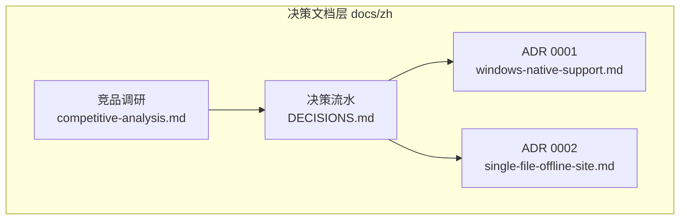
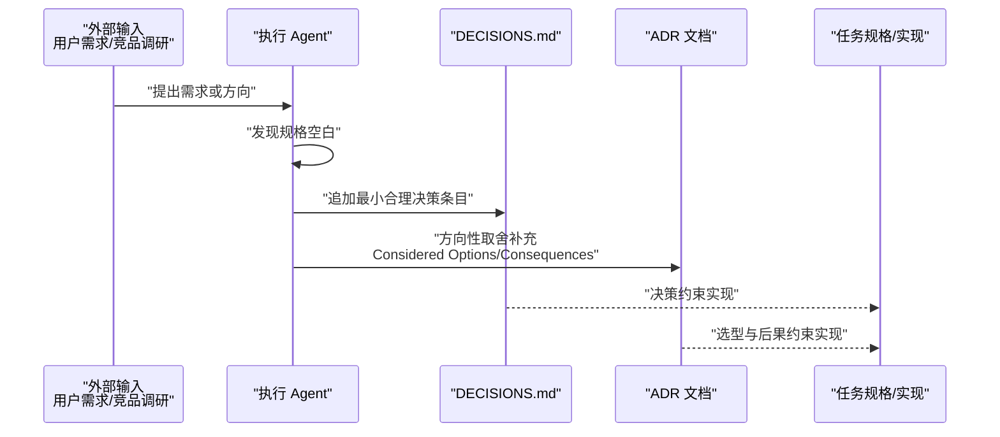
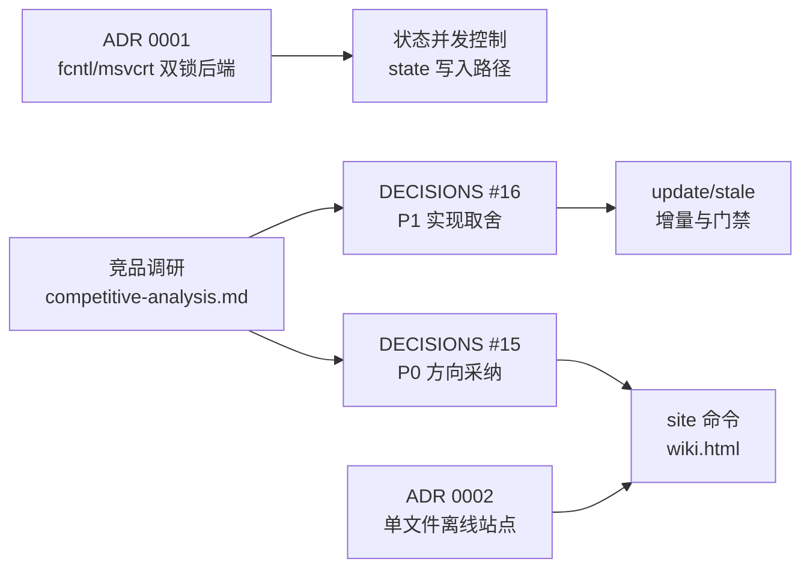

# 设计决策与 ADR

<cite>
**本文引用的文件**
- [DECISIONS.md](file://docs/zh/DECISIONS.md)
- [0001-windows-native-support.md](file://docs/zh/adr/0001-windows-native-support.md)
- [0002-single-file-offline-site.md](file://docs/zh/adr/0002-single-file-offline-site.md)
- [competitive-analysis.md](file://docs/zh/research/competitive-analysis.md)
</cite>

## 目录
1. [简介](#简介)
2. [项目结构](#项目结构)
3. [核心组件](#核心组件)
4. [架构总览](#架构总览)
5. [详细组件分析](#详细组件分析)
6. [依赖关系分析](#依赖关系分析)
7. [性能与一致性考量](#性能与一致性考量)
8. [故障排查指南](#故障排查指南)
9. [结论](#结论)

## 简介

本页汇总 repowiki 的关键架构决策记录体系：`docs/zh/DECISIONS.md` 以编号流水记录实现过程中「规格空白处的最小合理决策」；两篇 ADR 分别记录 Windows 原生支持的锁后端选型与单文件离线站点的产物形态取舍；`docs/zh/research/competitive-analysis.md` 则以竞品调研驱动了 P0/P1 改进方向的采纳。三者共同构成「决策从何而来、为何如此取舍、与同类工具差在哪」的完整证据链，是理解仓库设计意图的第一手材料。

章节来源
- [docs/zh/DECISIONS.md:1-5](file://docs/zh/DECISIONS.md#L1-L5)
- [docs/zh/DECISIONS.md:5-13](file://docs/zh/DECISIONS.md#L5-L13)

## 项目结构

决策相关文档集中在仓库的 `docs/` 目录下，中文与英文版本镜像维护：

- `docs/zh/DECISIONS.md`：实现决策流水，17 条编号决策，每条附决策内容与暴露来源（竞态单测、冒烟测试或实战压测）。
- `docs/zh/adr/0001-windows-native-support.md`：Windows 原生支持 ADR，记录 stdlib 双文件锁后端选型。
- `docs/zh/adr/0002-single-file-offline-site.md`：单文件离线站点 ADR，记录 `site` 命令产物形态决策。
- `docs/zh/research/competitive-analysis.md`：竞品调研全文，含 6 个同类产品对比与 P0/P1/P2 分层改进建议。
- `docs/en/` 下存在对应的英文镜像（各文件头部的语言切换链接指向 `../en/` 同名文件）。

图表来源
- [docs/zh/DECISIONS.md:1-5](file://docs/zh/DECISIONS.md#L1-L5)
- [docs/zh/adr/0001-windows-native-support.md:1-3](file://docs/zh/adr/0001-windows-native-support.md#L1-L3)
- [docs/zh/adr/0002-single-file-offline-site.md:1-3](file://docs/zh/adr/0002-single-file-offline-site.md#L1-L3)
- [docs/zh/research/competitive-analysis.md:1-7](file://docs/zh/research/competitive-analysis.md#L1-L7)

章节来源
- [docs/zh/DECISIONS.md:1-5](file://docs/zh/DECISIONS.md#L1-L5)
- [docs/zh/research/competitive-analysis.md:1-7](file://docs/zh/research/competitive-analysis.md#L1-L7)

## 核心组件

- 决策流水 `DECISIONS.md`：以编号条目记录规格空白处的最小合理决策，遵循「遇规格空白不得臆造，记录于此」的执行规则，共 17 条。
- ADR 0001（Windows 原生支持）：记录「按平台选择 stdlib 锁后端」的决策——POSIX 保持 `fcntl`，Windows 用 `msvcrt.locking`，约 20 行、零新增依赖。
- ADR 0002（单文件离线站点）：记录 `repowiki site` 生成自包含 HTML（`<locale>/wiki.html`）的决策，页面、源码行区间与 markdown/mermaid 渲染库全部内嵌。
- 竞品调研 `competitive-analysis.md`：对比 DeepWiki、DeepWiki-Open、CodeWiki、GitDiagram、Swimm、Repomix 六个同类产品，结论是「差距不在生成质量，在分发摩擦与生态接口」，并给出 P0/P1/P2 三档改进建议。

章节来源
- [docs/zh/DECISIONS.md:1-5](file://docs/zh/DECISIONS.md#L1-L5)
- [docs/zh/adr/0001-windows-native-support.md:5-7](file://docs/zh/adr/0001-windows-native-support.md#L5-L7)
- [docs/zh/adr/0002-single-file-offline-site.md:5-8](file://docs/zh/adr/0002-single-file-offline-site.md#L5-L8)
- [docs/zh/research/competitive-analysis.md:8-16](file://docs/zh/research/competitive-analysis.md#L8-L16)

## 架构总览

决策的产生与落盘遵循一条固定链路：开发过程中执行 agent 发现任务规格存在空白时，不臆造方案而是把最小合理决策追加进 `DECISIONS.md`；当变更属于方向性取舍（涉及平台支持、产物形态等），则以 ADR 形式补充「备选方案对比（Considered Options）」与「后果（Consequences）」两节；外部输入（用户需求、竞品调研）触发的新方向，先在调研文档中论证，再以决策条目落盘并拆解为可执行任务。

图表来源
- [docs/zh/DECISIONS.md:5](file://docs/zh/DECISIONS.md#L5)
- [docs/zh/adr/0001-windows-native-support.md:9-20](file://docs/zh/adr/0001-windows-native-support.md#L9-L20)
- [docs/zh/adr/0002-single-file-offline-site.md:12-24](file://docs/zh/adr/0002-single-file-offline-site.md#L12-L24)

章节来源
- [docs/zh/DECISIONS.md:5-13](file://docs/zh/DECISIONS.md#L5-L13)
- [docs/zh/research/competitive-analysis.md:79-91](file://docs/zh/research/competitive-analysis.md#L79-L91)

## 详细组件分析

### 决策流水（DECISIONS.md）

- 职责：记录实现过程中规格空白处的最小合理决策，防止 agent 臆造行为，是仓库行为的「为什么」档案。
- 关键行为：17 条编号决策覆盖四条主线——并发认领生命周期（busy 信号、认领过期判定、attempt 计数、过期认领自动回收、不做 pid 存活检测）、校验器语义（锚点算法、占位符扫描、模板标题预渲染）、命令行为（catalog 幂等、overview 两步 finalize、state 清理策略）与分发策略（竞品调研采纳、Roadmap 冻结、PyPI 分发名）。
- 实现要点：多数条目标注了暴露来源（如 T5 竞态单测、T9 冒烟、6×12 压测、40 页并发生成实战），体现「决策由真实缺陷驱动」的记录纪律；编号 17 的最后一条冻结了产出语言（zh/en）并把发布流水线定为 Trusted Publisher。

章节来源
- [docs/zh/DECISIONS.md:7-13](file://docs/zh/DECISIONS.md#L7-L13)
- [docs/zh/DECISIONS.md:16-17](file://docs/zh/DECISIONS.md#L16-L17)
- [docs/zh/DECISIONS.md:38-49](file://docs/zh/DECISIONS.md#L38-L49)
- [docs/zh/DECISIONS.md:81-86](file://docs/zh/DECISIONS.md#L81-L86)

### ADR 0001：Windows 原生支持（stdlib 双文件锁后端）

- 职责：记录从「Windows 明确 Non-Goal（请用 WSL）」转为「原生支持」时的锁后端选型决策。
- 关键行为：并发状态控制按平台选择 stdlib 锁——POSIX 保持 `fcntl.flock`，Windows 用 `msvcrt.locking`，改动约 20 行、零新增依赖，语义同为「单机阻塞独占锁」，与工具的单机部署模型一致。
- 实现要点：三个备选方案被否——`portalocker` 第三方库打破「唯一依赖 pyyaml」的极简定位；用原子 mkdir 重造锁需重写并发核心，风险与测试成本最高；维持 WSL-only 不满足需求。已知的唯一语义差异是 `msvcrt.locking(LK_LOCK)` 约 10 秒抢不到锁抛错（`fcntl` 无限阻塞），已映射为带重试提示的 `StateError`；Windows CI（`windows-latest`）纳入矩阵作为回归兜底。

章节来源
- [docs/zh/adr/0001-windows-native-support.md:5-13](file://docs/zh/adr/0001-windows-native-support.md#L5-L13)
- [docs/zh/adr/0001-windows-native-support.md:15-20](file://docs/zh/adr/0001-windows-native-support.md#L15-L20)

### ADR 0002：单文件离线站点（渲染库内嵌）

- 职责：记录「给生成的文档加一个 web 页面方便查看」需求的产物形态决策——`finalize` 之后用独立命令 `repowiki site` 生成一个自包含 HTML 文件。
- 关键行为：全部页面、被引用的源码行区间、markdown 渲染库（marked）与 mermaid 渲染库内嵌进单个 `wiki.html`，浏览器双击即看，零服务器、零网络、单文件可分享；该决定回撤了原 Non-Goal 中的「HTML 预览服务」，改述为「不做常驻预览服务器」。
- 实现要点：三个备选被否——本地 `serve` 常驻服务体验像网站但终端需常驻、产物不如单文件易分享；Python 端渲染 markdown 产物更小但新增运行时依赖且 mermaid 离线故事不完整；CDN 引用渲染库离线打不开、与离线安装定位冲突。站点是纯派生产物，幂等、可随时重跑，`clean` 删掉 state 后仍能从磁盘页面重建；页面间刻意零链接的设计不变，站点导航由目录规划树派生。

章节来源
- [docs/zh/adr/0002-single-file-offline-site.md:5-10](file://docs/zh/adr/0002-single-file-offline-site.md#L5-L10)
- [docs/zh/adr/0002-single-file-offline-site.md:12-16](file://docs/zh/adr/0002-single-file-offline-site.md#L12-L16)
- [docs/zh/adr/0002-single-file-offline-site.md:18-24](file://docs/zh/adr/0002-single-file-offline-site.md#L18-L24)

### 竞品调研与差异化定位

- 职责：以公开资料系统对比六款同类产品，回答「repowiki 在赛道中的位置与差距」，并输出分层改进建议。
- 关键行为：调研结论认定差距在分发摩擦与生态接口而非生成质量——竞品一行命令/一个 URL 出结果、全部接入 MCP 与 CI 生态，而 repowiki 需手动驱动 agent、安装靠 git URL；同时预警 CodeWiki 已支持 Claude Code/Codex CLI 免 API key 后端，与「智能外包」核心思路部分趋同、窗口期有限。
- 实现要点：坚持的差异化优势包括 agent 无关（竞品全部锁死自家模型）、产出可信（模板强制 + 程序化校验 + `file://` 引用内嵌真实源码行）、并发安全与断点续跑（竞品仅单进程）、零依赖单文件离线站点与双语产出。P0 四项（导出 `llms.txt`/`llms-full.txt`、PyPI 发布、只读 `stale` 子命令 + GitHub Action、在线样例）于 2026-09-07 采纳并落入 DECISIONS #15；P1 四项（页面原型 archetype、`--dirty` 语义、overview 纳入增量、自定义知识类别）于 2026-09-08 落地为 DECISIONS #16；P2（问答层、MCP server、大型 monorepo 实证、更多语言）待拍板。

章节来源
- [docs/zh/research/competitive-analysis.md:8-16](file://docs/zh/research/competitive-analysis.md#L8-L16)
- [docs/zh/research/competitive-analysis.md:72-77](file://docs/zh/research/competitive-analysis.md#L72-L77)
- [docs/zh/research/competitive-analysis.md:79-109](file://docs/zh/research/competitive-analysis.md#L79-L109)
- [docs/zh/DECISIONS.md:55-62](file://docs/zh/DECISIONS.md#L55-L62)
- [docs/zh/DECISIONS.md:63-80](file://docs/zh/DECISIONS.md#L63-L80)

## 依赖关系分析

- 竞品调研是决策的上游输入：`competitive-analysis.md`（2026-09-07）直接催生 DECISIONS #15（P0 采纳）与后续 DECISIONS #16（P1 实现取舍）。
- ADR 0001 是状态并发控制的选型基座：`fcntl`/`msvcrt` 双后端支撑全部 state 写入路径（claims 目录、index.json 事务互斥）。
- ADR 0002 是 `site` 命令与 vendor 渲染库的产物契约：单文件内嵌形态决定了 `src/repowiki/vendor/` 的 minified JS 随仓库提交并随 wheel 分发。
- P0 决策（DECISIONS #15）与 ADR 0002 在 `site` 命令上交汇：站点导出能力同时承担「人查看」与「`llms.txt` 供其他 agent 消费」两个生态位。

图表来源
- [docs/zh/research/competitive-analysis.md:79-93](file://docs/zh/research/competitive-analysis.md#L79-L93)
- [docs/zh/adr/0001-windows-native-support.md:5-7](file://docs/zh/adr/0001-windows-native-support.md#L5-L7)
- [docs/zh/adr/0002-single-file-offline-site.md:18-24](file://docs/zh/adr/0002-single-file-offline-site.md#L18-L24)

章节来源
- [docs/zh/DECISIONS.md:55-62](file://docs/zh/DECISIONS.md#L55-L62)
- [docs/zh/DECISIONS.md:63-80](file://docs/zh/DECISIONS.md#L63-L80)
- [docs/zh/adr/0002-single-file-offline-site.md:20-21](file://docs/zh/adr/0002-single-file-offline-site.md#L20-L21)

## 性能与一致性考量

- 锁语义一致性：两个锁后端唯一的语义差异是超时行为——`fcntl` 无限阻塞，`msvcrt.locking(LK_LOCK)` 约 10 秒抢不到锁抛错并映射为带重试提示的 `StateError`；除此之外语义保持「单机阻塞独占锁」一致。
- 认领一致性：认领过期判定以 claim 目录自身 mtime 为单一来源（废弃基于 `index.heartbeat_at` 的第二套判定，避免 sweep 与 busy 统计打架）；stale 窗口从 45 分钟收紧到 15 分钟，是「冻结上限」与「误抢风险」的平衡——worker 遵守 `touch` 心跳纪律则无误抢。
- 写入一致性：`index.json` 用 flock 串行化读改写（mtime 复查存在 TOCTOU 窗口，6×12 压测曾丢 3 次更新）。
- 站点产物体积与幂等：每个 `wiki.html` 约 4-5 MB（内嵌 mermaid 约 3.5 MB），对单仓库文档可接受；站点是纯派生产物，幂等、可随时重跑。

章节来源
- [docs/zh/adr/0001-windows-native-support.md:15-20](file://docs/zh/adr/0001-windows-native-support.md#L15-L20)
- [docs/zh/DECISIONS.md:12-13](file://docs/zh/DECISIONS.md#L12-L13)
- [docs/zh/DECISIONS.md:38-45](file://docs/zh/DECISIONS.md#L38-L45)
- [docs/zh/DECISIONS.md:34-35](file://docs/zh/DECISIONS.md#L34-L35)
- [docs/zh/adr/0002-single-file-offline-site.md:20-23](file://docs/zh/adr/0002-single-file-offline-site.md#L20-L23)

## 故障排查指南

- Windows 下并发操作抛 `StateError`：原因是 `msvcrt.locking(LK_LOCK)` 约 10 秒抢不到锁即抛错（非 bug，是与 `fcntl` 的已知语义差异），按错误提示重试即可；若频繁出现，检查是否有其他 repowiki 进程长时间持有 state 锁。
- 任务认领被他人接手（出现 `.stale-*` 留痕）：原因是认领超过 15 分钟未 `touch` 续期，被 `next --claim` 的抢占路径自动回收；预防措施是执行期间每 2-3 分钟运行一次 `touch` 心跳。
- 校验器报「未替换占位符」但正文确有需要：占位符扫描只针对非代码文本——fenced 代码块与行内代码中的字面占位符是合法内容，散文中残留才会失败；把字面示例放进代码块即可。
- 页面目录锚点跳转失效：锚点算法遵循 GitHub 规则「删标点、空白转 -」，例如「附录：一键」的正确锚点是 `附录一键` 而非 `附录-一键`；按该规则修正目录项。

章节来源
- [docs/zh/adr/0001-windows-native-support.md:15-20](file://docs/zh/adr/0001-windows-native-support.md#L15-L20)
- [docs/zh/DECISIONS.md:38-45](file://docs/zh/DECISIONS.md#L38-L45)
- [docs/zh/DECISIONS.md:50-54](file://docs/zh/DECISIONS.md#L50-L54)
- [docs/zh/DECISIONS.md:16-17](file://docs/zh/DECISIONS.md#L16-L17)

## 结论

repowiki 的设计决策采用三层记录体系：`DECISIONS.md` 承载日常实现中规格空白处的最小合理决策（强调来源可溯），ADR 承载方向性取舍的备选方案与后果（Windows 锁后端、单文件站点），竞品调研承载对外部生态位与差距的论证并直接驱动 P0/P1 路线采纳。正确使用方式是：遇到「为什么这样实现」先查 DECISIONS.md 对应编号条目；评估平台兼容问题参考 ADR 0001 的语义差异清单；涉及产物形态或分发方式时先对照 ADR 0002 与竞品调研的 P0/P1/P2 分层，避免越过「不做常驻服务、不做 MCP 封装」等已明确的非目标红线。

章节来源
- [docs/zh/DECISIONS.md:1-5](file://docs/zh/DECISIONS.md#L1-L5)
- [docs/zh/adr/0002-single-file-offline-site.md:9-10](file://docs/zh/adr/0002-single-file-offline-site.md#L9-L10)
- [docs/zh/research/competitive-analysis.md:103-109](file://docs/zh/research/competitive-analysis.md#L103-L109)
