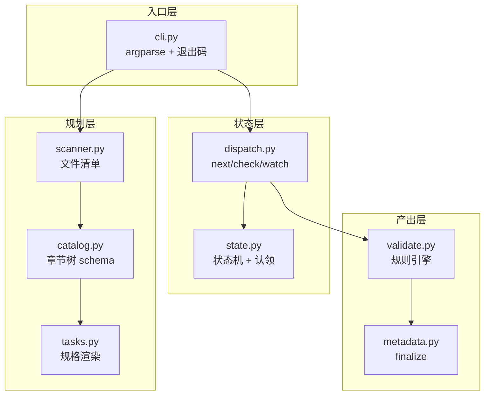
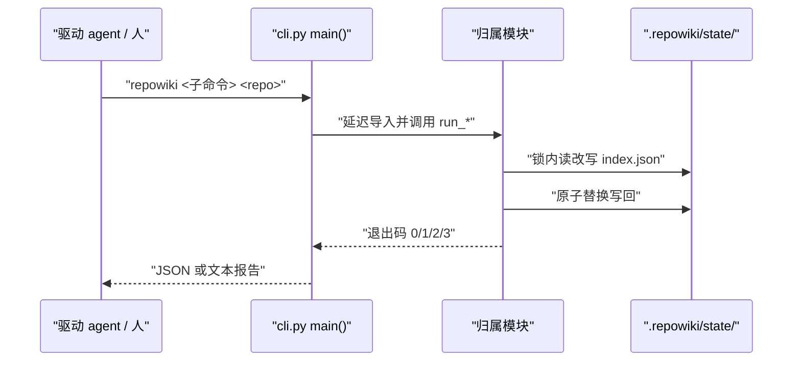
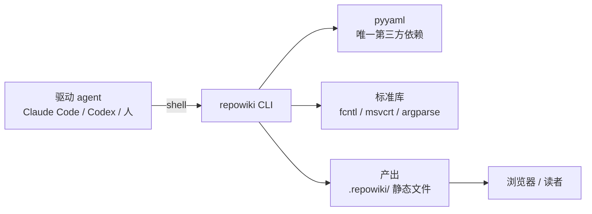

# 设计理念与整体架构

<cite>
**本文引用的文件**
- [README.md](file://README.md)
- [CONTEXT.md](file://CONTEXT.md)
- [DECISIONS.md](file://DECISIONS.md)
- [src/repowiki/cli.py](file://src/repowiki/cli.py)
- [src/repowiki/state.py](file://src/repowiki/state.py)
</cite>

## 目录
1. [简介](#简介)
2. [项目结构](#项目结构)
3. [核心组件](#核心组件)
4. [架构总览](#架构总览)
5. [详细组件分析](#详细组件分析)
6. [依赖关系分析](#依赖关系分析)
7. [性能与一致性考量](#性能与一致性考量)
8. [故障排查指南](#故障排查指南)
9. [结论](#结论)

## 简介
本页解释 repowiki 最核心的一条设计决策——为什么一个「文档生成工具」里没有任何 LLM——以及由此推导出的模块分层。repowiki 把整条流水线切成两半：所有可以形式化判断的工作（扫描、排队、认领、校验、修复、组装）留在 CLI 里做成确定性代码；所有需要理解代码语义的工作（读源码、写页面）推给驱动它的执行者。这条边界让系统同时获得了可靠性（同样输入必得同样判断）与开放性（执行者可以是任何能跑 shell 的 agent 或人）。

章节来源
- [README.md:3-7](file://README.md#L3-L7)
- [CONTEXT.md:3](file://CONTEXT.md#L3-L3)

## 项目结构
围绕这条职责边界，源码分成四层，模块间只通过明确的函数接口与磁盘状态衔接：

- 入口层：`src/repowiki/cli.py` 定义子命令、参数与退出码，把实现延迟导入到各归属模块。
- 规划层：`src/repowiki/scanner.py`、`src/repowiki/plan.py`、`src/repowiki/catalog.py`、`src/repowiki/tasks.py` 负责从仓库文件清单产出任务与规格。
- 状态层：`src/repowiki/state.py`、`src/repowiki/paths.py`、`src/repowiki/dispatch.py` 负责任务生命周期与命令编排。
- 产出层：`src/repowiki/validate.py`、`src/repowiki/metadata.py`、`src/repowiki/site.py`、`src/repowiki/updater.py` 负责校验修复与最终产物。

图表来源
- [src/repowiki/cli.py:151-225](file://src/repowiki/cli.py#L151-L225)
- [DECISIONS.md:5-6](file://DECISIONS.md#L5-L6)

章节来源
- [README.md:82-94](file://README.md#L82-L94)

## 核心组件
- 确定性编排器：CLI 自身，零 LLM、零网络、零 agent CLI 依赖，只做可以形式化判断的事。
- 自包含任务规格：`state/tasks/<id>.md` 内嵌页面模板与文风规范，任何 worker 不读仓库其他文档也能开工。
- 目录树 catalog：由 agent 规划、由 `catalog.py` 校验的章节树，是全部页面任务的唯一依据。
- 状态机与认领：`state.py` 用一个原子 `mkdir` 原语支撑多 worker 并发与队列自愈。
- 规则引擎校验：`validate.py` 区分「可计算的缺陷」（自动修复）与「语义缺陷」（判失败）。

章节来源
- [src/repowiki/state.py:1-6](file://src/repowiki/state.py#L1-L6)
- [src/repowiki/validate.py:1-6](file://src/repowiki/validate.py#L1-L6)

## 架构总览
从运行时视角看，agent 与 CLI 围绕磁盘上的状态文件协作：CLI 把智能工作打包成规格发放，收回产出后做确定性裁决。整个系统没有常驻进程，每次交互都是一次短命 CLI 调用：

图表来源
- [src/repowiki/cli.py:114-136](file://src/repowiki/cli.py#L114-L136)
- [src/repowiki/state.py:117-133](file://src/repowiki/state.py#L117-L133)

章节来源
- [README.md:10-19](file://README.md#L10-L19)

## 详细组件分析
### 智能与确定性的职责分界
- 职责：agent 负责所有语义工作——规划章节、通读源码、按模板写作；CLI 负责一切可以机械验证的判断。
- 关键行为：CLI 从不「理解」页面内容，只检查结构合规性（必备小节、引用真实存在、行号不越界、图闭合）。
- 实现要点：这一分界写在任务规格里，规格随任务发放，因此新 worker 无需培训即可加入。

章节来源
- [README.md:3-8](file://README.md#L3-L8)
- [src/repowiki/validate.py:1-6](file://src/repowiki/validate.py#L1-L6)

### 模块拆分的演化
- 职责：DECISIONS.md 记录了实现期对规格空白的裁决，是理解模块边界的权威依据。
- 关键行为：`plan` 编排从 `tasks.py` 独立为 `plan.py`，`next/check/release/status` 编排独立为 `dispatch.py`，避免规格生成与命令层耦合。
- 实现要点：`next` 返回体增加 `busy` 字段、认领过期看目录 mtime 而非 ts 文件等决策，都来自并发单测暴露的真实竞态。

章节来源
- [DECISIONS.md:1-15](file://DECISIONS.md#L1-L15)
- [DECISIONS.md:36-47](file://DECISIONS.md#L36-L47)

### 生命周期守卫
- 职责：防止异常执行者破坏状态一致性。
- 关键行为：done 为终态且重复 check 只读；failed 超过尝试上限进入 exhausted 需显式 `release --force`；check 校验认领归属；finalize 校验页面真实存在。
- 实现要点：这些守卫全部来自评审与压测（例如 index.json 改用 flock 串行化，是因为 mtime 复查存在 TOCTOU 窗口）。

章节来源
- [DECISIONS.md:29-35](file://DECISIONS.md#L29-L35)

**章节来源**
- [CONTEXT.md:41-75](file://CONTEXT.md#L41-L75)

## 依赖关系分析
- 上游：repowiki 只依赖 Python 标准库与 pyyaml，不依赖任何 agent CLI、网络服务或数据库。
- 下游：产出（Wiki 页面、metadata.json、wiki.html）是纯静态文件，消费方是人与浏览器，不需要服务端。
- 对等协作：驱动 agent 通过 shell 调用 CLI，双方唯一的共享状态是仓库工作区里的 `.repowiki/` 目录。

图表来源
- [pyproject.toml:13](file://pyproject.toml#L13-L13)
- [src/repowiki/state.py:34-55](file://src/repowiki/state.py#L34-L55)

章节来源
- [README.md:3-8](file://README.md#L3-L8)

## 性能与一致性考量
- 确定性带来可测试性：140 个单测覆盖竞态与校验正反例，这是含 LLM 的流水线难以做到的。
- 上下文开销换自包含：每个任务规格约 4-6k tokens 内嵌模板，换来任务可任意分发、并行安全。
- 短命进程模型：没有常驻服务意味着没有内存态，一切状态落盘，任何一步崩溃都可从磁盘恢复。
- 一致性取舍：状态写入走「文件锁 + 临时文件 + 原子替换」，牺牲少量吞吐换取清单永不写坏。

章节来源
- [README.md:197](file://README.md#L197-L197)
- [src/repowiki/state.py:99-115](file://src/repowiki/state.py#L99-L115)
- [README.md:206-211](file://README.md#L206-L211)

## 故障排查指南
- 误解「它为什么不会写文档」：CLI 本来就不写页面；页面内容为空或质量差应检查驱动 agent 是否按规格通读了 hint_files。
- 页面结构总是校验失败：确认 agent 使用的是规格内嵌模板而非自创结构，必备小节名称必须逐字一致。
- 觉得某个行为「不合理」：先查 DECISIONS.md，多数边界行为都有压测或竞态背景，不要凭直觉改动状态机。
- 想换语言或模板：改 `templates/<locale>/` 与 `i18n.py` 字符串表，而不是改校验逻辑。

章节来源
- [DECISIONS.md:1-4](file://DECISIONS.md#L1-L4)
- [README.md:202-204](file://README.md#L202-L204)

## 结论
repowiki 的架构可以概括为一句话：用确定性代码管理所有状态，用自包含规格外包所有智能。四层模块（入口、规划、状态、产出）各自只依赖磁盘状态与下一层接口，使得并发 worker、崩溃恢复与断点续跑都成为状态机的自然结果而非补丁。阅读后续章节时，建议始终带着这条职责边界去理解每个模块的设计动机。

章节来源
- [README.md:3-8](file://README.md#L3-L8)
- [DECISIONS.md:44-47](file://DECISIONS.md#L44-L47)
