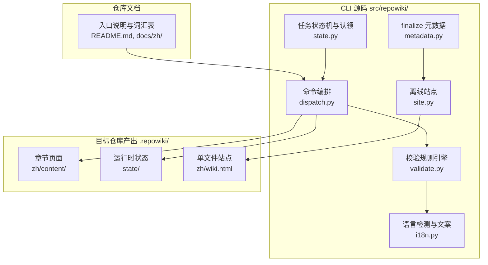
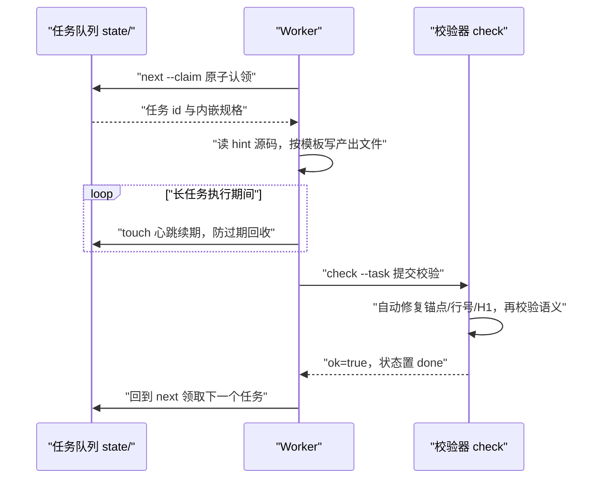
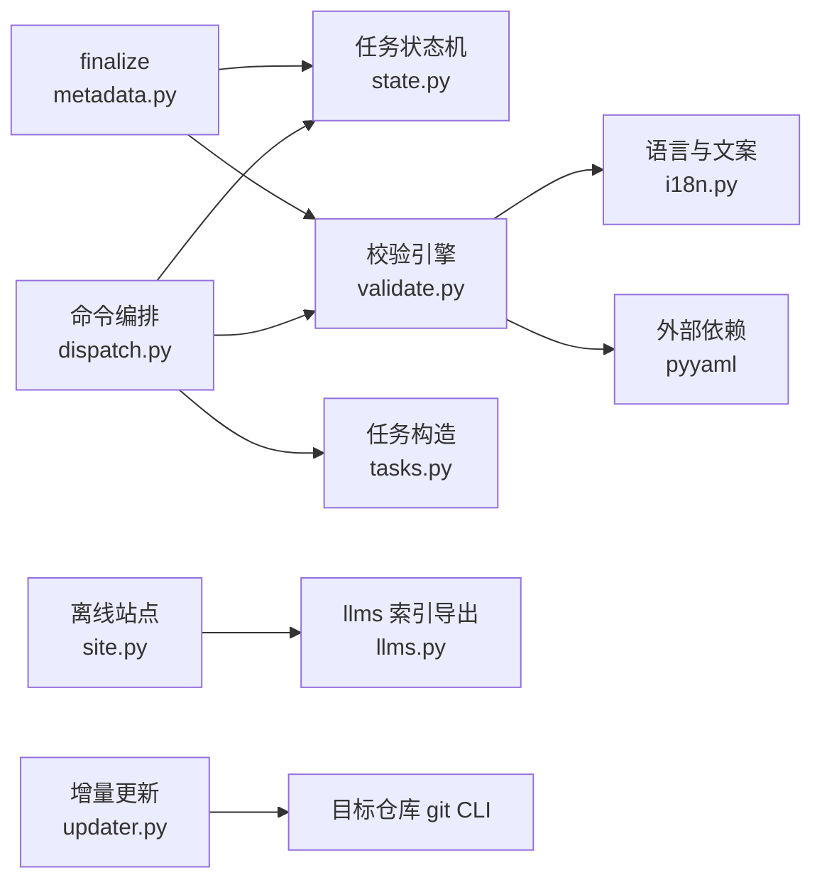

# 项目定位与核心概念

<cite>
**本文引用的文件**
- [README.md](file://README.md)
- [docs/zh/CONTEXT.md](file://docs/zh/CONTEXT.md)
- [docs/zh/USAGE.md](file://docs/zh/USAGE.md)
- [src/repowiki/state.py](file://src/repowiki/state.py)
- [src/repowiki/dispatch.py](file://src/repowiki/dispatch.py)
- [src/repowiki/validate.py](file://src/repowiki/validate.py)
- [src/repowiki/i18n.py](file://src/repowiki/i18n.py)
- [src/repowiki/metadata.py](file://src/repowiki/metadata.py)
- [src/repowiki/site.py](file://src/repowiki/site.py)
</cite>

## 目录
1. [简介](#简介)
2. [项目结构](#项目结构)
3. [核心组件](#核心组件)
4. [架构总览](#架构总览)
5. [详细组件分析](#详细组件分析)
6. [依赖关系分析](#依赖关系分析)
7. [性能与一致性考量](#性能与一致性考量)
8. [故障排查指南](#故障排查指南)
9. [结论](#结论)

## 简介

本页回答两个问题：repowiki 是什么、它靠哪些核心概念运转。repowiki 的定位是为任意代码仓库生成结构化 Wiki（mermaid 图 + `file://` 源码引用）的确定性构建系统：它负责任务规划、原子认领、产出校验、自动修复、元数据组装等一切需要可靠性的环节，而「读代码、写 wiki」的智能工作由驱动它的 agent（Claude Code / Codex / OpenCode 等 agent CLI，或人）完成（[README.md:13-15](file://README.md#L13-L15)）。整个系统零 API Key、零网络调用、零 agent CLI 依赖，任何「能跑 shell + 读写文件」的执行者都能参与，包括并发；Wiki 产出语言自动跟随目标仓库（[README.md:15-16](file://README.md#L15-L16)）。与「云端 AI wiki 服务」「让单个 agent 直接通读仓库」两条现成路线相比，repowiki 用任务切分、状态落盘、原子认领换来大仓库可扩展、中断可续跑、多 worker 天然并行（[README.md:27-30](file://README.md#L27-L30)）。理解本页梳理的 catalog、任务、认领、心跳、校验、finalize 等概念，是阅读后续机制章节的前提。

章节来源
- [README.md:13-15](file://README.md#L13-L15)
- [README.md:27-30](file://README.md#L27-L30)

## 项目结构

repowiki 自身的仓库按「文档 + CLI 源码 + 测试」组织。README.md 是定位与用法的入口；docs/zh/CONTEXT.md 收录领域词汇表，按产出物 / 编排 / 执行三组术语给出定义与 Avoid 对照（[docs/zh/CONTEXT.md:1-5](file://docs/zh/CONTEXT.md#L1-L5)）；docs/zh/USAGE.md 收录完整命令参考、Worker 循环契约、并发配方与可靠性机制细节（[docs/zh/USAGE.md:1-3](file://docs/zh/USAGE.md#L1-L3)）。CLI 源码位于 src/repowiki/，其中 state.py 承载任务状态机与原子认领，dispatch.py 编排 next / check / release / status 命令，validate.py 是校验规则引擎，i18n.py 负责语言检测与双语文案，metadata.py 与 site.py 分别对应 finalize 与离线站点。对一个目标仓库执行 repowiki 后，全部产出落在 `<repo>/.repowiki/` 下：`<locale>/content/` 章节树页面、`<locale>/meta/repowiki-metadata.json` 元数据、`<locale>/wiki.html` 单文件站点、`knowledge/<locale>/` 知识卡片，以及 `state/` 内部运行时状态（[docs/zh/USAGE.md:45-58](file://docs/zh/USAGE.md#L45-L58)）。

图表来源
- [docs/zh/USAGE.md:45-58](file://docs/zh/USAGE.md#L45-L58)
- [src/repowiki/dispatch.py:14-28](file://src/repowiki/dispatch.py#L14-L28)

章节来源
- [docs/zh/CONTEXT.md:1-5](file://docs/zh/CONTEXT.md#L1-L5)
- [docs/zh/USAGE.md:1-3](file://docs/zh/USAGE.md#L1-L3)
- [docs/zh/USAGE.md:45-58](file://docs/zh/USAGE.md#L45-L58)

## 核心组件

- 确定性构建系统：plan / claim / check / 自动修复全是确定性代码，零 API Key、零网络调用、不绑定任何 agent CLI；智能工作（读码、写作）留给驱动它的 agent（[README.md:13-15](file://README.md#L13-L15)、[README.md:46](file://README.md#L46)）。
- 目录规划（catalog）：整个流程的第一个任务，由 agent 阅读仓库后产出章节树与各页面纲要，是后续所有页面任务的依据；校验通过后自动展开为页面任务集（[docs/zh/CONTEXT.md:45-47](file://docs/zh/CONTEXT.md#L45-L47)、[src/repowiki/dispatch.py:404-408](file://src/repowiki/dispatch.py#L404-L408)）。
- 任务与任务规格：任务是最小工作单元，含唯一 id、类型、产出路径与规格，状态只有 pending / in_progress / done / failed / exhausted；任务规格内嵌完整模板、文风与 hint 文件清单，使任何 worker 无需额外上下文即可执行（[docs/zh/CONTEXT.md:49-55](file://docs/zh/CONTEXT.md#L49-L55)、[src/repowiki/state.py:76-90](file://src/repowiki/state.py#L76-L90)）。
- 认领、心跳与过期回收：认领是 worker 对任务的一次原子独占，同一任务同一时刻至多一个有效认领；心跳（touch）是执行期唯一存活信号；超过窗口未续期的过期认领自动回收重新入队（[docs/zh/CONTEXT.md:63-77](file://docs/zh/CONTEXT.md#L63-L77)、[src/repowiki/state.py:259-267](file://src/repowiki/state.py#L259-L267)）。
- 阶段门控：任务按 目录规划 → 页面 → 总览 顺序发放，前置阶段未完成时后续任务不发放；`current_phase` 取仍有未完成任务的最小阶段（[docs/zh/CONTEXT.md:57-59](file://docs/zh/CONTEXT.md#L57-L59)、[src/repowiki/state.py:213-217](file://src/repowiki/state.py#L213-L217)）。
- 确定性校验与自动修复：锚点、行号区间、H1、路径分隔符等可计算缺陷由程序静默修复，只有语义缺陷（缺章节、引用不存在文件、mermaid 不闭合）才判失败（[src/repowiki/validate.py:1-6](file://src/repowiki/validate.py#L1-L6)）。
- finalize 与元数据索引：全部任务 done 后组装机器可读索引 repowiki-metadata.json（章节树、源文件、代码片段及其与页面的关系），运行时状态留在 state/（[docs/zh/CONTEXT.md:31-33](file://docs/zh/CONTEXT.md#L31-L33)、[src/repowiki/metadata.py:1-6](file://src/repowiki/metadata.py#L1-L6)）。
- 单文件离线站点与 llms 索引：`site` 把完成的 wiki 渲染成一个自包含 HTML（导航、搜索、mermaid、源码弹层），并导出 llms.txt / llms-full.txt 供 agent 与 IDE 按索引直接读取（[docs/zh/CONTEXT.md:39-41](file://docs/zh/CONTEXT.md#L39-L41)、[src/repowiki/site.py:1-11](file://src/repowiki/site.py#L1-L11)）。
- 语言跟随：产出语言由 plan 确定性检测（README 与源码样本的 CJK 占比，零网络），持久化于 state/locale，后续所有命令遵循；当前支持 zh / en 两种（[src/repowiki/i18n.py:1-7](file://src/repowiki/i18n.py#L1-L7)、[src/repowiki/i18n.py:14-15](file://src/repowiki/i18n.py#L14-L15)）。

章节来源
- [README.md:11-16](file://README.md#L11-L16)
- [README.md:44-52](file://README.md#L44-L52)
- [docs/zh/CONTEXT.md:43-77](file://docs/zh/CONTEXT.md#L43-L77)
- [src/repowiki/state.py:76-90](file://src/repowiki/state.py#L76-L90)

## 架构总览

repowiki 的运行时核心是一个可多实例并发的 worker 循环：`plan` 生成任务清单后，任意多个 worker 各自执行「`next --claim` 原子认领 → 按内嵌规格撰写产出 → `touch` 心跳续期 → `check` 校验并流转状态」，直到队列清空；随后 `finalize` 组装元数据，`site` 生成离线站点（[docs/zh/USAGE.md:60-76](file://docs/zh/USAGE.md#L60-L76)）。循环中有两条硬约束：一次只持有一个认领（当前任务 check 通过或放弃前不领新任务）；认领的唯一存活信号是心跳，崩溃 worker 的过期认领由 `next` 自动回收重新入队，无需人工释放（[docs/zh/USAGE.md:75-76](file://docs/zh/USAGE.md#L75-L76)、[docs/zh/USAGE.md:156-159](file://docs/zh/USAGE.md#L156-L159)）。

图表来源
- [src/repowiki/dispatch.py:50-76](file://src/repowiki/dispatch.py#L50-L76)
- [docs/zh/USAGE.md:60-76](file://docs/zh/USAGE.md#L60-L76)

章节来源
- [docs/zh/USAGE.md:60-76](file://docs/zh/USAGE.md#L60-L76)
- [src/repowiki/dispatch.py:50-76](file://src/repowiki/dispatch.py#L50-L76)
- [src/repowiki/state.py:343-367](file://src/repowiki/state.py#L343-L367)

## 详细组件分析

### 目录规划与阶段门控

- 职责：catalog 任务由 agent 阅读仓库后产出章节树（含每页纲要与可选 archetype 原型），是后续页面任务的唯一依据；knowledge-plan 以同样机制驱动知识卡片任务集。
- 关键行为：check 校验 catalog JSON（章节结构与产出路径合法性）通过后，自动展开（expand）出全部页面任务并入队；任务发放按阶段门控，`ready_tasks` 只发放当前开放阶段的 pending / failed 任务，以及认领已过期的 in_progress 任务。
- 实现要点：ready 列表按 (attempts, phase, 任务序) 排序，重试次数少的任务优先；attempts 达到上限的 failed 任务被排除（exhausted），需显式 `release --force` 重置。

章节来源
- [src/repowiki/dispatch.py:394-410](file://src/repowiki/dispatch.py#L394-L410)
- [src/repowiki/state.py:219-243](file://src/repowiki/state.py#L219-L243)
- [docs/zh/CONTEXT.md:57-59](file://docs/zh/CONTEXT.md#L57-L59)

### 原子认领与队列自愈

- 职责：保证同一任务同一时刻至多一个有效认领，并在 worker 崩溃后自动恢复队列，无需人工干预。
- 关键行为：认领的基本原语是对 `claims/<task_id>/` 目录的一次 `os.mkdir`（原子操作，已存在即失败）；若目录已存在且判定过期，先把它改名为 `.stale-<id>-<rand>` 留痕再重试 mkdir，多个竞争者中只有一名能成功；认领信息（worker 与时间戳）写入目录内文件。
- 实现要点：过期判定基于认领目录自身的 mtime，而非目录内的 ts 文件——后者在 mkdir 之后才写入，若以其计时，刚创建的认领会被误判为无限旧而遭抢占；任务索引 index.json 的读改写通过跨进程排他文件锁（POSIX fcntl / Windows msvcrt）加临时文件原子替换串行化。

章节来源
- [src/repowiki/state.py:1-6](file://src/repowiki/state.py#L1-L6)
- [src/repowiki/state.py:247-292](file://src/repowiki/state.py#L247-L292)
- [src/repowiki/state.py:52-73](file://src/repowiki/state.py#L52-L73)

### 心跳与认领回收

- 职责：区分「活着的长任务」与「已死亡的僵尸认领」，这是队列自愈的判定基础。
- 关键行为：worker 执行期间定期运行 `touch --task`，刷新认领目录 mtime 与心跳时间戳；过期窗口默认 15 分钟（`REPOWIKI_STALE_SECONDS` 可调），超窗认领由 `next` 回收重新入队（attempts 加一，旧认领目录改名 `.stale-*` 留痕）。
- 实现要点：repowiki 是短命 CLI 进程，记录的 pid 对存活判定无意义，心跳窗口是唯一存活信号；`stats` 与 `watch` 都把过期认领排除出「执行中」计数，避免「假活」掩盖真停滞。

章节来源
- [src/repowiki/state.py:247-267](file://src/repowiki/state.py#L247-L267)
- [src/repowiki/state.py:343-367](file://src/repowiki/state.py#L343-L367)
- [src/repowiki/state.py:385-418](file://src/repowiki/state.py#L385-L418)
- [docs/zh/USAGE.md:153-160](file://docs/zh/USAGE.md#L153-L160)

### 确定性校验与自动修复

- 职责：把产出质量从「靠 agent 自觉」变成程序化契约，check 是整个 worker 循环的心脏。
- 关键行为：check 按任务类型选择校验器（页面 / 总览 / 知识卡片 / catalog 等），先做确定性自动修复（锚点、行号区间、H1、路径分隔符）并回写文件，再校验语义规则——必备小节、mermaid 图数量、引用文件真实存在、页间零链接等；通过则状态置 done，否则置 failed 并给出 errors 清单。
- 实现要点：校验阈值含最少小节数、最少 mermaid 图数与单页引用文件上限；done 为终态，复查只出只读报告、绝不再翻转状态；带 `--worker` 的 check 会拒绝翻转他人活认领的任务，确需代为校验须加 `--force`。

章节来源
- [src/repowiki/dispatch.py:1-6](file://src/repowiki/dispatch.py#L1-L6)
- [src/repowiki/validate.py:1-6](file://src/repowiki/validate.py#L1-L6)
- [src/repowiki/validate.py:19-21](file://src/repowiki/validate.py#L19-L21)
- [src/repowiki/dispatch.py:229-241](file://src/repowiki/dispatch.py#L229-L241)
- [src/repowiki/dispatch.py:318-370](file://src/repowiki/dispatch.py#L318-L370)

### finalize、站点与语言跟随

- finalize：要求全部任务 done（存在缺失页面或未完成任务时明确报错拒绝）；第一步先创建 overview 总览任务并以退出码 3 表示进展性等待，第二步解析每页的 file:// 引用组装 repowiki-metadata.json，成功后自动瘦身运行时产物（claims/ 与 tasks/），保留 index / catalog 供增量更新。
- 站点：`site` 读取元数据与全部页面，把每个 file:// 引用背后的源码行内嵌进单个自包含 HTML，同时导出 llms.txt / llms-full.txt；要求先 finalize，否则明确报错。
- 语言跟随：`detect_locale` 优先以 README 的 CJK 字符占比判定（主 README 优先于翻译副本，避免排序巧合让译文喧宾夺主），README 信号不足时抽样源码文件，注释含足量 CJK 即判 zh；全程确定性、零网络。

章节来源
- [src/repowiki/metadata.py:28-58](file://src/repowiki/metadata.py#L28-L58)
- [src/repowiki/state.py:369-380](file://src/repowiki/state.py#L369-L380)
- [src/repowiki/site.py:36-44](file://src/repowiki/site.py#L36-L44)
- [src/repowiki/i18n.py:135-161](file://src/repowiki/i18n.py#L135-L161)

## 依赖关系分析

- dispatch.py 是命令编排中枢，依赖 state.py（队列与认领）、validate.py（各类型校验器）、catalog.py 与 tasks.py（任务展开）、scanner.py（仓库清单）以及 knowledge.py（知识卡片类别）。
- validate.py 依赖 i18n.py（按 locale 取必备小节与界面文案）和 paths.py（中文锚点计算）。
- metadata.py 依赖 catalog.py（章节树展平）、state.py（任务读写与运行时瘦身）、gitutil.py（git 调用）与 validate.py（提取 file:// 引用）；site.py 消费 finalize 产出的 metadata.json，并依赖 llms.py 导出 agent 索引。
- 外部依赖：运行时仅 pyyaml；`update` / `stale` 另需目标仓库本地的 git CLI（git diff / git rev-parse）（[docs/zh/USAGE.md:29-32](file://docs/zh/USAGE.md#L29-L32)）。

图表来源
- [src/repowiki/dispatch.py:14-28](file://src/repowiki/dispatch.py#L14-L28)
- [src/repowiki/metadata.py:14-21](file://src/repowiki/metadata.py#L14-L21)
- [src/repowiki/site.py:23-31](file://src/repowiki/site.py#L23-L31)

章节来源
- [src/repowiki/dispatch.py:14-28](file://src/repowiki/dispatch.py#L14-L28)
- [src/repowiki/metadata.py:14-21](file://src/repowiki/metadata.py#L14-L21)
- [src/repowiki/site.py:23-31](file://src/repowiki/site.py#L23-L31)
- [docs/zh/USAGE.md:29-32](file://docs/zh/USAGE.md#L29-L32)

## 性能与一致性考量

- 并发一致性：认领原子性由 `os.mkdir` 保证，索引一致性由「排他文件锁 + 临时文件原子替换」的读改写事务保证；Windows 上对 os.replace 窗口期的 PermissionError 做亚毫秒级短暂重试（[src/repowiki/state.py:35-49](file://src/repowiki/state.py#L35-L49)、[src/repowiki/state.py:155-163](file://src/repowiki/state.py#L155-L163)）。
- 并行扩展：页面之间零链接、每页自包含引用，因此所有页面任务可完全并行，多 worker 认领互不干扰（[README.md:111-113](file://README.md#L111-L113)）。
- 心跳窗口与吞吐的折中：默认 15 分钟过期窗口兼顾「长任务防误抢」与「崩溃后快速自愈」，可用环境变量 `REPOWIKI_STALE_SECONDS` 按仓库粒度调节（[src/repowiki/state.py:21](file://src/repowiki/state.py#L21)、[src/repowiki/state.py:94-96](file://src/repowiki/state.py#L94-L96)、[docs/zh/USAGE.md:154-156](file://docs/zh/USAGE.md#L154-L156)）。
- 毒任务上限：attempts 默认上限 3（`REPOWIKI_MAX_ATTEMPTS`），防止坏任务无限循环占用队列；达到上限后 watch 能把停滞及时报告出来而非干等超时（[src/repowiki/state.py:24-28](file://src/repowiki/state.py#L24-L28)、[src/repowiki/dispatch.py:186-192](file://src/repowiki/dispatch.py#L186-L192)）。
- 自包含与并行安全的取舍：任务规格内嵌完整模板与文风规范（约 4-6k tokens）换取 worker 无需共享上下文；metadata.json 只含可读字段，运行时状态留在 state/（[README.md:144-145](file://README.md#L144-L145)）。
- 断点续跑：每任务状态落盘 index.json，随时中断随时继续；index.json 或 catalog.json 损坏时保留现场并明确报错，绝不静默清空任务清单（[docs/zh/USAGE.md:162-164](file://docs/zh/USAGE.md#L162-L164)、[src/repowiki/state.py:124-135](file://src/repowiki/state.py#L124-L135)）。

章节来源
- [src/repowiki/state.py:35-49](file://src/repowiki/state.py#L35-L49)
- [src/repowiki/state.py:94-96](file://src/repowiki/state.py#L94-L96)
- [src/repowiki/state.py:124-135](file://src/repowiki/state.py#L124-L135)
- [README.md:144-145](file://README.md#L144-L145)
- [docs/zh/USAGE.md:153-167](file://docs/zh/USAGE.md#L153-L167)

## 故障排查指南

- `next` 返回空任务且 busy>0：其他 worker 正在执行，等待约 30 秒后重试；busy=0 且队列空则全部完成、循环退出（[docs/zh/USAGE.md:64-73](file://docs/zh/USAGE.md#L64-L73)）。
- 命令报「任务正被其他 worker 执行中」且退出码为 2：状态冲突，目标认领仍然存活；正确做法是不争抢、不加 `--force`，改领其他任务或等待其过期回收（[docs/zh/USAGE.md:126-127](file://docs/zh/USAGE.md#L126-L127)、[src/repowiki/state.py:294-299](file://src/repowiki/state.py#L294-L299)）。
- 长任务中途被抢（认领被回收）：执行期未按时心跳所致；修复方式是在撰写循环中每隔几分钟运行一次 `touch --task`（无人值守脚本常用 sleep 300 的节奏），被回收的旧认领可在 state/claims/ 下以 `.stale-*` 留痕找到（[src/repowiki/state.py:343-351](file://src/repowiki/state.py#L343-L351)、[docs/zh/USAGE.md:98-99](file://docs/zh/USAGE.md#L98-L99)）。
- 报「state/index.json 损坏」：索引损坏时 CLI 保留现场并明确报错，可手工修复该文件恢复任务清单，或确认无需恢复后执行 `plan --replan --force` 重来（[src/repowiki/state.py:124-135](file://src/repowiki/state.py#L124-L135)）。
- 任务 exhausted 导致 watch 报停滞：同一任务多次校验失败达到 attempts 上限；`repowiki status` 查看详情，`release --task <id> --force` 显式重置后重试（[src/repowiki/state.py:310-323](file://src/repowiki/state.py#L310-L323)）。
- `finalize` 退出码 3：这是进展性等待而非错误——finalize 已创建 overview 总览任务，领取并完成该任务后再次运行 finalize 即可（[src/repowiki/metadata.py:34-40](file://src/repowiki/metadata.py#L34-L40)）。
- `site` 报未找到 repowiki-metadata.json：说明尚未 finalize 或元数据损坏；先完成全部任务并重新运行 finalize（[src/repowiki/site.py:36-44](file://src/repowiki/site.py#L36-L44)）。
- check 返回 ok=false：errors 只含语义缺陷（锚点 / 行号 / H1 等确定性缺陷已被自动修复）；按 errors 逐条修复同一产出文件后重新 check 即可，无需重写整页（[src/repowiki/validate.py:1-6](file://src/repowiki/validate.py#L1-L6)、[src/repowiki/dispatch.py:356-360](file://src/repowiki/dispatch.py#L356-L360)）。

章节来源
- [docs/zh/USAGE.md:60-76](file://docs/zh/USAGE.md#L60-L76)
- [docs/zh/USAGE.md:126-127](file://docs/zh/USAGE.md#L126-L127)
- [src/repowiki/state.py:124-135](file://src/repowiki/state.py#L124-L135)
- [src/repowiki/state.py:294-341](file://src/repowiki/state.py#L294-L341)

## 结论

repowiki 把「给仓库生成 wiki」拆成两类工作：不确定的智能（读码、写作）交给任意 agent，确定的一切（规划、认领、校验、修复、组装、站点）交给 CLI。核心概念环环相扣：catalog 定章节树，任务规格让 worker 自包含，认领 + 心跳 + 过期回收让多 worker 并发安全且队列自愈，确定性校验把质量变成程序化契约，finalize 与 site 把页面沉淀为元数据与单文件离线站点。正确用法是严格遵循 worker 循环契约：一次只持有一个认领、执行期定期 touch、check 通过前不领新任务、冲突时不争抢。注意事项：存活判定只认心跳不认 pid；产出语言在 plan 时锁定，中途更换需 `plan --replan`。一句话定位：agent 负责聪明，repowiki 负责靠谱（[README.md:42](file://README.md#L42)）。

章节来源
- [README.md:11-16](file://README.md#L11-L16)
- [README.md:42-52](file://README.md#L42-L52)
- [docs/zh/USAGE.md:60-76](file://docs/zh/USAGE.md#L60-L76)
