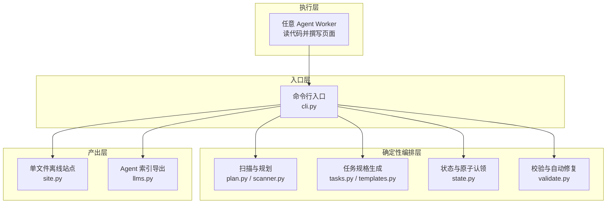
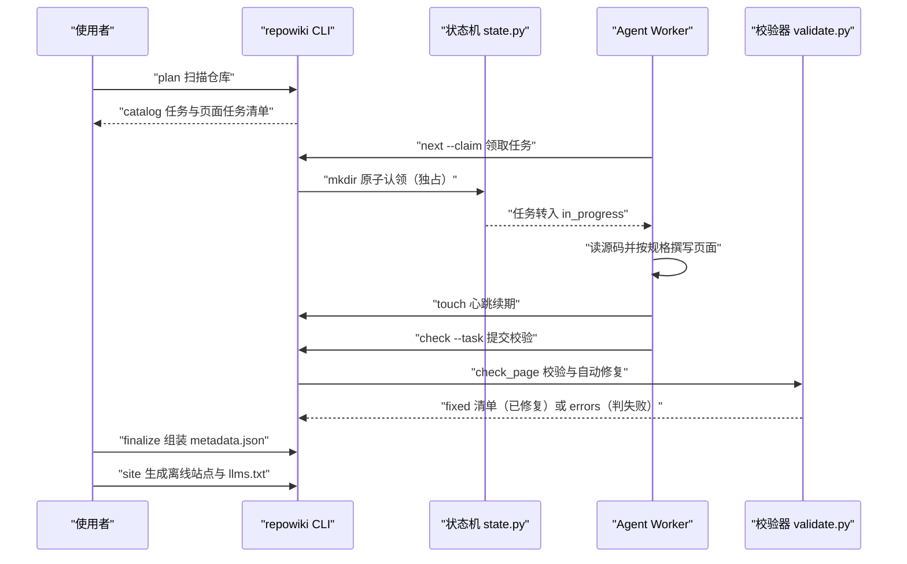
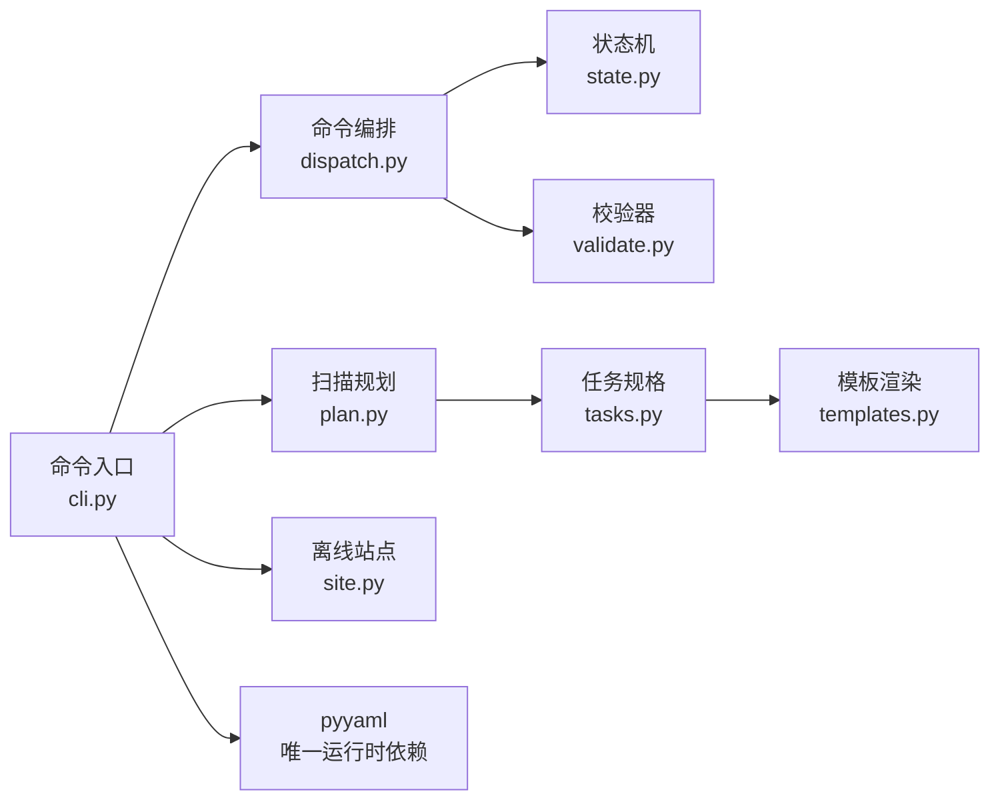

# 项目概述

<cite>
**本文引用的文件**
- [README.md](file://README.md)
- [CONTEXT.md](file://docs/zh/CONTEXT.md)
- [DECISIONS.md](file://docs/zh/DECISIONS.md)
- [cli.py](file://src/repowiki/cli.py)
- [state.py](file://src/repowiki/state.py)
- [tasks.py](file://src/repowiki/tasks.py)
- [validate.py](file://src/repowiki/validate.py)
</cite>

## 更新摘要

**变更内容**
- 校验器 `validate.py` 的缺陷二分策略更新：行号校验改为分层处理——仅终点越界自动钳制到文件末尾；起点越界、区间倒置、引用区间全为空行改判 error 打回重写；「详细组件分析」的校验层小节与「核心组件」中校验器条目的描述已同步改写，见 [src/repowiki/validate.py:162-201](file://src/repowiki/validate.py#L162-L201)。
- `check_page` 新增逐小节规则：每个 `##` 小节（目录与更新摘要除外）必须非空且携带「章节来源」来源标记；`check` 现以 `known_paths`（仓库文件清单）核对 mermaid 图节点标签中的文件名，不存在仅告警，见 [src/repowiki/dispatch.py:354-357](file://src/repowiki/dispatch.py#L354-L357)。
- 本页「简介」小节按新规则补齐了「章节来源」；各引用行号区间已按当前源码逐一核对。

## 目录
1. [更新摘要](#更新摘要)
2. [简介](#简介)
3. [项目结构](#项目结构)
4. [核心组件](#核心组件)
5. [架构总览](#架构总览)
6. [详细组件分析](#详细组件分析)
7. [依赖关系分析](#依赖关系分析)
8. [性能与一致性考量](#性能与一致性考量)
9. [故障排查指南](#故障排查指南)
10. [结论](#结论)

## 简介
repowiki 是一个为任意代码仓库生成结构化 Wiki 的确定性构建系统：任务规划、原子认领、产出校验、自动修复、元数据组装等编排工作全部由 CLI 的确定性代码完成，而「读代码、写 Wiki」的智能工作交给驱动它的任意 agent（Claude Code / Codex / OpenCode 等 agent CLI，或人）。它零 API Key、零网络调用、零 agent CLI 依赖，任何「能跑 shell + 读写文件」的执行者都能参与，包括并发；Wiki 产出语言自动跟随目标仓库（中文仓库输出 `zh/`，英文仓库输出 `en/`）。它的分工模型可以概括为一句话：agent 负责聪明，repowiki 负责靠谱。

本页是「项目概述」章节的导读页，按三条主线组织后续阅读：「定位与概念」介绍仓库 Wiki、任务、认领、心跳等核心词汇；「端到端流程」串联从 plan 到 site 的完整构建链路；「设计决策」记录实现中的关键取舍。快速开始、任务编排与状态管理、内容产出与模板、站点与分发、测试与工程化等专题由本章节的后续页面分别展开。

章节来源
- [README.md:13-16](file://README.md#L13-L16)
- [README.md:27-42](file://README.md#L27-L42)

## 项目结构
- `src/repowiki/`：CLI 的全部实现。`cli.py` 是命令入口与子命令注册；`plan.py` 与 `scanner.py` 负责扫描仓库并生成任务清单；`tasks.py` 与 `templates.py` 生成各类任务规格；`state.py` 维护任务状态机与原子认领；`dispatch.py` 编排 next / check / release / status 等命令；`validate.py` 执行产出校验与自动修复；`site.py` 生成单文件离线站点；`llms.py` 导出 agent 索引；`updater.py` 与 `coverage.py` 支撑增量更新与引用覆盖率；`knowledge.py` 生成知识卡片任务；`i18n.py` 提供双语消息。
- `tests/`：pytest 回归测试，CI 覆盖 macOS / Linux / Windows 三平台与 Python 3.10-3.13 矩阵。
- `docs/`：集中文档，`zh/` 与 `en/` 为镜像目录（同名文件一一对应），含使用详解、领域词汇表与决策记录。
- `.repowiki/`：运行时产出目录。`<locale>/content/` 存放 Wiki 页面，`<locale>/wiki.html` 是单文件离线站点，`state/` 保存任务清单与认领状态。

图表来源
- [src/repowiki/cli.py:35-148](file://src/repowiki/cli.py#L35-L148)
- [README.md:44-52](file://README.md#L44-L52)

章节来源
- [src/repowiki/cli.py:35-148](file://src/repowiki/cli.py#L35-L148)
- [README.md:13-16](file://README.md#L13-L16)
- [README.md:100-114](file://README.md#L100-L114)

## 核心组件
- 目录规划（catalog）：整个流程的第一个任务，由 agent 阅读仓库后产出章节树与各页面纲要，是后续所有页面任务的依据。
- 任务与任务规格：编排器发放的最小工作单元，状态只有 pending / in_progress / done / failed / exhausted；规格内嵌完整模板、文风规范与 hint 文件清单，使任何 worker 无需额外上下文即可执行。
- 认领与心跳：worker 对任务的原子独占占用，同一任务同一时刻至多一个有效认领；执行期间靠定期 touch 心跳维持持有，过期认领自动回收并重新入队。
- 页面原型（archetype）：catalog 节点可选 module（结构型，默认）或 flow（流程型）两种模板，按任务 id 反查 catalog 确定模板（单一事实来源），校验规则与原型无关。
- 校验器（check_page）：规则引擎对每个页面产出校验，锚点 / H1 / 路径分隔符与仅终点越界的行号等确定性问题静默自动修复；起点越界、区间倒置、引用区间全为空行、缺小节或缺「章节来源」等语义缺陷判失败。
- 站点与索引：`site` 命令把完成的 Wiki 打包为单文件离线 HTML，同时导出 `llms.txt` / `llms-full.txt` 供其他 agent 按索引直接读取。

章节来源
- [docs/zh/CONTEXT.md:45-55](file://docs/zh/CONTEXT.md#L45-L55)
- [docs/zh/CONTEXT.md:67-77](file://docs/zh/CONTEXT.md#L67-L77)
- [src/repowiki/tasks.py:83-118](file://src/repowiki/tasks.py#L83-L118)
- [docs/zh/DECISIONS.md:63-68](file://docs/zh/DECISIONS.md#L63-L68)
- [src/repowiki/validate.py:1-4](file://src/repowiki/validate.py#L1-L4)
- [README.md:49](file://README.md#L49)

## 架构总览
repowiki 的端到端流程是一条「规划 → 领取 → 撰写 → 校验 → 组装 → 分发」的流水线：`plan` 扫描仓库并产出 catalog 任务与页面任务清单；各 worker 通过 `next --claim` 原子领取任务、独立撰写页面，期间以 `touch` 心跳维持认领；完成后 `check` 校验产出并自动修复确定性问题；全部任务 done 后 `finalize` 组装机器可读的 `metadata.json`；最后 `site` 生成单文件离线站点与 agent 索引。阶段之间有顺序门控：目录规划 → 页面 → 总览，前置阶段未完成时后续任务不发放。

图表来源
- [src/repowiki/state.py:294-308](file://src/repowiki/state.py#L294-L308)
- [src/repowiki/validate.py:91-110](file://src/repowiki/validate.py#L91-L110)

章节来源
- [docs/zh/CONTEXT.md:57-59](file://docs/zh/CONTEXT.md#L57-L59)
- [docs/zh/DECISIONS.md:21-22](file://docs/zh/DECISIONS.md#L21-L22)
- [README.md:116-131](file://README.md#L116-L131)

## 详细组件分析
### 确定性编排层（state.py 与任务生命周期）
- 职责：维护 pending / in_progress / done / failed / exhausted 五态任务状态机，提供原子认领、心跳续期、释放与过期回收。
- 关键行为：`claim` 以「mkdir 认领目录」的文件系统原子性实现跨进程互斥，认领失败即视为他人持有；`touch` 心跳同时刷新目录内 ts 文件与目录自身 mtime；过期认领（默认 stale 窗口 15 分钟）在下次 `next --claim` 时被自动抢占回收，旧认领目录改名为 `.stale-*` 留痕并令 attempts 加一，毒任务有重试上限。
- 实现要点：过期判定以 claim 目录自身 mtime 为单一来源，而非目录内 ts 文件——ts 在 mkdir 之后才写入，按 ts 判定会让该窗口内的新鲜认领被误抢（并发单测捕获的真实竞态）；同时刻意不做 pid 存活检测：repowiki 是短命 CLI 进程，pid 在命令退出后即失效，自愿的 touch 心跳才是唯一存活信号。

章节来源
- [src/repowiki/state.py:294-308](file://src/repowiki/state.py#L294-L308)
- [src/repowiki/state.py:343-351](file://src/repowiki/state.py#L343-L351)
- [src/repowiki/state.py:65-73](file://src/repowiki/state.py#L65-L73)
- [docs/zh/DECISIONS.md:12-13](file://docs/zh/DECISIONS.md#L12-L13)
- [docs/zh/DECISIONS.md:38-49](file://docs/zh/DECISIONS.md#L38-L49)

### 校验与自动修复层（validate.py）
- 职责：对每个页面产出执行 `check_page` 规则校验，保证全部页面遵循同一套模板结构与引用格式。
- 关键行为：H1 必须唯一且等于任务标题（不匹配则自动改写）；`file://` 引用指向的文件必须真实存在（缺失报错），行号校验分层处理——仅终点越界自动钳制回文件实际行数，起点越界、区间倒置、引用区间全为空行则报错打回；路径分隔符统一归一为正斜杠；每个 `##` 小节（目录与更新摘要除外）必须非空且携带「章节来源」标记；目录锚点按实际章节标题确定性重建；mermaid 图节点标签中形如文件名的 token 经 `known_paths` 与仓库文件清单核对，不存在仅告警。
- 实现要点：修复策略二分——凡可计算的问题（锚点、H1、分隔符、终点越界的行号）静默修复并记入 `fixed` 清单；语义缺陷（起点越界 / 区间倒置 / 空行引用区间、缺必备小节、小节缺「章节来源」、缺 mermaid 图、占位符残留等）才进入 `errors` 判任务失败。这层设计让 agent 只需关注内容质量，格式问题交给程序兜底。

章节来源
- [src/repowiki/validate.py:1-9](file://src/repowiki/validate.py#L1-L9)
- [src/repowiki/validate.py:103-254](file://src/repowiki/validate.py#L103-L254)
- [src/repowiki/validate.py:162-201](file://src/repowiki/validate.py#L162-L201)
- [src/repowiki/validate.py:227-240](file://src/repowiki/validate.py#L227-L240)
- [src/repowiki/dispatch.py:354-357](file://src/repowiki/dispatch.py#L354-L357)

## 依赖关系分析
- 模块间依赖：`cli.py` 是唯一入口，按子命令分发到 `plan.py`（扫描规划）、`dispatch.py`（next / check / release 等命令编排）、`site.py`（站点）与 `updater.py`（增量更新）；`dispatch.py` 依赖 `state.py`（状态机）与 `validate.py`（校验）；`tasks.py` 依赖 `templates.py` 渲染任务规格。
- 外部依赖：运行时依赖仅 `pyyaml`，零网络调用、不绑定任何 agent CLI；离线安装只需 PyYAML wheel 与 Release 页附带的 `repowiki_cli-*.whl` 两个 wheel。
- 对目标仓库的依赖：`update` 依赖目标仓库本地 git CLI（`git diff` / `git rev-parse`）做增量映射；除此之外对目标仓库零侵入。

图表来源
- [src/repowiki/cli.py:35-148](file://src/repowiki/cli.py#L35-L148)

章节来源
- [README.md:63-69](file://README.md#L63-L69)
- [README.md:145](file://README.md#L145)

## 性能与一致性考量
- 并行加速：页面之间零链接、任务规格自包含，页面任务可完全并行；多 worker（多 agent / 多进程 / 人）通过原子认领同时推进同一仓库的构建。
- 一致性保证：同一任务同一时刻至多一个有效认领；`index.json` 用 flock 串行化读改写——mtime 复查存在 TOCTOU 窗口，6×12 并发压测曾丢失更新后才改为文件锁。
- 过期窗口取舍：默认 stale 窗口从 45 分钟压缩到 15 分钟，在「队列冻结上限」与「误抢风险」之间取平衡；worker 遵守心跳纪律则无误抢。
- 规格体积换自包含：任务规格内嵌完整模板与文风规范（约 4-6k tokens），换取任何 worker 无需额外上下文即可执行与并行安全；小上下文 agent 可将规格中的模板段落替换为对 `templates/` 目录的引用。
- 断点续跑与幂等：每任务状态落盘，随时中断随时继续；状态文件损坏时保留现场明确报错而非静默清空；`site` 幂等可重跑，finalize、update 或手动修改页面后随时重建。

章节来源
- [README.md:133-140](file://README.md#L133-L140)
- [README.md:142-146](file://README.md#L142-L146)
- [docs/zh/DECISIONS.md:31-49](file://docs/zh/DECISIONS.md#L31-L49)

## 故障排查指南
- `next --claim` 返回任务为空且 busy 大于 0：其他 worker 正在执行，等待后重试即可；规格若只说「无任务退出」会造成后续任务无人接手，worker 契约因此是「空且 busy 大于 0 → 等待重试」。
- `check` 报认领冲突（退出码 2）：该认领已过期被回收并被其他 worker 接手，正确做法是放弃本任务回到队列领取下一个，绝不加 `--force` 争抢。
- 队列长时间无进展：多为某 worker 崩溃后遗留认领；过期后 `next --claim` 会走既有抢占路径自动回收，`.stale-*` 目录留痕可查，无需人工释放。
- `finalize` 退出码 3：首次 finalize 会创建阶段 3 的 overview 任务并以退出码 3 表达进展性等待（非错误）；写完总览并 check 通过后再次运行即可。
- `check` 判失败：区分两类输出——`fixed` 清单是已被自动修复的确定性问题，无需处理；`errors` 列表才是需要按列表逐条修复同一文件后重新提交的语义缺陷。

章节来源
- [docs/zh/DECISIONS.md:9-11](file://docs/zh/DECISIONS.md#L9-L11)
- [docs/zh/DECISIONS.md:21-22](file://docs/zh/DECISIONS.md#L21-L22)
- [docs/zh/DECISIONS.md:38-45](file://docs/zh/DECISIONS.md#L38-L45)
- [README.md:129-131](file://README.md#L129-L131)
- [src/repowiki/validate.py:1-4](file://src/repowiki/validate.py#L1-L4)

## 结论
repowiki 的定位是「仓库 Wiki 的确定性构建系统」：它把生成流程拆成两半，任务规划、原子认领、校验修复、站点组装由 CLI 可靠兜底，读码与写作的智能由任意 agent 提供。正确使用方式是遵循 worker 循环（claim → touch 心跳 → 按规格撰写 → check 校验），把确定性问题留给校验器自动修复、自己专注语义质量；注意事项是保持心跳纪律、一次只持有一个认领、认领冲突时不加 `--force` 争抢，让队列的自愈机制自然运转。

章节来源
- [README.md:27-42](file://README.md#L27-L42)
- [docs/zh/CONTEXT.md:5](file://docs/zh/CONTEXT.md#L5)
