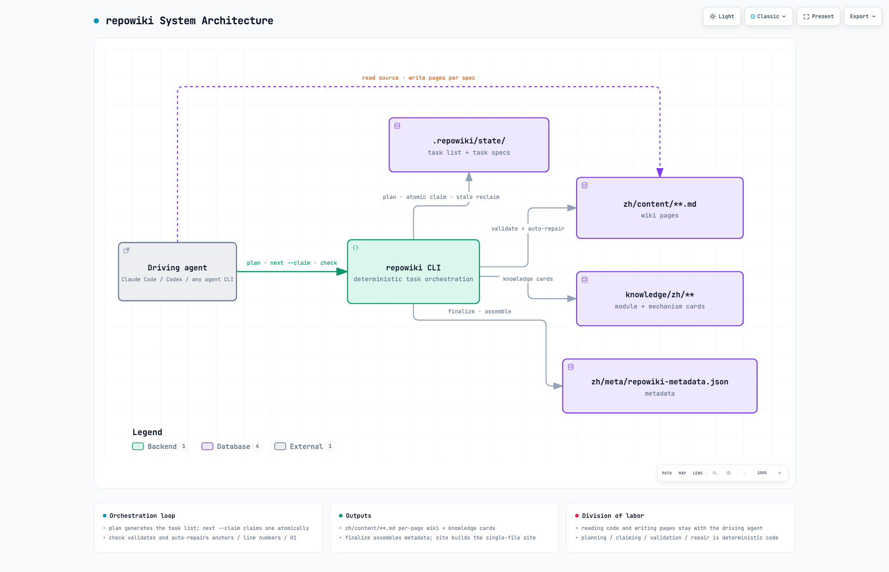

# repowiki

[中文](README.md) | **English**

[](https://github.com/luomsis/repowiki/actions/workflows/ci.yml)
[](LICENSE)
[](https://www.python.org/downloads/)
[](#reliability)

A build system that generates a structured wiki for any repository.

`repowiki` is a deterministic build system: it handles task planning, atomic claiming,
output validation, auto-repair, and metadata assembly. The intelligent work — reading
code, writing the wiki — is done by whatever agent drives it (Claude Code / Codex /
OpenCode or any agent CLI, or a human). Zero API keys, zero network calls, zero agent
CLI dependencies: any executor that "can run a shell and read/write files" can
participate — concurrently, too. The wiki's output language follows the target
repository automatically (Chinese repo → `zh/`, English repo → `en/`; `plan --locale`
overrides explicitly).



*Interactive version: [docs/repowiki-architecture-en.html](docs/repowiki-architecture-en.html) (light/dark themes · path highlighting · node search — download and open in a browser)*

## Why repowiki

There are two well-trodden paths to a repo wiki today: cloud AI wiki services (your
code leaves the machine, pay per use, output is a black box), or letting one agent
read the whole repo and write it in one go (large repos don't fit in context, an
interruption throws everything away, and parallelism is hard to coordinate).
repowiki takes a third path: **the intelligence — reading code, writing the wiki —
stays with any agent you choose; everything else (task planning, atomic claiming,
output validation, auto-repair, crash recovery) is a deterministic build system.**

| | Cloud AI wiki service | One agent reads the repo | repowiki |
|---|---|---|---|
| Source of intelligence | Built-in LLM (fixed) | Your agent (any) | Your agent (any) |
| Code leaves your machine | Yes | No | No |
| API keys / network | Required | Depends on agent | repowiki itself needs none |
| Large repos | Vendor quota limits | Doesn't fit in context | Split into page-level tasks |
| Interruption / crash | — | Start over | State on disk, resume anytime |
| Parallel speedup | — | Hard to coordinate | Multi-worker atomic claims, parallel by design |
| Output quality | Black box | Agent's own discipline | Enforced templates + programmatic validation + auto-repair |

In one sentence: **the agent supplies the intelligence; repowiki supplies the
reliability.**

## Features

- **Deterministic build**: plan / claim / check / auto-repair are all deterministic code — bound to no agent CLI, no API keys, no network calls;
- **Concurrency-safe**: atomic task claiming + heartbeat renewal + automatic stale-claim reclamation — multiple agents / processes / humans can work on the same repo at once;
- **Resumable**: per-task state is persisted to disk; interrupt anytime and pick up where you left off, with no orphaned claims after a crash;
- **Incremental updates**: `update` uses git diff to rewrite only affected pages (including ancestor chains);
- **Single-file offline site**: `site` produces a self-contained ~4-5 MB HTML file — navigation, search, mermaid diagrams, source-code popups — just double-click;
- **Bilingual output**: zh / en, auto-detected from the target repo; table-driven design makes new languages cheap;
- **Cross-platform**: native macOS / Linux / Windows support (no WSL needed); CI regression on a 3-platform × Python 3.10-3.13 matrix;
- **Strong validation**: anchors, line ranges, H1s, and path separators are repaired programmatically; only semantic defects fail the build.

## Table of Contents

- [Why repowiki](#why-repowiki) · [Features](#features)
- [Install](#install) · [Quick Start](#quick-start)
- [Usage](#usage) (worker loop contract / concurrency recipes) · [Command Reference](#command-reference)
- [Viewing the Wiki: single-file offline site](#viewing-the-wiki-single-file-offline-site)
- [Reliability](#reliability) · [Design Trade-offs](#design-trade-offs) · [Known Limitations](#known-limitations) · [Non-Goals](#non-goals)
- [Roadmap](#roadmap) · [Contributing](#contributing) · [Community](#community) · [Documentation](#documentation) · [License](#license)

## Install

### 1. CLI (required; Python ≥ 3.10, macOS / Linux / Windows)

```bash
pip install git+https://github.com/luomsis/repowiki.git   # or pipx install git+same-URL
# From a cloned checkout: cd repowiki && pip install -e .
```

Native Windows support (no WSL needed): the concurrent state control automatically uses
`msvcrt` file locking (POSIX uses `fcntl`); every feature works under PowerShell / cmd /
git-bash. For the PowerShell equivalent of background `watch`, see
[skills/repowiki/SKILL.md](skills/repowiki/SKILL.md). CI regression covers all three platforms.

### 2. Agent Skill (optional; lets an agent trigger the workflow automatically)

`skills/repowiki/` is a skill directory following the open SKILL.md convention; two ways
to install it:

- **Plugin install** (version-managed): point your client's plugin marketplace at this
  repo's git URL — the plugin manifest at the repo root is detected automatically;
- **Manual copy**: copy the whole `skills/repowiki/` directory into your client's
  personal skills directory (commonly `~/.claude/skills/repowiki/`,
  `~/.agents/skills/repowiki/`, etc.).

The skill is only a playbook (it tells the agent how to call the CLI); the actual work is
done by the `repowiki` command installed in step 1.

### 3. Offline install (target machine can't reach PyPI / GitHub)

repowiki's only runtime dependency is **`pyyaml>=6`**. Offline installation needs just
three things: the repo source, a pyyaml wheel, and Python ≥ 3.10 on the target machine.

**On a networked machine, gather the materials**:

```bash
pip download PyYAML==6.* -d wheels/        # download the pyyaml wheel (match the target platform/Python: macOS/Linux per-arch and Windows wheels are not interchangeable)
pip wheel --no-deps -w wheels/ .           # or grab repowiki-*.whl from the Releases page
```

Copy the repo directory (or `repowiki-*.whl`) together with `wheels/` to the target
machine, then:

```bash
pip install --no-index wheels/PyYAML-*.whl        # the only dependency first
pip install --no-index repowiki-*.whl             # then repowiki itself (or -e a source checkout)
repowiki --version                                # verify
```

With pipx: `pipx install --no-index repowiki-*.whl`. To run the test suite, additionally
install `pytest` offline (the `[test]` extra).

The agent skill works offline too — `skills/repowiki/` is a plain-text directory; copy it
wholesale into the client's skills directory (`~/.claude/skills/repowiki/` etc.). The
skill only invokes the locally installed `repowiki` command and needs no online service.
Note that while repowiki itself is zero-network, `update` relies on the target repo's
local git CLI (`git diff` / `git rev-parse`); no extra setup on machines where git is
preinstalled.

## Quick Start

```bash
repowiki plan ~/code/myrepo          # scan → generate task list (refuses repos with <10 code files)
repowiki next ~/code/myrepo --claim --json   # claim a task, follow its instructions
# ... write the outputs per the task spec, then:
repowiki check ~/code/myrepo --task c01      # validate + auto-repair + state transition
repowiki finalize ~/code/myrepo      # assemble metadata.json (two passes: creates an overview task first)
repowiki site ~/code/myrepo          # build the single-file offline viewing site (--open opens the browser)
```

Output layout (`<locale>` is auto-detected by plan or set via `--locale`; currently `zh` / `en`):

```
myrepo/.repowiki/
├── zh/                     # or en/ — language follows the target repo
│   ├── content/            # section tree: dir name = section name, index pages + subpages, fixed template
│   │   ├── 快速开始.md      # top-level standalone page
│   │   └── 项目概述/项目概述.md, 核心概念.md, ...
│   ├── meta/repowiki-metadata.json   # catalogs/items/source_files/snippets/relations
│   └── wiki.html           # single-file offline site (generated by repowiki site, double-click to open)
├── knowledge/zh/           # knowledge cards: _index.yaml + module docs + mechanism cards
└── state/                  # task list / specs / claims / locale (internal state, safe to delete and replan)
```

## Usage

### Worker Loop Contract

Any executor (subagent / process / human) participates via this loop; multiple loops can
run simultaneously:

```
loop:
  t = repowiki next <repo> --claim --json
  tasks empty and busy>0  → wait and retry (someone else is executing)
  tasks empty and busy=0  → exit
  execute t.tasks[0].instructions (write only the specified output files)
  periodically repowiki touch <repo> --task <id>   # heartbeat renewal, prevents stale reclamation
  repowiki check <repo> --task <id> --json
    ok=false → fix per errors and re-check; to give up, repowiki release <repo> --task <id> --force
```

Hold only one claim at a time: return to `next` only after the current task passes `check`
(or is released) — each `next` hands out exactly one task. A worker that exits mid-task
therefore never leaves an orphaned claim; even on abnormal exit, expired claims
automatically return to the queue (see Reliability).

### Concurrency Recipes

**Subagent-based (Claude Code / OpenCode, etc.)**: the main agent completes plan +
catalog serially first, then spawns N subagents each running the worker loop
(N=3~6 is plenty; page tasks are mutually independent). See
[skills/repowiki/SKILL.md](skills/repowiki/SKILL.md) for details.

**Unattended (any headless agent CLI — your choice which)**:

```bash
#!/bin/bash
# worker.sh — swap `claude` for `codex exec` / `opencode run`; the tool is agnostic and unrestrictive
while :; do
  TASK=$(repowiki next . --claim --json)
  N=$(echo "$TASK" | jq '.tasks | length')
  if [ "$N" -eq 0 ]; then
    [ "$(echo "$TASK" | jq '.busy')" -eq 0 ] && break   # empty and nobody executing → exit
    sleep 30 && continue                                # empty but busy>0 → wait and retry
  fi
  ID=$(echo "$TASK" | jq -r '.tasks[0].id')
  claude -p "$(echo "$TASK" | jq -r '.tasks[0].instructions')" --permission-mode acceptEdits &
  while kill -0 $! 2>/dev/null; do
    repowiki touch . --task "$ID"; sleep 300            # heartbeat during execution, prevents stale reclamation of long tasks
  done
  repowiki check . --task "$ID" --worker my-worker
done
```

## Command Reference

| Command | What it does |
|---|---|
| `plan <repo> [--replan [--force]] [--max-pages N] [--knowledge] [--locale auto\|zh\|en]` | Scan + generate task list; output language auto-detected (README carries the most weight) or set explicitly, persisted in `state/locale`; expands page tasks directly if a valid catalog.json exists; `--force` required to replan while tasks are executing |
| `next [--claim] [--json]` | Claim a ready task, one per call (stage-gated; lower-attempts tasks first); expired claims from dead workers are re-queued automatically — no manual release needed; `--json` includes full instructions |
| `touch --task ID` | Heartbeat during execution: refreshes the claim so long tasks aren't reclaimed as stale |
| `watch [--interval S] [--timeout S]` | Block until everything is done (exit 0) or stalled/timed out (exit 1); expired claims don't count as "executing", so a real stall is reported promptly |
| `check --task ID \| --all` | Validate outputs; anchors/line ranges/H1 auto-repaired; passing catalog/knowledge-plan automatically expands downstream tasks; done is terminal (read-only report); others' claims need `--force` |
| `release --task ID [--force]` | Release a claim (crash recovery) |
| `finalize` | Assemble metadata.json; requires all tasks done |
| `site [--open]` | Render the finished wiki into a single-file offline HTML (`<locale>/wiki.html`: nav + search + mermaid + source popups; knowledge module docs and cards appear under a "Knowledge Base" chapter); requires finalize first; `--open` opens it in the default browser |
| `update [--since <sha>]` | git diff → affected pages (incl. ancestor chains) → incremental rewrite tasks (with change summaries); also refreshes knowledge: cards whose `source_files` changed and modules whose scope was touched each get a refresh task; recognizes only **committed** changes (since..HEAD); uncommitted working-tree changes are invisible |
| `knowledge` | Append the knowledge-card task set (six mechanism-card types + module docs); finalize aggregates them into `_index.yaml` / `_module.yaml` |
| `status` | Progress / failure list / expired claims |
| `clean` | Delete the entire `state/` (wiki outputs are kept; loses update/resume/idempotent plan) |

Exit codes: `0` success, `1` validation failure or usage error, `2` state conflict
(task claimed by someone else), `3` progress-pending wait (finalize created the overview
task; run finalize again once it completes).

## Viewing the Wiki (single-file offline site)


`repowiki site <repo> [--open]` packs the whole wiki into **one self-contained HTML
file** (`<repo>/.repowiki/<locale>/wiki.html`, roughly 4-5 MB):

- markdown + mermaid fully rendered; referenced source line ranges are embedded
  directly — click a `file://` reference to inspect the highlighted, line-numbered
  snippet in an in-page popup. No IDE, no network; send a colleague one file and they
  can browse the whole wiki;
- collapsible sidebar section navigation + on-page table of contents (scroll-spy
  highlighting), full-text search (hit highlighting), one-click code copy, prev/next
  paging, reading progress bar, dark/light theme (follows system + manual toggle);
- fully offline: the markdown/mermaid rendering libraries (marked/mermaid, MIT) are
  embedded in the file itself;
- idempotent: re-run `repowiki site` anytime after finalize, update, or manual edits;
- works even after `repowiki clean` (section order degrades to directory order;
  content is unaffected).

Page template (enforced by the validator per language): H1 → `<cite>` citation block →
TOC → intro → project structure (mermaid graph TB) → core components → architecture
overview (sequenceDiagram) → detailed component analysis → dependency analysis
(graph LR) → performance & consistency considerations → troubleshooting guide →
conclusion; each section ends with "Section sources", each diagram with "Diagram
sources", in the format `[path:Lx-Ly](file://path#Lx-Ly)`; zero cross-page links
(which is exactly why all page tasks can run fully in parallel).

## Reliability

- **Concurrency safety**: atomic `mkdir` claiming + directory-mtime staleness
  detection (15 minutes by default, tunable via `REPOWIKI_STALE_SECONDS`).
- **Self-healing queue**: expired claims from crashed/killed workers are automatically
  reclaimed and re-queued by `next` (renamed `.stale-*` for the record, attempts+1,
  poison-task caps still apply) — no manual `release --force` needed; live claims are
  protected from takeover by `touch` heartbeats (repowiki is a short-lived CLI process,
  so recorded pids are meaningless; the heartbeat is the only liveness signal).
- **`watch` never fakes liveness**: expired claims don't count as "executing"; if all
  workers die, a stall is reported promptly instead of waiting out the timeout.
- **Determinism first**: anchors, line ranges, H1s, and path separators are repaired
  programmatically; only semantic defects (missing sections, references to nonexistent
  files, unterminated mermaid) fail validation.
- **Resumable**: every task's state is persisted (`state/index.json`); interrupt
  anytime, resume anytime; the output language is persisted in `state/locale`.
- **Corruption protection**: if `state/index.json` or `catalog.json` is corrupted, the
  scene is preserved with an explicit error (never a silent wipe of the task list);
  `plan --replan --force` is the explicit recovery path.
- **Auto slim-down**: after finalize succeeds, runtime artifacts (`state/claims/`,
  `state/tasks/`) are cleared automatically; `index.json`/`catalog.json`/
  `knowledge.json` are kept for incremental updates and idempotent reruns; run
  `repowiki clean <repo>` to delete all state if you don't need incremental updates
  (wiki outputs are unaffected).
- **Testing**: 140 unit tests covering races, orphaned-claim reclamation, validation
  rule positives/negatives, incremental mapping, knowledge aggregation, bilingual
  output (zh/en), single-file site generation, and friendly errors for corrupted state
  files and illegal input (`pytest`; the CI matrix covers ubuntu/macos/windows ×
  Python 3.10-3.13).

## Design Trade-offs

- `metadata.json` contains only human-readable fields
  (catalogs/items/source_files/snippets/relations); internal runtime state stays in
  `state/` and is never exported.
- ADR-style knowledge cards are not generated; mechanism cards and module docs are
  fully supported.
- Wiki output languages are Simplified Chinese (`zh/`) and English (`en/`); the design
  is table-driven — a new language is one string table plus one template set.
- CLI interaction messages are currently Chinese (aimed at the driving agent); this
  does not affect the wiki's output language.

## Known Limitations

- The `overview` page doesn't participate in incremental updates: after a structural
  refactor, prefer a full `plan --replan` regeneration.
- Each task spec embeds the full template and style guide (about 4-6k tokens) — the
  price of self-contained, parallel-safe tasks; small-context agents can replace the
  template section in the spec with a reference to the `templates/` directory.
- The output language is decided at plan time and persisted; switching mid-run
  requires `plan --replan`. `file://` reference resolution and programmatic claiming
  depend on `jq` in the common recipes — convenient but not required.

## Non-Goals

LLM API backends · built-in agent CLI detection/execution · MCP wrappers · resident
preview servers (the `site` artifact is a purely static single file — double-click to
view, no service needed) · output languages beyond zh/en.

## Roadmap

- [ ] Include the `overview` page in incremental updates (currently a structural refactor needs a full `plan --replan`)
- [ ] Publish to PyPI for direct `pip install repowiki` (currently installs from the git URL)
- [ ] More output languages: table-driven design — one language = one string table + one template set (PRs welcome)
- [ ] Bilingual CLI interaction messages (currently Chinese, aimed at the driving agent)

## Contributing

Issues and PRs are welcome! Local development:

```bash
git clone https://github.com/luomsis/repowiki.git && cd repowiki
pip install -e '.[test]'
pytest
```

- For behavior changes, open an issue or start a Discussions thread to align on
  direction before writing code;
- Adding a new output language = one string table + one template set (see Design
  Trade-offs) — a great first contribution.

## Community

- Questions, ideas, or want to show off a wiki you generated →
  [GitHub Discussions](https://github.com/luomsis/repowiki/discussions)
- Bugs and feature requests → [Issues](https://github.com/luomsis/repowiki/issues)

## Documentation

All docs are centralized under `docs/` (mirrored `zh/` and `en/` directories, same
file names in both):

- [Changelog](CHANGELOG.en.md) ([中文](CHANGELOG.md), at the repo root)
- [Domain glossary](docs/en/CONTEXT.md) (three term groups — artifacts /
  orchestration / execution — with Avoid lists)
- [Decision log](docs/en/DECISIONS.md) (14 minimal-reasonable decisions where the
  spec was silent)
- Architecture decision records (ADRs): [dual stdlib lock backends for native
  Windows](docs/en/adr/0001-windows-native-support.md) ·
  [single-file offline site](docs/en/adr/0002-single-file-offline-site.md)
- Agent Skill playbook: [English](skills/repowiki/SKILL.en.md) ·
  [中文](skills/repowiki/SKILL.md)

## License

[MIT](LICENSE) © luomsis
