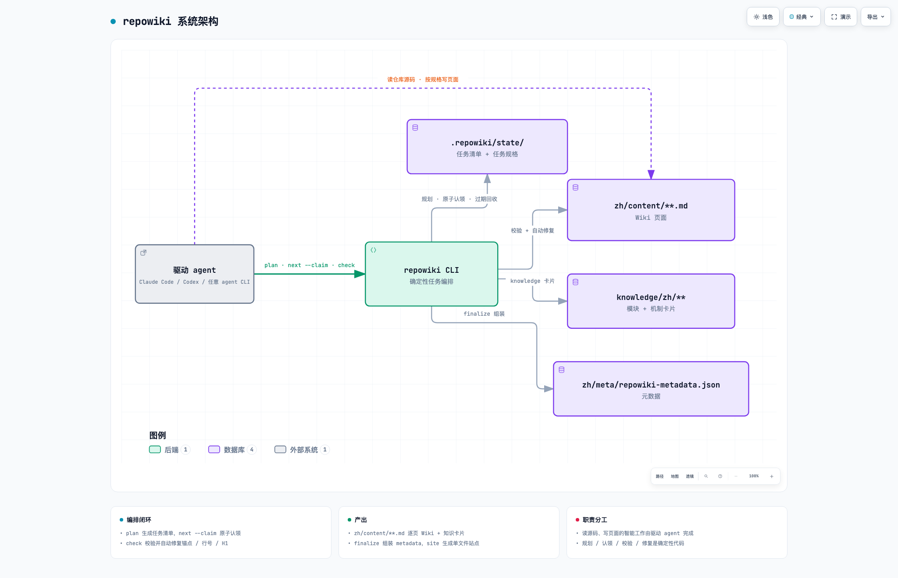

# repowiki

**中文** | [English](README.en.md)

[](https://github.com/luomsis/repowiki/actions/workflows/ci.yml)
[](LICENSE)
[](https://www.python.org/downloads/)
[](#可靠性设计)

为任意仓库生成结构化 Wiki 的构建系统。

`repowiki` 是一个确定性的构建系统：负责任务规划、原子认领、产出校验、自动修复、元数据组装；
智能工作（读代码、写 wiki）由驱动它的 agent（Claude Code / Codex / OpenCode 等 agent CLI，或人）完成。
零 API Key、零网络调用、零 agent CLI 依赖——任何「能跑 shell + 读写文件」的执行者都能参与，包括并发。
Wiki 产出语言自动跟随目标仓库（中文仓库 → `zh/`，英文仓库 → `en/`；`plan --locale` 可显式指定）。



*交互版架构图：[docs/repowiki-architecture.html](docs/repowiki-architecture.html)（明暗主题 · 路径高亮 · 节点搜索，下载后在浏览器打开）*

## 为什么是 repowiki

给仓库生成 wiki 的现成方案主要有两条路：云端 AI wiki 服务（代码要上传、按量付费、产出是黑盒），
或者让一个 agent 直接通读仓库现写（大仓库上下文装不下、中断即前功尽弃、难以并行）。
repowiki 走第三条路：**读代码、写 wiki 的智能留给任意 agent，其余一切——任务规划、原子认领、
产出校验、自动修复、断点续跑——做成确定性构建系统。**

| | 云端 AI wiki 服务 | 让 agent 直接读仓库 | repowiki |
|---|---|---|---|
| 智能来源 | 内置 LLM（不可换） | 你的 agent（任选） | 你的 agent（任选） |
| 代码出域 | 是 | 否 | 否 |
| API Key / 网络 | 需要 | 视 agent 而定 | repowiki 本身零依赖 |
| 大仓库 | 受服务方配额限制 | 上下文装不下 | 任务切分，逐页生成 |
| 中断 / 崩溃 | — | 从头再来 | 状态落盘，断点续跑 |
| 并行加速 | — | 难协调 | 多 worker 原子认领，天然并行 |
| 产出质量 | 黑盒 | 靠 agent 自觉 | 模板强制 + 程序化校验 + 自动修复 |

一句话：**agent 负责聪明，repowiki 负责靠谱。**

## 特性（Features）

- **确定性构建**：plan / claim / check / 自动修复全是确定性代码，不绑定任何 agent CLI，无需 API Key、零网络调用；
- **并发安全**：原子任务认领 + 心跳续期 + 过期自动回收，多个 agent / 进程 / 人可同时参与同一个仓库；
- **断点续跑**：每任务状态落盘，随时中断随时继续，崩溃不留孤儿认领；
- **增量更新**：`update` 基于 git diff 只重写受影响页面（含祖先链）；
- **单文件离线站点**：`site` 产出约 4-5 MB 自包含 HTML——导航、搜索、mermaid、源码弹层，双击即看；
- **双语产出**：zh / en 自动跟随目标仓库语言，表驱动设计可扩展；
- **跨平台**：macOS / Linux / Windows 原生支持（无需 WSL），CI 三平台 × Python 3.10-3.13 矩阵回归；
- **强校验**：锚点 / 行号 / H1 / 路径分隔符程序化自动修复，只有语义缺陷才判失败。

## 目录

- [为什么是 repowiki](#为什么是-repowiki) · [特性](#特性features)
- [安装](#安装) · [快速开始](#快速开始)
- [用法](#用法usage)（Worker 循环契约 / 并发配方）· [命令一览](#命令一览)
- [查看 Wiki：单文件离线站点](#查看-wiki单文件离线站点)
- [可靠性设计](#可靠性设计) · [设计取舍](#设计取舍) · [已知边界](#已知边界) · [Non-Goals](#non-goals)
- [Roadmap](#roadmap) · [贡献](#贡献contributing) · [社区](#社区) · [文档](#文档) · [License](#license)

## 安装

### 1. CLI（必需，Python ≥ 3.10，macOS / Linux / Windows）

```bash
pip install git+https://github.com/luomsis/repowiki.git   # 或 pipx install git+同URL
# 已克隆本仓库时：cd repowiki && pip install -e .
```

Windows 原生支持（无需 WSL）：并发状态控制自动使用 `msvcrt` 文件锁（POSIX 用 `fcntl`），
全部功能在 PowerShell / cmd / git-bash 下可用；后台运行 watch 的 PowerShell 等价命令见
[skills/repowiki/SKILL.md](skills/repowiki/SKILL.md)。CI 在三大平台上回归。

### 2. Agent Skill（可选，让 agent 自动触发本工作流）

`skills/repowiki/` 是符合 SKILL.md 开放约定的 skill 目录，两种装法任选：

- **插件安装**（支持版本管理）：把本仓库作为插件市场目录或直接指向其 git 地址安装，
  仓库根部的插件清单会被自动识别；
- **手动拷贝**：把 `skills/repowiki/` 整个目录拷进所用客户端的个人 skills 目录
  （常见为 `~/.claude/skills/repowiki/`、`~/.agents/skills/repowiki/` 等）。

skill 只是指引（告诉 agent 按什么流程调用 CLI），真正干活的是第 1 步装的 `repowiki` 命令。

### 3. 离线安装（目标机无法访问 PyPI / GitHub 时）

repowiki 的运行时依赖**只有 `pyyaml>=6`**，离线安装只需三样东西：仓库源码、pyyaml 的 wheel、目标机上的 Python ≥ 3.10。

**在有网的机器上准备物料**：

```bash
pip download PyYAML==6.* -d wheels/        # 下载 pyyaml wheel（按目标机平台/Python 版本：macOS/Linux 各架构、Windows 的 wheel 互不通用）
pip wheel --no-deps -w wheels/ .           # 或直接用 Release 页附带的 repowiki-*.whl
```

把仓库目录（或 `repowiki-*.whl`）与 `wheels/` 一起拷到目标机，然后：

```bash
pip install --no-index wheels/PyYAML-*.whl        # 先装唯一依赖
pip install --no-index repowiki-*.whl             # 再装 repowiki 本体（或 -e 源码目录）
repowiki --version                                # 验证
```

用 pipx 的话：`pipx install --no-index repowiki-*.whl`。要跑测试套再额外离线装 `pytest`（`[test]` extra）。

Agent Skill 同样离线可用——`skills/repowiki/` 是纯文本目录，直接整目录拷进客户端的
skills 目录（`~/.claude/skills/repowiki/` 等）即可；skill 只调用本机已装好的 `repowiki` 命令，
不需要任何在线服务。注意 repowiki 自身零网络，但 `update` 依赖目标仓库本地的 git CLI
（`git diff` / `git rev-parse`），git 预装的机器无需额外配置。

## 快速开始

```bash
repowiki plan ~/code/myrepo          # 扫描 → 生成任务清单（代码文件 <10 会拒绝）
repowiki next ~/code/myrepo --claim --json   # 领取任务，按 instructions 执行
# ... 按任务规格撰写产出，然后：
repowiki check ~/code/myrepo --task c01      # 校验+自动修复+状态流转
repowiki finalize ~/code/myrepo      # 组装 metadata.json（两步：先创建 overview 任务）
repowiki site ~/code/myrepo          # 生成单文件离线查看站点（--open 自动打开浏览器）
```

输出结构（`<locale>` 由 plan 自动检测或 `--locale` 指定，当前支持 `zh` / `en`）：

```
myrepo/.repowiki/
├── zh/                     # 或 en/ —— 语言跟随目标仓库
│   ├── content/            # 章节树：目录名=章节名，索引页+子页，固定模板
│   │   ├── 快速开始.md      # 顶级独立页
│   │   └── 项目概述/项目概述.md, 核心概念.md, ...
│   ├── meta/repowiki-metadata.json   # catalogs/items/source_files/snippets/relations
│   └── wiki.html           # 单文件离线查看站点（repowiki site 生成，双击即开）
├── knowledge/zh/           # 知识卡片：_index.yaml + 模块文档 + 机制卡片
└── state/                  # 任务清单/规格/认领/locale（内部状态，可随时删除重规划）
```

## 查看 Wiki（单文件离线站点）


`repowiki site <repo> [--open]` 把整个 wiki 打包成**一个自包含的 HTML 文件**
（`<repo>/.repowiki/<locale>/wiki.html`，约 4-5 MB）：

- markdown + mermaid 全部渲染，引用的源码行区间直接内嵌，点击 `file://` 引用在页内
  弹层查看带行号高亮的源码——无需 IDE、无需网络，发给同事一个文件即可浏览整个 wiki；
- 侧边栏章节导航（可折叠）+ 当前页目录（scroll-spy 跟随高亮）、全文搜索（命中词高亮）、
  代码块一键复制、prev/next 翻页、阅读进度条、暗色/浅色主题（跟随系统 + 手动切换）；
- 完全离线：markdown/mermaid 渲染库（marked/mermaid，MIT）已内嵌进文件本身；
- 幂等可重跑：finalize、update 或手动改了页面之后随时重新执行 `repowiki site` 重建；
- 执行过 `repowiki clean` 也能重建（此时章节顺序退化为目录序，内容不受影响）。

页面模板（校验器按语言强制）：H1 → `<cite>` 引用块 → 目录 → 简介 → 项目结构（mermaid
graph TB）→ 核心组件 → 架构总览（sequenceDiagram）→ 详细组件分析 → 依赖关系分析（graph LR）
→ 性能与一致性考量 → 故障排查指南 → 结论；每节末尾「Section sources/章节来源」、每图后
「Diagram sources/图表来源」，链接格式 `[path:Lx-Ly](file://path#Lx-Ly)`；页间零链接
（正因如此所有页面任务可完全并行）。

## 用法（Usage）

### Worker 循环契约

任何执行者（subagent / 进程 / 人）按此循环参与，多个循环可同时运行：

```
loop:
  t = repowiki next <repo> --claim --json
  tasks 为空且 busy>0  → 等待重试（他人执行中）
  tasks 为空且 busy=0  → 退出
  按 t.tasks[0].instructions 执行（只写指定的 output 文件）
  执行期定期 repowiki touch <repo> --task <id>   # 心跳续期，防被过期回收
  repowiki check <repo> --task <id> --json
    ok=false → 按 errors 修复后重查；放弃则 repowiki release <repo> --task <id> --force
```

一次只持有一个认领：当前任务 check 通过（或放弃）后才回到 `next`（每次 next 只发放一个任务）——
worker 中途退出时手中不留孤儿认领；即便异常退出，过期认领也会自动回队列（见可靠性设计）。

### 并发配方

**Subagent 型（Claude Code / OpenCode 等）**：主 agent 先串行完成 plan + catalog，
然后 spawn N 个 subagent 各自跑 worker 循环（N=3~6 即可，页面任务相互独立）。
详见 [skills/repowiki/SKILL.md](skills/repowiki/SKILL.md)。

**无人值守（任何 headless agent CLI，由你决定用哪个）**：

```bash
#!/bin/bash
# worker.sh —— 把 claude 换成 codex exec / opencode run，工具不感知、不限制用哪个 agent
while :; do
  TASK=$(repowiki next . --claim --json)
  N=$(echo "$TASK" | jq '.tasks | length')
  if [ "$N" -eq 0 ]; then
    [ "$(echo "$TASK" | jq '.busy')" -eq 0 ] && break   # 空且无人执行 → 退出
    sleep 30 && continue                                # 空但 busy>0 → 等待重试
  fi
  ID=$(echo "$TASK" | jq -r '.tasks[0].id')
  claude -p "$(echo "$TASK" | jq -r '.tasks[0].instructions')" --permission-mode acceptEdits &
  while kill -0 $! 2>/dev/null; do
    repowiki touch . --task "$ID"; sleep 300            # 执行期心跳，防长任务被回收
  done
  repowiki check . --task "$ID" --worker my-worker
done
```

## 命令一览

| 命令 | 作用 |
|---|---|
| `plan <repo> [--replan [--force]] [--max-pages N] [--knowledge] [--locale auto\|zh\|en]` | 扫描+生成任务清单；产出语言自动检测（README 权重最高）或显式指定，持久化于 `state/locale`；已有合法 catalog.json 则直接展开页面任务；有任务执行中时 replan 需 --force |
| `next [--claim] [--json]` | 领取就绪任务，每次只发放一个（阶段门控：attempts 少者优先）；worker 死亡后过期的认领会自动回队列，无需人工释放；`--json` 含完整 instructions |
| `touch --task ID` | 执行期心跳：刷新认领，防长任务被过期回收 |
| `watch [--interval S] [--timeout S]` | 阻塞监控直到全部完成（exit 0）或停滞/超时（exit 1）；过期认领不算执行中，真停滞可被及时报告 |
| `check --task ID \| --all` | 校验产出；锚点/行号/H1 自动修复；catalog/knowledge-plan 通过后自动展开后续任务；done 为终态（只读报告）；他人认领的任务需 --force |
| `release --task ID [--force]` | 释放认领（崩溃恢复） |
| `finalize` | 组装 metadata.json；要求全部任务 done |
| `site [--open]` | 把完成的 wiki 渲染成单文件离线 HTML（`<locale>/wiki.html`：导航+搜索+mermaid+源码弹层，知识模块文档与卡片纳入「知识库」章）；要求先 finalize；`--open` 生成后用默认浏览器打开 |
| `update [--since <sha>]` | git diff → 受影响页面（含祖先链）→ 增量重写任务（附「更新摘要」）；同时联动知识库：`source_files` 命中变更的卡片与 scope 命中的模块各建刷新任务；仅识别**已提交**变更（since..HEAD），工作区未提交改动不可见 |
| `knowledge` | 追加知识卡片任务集（六类机制卡片 + 模块文档）；finalize 时聚合导出 `_index.yaml` / `_module.yaml` |
| `status` | 进度 / 失败列表 / 过期认领 / 限流状态 |
| `monitor [--report stream_error\|timeout\|cancel\|ok] [--workers N]` | 限流监视器：上报 agent 会话症状（流式中断/超时/取消），越阈自动把 `next` 的存活认领上限压到 1，冷却 30 分钟后单 worker 探测，探针成功后每成功一个任务发放上限 +1 直到回到 `--workers` 声明的规模 |
| `clean` | 删除整个 `state/`（wiki 产出保留；失去 update/续跑/幂等 plan） |

退出码：`0` 成功，`1` 校验失败或用法错误，`2` 状态冲突（任务被他人认领），`3` 进展性等待（finalize 已创建 overview 任务，完成后再次运行即可）。

## 可靠性设计

- **并发安全**：原子 `mkdir` 认领 + 目录 mtime 过期判定（默认 15 分钟，
  `REPOWIKI_STALE_SECONDS` 可调）。
- **队列自愈**：崩溃/被杀 worker 的过期认领由 `next` 自动回收重新入队（改名 `.stale-*` 留痕、
  attempts+1，毒任务上限照常生效），无需人工 `release --force`；活认领靠 `touch` 心跳续期防误抢
  （repowiki 是短命 CLI 进程，记录的 pid 无存活意义，心跳是唯一存活信号）。
- **watch 不假活**：过期认领不计入「执行中」，worker 全部死亡时停滞可被及时报告而非干等超时。
- **限流自适应**：`monitor` 子命令把驱动会话观察到的限流症状（流式中断 ×5 / 超时 ×1 / 取消 ×1，
  10 分钟滑动窗口）转成确定性的发放上限——触发后 `next --claim` 只允许 1 个存活认领，
  30 分钟冷却后由单 worker 探测，探针成功则线性爬回声明规模（`--workers N`）。
  阈值与时长可用 `REPOWIKI_MONITOR_WINDOW` / `REPOWIKI_MONITOR_COOLDOWN` 调整。
- **确定性优先**：锚点、行号区间、H1、路径分隔符由程序自动修复；
  只有语义缺陷（缺章节、引用不存在文件、mermaid 不闭合）才判失败。
- **断点续跑**：每任务状态落盘（`state/index.json`），随时中断随时继续；产出语言持久化于 `state/locale`。
- **损坏防护**：`state/index.json` 或 `catalog.json` 损坏时保留现场并明确报错（绝不静默清空任务清单），`plan --replan --force` 为显式恢复路径。
- **自动瘦身**：finalize 成功后自动清除运行时产物（`state/claims/`、`state/tasks/`），
  保留 `index.json`/`catalog.json`/`knowledge.json` 供增量更新与幂等重跑；
  不需要增量更新可执行 `repowiki clean <repo>` 删除全部状态（wiki 产出不受影响）。
- **测试**：173 个单测覆盖竞态、孤儿认领自动回收、校验规则正反例、增量映射、知识聚合、双语产出（zh/en）、单文件站点生成、限流监视器状态机、损坏状态文件与非法输入的友好报错（`pytest`；CI 矩阵覆盖 ubuntu/macos/windows × Python 3.10-3.13）。

## 设计取舍

- `metadata.json` 只含可读字段（catalogs/items/source_files/snippets/relations），不输出加密内部状态（运行时状态在 `state/`）。
- ADR 类知识卡片不生成；机制卡片/模块文档完整支持。
- 产出语言为简体中文（`zh/`）与英文（`en/`），表驱动设计，新增语言 = 一张字符串表 + 一套模板。
- CLI 交互消息当前为中文（面向驱动它的 agent），不影响 wiki 产出语言。

## 已知边界

- `overview` 总览不参与增量更新：结构性重构后建议 `plan --replan` 全量重生成。
- 每个任务规格内嵌完整模板与文风规范（约 4-6k tokens）——换取任务自包含与并行安全；
  小上下文 agent 可将规格中的模板段落替换为对 `templates/` 目录的引用。
- 产出语言由 plan 时确定并持久化，中途换语言需 `plan --replan`；`file://` 引用解析、程序化领取依赖 `jq` 属常见但非必需。

## Non-Goals

LLM API 后端 · 内置 agent CLI 检测/执行器 · MCP 封装 · 常驻预览服务器（`site` 产物是纯静态单文件，双击即看，无需起服务） · zh/en 之外的产出语言。

## Roadmap

- [ ] `overview` 总览页纳入增量更新（当前结构性重构后需 `plan --replan` 全量重建）
- [ ] 发布到 PyPI，`pip install repowiki` 直装（当前从 git 地址安装）
- [ ] 更多产出语言：表驱动设计，新增一门语言 = 一张字符串表 + 一套模板（欢迎 PR）
- [ ] CLI 交互消息中英双语（当前为中文，面向驱动它的 agent）

## 贡献（Contributing）

欢迎 issue 与 PR！本地开发：

```bash
git clone https://github.com/luomsis/repowiki.git && cd repowiki
pip install -e '.[test]'
pytest
```

- 行为变更请先开 issue 或去 Discussions 对齐方向，再动手；
- 新增一门产出语言 = 一张字符串表 + 一套模板（见「设计取舍」），是很好的入门贡献点。

## 社区

- 问题、想法，或想晒一晒你生成的 wiki → [GitHub Discussions](https://github.com/luomsis/repowiki/discussions)
- bug 与功能请求 → [Issues](https://github.com/luomsis/repowiki/issues)

## 文档

全部文档集中于 `docs/`（`zh/` 与 `en/` 镜像目录，同名文件一一对应）：

- [版本日志](CHANGELOG.md)（[English](CHANGELOG.en.md)，位于仓库根部）
- [领域词汇表](docs/zh/CONTEXT.md)（产出物 / 编排 / 执行三组术语与 Avoid 对照）
- [决策记录](docs/zh/DECISIONS.md)（规格空白处的 14 条最小合理决策）
- 架构决策记录（ADR）：[Windows 原生支持的双锁后端](docs/zh/adr/0001-windows-native-support.md) ·
  [单文件离线站点](docs/zh/adr/0002-single-file-offline-site.md)
- Agent Skill 指引：[中文](skills/repowiki/SKILL.md) · [English](skills/repowiki/SKILL.en.md)

## License

[MIT](LICENSE) © luomsis
